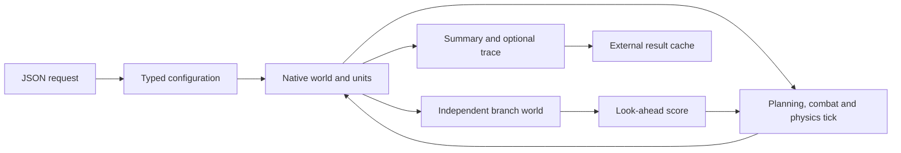

# Native C++ performance rework — architecture review and plan

**Status: OWNER_APPROVED — implementation in progress.**

Owner authorization: 2026-10-04, following revision 2 and its self-review:
"lets do it". This approves stages A–F and their engineering checks below.

Revision 2 incorporates the [adversarial self-review](PERFORMANCE_REWORK_REVIEW.md).
This is a revised proposal, not independent acceptance or a claim that the
working code's defects have been repaired.

Scope: exploratory Astelia sandbox engineering under decision 0028, entirely
inside `evidence/tactical_composition_demo/astelia_cpp/`. This is not a GeoMind
milestone or an authorization to run an AI experiment.

## 1. The requested outcome

Build a properly structured C++ simulator that is at least **3x faster** than
fresh, uncached JavaScript on the existing 50 full-army fights. **5x** is the
target. Measure single-thread elapsed time; CPU time is supporting evidence.
Neither saved combat results nor parallel fight workers count toward this gate.
The same minimum must also pass on separately reported branching workloads:
elite, elite-fast, and artillery rollout under game rules. The original 50
requests remain the primary gate, but cannot qualify features they never invoke.

The owner has allowed a substantial rewrite and relaxed exact JS matching.
Therefore, the frozen JS is a historical behavior and timing baseline, rather
than a requirement to reproduce its dynamic runtime and every floating-point
bit. Preserve combat features and rules. Record numerical differences and any
deliberate bug repair. Tactic improvements and changed combat balance are separate
work, because they would obscure whether this rewrite improves engine speed.

The owner's plan-first request was completed, followed by approval of revision 2.
Implementation and its bounded engineering checks are now authorized. Earlier
optimization work remains a development snapshot, not an
accepted engine. The original `PORT_REQUEST_CODEX.md` and S1b plan remain as
historical records; this proposed contract replaces their exact-match requirement
only for the new engine under the approved scope.

## 2. What is proven, and what is not

| Version | Evidence | Result |
|---|---|---|
| Original committed port, `797ced26` | `checks_r2`, `PORT_REPORT.md` | 623 matching outcomes, including 98 matching known errors; 20 matching traces. Native execution, but 4.99x slower by elapsed time than JS. |
| Last measured complete optimization version, r9 | `perf_benchmark_r9/benchmark.json` | All 50 results match; both engines execute 50 fights and 30,000 outer steps, with zero cache hits. JS: 37.817 s wall / 33.501 s user CPU. C++: 32.346 s wall / 18.223 s user CPU. Speed-up: **1.169x wall**, **1.838x user CPU**. Below the requirement. |
| Current working source | Uncommitted edits after r9 | Includes further changes to variable capture, field writes, compiler settings, and native geometry. It has **no complete validation or timing receipt**. Do not attribute r9 results to it. |

The r9 focused runtime/cache checks passed 14 tests. More checks were subsequently
added, so that result does not validate today's complete working tree.

Machine contention is material: the r9 one-minute load was approximately 32–40
on this 10-core machine. This limits precision, but does not turn 1.169x into a
3x pass. No passing performance claim exists yet.

The earlier JS measurement did **not** read cached combat results.
`verify_port.py` calls `compare.invoke`, and `js_host.cjs` creates and steps each
world. The new timing wrapper counts real calls to `create` and `step` as well.

Read-only inspection of the timing inputs found 16 alone, 15 novice, 13 regular
and 6 veteran profiles; opponents are fixed formations, and all durations are
20 seconds. There are **no elite/elite-fast profiles or explicit artillery
rollouts**. The existing wrappers count outer steps only: JS forks call the
lexically bound `step`, bypassing the exported wrapper. The current benchmark
does not establish internal branch-work counts, per-profile timing, or the 3x
gate; its successful exit means only its current consistency checks passed.

## 3. Architecture and caller-path review

### Current native port

```text
JSON request
  -> main.cpp: fight
  -> simulation::create / step / done / summary
  -> generated formation_sim.cpp
  -> js_value.h and builtins.h compatibility machinery
  -> JSON result
```

`generate.cjs` translates the frozen source into 159 named C++ functions plus
anonymous lambdas. There is no JS interpreter inside the executable. However,
the generated simulation accepts `CallArgs` and returns tagged `V` values.
Units, worlds, decisions, projectiles, profiles, and formations remain generic
objects. The representation reproduces much of a dynamic language runtime.

Working changes already reduce some of that overhead: shared layouts, contiguous
property values, ordered hash indexes, object reuse, direct immediate callbacks,
and selected numeric kernels. These are useful measurements and possible reusable
components. They do not constitute the proposed typed engine.

### Responsibilities found in the source

| Responsibility | Source anchors | Rewrite implication |
|---|---|---|
| Configuration and profiles | `formation_sim.js:244`, `:266`, `:304`, `:355` | Resolve defaults, skills and profile names once at creation; use typed settings in the simulation. |
| World construction | `:708` | Cover mirrored, carried and asymmetric armies, hunters, custom kinds, player and skirmish spawning. Initialization cannot assume only the default 100-unit case. |
| Team/perception queries | `:797`, `:816` | Maintain reusable active/team/role index buffers with explicit invalidation on death and spawn. Perception is part of the rules. |
| Spatial geometry | `:850`, `:871`, `:2845` | Separate live movement grid, projectile-phase grid and collision neighbors. Preserve each phase's freshness and geometric hit rules. |
| Decisions and actions | `:2447`, `:2473` | Replace allocated decision objects with a typed decision record; retain decision-before-action ordering and cast release checks. |
| Tick lifecycle | `:2868` | Pack planning, reflexes, shuffled decisions, prepared casts, actions, damage, projectiles, separation, velocity updates and spawning have meaningful order. Faster storage does not justify dropping phases. |
| Forks | `:3033` | Copy mutable state and RNG state; share immutable settings. Remap or invalidate unit/projectile references and rebuild derived caches. |
| Network inference | `:3084`, `:3121` | Load weights once into flat numeric buffers; extract features and perform dense numeric loops. Preserve feature and plan-index definitions. |
| Look-ahead / rollouts | `:3131` and artillery planner | Reuse branch scratch worlds. Retain configured horizons, candidate/model budgets and artillery checks. Disabling them cannot count as optimization. |
| Completion and reporting | `:3281`, `:3286` | Keep duration/elimination conditions and summary fields explicit and testable. |

`fork` is a particular architectural risk. Its present copy handles targets,
limbs, manual casts, decisions, shots, shell sources, damage-over-time records,
pending damage, flank membership, director state and artillery queues. A rewrite
that copies positions alone would silently break elite profiles.

### Measured costs

The r4b sample contains 8,300 main-thread samples. Selected leaf counts:
distance 654; string property-index lookup 599; line blocker 466; one allocator
free routine 423; ordered-map lookup 390; separation 208. These describe r4b,
not the current source. They are sampling evidence, not exact percentages or
independent costs to add together.

The [research comparison](PERFORMANCE_RESEARCH.md) links primary C++ Guidelines,
V8 and Clang sources. The practical conclusion is to remove dynamic representation
and allocation from the simulation loops before relying on compiler tuning.
There is no evidence that compiler flags alone will deliver 3–5x.

## 4. Proposed native data model

Use **contiguous typed records** as the initial candidate. A hot/cold split and
the choice between records and columns remain hypotheses to measure, not proven
optimal choices. Casting, energy, protection and dodge fields are read during
game ticks; calling them "cold" does not establish infrequent access. Freeze
the field-access/lifetime inventory in stage A. In stage B, a bounded comparison
of record and column layouts for geometry/perception and branch copies resolves
the blocking representation choice before the rest of the engine is ported.
Keep identical operations and traversal order in that comparison; do not grow
a general entity-component framework without measured need.

| Data | Proposed representation | Lifetime and authority |
|---|---|---|
| Unit identity | `UnitId` and an ID-to-slot table | IDs remain stable for a fight. Append initial slots and compact active indexes; define reclamation before long spawning workloads. Never reuse an identity or leave dangling slot references. |
| Frequently read unit state | `vector<UnitHot>`: position, velocity, HP, cooldown, radius, speed, range, damage, target ID, team, role and flags | One authoritative typed record per unit. No mirrored property dictionary. |
| Conditional unit state | Indexed ability / player records, with the split measured in stage B | Casting, energy, protection, dash/block state, limbs, orders and role-specific fields. Explicit defaults and optional states; frequently accessed game fields stay near the tick data. |
| Decisions | `Decision` with a move record, target ID, release enum and flags | Reset in place each decision tick. No allocated object or string dispatch. |
| Projectiles and effects | Typed vectors of shots, shells, fields and damage-over-time records | Reuse capacities. References are world-local IDs. Preserve ordering where it affects hits. |
| Pack state | Two typed `Pack` records with optional presence | Anchor, formation/tactic settings, focus, flank, director, artillery queue and look-ahead state. |
| Geometry callbacks | Explicit `ZoneContext` and `ThreatContext` plus functions | Replace stored closures with data describing the query. Their references belong to the current world. |
| Pending damage / squad assignments | Arrays indexed by unit slot, with validity flags or generation stamps | Avoid hash lookups for dense unit identity. Use ordered index lists where iteration matters. |
| Spatial grid | Reusable numeric cells and contiguous unit-index lists | Derive query extents from actual radii. Bounded arena cells plus explicit overflow cells; collision-free cell coordinates, no fixed-size truncation. Preserve candidate/tie order. |
| Profiles, rules, kinds and tables | Immutable typed configuration plus a name/ID registry | Parse strings and custom JSON once. Different worlds hold their own rule/config references; no process-global rule switching. |
| Network | Flat `vector<double>` matrices and reusable feature/hidden buffers | Immutable weights shared across worlds. Intermediate buffers are branch-local. |
| RNG | Small explicit state record | A copy contains the full state. Keep the established seed conversion and draw schedule unless a change is separately recorded. |
| World copy | Typed state copy into reusable branch storage | Copy every mutable record, share immutable config/network, clear derived caches. No tracing garbage collector. |

Unit/world simulation headers must not depend on `V`, `CallArgs`, `Var`, generic
object properties, or `std::function`. JSON values belong to the CLI/configuration
boundary. Unknown or unsupported request fields must have a documented policy;
the rewrite must not silently discard supported features.

The feature ledger covers the simulation API (`create`, `step`, `done`,
`summary`, `run`, `fork`, opponent drawing/resolution and network loading),
not just the CLI's fight subset. List browser-only exclusions. Specify JSON
defaults, null/absent handling, merge precedence, custom kinds, profile/skill
overrides, all summary fields and batch/mixed-rule behavior. Malformed or
unsupported inputs get an explicit error, not a plausible partial fight.

Branch storage is leased by nesting depth; a nested rollout must never reuse
its parent's buffer. IDs resolve only against the owning world. The clone
ledger distinguishes decision state, telemetry, intentionally reset state and
immutable data; reset derived grids/contexts and all stale membership stamps.
Retain dead entities only while a supported effect, trace or order needs them;
unreferenced history must not inflate every fork indefinitely. Preserve compact
trace history separately. Record peak memory, retained slots and buffer growth
on long spawn/death cases. Overflow grows storage or reports an explicit resource
error; it must never silently discard units, projectiles or branch candidates.



The JS baseline runs separately for comparison and uncached timing. It is not
part of a native combat step.

Proposed modules under `src/native/`:

```text
types.h          config.h/.cpp       world.h/.cpp
geometry.h/.cpp  spatial.h/.cpp      combat.h/.cpp
abilities.h/.cpp formations.h/.cpp   tactics.h/.cpp
lookahead.h/.cpp network.h/.cpp      codec.h/.cpp
host.cpp
```

Develop as `build/astelia_native`; keep the legacy comparison path available.
`build.py` will use explicit source lists for each executable, rather than
accidentally linking two hosts through a wildcard. Switch the default only after
the complete native engine passes its gates and review.

## 5. Numeric and behavior contract

Use `double` initially. Use squared distance for nearest/range comparisons where
the comparison is mathematically equivalent; handle negative ranges, zero and
extreme values explicitly. Use ordinary native Euclidean length with a safe
overflow/underflow fallback. Platform transcendental functions are permissible
under the relaxed matching requirement, with deterministic repeated execution
on the tested build and machine.

Keep `-ffast-math` disabled for this plan. Bit-exact V8 arithmetic is no longer a
goal, but silently permitting non-finite/reassociated arithmetic throughout the
engine would make defects harder to locate. Compiler optimization, host tuning
and LTO are supporting steps with recorded build identities. PGO is optional
only after the structural rewrite and a representative development workload.

Baseline outcome differences are reported, not hidden. Independently validate
mechanics such as reach, blocker selection, protection, cooldown/energy use,
spawn/death handling, cast commitment, friendly fire and fork independence.
Agreement with JS alone cannot validate a shared bug.

Use small independent analytical checks with declared numeric tolerances and
boundary/tie policies. A whole-fight outcome tolerance would conceal defects
in this chaotic simulation. Keep stable traversal/tie order, timestep, event
phase order and RNG draw rules unless a specific change is recorded. Finite
valid-input bounds, nonnegative radii, positive timestep, arena dimensions and
network matrix shapes must be validated before native indexing. Define handling
of invalid seeds/options rather than relying on C++ conversions or assertions.

The spatial rewrite must repair these inherited assumptions explicitly:

* Game melee radius is 16, but both blocker grids expand a segment by only 12,
  while the narrow-phase threshold is `radius + 1.5`. A horizontal live-grid
  query at y=53 misses a radius-16 blocker at y=39: its center is in cell 0,
  while the queried rows start at cell 1 (cell size 40).
* Separation uses cells of 24 and only adjacent cells. Radius-16 bodies at
  x=23 and x=48 overlap by 7, but occupy cells 0 and 2 and are never paired.
* `cx * 4096 + cy` is not a unique coordinate encoding without bounds on `cy`.

These are analytical counterexamples from source inspection, not new simulation
runs. Compare native broad-phase candidate/hit results against independent
all-body/all-pair checks over boundaries, custom radii, negative/overflow cells,
movement, spawn and death. Derive blocker padding from maximum current radius
plus the authored margin; derive separation neighbor reach from pair radii.
Freeze the repair ledger before timing. Keep the frozen JS unchanged and record
the resulting native behavior differences, including the existing coincident-
center and tie policies. Numeric matching relaxation does not waive this gate.

The known non-game artillery null-queue defect may be repaired in the native
engine as an explicit change in the coverage ledger. Its formerly failing
cases must complete and receive focused checks. Leave frozen JS and committed
receipts unchanged; report historical errors separately. Successful completion
cannot be claimed by suppressing an error or skipping a mechanic.

## 6. Implementation stages after approval

2026-10-05 final engineering checkpoint: A–E are implemented and F's engineering gates pass. All 159 function responsibilities, table/combo callbacks and native API paths have module/check ownership. Production records pass the corrected equal-caller/runtime-filter geometry and complete-authority copy gates in [native_costs_r4](native_costs_r4/README.md). The earlier probes were dispatch-biased; their selection claim is withdrawn, and raw failed diagnostics remain unchanged. The final source passes 158 checks, combined address/undefined-behavior contracts, all 623 requests, twenty complete invariant-checked traces and 27 fresh deterministic repeats. The separate work audit verifies configured branch horizons/budgets and actual search/rollout execution. The four elapsed speed-ups are 14.228x basic50, 12.918x elite, 9.498x elite-fast and 15.261x artillery rollout. The authoritative engineering receipt is [qualification.json](native_qualification_r1/qualification.json). Whole-fight parity remains relaxed; natural work and policy differences are recorded. No independent acceptance or scientific promotion is claimed, and the cross-family review remains a future experiment prerequisite, not a pause in the authorized migration.

| Stage | Deliverable | Completion gate | Work estimate |
|---|---|---|---|
| A. Freeze the engineering contract | Feature/clone/field-access ledgers; workload/input hashes; native API, input constraints and behavior-change list | Every supported feature has an owner module and a check. Fix original 50 and supplemental workloads, timing order, metrics and success rules before timings. | 1–2 h |
| B. Native core and architecture checkpoint | Typed configuration, units/world, RNG, geometry, grid, create/step/done/summary; simplest brain; bounded record/column and copy comparison | Independent geometry/mechanics checks pass; deterministic basic fights complete; native hot path has no dynamic JS runtime. Profile the vertical slice; C–E may be prototyped under the owner continuation instruction, but select and validate the production layout before F qualification. | 4–6 h, provisional |
| C. Complete combat | Shots/shells, sandbox abilities, game casting/energy, dodge/block, player limbs, effects and all spawn modes | Focused mechanics and scenario checks cover both rules and all unit/ability variants. | 3–5 h |
| D. Tactics and formations | All brains, presets, plans, skills, target ranking and explicit pack contexts | Feature ledger complete for non-look-ahead behavior; no features silently disabled for speed. | 4–6 h |
| E. Branching AI | Independent native forks, network features/inference, look-ahead, elite-fast/elite and artillery rollout | Parent world remains unchanged after branch execution; branch state and RNG are independent; budgets/horizons retained. | 3–5 h |
| F. Validate and qualify | Complete engineering checks, uncached timings, cache/replay proof, report and independent review | All gates below pass; remaining differences/limits stated. | 2–4 h plus review |

Estimated total: **17–28 hours of implementation/check work**, approximately
**2–4 working days**, with substantial uncertainty in game casting and fork state.
This is a provisional estimate, not a delivery commitment or a measured cost.
Re-estimate at the stage-B checkpoint using completed feature coverage and actual
remaining work. If the slice still spends substantial time in dynamic state,
allocation or copying, revise the design before completing the large port.
This is more honest than promising that a complete native redesign will take
another few minutes. The existing mechanical port provides a feature map and
diagnostic baseline, but not a typed architecture to reuse wholesale.

Finish each complete planned change batch before its appropriate tests. Early
tests or timing probes require a stated blocking question; no routine repeated
full-suite runs. No source edits while a long validation/timing run is active.
Announce expected duration before multi-minute runs.

## 7. Qualification and timing

1. **Build admission:** bind every compiled source/header, generator if used,
   compiler executable/version, flags, build commands, binary, host/codec and
   network to a manifest. Reject source/binary mismatches before testing or
   cache lookup. Check identities again after the run; concurrent changes
   invalidate the run. Keep separate qualification for host-tuned and portable
   builds; one cannot inherit the other's determinism/performance result.
2. **Feature coverage:** use the existing 623 requests as engineering coverage,
   including profiles, opponents, both placements, rules, abilities, skills,
   custom kinds, players, skirmish and carried/asymmetric armies. Record outcomes
   and changed/unchanged results. These are not fresh scientific judging seeds.
   The relaxed evaluator visits every request instead of aborting at the first
   JS difference. Classify numerical drift, declared repair, unexplained
   mechanics difference and error separately. A historical JS error is never
   counted as a successful native combat. Existing strict tools remain for
   changes that explicitly claim exact equivalence.
3. **Native correctness:** focused mechanics checks plus trace invariants: finite
   state, unique IDs, valid references, lawful damage/cooldown/energy transitions,
   completion, and independent forks. Retain 20 representative complete traces
   for inspection; exact JS trace equality is diagnostic only.
   Fresh execution is mandatory for correctness and fork isolation. Cached
   results can accelerate later comparisons, but cannot prove new code works.
   Include lifetime/bounds instrumentation in the development checks and a
   long spawn/death stress case. Repeat isolation after nested rollouts and
   buffer reuse, not just after a single freshly allocated fork.
4. **Determinism:** two fresh native executions of a fixed coverage subset must
   reproduce results. Cache hits cannot serve as a determinism test.
5. **Single-thread speed:** the same 50 full-army requests, complete features,
   fresh JS and native processes, no tracing, result cache bypassed. Record
   fight counts, outer/internal step counts, branch counts, wall/user/system
   time, load, machine/compiler/source/network identities and outputs.
   Add three separately timed fixed supplemental groups: elite, elite-fast and
   game-rule artillery rollout. Freeze their concrete requests in stage A using
   existing coverage cases; require positive execution of the intended search
   and inference paths. Groups that never enter contact/search do not qualify
   those paths. Report per-request or per-group time, not just aggregate time.
   Reject missing/extra rows, errors, invalid summary schemas, incomplete fights
   or input/output identity mismatches before calculating a speed-up.
6. **Work audit:** instrument internal JS `step`/`fork` call sites in a separately
   hashed development copy under this folder; do not edit the frozen snapshot.
   Check that instrumentation preserves its outputs. Audit both engines' outer
   steps, branch steps, candidate/model budgets, horizons, search/inference calls
   and unit/projectile work. If instrumentation materially changes timing, use
   it for a separate work audit and time the unchanged hosts; bind both outputs
   to identical requests/builds. Exported-step counts alone prove no branch work.
   Natural termination and outcome-dependent search counts may differ under
   the relaxed contract; report them and preserve configured budgets. Add
   matched-state geometry, inference and fork/playout probes with fixed operation
   counts to distinguish lower execution cost from doing less combat work.
   An outcome-shortening effect alone cannot qualify engine speed. Keep the
   end-to-end gate as well as this supporting evidence; dividing elapsed time
   by outer ticks alone does not normalize variable branch/unit work.
7. **Contended measurements:** use a predeclared balanced order of fresh
   processes (JS/native/native/JS), with the same request order in each process,
   and report every measurement. Use the ratio of the sum of JS elapsed times
   to the sum of native elapsed times for the paired result.
   Do not select the fastest run. If load prevents a credible timing conclusion,
   leave performance unqualified pending a quieter measurement.
8. **Performance gate:** elapsed-time speed-up of at least **3x** on the original
   50 and on each of the three supplemental groups. **5x** is the stretch target.
   The work audit and native correctness must also pass. A below-minimum result
   produces a failing qualification status/exit, not merely an informational
   speed ratio. Thread workers, cached outcomes, disabled work or shortened
   configured horizons cannot pass. Different natural completion ticks are
   reported, not automatically treated as a mechanics failure.
9. **Review:** independent Claude review of committed engineering evidence before
   this engine becomes the basis for a new AI experiment. Engineering success
   does not accept a GeoMind milestone or transfer a JS-measured ladder unchanged.

The existing ladder was measured on JS. Once native numerical behavior changes,
its scores are historical context; a future native AI comparison needs a ladder
measured on the qualified native engine under its separately approved protocol.
No such remeasurement is authorized by this plan.

## 8. Result caching

Keep caching outside the simulator. The key binds the complete request, engine
and codec identity, config/network identity, RNG/schema version, and any behavior
version. A changed native executable or rule configuration invalidates results.
Store raw summaries and optional traces with checksums and provenance. Distinguish
legacy JS imports from freshly executed native results.

A repeated comparison should execute **zero** new fights. A changed seed, skill,
rule, executable or network must execute again. A source edit without a matching
build must block admission until rebuilt; the old executable cannot be presented
as the new source. Bind the evaluator/codec version and validate the entire
operation-specific result schema, trace frame order and final summary. Store
schema-validated error results separately from successful fights. Corrupt,
truncated or incompatible entries must be rejected. Checksum validation detects
accidental corruption; it does not authenticate a result edited with a new
checksum. Trust imported historical rows only through the pinned committed
receipt, and label locally produced rows with their provenance. Record
hit/miss/execution counts so cached comparison cannot become a timing result.

The current `result_cache.py` and strict `verify_cached.py` do not implement
all these gates. Repair them in the approved batch. Repeated-cache, invalidation,
malformed-row and fresh-versus-cached equality checks are cache qualification;
they are separate from fresh native correctness and performance qualification.

## 9. Stop conditions

| Yes/no condition | One action | Responsible role |
|---|---|---|
| Is this plan approved? **No** | Stop implementation and project execution. | Implementer |
| Does a supported feature lack typed state or a check? **Yes** | Complete its ledger entry before qualifying the engine. | Implementer |
| Does build admission or a result schema fail? **Yes** | Reject the run/cache entry. | Implementer |
| Does the spatial broad phase disagree with its independent oracle? **Yes** | Repair geometry before qualification. | Implementer |
| Can a fork mutate or reference its parent state? **Yes** | Repair isolation before further branch qualification. | Implementer |
| Does a native mechanics/determinism check fail? **Yes** | Repair the defect before qualification. | Implementer |
| Did a timing path reuse results or disable work? **Yes** | Reject that measurement. | Implementer |
| Did a supplemental workload execute no intended branch/inference work? **Yes** | Repair its representative workload before qualification. | Implementer |
| Is the complete credible elapsed-time speed-up below 3x? **Yes** | Profile and revise the native architecture before claiming readiness. | Implementer |
| Does machine contention prevent a credible measurement? **Yes** | Defer the performance verdict. | Implementer |
| Does a proposed change alter tactics, balance, timestep or search budget? **Yes** | Decide it as a separate behavior change. | Owner |
| Does independent review require repairs? **Yes** | Complete one repair batch before the appropriate fresh checks. | Implementer |

Approval is for stages A–F and their engineering checks within this folder.
It is not approval for controller training, a recorded scientific panel, edits
to frozen source/evidence, or promotion of milestone status.

## 10. Drafter self-audit

Revision 1 overgeneralized from an incomplete timing workload and a historical
profile. It selected hot/cold placement before an access inventory, treated
exact tick counts as compatible with relaxed outcomes, and left geometry,
build/cache admission and nested lifetime checks too vague. These were drafting
defects, not evidence that the typed redesign had already succeeded.

Revision 2 adds branching-specific gates, full result/schema and build admission,
an independent spatial oracle with source counterexamples, explicit branch and
entity lifetimes, a bounded early layout checkpoint, and exhaustive diagnostic
coverage. The working implementation is unchanged by this document revision.
Its repairs remain required work; this self-audit does not replace cross-family
review. No tests, benchmarks or simulation runs were performed for this review.


2026-10-05 self-audit correction: the earlier progress paragraph still described
C–D as entirely pending after their development checkpoints, and the B wording
implied migration prototypes required accepted layout selection first. Cause:
the status text was not refreshed alongside staged implementation and the
owner continuation instruction. Corrected above without accepting B or relaxing
its production-kernel/complete-copy gate. This documentation correction required
no simulation run.

2026-10-05 final self-audit: the record/column probe initially mixed constant-specialized direct kernels with a generic production wrapper and repeated candidate acquisition. Cause: the probe matched outputs/counts but failed to hold caller dispatch/filter specialization constant. Corrected with identical runtime query parameters and caller work; production selects records after the corrected geometry and complete-copy gates. The unnecessary mirrored geometry cache was removed. Failed diagnostics remain retained without qualification claims. Current status prose and run instructions now point to the typed target and bound final evidence rather than the historical novice-only checkpoint.
