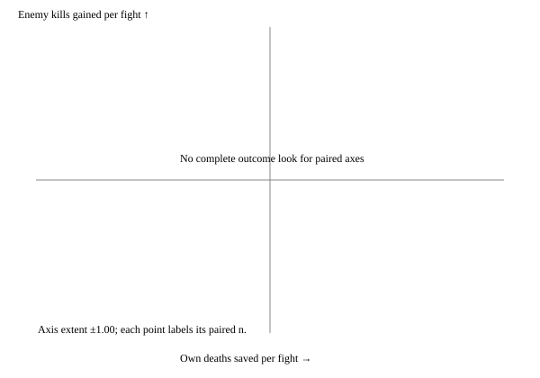

Prepared development observations; no acceptance claim

All atoms are script; V2 is script/search. Selected common timing, its independent script/RRG label and selection hash are reported below. Each shape reports both axes over all fights with won/lost/timeout splits. Exchange is a ratio of totals; a zero-death denominator is null with its raw kills retained. Single-fight wins are descriptive.



Mechanism first at 20 pairs; Claude reads actual activation and metric movement. Rotation primary is E1+R1 versus E1, after E1 activates; R1 versus base is diagnostic. All 20 tactic cells are shown, including empty cells. C3 stops at a clear 50/100/200 look; surviving shapes enter ten paired ten-fight series, streak primary. Shots lost are the paired shots_fired delta; triggered survival is observational and predicted deaths are counterfactual, not proven deaths prevented. Heavy diagnostics off.

```json
{
  "status": "PREPARED_DEVELOPMENT_ONLY",
  "labels": {
    "base": "script",
    "V2": "script/search",
    "E1": "script",
    "R1": "script",
    "E1+R1": "script"
  },
  "common_timing": {
    "mode": "base",
    "k": 1,
    "radius": 400
  },
  "timing_label": "script",
  "timing_selection_sha256": "64595489612e73fdac7a65c5ae355c37e1aa4b4885ef8e9f225f7cc9254872e1",
  "reading": [
    "Mechanism must activate and move declared metric at 20 pairs; else park.",
    "Own deaths over ALL paired fights and kills per own death are decision axes; single-fight wins descriptive.",
    "C3: stop clearly better/worse or invisible at <=200 pairs; no extra sampling.",
    "Rotation primary against E1; require active in-range ranged evidence.",
    "Series: paired streak primary; survival first among competing slots."
  ],
  "arms": {
    "E1": {
      "mechanism": {
        "arms": {
          "base": {
            "n": 20,
            "wins": 20,
            "losses": 0,
            "timeouts": 0,
            "own_deaths_per_fight": {
              "n": 20,
              "mean": 0.0
            },
            "own_losses_on_wins": {
              "n": 20,
              "mean": 0.0
            },
            "own_losses_on_losses": {
              "n": 0,
              "mean": null
            },
            "own_losses_on_timeouts": {
              "n": 0,
              "mean": null
            },
            "own_losses_on_nonwins": {
              "n": 0,
              "mean": null
            },
            "exchange_rate": null,
            "zero_own_deaths": true,
            "kills_per_minute": 53.162687669208935,
            "damage_per_shell": null,
            "damage_per_shot": 5.911963157331049,
            "false_extractions": {
              "status": "not_evaluated",
              "reason": "No untreated continuation; no causal false-extraction estimate."
            },
            "mechanism": {
              "targets_per_shell": {
                "n": 0,
                "mean": null
              },
              "shells_per_kill": {
                "n": 0,
                "mean": null
              },
              "fire_rate_shells_per_gun_minute": {
                "n": 0,
                "mean": null
              },
              "firepower_utilization": {
                "n": 20,
                "mean": 0.5451761753206565
              },
              "in_range_seconds": {
                "n": 20,
                "mean": 837.2999999998958
              },
              "ready_to_fire_seconds": {
                "n": 20,
                "mean": 230.89333333331828
              },
              "shots_fired": {
                "n": 20,
                "mean": 466.85
              },
              "reaction_override_seconds": {
                "n": 20,
                "mean": 75.63666666666326
              },
              "ranged_deaths": {
                "n": 20,
                "mean": 0.0
              },
              "rotation_activations": {
                "n": 20,
                "mean": 0.0
              },
              "counterfactual_predicted_deaths": {
                "n": 20,
                "mean": 0.0
              },
              "triggered_unit_survival": {
                "n": 0,
                "mean": null
              },
              "rotation_trigger_contract_violations": {
                "n": 20,
                "mean": 0.0
              },
              "rotation_seconds": {
                "n": 20,
                "mean": 0.0
              }
            },
            "totals": {
              "own_lost": 0,
              "enemy_kills": 600,
              "enemy_damage": 55200,
              "own_shells": 0,
              "shots_fired": 9337,
              "shell_damage": 0,
              "shot_damage": 55200,
              "t_end": 677.1666666666795,
              "rotation_activations": 0,
              "triggered_units": 0,
              "triggered_unit_survivors": 0,
              "rotation_trigger_contract_violations": 0,
              "counterfactual_predicted_deaths": 0,
              "planner_assignments": 0,
              "ranged_seconds": 20315.00000000003,
              "eligible_seconds": 2512.7999999998756,
              "ready_to_fire_seconds": 4617.866666666366,
              "in_range_seconds": 16745.999999997915,
              "reaction_override_seconds": 1512.7333333332651,
              "ranged_deaths": 0,
              "engagement_floor_ticks": 0,
              "rotation_seconds": 0.0
            },
            "survivors_by_role": {
              "melee": {
                "n": 20,
                "mean": 0.0
              },
              "ranged": {
                "n": 20,
                "mean": 30.0
              },
              "artillery": {
                "n": 20,
                "mean": 0.0
              }
            }
          },
          "E1": {
            "n": 20,
            "wins": 20,
            "losses": 0,
            "timeouts": 0,
            "own_deaths_per_fight": {
              "n": 20,
              "mean": 0.0
            },
            "own_losses_on_wins": {
              "n": 20,
              "mean": 0.0
            },
            "own_losses_on_losses": {
              "n": 0,
              "mean": null
            },
            "own_losses_on_timeouts": {
              "n": 0,
              "mean": null
            },
            "own_losses_on_nonwins": {
              "n": 0,
              "mean": null
            },
            "exchange_rate": null,
            "zero_own_deaths": true,
            "kills_per_minute": 53.162687669208935,
            "damage_per_shell": null,
            "damage_per_shot": 5.911963157331049,
            "false_extractions": {
              "status": "not_evaluated",
              "reason": "No untreated continuation; no causal false-extraction estimate."
            },
            "mechanism": {
              "targets_per_shell": {
                "n": 0,
                "mean": null
              },
              "shells_per_kill": {
                "n": 0,
                "mean": null
              },
              "fire_rate_shells_per_gun_minute": {
                "n": 0,
                "mean": null
              },
              "firepower_utilization": {
                "n": 20,
                "mean": 0.5451761753206565
              },
              "in_range_seconds": {
                "n": 20,
                "mean": 837.2999999998958
              },
              "ready_to_fire_seconds": {
                "n": 20,
                "mean": 230.89333333331825
              },
              "shots_fired": {
                "n": 20,
                "mean": 466.85
              },
              "reaction_override_seconds": {
                "n": 20,
                "mean": 75.63666666666327
              },
              "ranged_deaths": {
                "n": 20,
                "mean": 0.0
              },
              "rotation_activations": {
                "n": 20,
                "mean": 0.0
              },
              "counterfactual_predicted_deaths": {
                "n": 20,
                "mean": 0.0
              },
              "triggered_unit_survival": {
                "n": 0,
                "mean": null
              },
              "rotation_trigger_contract_violations": {
                "n": 20,
                "mean": 0.0
              },
              "rotation_seconds": {
                "n": 20,
                "mean": 0.0
              }
            },
            "totals": {
              "own_lost": 0,
              "enemy_kills": 600,
              "enemy_damage": 55200,
              "own_shells": 0,
              "shots_fired": 9337,
              "shell_damage": 0,
              "shot_damage": 55200,
              "t_end": 677.1666666666795,
              "rotation_activations": 0,
              "triggered_units": 0,
              "triggered_unit_survivors": 0,
              "rotation_trigger_contract_violations": 0,
              "counterfactual_predicted_deaths": 0,
              "planner_assignments": 0,
              "ranged_seconds": 20315.00000000003,
              "eligible_seconds": 2512.799999999875,
              "ready_to_fire_seconds": 4617.866666666365,
              "in_range_seconds": 16745.999999997915,
              "reaction_override_seconds": 1512.7333333332654,
              "ranged_deaths": 0,
              "engagement_floor_ticks": 0,
              "rotation_seconds": 0.0
            },
            "survivors_by_role": {
              "melee": {
                "n": 20,
                "mean": 0.0
              },
              "ranged": {
                "n": 20,
                "mean": 30.0
              },
              "artillery": {
                "n": 20,
                "mean": 0.0
              }
            }
          }
        },
        "paired": {
          "base minus E1": {
            "n": 20,
            "unmatched_pairs": 0,
            "differences": {
              "win": {
                "n": 20,
                "mean": 0.0
              },
              "own_lost": {
                "n": 20,
                "mean": 0.0
              },
              "enemy_kills": {
                "n": 20,
                "mean": 0.0
              },
              "kills_per_own_death": {
                "n": 0,
                "mean": null
              },
              "damage_per_shell": {
                "n": 0,
                "mean": null
              },
              "damage_per_shot": {
                "n": 20,
                "mean": 0.0
              },
              "kills_per_minute": {
                "n": 20,
                "mean": 0.0
              },
              "shots_fired": {
                "n": 20,
                "mean": 0.0
              },
              "firepower_utilization": {
                "n": 20,
                "mean": 0.0
              },
              "in_range_seconds": {
                "n": 20,
                "mean": 0.0
              },
              "rotation_activations": {
                "n": 20,
                "mean": 0.0
              }
            },
            "axis_plot": {
              "own_deaths_saved": {
                "n": 20,
                "mean": 0.0
              },
              "enemy_kills_gained": {
                "n": 20,
                "mean": 0.0
              },
              "enemy_damage_gained": {
                "n": 20,
                "mean": 0.0
              }
            }
          }
        },
        "complete": true,
        "mechanism_gate_observations": {
          "activated": false,
          "active_ranged": true,
          "metric_movement": "Claude must read paired metric movement, guards and tradeoffs; activation alone is insufficient."
        },
        "drills": {
          "D5": {
            "arms": {
              "base": {
                "n": 20,
                "wins": 20,
                "losses": 0,
                "timeouts": 0,
                "own_deaths_per_fight": {
                  "n": 20,
                  "mean": 0.0
                },
                "own_losses_on_wins": {
                  "n": 20,
                  "mean": 0.0
                },
                "own_losses_on_losses": {
                  "n": 0,
                  "mean": null
                },
                "own_losses_on_timeouts": {
                  "n": 0,
                  "mean": null
                },
                "own_losses_on_nonwins": {
                  "n": 0,
                  "mean": null
                },
                "exchange_rate": null,
                "zero_own_deaths": true,
                "kills_per_minute": 53.162687669208935,
                "damage_per_shell": null,
                "damage_per_shot": 5.911963157331049,
                "false_extractions": {
                  "status": "not_evaluated",
                  "reason": "No untreated continuation; no causal false-extraction estimate."
                },
                "mechanism": {
                  "targets_per_shell": {
                    "n": 0,
                    "mean": null
                  },
                  "shells_per_kill": {
                    "n": 0,
                    "mean": null
                  },
                  "fire_rate_shells_per_gun_minute": {
                    "n": 0,
                    "mean": null
                  },
                  "firepower_utilization": {
                    "n": 20,
                    "mean": 0.5451761753206565
                  },
                  "in_range_seconds": {
                    "n": 20,
                    "mean": 837.2999999998958
                  },
                  "ready_to_fire_seconds": {
                    "n": 20,
                    "mean": 230.89333333331828
                  },
                  "shots_fired": {
                    "n": 20,
                    "mean": 466.85
                  },
                  "reaction_override_seconds": {
                    "n": 20,
                    "mean": 75.63666666666326
                  },
                  "ranged_deaths": {
                    "n": 20,
                    "mean": 0.0
                  },
                  "rotation_activations": {
                    "n": 20,
                    "mean": 0.0
                  },
                  "counterfactual_predicted_deaths": {
                    "n": 20,
                    "mean": 0.0
                  },
                  "triggered_unit_survival": {
                    "n": 0,
                    "mean": null
                  },
                  "rotation_trigger_contract_violations": {
                    "n": 20,
                    "mean": 0.0
                  },
                  "rotation_seconds": {
                    "n": 20,
                    "mean": 0.0
                  }
                },
                "totals": {
                  "own_lost": 0,
                  "enemy_kills": 600,
                  "enemy_damage": 55200,
                  "own_shells": 0,
                  "shots_fired": 9337,
                  "shell_damage": 0,
                  "shot_damage": 55200,
                  "t_end": 677.1666666666795,
                  "rotation_activations": 0,
                  "triggered_units": 0,
                  "triggered_unit_survivors": 0,
                  "rotation_trigger_contract_violations": 0,
                  "counterfactual_predicted_deaths": 0,
                  "planner_assignments": 0,
                  "ranged_seconds": 20315.00000000003,
                  "eligible_seconds": 2512.7999999998756,
                  "ready_to_fire_seconds": 4617.866666666366,
                  "in_range_seconds": 16745.999999997915,
                  "reaction_override_seconds": 1512.7333333332651,
                  "ranged_deaths": 0,
                  "engagement_floor_ticks": 0,
                  "rotation_seconds": 0.0
                },
                "survivors_by_role": {
                  "melee": {
                    "n": 20,
                    "mean": 0.0
                  },
                  "ranged": {
                    "n": 20,
                    "mean": 30.0
                  },
                  "artillery": {
                    "n": 20,
                    "mean": 0.0
                  }
                }
              },
              "E1": {
                "n": 20,
                "wins": 20,
                "losses": 0,
                "timeouts": 0,
                "own_deaths_per_fight": {
                  "n": 20,
                  "mean": 0.0
                },
                "own_losses_on_wins": {
                  "n": 20,
                  "mean": 0.0
                },
                "own_losses_on_losses": {
                  "n": 0,
                  "mean": null
                },
                "own_losses_on_timeouts": {
                  "n": 0,
                  "mean": null
                },
                "own_losses_on_nonwins": {
                  "n": 0,
                  "mean": null
                },
                "exchange_rate": null,
                "zero_own_deaths": true,
                "kills_per_minute": 53.162687669208935,
                "damage_per_shell": null,
                "damage_per_shot": 5.911963157331049,
                "false_extractions": {
                  "status": "not_evaluated",
                  "reason": "No untreated continuation; no causal false-extraction estimate."
                },
                "mechanism": {
                  "targets_per_shell": {
                    "n": 0,
                    "mean": null
                  },
                  "shells_per_kill": {
                    "n": 0,
                    "mean": null
                  },
                  "fire_rate_shells_per_gun_minute": {
                    "n": 0,
                    "mean": null
                  },
                  "firepower_utilization": {
                    "n": 20,
                    "mean": 0.5451761753206565
                  },
                  "in_range_seconds": {
                    "n": 20,
                    "mean": 837.2999999998958
                  },
                  "ready_to_fire_seconds": {
                    "n": 20,
                    "mean": 230.89333333331825
                  },
                  "shots_fired": {
                    "n": 20,
                    "mean": 466.85
                  },
                  "reaction_override_seconds": {
                    "n": 20,
                    "mean": 75.63666666666327
                  },
                  "ranged_deaths": {
                    "n": 20,
                    "mean": 0.0
                  },
                  "rotation_activations": {
                    "n": 20,
                    "mean": 0.0
                  },
                  "counterfactual_predicted_deaths": {
                    "n": 20,
                    "mean": 0.0
                  },
                  "triggered_unit_survival": {
                    "n": 0,
                    "mean": null
                  },
                  "rotation_trigger_contract_violations": {
                    "n": 20,
                    "mean": 0.0
                  },
                  "rotation_seconds": {
                    "n": 20,
                    "mean": 0.0
                  }
                },
                "totals": {
                  "own_lost": 0,
                  "enemy_kills": 600,
                  "enemy_damage": 55200,
                  "own_shells": 0,
                  "shots_fired": 9337,
                  "shell_damage": 0,
                  "shot_damage": 55200,
                  "t_end": 677.1666666666795,
                  "rotation_activations": 0,
                  "triggered_units": 0,
                  "triggered_unit_survivors": 0,
                  "rotation_trigger_contract_violations": 0,
                  "counterfactual_predicted_deaths": 0,
                  "planner_assignments": 0,
                  "ranged_seconds": 20315.00000000003,
                  "eligible_seconds": 2512.799999999875,
                  "ready_to_fire_seconds": 4617.866666666365,
                  "in_range_seconds": 16745.999999997915,
                  "reaction_override_seconds": 1512.7333333332654,
                  "ranged_deaths": 0,
                  "engagement_floor_ticks": 0,
                  "rotation_seconds": 0.0
                },
                "survivors_by_role": {
                  "melee": {
                    "n": 20,
                    "mean": 0.0
                  },
                  "ranged": {
                    "n": 20,
                    "mean": 30.0
                  },
                  "artillery": {
                    "n": 20,
                    "mean": 0.0
                  }
                }
              }
            },
            "paired": {
              "base minus E1": {
                "n": 20,
                "unmatched_pairs": 0,
                "differences": {
                  "win": {
                    "n": 20,
                    "mean": 0.0
                  },
                  "own_lost": {
                    "n": 20,
                    "mean": 0.0
                  },
                  "enemy_kills": {
                    "n": 20,
                    "mean": 0.0
                  },
                  "kills_per_own_death": {
                    "n": 0,
                    "mean": null
                  },
                  "damage_per_shell": {
                    "n": 0,
                    "mean": null
                  },
                  "damage_per_shot": {
                    "n": 20,
                    "mean": 0.0
                  },
                  "kills_per_minute": {
                    "n": 20,
                    "mean": 0.0
                  },
                  "shots_fired": {
                    "n": 20,
                    "mean": 0.0
                  },
                  "firepower_utilization": {
                    "n": 20,
                    "mean": 0.0
                  },
                  "in_range_seconds": {
                    "n": 20,
                    "mean": 0.0
                  },
                  "rotation_activations": {
                    "n": 20,
                    "mean": 0.0
                  }
                },
                "axis_plot": {
                  "own_deaths_saved": {
                    "n": 20,
                    "mean": 0.0
                  },
                  "enemy_kills_gained": {
                    "n": 20,
                    "mean": 0.0
                  },
                  "enemy_damage_gained": {
                    "n": 20,
                    "mean": 0.0
                  }
                }
              }
            }
          }
        },
        "stage": "mechanism",
        "arm": "E1",
        "declaration_sha256": "90a75db931015123d39f7a816553c8c5866e5b6042a02d94f72698d3d1ee7e30"
      },
      "outcomes": {
        "50": {
          "arms": {
            "base": {
              "n": 50,
              "wins": 48,
              "losses": 2,
              "timeouts": 0,
              "own_deaths_per_fight": {
                "n": 50,
                "mean": 34.86
              },
              "own_losses_on_wins": {
                "n": 48,
                "mean": 34.229166666666664
              },
              "own_losses_on_losses": {
                "n": 2,
                "mean": 50.0
              },
              "own_losses_on_timeouts": {
                "n": 0,
                "mean": null
              },
              "own_losses_on_nonwins": {
                "n": 2,
                "mean": 50.0
              },
              "exchange_rate": 1.4193918531267928,
              "zero_own_deaths": false,
              "kills_per_minute": 67.3187102235793,
              "damage_per_shell": 23.366663834848357,
              "damage_per_shot": 5.165639344262295,
              "false_extractions": {
                "status": "not_evaluated",
                "reason": "No untreated continuation; no causal false-extraction estimate."
              },
              "mechanism": {
                "targets_per_shell": {
                  "n": 50,
                  "mean": 1.7555231104480888
                },
                "shells_per_kill": {
                  "n": 50,
                  "mean": 6.1509218980167715
                },
                "fire_rate_shells_per_gun_minute": {
                  "n": 50,
                  "mean": 34.30244709962913
                },
                "firepower_utilization": {
                  "n": 50,
                  "mean": 0.2556338910273138
                },
                "in_range_seconds": {
                  "n": 50,
                  "mean": 504.92466666678416
                },
                "ready_to_fire_seconds": {
                  "n": 50,
                  "mean": 509.31466666681337
                },
                "shots_fired": {
                  "n": 50,
                  "mean": 152.5
                },
                "reaction_override_seconds": {
                  "n": 50,
                  "mean": 245.143999999988
                },
                "ranged_deaths": {
                  "n": 50,
                  "mean": 24.2
                },
                "rotation_activations": {
                  "n": 50,
                  "mean": 0.0
                },
                "counterfactual_predicted_deaths": {
                  "n": 50,
                  "mean": 0.0
                },
                "triggered_unit_survival": {
                  "n": 0,
                  "mean": null
                },
                "rotation_trigger_contract_violations": {
                  "n": 50,
                  "mean": 0.0
                },
                "rotation_seconds": {
                  "n": 50,
                  "mean": 0.0
                }
              },
              "totals": {
                "own_lost": 1743,
                "enemy_kills": 2474,
                "enemy_damage": 325674,
                "own_shells": 11771,
                "shots_fired": 7625,
                "shell_damage": 275049,
                "shot_damage": 39388,
                "t_end": 2205.033333333336,
                "rotation_activations": 0,
                "triggered_units": 0,
                "triggered_unit_survivors": 0,
                "rotation_trigger_contract_violations": 0,
                "counterfactual_predicted_deaths": 0,
                "planner_assignments": 0,
                "ranged_seconds": 40090.60000000027,
                "eligible_seconds": 6479.53333333301,
                "ready_to_fire_seconds": 25465.733333340668,
                "in_range_seconds": 25246.23333333921,
                "reaction_override_seconds": 12257.1999999994,
                "ranged_deaths": 1210,
                "engagement_floor_ticks": 0,
                "rotation_seconds": 0.0
              },
              "survivors_by_role": {
                "melee": {
                  "n": 50,
                  "mean": 0.48
                },
                "ranged": {
                  "n": 50,
                  "mean": 5.8
                },
                "artillery": {
                  "n": 50,
                  "mean": 8.86
                }
              }
            },
            "E1": {
              "n": 0,
              "wins": 0,
              "losses": 0,
              "timeouts": 0,
              "own_deaths_per_fight": {
                "n": 0,
                "mean": null
              },
              "own_losses_on_wins": {
                "n": 0,
                "mean": null
              },
              "own_losses_on_losses": {
                "n": 0,
                "mean": null
              },
              "own_losses_on_timeouts": {
                "n": 0,
                "mean": null
              },
              "own_losses_on_nonwins": {
                "n": 0,
                "mean": null
              },
              "exchange_rate": null,
              "zero_own_deaths": true,
              "kills_per_minute": null,
              "damage_per_shell": null,
              "damage_per_shot": null,
              "false_extractions": {
                "status": "not_evaluated",
                "reason": "No untreated continuation; no causal false-extraction estimate."
              },
              "mechanism": {
                "targets_per_shell": {
                  "n": 0,
                  "mean": null
                },
                "shells_per_kill": {
                  "n": 0,
                  "mean": null
                },
                "fire_rate_shells_per_gun_minute": {
                  "n": 0,
                  "mean": null
                },
                "firepower_utilization": {
                  "n": 0,
                  "mean": null
                },
                "in_range_seconds": {
                  "n": 0,
                  "mean": null
                },
                "ready_to_fire_seconds": {
                  "n": 0,
                  "mean": null
                },
                "shots_fired": {
                  "n": 0,
                  "mean": null
                },
                "reaction_override_seconds": {
                  "n": 0,
                  "mean": null
                },
                "ranged_deaths": {
                  "n": 0,
                  "mean": null
                },
                "rotation_activations": {
                  "n": 0,
                  "mean": null
                },
                "counterfactual_predicted_deaths": {
                  "n": 0,
                  "mean": null
                },
                "triggered_unit_survival": {
                  "n": 0,
                  "mean": null
                },
                "rotation_trigger_contract_violations": {
                  "n": 0,
                  "mean": null
                },
                "rotation_seconds": {
                  "n": 0,
                  "mean": null
                }
              },
              "totals": {
                "own_lost": 0,
                "enemy_kills": 0,
                "enemy_damage": 0,
                "own_shells": 0,
                "shots_fired": 0,
                "shell_damage": 0,
                "shot_damage": 0,
                "t_end": 0,
                "rotation_activations": 0,
                "triggered_units": 0,
                "triggered_unit_survivors": 0,
                "rotation_trigger_contract_violations": 0,
                "counterfactual_predicted_deaths": 0,
                "planner_assignments": 0,
                "ranged_seconds": 0,
                "eligible_seconds": 0,
                "ready_to_fire_seconds": 0,
                "in_range_seconds": 0,
                "reaction_override_seconds": 0,
                "ranged_deaths": 0,
                "engagement_floor_ticks": 0,
                "rotation_seconds": 0
              },
              "survivors_by_role": {
                "melee": {
                  "n": 0,
                  "mean": null
                },
                "ranged": {
                  "n": 0,
                  "mean": null
                },
                "artillery": {
                  "n": 0,
                  "mean": null
                }
              }
            }
          },
          "paired": {},
          "look": 50,
          "complete": false,
          "per_tactic": {
            "regular": {
              "arms": {
                "base": {
                  "n": 3,
                  "wins": 3,
                  "losses": 0,
                  "timeouts": 0,
                  "own_deaths_per_fight": {
                    "n": 3,
                    "mean": 33.666666666666664
                  },
                  "own_losses_on_wins": {
                    "n": 3,
                    "mean": 33.666666666666664
                  },
                  "own_losses_on_losses": {
                    "n": 0,
                    "mean": null
                  },
                  "own_losses_on_timeouts": {
                    "n": 0,
                    "mean": null
                  },
                  "own_losses_on_nonwins": {
                    "n": 0,
                    "mean": null
                  },
                  "exchange_rate": 1.4851485148514851,
                  "zero_own_deaths": false,
                  "kills_per_minute": 77.56391841424804,
                  "damage_per_shell": 24.48502994011976,
                  "damage_per_shot": 4.933944954128441,
                  "false_extractions": {
                    "status": "not_evaluated",
                    "reason": "No untreated continuation; no causal false-extraction estimate."
                  },
                  "mechanism": {
                    "targets_per_shell": {
                      "n": 3,
                      "mean": 1.7734374000383852
                    },
                    "shells_per_kill": {
                      "n": 3,
                      "mean": 5.969890943575154
                    },
                    "fire_rate_shells_per_gun_minute": {
                      "n": 3,
                      "mean": 34.5176319246897
                    },
                    "firepower_utilization": {
                      "n": 3,
                      "mean": 0.21573719558258964
                    },
                    "in_range_seconds": {
                      "n": 3,
                      "mean": 518.7444444445863
                    },
                    "ready_to_fire_seconds": {
                      "n": 3,
                      "mean": 473.86666666682
                    },
                    "shots_fired": {
                      "n": 3,
                      "mean": 181.66666666666666
                    },
                    "reaction_override_seconds": {
                      "n": 3,
                      "mean": 260.65555555553965
                    },
                    "ranged_deaths": {
                      "n": 3,
                      "mean": 24.0
                    },
                    "rotation_activations": {
                      "n": 3,
                      "mean": 0.0
                    },
                    "counterfactual_predicted_deaths": {
                      "n": 3,
                      "mean": 0.0
                    },
                    "triggered_unit_survival": {
                      "n": 0,
                      "mean": null
                    },
                    "rotation_trigger_contract_violations": {
                      "n": 3,
                      "mean": 0.0
                    },
                    "rotation_seconds": {
                      "n": 3,
                      "mean": 0.0
                    }
                  },
                  "totals": {
                    "own_lost": 101,
                    "enemy_kills": 150,
                    "enemy_damage": 19710,
                    "own_shells": 668,
                    "shots_fired": 545,
                    "shell_damage": 16356,
                    "shot_damage": 2689,
                    "t_end": 116.03333333333444,
                    "rotation_activations": 0,
                    "triggered_units": 0,
                    "triggered_unit_survivors": 0,
                    "rotation_trigger_contract_violations": 0,
                    "counterfactual_predicted_deaths": 0,
                    "planner_assignments": 0,
                    "ranged_seconds": 2449.8666666666904,
                    "eligible_seconds": 307.1666666666518,
                    "ready_to_fire_seconds": 1421.6000000004599,
                    "in_range_seconds": 1556.2333333337588,
                    "reaction_override_seconds": 781.966666666619,
                    "ranged_deaths": 72,
                    "engagement_floor_ticks": 0,
                    "rotation_seconds": 0.0
                  },
                  "survivors_by_role": {
                    "melee": {
                      "n": 3,
                      "mean": 0.3333333333333333
                    },
                    "ranged": {
                      "n": 3,
                      "mean": 6.0
                    },
                    "artillery": {
                      "n": 3,
                      "mean": 10.0
                    }
                  }
                },
                "E1": {
                  "n": 0,
                  "wins": 0,
                  "losses": 0,
                  "timeouts": 0,
                  "own_deaths_per_fight": {
                    "n": 0,
                    "mean": null
                  },
                  "own_losses_on_wins": {
                    "n": 0,
                    "mean": null
                  },
                  "own_losses_on_losses": {
                    "n": 0,
                    "mean": null
                  },
                  "own_losses_on_timeouts": {
                    "n": 0,
                    "mean": null
                  },
                  "own_losses_on_nonwins": {
                    "n": 0,
                    "mean": null
                  },
                  "exchange_rate": null,
                  "zero_own_deaths": true,
                  "kills_per_minute": null,
                  "damage_per_shell": null,
                  "damage_per_shot": null,
                  "false_extractions": {
                    "status": "not_evaluated",
                    "reason": "No untreated continuation; no causal false-extraction estimate."
                  },
                  "mechanism": {
                    "targets_per_shell": {
                      "n": 0,
                      "mean": null
                    },
                    "shells_per_kill": {
                      "n": 0,
                      "mean": null
                    },
                    "fire_rate_shells_per_gun_minute": {
                      "n": 0,
                      "mean": null
                    },
                    "firepower_utilization": {
                      "n": 0,
                      "mean": null
                    },
                    "in_range_seconds": {
                      "n": 0,
                      "mean": null
                    },
                    "ready_to_fire_seconds": {
                      "n": 0,
                      "mean": null
                    },
                    "shots_fired": {
                      "n": 0,
                      "mean": null
                    },
                    "reaction_override_seconds": {
                      "n": 0,
                      "mean": null
                    },
                    "ranged_deaths": {
                      "n": 0,
                      "mean": null
                    },
                    "rotation_activations": {
                      "n": 0,
                      "mean": null
                    },
                    "counterfactual_predicted_deaths": {
                      "n": 0,
                      "mean": null
                    },
                    "triggered_unit_survival": {
                      "n": 0,
                      "mean": null
                    },
                    "rotation_trigger_contract_violations": {
                      "n": 0,
                      "mean": null
                    },
                    "rotation_seconds": {
                      "n": 0,
                      "mean": null
                    }
                  },
                  "totals": {
                    "own_lost": 0,
                    "enemy_kills": 0,
                    "enemy_damage": 0,
                    "own_shells": 0,
                    "shots_fired": 0,
                    "shell_damage": 0,
                    "shot_damage": 0,
                    "t_end": 0,
                    "rotation_activations": 0,
                    "triggered_units": 0,
                    "triggered_unit_survivors": 0,
                    "rotation_trigger_contract_violations": 0,
                    "counterfactual_predicted_deaths": 0,
                    "planner_assignments": 0,
                    "ranged_seconds": 0,
                    "eligible_seconds": 0,
                    "ready_to_fire_seconds": 0,
                    "in_range_seconds": 0,
                    "reaction_override_seconds": 0,
                    "ranged_deaths": 0,
                    "engagement_floor_ticks": 0,
                    "rotation_seconds": 0
                  },
                  "survivors_by_role": {
                    "melee": {
                      "n": 0,
                      "mean": null
                    },
                    "ranged": {
                      "n": 0,
                      "mean": null
                    },
                    "artillery": {
                      "n": 0,
                      "mean": null
                    }
                  }
                }
              },
              "paired": {}
            },
            "line": {
              "arms": {
                "base": {
                  "n": 3,
                  "wins": 3,
                  "losses": 0,
                  "timeouts": 0,
                  "own_deaths_per_fight": {
                    "n": 3,
                    "mean": 35.0
                  },
                  "own_losses_on_wins": {
                    "n": 3,
                    "mean": 35.0
                  },
                  "own_losses_on_losses": {
                    "n": 0,
                    "mean": null
                  },
                  "own_losses_on_timeouts": {
                    "n": 0,
                    "mean": null
                  },
                  "own_losses_on_nonwins": {
                    "n": 0,
                    "mean": null
                  },
                  "exchange_rate": 1.4285714285714286,
                  "zero_own_deaths": false,
                  "kills_per_minute": 72.1346513491848,
                  "damage_per_shell": 26.04160246533128,
                  "damage_per_shot": 4.611005692599621,
                  "false_extractions": {
                    "status": "not_evaluated",
                    "reason": "No untreated continuation; no causal false-extraction estimate."
                  },
                  "mechanism": {
                    "targets_per_shell": {
                      "n": 3,
                      "mean": 1.8891331388922186
                    },
                    "shells_per_kill": {
                      "n": 3,
                      "mean": 5.594322344322344
                    },
                    "fire_rate_shells_per_gun_minute": {
                      "n": 3,
                      "mean": 31.516770642161003
                    },
                    "firepower_utilization": {
                      "n": 3,
                      "mean": 0.21483223889697248
                    },
                    "in_range_seconds": {
                      "n": 3,
                      "mean": 503.70000000013187
                    },
                    "ready_to_fire_seconds": {
                      "n": 3,
                      "mean": 507.2000000001499
                    },
                    "shots_fired": {
                      "n": 3,
                      "mean": 175.66666666666666
                    },
                    "reaction_override_seconds": {
                      "n": 3,
                      "mean": 276.0777777777552
                    },
                    "ranged_deaths": {
                      "n": 3,
                      "mean": 25.666666666666668
                    },
                    "rotation_activations": {
                      "n": 3,
                      "mean": 0.0
                    },
                    "counterfactual_predicted_deaths": {
                      "n": 3,
                      "mean": 0.0
                    },
                    "triggered_unit_survival": {
                      "n": 0,
                      "mean": null
                    },
                    "rotation_trigger_contract_violations": {
                      "n": 3,
                      "mean": 0.0
                    },
                    "rotation_seconds": {
                      "n": 3,
                      "mean": 0.0
                    }
                  },
                  "totals": {
                    "own_lost": 105,
                    "enemy_kills": 150,
                    "enemy_damage": 19966,
                    "own_shells": 649,
                    "shots_fired": 527,
                    "shell_damage": 16901,
                    "shot_damage": 2430,
                    "t_end": 124.76666666666728,
                    "rotation_activations": 0,
                    "triggered_units": 0,
                    "triggered_unit_survivors": 0,
                    "rotation_trigger_contract_violations": 0,
                    "counterfactual_predicted_deaths": 0,
                    "planner_assignments": 0,
                    "ranged_seconds": 2569.2333333333563,
                    "eligible_seconds": 326.0999999999841,
                    "ready_to_fire_seconds": 1521.6000000004497,
                    "in_range_seconds": 1511.1000000003955,
                    "reaction_override_seconds": 828.2333333332657,
                    "ranged_deaths": 77,
                    "engagement_floor_ticks": 0,
                    "rotation_seconds": 0.0
                  },
                  "survivors_by_role": {
                    "melee": {
                      "n": 3,
                      "mean": 1.0
                    },
                    "ranged": {
                      "n": 3,
                      "mean": 4.333333333333333
                    },
                    "artillery": {
                      "n": 3,
                      "mean": 9.666666666666666
                    }
                  }
                },
                "E1": {
                  "n": 0,
                  "wins": 0,
                  "losses": 0,
                  "timeouts": 0,
                  "own_deaths_per_fight": {
                    "n": 0,
                    "mean": null
                  },
                  "own_losses_on_wins": {
                    "n": 0,
                    "mean": null
                  },
                  "own_losses_on_losses": {
                    "n": 0,
                    "mean": null
                  },
                  "own_losses_on_timeouts": {
                    "n": 0,
                    "mean": null
                  },
                  "own_losses_on_nonwins": {
                    "n": 0,
                    "mean": null
                  },
                  "exchange_rate": null,
                  "zero_own_deaths": true,
                  "kills_per_minute": null,
                  "damage_per_shell": null,
                  "damage_per_shot": null,
                  "false_extractions": {
                    "status": "not_evaluated",
                    "reason": "No untreated continuation; no causal false-extraction estimate."
                  },
                  "mechanism": {
                    "targets_per_shell": {
                      "n": 0,
                      "mean": null
                    },
                    "shells_per_kill": {
                      "n": 0,
                      "mean": null
                    },
                    "fire_rate_shells_per_gun_minute": {
                      "n": 0,
                      "mean": null
                    },
                    "firepower_utilization": {
                      "n": 0,
                      "mean": null
                    },
                    "in_range_seconds": {
                      "n": 0,
                      "mean": null
                    },
                    "ready_to_fire_seconds": {
                      "n": 0,
                      "mean": null
                    },
                    "shots_fired": {
                      "n": 0,
                      "mean": null
                    },
                    "reaction_override_seconds": {
                      "n": 0,
                      "mean": null
                    },
                    "ranged_deaths": {
                      "n": 0,
                      "mean": null
                    },
                    "rotation_activations": {
                      "n": 0,
                      "mean": null
                    },
                    "counterfactual_predicted_deaths": {
                      "n": 0,
                      "mean": null
                    },
                    "triggered_unit_survival": {
                      "n": 0,
                      "mean": null
                    },
                    "rotation_trigger_contract_violations": {
                      "n": 0,
                      "mean": null
                    },
                    "rotation_seconds": {
                      "n": 0,
                      "mean": null
                    }
                  },
                  "totals": {
                    "own_lost": 0,
                    "enemy_kills": 0,
                    "enemy_damage": 0,
                    "own_shells": 0,
                    "shots_fired": 0,
                    "shell_damage": 0,
                    "shot_damage": 0,
                    "t_end": 0,
                    "rotation_activations": 0,
                    "triggered_units": 0,
                    "triggered_unit_survivors": 0,
                    "rotation_trigger_contract_violations": 0,
                    "counterfactual_predicted_deaths": 0,
                    "planner_assignments": 0,
                    "ranged_seconds": 0,
                    "eligible_seconds": 0,
                    "ready_to_fire_seconds": 0,
                    "in_range_seconds": 0,
                    "reaction_override_seconds": 0,
                    "ranged_deaths": 0,
                    "engagement_floor_ticks": 0,
                    "rotation_seconds": 0
                  },
                  "survivors_by_role": {
                    "melee": {
                      "n": 0,
                      "mean": null
                    },
                    "ranged": {
                      "n": 0,
                      "mean": null
                    },
                    "artillery": {
                      "n": 0,
                      "mean": null
                    }
                  }
                }
              },
              "paired": {}
            },
            "wide line": {
              "arms": {
                "base": {
                  "n": 3,
                  "wins": 3,
                  "losses": 0,
                  "timeouts": 0,
                  "own_deaths_per_fight": {
                    "n": 3,
                    "mean": 37.333333333333336
                  },
                  "own_losses_on_wins": {
                    "n": 3,
                    "mean": 37.333333333333336
                  },
                  "own_losses_on_losses": {
                    "n": 0,
                    "mean": null
                  },
                  "own_losses_on_timeouts": {
                    "n": 0,
                    "mean": null
                  },
                  "own_losses_on_nonwins": {
                    "n": 0,
                    "mean": null
                  },
                  "exchange_rate": 1.3392857142857142,
                  "zero_own_deaths": false,
                  "kills_per_minute": 58.644656820156776,
                  "damage_per_shell": 22.541984732824428,
                  "damage_per_shot": 4.906873614190688,
                  "false_extractions": {
                    "status": "not_evaluated",
                    "reason": "No untreated continuation; no causal false-extraction estimate."
                  },
                  "mechanism": {
                    "targets_per_shell": {
                      "n": 3,
                      "mean": 1.6355556515265925
                    },
                    "shells_per_kill": {
                      "n": 3,
                      "mean": 6.097939528172087
                    },
                    "fire_rate_shells_per_gun_minute": {
                      "n": 3,
                      "mean": 31.963906327987655
                    },
                    "firepower_utilization": {
                      "n": 3,
                      "mean": 0.17934857728668377
                    },
                    "in_range_seconds": {
                      "n": 3,
                      "mean": 479.26666666674754
                    },
                    "ready_to_fire_seconds": {
                      "n": 3,
                      "mean": 524.9777777779044
                    },
                    "shots_fired": {
                      "n": 3,
                      "mean": 150.33333333333334
                    },
                    "reaction_override_seconds": {
                      "n": 3,
                      "mean": 259.97777777775997
                    },
                    "ranged_deaths": {
                      "n": 3,
                      "mean": 27.0
                    },
                    "rotation_activations": {
                      "n": 3,
                      "mean": 0.0
                    },
                    "counterfactual_predicted_deaths": {
                      "n": 3,
                      "mean": 0.0
                    },
                    "triggered_unit_survival": {
                      "n": 0,
                      "mean": null
                    },
                    "rotation_trigger_contract_violations": {
                      "n": 3,
                      "mean": 0.0
                    },
                    "rotation_seconds": {
                      "n": 3,
                      "mean": 0.0
                    }
                  },
                  "totals": {
                    "own_lost": 112,
                    "enemy_kills": 150,
                    "enemy_damage": 20271,
                    "own_shells": 786,
                    "shots_fired": 451,
                    "shell_damage": 17718,
                    "shot_damage": 2213,
                    "t_end": 153.46666666666565,
                    "rotation_activations": 0,
                    "triggered_units": 0,
                    "triggered_unit_survivors": 0,
                    "rotation_trigger_contract_violations": 0,
                    "counterfactual_predicted_deaths": 0,
                    "planner_assignments": 0,
                    "ranged_seconds": 2415.099999999987,
                    "eligible_seconds": 282.2333333333199,
                    "ready_to_fire_seconds": 1574.933333333713,
                    "in_range_seconds": 1437.8000000002426,
                    "reaction_override_seconds": 779.93333333328,
                    "ranged_deaths": 81,
                    "engagement_floor_ticks": 0,
                    "rotation_seconds": 0.0
                  },
                  "survivors_by_role": {
                    "melee": {
                      "n": 3,
                      "mean": 0.0
                    },
                    "ranged": {
                      "n": 3,
                      "mean": 3.0
                    },
                    "artillery": {
                      "n": 3,
                      "mean": 9.666666666666666
                    }
                  }
                },
                "E1": {
                  "n": 0,
                  "wins": 0,
                  "losses": 0,
                  "timeouts": 0,
                  "own_deaths_per_fight": {
                    "n": 0,
                    "mean": null
                  },
                  "own_losses_on_wins": {
                    "n": 0,
                    "mean": null
                  },
                  "own_losses_on_losses": {
                    "n": 0,
                    "mean": null
                  },
                  "own_losses_on_timeouts": {
                    "n": 0,
                    "mean": null
                  },
                  "own_losses_on_nonwins": {
                    "n": 0,
                    "mean": null
                  },
                  "exchange_rate": null,
                  "zero_own_deaths": true,
                  "kills_per_minute": null,
                  "damage_per_shell": null,
                  "damage_per_shot": null,
                  "false_extractions": {
                    "status": "not_evaluated",
                    "reason": "No untreated continuation; no causal false-extraction estimate."
                  },
                  "mechanism": {
                    "targets_per_shell": {
                      "n": 0,
                      "mean": null
                    },
                    "shells_per_kill": {
                      "n": 0,
                      "mean": null
                    },
                    "fire_rate_shells_per_gun_minute": {
                      "n": 0,
                      "mean": null
                    },
                    "firepower_utilization": {
                      "n": 0,
                      "mean": null
                    },
                    "in_range_seconds": {
                      "n": 0,
                      "mean": null
                    },
                    "ready_to_fire_seconds": {
                      "n": 0,
                      "mean": null
                    },
                    "shots_fired": {
                      "n": 0,
                      "mean": null
                    },
                    "reaction_override_seconds": {
                      "n": 0,
                      "mean": null
                    },
                    "ranged_deaths": {
                      "n": 0,
                      "mean": null
                    },
                    "rotation_activations": {
                      "n": 0,
                      "mean": null
                    },
                    "counterfactual_predicted_deaths": {
                      "n": 0,
                      "mean": null
                    },
                    "triggered_unit_survival": {
                      "n": 0,
                      "mean": null
                    },
                    "rotation_trigger_contract_violations": {
                      "n": 0,
                      "mean": null
                    },
                    "rotation_seconds": {
                      "n": 0,
                      "mean": null
                    }
                  },
                  "totals": {
                    "own_lost": 0,
                    "enemy_kills": 0,
                    "enemy_damage": 0,
                    "own_shells": 0,
                    "shots_fired": 0,
                    "shell_damage": 0,
                    "shot_damage": 0,
                    "t_end": 0,
                    "rotation_activations": 0,
                    "triggered_units": 0,
                    "triggered_unit_survivors": 0,
                    "rotation_trigger_contract_violations": 0,
                    "counterfactual_predicted_deaths": 0,
                    "planner_assignments": 0,
                    "ranged_seconds": 0,
                    "eligible_seconds": 0,
                    "ready_to_fire_seconds": 0,
                    "in_range_seconds": 0,
                    "reaction_override_seconds": 0,
                    "ranged_deaths": 0,
                    "engagement_floor_ticks": 0,
                    "rotation_seconds": 0
                  },
                  "survivors_by_role": {
                    "melee": {
                      "n": 0,
                      "mean": null
                    },
                    "ranged": {
                      "n": 0,
                      "mean": null
                    },
                    "artillery": {
                      "n": 0,
                      "mean": null
                    }
                  }
                }
              },
              "paired": {}
            },
            "wedge": {
              "arms": {
                "base": {
                  "n": 3,
                  "wins": 3,
                  "losses": 0,
                  "timeouts": 0,
                  "own_deaths_per_fight": {
                    "n": 3,
                    "mean": 33.666666666666664
                  },
                  "own_losses_on_wins": {
                    "n": 3,
                    "mean": 33.666666666666664
                  },
                  "own_losses_on_losses": {
                    "n": 0,
                    "mean": null
                  },
                  "own_losses_on_timeouts": {
                    "n": 0,
                    "mean": null
                  },
                  "own_losses_on_nonwins": {
                    "n": 0,
                    "mean": null
                  },
                  "exchange_rate": 1.4851485148514851,
                  "zero_own_deaths": false,
                  "kills_per_minute": 79.41176470588147,
                  "damage_per_shell": 26.17924528301887,
                  "damage_per_shot": 5.154811715481172,
                  "false_extractions": {
                    "status": "not_evaluated",
                    "reason": "No untreated continuation; no causal false-extraction estimate."
                  },
                  "mechanism": {
                    "targets_per_shell": {
                      "n": 3,
                      "mean": 1.8947925712631595
                    },
                    "shells_per_kill": {
                      "n": 3,
                      "mean": 5.579415706244975
                    },
                    "fire_rate_shells_per_gun_minute": {
                      "n": 3,
                      "mean": 33.63297192134069
                    },
                    "firepower_utilization": {
                      "n": 3,
                      "mean": 0.23604489442490872
                    },
                    "in_range_seconds": {
                      "n": 3,
                      "mean": 511.1777777779159
                    },
                    "ready_to_fire_seconds": {
                      "n": 3,
                      "mean": 519.9888888890683
                    },
                    "shots_fired": {
                      "n": 3,
                      "mean": 159.33333333333334
                    },
                    "reaction_override_seconds": {
                      "n": 3,
                      "mean": 251.4555555555421
                    },
                    "ranged_deaths": {
                      "n": 3,
                      "mean": 24.0
                    },
                    "rotation_activations": {
                      "n": 3,
                      "mean": 0.0
                    },
                    "counterfactual_predicted_deaths": {
                      "n": 3,
                      "mean": 0.0
                    },
                    "triggered_unit_survival": {
                      "n": 0,
                      "mean": null
                    },
                    "rotation_trigger_contract_violations": {
                      "n": 3,
                      "mean": 0.0
                    },
                    "rotation_seconds": {
                      "n": 3,
                      "mean": 0.0
                    }
                  },
                  "totals": {
                    "own_lost": 101,
                    "enemy_kills": 150,
                    "enemy_damage": 19753,
                    "own_shells": 636,
                    "shots_fired": 478,
                    "shell_damage": 16650,
                    "shot_damage": 2464,
                    "t_end": 113.3333333333346,
                    "rotation_activations": 0,
                    "triggered_units": 0,
                    "triggered_unit_survivors": 0,
                    "rotation_trigger_contract_violations": 0,
                    "counterfactual_predicted_deaths": 0,
                    "planner_assignments": 0,
                    "ranged_seconds": 2416.900000000031,
                    "eligible_seconds": 368.133333333315,
                    "ready_to_fire_seconds": 1559.9666666672051,
                    "in_range_seconds": 1533.5333333337476,
                    "reaction_override_seconds": 754.3666666666263,
                    "ranged_deaths": 72,
                    "engagement_floor_ticks": 0,
                    "rotation_seconds": 0.0
                  },
                  "survivors_by_role": {
                    "melee": {
                      "n": 3,
                      "mean": 0.3333333333333333
                    },
                    "ranged": {
                      "n": 3,
                      "mean": 6.0
                    },
                    "artillery": {
                      "n": 3,
                      "mean": 10.0
                    }
                  }
                },
                "E1": {
                  "n": 0,
                  "wins": 0,
                  "losses": 0,
                  "timeouts": 0,
                  "own_deaths_per_fight": {
                    "n": 0,
                    "mean": null
                  },
                  "own_losses_on_wins": {
                    "n": 0,
                    "mean": null
                  },
                  "own_losses_on_losses": {
                    "n": 0,
                    "mean": null
                  },
                  "own_losses_on_timeouts": {
                    "n": 0,
                    "mean": null
                  },
                  "own_losses_on_nonwins": {
                    "n": 0,
                    "mean": null
                  },
                  "exchange_rate": null,
                  "zero_own_deaths": true,
                  "kills_per_minute": null,
                  "damage_per_shell": null,
                  "damage_per_shot": null,
                  "false_extractions": {
                    "status": "not_evaluated",
                    "reason": "No untreated continuation; no causal false-extraction estimate."
                  },
                  "mechanism": {
                    "targets_per_shell": {
                      "n": 0,
                      "mean": null
                    },
                    "shells_per_kill": {
                      "n": 0,
                      "mean": null
                    },
                    "fire_rate_shells_per_gun_minute": {
                      "n": 0,
                      "mean": null
                    },
                    "firepower_utilization": {
                      "n": 0,
                      "mean": null
                    },
                    "in_range_seconds": {
                      "n": 0,
                      "mean": null
                    },
                    "ready_to_fire_seconds": {
                      "n": 0,
                      "mean": null
                    },
                    "shots_fired": {
                      "n": 0,
                      "mean": null
                    },
                    "reaction_override_seconds": {
                      "n": 0,
                      "mean": null
                    },
                    "ranged_deaths": {
                      "n": 0,
                      "mean": null
                    },
                    "rotation_activations": {
                      "n": 0,
                      "mean": null
                    },
                    "counterfactual_predicted_deaths": {
                      "n": 0,
                      "mean": null
                    },
                    "triggered_unit_survival": {
                      "n": 0,
                      "mean": null
                    },
                    "rotation_trigger_contract_violations": {
                      "n": 0,
                      "mean": null
                    },
                    "rotation_seconds": {
                      "n": 0,
                      "mean": null
                    }
                  },
                  "totals": {
                    "own_lost": 0,
                    "enemy_kills": 0,
                    "enemy_damage": 0,
                    "own_shells": 0,
                    "shots_fired": 0,
                    "shell_damage": 0,
                    "shot_damage": 0,
                    "t_end": 0,
                    "rotation_activations": 0,
                    "triggered_units": 0,
                    "triggered_unit_survivors": 0,
                    "rotation_trigger_contract_violations": 0,
                    "counterfactual_predicted_deaths": 0,
                    "planner_assignments": 0,
                    "ranged_seconds": 0,
                    "eligible_seconds": 0,
                    "ready_to_fire_seconds": 0,
                    "in_range_seconds": 0,
                    "reaction_override_seconds": 0,
                    "ranged_deaths": 0,
                    "engagement_floor_ticks": 0,
                    "rotation_seconds": 0
                  },
                  "survivors_by_role": {
                    "melee": {
                      "n": 0,
                      "mean": null
                    },
                    "ranged": {
                      "n": 0,
                      "mean": null
                    },
                    "artillery": {
                      "n": 0,
                      "mean": null
                    }
                  }
                }
              },
              "paired": {}
            },
            "box": {
              "arms": {
                "base": {
                  "n": 3,
                  "wins": 3,
                  "losses": 0,
                  "timeouts": 0,
                  "own_deaths_per_fight": {
                    "n": 3,
                    "mean": 26.0
                  },
                  "own_losses_on_wins": {
                    "n": 3,
                    "mean": 26.0
                  },
                  "own_losses_on_losses": {
                    "n": 0,
                    "mean": null
                  },
                  "own_losses_on_timeouts": {
                    "n": 0,
                    "mean": null
                  },
                  "own_losses_on_nonwins": {
                    "n": 0,
                    "mean": null
                  },
                  "exchange_rate": 1.9230769230769231,
                  "zero_own_deaths": false,
                  "kills_per_minute": 88.3507853403127,
                  "damage_per_shell": 31.251908396946565,
                  "damage_per_shot": 5.740899357601713,
                  "false_extractions": {
                    "status": "not_evaluated",
                    "reason": "No untreated continuation; no causal false-extraction estimate."
                  },
                  "mechanism": {
                    "targets_per_shell": {
                      "n": 3,
                      "mean": 2.282018260681718
                    },
                    "shells_per_kill": {
                      "n": 3,
                      "mean": 4.38727259412694
                    },
                    "fire_rate_shells_per_gun_minute": {
                      "n": 3,
                      "mean": 31.022188182394434
                    },
                    "firepower_utilization": {
                      "n": 3,
                      "mean": 0.25042994265576163
                    },
                    "in_range_seconds": {
                      "n": 3,
                      "mean": 506.6111111112743
                    },
                    "ready_to_fire_seconds": {
                      "n": 3,
                      "mean": 516.2666666668373
                    },
                    "shots_fired": {
                      "n": 3,
                      "mean": 155.66666666666666
                    },
                    "reaction_override_seconds": {
                      "n": 3,
                      "mean": 235.37777777776526
                    },
                    "ranged_deaths": {
                      "n": 3,
                      "mean": 17.0
                    },
                    "rotation_activations": {
                      "n": 3,
                      "mean": 0.0
                    },
                    "counterfactual_predicted_deaths": {
                      "n": 3,
                      "mean": 0.0
                    },
                    "triggered_unit_survival": {
                      "n": 0,
                      "mean": null
                    },
                    "rotation_trigger_contract_violations": {
                      "n": 3,
                      "mean": 0.0
                    },
                    "rotation_seconds": {
                      "n": 3,
                      "mean": 0.0
                    }
                  },
                  "totals": {
                    "own_lost": 78,
                    "enemy_kills": 150,
                    "enemy_damage": 19777,
                    "own_shells": 524,
                    "shots_fired": 467,
                    "shell_damage": 16376,
                    "shot_damage": 2681,
                    "t_end": 101.86666666666832,
                    "rotation_activations": 0,
                    "triggered_units": 0,
                    "triggered_unit_survivors": 0,
                    "rotation_trigger_contract_violations": 0,
                    "counterfactual_predicted_deaths": 0,
                    "planner_assignments": 0,
                    "ranged_seconds": 2411.3666666667023,
                    "eligible_seconds": 387.7333333333139,
                    "ready_to_fire_seconds": 1548.8000000005118,
                    "in_range_seconds": 1519.8333333338228,
                    "reaction_override_seconds": 706.1333333332958,
                    "ranged_deaths": 51,
                    "engagement_floor_ticks": 0,
                    "rotation_seconds": 0.0
                  },
                  "survivors_by_role": {
                    "melee": {
                      "n": 3,
                      "mean": 1.0
                    },
                    "ranged": {
                      "n": 3,
                      "mean": 13.0
                    },
                    "artillery": {
                      "n": 3,
                      "mean": 10.0
                    }
                  }
                },
                "E1": {
                  "n": 0,
                  "wins": 0,
                  "losses": 0,
                  "timeouts": 0,
                  "own_deaths_per_fight": {
                    "n": 0,
                    "mean": null
                  },
                  "own_losses_on_wins": {
                    "n": 0,
                    "mean": null
                  },
                  "own_losses_on_losses": {
                    "n": 0,
                    "mean": null
                  },
                  "own_losses_on_timeouts": {
                    "n": 0,
                    "mean": null
                  },
                  "own_losses_on_nonwins": {
                    "n": 0,
                    "mean": null
                  },
                  "exchange_rate": null,
                  "zero_own_deaths": true,
                  "kills_per_minute": null,
                  "damage_per_shell": null,
                  "damage_per_shot": null,
                  "false_extractions": {
                    "status": "not_evaluated",
                    "reason": "No untreated continuation; no causal false-extraction estimate."
                  },
                  "mechanism": {
                    "targets_per_shell": {
                      "n": 0,
                      "mean": null
                    },
                    "shells_per_kill": {
                      "n": 0,
                      "mean": null
                    },
                    "fire_rate_shells_per_gun_minute": {
                      "n": 0,
                      "mean": null
                    },
                    "firepower_utilization": {
                      "n": 0,
                      "mean": null
                    },
                    "in_range_seconds": {
                      "n": 0,
                      "mean": null
                    },
                    "ready_to_fire_seconds": {
                      "n": 0,
                      "mean": null
                    },
                    "shots_fired": {
                      "n": 0,
                      "mean": null
                    },
                    "reaction_override_seconds": {
                      "n": 0,
                      "mean": null
                    },
                    "ranged_deaths": {
                      "n": 0,
                      "mean": null
                    },
                    "rotation_activations": {
                      "n": 0,
                      "mean": null
                    },
                    "counterfactual_predicted_deaths": {
                      "n": 0,
                      "mean": null
                    },
                    "triggered_unit_survival": {
                      "n": 0,
                      "mean": null
                    },
                    "rotation_trigger_contract_violations": {
                      "n": 0,
                      "mean": null
                    },
                    "rotation_seconds": {
                      "n": 0,
                      "mean": null
                    }
                  },
                  "totals": {
                    "own_lost": 0,
                    "enemy_kills": 0,
                    "enemy_damage": 0,
                    "own_shells": 0,
                    "shots_fired": 0,
                    "shell_damage": 0,
                    "shot_damage": 0,
                    "t_end": 0,
                    "rotation_activations": 0,
                    "triggered_units": 0,
                    "triggered_unit_survivors": 0,
                    "rotation_trigger_contract_violations": 0,
                    "counterfactual_predicted_deaths": 0,
                    "planner_assignments": 0,
                    "ranged_seconds": 0,
                    "eligible_seconds": 0,
                    "ready_to_fire_seconds": 0,
                    "in_range_seconds": 0,
                    "reaction_override_seconds": 0,
                    "ranged_deaths": 0,
                    "engagement_floor_ticks": 0,
                    "rotation_seconds": 0
                  },
                  "survivors_by_role": {
                    "melee": {
                      "n": 0,
                      "mean": null
                    },
                    "ranged": {
                      "n": 0,
                      "mean": null
                    },
                    "artillery": {
                      "n": 0,
                      "mean": null
                    }
                  }
                }
              },
              "paired": {}
            },
            "column": {
              "arms": {
                "base": {
                  "n": 3,
                  "wins": 3,
                  "losses": 0,
                  "timeouts": 0,
                  "own_deaths_per_fight": {
                    "n": 3,
                    "mean": 21.333333333333332
                  },
                  "own_losses_on_wins": {
                    "n": 3,
                    "mean": 21.333333333333332
                  },
                  "own_losses_on_losses": {
                    "n": 0,
                    "mean": null
                  },
                  "own_losses_on_timeouts": {
                    "n": 0,
                    "mean": null
                  },
                  "own_losses_on_nonwins": {
                    "n": 0,
                    "mean": null
                  },
                  "exchange_rate": 2.34375,
                  "zero_own_deaths": false,
                  "kills_per_minute": 84.74576271186308,
                  "damage_per_shell": 33.173228346456696,
                  "damage_per_shot": 4.296391752577319,
                  "false_extractions": {
                    "status": "not_evaluated",
                    "reason": "No untreated continuation; no causal false-extraction estimate."
                  },
                  "mechanism": {
                    "targets_per_shell": {
                      "n": 3,
                      "mean": 2.430599170802076
                    },
                    "shells_per_kill": {
                      "n": 3,
                      "mean": 4.0920637171487995
                    },
                    "fire_rate_shells_per_gun_minute": {
                      "n": 3,
                      "mean": 28.675209708314252
                    },
                    "firepower_utilization": {
                      "n": 3,
                      "mean": 0.30694964897252336
                    },
                    "in_range_seconds": {
                      "n": 3,
                      "mean": 494.7777777779159
                    },
                    "ready_to_fire_seconds": {
                      "n": 3,
                      "mean": 586.7888888890126
                    },
                    "shots_fired": {
                      "n": 3,
                      "mean": 129.33333333333334
                    },
                    "reaction_override_seconds": {
                      "n": 3,
                      "mean": 225.57777777776582
                    },
                    "ranged_deaths": {
                      "n": 3,
                      "mean": 13.666666666666666
                    },
                    "rotation_activations": {
                      "n": 3,
                      "mean": 0.0
                    },
                    "counterfactual_predicted_deaths": {
                      "n": 3,
                      "mean": 0.0
                    },
                    "triggered_unit_survival": {
                      "n": 0,
                      "mean": null
                    },
                    "rotation_trigger_contract_violations": {
                      "n": 3,
                      "mean": 0.0
                    },
                    "rotation_seconds": {
                      "n": 3,
                      "mean": 0.0
                    }
                  },
                  "totals": {
                    "own_lost": 64,
                    "enemy_kills": 150,
                    "enemy_damage": 19244,
                    "own_shells": 508,
                    "shots_fired": 388,
                    "shell_damage": 16852,
                    "shot_damage": 1667,
                    "t_end": 106.20000000000167,
                    "rotation_activations": 0,
                    "triggered_units": 0,
                    "triggered_unit_survivors": 0,
                    "rotation_trigger_contract_violations": 0,
                    "counterfactual_predicted_deaths": 0,
                    "planner_assignments": 0,
                    "ranged_seconds": 2619.833333333369,
                    "eligible_seconds": 540.8666666666386,
                    "ready_to_fire_seconds": 1760.3666666670376,
                    "in_range_seconds": 1484.3333333337478,
                    "reaction_override_seconds": 676.7333333332974,
                    "ranged_deaths": 41,
                    "engagement_floor_ticks": 0,
                    "rotation_seconds": 0.0
                  },
                  "survivors_by_role": {
                    "melee": {
                      "n": 3,
                      "mean": 2.3333333333333335
                    },
                    "ranged": {
                      "n": 3,
                      "mean": 16.333333333333332
                    },
                    "artillery": {
                      "n": 3,
                      "mean": 10.0
                    }
                  }
                },
                "E1": {
                  "n": 0,
                  "wins": 0,
                  "losses": 0,
                  "timeouts": 0,
                  "own_deaths_per_fight": {
                    "n": 0,
                    "mean": null
                  },
                  "own_losses_on_wins": {
                    "n": 0,
                    "mean": null
                  },
                  "own_losses_on_losses": {
                    "n": 0,
                    "mean": null
                  },
                  "own_losses_on_timeouts": {
                    "n": 0,
                    "mean": null
                  },
                  "own_losses_on_nonwins": {
                    "n": 0,
                    "mean": null
                  },
                  "exchange_rate": null,
                  "zero_own_deaths": true,
                  "kills_per_minute": null,
                  "damage_per_shell": null,
                  "damage_per_shot": null,
                  "false_extractions": {
                    "status": "not_evaluated",
                    "reason": "No untreated continuation; no causal false-extraction estimate."
                  },
                  "mechanism": {
                    "targets_per_shell": {
                      "n": 0,
                      "mean": null
                    },
                    "shells_per_kill": {
                      "n": 0,
                      "mean": null
                    },
                    "fire_rate_shells_per_gun_minute": {
                      "n": 0,
                      "mean": null
                    },
                    "firepower_utilization": {
                      "n": 0,
                      "mean": null
                    },
                    "in_range_seconds": {
                      "n": 0,
                      "mean": null
                    },
                    "ready_to_fire_seconds": {
                      "n": 0,
                      "mean": null
                    },
                    "shots_fired": {
                      "n": 0,
                      "mean": null
                    },
                    "reaction_override_seconds": {
                      "n": 0,
                      "mean": null
                    },
                    "ranged_deaths": {
                      "n": 0,
                      "mean": null
                    },
                    "rotation_activations": {
                      "n": 0,
                      "mean": null
                    },
                    "counterfactual_predicted_deaths": {
                      "n": 0,
                      "mean": null
                    },
                    "triggered_unit_survival": {
                      "n": 0,
                      "mean": null
                    },
                    "rotation_trigger_contract_violations": {
                      "n": 0,
                      "mean": null
                    },
                    "rotation_seconds": {
                      "n": 0,
                      "mean": null
                    }
                  },
                  "totals": {
                    "own_lost": 0,
                    "enemy_kills": 0,
                    "enemy_damage": 0,
                    "own_shells": 0,
                    "shots_fired": 0,
                    "shell_damage": 0,
                    "shot_damage": 0,
                    "t_end": 0,
                    "rotation_activations": 0,
                    "triggered_units": 0,
                    "triggered_unit_survivors": 0,
                    "rotation_trigger_contract_violations": 0,
                    "counterfactual_predicted_deaths": 0,
                    "planner_assignments": 0,
                    "ranged_seconds": 0,
                    "eligible_seconds": 0,
                    "ready_to_fire_seconds": 0,
                    "in_range_seconds": 0,
                    "reaction_override_seconds": 0,
                    "ranged_deaths": 0,
                    "engagement_floor_ticks": 0,
                    "rotation_seconds": 0
                  },
                  "survivors_by_role": {
                    "melee": {
                      "n": 0,
                      "mean": null
                    },
                    "ranged": {
                      "n": 0,
                      "mean": null
                    },
                    "artillery": {
                      "n": 0,
                      "mean": null
                    }
                  }
                }
              },
              "paired": {}
            },
            "loose": {
              "arms": {
                "base": {
                  "n": 3,
                  "wins": 3,
                  "losses": 0,
                  "timeouts": 0,
                  "own_deaths_per_fight": {
                    "n": 3,
                    "mean": 40.666666666666664
                  },
                  "own_losses_on_wins": {
                    "n": 3,
                    "mean": 40.666666666666664
                  },
                  "own_losses_on_losses": {
                    "n": 0,
                    "mean": null
                  },
                  "own_losses_on_timeouts": {
                    "n": 0,
                    "mean": null
                  },
                  "own_losses_on_nonwins": {
                    "n": 0,
                    "mean": null
                  },
                  "exchange_rate": 1.2295081967213115,
                  "zero_own_deaths": false,
                  "kills_per_minute": 61.349693251534006,
                  "damage_per_shell": 17.38968166849616,
                  "damage_per_shot": 5.27536231884058,
                  "false_extractions": {
                    "status": "not_evaluated",
                    "reason": "No untreated continuation; no causal false-extraction estimate."
                  },
                  "mechanism": {
                    "targets_per_shell": {
                      "n": 3,
                      "mean": 1.2648313042203718
                    },
                    "shells_per_kill": {
                      "n": 3,
                      "mean": 7.073909830007391
                    },
                    "fire_rate_shells_per_gun_minute": {
                      "n": 3,
                      "mean": 37.74799840097929
                    },
                    "firepower_utilization": {
                      "n": 3,
                      "mean": 0.23979654869241648
                    },
                    "in_range_seconds": {
                      "n": 3,
                      "mean": 500.2444444445841
                    },
                    "ready_to_fire_seconds": {
                      "n": 3,
                      "mean": 502.0444444446145
                    },
                    "shots_fired": {
                      "n": 3,
                      "mean": 138.0
                    },
                    "reaction_override_seconds": {
                      "n": 3,
                      "mean": 257.9222222222195
                    },
                    "ranged_deaths": {
                      "n": 3,
                      "mean": 30.0
                    },
                    "rotation_activations": {
                      "n": 3,
                      "mean": 0.0
                    },
                    "counterfactual_predicted_deaths": {
                      "n": 3,
                      "mean": 0.0
                    },
                    "triggered_unit_survival": {
                      "n": 0,
                      "mean": null
                    },
                    "rotation_trigger_contract_violations": {
                      "n": 3,
                      "mean": 0.0
                    },
                    "rotation_seconds": {
                      "n": 3,
                      "mean": 0.0
                    }
                  },
                  "totals": {
                    "own_lost": 122,
                    "enemy_kills": 150,
                    "enemy_damage": 18769,
                    "own_shells": 911,
                    "shots_fired": 414,
                    "shell_damage": 15842,
                    "shot_damage": 2184,
                    "t_end": 146.69999999999936,
                    "rotation_activations": 0,
                    "triggered_units": 0,
                    "triggered_unit_survivors": 0,
                    "rotation_trigger_contract_violations": 0,
                    "counterfactual_predicted_deaths": 0,
                    "planner_assignments": 0,
                    "ranged_seconds": 2281.933333333365,
                    "eligible_seconds": 361.8666666666487,
                    "ready_to_fire_seconds": 1506.1333333338434,
                    "in_range_seconds": 1500.7333333337522,
                    "reaction_override_seconds": 773.7666666666585,
                    "ranged_deaths": 90,
                    "engagement_floor_ticks": 0,
                    "rotation_seconds": 0.0
                  },
                  "survivors_by_role": {
                    "melee": {
                      "n": 3,
                      "mean": 0.0
                    },
                    "ranged": {
                      "n": 3,
                      "mean": 0.0
                    },
                    "artillery": {
                      "n": 3,
                      "mean": 9.333333333333334
                    }
                  }
                },
                "E1": {
                  "n": 0,
                  "wins": 0,
                  "losses": 0,
                  "timeouts": 0,
                  "own_deaths_per_fight": {
                    "n": 0,
                    "mean": null
                  },
                  "own_losses_on_wins": {
                    "n": 0,
                    "mean": null
                  },
                  "own_losses_on_losses": {
                    "n": 0,
                    "mean": null
                  },
                  "own_losses_on_timeouts": {
                    "n": 0,
                    "mean": null
                  },
                  "own_losses_on_nonwins": {
                    "n": 0,
                    "mean": null
                  },
                  "exchange_rate": null,
                  "zero_own_deaths": true,
                  "kills_per_minute": null,
                  "damage_per_shell": null,
                  "damage_per_shot": null,
                  "false_extractions": {
                    "status": "not_evaluated",
                    "reason": "No untreated continuation; no causal false-extraction estimate."
                  },
                  "mechanism": {
                    "targets_per_shell": {
                      "n": 0,
                      "mean": null
                    },
                    "shells_per_kill": {
                      "n": 0,
                      "mean": null
                    },
                    "fire_rate_shells_per_gun_minute": {
                      "n": 0,
                      "mean": null
                    },
                    "firepower_utilization": {
                      "n": 0,
                      "mean": null
                    },
                    "in_range_seconds": {
                      "n": 0,
                      "mean": null
                    },
                    "ready_to_fire_seconds": {
                      "n": 0,
                      "mean": null
                    },
                    "shots_fired": {
                      "n": 0,
                      "mean": null
                    },
                    "reaction_override_seconds": {
                      "n": 0,
                      "mean": null
                    },
                    "ranged_deaths": {
                      "n": 0,
                      "mean": null
                    },
                    "rotation_activations": {
                      "n": 0,
                      "mean": null
                    },
                    "counterfactual_predicted_deaths": {
                      "n": 0,
                      "mean": null
                    },
                    "triggered_unit_survival": {
                      "n": 0,
                      "mean": null
                    },
                    "rotation_trigger_contract_violations": {
                      "n": 0,
                      "mean": null
                    },
                    "rotation_seconds": {
                      "n": 0,
                      "mean": null
                    }
                  },
                  "totals": {
                    "own_lost": 0,
                    "enemy_kills": 0,
                    "enemy_damage": 0,
                    "own_shells": 0,
                    "shots_fired": 0,
                    "shell_damage": 0,
                    "shot_damage": 0,
                    "t_end": 0,
                    "rotation_activations": 0,
                    "triggered_units": 0,
                    "triggered_unit_survivors": 0,
                    "rotation_trigger_contract_violations": 0,
                    "counterfactual_predicted_deaths": 0,
                    "planner_assignments": 0,
                    "ranged_seconds": 0,
                    "eligible_seconds": 0,
                    "ready_to_fire_seconds": 0,
                    "in_range_seconds": 0,
                    "reaction_override_seconds": 0,
                    "ranged_deaths": 0,
                    "engagement_floor_ticks": 0,
                    "rotation_seconds": 0
                  },
                  "survivors_by_role": {
                    "melee": {
                      "n": 0,
                      "mean": null
                    },
                    "ranged": {
                      "n": 0,
                      "mean": null
                    },
                    "artillery": {
                      "n": 0,
                      "mean": null
                    }
                  }
                }
              },
              "paired": {}
            },
            "screen": {
              "arms": {
                "base": {
                  "n": 3,
                  "wins": 3,
                  "losses": 0,
                  "timeouts": 0,
                  "own_deaths_per_fight": {
                    "n": 3,
                    "mean": 37.666666666666664
                  },
                  "own_losses_on_wins": {
                    "n": 3,
                    "mean": 37.666666666666664
                  },
                  "own_losses_on_losses": {
                    "n": 0,
                    "mean": null
                  },
                  "own_losses_on_timeouts": {
                    "n": 0,
                    "mean": null
                  },
                  "own_losses_on_nonwins": {
                    "n": 0,
                    "mean": null
                  },
                  "exchange_rate": 1.3274336283185841,
                  "zero_own_deaths": false,
                  "kills_per_minute": 73.15090761311255,
                  "damage_per_shell": 24.80367231638418,
                  "damage_per_shot": 5.375903614457831,
                  "false_extractions": {
                    "status": "not_evaluated",
                    "reason": "No untreated continuation; no causal false-extraction estimate."
                  },
                  "mechanism": {
                    "targets_per_shell": {
                      "n": 3,
                      "mean": 1.7995580808080807
                    },
                    "shells_per_kill": {
                      "n": 3,
                      "mean": 6.078378378378378
                    },
                    "fire_rate_shells_per_gun_minute": {
                      "n": 3,
                      "mean": 34.478292754763736
                    },
                    "firepower_utilization": {
                      "n": 3,
                      "mean": 0.2076141391512142
                    },
                    "in_range_seconds": {
                      "n": 3,
                      "mean": 446.64444444454756
                    },
                    "ready_to_fire_seconds": {
                      "n": 3,
                      "mean": 479.86666666682396
                    },
                    "shots_fired": {
                      "n": 3,
                      "mean": 138.33333333333334
                    },
                    "reaction_override_seconds": {
                      "n": 3,
                      "mean": 235.3333333333213
                    },
                    "ranged_deaths": {
                      "n": 3,
                      "mean": 27.666666666666668
                    },
                    "rotation_activations": {
                      "n": 3,
                      "mean": 0.0
                    },
                    "counterfactual_predicted_deaths": {
                      "n": 3,
                      "mean": 0.0
                    },
                    "triggered_unit_survival": {
                      "n": 0,
                      "mean": null
                    },
                    "rotation_trigger_contract_violations": {
                      "n": 3,
                      "mean": 0.0
                    },
                    "rotation_seconds": {
                      "n": 3,
                      "mean": 0.0
                    }
                  },
                  "totals": {
                    "own_lost": 113,
                    "enemy_kills": 150,
                    "enemy_damage": 20179,
                    "own_shells": 708,
                    "shots_fired": 415,
                    "shell_damage": 17561,
                    "shot_damage": 2231,
                    "t_end": 123.03333333333404,
                    "rotation_activations": 0,
                    "triggered_units": 0,
                    "triggered_unit_survivors": 0,
                    "rotation_trigger_contract_violations": 0,
                    "counterfactual_predicted_deaths": 0,
                    "planner_assignments": 0,
                    "ranged_seconds": 2172.5000000000273,
                    "eligible_seconds": 298.9999999999856,
                    "ready_to_fire_seconds": 1439.600000000472,
                    "in_range_seconds": 1339.9333333336426,
                    "reaction_override_seconds": 705.9999999999638,
                    "ranged_deaths": 83,
                    "engagement_floor_ticks": 0,
                    "rotation_seconds": 0.0
                  },
                  "survivors_by_role": {
                    "melee": {
                      "n": 3,
                      "mean": 0.0
                    },
                    "ranged": {
                      "n": 3,
                      "mean": 2.3333333333333335
                    },
                    "artillery": {
                      "n": 3,
                      "mean": 10.0
                    }
                  }
                },
                "E1": {
                  "n": 0,
                  "wins": 0,
                  "losses": 0,
                  "timeouts": 0,
                  "own_deaths_per_fight": {
                    "n": 0,
                    "mean": null
                  },
                  "own_losses_on_wins": {
                    "n": 0,
                    "mean": null
                  },
                  "own_losses_on_losses": {
                    "n": 0,
                    "mean": null
                  },
                  "own_losses_on_timeouts": {
                    "n": 0,
                    "mean": null
                  },
                  "own_losses_on_nonwins": {
                    "n": 0,
                    "mean": null
                  },
                  "exchange_rate": null,
                  "zero_own_deaths": true,
                  "kills_per_minute": null,
                  "damage_per_shell": null,
                  "damage_per_shot": null,
                  "false_extractions": {
                    "status": "not_evaluated",
                    "reason": "No untreated continuation; no causal false-extraction estimate."
                  },
                  "mechanism": {
                    "targets_per_shell": {
                      "n": 0,
                      "mean": null
                    },
                    "shells_per_kill": {
                      "n": 0,
                      "mean": null
                    },
                    "fire_rate_shells_per_gun_minute": {
                      "n": 0,
                      "mean": null
                    },
                    "firepower_utilization": {
                      "n": 0,
                      "mean": null
                    },
                    "in_range_seconds": {
                      "n": 0,
                      "mean": null
                    },
                    "ready_to_fire_seconds": {
                      "n": 0,
                      "mean": null
                    },
                    "shots_fired": {
                      "n": 0,
                      "mean": null
                    },
                    "reaction_override_seconds": {
                      "n": 0,
                      "mean": null
                    },
                    "ranged_deaths": {
                      "n": 0,
                      "mean": null
                    },
                    "rotation_activations": {
                      "n": 0,
                      "mean": null
                    },
                    "counterfactual_predicted_deaths": {
                      "n": 0,
                      "mean": null
                    },
                    "triggered_unit_survival": {
                      "n": 0,
                      "mean": null
                    },
                    "rotation_trigger_contract_violations": {
                      "n": 0,
                      "mean": null
                    },
                    "rotation_seconds": {
                      "n": 0,
                      "mean": null
                    }
                  },
                  "totals": {
                    "own_lost": 0,
                    "enemy_kills": 0,
                    "enemy_damage": 0,
                    "own_shells": 0,
                    "shots_fired": 0,
                    "shell_damage": 0,
                    "shot_damage": 0,
                    "t_end": 0,
                    "rotation_activations": 0,
                    "triggered_units": 0,
                    "triggered_unit_survivors": 0,
                    "rotation_trigger_contract_violations": 0,
                    "counterfactual_predicted_deaths": 0,
                    "planner_assignments": 0,
                    "ranged_seconds": 0,
                    "eligible_seconds": 0,
                    "ready_to_fire_seconds": 0,
                    "in_range_seconds": 0,
                    "reaction_override_seconds": 0,
                    "ranged_deaths": 0,
                    "engagement_floor_ticks": 0,
                    "rotation_seconds": 0
                  },
                  "survivors_by_role": {
                    "melee": {
                      "n": 0,
                      "mean": null
                    },
                    "ranged": {
                      "n": 0,
                      "mean": null
                    },
                    "artillery": {
                      "n": 0,
                      "mean": null
                    }
                  }
                }
              },
              "paired": {}
            },
            "crescent": {
              "arms": {
                "base": {
                  "n": 3,
                  "wins": 3,
                  "losses": 0,
                  "timeouts": 0,
                  "own_deaths_per_fight": {
                    "n": 3,
                    "mean": 37.0
                  },
                  "own_losses_on_wins": {
                    "n": 3,
                    "mean": 37.0
                  },
                  "own_losses_on_losses": {
                    "n": 0,
                    "mean": null
                  },
                  "own_losses_on_timeouts": {
                    "n": 0,
                    "mean": null
                  },
                  "own_losses_on_nonwins": {
                    "n": 0,
                    "mean": null
                  },
                  "exchange_rate": 1.3513513513513513,
                  "zero_own_deaths": false,
                  "kills_per_minute": 73.85120350109362,
                  "damage_per_shell": 26.20715350223547,
                  "damage_per_shot": 5.170616113744076,
                  "false_extractions": {
                    "status": "not_evaluated",
                    "reason": "No untreated continuation; no causal false-extraction estimate."
                  },
                  "mechanism": {
                    "targets_per_shell": {
                      "n": 3,
                      "mean": 1.888835725677831
                    },
                    "shells_per_kill": {
                      "n": 3,
                      "mean": 5.931136602189234
                    },
                    "fire_rate_shells_per_gun_minute": {
                      "n": 3,
                      "mean": 33.00527831371471
                    },
                    "firepower_utilization": {
                      "n": 3,
                      "mean": 0.26314195583033
                    },
                    "in_range_seconds": {
                      "n": 3,
                      "mean": 472.96666666678993
                    },
                    "ready_to_fire_seconds": {
                      "n": 3,
                      "mean": 494.40000000016244
                    },
                    "shots_fired": {
                      "n": 3,
                      "mean": 140.66666666666666
                    },
                    "reaction_override_seconds": {
                      "n": 3,
                      "mean": 241.78888888887602
                    },
                    "ranged_deaths": {
                      "n": 3,
                      "mean": 28.0
                    },
                    "rotation_activations": {
                      "n": 3,
                      "mean": 0.0
                    },
                    "counterfactual_predicted_deaths": {
                      "n": 3,
                      "mean": 0.0
                    },
                    "triggered_unit_survival": {
                      "n": 0,
                      "mean": null
                    },
                    "rotation_trigger_contract_violations": {
                      "n": 3,
                      "mean": 0.0
                    },
                    "rotation_seconds": {
                      "n": 3,
                      "mean": 0.0
                    }
                  },
                  "totals": {
                    "own_lost": 111,
                    "enemy_kills": 150,
                    "enemy_damage": 20382,
                    "own_shells": 671,
                    "shots_fired": 422,
                    "shell_damage": 17585,
                    "shot_damage": 2182,
                    "t_end": 121.86666666666744,
                    "rotation_activations": 0,
                    "triggered_units": 0,
                    "triggered_unit_survivors": 0,
                    "rotation_trigger_contract_violations": 0,
                    "counterfactual_predicted_deaths": 0,
                    "planner_assignments": 0,
                    "ranged_seconds": 2336.8333333333585,
                    "eligible_seconds": 390.6666666666473,
                    "ready_to_fire_seconds": 1483.2000000004873,
                    "in_range_seconds": 1418.9000000003698,
                    "reaction_override_seconds": 725.366666666628,
                    "ranged_deaths": 84,
                    "engagement_floor_ticks": 0,
                    "rotation_seconds": 0.0
                  },
                  "survivors_by_role": {
                    "melee": {
                      "n": 3,
                      "mean": 1.0
                    },
                    "ranged": {
                      "n": 3,
                      "mean": 2.0
                    },
                    "artillery": {
                      "n": 3,
                      "mean": 10.0
                    }
                  }
                },
                "E1": {
                  "n": 0,
                  "wins": 0,
                  "losses": 0,
                  "timeouts": 0,
                  "own_deaths_per_fight": {
                    "n": 0,
                    "mean": null
                  },
                  "own_losses_on_wins": {
                    "n": 0,
                    "mean": null
                  },
                  "own_losses_on_losses": {
                    "n": 0,
                    "mean": null
                  },
                  "own_losses_on_timeouts": {
                    "n": 0,
                    "mean": null
                  },
                  "own_losses_on_nonwins": {
                    "n": 0,
                    "mean": null
                  },
                  "exchange_rate": null,
                  "zero_own_deaths": true,
                  "kills_per_minute": null,
                  "damage_per_shell": null,
                  "damage_per_shot": null,
                  "false_extractions": {
                    "status": "not_evaluated",
                    "reason": "No untreated continuation; no causal false-extraction estimate."
                  },
                  "mechanism": {
                    "targets_per_shell": {
                      "n": 0,
                      "mean": null
                    },
                    "shells_per_kill": {
                      "n": 0,
                      "mean": null
                    },
                    "fire_rate_shells_per_gun_minute": {
                      "n": 0,
                      "mean": null
                    },
                    "firepower_utilization": {
                      "n": 0,
                      "mean": null
                    },
                    "in_range_seconds": {
                      "n": 0,
                      "mean": null
                    },
                    "ready_to_fire_seconds": {
                      "n": 0,
                      "mean": null
                    },
                    "shots_fired": {
                      "n": 0,
                      "mean": null
                    },
                    "reaction_override_seconds": {
                      "n": 0,
                      "mean": null
                    },
                    "ranged_deaths": {
                      "n": 0,
                      "mean": null
                    },
                    "rotation_activations": {
                      "n": 0,
                      "mean": null
                    },
                    "counterfactual_predicted_deaths": {
                      "n": 0,
                      "mean": null
                    },
                    "triggered_unit_survival": {
                      "n": 0,
                      "mean": null
                    },
                    "rotation_trigger_contract_violations": {
                      "n": 0,
                      "mean": null
                    },
                    "rotation_seconds": {
                      "n": 0,
                      "mean": null
                    }
                  },
                  "totals": {
                    "own_lost": 0,
                    "enemy_kills": 0,
                    "enemy_damage": 0,
                    "own_shells": 0,
                    "shots_fired": 0,
                    "shell_damage": 0,
                    "shot_damage": 0,
                    "t_end": 0,
                    "rotation_activations": 0,
                    "triggered_units": 0,
                    "triggered_unit_survivors": 0,
                    "rotation_trigger_contract_violations": 0,
                    "counterfactual_predicted_deaths": 0,
                    "planner_assignments": 0,
                    "ranged_seconds": 0,
                    "eligible_seconds": 0,
                    "ready_to_fire_seconds": 0,
                    "in_range_seconds": 0,
                    "reaction_override_seconds": 0,
                    "ranged_deaths": 0,
                    "engagement_floor_ticks": 0,
                    "rotation_seconds": 0
                  },
                  "survivors_by_role": {
                    "melee": {
                      "n": 0,
                      "mean": null
                    },
                    "ranged": {
                      "n": 0,
                      "mean": null
                    },
                    "artillery": {
                      "n": 0,
                      "mean": null
                    }
                  }
                }
              },
              "paired": {}
            },
            "ring": {
              "arms": {
                "base": {
                  "n": 3,
                  "wins": 3,
                  "losses": 0,
                  "timeouts": 0,
                  "own_deaths_per_fight": {
                    "n": 3,
                    "mean": 17.333333333333332
                  },
                  "own_losses_on_wins": {
                    "n": 3,
                    "mean": 17.333333333333332
                  },
                  "own_losses_on_losses": {
                    "n": 0,
                    "mean": null
                  },
                  "own_losses_on_timeouts": {
                    "n": 0,
                    "mean": null
                  },
                  "own_losses_on_nonwins": {
                    "n": 0,
                    "mean": null
                  },
                  "exchange_rate": 2.8846153846153846,
                  "zero_own_deaths": false,
                  "kills_per_minute": 78.94736842105182,
                  "damage_per_shell": 30.849090909090908,
                  "damage_per_shot": 4.258741258741258,
                  "false_extractions": {
                    "status": "not_evaluated",
                    "reason": "No untreated continuation; no causal false-extraction estimate."
                  },
                  "mechanism": {
                    "targets_per_shell": {
                      "n": 3,
                      "mean": 2.2417429193899783
                    },
                    "shells_per_kill": {
                      "n": 3,
                      "mean": 4.8719772403982935
                    },
                    "fire_rate_shells_per_gun_minute": {
                      "n": 3,
                      "mean": 29.778533902717086
                    },
                    "firepower_utilization": {
                      "n": 3,
                      "mean": 0.21951572245268627
                    },
                    "in_range_seconds": {
                      "n": 3,
                      "mean": 612.5555555556454
                    },
                    "ready_to_fire_seconds": {
                      "n": 3,
                      "mean": 607.5111111112159
                    },
                    "shots_fired": {
                      "n": 3,
                      "mean": 190.66666666666666
                    },
                    "reaction_override_seconds": {
                      "n": 3,
                      "mean": 295.54444444445454
                    },
                    "ranged_deaths": {
                      "n": 3,
                      "mean": 8.333333333333334
                    },
                    "rotation_activations": {
                      "n": 3,
                      "mean": 0.0
                    },
                    "counterfactual_predicted_deaths": {
                      "n": 3,
                      "mean": 0.0
                    },
                    "triggered_unit_survival": {
                      "n": 0,
                      "mean": null
                    },
                    "rotation_trigger_contract_violations": {
                      "n": 3,
                      "mean": 0.0
                    },
                    "rotation_seconds": {
                      "n": 3,
                      "mean": 0.0
                    }
                  },
                  "totals": {
                    "own_lost": 52,
                    "enemy_kills": 150,
                    "enemy_damage": 20104,
                    "own_shells": 550,
                    "shots_fired": 572,
                    "shell_damage": 16967,
                    "shot_damage": 2436,
                    "t_end": 114.00000000000117,
                    "rotation_activations": 0,
                    "triggered_units": 0,
                    "triggered_unit_survivors": 0,
                    "rotation_trigger_contract_violations": 0,
                    "counterfactual_predicted_deaths": 0,
                    "planner_assignments": 0,
                    "ranged_seconds": 3034.566666666681,
                    "eligible_seconds": 397.3999999999801,
                    "ready_to_fire_seconds": 1822.5333333336478,
                    "in_range_seconds": 1837.6666666669362,
                    "reaction_override_seconds": 886.6333333333637,
                    "ranged_deaths": 25,
                    "engagement_floor_ticks": 0,
                    "rotation_seconds": 0.0
                  },
                  "survivors_by_role": {
                    "melee": {
                      "n": 3,
                      "mean": 1.0
                    },
                    "ranged": {
                      "n": 3,
                      "mean": 21.666666666666668
                    },
                    "artillery": {
                      "n": 3,
                      "mean": 10.0
                    }
                  }
                },
                "E1": {
                  "n": 0,
                  "wins": 0,
                  "losses": 0,
                  "timeouts": 0,
                  "own_deaths_per_fight": {
                    "n": 0,
                    "mean": null
                  },
                  "own_losses_on_wins": {
                    "n": 0,
                    "mean": null
                  },
                  "own_losses_on_losses": {
                    "n": 0,
                    "mean": null
                  },
                  "own_losses_on_timeouts": {
                    "n": 0,
                    "mean": null
                  },
                  "own_losses_on_nonwins": {
                    "n": 0,
                    "mean": null
                  },
                  "exchange_rate": null,
                  "zero_own_deaths": true,
                  "kills_per_minute": null,
                  "damage_per_shell": null,
                  "damage_per_shot": null,
                  "false_extractions": {
                    "status": "not_evaluated",
                    "reason": "No untreated continuation; no causal false-extraction estimate."
                  },
                  "mechanism": {
                    "targets_per_shell": {
                      "n": 0,
                      "mean": null
                    },
                    "shells_per_kill": {
                      "n": 0,
                      "mean": null
                    },
                    "fire_rate_shells_per_gun_minute": {
                      "n": 0,
                      "mean": null
                    },
                    "firepower_utilization": {
                      "n": 0,
                      "mean": null
                    },
                    "in_range_seconds": {
                      "n": 0,
                      "mean": null
                    },
                    "ready_to_fire_seconds": {
                      "n": 0,
                      "mean": null
                    },
                    "shots_fired": {
                      "n": 0,
                      "mean": null
                    },
                    "reaction_override_seconds": {
                      "n": 0,
                      "mean": null
                    },
                    "ranged_deaths": {
                      "n": 0,
                      "mean": null
                    },
                    "rotation_activations": {
                      "n": 0,
                      "mean": null
                    },
                    "counterfactual_predicted_deaths": {
                      "n": 0,
                      "mean": null
                    },
                    "triggered_unit_survival": {
                      "n": 0,
                      "mean": null
                    },
                    "rotation_trigger_contract_violations": {
                      "n": 0,
                      "mean": null
                    },
                    "rotation_seconds": {
                      "n": 0,
                      "mean": null
                    }
                  },
                  "totals": {
                    "own_lost": 0,
                    "enemy_kills": 0,
                    "enemy_damage": 0,
                    "own_shells": 0,
                    "shots_fired": 0,
                    "shell_damage": 0,
                    "shot_damage": 0,
                    "t_end": 0,
                    "rotation_activations": 0,
                    "triggered_units": 0,
                    "triggered_unit_survivors": 0,
                    "rotation_trigger_contract_violations": 0,
                    "counterfactual_predicted_deaths": 0,
                    "planner_assignments": 0,
                    "ranged_seconds": 0,
                    "eligible_seconds": 0,
                    "ready_to_fire_seconds": 0,
                    "in_range_seconds": 0,
                    "reaction_override_seconds": 0,
                    "ranged_deaths": 0,
                    "engagement_floor_ticks": 0,
                    "rotation_seconds": 0
                  },
                  "survivors_by_role": {
                    "melee": {
                      "n": 0,
                      "mean": null
                    },
                    "ranged": {
                      "n": 0,
                      "mean": null
                    },
                    "artillery": {
                      "n": 0,
                      "mean": null
                    }
                  }
                }
              },
              "paired": {}
            },
            "wedge hold": {
              "arms": {
                "base": {
                  "n": 2,
                  "wins": 2,
                  "losses": 0,
                  "timeouts": 0,
                  "own_deaths_per_fight": {
                    "n": 2,
                    "mean": 30.0
                  },
                  "own_losses_on_wins": {
                    "n": 2,
                    "mean": 30.0
                  },
                  "own_losses_on_losses": {
                    "n": 0,
                    "mean": null
                  },
                  "own_losses_on_timeouts": {
                    "n": 0,
                    "mean": null
                  },
                  "own_losses_on_nonwins": {
                    "n": 0,
                    "mean": null
                  },
                  "exchange_rate": 1.6666666666666667,
                  "zero_own_deaths": false,
                  "kills_per_minute": 76.5306122448973,
                  "damage_per_shell": 28.387951807228916,
                  "damage_per_shot": 4.552380952380952,
                  "false_extractions": {
                    "status": "not_evaluated",
                    "reason": "No untreated continuation; no causal false-extraction estimate."
                  },
                  "mechanism": {
                    "targets_per_shell": {
                      "n": 2,
                      "mean": 2.0472233859330635
                    },
                    "shells_per_kill": {
                      "n": 2,
                      "mean": 5.128518971848225
                    },
                    "fire_rate_shells_per_gun_minute": {
                      "n": 2,
                      "mean": 32.27832812132216
                    },
                    "firepower_utilization": {
                      "n": 2,
                      "mean": 0.2615608128215296
                    },
                    "in_range_seconds": {
                      "n": 2,
                      "mean": 540.7666666667953
                    },
                    "ready_to_fire_seconds": {
                      "n": 2,
                      "mean": 579.4333333334637
                    },
                    "shots_fired": {
                      "n": 2,
                      "mean": 157.5
                    },
                    "reaction_override_seconds": {
                      "n": 2,
                      "mean": 284.5666666666448
                    },
                    "ranged_deaths": {
                      "n": 2,
                      "mean": 20.0
                    },
                    "rotation_activations": {
                      "n": 2,
                      "mean": 0.0
                    },
                    "counterfactual_predicted_deaths": {
                      "n": 2,
                      "mean": 0.0
                    },
                    "triggered_unit_survival": {
                      "n": 0,
                      "mean": null
                    },
                    "rotation_trigger_contract_violations": {
                      "n": 2,
                      "mean": 0.0
                    },
                    "rotation_seconds": {
                      "n": 2,
                      "mean": 0.0
                    }
                  },
                  "totals": {
                    "own_lost": 60,
                    "enemy_kills": 100,
                    "enemy_damage": 13532,
                    "own_shells": 415,
                    "shots_fired": 315,
                    "shell_damage": 11781,
                    "shot_damage": 1434,
                    "t_end": 78.40000000000067,
                    "rotation_activations": 0,
                    "triggered_units": 0,
                    "triggered_unit_survivors": 0,
                    "rotation_trigger_contract_violations": 0,
                    "counterfactual_predicted_deaths": 0,
                    "planner_assignments": 0,
                    "ranged_seconds": 1811.2666666666782,
                    "eligible_seconds": 303.49999999998454,
                    "ready_to_fire_seconds": 1158.8666666669274,
                    "in_range_seconds": 1081.5333333335907,
                    "reaction_override_seconds": 569.1333333332896,
                    "ranged_deaths": 40,
                    "engagement_floor_ticks": 0,
                    "rotation_seconds": 0.0
                  },
                  "survivors_by_role": {
                    "melee": {
                      "n": 2,
                      "mean": 0.5
                    },
                    "ranged": {
                      "n": 2,
                      "mean": 10.0
                    },
                    "artillery": {
                      "n": 2,
                      "mean": 9.5
                    }
                  }
                },
                "E1": {
                  "n": 0,
                  "wins": 0,
                  "losses": 0,
                  "timeouts": 0,
                  "own_deaths_per_fight": {
                    "n": 0,
                    "mean": null
                  },
                  "own_losses_on_wins": {
                    "n": 0,
                    "mean": null
                  },
                  "own_losses_on_losses": {
                    "n": 0,
                    "mean": null
                  },
                  "own_losses_on_timeouts": {
                    "n": 0,
                    "mean": null
                  },
                  "own_losses_on_nonwins": {
                    "n": 0,
                    "mean": null
                  },
                  "exchange_rate": null,
                  "zero_own_deaths": true,
                  "kills_per_minute": null,
                  "damage_per_shell": null,
                  "damage_per_shot": null,
                  "false_extractions": {
                    "status": "not_evaluated",
                    "reason": "No untreated continuation; no causal false-extraction estimate."
                  },
                  "mechanism": {
                    "targets_per_shell": {
                      "n": 0,
                      "mean": null
                    },
                    "shells_per_kill": {
                      "n": 0,
                      "mean": null
                    },
                    "fire_rate_shells_per_gun_minute": {
                      "n": 0,
                      "mean": null
                    },
                    "firepower_utilization": {
                      "n": 0,
                      "mean": null
                    },
                    "in_range_seconds": {
                      "n": 0,
                      "mean": null
                    },
                    "ready_to_fire_seconds": {
                      "n": 0,
                      "mean": null
                    },
                    "shots_fired": {
                      "n": 0,
                      "mean": null
                    },
                    "reaction_override_seconds": {
                      "n": 0,
                      "mean": null
                    },
                    "ranged_deaths": {
                      "n": 0,
                      "mean": null
                    },
                    "rotation_activations": {
                      "n": 0,
                      "mean": null
                    },
                    "counterfactual_predicted_deaths": {
                      "n": 0,
                      "mean": null
                    },
                    "triggered_unit_survival": {
                      "n": 0,
                      "mean": null
                    },
                    "rotation_trigger_contract_violations": {
                      "n": 0,
                      "mean": null
                    },
                    "rotation_seconds": {
                      "n": 0,
                      "mean": null
                    }
                  },
                  "totals": {
                    "own_lost": 0,
                    "enemy_kills": 0,
                    "enemy_damage": 0,
                    "own_shells": 0,
                    "shots_fired": 0,
                    "shell_damage": 0,
                    "shot_damage": 0,
                    "t_end": 0,
                    "rotation_activations": 0,
                    "triggered_units": 0,
                    "triggered_unit_survivors": 0,
                    "rotation_trigger_contract_violations": 0,
                    "counterfactual_predicted_deaths": 0,
                    "planner_assignments": 0,
                    "ranged_seconds": 0,
                    "eligible_seconds": 0,
                    "ready_to_fire_seconds": 0,
                    "in_range_seconds": 0,
                    "reaction_override_seconds": 0,
                    "ranged_deaths": 0,
                    "engagement_floor_ticks": 0,
                    "rotation_seconds": 0
                  },
                  "survivors_by_role": {
                    "melee": {
                      "n": 0,
                      "mean": null
                    },
                    "ranged": {
                      "n": 0,
                      "mean": null
                    },
                    "artillery": {
                      "n": 0,
                      "mean": null
                    }
                  }
                }
              },
              "paired": {}
            },
            "line anvil": {
              "arms": {
                "base": {
                  "n": 2,
                  "wins": 2,
                  "losses": 0,
                  "timeouts": 0,
                  "own_deaths_per_fight": {
                    "n": 2,
                    "mean": 39.5
                  },
                  "own_losses_on_wins": {
                    "n": 2,
                    "mean": 39.5
                  },
                  "own_losses_on_losses": {
                    "n": 0,
                    "mean": null
                  },
                  "own_losses_on_timeouts": {
                    "n": 0,
                    "mean": null
                  },
                  "own_losses_on_nonwins": {
                    "n": 0,
                    "mean": null
                  },
                  "exchange_rate": 1.2658227848101267,
                  "zero_own_deaths": false,
                  "kills_per_minute": 69.49806949806931,
                  "damage_per_shell": 23.259920634920636,
                  "damage_per_shot": 4.916129032258064,
                  "false_extractions": {
                    "status": "not_evaluated",
                    "reason": "No untreated continuation; no causal false-extraction estimate."
                  },
                  "mechanism": {
                    "targets_per_shell": {
                      "n": 2,
                      "mean": 1.70085402121535
                    },
                    "shells_per_kill": {
                      "n": 2,
                      "mean": 6.413029525032092
                    },
                    "fire_rate_shells_per_gun_minute": {
                      "n": 2,
                      "mean": 36.13554498282322
                    },
                    "firepower_utilization": {
                      "n": 2,
                      "mean": 0.22091870199244423
                    },
                    "in_range_seconds": {
                      "n": 2,
                      "mean": 522.5333333334679
                    },
                    "ready_to_fire_seconds": {
                      "n": 2,
                      "mean": 495.8833333335067
                    },
                    "shots_fired": {
                      "n": 2,
                      "mean": 155.0
                    },
                    "reaction_override_seconds": {
                      "n": 2,
                      "mean": 270.29999999997887
                    },
                    "ranged_deaths": {
                      "n": 2,
                      "mean": 29.0
                    },
                    "rotation_activations": {
                      "n": 2,
                      "mean": 0.0
                    },
                    "counterfactual_predicted_deaths": {
                      "n": 2,
                      "mean": 0.0
                    },
                    "triggered_unit_survival": {
                      "n": 0,
                      "mean": null
                    },
                    "rotation_trigger_contract_violations": {
                      "n": 2,
                      "mean": 0.0
                    },
                    "rotation_seconds": {
                      "n": 2,
                      "mean": 0.0
                    }
                  },
                  "totals": {
                    "own_lost": 79,
                    "enemy_kills": 100,
                    "enemy_damage": 13562,
                    "own_shells": 504,
                    "shots_fired": 310,
                    "shell_damage": 11723,
                    "shot_damage": 1524,
                    "t_end": 86.33333333333356,
                    "rotation_activations": 0,
                    "triggered_units": 0,
                    "triggered_unit_survivors": 0,
                    "rotation_trigger_contract_violations": 0,
                    "counterfactual_predicted_deaths": 0,
                    "planner_assignments": 0,
                    "ranged_seconds": 1611.033333333338,
                    "eligible_seconds": 219.16666666665594,
                    "ready_to_fire_seconds": 991.7666666670134,
                    "in_range_seconds": 1045.0666666669358,
                    "reaction_override_seconds": 540.5999999999577,
                    "ranged_deaths": 58,
                    "engagement_floor_ticks": 0,
                    "rotation_seconds": 0.0
                  },
                  "survivors_by_role": {
                    "melee": {
                      "n": 2,
                      "mean": 0.5
                    },
                    "ranged": {
                      "n": 2,
                      "mean": 1.0
                    },
                    "artillery": {
                      "n": 2,
                      "mean": 9.0
                    }
                  }
                },
                "E1": {
                  "n": 0,
                  "wins": 0,
                  "losses": 0,
                  "timeouts": 0,
                  "own_deaths_per_fight": {
                    "n": 0,
                    "mean": null
                  },
                  "own_losses_on_wins": {
                    "n": 0,
                    "mean": null
                  },
                  "own_losses_on_losses": {
                    "n": 0,
                    "mean": null
                  },
                  "own_losses_on_timeouts": {
                    "n": 0,
                    "mean": null
                  },
                  "own_losses_on_nonwins": {
                    "n": 0,
                    "mean": null
                  },
                  "exchange_rate": null,
                  "zero_own_deaths": true,
                  "kills_per_minute": null,
                  "damage_per_shell": null,
                  "damage_per_shot": null,
                  "false_extractions": {
                    "status": "not_evaluated",
                    "reason": "No untreated continuation; no causal false-extraction estimate."
                  },
                  "mechanism": {
                    "targets_per_shell": {
                      "n": 0,
                      "mean": null
                    },
                    "shells_per_kill": {
                      "n": 0,
                      "mean": null
                    },
                    "fire_rate_shells_per_gun_minute": {
                      "n": 0,
                      "mean": null
                    },
                    "firepower_utilization": {
                      "n": 0,
                      "mean": null
                    },
                    "in_range_seconds": {
                      "n": 0,
                      "mean": null
                    },
                    "ready_to_fire_seconds": {
                      "n": 0,
                      "mean": null
                    },
                    "shots_fired": {
                      "n": 0,
                      "mean": null
                    },
                    "reaction_override_seconds": {
                      "n": 0,
                      "mean": null
                    },
                    "ranged_deaths": {
                      "n": 0,
                      "mean": null
                    },
                    "rotation_activations": {
                      "n": 0,
                      "mean": null
                    },
                    "counterfactual_predicted_deaths": {
                      "n": 0,
                      "mean": null
                    },
                    "triggered_unit_survival": {
                      "n": 0,
                      "mean": null
                    },
                    "rotation_trigger_contract_violations": {
                      "n": 0,
                      "mean": null
                    },
                    "rotation_seconds": {
                      "n": 0,
                      "mean": null
                    }
                  },
                  "totals": {
                    "own_lost": 0,
                    "enemy_kills": 0,
                    "enemy_damage": 0,
                    "own_shells": 0,
                    "shots_fired": 0,
                    "shell_damage": 0,
                    "shot_damage": 0,
                    "t_end": 0,
                    "rotation_activations": 0,
                    "triggered_units": 0,
                    "triggered_unit_survivors": 0,
                    "rotation_trigger_contract_violations": 0,
                    "counterfactual_predicted_deaths": 0,
                    "planner_assignments": 0,
                    "ranged_seconds": 0,
                    "eligible_seconds": 0,
                    "ready_to_fire_seconds": 0,
                    "in_range_seconds": 0,
                    "reaction_override_seconds": 0,
                    "ranged_deaths": 0,
                    "engagement_floor_ticks": 0,
                    "rotation_seconds": 0
                  },
                  "survivors_by_role": {
                    "melee": {
                      "n": 0,
                      "mean": null
                    },
                    "ranged": {
                      "n": 0,
                      "mean": null
                    },
                    "artillery": {
                      "n": 0,
                      "mean": null
                    }
                  }
                }
              },
              "paired": {}
            },
            "wedge flank": {
              "arms": {
                "base": {
                  "n": 2,
                  "wins": 2,
                  "losses": 0,
                  "timeouts": 0,
                  "own_deaths_per_fight": {
                    "n": 2,
                    "mean": 40.0
                  },
                  "own_losses_on_wins": {
                    "n": 2,
                    "mean": 40.0
                  },
                  "own_losses_on_losses": {
                    "n": 0,
                    "mean": null
                  },
                  "own_losses_on_timeouts": {
                    "n": 0,
                    "mean": null
                  },
                  "own_losses_on_nonwins": {
                    "n": 0,
                    "mean": null
                  },
                  "exchange_rate": 1.25,
                  "zero_own_deaths": false,
                  "kills_per_minute": 65.28835690968451,
                  "damage_per_shell": 23.282442748091604,
                  "damage_per_shot": 5.36322869955157,
                  "false_extractions": {
                    "status": "not_evaluated",
                    "reason": "No untreated continuation; no causal false-extraction estimate."
                  },
                  "mechanism": {
                    "targets_per_shell": {
                      "n": 2,
                      "mean": 1.7042963483969287
                    },
                    "shells_per_kill": {
                      "n": 2,
                      "mean": 5.947286821705426
                    },
                    "fire_rate_shells_per_gun_minute": {
                      "n": 2,
                      "mean": 35.93847215648241
                    },
                    "firepower_utilization": {
                      "n": 2,
                      "mean": 0.17314120616710038
                    },
                    "in_range_seconds": {
                      "n": 2,
                      "mean": 431.0833333333955
                    },
                    "ready_to_fire_seconds": {
                      "n": 2,
                      "mean": 500.38333333350636
                    },
                    "shots_fired": {
                      "n": 2,
                      "mean": 111.5
                    },
                    "reaction_override_seconds": {
                      "n": 2,
                      "mean": 226.449999999988
                    },
                    "ranged_deaths": {
                      "n": 2,
                      "mean": 29.0
                    },
                    "rotation_activations": {
                      "n": 2,
                      "mean": 0.0
                    },
                    "counterfactual_predicted_deaths": {
                      "n": 2,
                      "mean": 0.0
                    },
                    "triggered_unit_survival": {
                      "n": 0,
                      "mean": null
                    },
                    "rotation_trigger_contract_violations": {
                      "n": 2,
                      "mean": 0.0
                    },
                    "rotation_seconds": {
                      "n": 2,
                      "mean": 0.0
                    }
                  },
                  "totals": {
                    "own_lost": 80,
                    "enemy_kills": 100,
                    "enemy_damage": 13696,
                    "own_shells": 524,
                    "shots_fired": 223,
                    "shell_damage": 12200,
                    "shot_damage": 1196,
                    "t_end": 91.8999999999999,
                    "rotation_activations": 0,
                    "triggered_units": 0,
                    "triggered_unit_survivors": 0,
                    "rotation_trigger_contract_violations": 0,
                    "counterfactual_predicted_deaths": 0,
                    "planner_assignments": 0,
                    "ranged_seconds": 1474.3666666666734,
                    "eligible_seconds": 173.96666666665848,
                    "ready_to_fire_seconds": 1000.7666666670127,
                    "in_range_seconds": 862.166666666791,
                    "reaction_override_seconds": 452.899999999976,
                    "ranged_deaths": 58,
                    "engagement_floor_ticks": 0,
                    "rotation_seconds": 0.0
                  },
                  "survivors_by_role": {
                    "melee": {
                      "n": 2,
                      "mean": 0.0
                    },
                    "ranged": {
                      "n": 2,
                      "mean": 1.0
                    },
                    "artillery": {
                      "n": 2,
                      "mean": 9.0
                    }
                  }
                },
                "E1": {
                  "n": 0,
                  "wins": 0,
                  "losses": 0,
                  "timeouts": 0,
                  "own_deaths_per_fight": {
                    "n": 0,
                    "mean": null
                  },
                  "own_losses_on_wins": {
                    "n": 0,
                    "mean": null
                  },
                  "own_losses_on_losses": {
                    "n": 0,
                    "mean": null
                  },
                  "own_losses_on_timeouts": {
                    "n": 0,
                    "mean": null
                  },
                  "own_losses_on_nonwins": {
                    "n": 0,
                    "mean": null
                  },
                  "exchange_rate": null,
                  "zero_own_deaths": true,
                  "kills_per_minute": null,
                  "damage_per_shell": null,
                  "damage_per_shot": null,
                  "false_extractions": {
                    "status": "not_evaluated",
                    "reason": "No untreated continuation; no causal false-extraction estimate."
                  },
                  "mechanism": {
                    "targets_per_shell": {
                      "n": 0,
                      "mean": null
                    },
                    "shells_per_kill": {
                      "n": 0,
                      "mean": null
                    },
                    "fire_rate_shells_per_gun_minute": {
                      "n": 0,
                      "mean": null
                    },
                    "firepower_utilization": {
                      "n": 0,
                      "mean": null
                    },
                    "in_range_seconds": {
                      "n": 0,
                      "mean": null
                    },
                    "ready_to_fire_seconds": {
                      "n": 0,
                      "mean": null
                    },
                    "shots_fired": {
                      "n": 0,
                      "mean": null
                    },
                    "reaction_override_seconds": {
                      "n": 0,
                      "mean": null
                    },
                    "ranged_deaths": {
                      "n": 0,
                      "mean": null
                    },
                    "rotation_activations": {
                      "n": 0,
                      "mean": null
                    },
                    "counterfactual_predicted_deaths": {
                      "n": 0,
                      "mean": null
                    },
                    "triggered_unit_survival": {
                      "n": 0,
                      "mean": null
                    },
                    "rotation_trigger_contract_violations": {
                      "n": 0,
                      "mean": null
                    },
                    "rotation_seconds": {
                      "n": 0,
                      "mean": null
                    }
                  },
                  "totals": {
                    "own_lost": 0,
                    "enemy_kills": 0,
                    "enemy_damage": 0,
                    "own_shells": 0,
                    "shots_fired": 0,
                    "shell_damage": 0,
                    "shot_damage": 0,
                    "t_end": 0,
                    "rotation_activations": 0,
                    "triggered_units": 0,
                    "triggered_unit_survivors": 0,
                    "rotation_trigger_contract_violations": 0,
                    "counterfactual_predicted_deaths": 0,
                    "planner_assignments": 0,
                    "ranged_seconds": 0,
                    "eligible_seconds": 0,
                    "ready_to_fire_seconds": 0,
                    "in_range_seconds": 0,
                    "reaction_override_seconds": 0,
                    "ranged_deaths": 0,
                    "engagement_floor_ticks": 0,
                    "rotation_seconds": 0
                  },
                  "survivors_by_role": {
                    "melee": {
                      "n": 0,
                      "mean": null
                    },
                    "ranged": {
                      "n": 0,
                      "mean": null
                    },
                    "artillery": {
                      "n": 0,
                      "mean": null
                    }
                  }
                }
              },
              "paired": {}
            },
            "loose free": {
              "arms": {
                "base": {
                  "n": 2,
                  "wins": 2,
                  "losses": 0,
                  "timeouts": 0,
                  "own_deaths_per_fight": {
                    "n": 2,
                    "mean": 41.0
                  },
                  "own_losses_on_wins": {
                    "n": 2,
                    "mean": 41.0
                  },
                  "own_losses_on_losses": {
                    "n": 0,
                    "mean": null
                  },
                  "own_losses_on_timeouts": {
                    "n": 0,
                    "mean": null
                  },
                  "own_losses_on_nonwins": {
                    "n": 0,
                    "mean": null
                  },
                  "exchange_rate": 1.2195121951219512,
                  "zero_own_deaths": false,
                  "kills_per_minute": 60.85192697768792,
                  "damage_per_shell": 17.581272084805654,
                  "damage_per_shot": 6.289902280130293,
                  "false_extractions": {
                    "status": "not_evaluated",
                    "reason": "No untreated continuation; no causal false-extraction estimate."
                  },
                  "mechanism": {
                    "targets_per_shell": {
                      "n": 2,
                      "mean": 1.275200501253133
                    },
                    "shells_per_kill": {
                      "n": 2,
                      "mean": 7.861111111111112
                    },
                    "fire_rate_shells_per_gun_minute": {
                      "n": 2,
                      "mean": 38.122187041283134
                    },
                    "firepower_utilization": {
                      "n": 2,
                      "mean": 0.4158243663278569
                    },
                    "in_range_seconds": {
                      "n": 2,
                      "mean": 530.3833333334288
                    },
                    "ready_to_fire_seconds": {
                      "n": 2,
                      "mean": 480.4166666668228
                    },
                    "shots_fired": {
                      "n": 2,
                      "mean": 153.5
                    },
                    "reaction_override_seconds": {
                      "n": 2,
                      "mean": 185.69999999999033
                    },
                    "ranged_deaths": {
                      "n": 2,
                      "mean": 28.0
                    },
                    "rotation_activations": {
                      "n": 2,
                      "mean": 0.0
                    },
                    "counterfactual_predicted_deaths": {
                      "n": 2,
                      "mean": 0.0
                    },
                    "triggered_unit_survival": {
                      "n": 0,
                      "mean": null
                    },
                    "rotation_trigger_contract_violations": {
                      "n": 2,
                      "mean": 0.0
                    },
                    "rotation_seconds": {
                      "n": 2,
                      "mean": 0.0
                    }
                  },
                  "totals": {
                    "own_lost": 82,
                    "enemy_kills": 100,
                    "enemy_damage": 12711,
                    "own_shells": 566,
                    "shots_fired": 307,
                    "shell_damage": 9951,
                    "shot_damage": 1931,
                    "t_end": 98.59999999999953,
                    "rotation_activations": 0,
                    "triggered_units": 0,
                    "triggered_unit_survivors": 0,
                    "rotation_trigger_contract_violations": 0,
                    "counterfactual_predicted_deaths": 0,
                    "planner_assignments": 0,
                    "ranged_seconds": 1489.8666666666602,
                    "eligible_seconds": 399.5666666666457,
                    "ready_to_fire_seconds": 960.8333333336456,
                    "in_range_seconds": 1060.7666666668576,
                    "reaction_override_seconds": 371.39999999998065,
                    "ranged_deaths": 56,
                    "engagement_floor_ticks": 0,
                    "rotation_seconds": 0.0
                  },
                  "survivors_by_role": {
                    "melee": {
                      "n": 2,
                      "mean": 0.0
                    },
                    "ranged": {
                      "n": 2,
                      "mean": 2.0
                    },
                    "artillery": {
                      "n": 2,
                      "mean": 7.0
                    }
                  }
                },
                "E1": {
                  "n": 0,
                  "wins": 0,
                  "losses": 0,
                  "timeouts": 0,
                  "own_deaths_per_fight": {
                    "n": 0,
                    "mean": null
                  },
                  "own_losses_on_wins": {
                    "n": 0,
                    "mean": null
                  },
                  "own_losses_on_losses": {
                    "n": 0,
                    "mean": null
                  },
                  "own_losses_on_timeouts": {
                    "n": 0,
                    "mean": null
                  },
                  "own_losses_on_nonwins": {
                    "n": 0,
                    "mean": null
                  },
                  "exchange_rate": null,
                  "zero_own_deaths": true,
                  "kills_per_minute": null,
                  "damage_per_shell": null,
                  "damage_per_shot": null,
                  "false_extractions": {
                    "status": "not_evaluated",
                    "reason": "No untreated continuation; no causal false-extraction estimate."
                  },
                  "mechanism": {
                    "targets_per_shell": {
                      "n": 0,
                      "mean": null
                    },
                    "shells_per_kill": {
                      "n": 0,
                      "mean": null
                    },
                    "fire_rate_shells_per_gun_minute": {
                      "n": 0,
                      "mean": null
                    },
                    "firepower_utilization": {
                      "n": 0,
                      "mean": null
                    },
                    "in_range_seconds": {
                      "n": 0,
                      "mean": null
                    },
                    "ready_to_fire_seconds": {
                      "n": 0,
                      "mean": null
                    },
                    "shots_fired": {
                      "n": 0,
                      "mean": null
                    },
                    "reaction_override_seconds": {
                      "n": 0,
                      "mean": null
                    },
                    "ranged_deaths": {
                      "n": 0,
                      "mean": null
                    },
                    "rotation_activations": {
                      "n": 0,
                      "mean": null
                    },
                    "counterfactual_predicted_deaths": {
                      "n": 0,
                      "mean": null
                    },
                    "triggered_unit_survival": {
                      "n": 0,
                      "mean": null
                    },
                    "rotation_trigger_contract_violations": {
                      "n": 0,
                      "mean": null
                    },
                    "rotation_seconds": {
                      "n": 0,
                      "mean": null
                    }
                  },
                  "totals": {
                    "own_lost": 0,
                    "enemy_kills": 0,
                    "enemy_damage": 0,
                    "own_shells": 0,
                    "shots_fired": 0,
                    "shell_damage": 0,
                    "shot_damage": 0,
                    "t_end": 0,
                    "rotation_activations": 0,
                    "triggered_units": 0,
                    "triggered_unit_survivors": 0,
                    "rotation_trigger_contract_violations": 0,
                    "counterfactual_predicted_deaths": 0,
                    "planner_assignments": 0,
                    "ranged_seconds": 0,
                    "eligible_seconds": 0,
                    "ready_to_fire_seconds": 0,
                    "in_range_seconds": 0,
                    "reaction_override_seconds": 0,
                    "ranged_deaths": 0,
                    "engagement_floor_ticks": 0,
                    "rotation_seconds": 0
                  },
                  "survivors_by_role": {
                    "melee": {
                      "n": 0,
                      "mean": null
                    },
                    "ranged": {
                      "n": 0,
                      "mean": null
                    },
                    "artillery": {
                      "n": 0,
                      "mean": null
                    }
                  }
                }
              },
              "paired": {}
            },
            "swarm": {
              "arms": {
                "base": {
                  "n": 2,
                  "wins": 1,
                  "losses": 1,
                  "timeouts": 0,
                  "own_deaths_per_fight": {
                    "n": 2,
                    "mean": 49.5
                  },
                  "own_losses_on_wins": {
                    "n": 1,
                    "mean": 49.0
                  },
                  "own_losses_on_losses": {
                    "n": 1,
                    "mean": 50.0
                  },
                  "own_losses_on_timeouts": {
                    "n": 0,
                    "mean": null
                  },
                  "own_losses_on_nonwins": {
                    "n": 1,
                    "mean": 50.0
                  },
                  "exchange_rate": 0.8787878787878788,
                  "zero_own_deaths": false,
                  "kills_per_minute": 33.2484076433129,
                  "damage_per_shell": 19.852941176470587,
                  "damage_per_shot": 6.51912568306011,
                  "false_extractions": {
                    "status": "not_evaluated",
                    "reason": "No untreated continuation; no causal false-extraction estimate."
                  },
                  "mechanism": {
                    "targets_per_shell": {
                      "n": 2,
                      "mean": 1.4655567753859837
                    },
                    "shells_per_kill": {
                      "n": 2,
                      "mean": 7.359445277361319
                    },
                    "fire_rate_shells_per_gun_minute": {
                      "n": 2,
                      "mean": 39.87025093053266
                    },
                    "firepower_utilization": {
                      "n": 2,
                      "mean": 0.4086380172074159
                    },
                    "in_range_seconds": {
                      "n": 2,
                      "mean": 400.7000000000748
                    },
                    "ready_to_fire_seconds": {
                      "n": 2,
                      "mean": 455.3833333334642
                    },
                    "shots_fired": {
                      "n": 2,
                      "mean": 91.5
                    },
                    "reaction_override_seconds": {
                      "n": 2,
                      "mean": 133.84999999999326
                    },
                    "ranged_deaths": {
                      "n": 2,
                      "mean": 30.0
                    },
                    "rotation_activations": {
                      "n": 2,
                      "mean": 0.0
                    },
                    "counterfactual_predicted_deaths": {
                      "n": 2,
                      "mean": 0.0
                    },
                    "triggered_unit_survival": {
                      "n": 0,
                      "mean": null
                    },
                    "rotation_trigger_contract_violations": {
                      "n": 2,
                      "mean": 0.0
                    },
                    "rotation_seconds": {
                      "n": 2,
                      "mean": 0.0
                    }
                  },
                  "totals": {
                    "own_lost": 99,
                    "enemy_kills": 87,
                    "enemy_damage": 12916,
                    "own_shells": 544,
                    "shots_fired": 183,
                    "shell_damage": 10800,
                    "shot_damage": 1193,
                    "t_end": 156.99999999999622,
                    "rotation_activations": 0,
                    "triggered_units": 0,
                    "triggered_unit_survivors": 0,
                    "rotation_trigger_contract_violations": 0,
                    "counterfactual_predicted_deaths": 0,
                    "planner_assignments": 0,
                    "ranged_seconds": 1262.566666666667,
                    "eligible_seconds": 372.2333333333139,
                    "ready_to_fire_seconds": 910.7666666669284,
                    "in_range_seconds": 801.4000000001496,
                    "reaction_override_seconds": 267.6999999999865,
                    "ranged_deaths": 60,
                    "engagement_floor_ticks": 0,
                    "rotation_seconds": 0.0
                  },
                  "survivors_by_role": {
                    "melee": {
                      "n": 2,
                      "mean": 0.0
                    },
                    "ranged": {
                      "n": 2,
                      "mean": 0.0
                    },
                    "artillery": {
                      "n": 2,
                      "mean": 0.5
                    }
                  }
                },
                "E1": {
                  "n": 0,
                  "wins": 0,
                  "losses": 0,
                  "timeouts": 0,
                  "own_deaths_per_fight": {
                    "n": 0,
                    "mean": null
                  },
                  "own_losses_on_wins": {
                    "n": 0,
                    "mean": null
                  },
                  "own_losses_on_losses": {
                    "n": 0,
                    "mean": null
                  },
                  "own_losses_on_timeouts": {
                    "n": 0,
                    "mean": null
                  },
                  "own_losses_on_nonwins": {
                    "n": 0,
                    "mean": null
                  },
                  "exchange_rate": null,
                  "zero_own_deaths": true,
                  "kills_per_minute": null,
                  "damage_per_shell": null,
                  "damage_per_shot": null,
                  "false_extractions": {
                    "status": "not_evaluated",
                    "reason": "No untreated continuation; no causal false-extraction estimate."
                  },
                  "mechanism": {
                    "targets_per_shell": {
                      "n": 0,
                      "mean": null
                    },
                    "shells_per_kill": {
                      "n": 0,
                      "mean": null
                    },
                    "fire_rate_shells_per_gun_minute": {
                      "n": 0,
                      "mean": null
                    },
                    "firepower_utilization": {
                      "n": 0,
                      "mean": null
                    },
                    "in_range_seconds": {
                      "n": 0,
                      "mean": null
                    },
                    "ready_to_fire_seconds": {
                      "n": 0,
                      "mean": null
                    },
                    "shots_fired": {
                      "n": 0,
                      "mean": null
                    },
                    "reaction_override_seconds": {
                      "n": 0,
                      "mean": null
                    },
                    "ranged_deaths": {
                      "n": 0,
                      "mean": null
                    },
                    "rotation_activations": {
                      "n": 0,
                      "mean": null
                    },
                    "counterfactual_predicted_deaths": {
                      "n": 0,
                      "mean": null
                    },
                    "triggered_unit_survival": {
                      "n": 0,
                      "mean": null
                    },
                    "rotation_trigger_contract_violations": {
                      "n": 0,
                      "mean": null
                    },
                    "rotation_seconds": {
                      "n": 0,
                      "mean": null
                    }
                  },
                  "totals": {
                    "own_lost": 0,
                    "enemy_kills": 0,
                    "enemy_damage": 0,
                    "own_shells": 0,
                    "shots_fired": 0,
                    "shell_damage": 0,
                    "shot_damage": 0,
                    "t_end": 0,
                    "rotation_activations": 0,
                    "triggered_units": 0,
                    "triggered_unit_survivors": 0,
                    "rotation_trigger_contract_violations": 0,
                    "counterfactual_predicted_deaths": 0,
                    "planner_assignments": 0,
                    "ranged_seconds": 0,
                    "eligible_seconds": 0,
                    "ready_to_fire_seconds": 0,
                    "in_range_seconds": 0,
                    "reaction_override_seconds": 0,
                    "ranged_deaths": 0,
                    "engagement_floor_ticks": 0,
                    "rotation_seconds": 0
                  },
                  "survivors_by_role": {
                    "melee": {
                      "n": 0,
                      "mean": null
                    },
                    "ranged": {
                      "n": 0,
                      "mean": null
                    },
                    "artillery": {
                      "n": 0,
                      "mean": null
                    }
                  }
                }
              },
              "paired": {}
            },
            "loose skirmish": {
              "arms": {
                "base": {
                  "n": 2,
                  "wins": 2,
                  "losses": 0,
                  "timeouts": 0,
                  "own_deaths_per_fight": {
                    "n": 2,
                    "mean": 41.0
                  },
                  "own_losses_on_wins": {
                    "n": 2,
                    "mean": 41.0
                  },
                  "own_losses_on_losses": {
                    "n": 0,
                    "mean": null
                  },
                  "own_losses_on_timeouts": {
                    "n": 0,
                    "mean": null
                  },
                  "own_losses_on_nonwins": {
                    "n": 0,
                    "mean": null
                  },
                  "exchange_rate": 1.2195121951219512,
                  "zero_own_deaths": false,
                  "kills_per_minute": 56.69291338582725,
                  "damage_per_shell": 15.738794435857805,
                  "damage_per_shot": 5.567114093959732,
                  "false_extractions": {
                    "status": "not_evaluated",
                    "reason": "No untreated continuation; no causal false-extraction estimate."
                  },
                  "mechanism": {
                    "targets_per_shell": {
                      "n": 2,
                      "mean": 1.1348892861261677
                    },
                    "shells_per_kill": {
                      "n": 2,
                      "mean": 8.718386627906977
                    },
                    "fire_rate_shells_per_gun_minute": {
                      "n": 2,
                      "mean": 38.659873690502906
                    },
                    "firepower_utilization": {
                      "n": 2,
                      "mean": 0.257924927732713
                    },
                    "in_range_seconds": {
                      "n": 2,
                      "mean": 541.5333333334859
                    },
                    "ready_to_fire_seconds": {
                      "n": 2,
                      "mean": 529.0166666668348
                    },
                    "shots_fired": {
                      "n": 2,
                      "mean": 149.0
                    },
                    "reaction_override_seconds": {
                      "n": 2,
                      "mean": 275.94999999998964
                    },
                    "ranged_deaths": {
                      "n": 2,
                      "mean": 29.5
                    },
                    "rotation_activations": {
                      "n": 2,
                      "mean": 0.0
                    },
                    "counterfactual_predicted_deaths": {
                      "n": 2,
                      "mean": 0.0
                    },
                    "triggered_unit_survival": {
                      "n": 0,
                      "mean": null
                    },
                    "rotation_trigger_contract_violations": {
                      "n": 2,
                      "mean": 0.0
                    },
                    "rotation_seconds": {
                      "n": 2,
                      "mean": 0.0
                    }
                  },
                  "totals": {
                    "own_lost": 82,
                    "enemy_kills": 100,
                    "enemy_damage": 12405,
                    "own_shells": 647,
                    "shots_fired": 298,
                    "shell_damage": 10183,
                    "shot_damage": 1659,
                    "t_end": 105.83333333333245,
                    "rotation_activations": 0,
                    "triggered_units": 0,
                    "triggered_unit_survivors": 0,
                    "rotation_trigger_contract_violations": 0,
                    "counterfactual_predicted_deaths": 0,
                    "planner_assignments": 0,
                    "ranged_seconds": 1608.7000000000182,
                    "eligible_seconds": 272.4999999999863,
                    "ready_to_fire_seconds": 1058.0333333336696,
                    "in_range_seconds": 1083.0666666669717,
                    "reaction_override_seconds": 551.8999999999793,
                    "ranged_deaths": 59,
                    "engagement_floor_ticks": 0,
                    "rotation_seconds": 0.0
                  },
                  "survivors_by_role": {
                    "melee": {
                      "n": 2,
                      "mean": 0.0
                    },
                    "ranged": {
                      "n": 2,
                      "mean": 0.5
                    },
                    "artillery": {
                      "n": 2,
                      "mean": 8.5
                    }
                  }
                },
                "E1": {
                  "n": 0,
                  "wins": 0,
                  "losses": 0,
                  "timeouts": 0,
                  "own_deaths_per_fight": {
                    "n": 0,
                    "mean": null
                  },
                  "own_losses_on_wins": {
                    "n": 0,
                    "mean": null
                  },
                  "own_losses_on_losses": {
                    "n": 0,
                    "mean": null
                  },
                  "own_losses_on_timeouts": {
                    "n": 0,
                    "mean": null
                  },
                  "own_losses_on_nonwins": {
                    "n": 0,
                    "mean": null
                  },
                  "exchange_rate": null,
                  "zero_own_deaths": true,
                  "kills_per_minute": null,
                  "damage_per_shell": null,
                  "damage_per_shot": null,
                  "false_extractions": {
                    "status": "not_evaluated",
                    "reason": "No untreated continuation; no causal false-extraction estimate."
                  },
                  "mechanism": {
                    "targets_per_shell": {
                      "n": 0,
                      "mean": null
                    },
                    "shells_per_kill": {
                      "n": 0,
                      "mean": null
                    },
                    "fire_rate_shells_per_gun_minute": {
                      "n": 0,
                      "mean": null
                    },
                    "firepower_utilization": {
                      "n": 0,
                      "mean": null
                    },
                    "in_range_seconds": {
                      "n": 0,
                      "mean": null
                    },
                    "ready_to_fire_seconds": {
                      "n": 0,
                      "mean": null
                    },
                    "shots_fired": {
                      "n": 0,
                      "mean": null
                    },
                    "reaction_override_seconds": {
                      "n": 0,
                      "mean": null
                    },
                    "ranged_deaths": {
                      "n": 0,
                      "mean": null
                    },
                    "rotation_activations": {
                      "n": 0,
                      "mean": null
                    },
                    "counterfactual_predicted_deaths": {
                      "n": 0,
                      "mean": null
                    },
                    "triggered_unit_survival": {
                      "n": 0,
                      "mean": null
                    },
                    "rotation_trigger_contract_violations": {
                      "n": 0,
                      "mean": null
                    },
                    "rotation_seconds": {
                      "n": 0,
                      "mean": null
                    }
                  },
                  "totals": {
                    "own_lost": 0,
                    "enemy_kills": 0,
                    "enemy_damage": 0,
                    "own_shells": 0,
                    "shots_fired": 0,
                    "shell_damage": 0,
                    "shot_damage": 0,
                    "t_end": 0,
                    "rotation_activations": 0,
                    "triggered_units": 0,
                    "triggered_unit_survivors": 0,
                    "rotation_trigger_contract_violations": 0,
                    "counterfactual_predicted_deaths": 0,
                    "planner_assignments": 0,
                    "ranged_seconds": 0,
                    "eligible_seconds": 0,
                    "ready_to_fire_seconds": 0,
                    "in_range_seconds": 0,
                    "reaction_override_seconds": 0,
                    "ranged_deaths": 0,
                    "engagement_floor_ticks": 0,
                    "rotation_seconds": 0
                  },
                  "survivors_by_role": {
                    "melee": {
                      "n": 0,
                      "mean": null
                    },
                    "ranged": {
                      "n": 0,
                      "mean": null
                    },
                    "artillery": {
                      "n": 0,
                      "mean": null
                    }
                  }
                }
              },
              "paired": {}
            },
            "loose berserk": {
              "arms": {
                "base": {
                  "n": 2,
                  "wins": 2,
                  "losses": 0,
                  "timeouts": 0,
                  "own_deaths_per_fight": {
                    "n": 2,
                    "mean": 40.5
                  },
                  "own_losses_on_wins": {
                    "n": 2,
                    "mean": 40.5
                  },
                  "own_losses_on_losses": {
                    "n": 0,
                    "mean": null
                  },
                  "own_losses_on_timeouts": {
                    "n": 0,
                    "mean": null
                  },
                  "own_losses_on_nonwins": {
                    "n": 0,
                    "mean": null
                  },
                  "exchange_rate": 1.2345679012345678,
                  "zero_own_deaths": false,
                  "kills_per_minute": 64.70165348670031,
                  "damage_per_shell": 17.67,
                  "damage_per_shot": 5.972727272727273,
                  "false_extractions": {
                    "status": "not_evaluated",
                    "reason": "No untreated continuation; no causal false-extraction estimate."
                  },
                  "mechanism": {
                    "targets_per_shell": {
                      "n": 2,
                      "mean": 1.2803081677802357
                    },
                    "shells_per_kill": {
                      "n": 2,
                      "mean": 7.500312695434647
                    },
                    "fire_rate_shells_per_gun_minute": {
                      "n": 2,
                      "mean": 39.49513456612872
                    },
                    "firepower_utilization": {
                      "n": 2,
                      "mean": 0.3144755156051232
                    },
                    "in_range_seconds": {
                      "n": 2,
                      "mean": 422.3333333334273
                    },
                    "ready_to_fire_seconds": {
                      "n": 2,
                      "mean": 444.8000000001355
                    },
                    "shots_fired": {
                      "n": 2,
                      "mean": 110.0
                    },
                    "reaction_override_seconds": {
                      "n": 2,
                      "mean": 188.43333333332347
                    },
                    "ranged_deaths": {
                      "n": 2,
                      "mean": 29.5
                    },
                    "rotation_activations": {
                      "n": 2,
                      "mean": 0.0
                    },
                    "counterfactual_predicted_deaths": {
                      "n": 2,
                      "mean": 0.0
                    },
                    "triggered_unit_survival": {
                      "n": 0,
                      "mean": null
                    },
                    "rotation_trigger_contract_violations": {
                      "n": 2,
                      "mean": 0.0
                    },
                    "rotation_seconds": {
                      "n": 2,
                      "mean": 0.0
                    }
                  },
                  "totals": {
                    "own_lost": 81,
                    "enemy_kills": 100,
                    "enemy_damage": 12432,
                    "own_shells": 600,
                    "shots_fired": 220,
                    "shell_damage": 10602,
                    "shot_damage": 1314,
                    "t_end": 92.73333333333319,
                    "rotation_activations": 0,
                    "triggered_units": 0,
                    "triggered_unit_survivors": 0,
                    "rotation_trigger_contract_violations": 0,
                    "counterfactual_predicted_deaths": 0,
                    "planner_assignments": 0,
                    "ranged_seconds": 1269.3666666666527,
                    "eligible_seconds": 281.5999999999859,
                    "ready_to_fire_seconds": 889.600000000271,
                    "in_range_seconds": 844.6666666668546,
                    "reaction_override_seconds": 376.86666666664695,
                    "ranged_deaths": 59,
                    "engagement_floor_ticks": 0,
                    "rotation_seconds": 0.0
                  },
                  "survivors_by_role": {
                    "melee": {
                      "n": 2,
                      "mean": 0.0
                    },
                    "ranged": {
                      "n": 2,
                      "mean": 0.5
                    },
                    "artillery": {
                      "n": 2,
                      "mean": 9.0
                    }
                  }
                },
                "E1": {
                  "n": 0,
                  "wins": 0,
                  "losses": 0,
                  "timeouts": 0,
                  "own_deaths_per_fight": {
                    "n": 0,
                    "mean": null
                  },
                  "own_losses_on_wins": {
                    "n": 0,
                    "mean": null
                  },
                  "own_losses_on_losses": {
                    "n": 0,
                    "mean": null
                  },
                  "own_losses_on_timeouts": {
                    "n": 0,
                    "mean": null
                  },
                  "own_losses_on_nonwins": {
                    "n": 0,
                    "mean": null
                  },
                  "exchange_rate": null,
                  "zero_own_deaths": true,
                  "kills_per_minute": null,
                  "damage_per_shell": null,
                  "damage_per_shot": null,
                  "false_extractions": {
                    "status": "not_evaluated",
                    "reason": "No untreated continuation; no causal false-extraction estimate."
                  },
                  "mechanism": {
                    "targets_per_shell": {
                      "n": 0,
                      "mean": null
                    },
                    "shells_per_kill": {
                      "n": 0,
                      "mean": null
                    },
                    "fire_rate_shells_per_gun_minute": {
                      "n": 0,
                      "mean": null
                    },
                    "firepower_utilization": {
                      "n": 0,
                      "mean": null
                    },
                    "in_range_seconds": {
                      "n": 0,
                      "mean": null
                    },
                    "ready_to_fire_seconds": {
                      "n": 0,
                      "mean": null
                    },
                    "shots_fired": {
                      "n": 0,
                      "mean": null
                    },
                    "reaction_override_seconds": {
                      "n": 0,
                      "mean": null
                    },
                    "ranged_deaths": {
                      "n": 0,
                      "mean": null
                    },
                    "rotation_activations": {
                      "n": 0,
                      "mean": null
                    },
                    "counterfactual_predicted_deaths": {
                      "n": 0,
                      "mean": null
                    },
                    "triggered_unit_survival": {
                      "n": 0,
                      "mean": null
                    },
                    "rotation_trigger_contract_violations": {
                      "n": 0,
                      "mean": null
                    },
                    "rotation_seconds": {
                      "n": 0,
                      "mean": null
                    }
                  },
                  "totals": {
                    "own_lost": 0,
                    "enemy_kills": 0,
                    "enemy_damage": 0,
                    "own_shells": 0,
                    "shots_fired": 0,
                    "shell_damage": 0,
                    "shot_damage": 0,
                    "t_end": 0,
                    "rotation_activations": 0,
                    "triggered_units": 0,
                    "triggered_unit_survivors": 0,
                    "rotation_trigger_contract_violations": 0,
                    "counterfactual_predicted_deaths": 0,
                    "planner_assignments": 0,
                    "ranged_seconds": 0,
                    "eligible_seconds": 0,
                    "ready_to_fire_seconds": 0,
                    "in_range_seconds": 0,
                    "reaction_override_seconds": 0,
                    "ranged_deaths": 0,
                    "engagement_floor_ticks": 0,
                    "rotation_seconds": 0
                  },
                  "survivors_by_role": {
                    "melee": {
                      "n": 0,
                      "mean": null
                    },
                    "ranged": {
                      "n": 0,
                      "mean": null
                    },
                    "artillery": {
                      "n": 0,
                      "mean": null
                    }
                  }
                }
              },
              "paired": {}
            },
            "storm": {
              "arms": {
                "base": {
                  "n": 2,
                  "wins": 2,
                  "losses": 0,
                  "timeouts": 0,
                  "own_deaths_per_fight": {
                    "n": 2,
                    "mean": 36.5
                  },
                  "own_losses_on_wins": {
                    "n": 2,
                    "mean": 36.5
                  },
                  "own_losses_on_losses": {
                    "n": 0,
                    "mean": null
                  },
                  "own_losses_on_timeouts": {
                    "n": 0,
                    "mean": null
                  },
                  "own_losses_on_nonwins": {
                    "n": 0,
                    "mean": null
                  },
                  "exchange_rate": 1.36986301369863,
                  "zero_own_deaths": false,
                  "kills_per_minute": 77.05479452054725,
                  "damage_per_shell": 24.713333333333335,
                  "damage_per_shot": 5.178913738019169,
                  "false_extractions": {
                    "status": "not_evaluated",
                    "reason": "No untreated continuation; no causal false-extraction estimate."
                  },
                  "mechanism": {
                    "targets_per_shell": {
                      "n": 2,
                      "mean": 1.795261815809761
                    },
                    "shells_per_kill": {
                      "n": 2,
                      "mean": 5.646616541353383
                    },
                    "fire_rate_shells_per_gun_minute": {
                      "n": 2,
                      "mean": 34.70438646662804
                    },
                    "firepower_utilization": {
                      "n": 2,
                      "mean": 0.2143032906413763
                    },
                    "in_range_seconds": {
                      "n": 2,
                      "mean": 490.50000000013705
                    },
                    "ready_to_fire_seconds": {
                      "n": 2,
                      "mean": 459.1500000001371
                    },
                    "shots_fired": {
                      "n": 2,
                      "mean": 156.5
                    },
                    "reaction_override_seconds": {
                      "n": 2,
                      "mean": 280.1833333333282
                    },
                    "ranged_deaths": {
                      "n": 2,
                      "mean": 27.0
                    },
                    "rotation_activations": {
                      "n": 2,
                      "mean": 0.0
                    },
                    "counterfactual_predicted_deaths": {
                      "n": 2,
                      "mean": 0.0
                    },
                    "triggered_unit_survival": {
                      "n": 0,
                      "mean": null
                    },
                    "rotation_trigger_contract_violations": {
                      "n": 2,
                      "mean": 0.0
                    },
                    "rotation_seconds": {
                      "n": 2,
                      "mean": 0.0
                    }
                  },
                  "totals": {
                    "own_lost": 73,
                    "enemy_kills": 100,
                    "enemy_damage": 13141,
                    "own_shells": 450,
                    "shots_fired": 313,
                    "shell_damage": 11121,
                    "shot_damage": 1621,
                    "t_end": 77.86666666666737,
                    "rotation_activations": 0,
                    "triggered_units": 0,
                    "triggered_unit_survivors": 0,
                    "rotation_trigger_contract_violations": 0,
                    "counterfactual_predicted_deaths": 0,
                    "planner_assignments": 0,
                    "ranged_seconds": 1545.9666666666824,
                    "eligible_seconds": 197.49999999999062,
                    "ready_to_fire_seconds": 918.3000000002742,
                    "in_range_seconds": 981.0000000002741,
                    "reaction_override_seconds": 560.3666666666564,
                    "ranged_deaths": 54,
                    "engagement_floor_ticks": 0,
                    "rotation_seconds": 0.0
                  },
                  "survivors_by_role": {
                    "melee": {
                      "n": 2,
                      "mean": 0.5
                    },
                    "ranged": {
                      "n": 2,
                      "mean": 3.0
                    },
                    "artillery": {
                      "n": 2,
                      "mean": 10.0
                    }
                  }
                },
                "E1": {
                  "n": 0,
                  "wins": 0,
                  "losses": 0,
                  "timeouts": 0,
                  "own_deaths_per_fight": {
                    "n": 0,
                    "mean": null
                  },
                  "own_losses_on_wins": {
                    "n": 0,
                    "mean": null
                  },
                  "own_losses_on_losses": {
                    "n": 0,
                    "mean": null
                  },
                  "own_losses_on_timeouts": {
                    "n": 0,
                    "mean": null
                  },
                  "own_losses_on_nonwins": {
                    "n": 0,
                    "mean": null
                  },
                  "exchange_rate": null,
                  "zero_own_deaths": true,
                  "kills_per_minute": null,
                  "damage_per_shell": null,
                  "damage_per_shot": null,
                  "false_extractions": {
                    "status": "not_evaluated",
                    "reason": "No untreated continuation; no causal false-extraction estimate."
                  },
                  "mechanism": {
                    "targets_per_shell": {
                      "n": 0,
                      "mean": null
                    },
                    "shells_per_kill": {
                      "n": 0,
                      "mean": null
                    },
                    "fire_rate_shells_per_gun_minute": {
                      "n": 0,
                      "mean": null
                    },
                    "firepower_utilization": {
                      "n": 0,
                      "mean": null
                    },
                    "in_range_seconds": {
                      "n": 0,
                      "mean": null
                    },
                    "ready_to_fire_seconds": {
                      "n": 0,
                      "mean": null
                    },
                    "shots_fired": {
                      "n": 0,
                      "mean": null
                    },
                    "reaction_override_seconds": {
                      "n": 0,
                      "mean": null
                    },
                    "ranged_deaths": {
                      "n": 0,
                      "mean": null
                    },
                    "rotation_activations": {
                      "n": 0,
                      "mean": null
                    },
                    "counterfactual_predicted_deaths": {
                      "n": 0,
                      "mean": null
                    },
                    "triggered_unit_survival": {
                      "n": 0,
                      "mean": null
                    },
                    "rotation_trigger_contract_violations": {
                      "n": 0,
                      "mean": null
                    },
                    "rotation_seconds": {
                      "n": 0,
                      "mean": null
                    }
                  },
                  "totals": {
                    "own_lost": 0,
                    "enemy_kills": 0,
                    "enemy_damage": 0,
                    "own_shells": 0,
                    "shots_fired": 0,
                    "shell_damage": 0,
                    "shot_damage": 0,
                    "t_end": 0,
                    "rotation_activations": 0,
                    "triggered_units": 0,
                    "triggered_unit_survivors": 0,
                    "rotation_trigger_contract_violations": 0,
                    "counterfactual_predicted_deaths": 0,
                    "planner_assignments": 0,
                    "ranged_seconds": 0,
                    "eligible_seconds": 0,
                    "ready_to_fire_seconds": 0,
                    "in_range_seconds": 0,
                    "reaction_override_seconds": 0,
                    "ranged_deaths": 0,
                    "engagement_floor_ticks": 0,
                    "rotation_seconds": 0
                  },
                  "survivors_by_role": {
                    "melee": {
                      "n": 0,
                      "mean": null
                    },
                    "ranged": {
                      "n": 0,
                      "mean": null
                    },
                    "artillery": {
                      "n": 0,
                      "mean": null
                    }
                  }
                }
              },
              "paired": {}
            },
            "wolfpack": {
              "arms": {
                "base": {
                  "n": 2,
                  "wins": 1,
                  "losses": 1,
                  "timeouts": 0,
                  "own_deaths_per_fight": {
                    "n": 2,
                    "mean": 47.5
                  },
                  "own_losses_on_wins": {
                    "n": 1,
                    "mean": 45.0
                  },
                  "own_losses_on_losses": {
                    "n": 1,
                    "mean": 50.0
                  },
                  "own_losses_on_timeouts": {
                    "n": 0,
                    "mean": null
                  },
                  "own_losses_on_nonwins": {
                    "n": 1,
                    "mean": 50.0
                  },
                  "exchange_rate": 0.9157894736842105,
                  "zero_own_deaths": false,
                  "kills_per_minute": 43.05746494363549,
                  "damage_per_shell": 18.44676409185804,
                  "damage_per_shot": 5.5310880829015545,
                  "false_extractions": {
                    "status": "not_evaluated",
                    "reason": "No untreated continuation; no causal false-extraction estimate."
                  },
                  "mechanism": {
                    "targets_per_shell": {
                      "n": 2,
                      "mean": 1.3245437537505738
                    },
                    "shells_per_kill": {
                      "n": 2,
                      "mean": 8.693333333333333
                    },
                    "fire_rate_shells_per_gun_minute": {
                      "n": 2,
                      "mean": 37.769473808009565
                    },
                    "firepower_utilization": {
                      "n": 2,
                      "mean": 0.2652714906316008
                    },
                    "in_range_seconds": {
                      "n": 2,
                      "mean": 630.1833333333545
                    },
                    "ready_to_fire_seconds": {
                      "n": 2,
                      "mean": 525.2166666667918
                    },
                    "shots_fired": {
                      "n": 2,
                      "mean": 193.0
                    },
                    "reaction_override_seconds": {
                      "n": 2,
                      "mean": 315.34999999997257
                    },
                    "ranged_deaths": {
                      "n": 2,
                      "mean": 28.5
                    },
                    "rotation_activations": {
                      "n": 2,
                      "mean": 0.0
                    },
                    "counterfactual_predicted_deaths": {
                      "n": 2,
                      "mean": 0.0
                    },
                    "triggered_unit_survival": {
                      "n": 0,
                      "mean": null
                    },
                    "rotation_trigger_contract_violations": {
                      "n": 2,
                      "mean": 0.0
                    },
                    "rotation_seconds": {
                      "n": 2,
                      "mean": 0.0
                    }
                  },
                  "totals": {
                    "own_lost": 95,
                    "enemy_kills": 87,
                    "enemy_damage": 11391,
                    "own_shells": 479,
                    "shots_fired": 386,
                    "shell_damage": 8836,
                    "shot_damage": 2135,
                    "t_end": 121.23333333333159,
                    "rotation_activations": 0,
                    "triggered_units": 0,
                    "triggered_unit_survivors": 0,
                    "rotation_trigger_contract_violations": 0,
                    "counterfactual_predicted_deaths": 0,
                    "planner_assignments": 0,
                    "ranged_seconds": 1742.4333333333411,
                    "eligible_seconds": 280.19999999998583,
                    "ready_to_fire_seconds": 1050.4333333335835,
                    "in_range_seconds": 1260.366666666709,
                    "reaction_override_seconds": 630.6999999999451,
                    "ranged_deaths": 57,
                    "engagement_floor_ticks": 0,
                    "rotation_seconds": 0.0
                  },
                  "survivors_by_role": {
                    "melee": {
                      "n": 2,
                      "mean": 0.0
                    },
                    "ranged": {
                      "n": 2,
                      "mean": 1.5
                    },
                    "artillery": {
                      "n": 2,
                      "mean": 1.0
                    }
                  }
                },
                "E1": {
                  "n": 0,
                  "wins": 0,
                  "losses": 0,
                  "timeouts": 0,
                  "own_deaths_per_fight": {
                    "n": 0,
                    "mean": null
                  },
                  "own_losses_on_wins": {
                    "n": 0,
                    "mean": null
                  },
                  "own_losses_on_losses": {
                    "n": 0,
                    "mean": null
                  },
                  "own_losses_on_timeouts": {
                    "n": 0,
                    "mean": null
                  },
                  "own_losses_on_nonwins": {
                    "n": 0,
                    "mean": null
                  },
                  "exchange_rate": null,
                  "zero_own_deaths": true,
                  "kills_per_minute": null,
                  "damage_per_shell": null,
                  "damage_per_shot": null,
                  "false_extractions": {
                    "status": "not_evaluated",
                    "reason": "No untreated continuation; no causal false-extraction estimate."
                  },
                  "mechanism": {
                    "targets_per_shell": {
                      "n": 0,
                      "mean": null
                    },
                    "shells_per_kill": {
                      "n": 0,
                      "mean": null
                    },
                    "fire_rate_shells_per_gun_minute": {
                      "n": 0,
                      "mean": null
                    },
                    "firepower_utilization": {
                      "n": 0,
                      "mean": null
                    },
                    "in_range_seconds": {
                      "n": 0,
                      "mean": null
                    },
                    "ready_to_fire_seconds": {
                      "n": 0,
                      "mean": null
                    },
                    "shots_fired": {
                      "n": 0,
                      "mean": null
                    },
                    "reaction_override_seconds": {
                      "n": 0,
                      "mean": null
                    },
                    "ranged_deaths": {
                      "n": 0,
                      "mean": null
                    },
                    "rotation_activations": {
                      "n": 0,
                      "mean": null
                    },
                    "counterfactual_predicted_deaths": {
                      "n": 0,
                      "mean": null
                    },
                    "triggered_unit_survival": {
                      "n": 0,
                      "mean": null
                    },
                    "rotation_trigger_contract_violations": {
                      "n": 0,
                      "mean": null
                    },
                    "rotation_seconds": {
                      "n": 0,
                      "mean": null
                    }
                  },
                  "totals": {
                    "own_lost": 0,
                    "enemy_kills": 0,
                    "enemy_damage": 0,
                    "own_shells": 0,
                    "shots_fired": 0,
                    "shell_damage": 0,
                    "shot_damage": 0,
                    "t_end": 0,
                    "rotation_activations": 0,
                    "triggered_units": 0,
                    "triggered_unit_survivors": 0,
                    "rotation_trigger_contract_violations": 0,
                    "counterfactual_predicted_deaths": 0,
                    "planner_assignments": 0,
                    "ranged_seconds": 0,
                    "eligible_seconds": 0,
                    "ready_to_fire_seconds": 0,
                    "in_range_seconds": 0,
                    "reaction_override_seconds": 0,
                    "ranged_deaths": 0,
                    "engagement_floor_ticks": 0,
                    "rotation_seconds": 0
                  },
                  "survivors_by_role": {
                    "melee": {
                      "n": 0,
                      "mean": null
                    },
                    "ranged": {
                      "n": 0,
                      "mean": null
                    },
                    "artillery": {
                      "n": 0,
                      "mean": null
                    }
                  }
                }
              },
              "paired": {}
            },
            "alone": {
              "arms": {
                "base": {
                  "n": 2,
                  "wins": 2,
                  "losses": 0,
                  "timeouts": 0,
                  "own_deaths_per_fight": {
                    "n": 2,
                    "mean": 26.5
                  },
                  "own_losses_on_wins": {
                    "n": 2,
                    "mean": 26.5
                  },
                  "own_losses_on_losses": {
                    "n": 0,
                    "mean": null
                  },
                  "own_losses_on_timeouts": {
                    "n": 0,
                    "mean": null
                  },
                  "own_losses_on_nonwins": {
                    "n": 0,
                    "mean": null
                  },
                  "exchange_rate": 1.8867924528301887,
                  "zero_own_deaths": false,
                  "kills_per_minute": 81.22743682310367,
                  "damage_per_shell": 20.983758700696054,
                  "damage_per_shot": 5.6368286445012785,
                  "false_extractions": {
                    "status": "not_evaluated",
                    "reason": "No untreated continuation; no causal false-extraction estimate."
                  },
                  "mechanism": {
                    "targets_per_shell": {
                      "n": 2,
                      "mean": 1.5091873706004142
                    },
                    "shells_per_kill": {
                      "n": 2,
                      "mean": 6.990546218487395
                    },
                    "fire_rate_shells_per_gun_minute": {
                      "n": 2,
                      "mean": 35.07935260842172
                    },
                    "firepower_utilization": {
                      "n": 2,
                      "mean": 0.35867265063655485
                    },
                    "in_range_seconds": {
                      "n": 2,
                      "mean": 543.0666666668284
                    },
                    "ready_to_fire_seconds": {
                      "n": 2,
                      "mean": 443.8166666667562
                    },
                    "shots_fired": {
                      "n": 2,
                      "mean": 195.5
                    },
                    "reaction_override_seconds": {
                      "n": 2,
                      "mean": 158.24999999999187
                    },
                    "ranged_deaths": {
                      "n": 2,
                      "mean": 16.5
                    },
                    "rotation_activations": {
                      "n": 2,
                      "mean": 0.0
                    },
                    "counterfactual_predicted_deaths": {
                      "n": 2,
                      "mean": 0.0
                    },
                    "triggered_unit_survival": {
                      "n": 0,
                      "mean": null
                    },
                    "rotation_trigger_contract_violations": {
                      "n": 2,
                      "mean": 0.0
                    },
                    "rotation_seconds": {
                      "n": 2,
                      "mean": 0.0
                    }
                  },
                  "totals": {
                    "own_lost": 53,
                    "enemy_kills": 100,
                    "enemy_damage": 11733,
                    "own_shells": 431,
                    "shots_fired": 391,
                    "shell_damage": 9044,
                    "shot_damage": 2204,
                    "t_end": 73.8666666666676,
                    "rotation_activations": 0,
                    "triggered_units": 0,
                    "triggered_unit_survivors": 0,
                    "rotation_trigger_contract_violations": 0,
                    "counterfactual_predicted_deaths": 0,
                    "planner_assignments": 0,
                    "ranged_seconds": 1566.8999999999996,
                    "eligible_seconds": 318.13333333331695,
                    "ready_to_fire_seconds": 887.6333333335124,
                    "in_range_seconds": 1086.1333333336568,
                    "reaction_override_seconds": 316.49999999998374,
                    "ranged_deaths": 33,
                    "engagement_floor_ticks": 0,
                    "rotation_seconds": 0.0
                  },
                  "survivors_by_role": {
                    "melee": {
                      "n": 2,
                      "mean": 0.0
                    },
                    "ranged": {
                      "n": 2,
                      "mean": 13.5
                    },
                    "artillery": {
                      "n": 2,
                      "mean": 10.0
                    }
                  }
                },
                "E1": {
                  "n": 0,
                  "wins": 0,
                  "losses": 0,
                  "timeouts": 0,
                  "own_deaths_per_fight": {
                    "n": 0,
                    "mean": null
                  },
                  "own_losses_on_wins": {
                    "n": 0,
                    "mean": null
                  },
                  "own_losses_on_losses": {
                    "n": 0,
                    "mean": null
                  },
                  "own_losses_on_timeouts": {
                    "n": 0,
                    "mean": null
                  },
                  "own_losses_on_nonwins": {
                    "n": 0,
                    "mean": null
                  },
                  "exchange_rate": null,
                  "zero_own_deaths": true,
                  "kills_per_minute": null,
                  "damage_per_shell": null,
                  "damage_per_shot": null,
                  "false_extractions": {
                    "status": "not_evaluated",
                    "reason": "No untreated continuation; no causal false-extraction estimate."
                  },
                  "mechanism": {
                    "targets_per_shell": {
                      "n": 0,
                      "mean": null
                    },
                    "shells_per_kill": {
                      "n": 0,
                      "mean": null
                    },
                    "fire_rate_shells_per_gun_minute": {
                      "n": 0,
                      "mean": null
                    },
                    "firepower_utilization": {
                      "n": 0,
                      "mean": null
                    },
                    "in_range_seconds": {
                      "n": 0,
                      "mean": null
                    },
                    "ready_to_fire_seconds": {
                      "n": 0,
                      "mean": null
                    },
                    "shots_fired": {
                      "n": 0,
                      "mean": null
                    },
                    "reaction_override_seconds": {
                      "n": 0,
                      "mean": null
                    },
                    "ranged_deaths": {
                      "n": 0,
                      "mean": null
                    },
                    "rotation_activations": {
                      "n": 0,
                      "mean": null
                    },
                    "counterfactual_predicted_deaths": {
                      "n": 0,
                      "mean": null
                    },
                    "triggered_unit_survival": {
                      "n": 0,
                      "mean": null
                    },
                    "rotation_trigger_contract_violations": {
                      "n": 0,
                      "mean": null
                    },
                    "rotation_seconds": {
                      "n": 0,
                      "mean": null
                    }
                  },
                  "totals": {
                    "own_lost": 0,
                    "enemy_kills": 0,
                    "enemy_damage": 0,
                    "own_shells": 0,
                    "shots_fired": 0,
                    "shell_damage": 0,
                    "shot_damage": 0,
                    "t_end": 0,
                    "rotation_activations": 0,
                    "triggered_units": 0,
                    "triggered_unit_survivors": 0,
                    "rotation_trigger_contract_violations": 0,
                    "counterfactual_predicted_deaths": 0,
                    "planner_assignments": 0,
                    "ranged_seconds": 0,
                    "eligible_seconds": 0,
                    "ready_to_fire_seconds": 0,
                    "in_range_seconds": 0,
                    "reaction_override_seconds": 0,
                    "ranged_deaths": 0,
                    "engagement_floor_ticks": 0,
                    "rotation_seconds": 0
                  },
                  "survivors_by_role": {
                    "melee": {
                      "n": 0,
                      "mean": null
                    },
                    "ranged": {
                      "n": 0,
                      "mean": null
                    },
                    "artillery": {
                      "n": 0,
                      "mean": null
                    }
                  }
                }
              },
              "paired": {}
            }
          },
          "stage": "outcome",
          "arm": "E1",
          "declaration_sha256": "90a75db931015123d39f7a816553c8c5866e5b6042a02d94f72698d3d1ee7e30"
        },
        "100": {
          "arms": {
            "base": {
              "n": 100,
              "wins": 96,
              "losses": 4,
              "timeouts": 0,
              "own_deaths_per_fight": {
                "n": 100,
                "mean": 36.22
              },
              "own_losses_on_wins": {
                "n": 96,
                "mean": 35.645833333333336
              },
              "own_losses_on_losses": {
                "n": 4,
                "mean": 50.0
              },
              "own_losses_on_timeouts": {
                "n": 0,
                "mean": null
              },
              "own_losses_on_nonwins": {
                "n": 4,
                "mean": 50.0
              },
              "exchange_rate": 1.367752622860298,
              "zero_own_deaths": false,
              "kills_per_minute": 65.83680340214401,
              "damage_per_shell": 22.802905167047104,
              "damage_per_shot": 5.21745057941377,
              "false_extractions": {
                "status": "not_evaluated",
                "reason": "No untreated continuation; no causal false-extraction estimate."
              },
              "mechanism": {
                "targets_per_shell": {
                  "n": 100,
                  "mean": 1.711854417259128
                },
                "shells_per_kill": {
                  "n": 100,
                  "mean": 6.292931681660536
                },
                "fire_rate_shells_per_gun_minute": {
                  "n": 100,
                  "mean": 34.79924230009032
                },
                "firepower_utilization": {
                  "n": 100,
                  "mean": 0.2630250960328381
                },
                "in_range_seconds": {
                  "n": 100,
                  "mean": 497.11033333344216
                },
                "ready_to_fire_seconds": {
                  "n": 100,
                  "mean": 508.98666666681197
                },
                "shots_fired": {
                  "n": 100,
                  "mean": 146.7
                },
                "reaction_override_seconds": {
                  "n": 100,
                  "mean": 237.80466666665313
                },
                "ranged_deaths": {
                  "n": 100,
                  "mean": 25.03
                },
                "rotation_activations": {
                  "n": 100,
                  "mean": 0.0
                },
                "counterfactual_predicted_deaths": {
                  "n": 100,
                  "mean": 0.0
                },
                "triggered_unit_survival": {
                  "n": 0,
                  "mean": null
                },
                "rotation_trigger_contract_violations": {
                  "n": 100,
                  "mean": 0.0
                },
                "rotation_seconds": {
                  "n": 100,
                  "mean": 0.0
                }
              },
              "totals": {
                "own_lost": 3622,
                "enemy_kills": 4954,
                "enemy_damage": 648938,
                "own_shells": 24095,
                "shots_fired": 14670,
                "shell_damage": 549436,
                "shot_damage": 76540,
                "t_end": 4514.800000000003,
                "rotation_activations": 0,
                "triggered_units": 0,
                "triggered_unit_survivors": 0,
                "rotation_trigger_contract_violations": 0,
                "counterfactual_predicted_deaths": 0,
                "planner_assignments": 0,
                "ranged_seconds": 78942.33333333403,
                "eligible_seconds": 13317.066666666013,
                "ready_to_fire_seconds": 50898.666666681194,
                "in_range_seconds": 49711.03333334422,
                "reaction_override_seconds": 23780.466666665314,
                "ranged_deaths": 2503,
                "engagement_floor_ticks": 0,
                "rotation_seconds": 0.0
              },
              "survivors_by_role": {
                "melee": {
                  "n": 100,
                  "mean": 0.34
                },
                "ranged": {
                  "n": 100,
                  "mean": 4.97
                },
                "artillery": {
                  "n": 100,
                  "mean": 8.47
                }
              }
            },
            "E1": {
              "n": 0,
              "wins": 0,
              "losses": 0,
              "timeouts": 0,
              "own_deaths_per_fight": {
                "n": 0,
                "mean": null
              },
              "own_losses_on_wins": {
                "n": 0,
                "mean": null
              },
              "own_losses_on_losses": {
                "n": 0,
                "mean": null
              },
              "own_losses_on_timeouts": {
                "n": 0,
                "mean": null
              },
              "own_losses_on_nonwins": {
                "n": 0,
                "mean": null
              },
              "exchange_rate": null,
              "zero_own_deaths": true,
              "kills_per_minute": null,
              "damage_per_shell": null,
              "damage_per_shot": null,
              "false_extractions": {
                "status": "not_evaluated",
                "reason": "No untreated continuation; no causal false-extraction estimate."
              },
              "mechanism": {
                "targets_per_shell": {
                  "n": 0,
                  "mean": null
                },
                "shells_per_kill": {
                  "n": 0,
                  "mean": null
                },
                "fire_rate_shells_per_gun_minute": {
                  "n": 0,
                  "mean": null
                },
                "firepower_utilization": {
                  "n": 0,
                  "mean": null
                },
                "in_range_seconds": {
                  "n": 0,
                  "mean": null
                },
                "ready_to_fire_seconds": {
                  "n": 0,
                  "mean": null
                },
                "shots_fired": {
                  "n": 0,
                  "mean": null
                },
                "reaction_override_seconds": {
                  "n": 0,
                  "mean": null
                },
                "ranged_deaths": {
                  "n": 0,
                  "mean": null
                },
                "rotation_activations": {
                  "n": 0,
                  "mean": null
                },
                "counterfactual_predicted_deaths": {
                  "n": 0,
                  "mean": null
                },
                "triggered_unit_survival": {
                  "n": 0,
                  "mean": null
                },
                "rotation_trigger_contract_violations": {
                  "n": 0,
                  "mean": null
                },
                "rotation_seconds": {
                  "n": 0,
                  "mean": null
                }
              },
              "totals": {
                "own_lost": 0,
                "enemy_kills": 0,
                "enemy_damage": 0,
                "own_shells": 0,
                "shots_fired": 0,
                "shell_damage": 0,
                "shot_damage": 0,
                "t_end": 0,
                "rotation_activations": 0,
                "triggered_units": 0,
                "triggered_unit_survivors": 0,
                "rotation_trigger_contract_violations": 0,
                "counterfactual_predicted_deaths": 0,
                "planner_assignments": 0,
                "ranged_seconds": 0,
                "eligible_seconds": 0,
                "ready_to_fire_seconds": 0,
                "in_range_seconds": 0,
                "reaction_override_seconds": 0,
                "ranged_deaths": 0,
                "engagement_floor_ticks": 0,
                "rotation_seconds": 0
              },
              "survivors_by_role": {
                "melee": {
                  "n": 0,
                  "mean": null
                },
                "ranged": {
                  "n": 0,
                  "mean": null
                },
                "artillery": {
                  "n": 0,
                  "mean": null
                }
              }
            }
          },
          "paired": {},
          "look": 100,
          "complete": false,
          "per_tactic": {
            "regular": {
              "arms": {
                "base": {
                  "n": 5,
                  "wins": 5,
                  "losses": 0,
                  "timeouts": 0,
                  "own_deaths_per_fight": {
                    "n": 5,
                    "mean": 36.2
                  },
                  "own_losses_on_wins": {
                    "n": 5,
                    "mean": 36.2
                  },
                  "own_losses_on_losses": {
                    "n": 0,
                    "mean": null
                  },
                  "own_losses_on_timeouts": {
                    "n": 0,
                    "mean": null
                  },
                  "own_losses_on_nonwins": {
                    "n": 0,
                    "mean": null
                  },
                  "exchange_rate": 1.3812154696132597,
                  "zero_own_deaths": false,
                  "kills_per_minute": 75.50335570469741,
                  "damage_per_shell": 23.88372093023256,
                  "damage_per_shot": 5.1079754601227,
                  "false_extractions": {
                    "status": "not_evaluated",
                    "reason": "No untreated continuation; no causal false-extraction estimate."
                  },
                  "mechanism": {
                    "targets_per_shell": {
                      "n": 5,
                      "mean": 1.7262645466721427
                    },
                    "shells_per_kill": {
                      "n": 5,
                      "mean": 6.22407742328795
                    },
                    "fire_rate_shells_per_gun_minute": {
                      "n": 5,
                      "mean": 35.03063373502001
                    },
                    "firepower_utilization": {
                      "n": 5,
                      "mean": 0.21650339862821816
                    },
                    "in_range_seconds": {
                      "n": 5,
                      "mean": 498.95333333347554
                    },
                    "ready_to_fire_seconds": {
                      "n": 5,
                      "mean": 487.52000000016534
                    },
                    "shots_fired": {
                      "n": 5,
                      "mean": 163.0
                    },
                    "reaction_override_seconds": {
                      "n": 5,
                      "mean": 255.75333333331793
                    },
                    "ranged_deaths": {
                      "n": 5,
                      "mean": 26.4
                    },
                    "rotation_activations": {
                      "n": 5,
                      "mean": 0.0
                    },
                    "counterfactual_predicted_deaths": {
                      "n": 5,
                      "mean": 0.0
                    },
                    "triggered_unit_survival": {
                      "n": 0,
                      "mean": null
                    },
                    "rotation_trigger_contract_violations": {
                      "n": 5,
                      "mean": 0.0
                    },
                    "rotation_seconds": {
                      "n": 5,
                      "mean": 0.0
                    }
                  },
                  "totals": {
                    "own_lost": 181,
                    "enemy_kills": 250,
                    "enemy_damage": 33043,
                    "own_shells": 1161,
                    "shots_fired": 815,
                    "shell_damage": 27729,
                    "shot_damage": 4163,
                    "t_end": 198.6666666666682,
                    "rotation_activations": 0,
                    "triggered_units": 0,
                    "triggered_unit_survivors": 0,
                    "rotation_trigger_contract_violations": 0,
                    "counterfactual_predicted_deaths": 0,
                    "planner_assignments": 0,
                    "ranged_seconds": 3948.1333333333723,
                    "eligible_seconds": 528.2999999999743,
                    "ready_to_fire_seconds": 2437.6000000008266,
                    "in_range_seconds": 2494.7666666673776,
                    "reaction_override_seconds": 1278.7666666665896,
                    "ranged_deaths": 132,
                    "engagement_floor_ticks": 0,
                    "rotation_seconds": 0.0
                  },
                  "survivors_by_role": {
                    "melee": {
                      "n": 5,
                      "mean": 0.2
                    },
                    "ranged": {
                      "n": 5,
                      "mean": 3.6
                    },
                    "artillery": {
                      "n": 5,
                      "mean": 10.0
                    }
                  }
                },
                "E1": {
                  "n": 0,
                  "wins": 0,
                  "losses": 0,
                  "timeouts": 0,
                  "own_deaths_per_fight": {
                    "n": 0,
                    "mean": null
                  },
                  "own_losses_on_wins": {
                    "n": 0,
                    "mean": null
                  },
                  "own_losses_on_losses": {
                    "n": 0,
                    "mean": null
                  },
                  "own_losses_on_timeouts": {
                    "n": 0,
                    "mean": null
                  },
                  "own_losses_on_nonwins": {
                    "n": 0,
                    "mean": null
                  },
                  "exchange_rate": null,
                  "zero_own_deaths": true,
                  "kills_per_minute": null,
                  "damage_per_shell": null,
                  "damage_per_shot": null,
                  "false_extractions": {
                    "status": "not_evaluated",
                    "reason": "No untreated continuation; no causal false-extraction estimate."
                  },
                  "mechanism": {
                    "targets_per_shell": {
                      "n": 0,
                      "mean": null
                    },
                    "shells_per_kill": {
                      "n": 0,
                      "mean": null
                    },
                    "fire_rate_shells_per_gun_minute": {
                      "n": 0,
                      "mean": null
                    },
                    "firepower_utilization": {
                      "n": 0,
                      "mean": null
                    },
                    "in_range_seconds": {
                      "n": 0,
                      "mean": null
                    },
                    "ready_to_fire_seconds": {
                      "n": 0,
                      "mean": null
                    },
                    "shots_fired": {
                      "n": 0,
                      "mean": null
                    },
                    "reaction_override_seconds": {
                      "n": 0,
                      "mean": null
                    },
                    "ranged_deaths": {
                      "n": 0,
                      "mean": null
                    },
                    "rotation_activations": {
                      "n": 0,
                      "mean": null
                    },
                    "counterfactual_predicted_deaths": {
                      "n": 0,
                      "mean": null
                    },
                    "triggered_unit_survival": {
                      "n": 0,
                      "mean": null
                    },
                    "rotation_trigger_contract_violations": {
                      "n": 0,
                      "mean": null
                    },
                    "rotation_seconds": {
                      "n": 0,
                      "mean": null
                    }
                  },
                  "totals": {
                    "own_lost": 0,
                    "enemy_kills": 0,
                    "enemy_damage": 0,
                    "own_shells": 0,
                    "shots_fired": 0,
                    "shell_damage": 0,
                    "shot_damage": 0,
                    "t_end": 0,
                    "rotation_activations": 0,
                    "triggered_units": 0,
                    "triggered_unit_survivors": 0,
                    "rotation_trigger_contract_violations": 0,
                    "counterfactual_predicted_deaths": 0,
                    "planner_assignments": 0,
                    "ranged_seconds": 0,
                    "eligible_seconds": 0,
                    "ready_to_fire_seconds": 0,
                    "in_range_seconds": 0,
                    "reaction_override_seconds": 0,
                    "ranged_deaths": 0,
                    "engagement_floor_ticks": 0,
                    "rotation_seconds": 0
                  },
                  "survivors_by_role": {
                    "melee": {
                      "n": 0,
                      "mean": null
                    },
                    "ranged": {
                      "n": 0,
                      "mean": null
                    },
                    "artillery": {
                      "n": 0,
                      "mean": null
                    }
                  }
                }
              },
              "paired": {}
            },
            "line": {
              "arms": {
                "base": {
                  "n": 5,
                  "wins": 5,
                  "losses": 0,
                  "timeouts": 0,
                  "own_deaths_per_fight": {
                    "n": 5,
                    "mean": 36.8
                  },
                  "own_losses_on_wins": {
                    "n": 5,
                    "mean": 36.8
                  },
                  "own_losses_on_losses": {
                    "n": 0,
                    "mean": null
                  },
                  "own_losses_on_timeouts": {
                    "n": 0,
                    "mean": null
                  },
                  "own_losses_on_nonwins": {
                    "n": 0,
                    "mean": null
                  },
                  "exchange_rate": 1.358695652173913,
                  "zero_own_deaths": false,
                  "kills_per_minute": 69.93006993006972,
                  "damage_per_shell": 23.53637901861252,
                  "damage_per_shot": 4.859410430839002,
                  "false_extractions": {
                    "status": "not_evaluated",
                    "reason": "No untreated continuation; no causal false-extraction estimate."
                  },
                  "mechanism": {
                    "targets_per_shell": {
                      "n": 5,
                      "mean": 1.7239194437748915
                    },
                    "shells_per_kill": {
                      "n": 5,
                      "mean": 5.98992673992674
                    },
                    "fire_rate_shells_per_gun_minute": {
                      "n": 5,
                      "mean": 33.16361505087228
                    },
                    "firepower_utilization": {
                      "n": 5,
                      "mean": 0.21304882119856133
                    },
                    "in_range_seconds": {
                      "n": 5,
                      "mean": 499.3466666667863
                    },
                    "ready_to_fire_seconds": {
                      "n": 5,
                      "mean": 494.6133333334839
                    },
                    "shots_fired": {
                      "n": 5,
                      "mean": 176.4
                    },
                    "reaction_override_seconds": {
                      "n": 5,
                      "mean": 272.85333333331727
                    },
                    "ranged_deaths": {
                      "n": 5,
                      "mean": 27.2
                    },
                    "rotation_activations": {
                      "n": 5,
                      "mean": 0.0
                    },
                    "counterfactual_predicted_deaths": {
                      "n": 5,
                      "mean": 0.0
                    },
                    "triggered_unit_survival": {
                      "n": 0,
                      "mean": null
                    },
                    "rotation_trigger_contract_violations": {
                      "n": 5,
                      "mean": 0.0
                    },
                    "rotation_seconds": {
                      "n": 5,
                      "mean": 0.0
                    }
                  },
                  "totals": {
                    "own_lost": 184,
                    "enemy_kills": 250,
                    "enemy_damage": 33071,
                    "own_shells": 1182,
                    "shots_fired": 882,
                    "shell_damage": 27820,
                    "shot_damage": 4286,
                    "t_end": 214.50000000000063,
                    "rotation_activations": 0,
                    "triggered_units": 0,
                    "triggered_unit_survivors": 0,
                    "rotation_trigger_contract_violations": 0,
                    "counterfactual_predicted_deaths": 0,
                    "planner_assignments": 0,
                    "ranged_seconds": 4205.700000000033,
                    "eligible_seconds": 526.8333333333078,
                    "ready_to_fire_seconds": 2473.0666666674197,
                    "in_range_seconds": 2496.7333333339316,
                    "reaction_override_seconds": 1364.2666666665864,
                    "ranged_deaths": 136,
                    "engagement_floor_ticks": 0,
                    "rotation_seconds": 0.0
                  },
                  "survivors_by_role": {
                    "melee": {
                      "n": 5,
                      "mean": 0.6
                    },
                    "ranged": {
                      "n": 5,
                      "mean": 2.8
                    },
                    "artillery": {
                      "n": 5,
                      "mean": 9.8
                    }
                  }
                },
                "E1": {
                  "n": 0,
                  "wins": 0,
                  "losses": 0,
                  "timeouts": 0,
                  "own_deaths_per_fight": {
                    "n": 0,
                    "mean": null
                  },
                  "own_losses_on_wins": {
                    "n": 0,
                    "mean": null
                  },
                  "own_losses_on_losses": {
                    "n": 0,
                    "mean": null
                  },
                  "own_losses_on_timeouts": {
                    "n": 0,
                    "mean": null
                  },
                  "own_losses_on_nonwins": {
                    "n": 0,
                    "mean": null
                  },
                  "exchange_rate": null,
                  "zero_own_deaths": true,
                  "kills_per_minute": null,
                  "damage_per_shell": null,
                  "damage_per_shot": null,
                  "false_extractions": {
                    "status": "not_evaluated",
                    "reason": "No untreated continuation; no causal false-extraction estimate."
                  },
                  "mechanism": {
                    "targets_per_shell": {
                      "n": 0,
                      "mean": null
                    },
                    "shells_per_kill": {
                      "n": 0,
                      "mean": null
                    },
                    "fire_rate_shells_per_gun_minute": {
                      "n": 0,
                      "mean": null
                    },
                    "firepower_utilization": {
                      "n": 0,
                      "mean": null
                    },
                    "in_range_seconds": {
                      "n": 0,
                      "mean": null
                    },
                    "ready_to_fire_seconds": {
                      "n": 0,
                      "mean": null
                    },
                    "shots_fired": {
                      "n": 0,
                      "mean": null
                    },
                    "reaction_override_seconds": {
                      "n": 0,
                      "mean": null
                    },
                    "ranged_deaths": {
                      "n": 0,
                      "mean": null
                    },
                    "rotation_activations": {
                      "n": 0,
                      "mean": null
                    },
                    "counterfactual_predicted_deaths": {
                      "n": 0,
                      "mean": null
                    },
                    "triggered_unit_survival": {
                      "n": 0,
                      "mean": null
                    },
                    "rotation_trigger_contract_violations": {
                      "n": 0,
                      "mean": null
                    },
                    "rotation_seconds": {
                      "n": 0,
                      "mean": null
                    }
                  },
                  "totals": {
                    "own_lost": 0,
                    "enemy_kills": 0,
                    "enemy_damage": 0,
                    "own_shells": 0,
                    "shots_fired": 0,
                    "shell_damage": 0,
                    "shot_damage": 0,
                    "t_end": 0,
                    "rotation_activations": 0,
                    "triggered_units": 0,
                    "triggered_unit_survivors": 0,
                    "rotation_trigger_contract_violations": 0,
                    "counterfactual_predicted_deaths": 0,
                    "planner_assignments": 0,
                    "ranged_seconds": 0,
                    "eligible_seconds": 0,
                    "ready_to_fire_seconds": 0,
                    "in_range_seconds": 0,
                    "reaction_override_seconds": 0,
                    "ranged_deaths": 0,
                    "engagement_floor_ticks": 0,
                    "rotation_seconds": 0
                  },
                  "survivors_by_role": {
                    "melee": {
                      "n": 0,
                      "mean": null
                    },
                    "ranged": {
                      "n": 0,
                      "mean": null
                    },
                    "artillery": {
                      "n": 0,
                      "mean": null
                    }
                  }
                }
              },
              "paired": {}
            },
            "wide line": {
              "arms": {
                "base": {
                  "n": 5,
                  "wins": 5,
                  "losses": 0,
                  "timeouts": 0,
                  "own_deaths_per_fight": {
                    "n": 5,
                    "mean": 38.6
                  },
                  "own_losses_on_wins": {
                    "n": 5,
                    "mean": 38.6
                  },
                  "own_losses_on_losses": {
                    "n": 0,
                    "mean": null
                  },
                  "own_losses_on_timeouts": {
                    "n": 0,
                    "mean": null
                  },
                  "own_losses_on_nonwins": {
                    "n": 0,
                    "mean": null
                  },
                  "exchange_rate": 1.2953367875647668,
                  "zero_own_deaths": false,
                  "kills_per_minute": 61.332969878697284,
                  "damage_per_shell": 22.420532319391636,
                  "damage_per_shot": 5.043847241867044,
                  "false_extractions": {
                    "status": "not_evaluated",
                    "reason": "No untreated continuation; no causal false-extraction estimate."
                  },
                  "mechanism": {
                    "targets_per_shell": {
                      "n": 5,
                      "mean": 1.6243423875350604
                    },
                    "shells_per_kill": {
                      "n": 5,
                      "mean": 6.147135809926508
                    },
                    "fire_rate_shells_per_gun_minute": {
                      "n": 5,
                      "mean": 33.88152190798742
                    },
                    "firepower_utilization": {
                      "n": 5,
                      "mean": 0.19062761572394935
                    },
                    "in_range_seconds": {
                      "n": 5,
                      "mean": 478.1866666667631
                    },
                    "ready_to_fire_seconds": {
                      "n": 5,
                      "mean": 512.3533333334781
                    },
                    "shots_fired": {
                      "n": 5,
                      "mean": 141.4
                    },
                    "reaction_override_seconds": {
                      "n": 5,
                      "mean": 253.92666666665073
                    },
                    "ranged_deaths": {
                      "n": 5,
                      "mean": 27.6
                    },
                    "rotation_activations": {
                      "n": 5,
                      "mean": 0.0
                    },
                    "counterfactual_predicted_deaths": {
                      "n": 5,
                      "mean": 0.0
                    },
                    "triggered_unit_survival": {
                      "n": 0,
                      "mean": null
                    },
                    "rotation_trigger_contract_violations": {
                      "n": 5,
                      "mean": 0.0
                    },
                    "rotation_seconds": {
                      "n": 5,
                      "mean": 0.0
                    }
                  },
                  "totals": {
                    "own_lost": 193,
                    "enemy_kills": 250,
                    "enemy_damage": 33707,
                    "own_shells": 1315,
                    "shots_fired": 707,
                    "shell_damage": 29483,
                    "shot_damage": 3566,
                    "t_end": 244.56666666666558,
                    "rotation_activations": 0,
                    "triggered_units": 0,
                    "triggered_unit_survivors": 0,
                    "rotation_trigger_contract_violations": 0,
                    "counterfactual_predicted_deaths": 0,
                    "planner_assignments": 0,
                    "ranged_seconds": 3903.200000000011,
                    "eligible_seconds": 487.23333333331,
                    "ready_to_fire_seconds": 2561.7666666673904,
                    "in_range_seconds": 2390.9333333338154,
                    "reaction_override_seconds": 1269.6333333332536,
                    "ranged_deaths": 138,
                    "engagement_floor_ticks": 0,
                    "rotation_seconds": 0.0
                  },
                  "survivors_by_role": {
                    "melee": {
                      "n": 5,
                      "mean": 0.0
                    },
                    "ranged": {
                      "n": 5,
                      "mean": 2.4
                    },
                    "artillery": {
                      "n": 5,
                      "mean": 9.0
                    }
                  }
                },
                "E1": {
                  "n": 0,
                  "wins": 0,
                  "losses": 0,
                  "timeouts": 0,
                  "own_deaths_per_fight": {
                    "n": 0,
                    "mean": null
                  },
                  "own_losses_on_wins": {
                    "n": 0,
                    "mean": null
                  },
                  "own_losses_on_losses": {
                    "n": 0,
                    "mean": null
                  },
                  "own_losses_on_timeouts": {
                    "n": 0,
                    "mean": null
                  },
                  "own_losses_on_nonwins": {
                    "n": 0,
                    "mean": null
                  },
                  "exchange_rate": null,
                  "zero_own_deaths": true,
                  "kills_per_minute": null,
                  "damage_per_shell": null,
                  "damage_per_shot": null,
                  "false_extractions": {
                    "status": "not_evaluated",
                    "reason": "No untreated continuation; no causal false-extraction estimate."
                  },
                  "mechanism": {
                    "targets_per_shell": {
                      "n": 0,
                      "mean": null
                    },
                    "shells_per_kill": {
                      "n": 0,
                      "mean": null
                    },
                    "fire_rate_shells_per_gun_minute": {
                      "n": 0,
                      "mean": null
                    },
                    "firepower_utilization": {
                      "n": 0,
                      "mean": null
                    },
                    "in_range_seconds": {
                      "n": 0,
                      "mean": null
                    },
                    "ready_to_fire_seconds": {
                      "n": 0,
                      "mean": null
                    },
                    "shots_fired": {
                      "n": 0,
                      "mean": null
                    },
                    "reaction_override_seconds": {
                      "n": 0,
                      "mean": null
                    },
                    "ranged_deaths": {
                      "n": 0,
                      "mean": null
                    },
                    "rotation_activations": {
                      "n": 0,
                      "mean": null
                    },
                    "counterfactual_predicted_deaths": {
                      "n": 0,
                      "mean": null
                    },
                    "triggered_unit_survival": {
                      "n": 0,
                      "mean": null
                    },
                    "rotation_trigger_contract_violations": {
                      "n": 0,
                      "mean": null
                    },
                    "rotation_seconds": {
                      "n": 0,
                      "mean": null
                    }
                  },
                  "totals": {
                    "own_lost": 0,
                    "enemy_kills": 0,
                    "enemy_damage": 0,
                    "own_shells": 0,
                    "shots_fired": 0,
                    "shell_damage": 0,
                    "shot_damage": 0,
                    "t_end": 0,
                    "rotation_activations": 0,
                    "triggered_units": 0,
                    "triggered_unit_survivors": 0,
                    "rotation_trigger_contract_violations": 0,
                    "counterfactual_predicted_deaths": 0,
                    "planner_assignments": 0,
                    "ranged_seconds": 0,
                    "eligible_seconds": 0,
                    "ready_to_fire_seconds": 0,
                    "in_range_seconds": 0,
                    "reaction_override_seconds": 0,
                    "ranged_deaths": 0,
                    "engagement_floor_ticks": 0,
                    "rotation_seconds": 0
                  },
                  "survivors_by_role": {
                    "melee": {
                      "n": 0,
                      "mean": null
                    },
                    "ranged": {
                      "n": 0,
                      "mean": null
                    },
                    "artillery": {
                      "n": 0,
                      "mean": null
                    }
                  }
                }
              },
              "paired": {}
            },
            "wedge": {
              "arms": {
                "base": {
                  "n": 5,
                  "wins": 5,
                  "losses": 0,
                  "timeouts": 0,
                  "own_deaths_per_fight": {
                    "n": 5,
                    "mean": 32.0
                  },
                  "own_losses_on_wins": {
                    "n": 5,
                    "mean": 32.0
                  },
                  "own_losses_on_losses": {
                    "n": 0,
                    "mean": null
                  },
                  "own_losses_on_timeouts": {
                    "n": 0,
                    "mean": null
                  },
                  "own_losses_on_nonwins": {
                    "n": 0,
                    "mean": null
                  },
                  "exchange_rate": 1.5625,
                  "zero_own_deaths": false,
                  "kills_per_minute": 77.46600103287929,
                  "damage_per_shell": 25.939138576779026,
                  "damage_per_shot": 4.83451536643026,
                  "false_extractions": {
                    "status": "not_evaluated",
                    "reason": "No untreated continuation; no causal false-extraction estimate."
                  },
                  "mechanism": {
                    "targets_per_shell": {
                      "n": 5,
                      "mean": 1.8750479202977501
                    },
                    "shells_per_kill": {
                      "n": 5,
                      "mean": 5.6213336342733005
                    },
                    "fire_rate_shells_per_gun_minute": {
                      "n": 5,
                      "mean": 33.11693154518904
                    },
                    "firepower_utilization": {
                      "n": 5,
                      "mean": 0.23432327681990245
                    },
                    "in_range_seconds": {
                      "n": 5,
                      "mean": 521.7533333334537
                    },
                    "ready_to_fire_seconds": {
                      "n": 5,
                      "mean": 531.6533333335032
                    },
                    "shots_fired": {
                      "n": 5,
                      "mean": 169.2
                    },
                    "reaction_override_seconds": {
                      "n": 5,
                      "mean": 263.22666666664384
                    },
                    "ranged_deaths": {
                      "n": 5,
                      "mean": 22.2
                    },
                    "rotation_activations": {
                      "n": 5,
                      "mean": 0.0
                    },
                    "counterfactual_predicted_deaths": {
                      "n": 5,
                      "mean": 0.0
                    },
                    "triggered_unit_survival": {
                      "n": 0,
                      "mean": null
                    },
                    "rotation_trigger_contract_violations": {
                      "n": 5,
                      "mean": 0.0
                    },
                    "rotation_seconds": {
                      "n": 5,
                      "mean": 0.0
                    }
                  },
                  "totals": {
                    "own_lost": 160,
                    "enemy_kills": 250,
                    "enemy_damage": 32768,
                    "own_shells": 1068,
                    "shots_fired": 846,
                    "shell_damage": 27703,
                    "shot_damage": 4090,
                    "t_end": 193.63333333333514,
                    "rotation_activations": 0,
                    "triggered_units": 0,
                    "triggered_unit_survivors": 0,
                    "rotation_trigger_contract_violations": 0,
                    "counterfactual_predicted_deaths": 0,
                    "planner_assignments": 0,
                    "ranged_seconds": 4173.30000000005,
                    "eligible_seconds": 622.199999999969,
                    "ready_to_fire_seconds": 2658.266666667516,
                    "in_range_seconds": 2608.7666666672685,
                    "reaction_override_seconds": 1316.133333333219,
                    "ranged_deaths": 111,
                    "engagement_floor_ticks": 0,
                    "rotation_seconds": 0.0
                  },
                  "survivors_by_role": {
                    "melee": {
                      "n": 5,
                      "mean": 0.2
                    },
                    "ranged": {
                      "n": 5,
                      "mean": 7.8
                    },
                    "artillery": {
                      "n": 5,
                      "mean": 10.0
                    }
                  }
                },
                "E1": {
                  "n": 0,
                  "wins": 0,
                  "losses": 0,
                  "timeouts": 0,
                  "own_deaths_per_fight": {
                    "n": 0,
                    "mean": null
                  },
                  "own_losses_on_wins": {
                    "n": 0,
                    "mean": null
                  },
                  "own_losses_on_losses": {
                    "n": 0,
                    "mean": null
                  },
                  "own_losses_on_timeouts": {
                    "n": 0,
                    "mean": null
                  },
                  "own_losses_on_nonwins": {
                    "n": 0,
                    "mean": null
                  },
                  "exchange_rate": null,
                  "zero_own_deaths": true,
                  "kills_per_minute": null,
                  "damage_per_shell": null,
                  "damage_per_shot": null,
                  "false_extractions": {
                    "status": "not_evaluated",
                    "reason": "No untreated continuation; no causal false-extraction estimate."
                  },
                  "mechanism": {
                    "targets_per_shell": {
                      "n": 0,
                      "mean": null
                    },
                    "shells_per_kill": {
                      "n": 0,
                      "mean": null
                    },
                    "fire_rate_shells_per_gun_minute": {
                      "n": 0,
                      "mean": null
                    },
                    "firepower_utilization": {
                      "n": 0,
                      "mean": null
                    },
                    "in_range_seconds": {
                      "n": 0,
                      "mean": null
                    },
                    "ready_to_fire_seconds": {
                      "n": 0,
                      "mean": null
                    },
                    "shots_fired": {
                      "n": 0,
                      "mean": null
                    },
                    "reaction_override_seconds": {
                      "n": 0,
                      "mean": null
                    },
                    "ranged_deaths": {
                      "n": 0,
                      "mean": null
                    },
                    "rotation_activations": {
                      "n": 0,
                      "mean": null
                    },
                    "counterfactual_predicted_deaths": {
                      "n": 0,
                      "mean": null
                    },
                    "triggered_unit_survival": {
                      "n": 0,
                      "mean": null
                    },
                    "rotation_trigger_contract_violations": {
                      "n": 0,
                      "mean": null
                    },
                    "rotation_seconds": {
                      "n": 0,
                      "mean": null
                    }
                  },
                  "totals": {
                    "own_lost": 0,
                    "enemy_kills": 0,
                    "enemy_damage": 0,
                    "own_shells": 0,
                    "shots_fired": 0,
                    "shell_damage": 0,
                    "shot_damage": 0,
                    "t_end": 0,
                    "rotation_activations": 0,
                    "triggered_units": 0,
                    "triggered_unit_survivors": 0,
                    "rotation_trigger_contract_violations": 0,
                    "counterfactual_predicted_deaths": 0,
                    "planner_assignments": 0,
                    "ranged_seconds": 0,
                    "eligible_seconds": 0,
                    "ready_to_fire_seconds": 0,
                    "in_range_seconds": 0,
                    "reaction_override_seconds": 0,
                    "ranged_deaths": 0,
                    "engagement_floor_ticks": 0,
                    "rotation_seconds": 0
                  },
                  "survivors_by_role": {
                    "melee": {
                      "n": 0,
                      "mean": null
                    },
                    "ranged": {
                      "n": 0,
                      "mean": null
                    },
                    "artillery": {
                      "n": 0,
                      "mean": null
                    }
                  }
                }
              },
              "paired": {}
            },
            "box": {
              "arms": {
                "base": {
                  "n": 5,
                  "wins": 5,
                  "losses": 0,
                  "timeouts": 0,
                  "own_deaths_per_fight": {
                    "n": 5,
                    "mean": 31.6
                  },
                  "own_losses_on_wins": {
                    "n": 5,
                    "mean": 31.6
                  },
                  "own_losses_on_losses": {
                    "n": 0,
                    "mean": null
                  },
                  "own_losses_on_timeouts": {
                    "n": 0,
                    "mean": null
                  },
                  "own_losses_on_nonwins": {
                    "n": 0,
                    "mean": null
                  },
                  "exchange_rate": 1.5822784810126582,
                  "zero_own_deaths": false,
                  "kills_per_minute": 85.00188893086391,
                  "damage_per_shell": 28.24282786885246,
                  "damage_per_shot": 5.903649635036496,
                  "false_extractions": {
                    "status": "not_evaluated",
                    "reason": "No untreated continuation; no causal false-extraction estimate."
                  },
                  "mechanism": {
                    "targets_per_shell": {
                      "n": 5,
                      "mean": 2.088240250369606
                    },
                    "shells_per_kill": {
                      "n": 5,
                      "mean": 4.950095922989018
                    },
                    "fire_rate_shells_per_gun_minute": {
                      "n": 5,
                      "mean": 33.14697844963917
                    },
                    "firepower_utilization": {
                      "n": 5,
                      "mean": 0.24130452441986563
                    },
                    "in_range_seconds": {
                      "n": 5,
                      "mean": 466.1800000001391
                    },
                    "ready_to_fire_seconds": {
                      "n": 5,
                      "mean": 496.3533333334979
                    },
                    "shots_fired": {
                      "n": 5,
                      "mean": 137.0
                    },
                    "reaction_override_seconds": {
                      "n": 5,
                      "mean": 219.39333333332175
                    },
                    "ranged_deaths": {
                      "n": 5,
                      "mean": 22.2
                    },
                    "rotation_activations": {
                      "n": 5,
                      "mean": 0.0
                    },
                    "counterfactual_predicted_deaths": {
                      "n": 5,
                      "mean": 0.0
                    },
                    "triggered_unit_survival": {
                      "n": 0,
                      "mean": null
                    },
                    "rotation_trigger_contract_violations": {
                      "n": 5,
                      "mean": 0.0
                    },
                    "rotation_seconds": {
                      "n": 5,
                      "mean": 0.0
                    }
                  },
                  "totals": {
                    "own_lost": 158,
                    "enemy_kills": 250,
                    "enemy_damage": 32775,
                    "own_shells": 976,
                    "shots_fired": 685,
                    "shell_damage": 27565,
                    "shot_damage": 4044,
                    "t_end": 176.4666666666692,
                    "rotation_activations": 0,
                    "triggered_units": 0,
                    "triggered_unit_survivors": 0,
                    "rotation_trigger_contract_violations": 0,
                    "counterfactual_predicted_deaths": 0,
                    "planner_assignments": 0,
                    "ranged_seconds": 3747.2000000000585,
                    "eligible_seconds": 600.1999999999703,
                    "ready_to_fire_seconds": 2481.7666666674895,
                    "in_range_seconds": 2330.9000000006954,
                    "reaction_override_seconds": 1096.9666666666087,
                    "ranged_deaths": 111,
                    "engagement_floor_ticks": 0,
                    "rotation_seconds": 0.0
                  },
                  "survivors_by_role": {
                    "melee": {
                      "n": 5,
                      "mean": 0.6
                    },
                    "ranged": {
                      "n": 5,
                      "mean": 7.8
                    },
                    "artillery": {
                      "n": 5,
                      "mean": 10.0
                    }
                  }
                },
                "E1": {
                  "n": 0,
                  "wins": 0,
                  "losses": 0,
                  "timeouts": 0,
                  "own_deaths_per_fight": {
                    "n": 0,
                    "mean": null
                  },
                  "own_losses_on_wins": {
                    "n": 0,
                    "mean": null
                  },
                  "own_losses_on_losses": {
                    "n": 0,
                    "mean": null
                  },
                  "own_losses_on_timeouts": {
                    "n": 0,
                    "mean": null
                  },
                  "own_losses_on_nonwins": {
                    "n": 0,
                    "mean": null
                  },
                  "exchange_rate": null,
                  "zero_own_deaths": true,
                  "kills_per_minute": null,
                  "damage_per_shell": null,
                  "damage_per_shot": null,
                  "false_extractions": {
                    "status": "not_evaluated",
                    "reason": "No untreated continuation; no causal false-extraction estimate."
                  },
                  "mechanism": {
                    "targets_per_shell": {
                      "n": 0,
                      "mean": null
                    },
                    "shells_per_kill": {
                      "n": 0,
                      "mean": null
                    },
                    "fire_rate_shells_per_gun_minute": {
                      "n": 0,
                      "mean": null
                    },
                    "firepower_utilization": {
                      "n": 0,
                      "mean": null
                    },
                    "in_range_seconds": {
                      "n": 0,
                      "mean": null
                    },
                    "ready_to_fire_seconds": {
                      "n": 0,
                      "mean": null
                    },
                    "shots_fired": {
                      "n": 0,
                      "mean": null
                    },
                    "reaction_override_seconds": {
                      "n": 0,
                      "mean": null
                    },
                    "ranged_deaths": {
                      "n": 0,
                      "mean": null
                    },
                    "rotation_activations": {
                      "n": 0,
                      "mean": null
                    },
                    "counterfactual_predicted_deaths": {
                      "n": 0,
                      "mean": null
                    },
                    "triggered_unit_survival": {
                      "n": 0,
                      "mean": null
                    },
                    "rotation_trigger_contract_violations": {
                      "n": 0,
                      "mean": null
                    },
                    "rotation_seconds": {
                      "n": 0,
                      "mean": null
                    }
                  },
                  "totals": {
                    "own_lost": 0,
                    "enemy_kills": 0,
                    "enemy_damage": 0,
                    "own_shells": 0,
                    "shots_fired": 0,
                    "shell_damage": 0,
                    "shot_damage": 0,
                    "t_end": 0,
                    "rotation_activations": 0,
                    "triggered_units": 0,
                    "triggered_unit_survivors": 0,
                    "rotation_trigger_contract_violations": 0,
                    "counterfactual_predicted_deaths": 0,
                    "planner_assignments": 0,
                    "ranged_seconds": 0,
                    "eligible_seconds": 0,
                    "ready_to_fire_seconds": 0,
                    "in_range_seconds": 0,
                    "reaction_override_seconds": 0,
                    "ranged_deaths": 0,
                    "engagement_floor_ticks": 0,
                    "rotation_seconds": 0
                  },
                  "survivors_by_role": {
                    "melee": {
                      "n": 0,
                      "mean": null
                    },
                    "ranged": {
                      "n": 0,
                      "mean": null
                    },
                    "artillery": {
                      "n": 0,
                      "mean": null
                    }
                  }
                }
              },
              "paired": {}
            },
            "column": {
              "arms": {
                "base": {
                  "n": 5,
                  "wins": 5,
                  "losses": 0,
                  "timeouts": 0,
                  "own_deaths_per_fight": {
                    "n": 5,
                    "mean": 22.6
                  },
                  "own_losses_on_wins": {
                    "n": 5,
                    "mean": 22.6
                  },
                  "own_losses_on_losses": {
                    "n": 0,
                    "mean": null
                  },
                  "own_losses_on_timeouts": {
                    "n": 0,
                    "mean": null
                  },
                  "own_losses_on_nonwins": {
                    "n": 0,
                    "mean": null
                  },
                  "exchange_rate": 2.2123893805309733,
                  "zero_own_deaths": false,
                  "kills_per_minute": 82.34217749313704,
                  "damage_per_shell": 34.38333333333333,
                  "damage_per_shot": 4.446102819237147,
                  "false_extractions": {
                    "status": "not_evaluated",
                    "reason": "No untreated continuation; no causal false-extraction estimate."
                  },
                  "mechanism": {
                    "targets_per_shell": {
                      "n": 5,
                      "mean": 2.5067499942250313
                    },
                    "shells_per_kill": {
                      "n": 5,
                      "mean": 4.11602622278459
                    },
                    "fire_rate_shells_per_gun_minute": {
                      "n": 5,
                      "mean": 27.71483263039864
                    },
                    "firepower_utilization": {
                      "n": 5,
                      "mean": 0.3056295933543393
                    },
                    "in_range_seconds": {
                      "n": 5,
                      "mean": 476.3933333334533
                    },
                    "ready_to_fire_seconds": {
                      "n": 5,
                      "mean": 587.893333333456
                    },
                    "shots_fired": {
                      "n": 5,
                      "mean": 120.6
                    },
                    "reaction_override_seconds": {
                      "n": 5,
                      "mean": 229.4799999999878
                    },
                    "ranged_deaths": {
                      "n": 5,
                      "mean": 14.8
                    },
                    "rotation_activations": {
                      "n": 5,
                      "mean": 0.0
                    },
                    "counterfactual_predicted_deaths": {
                      "n": 5,
                      "mean": 0.0
                    },
                    "triggered_unit_survival": {
                      "n": 0,
                      "mean": null
                    },
                    "rotation_trigger_contract_violations": {
                      "n": 5,
                      "mean": 0.0
                    },
                    "rotation_seconds": {
                      "n": 5,
                      "mean": 0.0
                    }
                  },
                  "totals": {
                    "own_lost": 113,
                    "enemy_kills": 250,
                    "enemy_damage": 32624,
                    "own_shells": 840,
                    "shots_fired": 603,
                    "shell_damage": 28882,
                    "shot_damage": 2681,
                    "t_end": 182.16666666666913,
                    "rotation_activations": 0,
                    "triggered_units": 0,
                    "triggered_unit_survivors": 0,
                    "rotation_trigger_contract_violations": 0,
                    "counterfactual_predicted_deaths": 0,
                    "planner_assignments": 0,
                    "ranged_seconds": 4405.900000000041,
                    "eligible_seconds": 898.2333333332866,
                    "ready_to_fire_seconds": 2939.46666666728,
                    "in_range_seconds": 2381.9666666672665,
                    "reaction_override_seconds": 1147.399999999939,
                    "ranged_deaths": 74,
                    "engagement_floor_ticks": 0,
                    "rotation_seconds": 0.0
                  },
                  "survivors_by_role": {
                    "melee": {
                      "n": 5,
                      "mean": 2.2
                    },
                    "ranged": {
                      "n": 5,
                      "mean": 15.2
                    },
                    "artillery": {
                      "n": 5,
                      "mean": 10.0
                    }
                  }
                },
                "E1": {
                  "n": 0,
                  "wins": 0,
                  "losses": 0,
                  "timeouts": 0,
                  "own_deaths_per_fight": {
                    "n": 0,
                    "mean": null
                  },
                  "own_losses_on_wins": {
                    "n": 0,
                    "mean": null
                  },
                  "own_losses_on_losses": {
                    "n": 0,
                    "mean": null
                  },
                  "own_losses_on_timeouts": {
                    "n": 0,
                    "mean": null
                  },
                  "own_losses_on_nonwins": {
                    "n": 0,
                    "mean": null
                  },
                  "exchange_rate": null,
                  "zero_own_deaths": true,
                  "kills_per_minute": null,
                  "damage_per_shell": null,
                  "damage_per_shot": null,
                  "false_extractions": {
                    "status": "not_evaluated",
                    "reason": "No untreated continuation; no causal false-extraction estimate."
                  },
                  "mechanism": {
                    "targets_per_shell": {
                      "n": 0,
                      "mean": null
                    },
                    "shells_per_kill": {
                      "n": 0,
                      "mean": null
                    },
                    "fire_rate_shells_per_gun_minute": {
                      "n": 0,
                      "mean": null
                    },
                    "firepower_utilization": {
                      "n": 0,
                      "mean": null
                    },
                    "in_range_seconds": {
                      "n": 0,
                      "mean": null
                    },
                    "ready_to_fire_seconds": {
                      "n": 0,
                      "mean": null
                    },
                    "shots_fired": {
                      "n": 0,
                      "mean": null
                    },
                    "reaction_override_seconds": {
                      "n": 0,
                      "mean": null
                    },
                    "ranged_deaths": {
                      "n": 0,
                      "mean": null
                    },
                    "rotation_activations": {
                      "n": 0,
                      "mean": null
                    },
                    "counterfactual_predicted_deaths": {
                      "n": 0,
                      "mean": null
                    },
                    "triggered_unit_survival": {
                      "n": 0,
                      "mean": null
                    },
                    "rotation_trigger_contract_violations": {
                      "n": 0,
                      "mean": null
                    },
                    "rotation_seconds": {
                      "n": 0,
                      "mean": null
                    }
                  },
                  "totals": {
                    "own_lost": 0,
                    "enemy_kills": 0,
                    "enemy_damage": 0,
                    "own_shells": 0,
                    "shots_fired": 0,
                    "shell_damage": 0,
                    "shot_damage": 0,
                    "t_end": 0,
                    "rotation_activations": 0,
                    "triggered_units": 0,
                    "triggered_unit_survivors": 0,
                    "rotation_trigger_contract_violations": 0,
                    "counterfactual_predicted_deaths": 0,
                    "planner_assignments": 0,
                    "ranged_seconds": 0,
                    "eligible_seconds": 0,
                    "ready_to_fire_seconds": 0,
                    "in_range_seconds": 0,
                    "reaction_override_seconds": 0,
                    "ranged_deaths": 0,
                    "engagement_floor_ticks": 0,
                    "rotation_seconds": 0
                  },
                  "survivors_by_role": {
                    "melee": {
                      "n": 0,
                      "mean": null
                    },
                    "ranged": {
                      "n": 0,
                      "mean": null
                    },
                    "artillery": {
                      "n": 0,
                      "mean": null
                    }
                  }
                }
              },
              "paired": {}
            },
            "loose": {
              "arms": {
                "base": {
                  "n": 5,
                  "wins": 5,
                  "losses": 0,
                  "timeouts": 0,
                  "own_deaths_per_fight": {
                    "n": 5,
                    "mean": 41.2
                  },
                  "own_losses_on_wins": {
                    "n": 5,
                    "mean": 41.2
                  },
                  "own_losses_on_losses": {
                    "n": 0,
                    "mean": null
                  },
                  "own_losses_on_timeouts": {
                    "n": 0,
                    "mean": null
                  },
                  "own_losses_on_nonwins": {
                    "n": 0,
                    "mean": null
                  },
                  "exchange_rate": 1.2135922330097086,
                  "zero_own_deaths": false,
                  "kills_per_minute": 58.02707930367547,
                  "damage_per_shell": 16.830729166666668,
                  "damage_per_shot": 5.59967585089141,
                  "false_extractions": {
                    "status": "not_evaluated",
                    "reason": "No untreated continuation; no causal false-extraction estimate."
                  },
                  "mechanism": {
                    "targets_per_shell": {
                      "n": 5,
                      "mean": 1.2261498474127712
                    },
                    "shells_per_kill": {
                      "n": 5,
                      "mean": 7.0555247597930535
                    },
                    "fire_rate_shells_per_gun_minute": {
                      "n": 5,
                      "mean": 37.923248075481546
                    },
                    "firepower_utilization": {
                      "n": 5,
                      "mean": 0.25784172562829016
                    },
                    "in_range_seconds": {
                      "n": 5,
                      "mean": 496.78666666680226
                    },
                    "ready_to_fire_seconds": {
                      "n": 5,
                      "mean": 527.7133333334923
                    },
                    "shots_fired": {
                      "n": 5,
                      "mean": 123.4
                    },
                    "reaction_override_seconds": {
                      "n": 5,
                      "mean": 249.42666666666
                    },
                    "ranged_deaths": {
                      "n": 5,
                      "mean": 29.8
                    },
                    "rotation_activations": {
                      "n": 5,
                      "mean": 0.0
                    },
                    "counterfactual_predicted_deaths": {
                      "n": 5,
                      "mean": 0.0
                    },
                    "triggered_unit_survival": {
                      "n": 0,
                      "mean": null
                    },
                    "rotation_trigger_contract_violations": {
                      "n": 5,
                      "mean": 0.0
                    },
                    "rotation_seconds": {
                      "n": 5,
                      "mean": 0.0
                    }
                  },
                  "totals": {
                    "own_lost": 206,
                    "enemy_kills": 250,
                    "enemy_damage": 30510,
                    "own_shells": 1536,
                    "shots_fired": 617,
                    "shell_damage": 25852,
                    "shot_damage": 3455,
                    "t_end": 258.4999999999981,
                    "rotation_activations": 0,
                    "triggered_units": 0,
                    "triggered_unit_survivors": 0,
                    "rotation_trigger_contract_violations": 0,
                    "counterfactual_predicted_deaths": 0,
                    "planner_assignments": 0,
                    "ranged_seconds": 3802.0333333333874,
                    "eligible_seconds": 685.0333333332987,
                    "ready_to_fire_seconds": 2638.5666666674615,
                    "in_range_seconds": 2483.9333333340114,
                    "reaction_override_seconds": 1247.1333333333,
                    "ranged_deaths": 149,
                    "engagement_floor_ticks": 0,
                    "rotation_seconds": 0.0
                  },
                  "survivors_by_role": {
                    "melee": {
                      "n": 5,
                      "mean": 0.0
                    },
                    "ranged": {
                      "n": 5,
                      "mean": 0.2
                    },
                    "artillery": {
                      "n": 5,
                      "mean": 8.6
                    }
                  }
                },
                "E1": {
                  "n": 0,
                  "wins": 0,
                  "losses": 0,
                  "timeouts": 0,
                  "own_deaths_per_fight": {
                    "n": 0,
                    "mean": null
                  },
                  "own_losses_on_wins": {
                    "n": 0,
                    "mean": null
                  },
                  "own_losses_on_losses": {
                    "n": 0,
                    "mean": null
                  },
                  "own_losses_on_timeouts": {
                    "n": 0,
                    "mean": null
                  },
                  "own_losses_on_nonwins": {
                    "n": 0,
                    "mean": null
                  },
                  "exchange_rate": null,
                  "zero_own_deaths": true,
                  "kills_per_minute": null,
                  "damage_per_shell": null,
                  "damage_per_shot": null,
                  "false_extractions": {
                    "status": "not_evaluated",
                    "reason": "No untreated continuation; no causal false-extraction estimate."
                  },
                  "mechanism": {
                    "targets_per_shell": {
                      "n": 0,
                      "mean": null
                    },
                    "shells_per_kill": {
                      "n": 0,
                      "mean": null
                    },
                    "fire_rate_shells_per_gun_minute": {
                      "n": 0,
                      "mean": null
                    },
                    "firepower_utilization": {
                      "n": 0,
                      "mean": null
                    },
                    "in_range_seconds": {
                      "n": 0,
                      "mean": null
                    },
                    "ready_to_fire_seconds": {
                      "n": 0,
                      "mean": null
                    },
                    "shots_fired": {
                      "n": 0,
                      "mean": null
                    },
                    "reaction_override_seconds": {
                      "n": 0,
                      "mean": null
                    },
                    "ranged_deaths": {
                      "n": 0,
                      "mean": null
                    },
                    "rotation_activations": {
                      "n": 0,
                      "mean": null
                    },
                    "counterfactual_predicted_deaths": {
                      "n": 0,
                      "mean": null
                    },
                    "triggered_unit_survival": {
                      "n": 0,
                      "mean": null
                    },
                    "rotation_trigger_contract_violations": {
                      "n": 0,
                      "mean": null
                    },
                    "rotation_seconds": {
                      "n": 0,
                      "mean": null
                    }
                  },
                  "totals": {
                    "own_lost": 0,
                    "enemy_kills": 0,
                    "enemy_damage": 0,
                    "own_shells": 0,
                    "shots_fired": 0,
                    "shell_damage": 0,
                    "shot_damage": 0,
                    "t_end": 0,
                    "rotation_activations": 0,
                    "triggered_units": 0,
                    "triggered_unit_survivors": 0,
                    "rotation_trigger_contract_violations": 0,
                    "counterfactual_predicted_deaths": 0,
                    "planner_assignments": 0,
                    "ranged_seconds": 0,
                    "eligible_seconds": 0,
                    "ready_to_fire_seconds": 0,
                    "in_range_seconds": 0,
                    "reaction_override_seconds": 0,
                    "ranged_deaths": 0,
                    "engagement_floor_ticks": 0,
                    "rotation_seconds": 0
                  },
                  "survivors_by_role": {
                    "melee": {
                      "n": 0,
                      "mean": null
                    },
                    "ranged": {
                      "n": 0,
                      "mean": null
                    },
                    "artillery": {
                      "n": 0,
                      "mean": null
                    }
                  }
                }
              },
              "paired": {}
            },
            "screen": {
              "arms": {
                "base": {
                  "n": 5,
                  "wins": 5,
                  "losses": 0,
                  "timeouts": 0,
                  "own_deaths_per_fight": {
                    "n": 5,
                    "mean": 38.0
                  },
                  "own_losses_on_wins": {
                    "n": 5,
                    "mean": 38.0
                  },
                  "own_losses_on_losses": {
                    "n": 0,
                    "mean": null
                  },
                  "own_losses_on_timeouts": {
                    "n": 0,
                    "mean": null
                  },
                  "own_losses_on_nonwins": {
                    "n": 0,
                    "mean": null
                  },
                  "exchange_rate": 1.3157894736842106,
                  "zero_own_deaths": false,
                  "kills_per_minute": 74.15952537903709,
                  "damage_per_shell": 24.494057724957557,
                  "damage_per_shot": 5.356643356643357,
                  "false_extractions": {
                    "status": "not_evaluated",
                    "reason": "No untreated continuation; no causal false-extraction estimate."
                  },
                  "mechanism": {
                    "targets_per_shell": {
                      "n": 5,
                      "mean": 1.7716079471376083
                    },
                    "shells_per_kill": {
                      "n": 5,
                      "mean": 6.0891322901849225
                    },
                    "fire_rate_shells_per_gun_minute": {
                      "n": 5,
                      "mean": 35.015322694462384
                    },
                    "firepower_utilization": {
                      "n": 5,
                      "mean": 0.2151341803464894
                    },
                    "in_range_seconds": {
                      "n": 5,
                      "mean": 461.27333333344995
                    },
                    "ready_to_fire_seconds": {
                      "n": 5,
                      "mean": 487.3666666668323
                    },
                    "shots_fired": {
                      "n": 5,
                      "mean": 143.0
                    },
                    "reaction_override_seconds": {
                      "n": 5,
                      "mean": 241.01999999998748
                    },
                    "ranged_deaths": {
                      "n": 5,
                      "mean": 27.8
                    },
                    "rotation_activations": {
                      "n": 5,
                      "mean": 0.0
                    },
                    "counterfactual_predicted_deaths": {
                      "n": 5,
                      "mean": 0.0
                    },
                    "triggered_unit_survival": {
                      "n": 0,
                      "mean": null
                    },
                    "rotation_trigger_contract_violations": {
                      "n": 5,
                      "mean": 0.0
                    },
                    "rotation_seconds": {
                      "n": 5,
                      "mean": 0.0
                    }
                  },
                  "totals": {
                    "own_lost": 190,
                    "enemy_kills": 250,
                    "enemy_damage": 33409,
                    "own_shells": 1178,
                    "shots_fired": 715,
                    "shell_damage": 28854,
                    "shot_damage": 3830,
                    "t_end": 202.266666666668,
                    "rotation_activations": 0,
                    "triggered_units": 0,
                    "triggered_unit_survivors": 0,
                    "rotation_trigger_contract_violations": 0,
                    "counterfactual_predicted_deaths": 0,
                    "planner_assignments": 0,
                    "ranged_seconds": 3679.6333333333746,
                    "eligible_seconds": 525.0333333333078,
                    "ready_to_fire_seconds": 2436.8333333341616,
                    "in_range_seconds": 2306.36666666725,
                    "reaction_override_seconds": 1205.0999999999374,
                    "ranged_deaths": 139,
                    "engagement_floor_ticks": 0,
                    "rotation_seconds": 0.0
                  },
                  "survivors_by_role": {
                    "melee": {
                      "n": 5,
                      "mean": 0.0
                    },
                    "ranged": {
                      "n": 5,
                      "mean": 2.2
                    },
                    "artillery": {
                      "n": 5,
                      "mean": 9.8
                    }
                  }
                },
                "E1": {
                  "n": 0,
                  "wins": 0,
                  "losses": 0,
                  "timeouts": 0,
                  "own_deaths_per_fight": {
                    "n": 0,
                    "mean": null
                  },
                  "own_losses_on_wins": {
                    "n": 0,
                    "mean": null
                  },
                  "own_losses_on_losses": {
                    "n": 0,
                    "mean": null
                  },
                  "own_losses_on_timeouts": {
                    "n": 0,
                    "mean": null
                  },
                  "own_losses_on_nonwins": {
                    "n": 0,
                    "mean": null
                  },
                  "exchange_rate": null,
                  "zero_own_deaths": true,
                  "kills_per_minute": null,
                  "damage_per_shell": null,
                  "damage_per_shot": null,
                  "false_extractions": {
                    "status": "not_evaluated",
                    "reason": "No untreated continuation; no causal false-extraction estimate."
                  },
                  "mechanism": {
                    "targets_per_shell": {
                      "n": 0,
                      "mean": null
                    },
                    "shells_per_kill": {
                      "n": 0,
                      "mean": null
                    },
                    "fire_rate_shells_per_gun_minute": {
                      "n": 0,
                      "mean": null
                    },
                    "firepower_utilization": {
                      "n": 0,
                      "mean": null
                    },
                    "in_range_seconds": {
                      "n": 0,
                      "mean": null
                    },
                    "ready_to_fire_seconds": {
                      "n": 0,
                      "mean": null
                    },
                    "shots_fired": {
                      "n": 0,
                      "mean": null
                    },
                    "reaction_override_seconds": {
                      "n": 0,
                      "mean": null
                    },
                    "ranged_deaths": {
                      "n": 0,
                      "mean": null
                    },
                    "rotation_activations": {
                      "n": 0,
                      "mean": null
                    },
                    "counterfactual_predicted_deaths": {
                      "n": 0,
                      "mean": null
                    },
                    "triggered_unit_survival": {
                      "n": 0,
                      "mean": null
                    },
                    "rotation_trigger_contract_violations": {
                      "n": 0,
                      "mean": null
                    },
                    "rotation_seconds": {
                      "n": 0,
                      "mean": null
                    }
                  },
                  "totals": {
                    "own_lost": 0,
                    "enemy_kills": 0,
                    "enemy_damage": 0,
                    "own_shells": 0,
                    "shots_fired": 0,
                    "shell_damage": 0,
                    "shot_damage": 0,
                    "t_end": 0,
                    "rotation_activations": 0,
                    "triggered_units": 0,
                    "triggered_unit_survivors": 0,
                    "rotation_trigger_contract_violations": 0,
                    "counterfactual_predicted_deaths": 0,
                    "planner_assignments": 0,
                    "ranged_seconds": 0,
                    "eligible_seconds": 0,
                    "ready_to_fire_seconds": 0,
                    "in_range_seconds": 0,
                    "reaction_override_seconds": 0,
                    "ranged_deaths": 0,
                    "engagement_floor_ticks": 0,
                    "rotation_seconds": 0
                  },
                  "survivors_by_role": {
                    "melee": {
                      "n": 0,
                      "mean": null
                    },
                    "ranged": {
                      "n": 0,
                      "mean": null
                    },
                    "artillery": {
                      "n": 0,
                      "mean": null
                    }
                  }
                }
              },
              "paired": {}
            },
            "crescent": {
              "arms": {
                "base": {
                  "n": 5,
                  "wins": 5,
                  "losses": 0,
                  "timeouts": 0,
                  "own_deaths_per_fight": {
                    "n": 5,
                    "mean": 37.2
                  },
                  "own_losses_on_wins": {
                    "n": 5,
                    "mean": 37.2
                  },
                  "own_losses_on_losses": {
                    "n": 0,
                    "mean": null
                  },
                  "own_losses_on_timeouts": {
                    "n": 0,
                    "mean": null
                  },
                  "own_losses_on_nonwins": {
                    "n": 0,
                    "mean": null
                  },
                  "exchange_rate": 1.3440860215053763,
                  "zero_own_deaths": false,
                  "kills_per_minute": 75.42742205832997,
                  "damage_per_shell": 25.80918091809181,
                  "damage_per_shot": 5.191489361702128,
                  "false_extractions": {
                    "status": "not_evaluated",
                    "reason": "No untreated continuation; no causal false-extraction estimate."
                  },
                  "mechanism": {
                    "targets_per_shell": {
                      "n": 5,
                      "mean": 1.8629101887223485
                    },
                    "shells_per_kill": {
                      "n": 5,
                      "mean": 5.762076053079725
                    },
                    "fire_rate_shells_per_gun_minute": {
                      "n": 5,
                      "mean": 33.53452325404547
                    },
                    "firepower_utilization": {
                      "n": 5,
                      "mean": 0.2704511510735209
                    },
                    "in_range_seconds": {
                      "n": 5,
                      "mean": 487.3866666667853
                    },
                    "ready_to_fire_seconds": {
                      "n": 5,
                      "mean": 501.10000000015555
                    },
                    "shots_fired": {
                      "n": 5,
                      "mean": 141.0
                    },
                    "reaction_override_seconds": {
                      "n": 5,
                      "mean": 244.37999999998837
                    },
                    "ranged_deaths": {
                      "n": 5,
                      "mean": 28.0
                    },
                    "rotation_activations": {
                      "n": 5,
                      "mean": 0.0
                    },
                    "counterfactual_predicted_deaths": {
                      "n": 5,
                      "mean": 0.0
                    },
                    "triggered_unit_survival": {
                      "n": 0,
                      "mean": null
                    },
                    "rotation_trigger_contract_violations": {
                      "n": 5,
                      "mean": 0.0
                    },
                    "rotation_seconds": {
                      "n": 5,
                      "mean": 0.0
                    }
                  },
                  "totals": {
                    "own_lost": 186,
                    "enemy_kills": 250,
                    "enemy_damage": 33446,
                    "own_shells": 1111,
                    "shots_fired": 705,
                    "shell_damage": 28674,
                    "shot_damage": 3660,
                    "t_end": 198.86666666666818,
                    "rotation_activations": 0,
                    "triggered_units": 0,
                    "triggered_unit_survivors": 0,
                    "rotation_trigger_contract_violations": 0,
                    "counterfactual_predicted_deaths": 0,
                    "planner_assignments": 0,
                    "ranged_seconds": 3857.0000000000487,
                    "eligible_seconds": 679.1999999999659,
                    "ready_to_fire_seconds": 2505.5000000007776,
                    "in_range_seconds": 2436.9333333339264,
                    "reaction_override_seconds": 1221.8999999999419,
                    "ranged_deaths": 140,
                    "engagement_floor_ticks": 0,
                    "rotation_seconds": 0.0
                  },
                  "survivors_by_role": {
                    "melee": {
                      "n": 5,
                      "mean": 0.8
                    },
                    "ranged": {
                      "n": 5,
                      "mean": 2.0
                    },
                    "artillery": {
                      "n": 5,
                      "mean": 10.0
                    }
                  }
                },
                "E1": {
                  "n": 0,
                  "wins": 0,
                  "losses": 0,
                  "timeouts": 0,
                  "own_deaths_per_fight": {
                    "n": 0,
                    "mean": null
                  },
                  "own_losses_on_wins": {
                    "n": 0,
                    "mean": null
                  },
                  "own_losses_on_losses": {
                    "n": 0,
                    "mean": null
                  },
                  "own_losses_on_timeouts": {
                    "n": 0,
                    "mean": null
                  },
                  "own_losses_on_nonwins": {
                    "n": 0,
                    "mean": null
                  },
                  "exchange_rate": null,
                  "zero_own_deaths": true,
                  "kills_per_minute": null,
                  "damage_per_shell": null,
                  "damage_per_shot": null,
                  "false_extractions": {
                    "status": "not_evaluated",
                    "reason": "No untreated continuation; no causal false-extraction estimate."
                  },
                  "mechanism": {
                    "targets_per_shell": {
                      "n": 0,
                      "mean": null
                    },
                    "shells_per_kill": {
                      "n": 0,
                      "mean": null
                    },
                    "fire_rate_shells_per_gun_minute": {
                      "n": 0,
                      "mean": null
                    },
                    "firepower_utilization": {
                      "n": 0,
                      "mean": null
                    },
                    "in_range_seconds": {
                      "n": 0,
                      "mean": null
                    },
                    "ready_to_fire_seconds": {
                      "n": 0,
                      "mean": null
                    },
                    "shots_fired": {
                      "n": 0,
                      "mean": null
                    },
                    "reaction_override_seconds": {
                      "n": 0,
                      "mean": null
                    },
                    "ranged_deaths": {
                      "n": 0,
                      "mean": null
                    },
                    "rotation_activations": {
                      "n": 0,
                      "mean": null
                    },
                    "counterfactual_predicted_deaths": {
                      "n": 0,
                      "mean": null
                    },
                    "triggered_unit_survival": {
                      "n": 0,
                      "mean": null
                    },
                    "rotation_trigger_contract_violations": {
                      "n": 0,
                      "mean": null
                    },
                    "rotation_seconds": {
                      "n": 0,
                      "mean": null
                    }
                  },
                  "totals": {
                    "own_lost": 0,
                    "enemy_kills": 0,
                    "enemy_damage": 0,
                    "own_shells": 0,
                    "shots_fired": 0,
                    "shell_damage": 0,
                    "shot_damage": 0,
                    "t_end": 0,
                    "rotation_activations": 0,
                    "triggered_units": 0,
                    "triggered_unit_survivors": 0,
                    "rotation_trigger_contract_violations": 0,
                    "counterfactual_predicted_deaths": 0,
                    "planner_assignments": 0,
                    "ranged_seconds": 0,
                    "eligible_seconds": 0,
                    "ready_to_fire_seconds": 0,
                    "in_range_seconds": 0,
                    "reaction_override_seconds": 0,
                    "ranged_deaths": 0,
                    "engagement_floor_ticks": 0,
                    "rotation_seconds": 0
                  },
                  "survivors_by_role": {
                    "melee": {
                      "n": 0,
                      "mean": null
                    },
                    "ranged": {
                      "n": 0,
                      "mean": null
                    },
                    "artillery": {
                      "n": 0,
                      "mean": null
                    }
                  }
                }
              },
              "paired": {}
            },
            "ring": {
              "arms": {
                "base": {
                  "n": 5,
                  "wins": 5,
                  "losses": 0,
                  "timeouts": 0,
                  "own_deaths_per_fight": {
                    "n": 5,
                    "mean": 19.8
                  },
                  "own_losses_on_wins": {
                    "n": 5,
                    "mean": 19.8
                  },
                  "own_losses_on_losses": {
                    "n": 0,
                    "mean": null
                  },
                  "own_losses_on_timeouts": {
                    "n": 0,
                    "mean": null
                  },
                  "own_losses_on_nonwins": {
                    "n": 0,
                    "mean": null
                  },
                  "exchange_rate": 2.525252525252525,
                  "zero_own_deaths": false,
                  "kills_per_minute": 82.53851797505392,
                  "damage_per_shell": 32.75170842824601,
                  "damage_per_shot": 4.478823529411764,
                  "false_extractions": {
                    "status": "not_evaluated",
                    "reason": "No untreated continuation; no causal false-extraction estimate."
                  },
                  "mechanism": {
                    "targets_per_shell": {
                      "n": 5,
                      "mean": 2.3925192597209923
                    },
                    "shells_per_kill": {
                      "n": 5,
                      "mean": 4.5843401903928225
                    },
                    "fire_rate_shells_per_gun_minute": {
                      "n": 5,
                      "mean": 29.493521511706927
                    },
                    "firepower_utilization": {
                      "n": 5,
                      "mean": 0.21130928556588002
                    },
                    "in_range_seconds": {
                      "n": 5,
                      "mean": 563.3466666667834
                    },
                    "ready_to_fire_seconds": {
                      "n": 5,
                      "mean": 596.5666666667814
                    },
                    "shots_fired": {
                      "n": 5,
                      "mean": 170.0
                    },
                    "reaction_override_seconds": {
                      "n": 5,
                      "mean": 275.8133333333341
                    },
                    "ranged_deaths": {
                      "n": 5,
                      "mean": 10.8
                    },
                    "rotation_activations": {
                      "n": 5,
                      "mean": 0.0
                    },
                    "counterfactual_predicted_deaths": {
                      "n": 5,
                      "mean": 0.0
                    },
                    "triggered_unit_survival": {
                      "n": 0,
                      "mean": null
                    },
                    "rotation_trigger_contract_violations": {
                      "n": 5,
                      "mean": 0.0
                    },
                    "rotation_seconds": {
                      "n": 5,
                      "mean": 0.0
                    }
                  },
                  "totals": {
                    "own_lost": 99,
                    "enemy_kills": 250,
                    "enemy_damage": 33729,
                    "own_shells": 878,
                    "shots_fired": 850,
                    "shell_damage": 28756,
                    "shot_damage": 3807,
                    "t_end": 181.73333333333576,
                    "rotation_activations": 0,
                    "triggered_units": 0,
                    "triggered_unit_survivors": 0,
                    "rotation_trigger_contract_violations": 0,
                    "counterfactual_predicted_deaths": 0,
                    "planner_assignments": 0,
                    "ranged_seconds": 4747.633333333384,
                    "eligible_seconds": 628.1666666666354,
                    "ready_to_fire_seconds": 2982.833333333907,
                    "in_range_seconds": 2816.7333333339175,
                    "reaction_override_seconds": 1379.0666666666707,
                    "ranged_deaths": 54,
                    "engagement_floor_ticks": 0,
                    "rotation_seconds": 0.0
                  },
                  "survivors_by_role": {
                    "melee": {
                      "n": 5,
                      "mean": 1.0
                    },
                    "ranged": {
                      "n": 5,
                      "mean": 19.2
                    },
                    "artillery": {
                      "n": 5,
                      "mean": 10.0
                    }
                  }
                },
                "E1": {
                  "n": 0,
                  "wins": 0,
                  "losses": 0,
                  "timeouts": 0,
                  "own_deaths_per_fight": {
                    "n": 0,
                    "mean": null
                  },
                  "own_losses_on_wins": {
                    "n": 0,
                    "mean": null
                  },
                  "own_losses_on_losses": {
                    "n": 0,
                    "mean": null
                  },
                  "own_losses_on_timeouts": {
                    "n": 0,
                    "mean": null
                  },
                  "own_losses_on_nonwins": {
                    "n": 0,
                    "mean": null
                  },
                  "exchange_rate": null,
                  "zero_own_deaths": true,
                  "kills_per_minute": null,
                  "damage_per_shell": null,
                  "damage_per_shot": null,
                  "false_extractions": {
                    "status": "not_evaluated",
                    "reason": "No untreated continuation; no causal false-extraction estimate."
                  },
                  "mechanism": {
                    "targets_per_shell": {
                      "n": 0,
                      "mean": null
                    },
                    "shells_per_kill": {
                      "n": 0,
                      "mean": null
                    },
                    "fire_rate_shells_per_gun_minute": {
                      "n": 0,
                      "mean": null
                    },
                    "firepower_utilization": {
                      "n": 0,
                      "mean": null
                    },
                    "in_range_seconds": {
                      "n": 0,
                      "mean": null
                    },
                    "ready_to_fire_seconds": {
                      "n": 0,
                      "mean": null
                    },
                    "shots_fired": {
                      "n": 0,
                      "mean": null
                    },
                    "reaction_override_seconds": {
                      "n": 0,
                      "mean": null
                    },
                    "ranged_deaths": {
                      "n": 0,
                      "mean": null
                    },
                    "rotation_activations": {
                      "n": 0,
                      "mean": null
                    },
                    "counterfactual_predicted_deaths": {
                      "n": 0,
                      "mean": null
                    },
                    "triggered_unit_survival": {
                      "n": 0,
                      "mean": null
                    },
                    "rotation_trigger_contract_violations": {
                      "n": 0,
                      "mean": null
                    },
                    "rotation_seconds": {
                      "n": 0,
                      "mean": null
                    }
                  },
                  "totals": {
                    "own_lost": 0,
                    "enemy_kills": 0,
                    "enemy_damage": 0,
                    "own_shells": 0,
                    "shots_fired": 0,
                    "shell_damage": 0,
                    "shot_damage": 0,
                    "t_end": 0,
                    "rotation_activations": 0,
                    "triggered_units": 0,
                    "triggered_unit_survivors": 0,
                    "rotation_trigger_contract_violations": 0,
                    "counterfactual_predicted_deaths": 0,
                    "planner_assignments": 0,
                    "ranged_seconds": 0,
                    "eligible_seconds": 0,
                    "ready_to_fire_seconds": 0,
                    "in_range_seconds": 0,
                    "reaction_override_seconds": 0,
                    "ranged_deaths": 0,
                    "engagement_floor_ticks": 0,
                    "rotation_seconds": 0
                  },
                  "survivors_by_role": {
                    "melee": {
                      "n": 0,
                      "mean": null
                    },
                    "ranged": {
                      "n": 0,
                      "mean": null
                    },
                    "artillery": {
                      "n": 0,
                      "mean": null
                    }
                  }
                }
              },
              "paired": {}
            },
            "wedge hold": {
              "arms": {
                "base": {
                  "n": 5,
                  "wins": 5,
                  "losses": 0,
                  "timeouts": 0,
                  "own_deaths_per_fight": {
                    "n": 5,
                    "mean": 28.6
                  },
                  "own_losses_on_wins": {
                    "n": 5,
                    "mean": 28.6
                  },
                  "own_losses_on_losses": {
                    "n": 0,
                    "mean": null
                  },
                  "own_losses_on_timeouts": {
                    "n": 0,
                    "mean": null
                  },
                  "own_losses_on_nonwins": {
                    "n": 0,
                    "mean": null
                  },
                  "exchange_rate": 1.7482517482517483,
                  "zero_own_deaths": false,
                  "kills_per_minute": 72.33563735733769,
                  "damage_per_shell": 28.825875486381324,
                  "damage_per_shot": 4.1791767554479415,
                  "false_extractions": {
                    "status": "not_evaluated",
                    "reason": "No untreated continuation; no causal false-extraction estimate."
                  },
                  "mechanism": {
                    "targets_per_shell": {
                      "n": 5,
                      "mean": 2.0992980591910504
                    },
                    "shells_per_kill": {
                      "n": 5,
                      "mean": 5.110660246650484
                    },
                    "fire_rate_shells_per_gun_minute": {
                      "n": 5,
                      "mean": 30.056715378640167
                    },
                    "firepower_utilization": {
                      "n": 5,
                      "mean": 0.24955290783485196
                    },
                    "in_range_seconds": {
                      "n": 5,
                      "mean": 535.580000000114
                    },
                    "ready_to_fire_seconds": {
                      "n": 5,
                      "mean": 589.5933333334544
                    },
                    "shots_fired": {
                      "n": 5,
                      "mean": 165.2
                    },
                    "reaction_override_seconds": {
                      "n": 5,
                      "mean": 275.5599999999757
                    },
                    "ranged_deaths": {
                      "n": 5,
                      "mean": 19.0
                    },
                    "rotation_activations": {
                      "n": 5,
                      "mean": 0.0
                    },
                    "counterfactual_predicted_deaths": {
                      "n": 5,
                      "mean": 0.0
                    },
                    "triggered_unit_survival": {
                      "n": 0,
                      "mean": null
                    },
                    "rotation_trigger_contract_violations": {
                      "n": 5,
                      "mean": 0.0
                    },
                    "rotation_seconds": {
                      "n": 5,
                      "mean": 0.0
                    }
                  },
                  "totals": {
                    "own_lost": 143,
                    "enemy_kills": 250,
                    "enemy_damage": 33914,
                    "own_shells": 1028,
                    "shots_fired": 826,
                    "shell_damage": 29633,
                    "shot_damage": 3452,
                    "t_end": 207.3666666666677,
                    "rotation_activations": 0,
                    "triggered_units": 0,
                    "triggered_unit_survivors": 0,
                    "rotation_trigger_contract_violations": 0,
                    "counterfactual_predicted_deaths": 0,
                    "planner_assignments": 0,
                    "ranged_seconds": 4710.6666666666915,
                    "eligible_seconds": 735.4666666666293,
                    "ready_to_fire_seconds": 2947.966666667272,
                    "in_range_seconds": 2677.90000000057,
                    "reaction_override_seconds": 1377.7999999998783,
                    "ranged_deaths": 95,
                    "engagement_floor_ticks": 0,
                    "rotation_seconds": 0.0
                  },
                  "survivors_by_role": {
                    "melee": {
                      "n": 5,
                      "mean": 0.6
                    },
                    "ranged": {
                      "n": 5,
                      "mean": 11.0
                    },
                    "artillery": {
                      "n": 5,
                      "mean": 9.8
                    }
                  }
                },
                "E1": {
                  "n": 0,
                  "wins": 0,
                  "losses": 0,
                  "timeouts": 0,
                  "own_deaths_per_fight": {
                    "n": 0,
                    "mean": null
                  },
                  "own_losses_on_wins": {
                    "n": 0,
                    "mean": null
                  },
                  "own_losses_on_losses": {
                    "n": 0,
                    "mean": null
                  },
                  "own_losses_on_timeouts": {
                    "n": 0,
                    "mean": null
                  },
                  "own_losses_on_nonwins": {
                    "n": 0,
                    "mean": null
                  },
                  "exchange_rate": null,
                  "zero_own_deaths": true,
                  "kills_per_minute": null,
                  "damage_per_shell": null,
                  "damage_per_shot": null,
                  "false_extractions": {
                    "status": "not_evaluated",
                    "reason": "No untreated continuation; no causal false-extraction estimate."
                  },
                  "mechanism": {
                    "targets_per_shell": {
                      "n": 0,
                      "mean": null
                    },
                    "shells_per_kill": {
                      "n": 0,
                      "mean": null
                    },
                    "fire_rate_shells_per_gun_minute": {
                      "n": 0,
                      "mean": null
                    },
                    "firepower_utilization": {
                      "n": 0,
                      "mean": null
                    },
                    "in_range_seconds": {
                      "n": 0,
                      "mean": null
                    },
                    "ready_to_fire_seconds": {
                      "n": 0,
                      "mean": null
                    },
                    "shots_fired": {
                      "n": 0,
                      "mean": null
                    },
                    "reaction_override_seconds": {
                      "n": 0,
                      "mean": null
                    },
                    "ranged_deaths": {
                      "n": 0,
                      "mean": null
                    },
                    "rotation_activations": {
                      "n": 0,
                      "mean": null
                    },
                    "counterfactual_predicted_deaths": {
                      "n": 0,
                      "mean": null
                    },
                    "triggered_unit_survival": {
                      "n": 0,
                      "mean": null
                    },
                    "rotation_trigger_contract_violations": {
                      "n": 0,
                      "mean": null
                    },
                    "rotation_seconds": {
                      "n": 0,
                      "mean": null
                    }
                  },
                  "totals": {
                    "own_lost": 0,
                    "enemy_kills": 0,
                    "enemy_damage": 0,
                    "own_shells": 0,
                    "shots_fired": 0,
                    "shell_damage": 0,
                    "shot_damage": 0,
                    "t_end": 0,
                    "rotation_activations": 0,
                    "triggered_units": 0,
                    "triggered_unit_survivors": 0,
                    "rotation_trigger_contract_violations": 0,
                    "counterfactual_predicted_deaths": 0,
                    "planner_assignments": 0,
                    "ranged_seconds": 0,
                    "eligible_seconds": 0,
                    "ready_to_fire_seconds": 0,
                    "in_range_seconds": 0,
                    "reaction_override_seconds": 0,
                    "ranged_deaths": 0,
                    "engagement_floor_ticks": 0,
                    "rotation_seconds": 0
                  },
                  "survivors_by_role": {
                    "melee": {
                      "n": 0,
                      "mean": null
                    },
                    "ranged": {
                      "n": 0,
                      "mean": null
                    },
                    "artillery": {
                      "n": 0,
                      "mean": null
                    }
                  }
                }
              },
              "paired": {}
            },
            "line anvil": {
              "arms": {
                "base": {
                  "n": 5,
                  "wins": 5,
                  "losses": 0,
                  "timeouts": 0,
                  "own_deaths_per_fight": {
                    "n": 5,
                    "mean": 41.4
                  },
                  "own_losses_on_wins": {
                    "n": 5,
                    "mean": 41.4
                  },
                  "own_losses_on_losses": {
                    "n": 0,
                    "mean": null
                  },
                  "own_losses_on_timeouts": {
                    "n": 0,
                    "mean": null
                  },
                  "own_losses_on_nonwins": {
                    "n": 0,
                    "mean": null
                  },
                  "exchange_rate": 1.2077294685990339,
                  "zero_own_deaths": false,
                  "kills_per_minute": 65.17960602549255,
                  "damage_per_shell": 22.168582375478927,
                  "damage_per_shot": 5.48125,
                  "false_extractions": {
                    "status": "not_evaluated",
                    "reason": "No untreated continuation; no causal false-extraction estimate."
                  },
                  "mechanism": {
                    "targets_per_shell": {
                      "n": 5,
                      "mean": 1.62077506820266
                    },
                    "shells_per_kill": {
                      "n": 5,
                      "mean": 6.531630029474535
                    },
                    "fire_rate_shells_per_gun_minute": {
                      "n": 5,
                      "mean": 36.43624661405157
                    },
                    "firepower_utilization": {
                      "n": 5,
                      "mean": 0.2178176895875293
                    },
                    "in_range_seconds": {
                      "n": 5,
                      "mean": 476.40000000012844
                    },
                    "ready_to_fire_seconds": {
                      "n": 5,
                      "mean": 503.60666666683994
                    },
                    "shots_fired": {
                      "n": 5,
                      "mean": 128.0
                    },
                    "reaction_override_seconds": {
                      "n": 5,
                      "mean": 250.81333333331727
                    },
                    "ranged_deaths": {
                      "n": 5,
                      "mean": 29.6
                    },
                    "rotation_activations": {
                      "n": 5,
                      "mean": 0.0
                    },
                    "counterfactual_predicted_deaths": {
                      "n": 5,
                      "mean": 0.0
                    },
                    "triggered_unit_survival": {
                      "n": 0,
                      "mean": null
                    },
                    "rotation_trigger_contract_violations": {
                      "n": 5,
                      "mean": 0.0
                    },
                    "rotation_seconds": {
                      "n": 5,
                      "mean": 0.0
                    }
                  },
                  "totals": {
                    "own_lost": 207,
                    "enemy_kills": 250,
                    "enemy_damage": 33235,
                    "own_shells": 1305,
                    "shots_fired": 640,
                    "shell_damage": 28930,
                    "shot_damage": 3508,
                    "t_end": 230.13333333333307,
                    "rotation_activations": 0,
                    "triggered_units": 0,
                    "triggered_unit_survivors": 0,
                    "rotation_trigger_contract_violations": 0,
                    "counterfactual_predicted_deaths": 0,
                    "planner_assignments": 0,
                    "ranged_seconds": 3754.466666666697,
                    "eligible_seconds": 548.9666666666398,
                    "ready_to_fire_seconds": 2518.0333333341996,
                    "in_range_seconds": 2382.000000000642,
                    "reaction_override_seconds": 1254.0666666665863,
                    "ranged_deaths": 148,
                    "engagement_floor_ticks": 0,
                    "rotation_seconds": 0.0
                  },
                  "survivors_by_role": {
                    "melee": {
                      "n": 5,
                      "mean": 0.2
                    },
                    "ranged": {
                      "n": 5,
                      "mean": 0.4
                    },
                    "artillery": {
                      "n": 5,
                      "mean": 8.0
                    }
                  }
                },
                "E1": {
                  "n": 0,
                  "wins": 0,
                  "losses": 0,
                  "timeouts": 0,
                  "own_deaths_per_fight": {
                    "n": 0,
                    "mean": null
                  },
                  "own_losses_on_wins": {
                    "n": 0,
                    "mean": null
                  },
                  "own_losses_on_losses": {
                    "n": 0,
                    "mean": null
                  },
                  "own_losses_on_timeouts": {
                    "n": 0,
                    "mean": null
                  },
                  "own_losses_on_nonwins": {
                    "n": 0,
                    "mean": null
                  },
                  "exchange_rate": null,
                  "zero_own_deaths": true,
                  "kills_per_minute": null,
                  "damage_per_shell": null,
                  "damage_per_shot": null,
                  "false_extractions": {
                    "status": "not_evaluated",
                    "reason": "No untreated continuation; no causal false-extraction estimate."
                  },
                  "mechanism": {
                    "targets_per_shell": {
                      "n": 0,
                      "mean": null
                    },
                    "shells_per_kill": {
                      "n": 0,
                      "mean": null
                    },
                    "fire_rate_shells_per_gun_minute": {
                      "n": 0,
                      "mean": null
                    },
                    "firepower_utilization": {
                      "n": 0,
                      "mean": null
                    },
                    "in_range_seconds": {
                      "n": 0,
                      "mean": null
                    },
                    "ready_to_fire_seconds": {
                      "n": 0,
                      "mean": null
                    },
                    "shots_fired": {
                      "n": 0,
                      "mean": null
                    },
                    "reaction_override_seconds": {
                      "n": 0,
                      "mean": null
                    },
                    "ranged_deaths": {
                      "n": 0,
                      "mean": null
                    },
                    "rotation_activations": {
                      "n": 0,
                      "mean": null
                    },
                    "counterfactual_predicted_deaths": {
                      "n": 0,
                      "mean": null
                    },
                    "triggered_unit_survival": {
                      "n": 0,
                      "mean": null
                    },
                    "rotation_trigger_contract_violations": {
                      "n": 0,
                      "mean": null
                    },
                    "rotation_seconds": {
                      "n": 0,
                      "mean": null
                    }
                  },
                  "totals": {
                    "own_lost": 0,
                    "enemy_kills": 0,
                    "enemy_damage": 0,
                    "own_shells": 0,
                    "shots_fired": 0,
                    "shell_damage": 0,
                    "shot_damage": 0,
                    "t_end": 0,
                    "rotation_activations": 0,
                    "triggered_units": 0,
                    "triggered_unit_survivors": 0,
                    "rotation_trigger_contract_violations": 0,
                    "counterfactual_predicted_deaths": 0,
                    "planner_assignments": 0,
                    "ranged_seconds": 0,
                    "eligible_seconds": 0,
                    "ready_to_fire_seconds": 0,
                    "in_range_seconds": 0,
                    "reaction_override_seconds": 0,
                    "ranged_deaths": 0,
                    "engagement_floor_ticks": 0,
                    "rotation_seconds": 0
                  },
                  "survivors_by_role": {
                    "melee": {
                      "n": 0,
                      "mean": null
                    },
                    "ranged": {
                      "n": 0,
                      "mean": null
                    },
                    "artillery": {
                      "n": 0,
                      "mean": null
                    }
                  }
                }
              },
              "paired": {}
            },
            "wedge flank": {
              "arms": {
                "base": {
                  "n": 5,
                  "wins": 5,
                  "losses": 0,
                  "timeouts": 0,
                  "own_deaths_per_fight": {
                    "n": 5,
                    "mean": 42.0
                  },
                  "own_losses_on_wins": {
                    "n": 5,
                    "mean": 42.0
                  },
                  "own_losses_on_losses": {
                    "n": 0,
                    "mean": null
                  },
                  "own_losses_on_timeouts": {
                    "n": 0,
                    "mean": null
                  },
                  "own_losses_on_nonwins": {
                    "n": 0,
                    "mean": null
                  },
                  "exchange_rate": 1.1904761904761905,
                  "zero_own_deaths": false,
                  "kills_per_minute": 61.66917911470493,
                  "damage_per_shell": 24.671811535337124,
                  "damage_per_shot": 5.561188811188811,
                  "false_extractions": {
                    "status": "not_evaluated",
                    "reason": "No untreated continuation; no causal false-extraction estimate."
                  },
                  "mechanism": {
                    "targets_per_shell": {
                      "n": 5,
                      "mean": 1.8182800211847034
                    },
                    "shells_per_kill": {
                      "n": 5,
                      "mean": 5.617415235267783
                    },
                    "fire_rate_shells_per_gun_minute": {
                      "n": 5,
                      "mean": 35.478850356249644
                    },
                    "firepower_utilization": {
                      "n": 5,
                      "mean": 0.17596401048727792
                    },
                    "in_range_seconds": {
                      "n": 5,
                      "mean": 439.27333333341494
                    },
                    "ready_to_fire_seconds": {
                      "n": 5,
                      "mean": 516.1666666668407
                    },
                    "shots_fired": {
                      "n": 5,
                      "mean": 114.4
                    },
                    "reaction_override_seconds": {
                      "n": 5,
                      "mean": 232.14666666665434
                    },
                    "ranged_deaths": {
                      "n": 5,
                      "mean": 28.8
                    },
                    "rotation_activations": {
                      "n": 5,
                      "mean": 0.0
                    },
                    "counterfactual_predicted_deaths": {
                      "n": 5,
                      "mean": 0.0
                    },
                    "triggered_unit_survival": {
                      "n": 0,
                      "mean": null
                    },
                    "rotation_trigger_contract_violations": {
                      "n": 5,
                      "mean": 0.0
                    },
                    "rotation_seconds": {
                      "n": 5,
                      "mean": 0.0
                    }
                  },
                  "totals": {
                    "own_lost": 210,
                    "enemy_kills": 250,
                    "enemy_damage": 34204,
                    "own_shells": 1231,
                    "shots_fired": 572,
                    "shell_damage": 30371,
                    "shot_damage": 3181,
                    "t_end": 243.23333333333233,
                    "rotation_activations": 0,
                    "triggered_units": 0,
                    "triggered_unit_survivors": 0,
                    "rotation_trigger_contract_violations": 0,
                    "counterfactual_predicted_deaths": 0,
                    "planner_assignments": 0,
                    "ranged_seconds": 3707.1000000000263,
                    "eligible_seconds": 455.99999999997834,
                    "ready_to_fire_seconds": 2580.8333333342034,
                    "in_range_seconds": 2196.3666666670747,
                    "reaction_override_seconds": 1160.7333333332717,
                    "ranged_deaths": 144,
                    "engagement_floor_ticks": 0,
                    "rotation_seconds": 0.0
                  },
                  "survivors_by_role": {
                    "melee": {
                      "n": 5,
                      "mean": 0.0
                    },
                    "ranged": {
                      "n": 5,
                      "mean": 1.2
                    },
                    "artillery": {
                      "n": 5,
                      "mean": 6.8
                    }
                  }
                },
                "E1": {
                  "n": 0,
                  "wins": 0,
                  "losses": 0,
                  "timeouts": 0,
                  "own_deaths_per_fight": {
                    "n": 0,
                    "mean": null
                  },
                  "own_losses_on_wins": {
                    "n": 0,
                    "mean": null
                  },
                  "own_losses_on_losses": {
                    "n": 0,
                    "mean": null
                  },
                  "own_losses_on_timeouts": {
                    "n": 0,
                    "mean": null
                  },
                  "own_losses_on_nonwins": {
                    "n": 0,
                    "mean": null
                  },
                  "exchange_rate": null,
                  "zero_own_deaths": true,
                  "kills_per_minute": null,
                  "damage_per_shell": null,
                  "damage_per_shot": null,
                  "false_extractions": {
                    "status": "not_evaluated",
                    "reason": "No untreated continuation; no causal false-extraction estimate."
                  },
                  "mechanism": {
                    "targets_per_shell": {
                      "n": 0,
                      "mean": null
                    },
                    "shells_per_kill": {
                      "n": 0,
                      "mean": null
                    },
                    "fire_rate_shells_per_gun_minute": {
                      "n": 0,
                      "mean": null
                    },
                    "firepower_utilization": {
                      "n": 0,
                      "mean": null
                    },
                    "in_range_seconds": {
                      "n": 0,
                      "mean": null
                    },
                    "ready_to_fire_seconds": {
                      "n": 0,
                      "mean": null
                    },
                    "shots_fired": {
                      "n": 0,
                      "mean": null
                    },
                    "reaction_override_seconds": {
                      "n": 0,
                      "mean": null
                    },
                    "ranged_deaths": {
                      "n": 0,
                      "mean": null
                    },
                    "rotation_activations": {
                      "n": 0,
                      "mean": null
                    },
                    "counterfactual_predicted_deaths": {
                      "n": 0,
                      "mean": null
                    },
                    "triggered_unit_survival": {
                      "n": 0,
                      "mean": null
                    },
                    "rotation_trigger_contract_violations": {
                      "n": 0,
                      "mean": null
                    },
                    "rotation_seconds": {
                      "n": 0,
                      "mean": null
                    }
                  },
                  "totals": {
                    "own_lost": 0,
                    "enemy_kills": 0,
                    "enemy_damage": 0,
                    "own_shells": 0,
                    "shots_fired": 0,
                    "shell_damage": 0,
                    "shot_damage": 0,
                    "t_end": 0,
                    "rotation_activations": 0,
                    "triggered_units": 0,
                    "triggered_unit_survivors": 0,
                    "rotation_trigger_contract_violations": 0,
                    "counterfactual_predicted_deaths": 0,
                    "planner_assignments": 0,
                    "ranged_seconds": 0,
                    "eligible_seconds": 0,
                    "ready_to_fire_seconds": 0,
                    "in_range_seconds": 0,
                    "reaction_override_seconds": 0,
                    "ranged_deaths": 0,
                    "engagement_floor_ticks": 0,
                    "rotation_seconds": 0
                  },
                  "survivors_by_role": {
                    "melee": {
                      "n": 0,
                      "mean": null
                    },
                    "ranged": {
                      "n": 0,
                      "mean": null
                    },
                    "artillery": {
                      "n": 0,
                      "mean": null
                    }
                  }
                }
              },
              "paired": {}
            },
            "loose free": {
              "arms": {
                "base": {
                  "n": 5,
                  "wins": 5,
                  "losses": 0,
                  "timeouts": 0,
                  "own_deaths_per_fight": {
                    "n": 5,
                    "mean": 41.4
                  },
                  "own_losses_on_wins": {
                    "n": 5,
                    "mean": 41.4
                  },
                  "own_losses_on_losses": {
                    "n": 0,
                    "mean": null
                  },
                  "own_losses_on_timeouts": {
                    "n": 0,
                    "mean": null
                  },
                  "own_losses_on_nonwins": {
                    "n": 0,
                    "mean": null
                  },
                  "exchange_rate": 1.2077294685990339,
                  "zero_own_deaths": false,
                  "kills_per_minute": 61.05006105006134,
                  "damage_per_shell": 18.761245674740483,
                  "damage_per_shot": 5.665517241379311,
                  "false_extractions": {
                    "status": "not_evaluated",
                    "reason": "No untreated continuation; no causal false-extraction estimate."
                  },
                  "mechanism": {
                    "targets_per_shell": {
                      "n": 5,
                      "mean": 1.361791905069923
                    },
                    "shells_per_kill": {
                      "n": 5,
                      "mean": 7.444677585436459
                    },
                    "fire_rate_shells_per_gun_minute": {
                      "n": 5,
                      "mean": 38.4649103045481
                    },
                    "firepower_utilization": {
                      "n": 5,
                      "mean": 0.3865636151471731
                    },
                    "in_range_seconds": {
                      "n": 5,
                      "mean": 441.80666666675324
                    },
                    "ready_to_fire_seconds": {
                      "n": 5,
                      "mean": 457.40666666681074
                    },
                    "shots_fired": {
                      "n": 5,
                      "mean": 116.0
                    },
                    "reaction_override_seconds": {
                      "n": 5,
                      "mean": 162.55333333332496
                    },
                    "ranged_deaths": {
                      "n": 5,
                      "mean": 29.2
                    },
                    "rotation_activations": {
                      "n": 5,
                      "mean": 0.0
                    },
                    "counterfactual_predicted_deaths": {
                      "n": 5,
                      "mean": 0.0
                    },
                    "triggered_unit_survival": {
                      "n": 0,
                      "mean": null
                    },
                    "rotation_trigger_contract_violations": {
                      "n": 5,
                      "mean": 0.0
                    },
                    "rotation_seconds": {
                      "n": 5,
                      "mean": 0.0
                    }
                  },
                  "totals": {
                    "own_lost": 207,
                    "enemy_kills": 250,
                    "enemy_damage": 32262,
                    "own_shells": 1445,
                    "shots_fired": 580,
                    "shell_damage": 27110,
                    "shot_damage": 3286,
                    "t_end": 245.69999999999885,
                    "rotation_activations": 0,
                    "triggered_units": 0,
                    "triggered_unit_survivors": 0,
                    "rotation_trigger_contract_violations": 0,
                    "counterfactual_predicted_deaths": 0,
                    "planner_assignments": 0,
                    "ranged_seconds": 3280.7333333333445,
                    "eligible_seconds": 887.3666666666205,
                    "ready_to_fire_seconds": 2287.0333333340536,
                    "in_range_seconds": 2209.033333333766,
                    "reaction_override_seconds": 812.7666666666248,
                    "ranged_deaths": 146,
                    "engagement_floor_ticks": 0,
                    "rotation_seconds": 0.0
                  },
                  "survivors_by_role": {
                    "melee": {
                      "n": 5,
                      "mean": 0.0
                    },
                    "ranged": {
                      "n": 5,
                      "mean": 0.8
                    },
                    "artillery": {
                      "n": 5,
                      "mean": 7.8
                    }
                  }
                },
                "E1": {
                  "n": 0,
                  "wins": 0,
                  "losses": 0,
                  "timeouts": 0,
                  "own_deaths_per_fight": {
                    "n": 0,
                    "mean": null
                  },
                  "own_losses_on_wins": {
                    "n": 0,
                    "mean": null
                  },
                  "own_losses_on_losses": {
                    "n": 0,
                    "mean": null
                  },
                  "own_losses_on_timeouts": {
                    "n": 0,
                    "mean": null
                  },
                  "own_losses_on_nonwins": {
                    "n": 0,
                    "mean": null
                  },
                  "exchange_rate": null,
                  "zero_own_deaths": true,
                  "kills_per_minute": null,
                  "damage_per_shell": null,
                  "damage_per_shot": null,
                  "false_extractions": {
                    "status": "not_evaluated",
                    "reason": "No untreated continuation; no causal false-extraction estimate."
                  },
                  "mechanism": {
                    "targets_per_shell": {
                      "n": 0,
                      "mean": null
                    },
                    "shells_per_kill": {
                      "n": 0,
                      "mean": null
                    },
                    "fire_rate_shells_per_gun_minute": {
                      "n": 0,
                      "mean": null
                    },
                    "firepower_utilization": {
                      "n": 0,
                      "mean": null
                    },
                    "in_range_seconds": {
                      "n": 0,
                      "mean": null
                    },
                    "ready_to_fire_seconds": {
                      "n": 0,
                      "mean": null
                    },
                    "shots_fired": {
                      "n": 0,
                      "mean": null
                    },
                    "reaction_override_seconds": {
                      "n": 0,
                      "mean": null
                    },
                    "ranged_deaths": {
                      "n": 0,
                      "mean": null
                    },
                    "rotation_activations": {
                      "n": 0,
                      "mean": null
                    },
                    "counterfactual_predicted_deaths": {
                      "n": 0,
                      "mean": null
                    },
                    "triggered_unit_survival": {
                      "n": 0,
                      "mean": null
                    },
                    "rotation_trigger_contract_violations": {
                      "n": 0,
                      "mean": null
                    },
                    "rotation_seconds": {
                      "n": 0,
                      "mean": null
                    }
                  },
                  "totals": {
                    "own_lost": 0,
                    "enemy_kills": 0,
                    "enemy_damage": 0,
                    "own_shells": 0,
                    "shots_fired": 0,
                    "shell_damage": 0,
                    "shot_damage": 0,
                    "t_end": 0,
                    "rotation_activations": 0,
                    "triggered_units": 0,
                    "triggered_unit_survivors": 0,
                    "rotation_trigger_contract_violations": 0,
                    "counterfactual_predicted_deaths": 0,
                    "planner_assignments": 0,
                    "ranged_seconds": 0,
                    "eligible_seconds": 0,
                    "ready_to_fire_seconds": 0,
                    "in_range_seconds": 0,
                    "reaction_override_seconds": 0,
                    "ranged_deaths": 0,
                    "engagement_floor_ticks": 0,
                    "rotation_seconds": 0
                  },
                  "survivors_by_role": {
                    "melee": {
                      "n": 0,
                      "mean": null
                    },
                    "ranged": {
                      "n": 0,
                      "mean": null
                    },
                    "artillery": {
                      "n": 0,
                      "mean": null
                    }
                  }
                }
              },
              "paired": {}
            },
            "swarm": {
              "arms": {
                "base": {
                  "n": 5,
                  "wins": 3,
                  "losses": 2,
                  "timeouts": 0,
                  "own_deaths_per_fight": {
                    "n": 5,
                    "mean": 46.4
                  },
                  "own_losses_on_wins": {
                    "n": 3,
                    "mean": 44.0
                  },
                  "own_losses_on_losses": {
                    "n": 2,
                    "mean": 50.0
                  },
                  "own_losses_on_timeouts": {
                    "n": 0,
                    "mean": null
                  },
                  "own_losses_on_nonwins": {
                    "n": 2,
                    "mean": 50.0
                  },
                  "exchange_rate": 1.0,
                  "zero_own_deaths": false,
                  "kills_per_minute": 40.324449594438796,
                  "damage_per_shell": 18.745668745668745,
                  "damage_per_shot": 6.478095238095238,
                  "false_extractions": {
                    "status": "not_evaluated",
                    "reason": "No untreated continuation; no causal false-extraction estimate."
                  },
                  "mechanism": {
                    "targets_per_shell": {
                      "n": 5,
                      "mean": 1.3852363357685202
                    },
                    "shells_per_kill": {
                      "n": 5,
                      "mean": 7.637111444277861
                    },
                    "fire_rate_shells_per_gun_minute": {
                      "n": 5,
                      "mean": 39.97510465746954
                    },
                    "firepower_utilization": {
                      "n": 5,
                      "mean": 0.43660201694294304
                    },
                    "in_range_seconds": {
                      "n": 5,
                      "mean": 457.24000000004344
                    },
                    "ready_to_fire_seconds": {
                      "n": 5,
                      "mean": 489.19333333345867
                    },
                    "shots_fired": {
                      "n": 5,
                      "mean": 105.0
                    },
                    "reaction_override_seconds": {
                      "n": 5,
                      "mean": 138.03333333332634
                    },
                    "ranged_deaths": {
                      "n": 5,
                      "mean": 29.0
                    },
                    "rotation_activations": {
                      "n": 5,
                      "mean": 0.0
                    },
                    "counterfactual_predicted_deaths": {
                      "n": 5,
                      "mean": 0.0
                    },
                    "triggered_unit_survival": {
                      "n": 0,
                      "mean": null
                    },
                    "rotation_trigger_contract_violations": {
                      "n": 5,
                      "mean": 0.0
                    },
                    "rotation_seconds": {
                      "n": 5,
                      "mean": 0.0
                    }
                  },
                  "totals": {
                    "own_lost": 232,
                    "enemy_kills": 232,
                    "enemy_damage": 32857,
                    "own_shells": 1443,
                    "shots_fired": 525,
                    "shell_damage": 27050,
                    "shot_damage": 3401,
                    "t_end": 345.1999999999932,
                    "rotation_activations": 0,
                    "triggered_units": 0,
                    "triggered_unit_survivors": 0,
                    "rotation_trigger_contract_violations": 0,
                    "counterfactual_predicted_deaths": 0,
                    "planner_assignments": 0,
                    "ranged_seconds": 3417.1000000000304,
                    "eligible_seconds": 1075.3333333332866,
                    "ready_to_fire_seconds": 2445.9666666672933,
                    "in_range_seconds": 2286.200000000217,
                    "reaction_override_seconds": 690.1666666666317,
                    "ranged_deaths": 145,
                    "engagement_floor_ticks": 0,
                    "rotation_seconds": 0.0
                  },
                  "survivors_by_role": {
                    "melee": {
                      "n": 5,
                      "mean": 0.0
                    },
                    "ranged": {
                      "n": 5,
                      "mean": 1.0
                    },
                    "artillery": {
                      "n": 5,
                      "mean": 2.6
                    }
                  }
                },
                "E1": {
                  "n": 0,
                  "wins": 0,
                  "losses": 0,
                  "timeouts": 0,
                  "own_deaths_per_fight": {
                    "n": 0,
                    "mean": null
                  },
                  "own_losses_on_wins": {
                    "n": 0,
                    "mean": null
                  },
                  "own_losses_on_losses": {
                    "n": 0,
                    "mean": null
                  },
                  "own_losses_on_timeouts": {
                    "n": 0,
                    "mean": null
                  },
                  "own_losses_on_nonwins": {
                    "n": 0,
                    "mean": null
                  },
                  "exchange_rate": null,
                  "zero_own_deaths": true,
                  "kills_per_minute": null,
                  "damage_per_shell": null,
                  "damage_per_shot": null,
                  "false_extractions": {
                    "status": "not_evaluated",
                    "reason": "No untreated continuation; no causal false-extraction estimate."
                  },
                  "mechanism": {
                    "targets_per_shell": {
                      "n": 0,
                      "mean": null
                    },
                    "shells_per_kill": {
                      "n": 0,
                      "mean": null
                    },
                    "fire_rate_shells_per_gun_minute": {
                      "n": 0,
                      "mean": null
                    },
                    "firepower_utilization": {
                      "n": 0,
                      "mean": null
                    },
                    "in_range_seconds": {
                      "n": 0,
                      "mean": null
                    },
                    "ready_to_fire_seconds": {
                      "n": 0,
                      "mean": null
                    },
                    "shots_fired": {
                      "n": 0,
                      "mean": null
                    },
                    "reaction_override_seconds": {
                      "n": 0,
                      "mean": null
                    },
                    "ranged_deaths": {
                      "n": 0,
                      "mean": null
                    },
                    "rotation_activations": {
                      "n": 0,
                      "mean": null
                    },
                    "counterfactual_predicted_deaths": {
                      "n": 0,
                      "mean": null
                    },
                    "triggered_unit_survival": {
                      "n": 0,
                      "mean": null
                    },
                    "rotation_trigger_contract_violations": {
                      "n": 0,
                      "mean": null
                    },
                    "rotation_seconds": {
                      "n": 0,
                      "mean": null
                    }
                  },
                  "totals": {
                    "own_lost": 0,
                    "enemy_kills": 0,
                    "enemy_damage": 0,
                    "own_shells": 0,
                    "shots_fired": 0,
                    "shell_damage": 0,
                    "shot_damage": 0,
                    "t_end": 0,
                    "rotation_activations": 0,
                    "triggered_units": 0,
                    "triggered_unit_survivors": 0,
                    "rotation_trigger_contract_violations": 0,
                    "counterfactual_predicted_deaths": 0,
                    "planner_assignments": 0,
                    "ranged_seconds": 0,
                    "eligible_seconds": 0,
                    "ready_to_fire_seconds": 0,
                    "in_range_seconds": 0,
                    "reaction_override_seconds": 0,
                    "ranged_deaths": 0,
                    "engagement_floor_ticks": 0,
                    "rotation_seconds": 0
                  },
                  "survivors_by_role": {
                    "melee": {
                      "n": 0,
                      "mean": null
                    },
                    "ranged": {
                      "n": 0,
                      "mean": null
                    },
                    "artillery": {
                      "n": 0,
                      "mean": null
                    }
                  }
                }
              },
              "paired": {}
            },
            "loose skirmish": {
              "arms": {
                "base": {
                  "n": 5,
                  "wins": 5,
                  "losses": 0,
                  "timeouts": 0,
                  "own_deaths_per_fight": {
                    "n": 5,
                    "mean": 39.6
                  },
                  "own_losses_on_wins": {
                    "n": 5,
                    "mean": 39.6
                  },
                  "own_losses_on_losses": {
                    "n": 0,
                    "mean": null
                  },
                  "own_losses_on_timeouts": {
                    "n": 0,
                    "mean": null
                  },
                  "own_losses_on_nonwins": {
                    "n": 0,
                    "mean": null
                  },
                  "exchange_rate": 1.2626262626262625,
                  "zero_own_deaths": false,
                  "kills_per_minute": 60.080106809079105,
                  "damage_per_shell": 17.450808625336926,
                  "damage_per_shot": 5.349295774647888,
                  "false_extractions": {
                    "status": "not_evaluated",
                    "reason": "No untreated continuation; no causal false-extraction estimate."
                  },
                  "mechanism": {
                    "targets_per_shell": {
                      "n": 5,
                      "mean": 1.2761735746941723
                    },
                    "shells_per_kill": {
                      "n": 5,
                      "mean": 7.557556671364812
                    },
                    "fire_rate_shells_per_gun_minute": {
                      "n": 5,
                      "mean": 37.5828279055969
                    },
                    "firepower_utilization": {
                      "n": 5,
                      "mean": 0.2775375562173864
                    },
                    "in_range_seconds": {
                      "n": 5,
                      "mean": 519.2266666668102
                    },
                    "ready_to_fire_seconds": {
                      "n": 5,
                      "mean": 516.9333333335003
                    },
                    "shots_fired": {
                      "n": 5,
                      "mean": 142.0
                    },
                    "reaction_override_seconds": {
                      "n": 5,
                      "mean": 256.23333333331846
                    },
                    "ranged_deaths": {
                      "n": 5,
                      "mean": 28.0
                    },
                    "rotation_activations": {
                      "n": 5,
                      "mean": 0.0
                    },
                    "counterfactual_predicted_deaths": {
                      "n": 5,
                      "mean": 0.0
                    },
                    "triggered_unit_survival": {
                      "n": 0,
                      "mean": null
                    },
                    "rotation_trigger_contract_violations": {
                      "n": 5,
                      "mean": 0.0
                    },
                    "rotation_seconds": {
                      "n": 5,
                      "mean": 0.0
                    }
                  },
                  "totals": {
                    "own_lost": 198,
                    "enemy_kills": 250,
                    "enemy_damage": 31169,
                    "own_shells": 1484,
                    "shots_fired": 710,
                    "shell_damage": 25897,
                    "shot_damage": 3798,
                    "t_end": 249.6666666666653,
                    "rotation_activations": 0,
                    "triggered_units": 0,
                    "triggered_unit_survivors": 0,
                    "rotation_trigger_contract_violations": 0,
                    "counterfactual_predicted_deaths": 0,
                    "planner_assignments": 0,
                    "ranged_seconds": 3961.800000000032,
                    "eligible_seconds": 717.433333333297,
                    "ready_to_fire_seconds": 2584.6666666675014,
                    "in_range_seconds": 2596.133333334051,
                    "reaction_override_seconds": 1281.1666666665924,
                    "ranged_deaths": 140,
                    "engagement_floor_ticks": 0,
                    "rotation_seconds": 0.0
                  },
                  "survivors_by_role": {
                    "melee": {
                      "n": 5,
                      "mean": 0.0
                    },
                    "ranged": {
                      "n": 5,
                      "mean": 2.0
                    },
                    "artillery": {
                      "n": 5,
                      "mean": 8.4
                    }
                  }
                },
                "E1": {
                  "n": 0,
                  "wins": 0,
                  "losses": 0,
                  "timeouts": 0,
                  "own_deaths_per_fight": {
                    "n": 0,
                    "mean": null
                  },
                  "own_losses_on_wins": {
                    "n": 0,
                    "mean": null
                  },
                  "own_losses_on_losses": {
                    "n": 0,
                    "mean": null
                  },
                  "own_losses_on_timeouts": {
                    "n": 0,
                    "mean": null
                  },
                  "own_losses_on_nonwins": {
                    "n": 0,
                    "mean": null
                  },
                  "exchange_rate": null,
                  "zero_own_deaths": true,
                  "kills_per_minute": null,
                  "damage_per_shell": null,
                  "damage_per_shot": null,
                  "false_extractions": {
                    "status": "not_evaluated",
                    "reason": "No untreated continuation; no causal false-extraction estimate."
                  },
                  "mechanism": {
                    "targets_per_shell": {
                      "n": 0,
                      "mean": null
                    },
                    "shells_per_kill": {
                      "n": 0,
                      "mean": null
                    },
                    "fire_rate_shells_per_gun_minute": {
                      "n": 0,
                      "mean": null
                    },
                    "firepower_utilization": {
                      "n": 0,
                      "mean": null
                    },
                    "in_range_seconds": {
                      "n": 0,
                      "mean": null
                    },
                    "ready_to_fire_seconds": {
                      "n": 0,
                      "mean": null
                    },
                    "shots_fired": {
                      "n": 0,
                      "mean": null
                    },
                    "reaction_override_seconds": {
                      "n": 0,
                      "mean": null
                    },
                    "ranged_deaths": {
                      "n": 0,
                      "mean": null
                    },
                    "rotation_activations": {
                      "n": 0,
                      "mean": null
                    },
                    "counterfactual_predicted_deaths": {
                      "n": 0,
                      "mean": null
                    },
                    "triggered_unit_survival": {
                      "n": 0,
                      "mean": null
                    },
                    "rotation_trigger_contract_violations": {
                      "n": 0,
                      "mean": null
                    },
                    "rotation_seconds": {
                      "n": 0,
                      "mean": null
                    }
                  },
                  "totals": {
                    "own_lost": 0,
                    "enemy_kills": 0,
                    "enemy_damage": 0,
                    "own_shells": 0,
                    "shots_fired": 0,
                    "shell_damage": 0,
                    "shot_damage": 0,
                    "t_end": 0,
                    "rotation_activations": 0,
                    "triggered_units": 0,
                    "triggered_unit_survivors": 0,
                    "rotation_trigger_contract_violations": 0,
                    "counterfactual_predicted_deaths": 0,
                    "planner_assignments": 0,
                    "ranged_seconds": 0,
                    "eligible_seconds": 0,
                    "ready_to_fire_seconds": 0,
                    "in_range_seconds": 0,
                    "reaction_override_seconds": 0,
                    "ranged_deaths": 0,
                    "engagement_floor_ticks": 0,
                    "rotation_seconds": 0
                  },
                  "survivors_by_role": {
                    "melee": {
                      "n": 0,
                      "mean": null
                    },
                    "ranged": {
                      "n": 0,
                      "mean": null
                    },
                    "artillery": {
                      "n": 0,
                      "mean": null
                    }
                  }
                }
              },
              "paired": {}
            },
            "loose berserk": {
              "arms": {
                "base": {
                  "n": 5,
                  "wins": 5,
                  "losses": 0,
                  "timeouts": 0,
                  "own_deaths_per_fight": {
                    "n": 5,
                    "mean": 42.8
                  },
                  "own_losses_on_wins": {
                    "n": 5,
                    "mean": 42.8
                  },
                  "own_losses_on_losses": {
                    "n": 0,
                    "mean": null
                  },
                  "own_losses_on_timeouts": {
                    "n": 0,
                    "mean": null
                  },
                  "own_losses_on_nonwins": {
                    "n": 0,
                    "mean": null
                  },
                  "exchange_rate": 1.1682242990654206,
                  "zero_own_deaths": false,
                  "kills_per_minute": 56.998100063331684,
                  "damage_per_shell": 18.422946367956552,
                  "damage_per_shot": 6.028199566160521,
                  "false_extractions": {
                    "status": "not_evaluated",
                    "reason": "No untreated continuation; no causal false-extraction estimate."
                  },
                  "mechanism": {
                    "targets_per_shell": {
                      "n": 5,
                      "mean": 1.3441402475476794
                    },
                    "shells_per_kill": {
                      "n": 5,
                      "mean": 7.075322658056635
                    },
                    "fire_rate_shells_per_gun_minute": {
                      "n": 5,
                      "mean": 39.35707337164274
                    },
                    "firepower_utilization": {
                      "n": 5,
                      "mean": 0.32278850240189455
                    },
                    "in_range_seconds": {
                      "n": 5,
                      "mean": 384.0333333334112
                    },
                    "ready_to_fire_seconds": {
                      "n": 5,
                      "mean": 432.2400000001271
                    },
                    "shots_fired": {
                      "n": 5,
                      "mean": 92.2
                    },
                    "reaction_override_seconds": {
                      "n": 5,
                      "mean": 167.83333333332462
                    },
                    "ranged_deaths": {
                      "n": 5,
                      "mean": 29.8
                    },
                    "rotation_activations": {
                      "n": 5,
                      "mean": 0.0
                    },
                    "counterfactual_predicted_deaths": {
                      "n": 5,
                      "mean": 0.0
                    },
                    "triggered_unit_survival": {
                      "n": 0,
                      "mean": null
                    },
                    "rotation_trigger_contract_violations": {
                      "n": 5,
                      "mean": 0.0
                    },
                    "rotation_seconds": {
                      "n": 5,
                      "mean": 0.0
                    }
                  },
                  "totals": {
                    "own_lost": 214,
                    "enemy_kills": 250,
                    "enemy_damage": 31197,
                    "own_shells": 1473,
                    "shots_fired": 461,
                    "shell_damage": 27137,
                    "shot_damage": 2779,
                    "t_end": 263.1666666666645,
                    "rotation_activations": 0,
                    "triggered_units": 0,
                    "triggered_unit_survivors": 0,
                    "rotation_trigger_contract_violations": 0,
                    "counterfactual_predicted_deaths": 0,
                    "planner_assignments": 0,
                    "ranged_seconds": 2971.033333333342,
                    "eligible_seconds": 698.9666666666316,
                    "ready_to_fire_seconds": 2161.2000000006356,
                    "in_range_seconds": 1920.1666666670558,
                    "reaction_override_seconds": 839.1666666666231,
                    "ranged_deaths": 149,
                    "engagement_floor_ticks": 0,
                    "rotation_seconds": 0.0
                  },
                  "survivors_by_role": {
                    "melee": {
                      "n": 5,
                      "mean": 0.0
                    },
                    "ranged": {
                      "n": 5,
                      "mean": 0.2
                    },
                    "artillery": {
                      "n": 5,
                      "mean": 7.0
                    }
                  }
                },
                "E1": {
                  "n": 0,
                  "wins": 0,
                  "losses": 0,
                  "timeouts": 0,
                  "own_deaths_per_fight": {
                    "n": 0,
                    "mean": null
                  },
                  "own_losses_on_wins": {
                    "n": 0,
                    "mean": null
                  },
                  "own_losses_on_losses": {
                    "n": 0,
                    "mean": null
                  },
                  "own_losses_on_timeouts": {
                    "n": 0,
                    "mean": null
                  },
                  "own_losses_on_nonwins": {
                    "n": 0,
                    "mean": null
                  },
                  "exchange_rate": null,
                  "zero_own_deaths": true,
                  "kills_per_minute": null,
                  "damage_per_shell": null,
                  "damage_per_shot": null,
                  "false_extractions": {
                    "status": "not_evaluated",
                    "reason": "No untreated continuation; no causal false-extraction estimate."
                  },
                  "mechanism": {
                    "targets_per_shell": {
                      "n": 0,
                      "mean": null
                    },
                    "shells_per_kill": {
                      "n": 0,
                      "mean": null
                    },
                    "fire_rate_shells_per_gun_minute": {
                      "n": 0,
                      "mean": null
                    },
                    "firepower_utilization": {
                      "n": 0,
                      "mean": null
                    },
                    "in_range_seconds": {
                      "n": 0,
                      "mean": null
                    },
                    "ready_to_fire_seconds": {
                      "n": 0,
                      "mean": null
                    },
                    "shots_fired": {
                      "n": 0,
                      "mean": null
                    },
                    "reaction_override_seconds": {
                      "n": 0,
                      "mean": null
                    },
                    "ranged_deaths": {
                      "n": 0,
                      "mean": null
                    },
                    "rotation_activations": {
                      "n": 0,
                      "mean": null
                    },
                    "counterfactual_predicted_deaths": {
                      "n": 0,
                      "mean": null
                    },
                    "triggered_unit_survival": {
                      "n": 0,
                      "mean": null
                    },
                    "rotation_trigger_contract_violations": {
                      "n": 0,
                      "mean": null
                    },
                    "rotation_seconds": {
                      "n": 0,
                      "mean": null
                    }
                  },
                  "totals": {
                    "own_lost": 0,
                    "enemy_kills": 0,
                    "enemy_damage": 0,
                    "own_shells": 0,
                    "shots_fired": 0,
                    "shell_damage": 0,
                    "shot_damage": 0,
                    "t_end": 0,
                    "rotation_activations": 0,
                    "triggered_units": 0,
                    "triggered_unit_survivors": 0,
                    "rotation_trigger_contract_violations": 0,
                    "counterfactual_predicted_deaths": 0,
                    "planner_assignments": 0,
                    "ranged_seconds": 0,
                    "eligible_seconds": 0,
                    "ready_to_fire_seconds": 0,
                    "in_range_seconds": 0,
                    "reaction_override_seconds": 0,
                    "ranged_deaths": 0,
                    "engagement_floor_ticks": 0,
                    "rotation_seconds": 0
                  },
                  "survivors_by_role": {
                    "melee": {
                      "n": 0,
                      "mean": null
                    },
                    "ranged": {
                      "n": 0,
                      "mean": null
                    },
                    "artillery": {
                      "n": 0,
                      "mean": null
                    }
                  }
                }
              },
              "paired": {}
            },
            "storm": {
              "arms": {
                "base": {
                  "n": 5,
                  "wins": 5,
                  "losses": 0,
                  "timeouts": 0,
                  "own_deaths_per_fight": {
                    "n": 5,
                    "mean": 36.8
                  },
                  "own_losses_on_wins": {
                    "n": 5,
                    "mean": 36.8
                  },
                  "own_losses_on_losses": {
                    "n": 0,
                    "mean": null
                  },
                  "own_losses_on_timeouts": {
                    "n": 0,
                    "mean": null
                  },
                  "own_losses_on_nonwins": {
                    "n": 0,
                    "mean": null
                  },
                  "exchange_rate": 1.358695652173913,
                  "zero_own_deaths": false,
                  "kills_per_minute": 75.55406312961661,
                  "damage_per_shell": 23.59948096885813,
                  "damage_per_shot": 5.139759036144579,
                  "false_extractions": {
                    "status": "not_evaluated",
                    "reason": "No untreated continuation; no causal false-extraction estimate."
                  },
                  "mechanism": {
                    "targets_per_shell": {
                      "n": 5,
                      "mean": 1.709897147351488
                    },
                    "shells_per_kill": {
                      "n": 5,
                      "mean": 6.069624060150376
                    },
                    "fire_rate_shells_per_gun_minute": {
                      "n": 5,
                      "mean": 35.01412248000495
                    },
                    "firepower_utilization": {
                      "n": 5,
                      "mean": 0.22186039925229858
                    },
                    "in_range_seconds": {
                      "n": 5,
                      "mean": 500.74000000013694
                    },
                    "ready_to_fire_seconds": {
                      "n": 5,
                      "mean": 464.52000000014414
                    },
                    "shots_fired": {
                      "n": 5,
                      "mean": 166.0
                    },
                    "reaction_override_seconds": {
                      "n": 5,
                      "mean": 273.5999999999929
                    },
                    "ranged_deaths": {
                      "n": 5,
                      "mean": 27.2
                    },
                    "rotation_activations": {
                      "n": 5,
                      "mean": 0.0
                    },
                    "counterfactual_predicted_deaths": {
                      "n": 5,
                      "mean": 0.0
                    },
                    "triggered_unit_survival": {
                      "n": 0,
                      "mean": null
                    },
                    "rotation_trigger_contract_violations": {
                      "n": 5,
                      "mean": 0.0
                    },
                    "rotation_seconds": {
                      "n": 5,
                      "mean": 0.0
                    }
                  },
                  "totals": {
                    "own_lost": 184,
                    "enemy_kills": 250,
                    "enemy_damage": 32679,
                    "own_shells": 1156,
                    "shots_fired": 830,
                    "shell_damage": 27281,
                    "shot_damage": 4266,
                    "t_end": 198.53333333333487,
                    "rotation_activations": 0,
                    "triggered_units": 0,
                    "triggered_unit_survivors": 0,
                    "rotation_trigger_contract_violations": 0,
                    "counterfactual_predicted_deaths": 0,
                    "planner_assignments": 0,
                    "ranged_seconds": 3875.166666666716,
                    "eligible_seconds": 516.7333333333087,
                    "ready_to_fire_seconds": 2322.6000000007207,
                    "in_range_seconds": 2503.7000000006847,
                    "reaction_override_seconds": 1367.9999999999645,
                    "ranged_deaths": 136,
                    "engagement_floor_ticks": 0,
                    "rotation_seconds": 0.0
                  },
                  "survivors_by_role": {
                    "melee": {
                      "n": 5,
                      "mean": 0.4
                    },
                    "ranged": {
                      "n": 5,
                      "mean": 2.8
                    },
                    "artillery": {
                      "n": 5,
                      "mean": 10.0
                    }
                  }
                },
                "E1": {
                  "n": 0,
                  "wins": 0,
                  "losses": 0,
                  "timeouts": 0,
                  "own_deaths_per_fight": {
                    "n": 0,
                    "mean": null
                  },
                  "own_losses_on_wins": {
                    "n": 0,
                    "mean": null
                  },
                  "own_losses_on_losses": {
                    "n": 0,
                    "mean": null
                  },
                  "own_losses_on_timeouts": {
                    "n": 0,
                    "mean": null
                  },
                  "own_losses_on_nonwins": {
                    "n": 0,
                    "mean": null
                  },
                  "exchange_rate": null,
                  "zero_own_deaths": true,
                  "kills_per_minute": null,
                  "damage_per_shell": null,
                  "damage_per_shot": null,
                  "false_extractions": {
                    "status": "not_evaluated",
                    "reason": "No untreated continuation; no causal false-extraction estimate."
                  },
                  "mechanism": {
                    "targets_per_shell": {
                      "n": 0,
                      "mean": null
                    },
                    "shells_per_kill": {
                      "n": 0,
                      "mean": null
                    },
                    "fire_rate_shells_per_gun_minute": {
                      "n": 0,
                      "mean": null
                    },
                    "firepower_utilization": {
                      "n": 0,
                      "mean": null
                    },
                    "in_range_seconds": {
                      "n": 0,
                      "mean": null
                    },
                    "ready_to_fire_seconds": {
                      "n": 0,
                      "mean": null
                    },
                    "shots_fired": {
                      "n": 0,
                      "mean": null
                    },
                    "reaction_override_seconds": {
                      "n": 0,
                      "mean": null
                    },
                    "ranged_deaths": {
                      "n": 0,
                      "mean": null
                    },
                    "rotation_activations": {
                      "n": 0,
                      "mean": null
                    },
                    "counterfactual_predicted_deaths": {
                      "n": 0,
                      "mean": null
                    },
                    "triggered_unit_survival": {
                      "n": 0,
                      "mean": null
                    },
                    "rotation_trigger_contract_violations": {
                      "n": 0,
                      "mean": null
                    },
                    "rotation_seconds": {
                      "n": 0,
                      "mean": null
                    }
                  },
                  "totals": {
                    "own_lost": 0,
                    "enemy_kills": 0,
                    "enemy_damage": 0,
                    "own_shells": 0,
                    "shots_fired": 0,
                    "shell_damage": 0,
                    "shot_damage": 0,
                    "t_end": 0,
                    "rotation_activations": 0,
                    "triggered_units": 0,
                    "triggered_unit_survivors": 0,
                    "rotation_trigger_contract_violations": 0,
                    "counterfactual_predicted_deaths": 0,
                    "planner_assignments": 0,
                    "ranged_seconds": 0,
                    "eligible_seconds": 0,
                    "ready_to_fire_seconds": 0,
                    "in_range_seconds": 0,
                    "reaction_override_seconds": 0,
                    "ranged_deaths": 0,
                    "engagement_floor_ticks": 0,
                    "rotation_seconds": 0
                  },
                  "survivors_by_role": {
                    "melee": {
                      "n": 0,
                      "mean": null
                    },
                    "ranged": {
                      "n": 0,
                      "mean": null
                    },
                    "artillery": {
                      "n": 0,
                      "mean": null
                    }
                  }
                }
              },
              "paired": {}
            },
            "wolfpack": {
              "arms": {
                "base": {
                  "n": 5,
                  "wins": 3,
                  "losses": 2,
                  "timeouts": 0,
                  "own_deaths_per_fight": {
                    "n": 5,
                    "mean": 43.8
                  },
                  "own_losses_on_wins": {
                    "n": 3,
                    "mean": 39.666666666666664
                  },
                  "own_losses_on_losses": {
                    "n": 2,
                    "mean": 50.0
                  },
                  "own_losses_on_timeouts": {
                    "n": 0,
                    "mean": null
                  },
                  "own_losses_on_nonwins": {
                    "n": 2,
                    "mean": 50.0
                  },
                  "exchange_rate": 1.0136986301369864,
                  "zero_own_deaths": false,
                  "kills_per_minute": 47.44716219425367,
                  "damage_per_shell": 19.74306177260519,
                  "damage_per_shot": 5.2492917847025495,
                  "false_extractions": {
                    "status": "not_evaluated",
                    "reason": "No untreated continuation; no causal false-extraction estimate."
                  },
                  "mechanism": {
                    "targets_per_shell": {
                      "n": 5,
                      "mean": 1.4250845303375144
                    },
                    "shells_per_kill": {
                      "n": 5,
                      "mean": 7.953107142857144
                    },
                    "fire_rate_shells_per_gun_minute": {
                      "n": 5,
                      "mean": 36.47237919101925
                    },
                    "firepower_utilization": {
                      "n": 5,
                      "mean": 0.2691345276413885
                    },
                    "in_range_seconds": {
                      "n": 5,
                      "mean": 679.3400000000133
                    },
                    "ready_to_fire_seconds": {
                      "n": 5,
                      "mean": 544.8266666668004
                    },
                    "shots_fired": {
                      "n": 5,
                      "mean": 211.8
                    },
                    "reaction_override_seconds": {
                      "n": 5,
                      "mean": 320.7733333332928
                    },
                    "ranged_deaths": {
                      "n": 5,
                      "mean": 25.6
                    },
                    "rotation_activations": {
                      "n": 5,
                      "mean": 0.0
                    },
                    "counterfactual_predicted_deaths": {
                      "n": 5,
                      "mean": 0.0
                    },
                    "triggered_unit_survival": {
                      "n": 0,
                      "mean": null
                    },
                    "rotation_trigger_contract_violations": {
                      "n": 5,
                      "mean": 0.0
                    },
                    "rotation_seconds": {
                      "n": 5,
                      "mean": 0.0
                    }
                  },
                  "totals": {
                    "own_lost": 219,
                    "enemy_kills": 222,
                    "enemy_damage": 28849,
                    "own_shells": 1117,
                    "shots_fired": 1059,
                    "shell_damage": 22053,
                    "shot_damage": 5559,
                    "t_end": 280.7333333333302,
                    "rotation_activations": 0,
                    "triggered_units": 0,
                    "triggered_unit_survivors": 0,
                    "rotation_trigger_contract_violations": 0,
                    "counterfactual_predicted_deaths": 0,
                    "planner_assignments": 0,
                    "ranged_seconds": 4770.166666666711,
                    "eligible_seconds": 734.5999999999627,
                    "ready_to_fire_seconds": 2724.133333334002,
                    "in_range_seconds": 3396.7000000000667,
                    "reaction_override_seconds": 1603.866666666464,
                    "ranged_deaths": 128,
                    "engagement_floor_ticks": 0,
                    "rotation_seconds": 0.0
                  },
                  "survivors_by_role": {
                    "melee": {
                      "n": 5,
                      "mean": 0.0
                    },
                    "ranged": {
                      "n": 5,
                      "mean": 4.4
                    },
                    "artillery": {
                      "n": 5,
                      "mean": 1.8
                    }
                  }
                },
                "E1": {
                  "n": 0,
                  "wins": 0,
                  "losses": 0,
                  "timeouts": 0,
                  "own_deaths_per_fight": {
                    "n": 0,
                    "mean": null
                  },
                  "own_losses_on_wins": {
                    "n": 0,
                    "mean": null
                  },
                  "own_losses_on_losses": {
                    "n": 0,
                    "mean": null
                  },
                  "own_losses_on_timeouts": {
                    "n": 0,
                    "mean": null
                  },
                  "own_losses_on_nonwins": {
                    "n": 0,
                    "mean": null
                  },
                  "exchange_rate": null,
                  "zero_own_deaths": true,
                  "kills_per_minute": null,
                  "damage_per_shell": null,
                  "damage_per_shot": null,
                  "false_extractions": {
                    "status": "not_evaluated",
                    "reason": "No untreated continuation; no causal false-extraction estimate."
                  },
                  "mechanism": {
                    "targets_per_shell": {
                      "n": 0,
                      "mean": null
                    },
                    "shells_per_kill": {
                      "n": 0,
                      "mean": null
                    },
                    "fire_rate_shells_per_gun_minute": {
                      "n": 0,
                      "mean": null
                    },
                    "firepower_utilization": {
                      "n": 0,
                      "mean": null
                    },
                    "in_range_seconds": {
                      "n": 0,
                      "mean": null
                    },
                    "ready_to_fire_seconds": {
                      "n": 0,
                      "mean": null
                    },
                    "shots_fired": {
                      "n": 0,
                      "mean": null
                    },
                    "reaction_override_seconds": {
                      "n": 0,
                      "mean": null
                    },
                    "ranged_deaths": {
                      "n": 0,
                      "mean": null
                    },
                    "rotation_activations": {
                      "n": 0,
                      "mean": null
                    },
                    "counterfactual_predicted_deaths": {
                      "n": 0,
                      "mean": null
                    },
                    "triggered_unit_survival": {
                      "n": 0,
                      "mean": null
                    },
                    "rotation_trigger_contract_violations": {
                      "n": 0,
                      "mean": null
                    },
                    "rotation_seconds": {
                      "n": 0,
                      "mean": null
                    }
                  },
                  "totals": {
                    "own_lost": 0,
                    "enemy_kills": 0,
                    "enemy_damage": 0,
                    "own_shells": 0,
                    "shots_fired": 0,
                    "shell_damage": 0,
                    "shot_damage": 0,
                    "t_end": 0,
                    "rotation_activations": 0,
                    "triggered_units": 0,
                    "triggered_unit_survivors": 0,
                    "rotation_trigger_contract_violations": 0,
                    "counterfactual_predicted_deaths": 0,
                    "planner_assignments": 0,
                    "ranged_seconds": 0,
                    "eligible_seconds": 0,
                    "ready_to_fire_seconds": 0,
                    "in_range_seconds": 0,
                    "reaction_override_seconds": 0,
                    "ranged_deaths": 0,
                    "engagement_floor_ticks": 0,
                    "rotation_seconds": 0
                  },
                  "survivors_by_role": {
                    "melee": {
                      "n": 0,
                      "mean": null
                    },
                    "ranged": {
                      "n": 0,
                      "mean": null
                    },
                    "artillery": {
                      "n": 0,
                      "mean": null
                    }
                  }
                }
              },
              "paired": {}
            },
            "alone": {
              "arms": {
                "base": {
                  "n": 5,
                  "wins": 5,
                  "losses": 0,
                  "timeouts": 0,
                  "own_deaths_per_fight": {
                    "n": 5,
                    "mean": 27.6
                  },
                  "own_losses_on_wins": {
                    "n": 5,
                    "mean": 27.6
                  },
                  "own_losses_on_losses": {
                    "n": 0,
                    "mean": null
                  },
                  "own_losses_on_timeouts": {
                    "n": 0,
                    "mean": null
                  },
                  "own_losses_on_nonwins": {
                    "n": 0,
                    "mean": null
                  },
                  "exchange_rate": 1.8115942028985508,
                  "zero_own_deaths": false,
                  "kills_per_minute": 75.1126690035047,
                  "damage_per_shell": 19.397260273972602,
                  "damage_per_shot": 5.497120921305182,
                  "false_extractions": {
                    "status": "not_evaluated",
                    "reason": "No untreated continuation; no causal false-extraction estimate."
                  },
                  "mechanism": {
                    "targets_per_shell": {
                      "n": 5,
                      "mean": 1.3986596699666543
                    },
                    "shells_per_kill": {
                      "n": 5,
                      "mean": 8.321859513035983
                    },
                    "fire_rate_shells_per_gun_minute": {
                      "n": 5,
                      "mean": 35.125486887780866
                    },
                    "firepower_utilization": {
                      "n": 5,
                      "mean": 0.34650712238500014
                    },
                    "in_range_seconds": {
                      "n": 5,
                      "mean": 558.9600000001263
                    },
                    "ready_to_fire_seconds": {
                      "n": 5,
                      "mean": 442.11333333341406
                    },
                    "shots_fired": {
                      "n": 5,
                      "mean": 208.4
                    },
                    "reaction_override_seconds": {
                      "n": 5,
                      "mean": 173.27333333332436
                    },
                    "ranged_deaths": {
                      "n": 5,
                      "mean": 17.6
                    },
                    "rotation_activations": {
                      "n": 5,
                      "mean": 0.0
                    },
                    "counterfactual_predicted_deaths": {
                      "n": 5,
                      "mean": 0.0
                    },
                    "triggered_unit_survival": {
                      "n": 0,
                      "mean": null
                    },
                    "rotation_trigger_contract_violations": {
                      "n": 5,
                      "mean": 0.0
                    },
                    "rotation_seconds": {
                      "n": 5,
                      "mean": 0.0
                    }
                  },
                  "totals": {
                    "own_lost": 138,
                    "enemy_kills": 250,
                    "enemy_damage": 29490,
                    "own_shells": 1168,
                    "shots_fired": 1042,
                    "shell_damage": 22656,
                    "shot_damage": 5728,
                    "t_end": 199.70000000000147,
                    "rotation_activations": 0,
                    "triggered_units": 0,
                    "triggered_unit_survivors": 0,
                    "rotation_trigger_contract_violations": 0,
                    "counterfactual_predicted_deaths": 0,
                    "planner_assignments": 0,
                    "ranged_seconds": 4024.3666666667054,
                    "eligible_seconds": 765.7666666666274,
                    "ready_to_fire_seconds": 2210.5666666670704,
                    "in_range_seconds": 2794.800000000632,
                    "reaction_override_seconds": 866.3666666666218,
                    "ranged_deaths": 88,
                    "engagement_floor_ticks": 0,
                    "rotation_seconds": 0.0
                  },
                  "survivors_by_role": {
                    "melee": {
                      "n": 5,
                      "mean": 0.0
                    },
                    "ranged": {
                      "n": 5,
                      "mean": 12.4
                    },
                    "artillery": {
                      "n": 5,
                      "mean": 10.0
                    }
                  }
                },
                "E1": {
                  "n": 0,
                  "wins": 0,
                  "losses": 0,
                  "timeouts": 0,
                  "own_deaths_per_fight": {
                    "n": 0,
                    "mean": null
                  },
                  "own_losses_on_wins": {
                    "n": 0,
                    "mean": null
                  },
                  "own_losses_on_losses": {
                    "n": 0,
                    "mean": null
                  },
                  "own_losses_on_timeouts": {
                    "n": 0,
                    "mean": null
                  },
                  "own_losses_on_nonwins": {
                    "n": 0,
                    "mean": null
                  },
                  "exchange_rate": null,
                  "zero_own_deaths": true,
                  "kills_per_minute": null,
                  "damage_per_shell": null,
                  "damage_per_shot": null,
                  "false_extractions": {
                    "status": "not_evaluated",
                    "reason": "No untreated continuation; no causal false-extraction estimate."
                  },
                  "mechanism": {
                    "targets_per_shell": {
                      "n": 0,
                      "mean": null
                    },
                    "shells_per_kill": {
                      "n": 0,
                      "mean": null
                    },
                    "fire_rate_shells_per_gun_minute": {
                      "n": 0,
                      "mean": null
                    },
                    "firepower_utilization": {
                      "n": 0,
                      "mean": null
                    },
                    "in_range_seconds": {
                      "n": 0,
                      "mean": null
                    },
                    "ready_to_fire_seconds": {
                      "n": 0,
                      "mean": null
                    },
                    "shots_fired": {
                      "n": 0,
                      "mean": null
                    },
                    "reaction_override_seconds": {
                      "n": 0,
                      "mean": null
                    },
                    "ranged_deaths": {
                      "n": 0,
                      "mean": null
                    },
                    "rotation_activations": {
                      "n": 0,
                      "mean": null
                    },
                    "counterfactual_predicted_deaths": {
                      "n": 0,
                      "mean": null
                    },
                    "triggered_unit_survival": {
                      "n": 0,
                      "mean": null
                    },
                    "rotation_trigger_contract_violations": {
                      "n": 0,
                      "mean": null
                    },
                    "rotation_seconds": {
                      "n": 0,
                      "mean": null
                    }
                  },
                  "totals": {
                    "own_lost": 0,
                    "enemy_kills": 0,
                    "enemy_damage": 0,
                    "own_shells": 0,
                    "shots_fired": 0,
                    "shell_damage": 0,
                    "shot_damage": 0,
                    "t_end": 0,
                    "rotation_activations": 0,
                    "triggered_units": 0,
                    "triggered_unit_survivors": 0,
                    "rotation_trigger_contract_violations": 0,
                    "counterfactual_predicted_deaths": 0,
                    "planner_assignments": 0,
                    "ranged_seconds": 0,
                    "eligible_seconds": 0,
                    "ready_to_fire_seconds": 0,
                    "in_range_seconds": 0,
                    "reaction_override_seconds": 0,
                    "ranged_deaths": 0,
                    "engagement_floor_ticks": 0,
                    "rotation_seconds": 0
                  },
                  "survivors_by_role": {
                    "melee": {
                      "n": 0,
                      "mean": null
                    },
                    "ranged": {
                      "n": 0,
                      "mean": null
                    },
                    "artillery": {
                      "n": 0,
                      "mean": null
                    }
                  }
                }
              },
              "paired": {}
            }
          },
          "stage": "outcome",
          "arm": "E1",
          "declaration_sha256": "90a75db931015123d39f7a816553c8c5866e5b6042a02d94f72698d3d1ee7e30"
        },
        "200": {
          "arms": {
            "base": {
              "n": 100,
              "wins": 96,
              "losses": 4,
              "timeouts": 0,
              "own_deaths_per_fight": {
                "n": 100,
                "mean": 36.22
              },
              "own_losses_on_wins": {
                "n": 96,
                "mean": 35.645833333333336
              },
              "own_losses_on_losses": {
                "n": 4,
                "mean": 50.0
              },
              "own_losses_on_timeouts": {
                "n": 0,
                "mean": null
              },
              "own_losses_on_nonwins": {
                "n": 4,
                "mean": 50.0
              },
              "exchange_rate": 1.367752622860298,
              "zero_own_deaths": false,
              "kills_per_minute": 65.83680340214401,
              "damage_per_shell": 22.802905167047104,
              "damage_per_shot": 5.21745057941377,
              "false_extractions": {
                "status": "not_evaluated",
                "reason": "No untreated continuation; no causal false-extraction estimate."
              },
              "mechanism": {
                "targets_per_shell": {
                  "n": 100,
                  "mean": 1.711854417259128
                },
                "shells_per_kill": {
                  "n": 100,
                  "mean": 6.292931681660536
                },
                "fire_rate_shells_per_gun_minute": {
                  "n": 100,
                  "mean": 34.79924230009032
                },
                "firepower_utilization": {
                  "n": 100,
                  "mean": 0.2630250960328381
                },
                "in_range_seconds": {
                  "n": 100,
                  "mean": 497.11033333344216
                },
                "ready_to_fire_seconds": {
                  "n": 100,
                  "mean": 508.98666666681197
                },
                "shots_fired": {
                  "n": 100,
                  "mean": 146.7
                },
                "reaction_override_seconds": {
                  "n": 100,
                  "mean": 237.80466666665313
                },
                "ranged_deaths": {
                  "n": 100,
                  "mean": 25.03
                },
                "rotation_activations": {
                  "n": 100,
                  "mean": 0.0
                },
                "counterfactual_predicted_deaths": {
                  "n": 100,
                  "mean": 0.0
                },
                "triggered_unit_survival": {
                  "n": 0,
                  "mean": null
                },
                "rotation_trigger_contract_violations": {
                  "n": 100,
                  "mean": 0.0
                },
                "rotation_seconds": {
                  "n": 100,
                  "mean": 0.0
                }
              },
              "totals": {
                "own_lost": 3622,
                "enemy_kills": 4954,
                "enemy_damage": 648938,
                "own_shells": 24095,
                "shots_fired": 14670,
                "shell_damage": 549436,
                "shot_damage": 76540,
                "t_end": 4514.800000000003,
                "rotation_activations": 0,
                "triggered_units": 0,
                "triggered_unit_survivors": 0,
                "rotation_trigger_contract_violations": 0,
                "counterfactual_predicted_deaths": 0,
                "planner_assignments": 0,
                "ranged_seconds": 78942.33333333403,
                "eligible_seconds": 13317.066666666013,
                "ready_to_fire_seconds": 50898.666666681194,
                "in_range_seconds": 49711.03333334422,
                "reaction_override_seconds": 23780.466666665314,
                "ranged_deaths": 2503,
                "engagement_floor_ticks": 0,
                "rotation_seconds": 0.0
              },
              "survivors_by_role": {
                "melee": {
                  "n": 100,
                  "mean": 0.34
                },
                "ranged": {
                  "n": 100,
                  "mean": 4.97
                },
                "artillery": {
                  "n": 100,
                  "mean": 8.47
                }
              }
            },
            "E1": {
              "n": 0,
              "wins": 0,
              "losses": 0,
              "timeouts": 0,
              "own_deaths_per_fight": {
                "n": 0,
                "mean": null
              },
              "own_losses_on_wins": {
                "n": 0,
                "mean": null
              },
              "own_losses_on_losses": {
                "n": 0,
                "mean": null
              },
              "own_losses_on_timeouts": {
                "n": 0,
                "mean": null
              },
              "own_losses_on_nonwins": {
                "n": 0,
                "mean": null
              },
              "exchange_rate": null,
              "zero_own_deaths": true,
              "kills_per_minute": null,
              "damage_per_shell": null,
              "damage_per_shot": null,
              "false_extractions": {
                "status": "not_evaluated",
                "reason": "No untreated continuation; no causal false-extraction estimate."
              },
              "mechanism": {
                "targets_per_shell": {
                  "n": 0,
                  "mean": null
                },
                "shells_per_kill": {
                  "n": 0,
                  "mean": null
                },
                "fire_rate_shells_per_gun_minute": {
                  "n": 0,
                  "mean": null
                },
                "firepower_utilization": {
                  "n": 0,
                  "mean": null
                },
                "in_range_seconds": {
                  "n": 0,
                  "mean": null
                },
                "ready_to_fire_seconds": {
                  "n": 0,
                  "mean": null
                },
                "shots_fired": {
                  "n": 0,
                  "mean": null
                },
                "reaction_override_seconds": {
                  "n": 0,
                  "mean": null
                },
                "ranged_deaths": {
                  "n": 0,
                  "mean": null
                },
                "rotation_activations": {
                  "n": 0,
                  "mean": null
                },
                "counterfactual_predicted_deaths": {
                  "n": 0,
                  "mean": null
                },
                "triggered_unit_survival": {
                  "n": 0,
                  "mean": null
                },
                "rotation_trigger_contract_violations": {
                  "n": 0,
                  "mean": null
                },
                "rotation_seconds": {
                  "n": 0,
                  "mean": null
                }
              },
              "totals": {
                "own_lost": 0,
                "enemy_kills": 0,
                "enemy_damage": 0,
                "own_shells": 0,
                "shots_fired": 0,
                "shell_damage": 0,
                "shot_damage": 0,
                "t_end": 0,
                "rotation_activations": 0,
                "triggered_units": 0,
                "triggered_unit_survivors": 0,
                "rotation_trigger_contract_violations": 0,
                "counterfactual_predicted_deaths": 0,
                "planner_assignments": 0,
                "ranged_seconds": 0,
                "eligible_seconds": 0,
                "ready_to_fire_seconds": 0,
                "in_range_seconds": 0,
                "reaction_override_seconds": 0,
                "ranged_deaths": 0,
                "engagement_floor_ticks": 0,
                "rotation_seconds": 0
              },
              "survivors_by_role": {
                "melee": {
                  "n": 0,
                  "mean": null
                },
                "ranged": {
                  "n": 0,
                  "mean": null
                },
                "artillery": {
                  "n": 0,
                  "mean": null
                }
              }
            }
          },
          "paired": {},
          "look": 200,
          "complete": false,
          "per_tactic": {
            "regular": {
              "arms": {
                "base": {
                  "n": 5,
                  "wins": 5,
                  "losses": 0,
                  "timeouts": 0,
                  "own_deaths_per_fight": {
                    "n": 5,
                    "mean": 36.2
                  },
                  "own_losses_on_wins": {
                    "n": 5,
                    "mean": 36.2
                  },
                  "own_losses_on_losses": {
                    "n": 0,
                    "mean": null
                  },
                  "own_losses_on_timeouts": {
                    "n": 0,
                    "mean": null
                  },
                  "own_losses_on_nonwins": {
                    "n": 0,
                    "mean": null
                  },
                  "exchange_rate": 1.3812154696132597,
                  "zero_own_deaths": false,
                  "kills_per_minute": 75.50335570469741,
                  "damage_per_shell": 23.88372093023256,
                  "damage_per_shot": 5.1079754601227,
                  "false_extractions": {
                    "status": "not_evaluated",
                    "reason": "No untreated continuation; no causal false-extraction estimate."
                  },
                  "mechanism": {
                    "targets_per_shell": {
                      "n": 5,
                      "mean": 1.7262645466721427
                    },
                    "shells_per_kill": {
                      "n": 5,
                      "mean": 6.22407742328795
                    },
                    "fire_rate_shells_per_gun_minute": {
                      "n": 5,
                      "mean": 35.03063373502001
                    },
                    "firepower_utilization": {
                      "n": 5,
                      "mean": 0.21650339862821816
                    },
                    "in_range_seconds": {
                      "n": 5,
                      "mean": 498.95333333347554
                    },
                    "ready_to_fire_seconds": {
                      "n": 5,
                      "mean": 487.52000000016534
                    },
                    "shots_fired": {
                      "n": 5,
                      "mean": 163.0
                    },
                    "reaction_override_seconds": {
                      "n": 5,
                      "mean": 255.75333333331793
                    },
                    "ranged_deaths": {
                      "n": 5,
                      "mean": 26.4
                    },
                    "rotation_activations": {
                      "n": 5,
                      "mean": 0.0
                    },
                    "counterfactual_predicted_deaths": {
                      "n": 5,
                      "mean": 0.0
                    },
                    "triggered_unit_survival": {
                      "n": 0,
                      "mean": null
                    },
                    "rotation_trigger_contract_violations": {
                      "n": 5,
                      "mean": 0.0
                    },
                    "rotation_seconds": {
                      "n": 5,
                      "mean": 0.0
                    }
                  },
                  "totals": {
                    "own_lost": 181,
                    "enemy_kills": 250,
                    "enemy_damage": 33043,
                    "own_shells": 1161,
                    "shots_fired": 815,
                    "shell_damage": 27729,
                    "shot_damage": 4163,
                    "t_end": 198.6666666666682,
                    "rotation_activations": 0,
                    "triggered_units": 0,
                    "triggered_unit_survivors": 0,
                    "rotation_trigger_contract_violations": 0,
                    "counterfactual_predicted_deaths": 0,
                    "planner_assignments": 0,
                    "ranged_seconds": 3948.1333333333723,
                    "eligible_seconds": 528.2999999999743,
                    "ready_to_fire_seconds": 2437.6000000008266,
                    "in_range_seconds": 2494.7666666673776,
                    "reaction_override_seconds": 1278.7666666665896,
                    "ranged_deaths": 132,
                    "engagement_floor_ticks": 0,
                    "rotation_seconds": 0.0
                  },
                  "survivors_by_role": {
                    "melee": {
                      "n": 5,
                      "mean": 0.2
                    },
                    "ranged": {
                      "n": 5,
                      "mean": 3.6
                    },
                    "artillery": {
                      "n": 5,
                      "mean": 10.0
                    }
                  }
                },
                "E1": {
                  "n": 0,
                  "wins": 0,
                  "losses": 0,
                  "timeouts": 0,
                  "own_deaths_per_fight": {
                    "n": 0,
                    "mean": null
                  },
                  "own_losses_on_wins": {
                    "n": 0,
                    "mean": null
                  },
                  "own_losses_on_losses": {
                    "n": 0,
                    "mean": null
                  },
                  "own_losses_on_timeouts": {
                    "n": 0,
                    "mean": null
                  },
                  "own_losses_on_nonwins": {
                    "n": 0,
                    "mean": null
                  },
                  "exchange_rate": null,
                  "zero_own_deaths": true,
                  "kills_per_minute": null,
                  "damage_per_shell": null,
                  "damage_per_shot": null,
                  "false_extractions": {
                    "status": "not_evaluated",
                    "reason": "No untreated continuation; no causal false-extraction estimate."
                  },
                  "mechanism": {
                    "targets_per_shell": {
                      "n": 0,
                      "mean": null
                    },
                    "shells_per_kill": {
                      "n": 0,
                      "mean": null
                    },
                    "fire_rate_shells_per_gun_minute": {
                      "n": 0,
                      "mean": null
                    },
                    "firepower_utilization": {
                      "n": 0,
                      "mean": null
                    },
                    "in_range_seconds": {
                      "n": 0,
                      "mean": null
                    },
                    "ready_to_fire_seconds": {
                      "n": 0,
                      "mean": null
                    },
                    "shots_fired": {
                      "n": 0,
                      "mean": null
                    },
                    "reaction_override_seconds": {
                      "n": 0,
                      "mean": null
                    },
                    "ranged_deaths": {
                      "n": 0,
                      "mean": null
                    },
                    "rotation_activations": {
                      "n": 0,
                      "mean": null
                    },
                    "counterfactual_predicted_deaths": {
                      "n": 0,
                      "mean": null
                    },
                    "triggered_unit_survival": {
                      "n": 0,
                      "mean": null
                    },
                    "rotation_trigger_contract_violations": {
                      "n": 0,
                      "mean": null
                    },
                    "rotation_seconds": {
                      "n": 0,
                      "mean": null
                    }
                  },
                  "totals": {
                    "own_lost": 0,
                    "enemy_kills": 0,
                    "enemy_damage": 0,
                    "own_shells": 0,
                    "shots_fired": 0,
                    "shell_damage": 0,
                    "shot_damage": 0,
                    "t_end": 0,
                    "rotation_activations": 0,
                    "triggered_units": 0,
                    "triggered_unit_survivors": 0,
                    "rotation_trigger_contract_violations": 0,
                    "counterfactual_predicted_deaths": 0,
                    "planner_assignments": 0,
                    "ranged_seconds": 0,
                    "eligible_seconds": 0,
                    "ready_to_fire_seconds": 0,
                    "in_range_seconds": 0,
                    "reaction_override_seconds": 0,
                    "ranged_deaths": 0,
                    "engagement_floor_ticks": 0,
                    "rotation_seconds": 0
                  },
                  "survivors_by_role": {
                    "melee": {
                      "n": 0,
                      "mean": null
                    },
                    "ranged": {
                      "n": 0,
                      "mean": null
                    },
                    "artillery": {
                      "n": 0,
                      "mean": null
                    }
                  }
                }
              },
              "paired": {}
            },
            "line": {
              "arms": {
                "base": {
                  "n": 5,
                  "wins": 5,
                  "losses": 0,
                  "timeouts": 0,
                  "own_deaths_per_fight": {
                    "n": 5,
                    "mean": 36.8
                  },
                  "own_losses_on_wins": {
                    "n": 5,
                    "mean": 36.8
                  },
                  "own_losses_on_losses": {
                    "n": 0,
                    "mean": null
                  },
                  "own_losses_on_timeouts": {
                    "n": 0,
                    "mean": null
                  },
                  "own_losses_on_nonwins": {
                    "n": 0,
                    "mean": null
                  },
                  "exchange_rate": 1.358695652173913,
                  "zero_own_deaths": false,
                  "kills_per_minute": 69.93006993006972,
                  "damage_per_shell": 23.53637901861252,
                  "damage_per_shot": 4.859410430839002,
                  "false_extractions": {
                    "status": "not_evaluated",
                    "reason": "No untreated continuation; no causal false-extraction estimate."
                  },
                  "mechanism": {
                    "targets_per_shell": {
                      "n": 5,
                      "mean": 1.7239194437748915
                    },
                    "shells_per_kill": {
                      "n": 5,
                      "mean": 5.98992673992674
                    },
                    "fire_rate_shells_per_gun_minute": {
                      "n": 5,
                      "mean": 33.16361505087228
                    },
                    "firepower_utilization": {
                      "n": 5,
                      "mean": 0.21304882119856133
                    },
                    "in_range_seconds": {
                      "n": 5,
                      "mean": 499.3466666667863
                    },
                    "ready_to_fire_seconds": {
                      "n": 5,
                      "mean": 494.6133333334839
                    },
                    "shots_fired": {
                      "n": 5,
                      "mean": 176.4
                    },
                    "reaction_override_seconds": {
                      "n": 5,
                      "mean": 272.85333333331727
                    },
                    "ranged_deaths": {
                      "n": 5,
                      "mean": 27.2
                    },
                    "rotation_activations": {
                      "n": 5,
                      "mean": 0.0
                    },
                    "counterfactual_predicted_deaths": {
                      "n": 5,
                      "mean": 0.0
                    },
                    "triggered_unit_survival": {
                      "n": 0,
                      "mean": null
                    },
                    "rotation_trigger_contract_violations": {
                      "n": 5,
                      "mean": 0.0
                    },
                    "rotation_seconds": {
                      "n": 5,
                      "mean": 0.0
                    }
                  },
                  "totals": {
                    "own_lost": 184,
                    "enemy_kills": 250,
                    "enemy_damage": 33071,
                    "own_shells": 1182,
                    "shots_fired": 882,
                    "shell_damage": 27820,
                    "shot_damage": 4286,
                    "t_end": 214.50000000000063,
                    "rotation_activations": 0,
                    "triggered_units": 0,
                    "triggered_unit_survivors": 0,
                    "rotation_trigger_contract_violations": 0,
                    "counterfactual_predicted_deaths": 0,
                    "planner_assignments": 0,
                    "ranged_seconds": 4205.700000000033,
                    "eligible_seconds": 526.8333333333078,
                    "ready_to_fire_seconds": 2473.0666666674197,
                    "in_range_seconds": 2496.7333333339316,
                    "reaction_override_seconds": 1364.2666666665864,
                    "ranged_deaths": 136,
                    "engagement_floor_ticks": 0,
                    "rotation_seconds": 0.0
                  },
                  "survivors_by_role": {
                    "melee": {
                      "n": 5,
                      "mean": 0.6
                    },
                    "ranged": {
                      "n": 5,
                      "mean": 2.8
                    },
                    "artillery": {
                      "n": 5,
                      "mean": 9.8
                    }
                  }
                },
                "E1": {
                  "n": 0,
                  "wins": 0,
                  "losses": 0,
                  "timeouts": 0,
                  "own_deaths_per_fight": {
                    "n": 0,
                    "mean": null
                  },
                  "own_losses_on_wins": {
                    "n": 0,
                    "mean": null
                  },
                  "own_losses_on_losses": {
                    "n": 0,
                    "mean": null
                  },
                  "own_losses_on_timeouts": {
                    "n": 0,
                    "mean": null
                  },
                  "own_losses_on_nonwins": {
                    "n": 0,
                    "mean": null
                  },
                  "exchange_rate": null,
                  "zero_own_deaths": true,
                  "kills_per_minute": null,
                  "damage_per_shell": null,
                  "damage_per_shot": null,
                  "false_extractions": {
                    "status": "not_evaluated",
                    "reason": "No untreated continuation; no causal false-extraction estimate."
                  },
                  "mechanism": {
                    "targets_per_shell": {
                      "n": 0,
                      "mean": null
                    },
                    "shells_per_kill": {
                      "n": 0,
                      "mean": null
                    },
                    "fire_rate_shells_per_gun_minute": {
                      "n": 0,
                      "mean": null
                    },
                    "firepower_utilization": {
                      "n": 0,
                      "mean": null
                    },
                    "in_range_seconds": {
                      "n": 0,
                      "mean": null
                    },
                    "ready_to_fire_seconds": {
                      "n": 0,
                      "mean": null
                    },
                    "shots_fired": {
                      "n": 0,
                      "mean": null
                    },
                    "reaction_override_seconds": {
                      "n": 0,
                      "mean": null
                    },
                    "ranged_deaths": {
                      "n": 0,
                      "mean": null
                    },
                    "rotation_activations": {
                      "n": 0,
                      "mean": null
                    },
                    "counterfactual_predicted_deaths": {
                      "n": 0,
                      "mean": null
                    },
                    "triggered_unit_survival": {
                      "n": 0,
                      "mean": null
                    },
                    "rotation_trigger_contract_violations": {
                      "n": 0,
                      "mean": null
                    },
                    "rotation_seconds": {
                      "n": 0,
                      "mean": null
                    }
                  },
                  "totals": {
                    "own_lost": 0,
                    "enemy_kills": 0,
                    "enemy_damage": 0,
                    "own_shells": 0,
                    "shots_fired": 0,
                    "shell_damage": 0,
                    "shot_damage": 0,
                    "t_end": 0,
                    "rotation_activations": 0,
                    "triggered_units": 0,
                    "triggered_unit_survivors": 0,
                    "rotation_trigger_contract_violations": 0,
                    "counterfactual_predicted_deaths": 0,
                    "planner_assignments": 0,
                    "ranged_seconds": 0,
                    "eligible_seconds": 0,
                    "ready_to_fire_seconds": 0,
                    "in_range_seconds": 0,
                    "reaction_override_seconds": 0,
                    "ranged_deaths": 0,
                    "engagement_floor_ticks": 0,
                    "rotation_seconds": 0
                  },
                  "survivors_by_role": {
                    "melee": {
                      "n": 0,
                      "mean": null
                    },
                    "ranged": {
                      "n": 0,
                      "mean": null
                    },
                    "artillery": {
                      "n": 0,
                      "mean": null
                    }
                  }
                }
              },
              "paired": {}
            },
            "wide line": {
              "arms": {
                "base": {
                  "n": 5,
                  "wins": 5,
                  "losses": 0,
                  "timeouts": 0,
                  "own_deaths_per_fight": {
                    "n": 5,
                    "mean": 38.6
                  },
                  "own_losses_on_wins": {
                    "n": 5,
                    "mean": 38.6
                  },
                  "own_losses_on_losses": {
                    "n": 0,
                    "mean": null
                  },
                  "own_losses_on_timeouts": {
                    "n": 0,
                    "mean": null
                  },
                  "own_losses_on_nonwins": {
                    "n": 0,
                    "mean": null
                  },
                  "exchange_rate": 1.2953367875647668,
                  "zero_own_deaths": false,
                  "kills_per_minute": 61.332969878697284,
                  "damage_per_shell": 22.420532319391636,
                  "damage_per_shot": 5.043847241867044,
                  "false_extractions": {
                    "status": "not_evaluated",
                    "reason": "No untreated continuation; no causal false-extraction estimate."
                  },
                  "mechanism": {
                    "targets_per_shell": {
                      "n": 5,
                      "mean": 1.6243423875350604
                    },
                    "shells_per_kill": {
                      "n": 5,
                      "mean": 6.147135809926508
                    },
                    "fire_rate_shells_per_gun_minute": {
                      "n": 5,
                      "mean": 33.88152190798742
                    },
                    "firepower_utilization": {
                      "n": 5,
                      "mean": 0.19062761572394935
                    },
                    "in_range_seconds": {
                      "n": 5,
                      "mean": 478.1866666667631
                    },
                    "ready_to_fire_seconds": {
                      "n": 5,
                      "mean": 512.3533333334781
                    },
                    "shots_fired": {
                      "n": 5,
                      "mean": 141.4
                    },
                    "reaction_override_seconds": {
                      "n": 5,
                      "mean": 253.92666666665073
                    },
                    "ranged_deaths": {
                      "n": 5,
                      "mean": 27.6
                    },
                    "rotation_activations": {
                      "n": 5,
                      "mean": 0.0
                    },
                    "counterfactual_predicted_deaths": {
                      "n": 5,
                      "mean": 0.0
                    },
                    "triggered_unit_survival": {
                      "n": 0,
                      "mean": null
                    },
                    "rotation_trigger_contract_violations": {
                      "n": 5,
                      "mean": 0.0
                    },
                    "rotation_seconds": {
                      "n": 5,
                      "mean": 0.0
                    }
                  },
                  "totals": {
                    "own_lost": 193,
                    "enemy_kills": 250,
                    "enemy_damage": 33707,
                    "own_shells": 1315,
                    "shots_fired": 707,
                    "shell_damage": 29483,
                    "shot_damage": 3566,
                    "t_end": 244.56666666666558,
                    "rotation_activations": 0,
                    "triggered_units": 0,
                    "triggered_unit_survivors": 0,
                    "rotation_trigger_contract_violations": 0,
                    "counterfactual_predicted_deaths": 0,
                    "planner_assignments": 0,
                    "ranged_seconds": 3903.200000000011,
                    "eligible_seconds": 487.23333333331,
                    "ready_to_fire_seconds": 2561.7666666673904,
                    "in_range_seconds": 2390.9333333338154,
                    "reaction_override_seconds": 1269.6333333332536,
                    "ranged_deaths": 138,
                    "engagement_floor_ticks": 0,
                    "rotation_seconds": 0.0
                  },
                  "survivors_by_role": {
                    "melee": {
                      "n": 5,
                      "mean": 0.0
                    },
                    "ranged": {
                      "n": 5,
                      "mean": 2.4
                    },
                    "artillery": {
                      "n": 5,
                      "mean": 9.0
                    }
                  }
                },
                "E1": {
                  "n": 0,
                  "wins": 0,
                  "losses": 0,
                  "timeouts": 0,
                  "own_deaths_per_fight": {
                    "n": 0,
                    "mean": null
                  },
                  "own_losses_on_wins": {
                    "n": 0,
                    "mean": null
                  },
                  "own_losses_on_losses": {
                    "n": 0,
                    "mean": null
                  },
                  "own_losses_on_timeouts": {
                    "n": 0,
                    "mean": null
                  },
                  "own_losses_on_nonwins": {
                    "n": 0,
                    "mean": null
                  },
                  "exchange_rate": null,
                  "zero_own_deaths": true,
                  "kills_per_minute": null,
                  "damage_per_shell": null,
                  "damage_per_shot": null,
                  "false_extractions": {
                    "status": "not_evaluated",
                    "reason": "No untreated continuation; no causal false-extraction estimate."
                  },
                  "mechanism": {
                    "targets_per_shell": {
                      "n": 0,
                      "mean": null
                    },
                    "shells_per_kill": {
                      "n": 0,
                      "mean": null
                    },
                    "fire_rate_shells_per_gun_minute": {
                      "n": 0,
                      "mean": null
                    },
                    "firepower_utilization": {
                      "n": 0,
                      "mean": null
                    },
                    "in_range_seconds": {
                      "n": 0,
                      "mean": null
                    },
                    "ready_to_fire_seconds": {
                      "n": 0,
                      "mean": null
                    },
                    "shots_fired": {
                      "n": 0,
                      "mean": null
                    },
                    "reaction_override_seconds": {
                      "n": 0,
                      "mean": null
                    },
                    "ranged_deaths": {
                      "n": 0,
                      "mean": null
                    },
                    "rotation_activations": {
                      "n": 0,
                      "mean": null
                    },
                    "counterfactual_predicted_deaths": {
                      "n": 0,
                      "mean": null
                    },
                    "triggered_unit_survival": {
                      "n": 0,
                      "mean": null
                    },
                    "rotation_trigger_contract_violations": {
                      "n": 0,
                      "mean": null
                    },
                    "rotation_seconds": {
                      "n": 0,
                      "mean": null
                    }
                  },
                  "totals": {
                    "own_lost": 0,
                    "enemy_kills": 0,
                    "enemy_damage": 0,
                    "own_shells": 0,
                    "shots_fired": 0,
                    "shell_damage": 0,
                    "shot_damage": 0,
                    "t_end": 0,
                    "rotation_activations": 0,
                    "triggered_units": 0,
                    "triggered_unit_survivors": 0,
                    "rotation_trigger_contract_violations": 0,
                    "counterfactual_predicted_deaths": 0,
                    "planner_assignments": 0,
                    "ranged_seconds": 0,
                    "eligible_seconds": 0,
                    "ready_to_fire_seconds": 0,
                    "in_range_seconds": 0,
                    "reaction_override_seconds": 0,
                    "ranged_deaths": 0,
                    "engagement_floor_ticks": 0,
                    "rotation_seconds": 0
                  },
                  "survivors_by_role": {
                    "melee": {
                      "n": 0,
                      "mean": null
                    },
                    "ranged": {
                      "n": 0,
                      "mean": null
                    },
                    "artillery": {
                      "n": 0,
                      "mean": null
                    }
                  }
                }
              },
              "paired": {}
            },
            "wedge": {
              "arms": {
                "base": {
                  "n": 5,
                  "wins": 5,
                  "losses": 0,
                  "timeouts": 0,
                  "own_deaths_per_fight": {
                    "n": 5,
                    "mean": 32.0
                  },
                  "own_losses_on_wins": {
                    "n": 5,
                    "mean": 32.0
                  },
                  "own_losses_on_losses": {
                    "n": 0,
                    "mean": null
                  },
                  "own_losses_on_timeouts": {
                    "n": 0,
                    "mean": null
                  },
                  "own_losses_on_nonwins": {
                    "n": 0,
                    "mean": null
                  },
                  "exchange_rate": 1.5625,
                  "zero_own_deaths": false,
                  "kills_per_minute": 77.46600103287929,
                  "damage_per_shell": 25.939138576779026,
                  "damage_per_shot": 4.83451536643026,
                  "false_extractions": {
                    "status": "not_evaluated",
                    "reason": "No untreated continuation; no causal false-extraction estimate."
                  },
                  "mechanism": {
                    "targets_per_shell": {
                      "n": 5,
                      "mean": 1.8750479202977501
                    },
                    "shells_per_kill": {
                      "n": 5,
                      "mean": 5.6213336342733005
                    },
                    "fire_rate_shells_per_gun_minute": {
                      "n": 5,
                      "mean": 33.11693154518904
                    },
                    "firepower_utilization": {
                      "n": 5,
                      "mean": 0.23432327681990245
                    },
                    "in_range_seconds": {
                      "n": 5,
                      "mean": 521.7533333334537
                    },
                    "ready_to_fire_seconds": {
                      "n": 5,
                      "mean": 531.6533333335032
                    },
                    "shots_fired": {
                      "n": 5,
                      "mean": 169.2
                    },
                    "reaction_override_seconds": {
                      "n": 5,
                      "mean": 263.22666666664384
                    },
                    "ranged_deaths": {
                      "n": 5,
                      "mean": 22.2
                    },
                    "rotation_activations": {
                      "n": 5,
                      "mean": 0.0
                    },
                    "counterfactual_predicted_deaths": {
                      "n": 5,
                      "mean": 0.0
                    },
                    "triggered_unit_survival": {
                      "n": 0,
                      "mean": null
                    },
                    "rotation_trigger_contract_violations": {
                      "n": 5,
                      "mean": 0.0
                    },
                    "rotation_seconds": {
                      "n": 5,
                      "mean": 0.0
                    }
                  },
                  "totals": {
                    "own_lost": 160,
                    "enemy_kills": 250,
                    "enemy_damage": 32768,
                    "own_shells": 1068,
                    "shots_fired": 846,
                    "shell_damage": 27703,
                    "shot_damage": 4090,
                    "t_end": 193.63333333333514,
                    "rotation_activations": 0,
                    "triggered_units": 0,
                    "triggered_unit_survivors": 0,
                    "rotation_trigger_contract_violations": 0,
                    "counterfactual_predicted_deaths": 0,
                    "planner_assignments": 0,
                    "ranged_seconds": 4173.30000000005,
                    "eligible_seconds": 622.199999999969,
                    "ready_to_fire_seconds": 2658.266666667516,
                    "in_range_seconds": 2608.7666666672685,
                    "reaction_override_seconds": 1316.133333333219,
                    "ranged_deaths": 111,
                    "engagement_floor_ticks": 0,
                    "rotation_seconds": 0.0
                  },
                  "survivors_by_role": {
                    "melee": {
                      "n": 5,
                      "mean": 0.2
                    },
                    "ranged": {
                      "n": 5,
                      "mean": 7.8
                    },
                    "artillery": {
                      "n": 5,
                      "mean": 10.0
                    }
                  }
                },
                "E1": {
                  "n": 0,
                  "wins": 0,
                  "losses": 0,
                  "timeouts": 0,
                  "own_deaths_per_fight": {
                    "n": 0,
                    "mean": null
                  },
                  "own_losses_on_wins": {
                    "n": 0,
                    "mean": null
                  },
                  "own_losses_on_losses": {
                    "n": 0,
                    "mean": null
                  },
                  "own_losses_on_timeouts": {
                    "n": 0,
                    "mean": null
                  },
                  "own_losses_on_nonwins": {
                    "n": 0,
                    "mean": null
                  },
                  "exchange_rate": null,
                  "zero_own_deaths": true,
                  "kills_per_minute": null,
                  "damage_per_shell": null,
                  "damage_per_shot": null,
                  "false_extractions": {
                    "status": "not_evaluated",
                    "reason": "No untreated continuation; no causal false-extraction estimate."
                  },
                  "mechanism": {
                    "targets_per_shell": {
                      "n": 0,
                      "mean": null
                    },
                    "shells_per_kill": {
                      "n": 0,
                      "mean": null
                    },
                    "fire_rate_shells_per_gun_minute": {
                      "n": 0,
                      "mean": null
                    },
                    "firepower_utilization": {
                      "n": 0,
                      "mean": null
                    },
                    "in_range_seconds": {
                      "n": 0,
                      "mean": null
                    },
                    "ready_to_fire_seconds": {
                      "n": 0,
                      "mean": null
                    },
                    "shots_fired": {
                      "n": 0,
                      "mean": null
                    },
                    "reaction_override_seconds": {
                      "n": 0,
                      "mean": null
                    },
                    "ranged_deaths": {
                      "n": 0,
                      "mean": null
                    },
                    "rotation_activations": {
                      "n": 0,
                      "mean": null
                    },
                    "counterfactual_predicted_deaths": {
                      "n": 0,
                      "mean": null
                    },
                    "triggered_unit_survival": {
                      "n": 0,
                      "mean": null
                    },
                    "rotation_trigger_contract_violations": {
                      "n": 0,
                      "mean": null
                    },
                    "rotation_seconds": {
                      "n": 0,
                      "mean": null
                    }
                  },
                  "totals": {
                    "own_lost": 0,
                    "enemy_kills": 0,
                    "enemy_damage": 0,
                    "own_shells": 0,
                    "shots_fired": 0,
                    "shell_damage": 0,
                    "shot_damage": 0,
                    "t_end": 0,
                    "rotation_activations": 0,
                    "triggered_units": 0,
                    "triggered_unit_survivors": 0,
                    "rotation_trigger_contract_violations": 0,
                    "counterfactual_predicted_deaths": 0,
                    "planner_assignments": 0,
                    "ranged_seconds": 0,
                    "eligible_seconds": 0,
                    "ready_to_fire_seconds": 0,
                    "in_range_seconds": 0,
                    "reaction_override_seconds": 0,
                    "ranged_deaths": 0,
                    "engagement_floor_ticks": 0,
                    "rotation_seconds": 0
                  },
                  "survivors_by_role": {
                    "melee": {
                      "n": 0,
                      "mean": null
                    },
                    "ranged": {
                      "n": 0,
                      "mean": null
                    },
                    "artillery": {
                      "n": 0,
                      "mean": null
                    }
                  }
                }
              },
              "paired": {}
            },
            "box": {
              "arms": {
                "base": {
                  "n": 5,
                  "wins": 5,
                  "losses": 0,
                  "timeouts": 0,
                  "own_deaths_per_fight": {
                    "n": 5,
                    "mean": 31.6
                  },
                  "own_losses_on_wins": {
                    "n": 5,
                    "mean": 31.6
                  },
                  "own_losses_on_losses": {
                    "n": 0,
                    "mean": null
                  },
                  "own_losses_on_timeouts": {
                    "n": 0,
                    "mean": null
                  },
                  "own_losses_on_nonwins": {
                    "n": 0,
                    "mean": null
                  },
                  "exchange_rate": 1.5822784810126582,
                  "zero_own_deaths": false,
                  "kills_per_minute": 85.00188893086391,
                  "damage_per_shell": 28.24282786885246,
                  "damage_per_shot": 5.903649635036496,
                  "false_extractions": {
                    "status": "not_evaluated",
                    "reason": "No untreated continuation; no causal false-extraction estimate."
                  },
                  "mechanism": {
                    "targets_per_shell": {
                      "n": 5,
                      "mean": 2.088240250369606
                    },
                    "shells_per_kill": {
                      "n": 5,
                      "mean": 4.950095922989018
                    },
                    "fire_rate_shells_per_gun_minute": {
                      "n": 5,
                      "mean": 33.14697844963917
                    },
                    "firepower_utilization": {
                      "n": 5,
                      "mean": 0.24130452441986563
                    },
                    "in_range_seconds": {
                      "n": 5,
                      "mean": 466.1800000001391
                    },
                    "ready_to_fire_seconds": {
                      "n": 5,
                      "mean": 496.3533333334979
                    },
                    "shots_fired": {
                      "n": 5,
                      "mean": 137.0
                    },
                    "reaction_override_seconds": {
                      "n": 5,
                      "mean": 219.39333333332175
                    },
                    "ranged_deaths": {
                      "n": 5,
                      "mean": 22.2
                    },
                    "rotation_activations": {
                      "n": 5,
                      "mean": 0.0
                    },
                    "counterfactual_predicted_deaths": {
                      "n": 5,
                      "mean": 0.0
                    },
                    "triggered_unit_survival": {
                      "n": 0,
                      "mean": null
                    },
                    "rotation_trigger_contract_violations": {
                      "n": 5,
                      "mean": 0.0
                    },
                    "rotation_seconds": {
                      "n": 5,
                      "mean": 0.0
                    }
                  },
                  "totals": {
                    "own_lost": 158,
                    "enemy_kills": 250,
                    "enemy_damage": 32775,
                    "own_shells": 976,
                    "shots_fired": 685,
                    "shell_damage": 27565,
                    "shot_damage": 4044,
                    "t_end": 176.4666666666692,
                    "rotation_activations": 0,
                    "triggered_units": 0,
                    "triggered_unit_survivors": 0,
                    "rotation_trigger_contract_violations": 0,
                    "counterfactual_predicted_deaths": 0,
                    "planner_assignments": 0,
                    "ranged_seconds": 3747.2000000000585,
                    "eligible_seconds": 600.1999999999703,
                    "ready_to_fire_seconds": 2481.7666666674895,
                    "in_range_seconds": 2330.9000000006954,
                    "reaction_override_seconds": 1096.9666666666087,
                    "ranged_deaths": 111,
                    "engagement_floor_ticks": 0,
                    "rotation_seconds": 0.0
                  },
                  "survivors_by_role": {
                    "melee": {
                      "n": 5,
                      "mean": 0.6
                    },
                    "ranged": {
                      "n": 5,
                      "mean": 7.8
                    },
                    "artillery": {
                      "n": 5,
                      "mean": 10.0
                    }
                  }
                },
                "E1": {
                  "n": 0,
                  "wins": 0,
                  "losses": 0,
                  "timeouts": 0,
                  "own_deaths_per_fight": {
                    "n": 0,
                    "mean": null
                  },
                  "own_losses_on_wins": {
                    "n": 0,
                    "mean": null
                  },
                  "own_losses_on_losses": {
                    "n": 0,
                    "mean": null
                  },
                  "own_losses_on_timeouts": {
                    "n": 0,
                    "mean": null
                  },
                  "own_losses_on_nonwins": {
                    "n": 0,
                    "mean": null
                  },
                  "exchange_rate": null,
                  "zero_own_deaths": true,
                  "kills_per_minute": null,
                  "damage_per_shell": null,
                  "damage_per_shot": null,
                  "false_extractions": {
                    "status": "not_evaluated",
                    "reason": "No untreated continuation; no causal false-extraction estimate."
                  },
                  "mechanism": {
                    "targets_per_shell": {
                      "n": 0,
                      "mean": null
                    },
                    "shells_per_kill": {
                      "n": 0,
                      "mean": null
                    },
                    "fire_rate_shells_per_gun_minute": {
                      "n": 0,
                      "mean": null
                    },
                    "firepower_utilization": {
                      "n": 0,
                      "mean": null
                    },
                    "in_range_seconds": {
                      "n": 0,
                      "mean": null
                    },
                    "ready_to_fire_seconds": {
                      "n": 0,
                      "mean": null
                    },
                    "shots_fired": {
                      "n": 0,
                      "mean": null
                    },
                    "reaction_override_seconds": {
                      "n": 0,
                      "mean": null
                    },
                    "ranged_deaths": {
                      "n": 0,
                      "mean": null
                    },
                    "rotation_activations": {
                      "n": 0,
                      "mean": null
                    },
                    "counterfactual_predicted_deaths": {
                      "n": 0,
                      "mean": null
                    },
                    "triggered_unit_survival": {
                      "n": 0,
                      "mean": null
                    },
                    "rotation_trigger_contract_violations": {
                      "n": 0,
                      "mean": null
                    },
                    "rotation_seconds": {
                      "n": 0,
                      "mean": null
                    }
                  },
                  "totals": {
                    "own_lost": 0,
                    "enemy_kills": 0,
                    "enemy_damage": 0,
                    "own_shells": 0,
                    "shots_fired": 0,
                    "shell_damage": 0,
                    "shot_damage": 0,
                    "t_end": 0,
                    "rotation_activations": 0,
                    "triggered_units": 0,
                    "triggered_unit_survivors": 0,
                    "rotation_trigger_contract_violations": 0,
                    "counterfactual_predicted_deaths": 0,
                    "planner_assignments": 0,
                    "ranged_seconds": 0,
                    "eligible_seconds": 0,
                    "ready_to_fire_seconds": 0,
                    "in_range_seconds": 0,
                    "reaction_override_seconds": 0,
                    "ranged_deaths": 0,
                    "engagement_floor_ticks": 0,
                    "rotation_seconds": 0
                  },
                  "survivors_by_role": {
                    "melee": {
                      "n": 0,
                      "mean": null
                    },
                    "ranged": {
                      "n": 0,
                      "mean": null
                    },
                    "artillery": {
                      "n": 0,
                      "mean": null
                    }
                  }
                }
              },
              "paired": {}
            },
            "column": {
              "arms": {
                "base": {
                  "n": 5,
                  "wins": 5,
                  "losses": 0,
                  "timeouts": 0,
                  "own_deaths_per_fight": {
                    "n": 5,
                    "mean": 22.6
                  },
                  "own_losses_on_wins": {
                    "n": 5,
                    "mean": 22.6
                  },
                  "own_losses_on_losses": {
                    "n": 0,
                    "mean": null
                  },
                  "own_losses_on_timeouts": {
                    "n": 0,
                    "mean": null
                  },
                  "own_losses_on_nonwins": {
                    "n": 0,
                    "mean": null
                  },
                  "exchange_rate": 2.2123893805309733,
                  "zero_own_deaths": false,
                  "kills_per_minute": 82.34217749313704,
                  "damage_per_shell": 34.38333333333333,
                  "damage_per_shot": 4.446102819237147,
                  "false_extractions": {
                    "status": "not_evaluated",
                    "reason": "No untreated continuation; no causal false-extraction estimate."
                  },
                  "mechanism": {
                    "targets_per_shell": {
                      "n": 5,
                      "mean": 2.5067499942250313
                    },
                    "shells_per_kill": {
                      "n": 5,
                      "mean": 4.11602622278459
                    },
                    "fire_rate_shells_per_gun_minute": {
                      "n": 5,
                      "mean": 27.71483263039864
                    },
                    "firepower_utilization": {
                      "n": 5,
                      "mean": 0.3056295933543393
                    },
                    "in_range_seconds": {
                      "n": 5,
                      "mean": 476.3933333334533
                    },
                    "ready_to_fire_seconds": {
                      "n": 5,
                      "mean": 587.893333333456
                    },
                    "shots_fired": {
                      "n": 5,
                      "mean": 120.6
                    },
                    "reaction_override_seconds": {
                      "n": 5,
                      "mean": 229.4799999999878
                    },
                    "ranged_deaths": {
                      "n": 5,
                      "mean": 14.8
                    },
                    "rotation_activations": {
                      "n": 5,
                      "mean": 0.0
                    },
                    "counterfactual_predicted_deaths": {
                      "n": 5,
                      "mean": 0.0
                    },
                    "triggered_unit_survival": {
                      "n": 0,
                      "mean": null
                    },
                    "rotation_trigger_contract_violations": {
                      "n": 5,
                      "mean": 0.0
                    },
                    "rotation_seconds": {
                      "n": 5,
                      "mean": 0.0
                    }
                  },
                  "totals": {
                    "own_lost": 113,
                    "enemy_kills": 250,
                    "enemy_damage": 32624,
                    "own_shells": 840,
                    "shots_fired": 603,
                    "shell_damage": 28882,
                    "shot_damage": 2681,
                    "t_end": 182.16666666666913,
                    "rotation_activations": 0,
                    "triggered_units": 0,
                    "triggered_unit_survivors": 0,
                    "rotation_trigger_contract_violations": 0,
                    "counterfactual_predicted_deaths": 0,
                    "planner_assignments": 0,
                    "ranged_seconds": 4405.900000000041,
                    "eligible_seconds": 898.2333333332866,
                    "ready_to_fire_seconds": 2939.46666666728,
                    "in_range_seconds": 2381.9666666672665,
                    "reaction_override_seconds": 1147.399999999939,
                    "ranged_deaths": 74,
                    "engagement_floor_ticks": 0,
                    "rotation_seconds": 0.0
                  },
                  "survivors_by_role": {
                    "melee": {
                      "n": 5,
                      "mean": 2.2
                    },
                    "ranged": {
                      "n": 5,
                      "mean": 15.2
                    },
                    "artillery": {
                      "n": 5,
                      "mean": 10.0
                    }
                  }
                },
                "E1": {
                  "n": 0,
                  "wins": 0,
                  "losses": 0,
                  "timeouts": 0,
                  "own_deaths_per_fight": {
                    "n": 0,
                    "mean": null
                  },
                  "own_losses_on_wins": {
                    "n": 0,
                    "mean": null
                  },
                  "own_losses_on_losses": {
                    "n": 0,
                    "mean": null
                  },
                  "own_losses_on_timeouts": {
                    "n": 0,
                    "mean": null
                  },
                  "own_losses_on_nonwins": {
                    "n": 0,
                    "mean": null
                  },
                  "exchange_rate": null,
                  "zero_own_deaths": true,
                  "kills_per_minute": null,
                  "damage_per_shell": null,
                  "damage_per_shot": null,
                  "false_extractions": {
                    "status": "not_evaluated",
                    "reason": "No untreated continuation; no causal false-extraction estimate."
                  },
                  "mechanism": {
                    "targets_per_shell": {
                      "n": 0,
                      "mean": null
                    },
                    "shells_per_kill": {
                      "n": 0,
                      "mean": null
                    },
                    "fire_rate_shells_per_gun_minute": {
                      "n": 0,
                      "mean": null
                    },
                    "firepower_utilization": {
                      "n": 0,
                      "mean": null
                    },
                    "in_range_seconds": {
                      "n": 0,
                      "mean": null
                    },
                    "ready_to_fire_seconds": {
                      "n": 0,
                      "mean": null
                    },
                    "shots_fired": {
                      "n": 0,
                      "mean": null
                    },
                    "reaction_override_seconds": {
                      "n": 0,
                      "mean": null
                    },
                    "ranged_deaths": {
                      "n": 0,
                      "mean": null
                    },
                    "rotation_activations": {
                      "n": 0,
                      "mean": null
                    },
                    "counterfactual_predicted_deaths": {
                      "n": 0,
                      "mean": null
                    },
                    "triggered_unit_survival": {
                      "n": 0,
                      "mean": null
                    },
                    "rotation_trigger_contract_violations": {
                      "n": 0,
                      "mean": null
                    },
                    "rotation_seconds": {
                      "n": 0,
                      "mean": null
                    }
                  },
                  "totals": {
                    "own_lost": 0,
                    "enemy_kills": 0,
                    "enemy_damage": 0,
                    "own_shells": 0,
                    "shots_fired": 0,
                    "shell_damage": 0,
                    "shot_damage": 0,
                    "t_end": 0,
                    "rotation_activations": 0,
                    "triggered_units": 0,
                    "triggered_unit_survivors": 0,
                    "rotation_trigger_contract_violations": 0,
                    "counterfactual_predicted_deaths": 0,
                    "planner_assignments": 0,
                    "ranged_seconds": 0,
                    "eligible_seconds": 0,
                    "ready_to_fire_seconds": 0,
                    "in_range_seconds": 0,
                    "reaction_override_seconds": 0,
                    "ranged_deaths": 0,
                    "engagement_floor_ticks": 0,
                    "rotation_seconds": 0
                  },
                  "survivors_by_role": {
                    "melee": {
                      "n": 0,
                      "mean": null
                    },
                    "ranged": {
                      "n": 0,
                      "mean": null
                    },
                    "artillery": {
                      "n": 0,
                      "mean": null
                    }
                  }
                }
              },
              "paired": {}
            },
            "loose": {
              "arms": {
                "base": {
                  "n": 5,
                  "wins": 5,
                  "losses": 0,
                  "timeouts": 0,
                  "own_deaths_per_fight": {
                    "n": 5,
                    "mean": 41.2
                  },
                  "own_losses_on_wins": {
                    "n": 5,
                    "mean": 41.2
                  },
                  "own_losses_on_losses": {
                    "n": 0,
                    "mean": null
                  },
                  "own_losses_on_timeouts": {
                    "n": 0,
                    "mean": null
                  },
                  "own_losses_on_nonwins": {
                    "n": 0,
                    "mean": null
                  },
                  "exchange_rate": 1.2135922330097086,
                  "zero_own_deaths": false,
                  "kills_per_minute": 58.02707930367547,
                  "damage_per_shell": 16.830729166666668,
                  "damage_per_shot": 5.59967585089141,
                  "false_extractions": {
                    "status": "not_evaluated",
                    "reason": "No untreated continuation; no causal false-extraction estimate."
                  },
                  "mechanism": {
                    "targets_per_shell": {
                      "n": 5,
                      "mean": 1.2261498474127712
                    },
                    "shells_per_kill": {
                      "n": 5,
                      "mean": 7.0555247597930535
                    },
                    "fire_rate_shells_per_gun_minute": {
                      "n": 5,
                      "mean": 37.923248075481546
                    },
                    "firepower_utilization": {
                      "n": 5,
                      "mean": 0.25784172562829016
                    },
                    "in_range_seconds": {
                      "n": 5,
                      "mean": 496.78666666680226
                    },
                    "ready_to_fire_seconds": {
                      "n": 5,
                      "mean": 527.7133333334923
                    },
                    "shots_fired": {
                      "n": 5,
                      "mean": 123.4
                    },
                    "reaction_override_seconds": {
                      "n": 5,
                      "mean": 249.42666666666
                    },
                    "ranged_deaths": {
                      "n": 5,
                      "mean": 29.8
                    },
                    "rotation_activations": {
                      "n": 5,
                      "mean": 0.0
                    },
                    "counterfactual_predicted_deaths": {
                      "n": 5,
                      "mean": 0.0
                    },
                    "triggered_unit_survival": {
                      "n": 0,
                      "mean": null
                    },
                    "rotation_trigger_contract_violations": {
                      "n": 5,
                      "mean": 0.0
                    },
                    "rotation_seconds": {
                      "n": 5,
                      "mean": 0.0
                    }
                  },
                  "totals": {
                    "own_lost": 206,
                    "enemy_kills": 250,
                    "enemy_damage": 30510,
                    "own_shells": 1536,
                    "shots_fired": 617,
                    "shell_damage": 25852,
                    "shot_damage": 3455,
                    "t_end": 258.4999999999981,
                    "rotation_activations": 0,
                    "triggered_units": 0,
                    "triggered_unit_survivors": 0,
                    "rotation_trigger_contract_violations": 0,
                    "counterfactual_predicted_deaths": 0,
                    "planner_assignments": 0,
                    "ranged_seconds": 3802.0333333333874,
                    "eligible_seconds": 685.0333333332987,
                    "ready_to_fire_seconds": 2638.5666666674615,
                    "in_range_seconds": 2483.9333333340114,
                    "reaction_override_seconds": 1247.1333333333,
                    "ranged_deaths": 149,
                    "engagement_floor_ticks": 0,
                    "rotation_seconds": 0.0
                  },
                  "survivors_by_role": {
                    "melee": {
                      "n": 5,
                      "mean": 0.0
                    },
                    "ranged": {
                      "n": 5,
                      "mean": 0.2
                    },
                    "artillery": {
                      "n": 5,
                      "mean": 8.6
                    }
                  }
                },
                "E1": {
                  "n": 0,
                  "wins": 0,
                  "losses": 0,
                  "timeouts": 0,
                  "own_deaths_per_fight": {
                    "n": 0,
                    "mean": null
                  },
                  "own_losses_on_wins": {
                    "n": 0,
                    "mean": null
                  },
                  "own_losses_on_losses": {
                    "n": 0,
                    "mean": null
                  },
                  "own_losses_on_timeouts": {
                    "n": 0,
                    "mean": null
                  },
                  "own_losses_on_nonwins": {
                    "n": 0,
                    "mean": null
                  },
                  "exchange_rate": null,
                  "zero_own_deaths": true,
                  "kills_per_minute": null,
                  "damage_per_shell": null,
                  "damage_per_shot": null,
                  "false_extractions": {
                    "status": "not_evaluated",
                    "reason": "No untreated continuation; no causal false-extraction estimate."
                  },
                  "mechanism": {
                    "targets_per_shell": {
                      "n": 0,
                      "mean": null
                    },
                    "shells_per_kill": {
                      "n": 0,
                      "mean": null
                    },
                    "fire_rate_shells_per_gun_minute": {
                      "n": 0,
                      "mean": null
                    },
                    "firepower_utilization": {
                      "n": 0,
                      "mean": null
                    },
                    "in_range_seconds": {
                      "n": 0,
                      "mean": null
                    },
                    "ready_to_fire_seconds": {
                      "n": 0,
                      "mean": null
                    },
                    "shots_fired": {
                      "n": 0,
                      "mean": null
                    },
                    "reaction_override_seconds": {
                      "n": 0,
                      "mean": null
                    },
                    "ranged_deaths": {
                      "n": 0,
                      "mean": null
                    },
                    "rotation_activations": {
                      "n": 0,
                      "mean": null
                    },
                    "counterfactual_predicted_deaths": {
                      "n": 0,
                      "mean": null
                    },
                    "triggered_unit_survival": {
                      "n": 0,
                      "mean": null
                    },
                    "rotation_trigger_contract_violations": {
                      "n": 0,
                      "mean": null
                    },
                    "rotation_seconds": {
                      "n": 0,
                      "mean": null
                    }
                  },
                  "totals": {
                    "own_lost": 0,
                    "enemy_kills": 0,
                    "enemy_damage": 0,
                    "own_shells": 0,
                    "shots_fired": 0,
                    "shell_damage": 0,
                    "shot_damage": 0,
                    "t_end": 0,
                    "rotation_activations": 0,
                    "triggered_units": 0,
                    "triggered_unit_survivors": 0,
                    "rotation_trigger_contract_violations": 0,
                    "counterfactual_predicted_deaths": 0,
                    "planner_assignments": 0,
                    "ranged_seconds": 0,
                    "eligible_seconds": 0,
                    "ready_to_fire_seconds": 0,
                    "in_range_seconds": 0,
                    "reaction_override_seconds": 0,
                    "ranged_deaths": 0,
                    "engagement_floor_ticks": 0,
                    "rotation_seconds": 0
                  },
                  "survivors_by_role": {
                    "melee": {
                      "n": 0,
                      "mean": null
                    },
                    "ranged": {
                      "n": 0,
                      "mean": null
                    },
                    "artillery": {
                      "n": 0,
                      "mean": null
                    }
                  }
                }
              },
              "paired": {}
            },
            "screen": {
              "arms": {
                "base": {
                  "n": 5,
                  "wins": 5,
                  "losses": 0,
                  "timeouts": 0,
                  "own_deaths_per_fight": {
                    "n": 5,
                    "mean": 38.0
                  },
                  "own_losses_on_wins": {
                    "n": 5,
                    "mean": 38.0
                  },
                  "own_losses_on_losses": {
                    "n": 0,
                    "mean": null
                  },
                  "own_losses_on_timeouts": {
                    "n": 0,
                    "mean": null
                  },
                  "own_losses_on_nonwins": {
                    "n": 0,
                    "mean": null
                  },
                  "exchange_rate": 1.3157894736842106,
                  "zero_own_deaths": false,
                  "kills_per_minute": 74.15952537903709,
                  "damage_per_shell": 24.494057724957557,
                  "damage_per_shot": 5.356643356643357,
                  "false_extractions": {
                    "status": "not_evaluated",
                    "reason": "No untreated continuation; no causal false-extraction estimate."
                  },
                  "mechanism": {
                    "targets_per_shell": {
                      "n": 5,
                      "mean": 1.7716079471376083
                    },
                    "shells_per_kill": {
                      "n": 5,
                      "mean": 6.0891322901849225
                    },
                    "fire_rate_shells_per_gun_minute": {
                      "n": 5,
                      "mean": 35.015322694462384
                    },
                    "firepower_utilization": {
                      "n": 5,
                      "mean": 0.2151341803464894
                    },
                    "in_range_seconds": {
                      "n": 5,
                      "mean": 461.27333333344995
                    },
                    "ready_to_fire_seconds": {
                      "n": 5,
                      "mean": 487.3666666668323
                    },
                    "shots_fired": {
                      "n": 5,
                      "mean": 143.0
                    },
                    "reaction_override_seconds": {
                      "n": 5,
                      "mean": 241.01999999998748
                    },
                    "ranged_deaths": {
                      "n": 5,
                      "mean": 27.8
                    },
                    "rotation_activations": {
                      "n": 5,
                      "mean": 0.0
                    },
                    "counterfactual_predicted_deaths": {
                      "n": 5,
                      "mean": 0.0
                    },
                    "triggered_unit_survival": {
                      "n": 0,
                      "mean": null
                    },
                    "rotation_trigger_contract_violations": {
                      "n": 5,
                      "mean": 0.0
                    },
                    "rotation_seconds": {
                      "n": 5,
                      "mean": 0.0
                    }
                  },
                  "totals": {
                    "own_lost": 190,
                    "enemy_kills": 250,
                    "enemy_damage": 33409,
                    "own_shells": 1178,
                    "shots_fired": 715,
                    "shell_damage": 28854,
                    "shot_damage": 3830,
                    "t_end": 202.266666666668,
                    "rotation_activations": 0,
                    "triggered_units": 0,
                    "triggered_unit_survivors": 0,
                    "rotation_trigger_contract_violations": 0,
                    "counterfactual_predicted_deaths": 0,
                    "planner_assignments": 0,
                    "ranged_seconds": 3679.6333333333746,
                    "eligible_seconds": 525.0333333333078,
                    "ready_to_fire_seconds": 2436.8333333341616,
                    "in_range_seconds": 2306.36666666725,
                    "reaction_override_seconds": 1205.0999999999374,
                    "ranged_deaths": 139,
                    "engagement_floor_ticks": 0,
                    "rotation_seconds": 0.0
                  },
                  "survivors_by_role": {
                    "melee": {
                      "n": 5,
                      "mean": 0.0
                    },
                    "ranged": {
                      "n": 5,
                      "mean": 2.2
                    },
                    "artillery": {
                      "n": 5,
                      "mean": 9.8
                    }
                  }
                },
                "E1": {
                  "n": 0,
                  "wins": 0,
                  "losses": 0,
                  "timeouts": 0,
                  "own_deaths_per_fight": {
                    "n": 0,
                    "mean": null
                  },
                  "own_losses_on_wins": {
                    "n": 0,
                    "mean": null
                  },
                  "own_losses_on_losses": {
                    "n": 0,
                    "mean": null
                  },
                  "own_losses_on_timeouts": {
                    "n": 0,
                    "mean": null
                  },
                  "own_losses_on_nonwins": {
                    "n": 0,
                    "mean": null
                  },
                  "exchange_rate": null,
                  "zero_own_deaths": true,
                  "kills_per_minute": null,
                  "damage_per_shell": null,
                  "damage_per_shot": null,
                  "false_extractions": {
                    "status": "not_evaluated",
                    "reason": "No untreated continuation; no causal false-extraction estimate."
                  },
                  "mechanism": {
                    "targets_per_shell": {
                      "n": 0,
                      "mean": null
                    },
                    "shells_per_kill": {
                      "n": 0,
                      "mean": null
                    },
                    "fire_rate_shells_per_gun_minute": {
                      "n": 0,
                      "mean": null
                    },
                    "firepower_utilization": {
                      "n": 0,
                      "mean": null
                    },
                    "in_range_seconds": {
                      "n": 0,
                      "mean": null
                    },
                    "ready_to_fire_seconds": {
                      "n": 0,
                      "mean": null
                    },
                    "shots_fired": {
                      "n": 0,
                      "mean": null
                    },
                    "reaction_override_seconds": {
                      "n": 0,
                      "mean": null
                    },
                    "ranged_deaths": {
                      "n": 0,
                      "mean": null
                    },
                    "rotation_activations": {
                      "n": 0,
                      "mean": null
                    },
                    "counterfactual_predicted_deaths": {
                      "n": 0,
                      "mean": null
                    },
                    "triggered_unit_survival": {
                      "n": 0,
                      "mean": null
                    },
                    "rotation_trigger_contract_violations": {
                      "n": 0,
                      "mean": null
                    },
                    "rotation_seconds": {
                      "n": 0,
                      "mean": null
                    }
                  },
                  "totals": {
                    "own_lost": 0,
                    "enemy_kills": 0,
                    "enemy_damage": 0,
                    "own_shells": 0,
                    "shots_fired": 0,
                    "shell_damage": 0,
                    "shot_damage": 0,
                    "t_end": 0,
                    "rotation_activations": 0,
                    "triggered_units": 0,
                    "triggered_unit_survivors": 0,
                    "rotation_trigger_contract_violations": 0,
                    "counterfactual_predicted_deaths": 0,
                    "planner_assignments": 0,
                    "ranged_seconds": 0,
                    "eligible_seconds": 0,
                    "ready_to_fire_seconds": 0,
                    "in_range_seconds": 0,
                    "reaction_override_seconds": 0,
                    "ranged_deaths": 0,
                    "engagement_floor_ticks": 0,
                    "rotation_seconds": 0
                  },
                  "survivors_by_role": {
                    "melee": {
                      "n": 0,
                      "mean": null
                    },
                    "ranged": {
                      "n": 0,
                      "mean": null
                    },
                    "artillery": {
                      "n": 0,
                      "mean": null
                    }
                  }
                }
              },
              "paired": {}
            },
            "crescent": {
              "arms": {
                "base": {
                  "n": 5,
                  "wins": 5,
                  "losses": 0,
                  "timeouts": 0,
                  "own_deaths_per_fight": {
                    "n": 5,
                    "mean": 37.2
                  },
                  "own_losses_on_wins": {
                    "n": 5,
                    "mean": 37.2
                  },
                  "own_losses_on_losses": {
                    "n": 0,
                    "mean": null
                  },
                  "own_losses_on_timeouts": {
                    "n": 0,
                    "mean": null
                  },
                  "own_losses_on_nonwins": {
                    "n": 0,
                    "mean": null
                  },
                  "exchange_rate": 1.3440860215053763,
                  "zero_own_deaths": false,
                  "kills_per_minute": 75.42742205832997,
                  "damage_per_shell": 25.80918091809181,
                  "damage_per_shot": 5.191489361702128,
                  "false_extractions": {
                    "status": "not_evaluated",
                    "reason": "No untreated continuation; no causal false-extraction estimate."
                  },
                  "mechanism": {
                    "targets_per_shell": {
                      "n": 5,
                      "mean": 1.8629101887223485
                    },
                    "shells_per_kill": {
                      "n": 5,
                      "mean": 5.762076053079725
                    },
                    "fire_rate_shells_per_gun_minute": {
                      "n": 5,
                      "mean": 33.53452325404547
                    },
                    "firepower_utilization": {
                      "n": 5,
                      "mean": 0.2704511510735209
                    },
                    "in_range_seconds": {
                      "n": 5,
                      "mean": 487.3866666667853
                    },
                    "ready_to_fire_seconds": {
                      "n": 5,
                      "mean": 501.10000000015555
                    },
                    "shots_fired": {
                      "n": 5,
                      "mean": 141.0
                    },
                    "reaction_override_seconds": {
                      "n": 5,
                      "mean": 244.37999999998837
                    },
                    "ranged_deaths": {
                      "n": 5,
                      "mean": 28.0
                    },
                    "rotation_activations": {
                      "n": 5,
                      "mean": 0.0
                    },
                    "counterfactual_predicted_deaths": {
                      "n": 5,
                      "mean": 0.0
                    },
                    "triggered_unit_survival": {
                      "n": 0,
                      "mean": null
                    },
                    "rotation_trigger_contract_violations": {
                      "n": 5,
                      "mean": 0.0
                    },
                    "rotation_seconds": {
                      "n": 5,
                      "mean": 0.0
                    }
                  },
                  "totals": {
                    "own_lost": 186,
                    "enemy_kills": 250,
                    "enemy_damage": 33446,
                    "own_shells": 1111,
                    "shots_fired": 705,
                    "shell_damage": 28674,
                    "shot_damage": 3660,
                    "t_end": 198.86666666666818,
                    "rotation_activations": 0,
                    "triggered_units": 0,
                    "triggered_unit_survivors": 0,
                    "rotation_trigger_contract_violations": 0,
                    "counterfactual_predicted_deaths": 0,
                    "planner_assignments": 0,
                    "ranged_seconds": 3857.0000000000487,
                    "eligible_seconds": 679.1999999999659,
                    "ready_to_fire_seconds": 2505.5000000007776,
                    "in_range_seconds": 2436.9333333339264,
                    "reaction_override_seconds": 1221.8999999999419,
                    "ranged_deaths": 140,
                    "engagement_floor_ticks": 0,
                    "rotation_seconds": 0.0
                  },
                  "survivors_by_role": {
                    "melee": {
                      "n": 5,
                      "mean": 0.8
                    },
                    "ranged": {
                      "n": 5,
                      "mean": 2.0
                    },
                    "artillery": {
                      "n": 5,
                      "mean": 10.0
                    }
                  }
                },
                "E1": {
                  "n": 0,
                  "wins": 0,
                  "losses": 0,
                  "timeouts": 0,
                  "own_deaths_per_fight": {
                    "n": 0,
                    "mean": null
                  },
                  "own_losses_on_wins": {
                    "n": 0,
                    "mean": null
                  },
                  "own_losses_on_losses": {
                    "n": 0,
                    "mean": null
                  },
                  "own_losses_on_timeouts": {
                    "n": 0,
                    "mean": null
                  },
                  "own_losses_on_nonwins": {
                    "n": 0,
                    "mean": null
                  },
                  "exchange_rate": null,
                  "zero_own_deaths": true,
                  "kills_per_minute": null,
                  "damage_per_shell": null,
                  "damage_per_shot": null,
                  "false_extractions": {
                    "status": "not_evaluated",
                    "reason": "No untreated continuation; no causal false-extraction estimate."
                  },
                  "mechanism": {
                    "targets_per_shell": {
                      "n": 0,
                      "mean": null
                    },
                    "shells_per_kill": {
                      "n": 0,
                      "mean": null
                    },
                    "fire_rate_shells_per_gun_minute": {
                      "n": 0,
                      "mean": null
                    },
                    "firepower_utilization": {
                      "n": 0,
                      "mean": null
                    },
                    "in_range_seconds": {
                      "n": 0,
                      "mean": null
                    },
                    "ready_to_fire_seconds": {
                      "n": 0,
                      "mean": null
                    },
                    "shots_fired": {
                      "n": 0,
                      "mean": null
                    },
                    "reaction_override_seconds": {
                      "n": 0,
                      "mean": null
                    },
                    "ranged_deaths": {
                      "n": 0,
                      "mean": null
                    },
                    "rotation_activations": {
                      "n": 0,
                      "mean": null
                    },
                    "counterfactual_predicted_deaths": {
                      "n": 0,
                      "mean": null
                    },
                    "triggered_unit_survival": {
                      "n": 0,
                      "mean": null
                    },
                    "rotation_trigger_contract_violations": {
                      "n": 0,
                      "mean": null
                    },
                    "rotation_seconds": {
                      "n": 0,
                      "mean": null
                    }
                  },
                  "totals": {
                    "own_lost": 0,
                    "enemy_kills": 0,
                    "enemy_damage": 0,
                    "own_shells": 0,
                    "shots_fired": 0,
                    "shell_damage": 0,
                    "shot_damage": 0,
                    "t_end": 0,
                    "rotation_activations": 0,
                    "triggered_units": 0,
                    "triggered_unit_survivors": 0,
                    "rotation_trigger_contract_violations": 0,
                    "counterfactual_predicted_deaths": 0,
                    "planner_assignments": 0,
                    "ranged_seconds": 0,
                    "eligible_seconds": 0,
                    "ready_to_fire_seconds": 0,
                    "in_range_seconds": 0,
                    "reaction_override_seconds": 0,
                    "ranged_deaths": 0,
                    "engagement_floor_ticks": 0,
                    "rotation_seconds": 0
                  },
                  "survivors_by_role": {
                    "melee": {
                      "n": 0,
                      "mean": null
                    },
                    "ranged": {
                      "n": 0,
                      "mean": null
                    },
                    "artillery": {
                      "n": 0,
                      "mean": null
                    }
                  }
                }
              },
              "paired": {}
            },
            "ring": {
              "arms": {
                "base": {
                  "n": 5,
                  "wins": 5,
                  "losses": 0,
                  "timeouts": 0,
                  "own_deaths_per_fight": {
                    "n": 5,
                    "mean": 19.8
                  },
                  "own_losses_on_wins": {
                    "n": 5,
                    "mean": 19.8
                  },
                  "own_losses_on_losses": {
                    "n": 0,
                    "mean": null
                  },
                  "own_losses_on_timeouts": {
                    "n": 0,
                    "mean": null
                  },
                  "own_losses_on_nonwins": {
                    "n": 0,
                    "mean": null
                  },
                  "exchange_rate": 2.525252525252525,
                  "zero_own_deaths": false,
                  "kills_per_minute": 82.53851797505392,
                  "damage_per_shell": 32.75170842824601,
                  "damage_per_shot": 4.478823529411764,
                  "false_extractions": {
                    "status": "not_evaluated",
                    "reason": "No untreated continuation; no causal false-extraction estimate."
                  },
                  "mechanism": {
                    "targets_per_shell": {
                      "n": 5,
                      "mean": 2.3925192597209923
                    },
                    "shells_per_kill": {
                      "n": 5,
                      "mean": 4.5843401903928225
                    },
                    "fire_rate_shells_per_gun_minute": {
                      "n": 5,
                      "mean": 29.493521511706927
                    },
                    "firepower_utilization": {
                      "n": 5,
                      "mean": 0.21130928556588002
                    },
                    "in_range_seconds": {
                      "n": 5,
                      "mean": 563.3466666667834
                    },
                    "ready_to_fire_seconds": {
                      "n": 5,
                      "mean": 596.5666666667814
                    },
                    "shots_fired": {
                      "n": 5,
                      "mean": 170.0
                    },
                    "reaction_override_seconds": {
                      "n": 5,
                      "mean": 275.8133333333341
                    },
                    "ranged_deaths": {
                      "n": 5,
                      "mean": 10.8
                    },
                    "rotation_activations": {
                      "n": 5,
                      "mean": 0.0
                    },
                    "counterfactual_predicted_deaths": {
                      "n": 5,
                      "mean": 0.0
                    },
                    "triggered_unit_survival": {
                      "n": 0,
                      "mean": null
                    },
                    "rotation_trigger_contract_violations": {
                      "n": 5,
                      "mean": 0.0
                    },
                    "rotation_seconds": {
                      "n": 5,
                      "mean": 0.0
                    }
                  },
                  "totals": {
                    "own_lost": 99,
                    "enemy_kills": 250,
                    "enemy_damage": 33729,
                    "own_shells": 878,
                    "shots_fired": 850,
                    "shell_damage": 28756,
                    "shot_damage": 3807,
                    "t_end": 181.73333333333576,
                    "rotation_activations": 0,
                    "triggered_units": 0,
                    "triggered_unit_survivors": 0,
                    "rotation_trigger_contract_violations": 0,
                    "counterfactual_predicted_deaths": 0,
                    "planner_assignments": 0,
                    "ranged_seconds": 4747.633333333384,
                    "eligible_seconds": 628.1666666666354,
                    "ready_to_fire_seconds": 2982.833333333907,
                    "in_range_seconds": 2816.7333333339175,
                    "reaction_override_seconds": 1379.0666666666707,
                    "ranged_deaths": 54,
                    "engagement_floor_ticks": 0,
                    "rotation_seconds": 0.0
                  },
                  "survivors_by_role": {
                    "melee": {
                      "n": 5,
                      "mean": 1.0
                    },
                    "ranged": {
                      "n": 5,
                      "mean": 19.2
                    },
                    "artillery": {
                      "n": 5,
                      "mean": 10.0
                    }
                  }
                },
                "E1": {
                  "n": 0,
                  "wins": 0,
                  "losses": 0,
                  "timeouts": 0,
                  "own_deaths_per_fight": {
                    "n": 0,
                    "mean": null
                  },
                  "own_losses_on_wins": {
                    "n": 0,
                    "mean": null
                  },
                  "own_losses_on_losses": {
                    "n": 0,
                    "mean": null
                  },
                  "own_losses_on_timeouts": {
                    "n": 0,
                    "mean": null
                  },
                  "own_losses_on_nonwins": {
                    "n": 0,
                    "mean": null
                  },
                  "exchange_rate": null,
                  "zero_own_deaths": true,
                  "kills_per_minute": null,
                  "damage_per_shell": null,
                  "damage_per_shot": null,
                  "false_extractions": {
                    "status": "not_evaluated",
                    "reason": "No untreated continuation; no causal false-extraction estimate."
                  },
                  "mechanism": {
                    "targets_per_shell": {
                      "n": 0,
                      "mean": null
                    },
                    "shells_per_kill": {
                      "n": 0,
                      "mean": null
                    },
                    "fire_rate_shells_per_gun_minute": {
                      "n": 0,
                      "mean": null
                    },
                    "firepower_utilization": {
                      "n": 0,
                      "mean": null
                    },
                    "in_range_seconds": {
                      "n": 0,
                      "mean": null
                    },
                    "ready_to_fire_seconds": {
                      "n": 0,
                      "mean": null
                    },
                    "shots_fired": {
                      "n": 0,
                      "mean": null
                    },
                    "reaction_override_seconds": {
                      "n": 0,
                      "mean": null
                    },
                    "ranged_deaths": {
                      "n": 0,
                      "mean": null
                    },
                    "rotation_activations": {
                      "n": 0,
                      "mean": null
                    },
                    "counterfactual_predicted_deaths": {
                      "n": 0,
                      "mean": null
                    },
                    "triggered_unit_survival": {
                      "n": 0,
                      "mean": null
                    },
                    "rotation_trigger_contract_violations": {
                      "n": 0,
                      "mean": null
                    },
                    "rotation_seconds": {
                      "n": 0,
                      "mean": null
                    }
                  },
                  "totals": {
                    "own_lost": 0,
                    "enemy_kills": 0,
                    "enemy_damage": 0,
                    "own_shells": 0,
                    "shots_fired": 0,
                    "shell_damage": 0,
                    "shot_damage": 0,
                    "t_end": 0,
                    "rotation_activations": 0,
                    "triggered_units": 0,
                    "triggered_unit_survivors": 0,
                    "rotation_trigger_contract_violations": 0,
                    "counterfactual_predicted_deaths": 0,
                    "planner_assignments": 0,
                    "ranged_seconds": 0,
                    "eligible_seconds": 0,
                    "ready_to_fire_seconds": 0,
                    "in_range_seconds": 0,
                    "reaction_override_seconds": 0,
                    "ranged_deaths": 0,
                    "engagement_floor_ticks": 0,
                    "rotation_seconds": 0
                  },
                  "survivors_by_role": {
                    "melee": {
                      "n": 0,
                      "mean": null
                    },
                    "ranged": {
                      "n": 0,
                      "mean": null
                    },
                    "artillery": {
                      "n": 0,
                      "mean": null
                    }
                  }
                }
              },
              "paired": {}
            },
            "wedge hold": {
              "arms": {
                "base": {
                  "n": 5,
                  "wins": 5,
                  "losses": 0,
                  "timeouts": 0,
                  "own_deaths_per_fight": {
                    "n": 5,
                    "mean": 28.6
                  },
                  "own_losses_on_wins": {
                    "n": 5,
                    "mean": 28.6
                  },
                  "own_losses_on_losses": {
                    "n": 0,
                    "mean": null
                  },
                  "own_losses_on_timeouts": {
                    "n": 0,
                    "mean": null
                  },
                  "own_losses_on_nonwins": {
                    "n": 0,
                    "mean": null
                  },
                  "exchange_rate": 1.7482517482517483,
                  "zero_own_deaths": false,
                  "kills_per_minute": 72.33563735733769,
                  "damage_per_shell": 28.825875486381324,
                  "damage_per_shot": 4.1791767554479415,
                  "false_extractions": {
                    "status": "not_evaluated",
                    "reason": "No untreated continuation; no causal false-extraction estimate."
                  },
                  "mechanism": {
                    "targets_per_shell": {
                      "n": 5,
                      "mean": 2.0992980591910504
                    },
                    "shells_per_kill": {
                      "n": 5,
                      "mean": 5.110660246650484
                    },
                    "fire_rate_shells_per_gun_minute": {
                      "n": 5,
                      "mean": 30.056715378640167
                    },
                    "firepower_utilization": {
                      "n": 5,
                      "mean": 0.24955290783485196
                    },
                    "in_range_seconds": {
                      "n": 5,
                      "mean": 535.580000000114
                    },
                    "ready_to_fire_seconds": {
                      "n": 5,
                      "mean": 589.5933333334544
                    },
                    "shots_fired": {
                      "n": 5,
                      "mean": 165.2
                    },
                    "reaction_override_seconds": {
                      "n": 5,
                      "mean": 275.5599999999757
                    },
                    "ranged_deaths": {
                      "n": 5,
                      "mean": 19.0
                    },
                    "rotation_activations": {
                      "n": 5,
                      "mean": 0.0
                    },
                    "counterfactual_predicted_deaths": {
                      "n": 5,
                      "mean": 0.0
                    },
                    "triggered_unit_survival": {
                      "n": 0,
                      "mean": null
                    },
                    "rotation_trigger_contract_violations": {
                      "n": 5,
                      "mean": 0.0
                    },
                    "rotation_seconds": {
                      "n": 5,
                      "mean": 0.0
                    }
                  },
                  "totals": {
                    "own_lost": 143,
                    "enemy_kills": 250,
                    "enemy_damage": 33914,
                    "own_shells": 1028,
                    "shots_fired": 826,
                    "shell_damage": 29633,
                    "shot_damage": 3452,
                    "t_end": 207.3666666666677,
                    "rotation_activations": 0,
                    "triggered_units": 0,
                    "triggered_unit_survivors": 0,
                    "rotation_trigger_contract_violations": 0,
                    "counterfactual_predicted_deaths": 0,
                    "planner_assignments": 0,
                    "ranged_seconds": 4710.6666666666915,
                    "eligible_seconds": 735.4666666666293,
                    "ready_to_fire_seconds": 2947.966666667272,
                    "in_range_seconds": 2677.90000000057,
                    "reaction_override_seconds": 1377.7999999998783,
                    "ranged_deaths": 95,
                    "engagement_floor_ticks": 0,
                    "rotation_seconds": 0.0
                  },
                  "survivors_by_role": {
                    "melee": {
                      "n": 5,
                      "mean": 0.6
                    },
                    "ranged": {
                      "n": 5,
                      "mean": 11.0
                    },
                    "artillery": {
                      "n": 5,
                      "mean": 9.8
                    }
                  }
                },
                "E1": {
                  "n": 0,
                  "wins": 0,
                  "losses": 0,
                  "timeouts": 0,
                  "own_deaths_per_fight": {
                    "n": 0,
                    "mean": null
                  },
                  "own_losses_on_wins": {
                    "n": 0,
                    "mean": null
                  },
                  "own_losses_on_losses": {
                    "n": 0,
                    "mean": null
                  },
                  "own_losses_on_timeouts": {
                    "n": 0,
                    "mean": null
                  },
                  "own_losses_on_nonwins": {
                    "n": 0,
                    "mean": null
                  },
                  "exchange_rate": null,
                  "zero_own_deaths": true,
                  "kills_per_minute": null,
                  "damage_per_shell": null,
                  "damage_per_shot": null,
                  "false_extractions": {
                    "status": "not_evaluated",
                    "reason": "No untreated continuation; no causal false-extraction estimate."
                  },
                  "mechanism": {
                    "targets_per_shell": {
                      "n": 0,
                      "mean": null
                    },
                    "shells_per_kill": {
                      "n": 0,
                      "mean": null
                    },
                    "fire_rate_shells_per_gun_minute": {
                      "n": 0,
                      "mean": null
                    },
                    "firepower_utilization": {
                      "n": 0,
                      "mean": null
                    },
                    "in_range_seconds": {
                      "n": 0,
                      "mean": null
                    },
                    "ready_to_fire_seconds": {
                      "n": 0,
                      "mean": null
                    },
                    "shots_fired": {
                      "n": 0,
                      "mean": null
                    },
                    "reaction_override_seconds": {
                      "n": 0,
                      "mean": null
                    },
                    "ranged_deaths": {
                      "n": 0,
                      "mean": null
                    },
                    "rotation_activations": {
                      "n": 0,
                      "mean": null
                    },
                    "counterfactual_predicted_deaths": {
                      "n": 0,
                      "mean": null
                    },
                    "triggered_unit_survival": {
                      "n": 0,
                      "mean": null
                    },
                    "rotation_trigger_contract_violations": {
                      "n": 0,
                      "mean": null
                    },
                    "rotation_seconds": {
                      "n": 0,
                      "mean": null
                    }
                  },
                  "totals": {
                    "own_lost": 0,
                    "enemy_kills": 0,
                    "enemy_damage": 0,
                    "own_shells": 0,
                    "shots_fired": 0,
                    "shell_damage": 0,
                    "shot_damage": 0,
                    "t_end": 0,
                    "rotation_activations": 0,
                    "triggered_units": 0,
                    "triggered_unit_survivors": 0,
                    "rotation_trigger_contract_violations": 0,
                    "counterfactual_predicted_deaths": 0,
                    "planner_assignments": 0,
                    "ranged_seconds": 0,
                    "eligible_seconds": 0,
                    "ready_to_fire_seconds": 0,
                    "in_range_seconds": 0,
                    "reaction_override_seconds": 0,
                    "ranged_deaths": 0,
                    "engagement_floor_ticks": 0,
                    "rotation_seconds": 0
                  },
                  "survivors_by_role": {
                    "melee": {
                      "n": 0,
                      "mean": null
                    },
                    "ranged": {
                      "n": 0,
                      "mean": null
                    },
                    "artillery": {
                      "n": 0,
                      "mean": null
                    }
                  }
                }
              },
              "paired": {}
            },
            "line anvil": {
              "arms": {
                "base": {
                  "n": 5,
                  "wins": 5,
                  "losses": 0,
                  "timeouts": 0,
                  "own_deaths_per_fight": {
                    "n": 5,
                    "mean": 41.4
                  },
                  "own_losses_on_wins": {
                    "n": 5,
                    "mean": 41.4
                  },
                  "own_losses_on_losses": {
                    "n": 0,
                    "mean": null
                  },
                  "own_losses_on_timeouts": {
                    "n": 0,
                    "mean": null
                  },
                  "own_losses_on_nonwins": {
                    "n": 0,
                    "mean": null
                  },
                  "exchange_rate": 1.2077294685990339,
                  "zero_own_deaths": false,
                  "kills_per_minute": 65.17960602549255,
                  "damage_per_shell": 22.168582375478927,
                  "damage_per_shot": 5.48125,
                  "false_extractions": {
                    "status": "not_evaluated",
                    "reason": "No untreated continuation; no causal false-extraction estimate."
                  },
                  "mechanism": {
                    "targets_per_shell": {
                      "n": 5,
                      "mean": 1.62077506820266
                    },
                    "shells_per_kill": {
                      "n": 5,
                      "mean": 6.531630029474535
                    },
                    "fire_rate_shells_per_gun_minute": {
                      "n": 5,
                      "mean": 36.43624661405157
                    },
                    "firepower_utilization": {
                      "n": 5,
                      "mean": 0.2178176895875293
                    },
                    "in_range_seconds": {
                      "n": 5,
                      "mean": 476.40000000012844
                    },
                    "ready_to_fire_seconds": {
                      "n": 5,
                      "mean": 503.60666666683994
                    },
                    "shots_fired": {
                      "n": 5,
                      "mean": 128.0
                    },
                    "reaction_override_seconds": {
                      "n": 5,
                      "mean": 250.81333333331727
                    },
                    "ranged_deaths": {
                      "n": 5,
                      "mean": 29.6
                    },
                    "rotation_activations": {
                      "n": 5,
                      "mean": 0.0
                    },
                    "counterfactual_predicted_deaths": {
                      "n": 5,
                      "mean": 0.0
                    },
                    "triggered_unit_survival": {
                      "n": 0,
                      "mean": null
                    },
                    "rotation_trigger_contract_violations": {
                      "n": 5,
                      "mean": 0.0
                    },
                    "rotation_seconds": {
                      "n": 5,
                      "mean": 0.0
                    }
                  },
                  "totals": {
                    "own_lost": 207,
                    "enemy_kills": 250,
                    "enemy_damage": 33235,
                    "own_shells": 1305,
                    "shots_fired": 640,
                    "shell_damage": 28930,
                    "shot_damage": 3508,
                    "t_end": 230.13333333333307,
                    "rotation_activations": 0,
                    "triggered_units": 0,
                    "triggered_unit_survivors": 0,
                    "rotation_trigger_contract_violations": 0,
                    "counterfactual_predicted_deaths": 0,
                    "planner_assignments": 0,
                    "ranged_seconds": 3754.466666666697,
                    "eligible_seconds": 548.9666666666398,
                    "ready_to_fire_seconds": 2518.0333333341996,
                    "in_range_seconds": 2382.000000000642,
                    "reaction_override_seconds": 1254.0666666665863,
                    "ranged_deaths": 148,
                    "engagement_floor_ticks": 0,
                    "rotation_seconds": 0.0
                  },
                  "survivors_by_role": {
                    "melee": {
                      "n": 5,
                      "mean": 0.2
                    },
                    "ranged": {
                      "n": 5,
                      "mean": 0.4
                    },
                    "artillery": {
                      "n": 5,
                      "mean": 8.0
                    }
                  }
                },
                "E1": {
                  "n": 0,
                  "wins": 0,
                  "losses": 0,
                  "timeouts": 0,
                  "own_deaths_per_fight": {
                    "n": 0,
                    "mean": null
                  },
                  "own_losses_on_wins": {
                    "n": 0,
                    "mean": null
                  },
                  "own_losses_on_losses": {
                    "n": 0,
                    "mean": null
                  },
                  "own_losses_on_timeouts": {
                    "n": 0,
                    "mean": null
                  },
                  "own_losses_on_nonwins": {
                    "n": 0,
                    "mean": null
                  },
                  "exchange_rate": null,
                  "zero_own_deaths": true,
                  "kills_per_minute": null,
                  "damage_per_shell": null,
                  "damage_per_shot": null,
                  "false_extractions": {
                    "status": "not_evaluated",
                    "reason": "No untreated continuation; no causal false-extraction estimate."
                  },
                  "mechanism": {
                    "targets_per_shell": {
                      "n": 0,
                      "mean": null
                    },
                    "shells_per_kill": {
                      "n": 0,
                      "mean": null
                    },
                    "fire_rate_shells_per_gun_minute": {
                      "n": 0,
                      "mean": null
                    },
                    "firepower_utilization": {
                      "n": 0,
                      "mean": null
                    },
                    "in_range_seconds": {
                      "n": 0,
                      "mean": null
                    },
                    "ready_to_fire_seconds": {
                      "n": 0,
                      "mean": null
                    },
                    "shots_fired": {
                      "n": 0,
                      "mean": null
                    },
                    "reaction_override_seconds": {
                      "n": 0,
                      "mean": null
                    },
                    "ranged_deaths": {
                      "n": 0,
                      "mean": null
                    },
                    "rotation_activations": {
                      "n": 0,
                      "mean": null
                    },
                    "counterfactual_predicted_deaths": {
                      "n": 0,
                      "mean": null
                    },
                    "triggered_unit_survival": {
                      "n": 0,
                      "mean": null
                    },
                    "rotation_trigger_contract_violations": {
                      "n": 0,
                      "mean": null
                    },
                    "rotation_seconds": {
                      "n": 0,
                      "mean": null
                    }
                  },
                  "totals": {
                    "own_lost": 0,
                    "enemy_kills": 0,
                    "enemy_damage": 0,
                    "own_shells": 0,
                    "shots_fired": 0,
                    "shell_damage": 0,
                    "shot_damage": 0,
                    "t_end": 0,
                    "rotation_activations": 0,
                    "triggered_units": 0,
                    "triggered_unit_survivors": 0,
                    "rotation_trigger_contract_violations": 0,
                    "counterfactual_predicted_deaths": 0,
                    "planner_assignments": 0,
                    "ranged_seconds": 0,
                    "eligible_seconds": 0,
                    "ready_to_fire_seconds": 0,
                    "in_range_seconds": 0,
                    "reaction_override_seconds": 0,
                    "ranged_deaths": 0,
                    "engagement_floor_ticks": 0,
                    "rotation_seconds": 0
                  },
                  "survivors_by_role": {
                    "melee": {
                      "n": 0,
                      "mean": null
                    },
                    "ranged": {
                      "n": 0,
                      "mean": null
                    },
                    "artillery": {
                      "n": 0,
                      "mean": null
                    }
                  }
                }
              },
              "paired": {}
            },
            "wedge flank": {
              "arms": {
                "base": {
                  "n": 5,
                  "wins": 5,
                  "losses": 0,
                  "timeouts": 0,
                  "own_deaths_per_fight": {
                    "n": 5,
                    "mean": 42.0
                  },
                  "own_losses_on_wins": {
                    "n": 5,
                    "mean": 42.0
                  },
                  "own_losses_on_losses": {
                    "n": 0,
                    "mean": null
                  },
                  "own_losses_on_timeouts": {
                    "n": 0,
                    "mean": null
                  },
                  "own_losses_on_nonwins": {
                    "n": 0,
                    "mean": null
                  },
                  "exchange_rate": 1.1904761904761905,
                  "zero_own_deaths": false,
                  "kills_per_minute": 61.66917911470493,
                  "damage_per_shell": 24.671811535337124,
                  "damage_per_shot": 5.561188811188811,
                  "false_extractions": {
                    "status": "not_evaluated",
                    "reason": "No untreated continuation; no causal false-extraction estimate."
                  },
                  "mechanism": {
                    "targets_per_shell": {
                      "n": 5,
                      "mean": 1.8182800211847034
                    },
                    "shells_per_kill": {
                      "n": 5,
                      "mean": 5.617415235267783
                    },
                    "fire_rate_shells_per_gun_minute": {
                      "n": 5,
                      "mean": 35.478850356249644
                    },
                    "firepower_utilization": {
                      "n": 5,
                      "mean": 0.17596401048727792
                    },
                    "in_range_seconds": {
                      "n": 5,
                      "mean": 439.27333333341494
                    },
                    "ready_to_fire_seconds": {
                      "n": 5,
                      "mean": 516.1666666668407
                    },
                    "shots_fired": {
                      "n": 5,
                      "mean": 114.4
                    },
                    "reaction_override_seconds": {
                      "n": 5,
                      "mean": 232.14666666665434
                    },
                    "ranged_deaths": {
                      "n": 5,
                      "mean": 28.8
                    },
                    "rotation_activations": {
                      "n": 5,
                      "mean": 0.0
                    },
                    "counterfactual_predicted_deaths": {
                      "n": 5,
                      "mean": 0.0
                    },
                    "triggered_unit_survival": {
                      "n": 0,
                      "mean": null
                    },
                    "rotation_trigger_contract_violations": {
                      "n": 5,
                      "mean": 0.0
                    },
                    "rotation_seconds": {
                      "n": 5,
                      "mean": 0.0
                    }
                  },
                  "totals": {
                    "own_lost": 210,
                    "enemy_kills": 250,
                    "enemy_damage": 34204,
                    "own_shells": 1231,
                    "shots_fired": 572,
                    "shell_damage": 30371,
                    "shot_damage": 3181,
                    "t_end": 243.23333333333233,
                    "rotation_activations": 0,
                    "triggered_units": 0,
                    "triggered_unit_survivors": 0,
                    "rotation_trigger_contract_violations": 0,
                    "counterfactual_predicted_deaths": 0,
                    "planner_assignments": 0,
                    "ranged_seconds": 3707.1000000000263,
                    "eligible_seconds": 455.99999999997834,
                    "ready_to_fire_seconds": 2580.8333333342034,
                    "in_range_seconds": 2196.3666666670747,
                    "reaction_override_seconds": 1160.7333333332717,
                    "ranged_deaths": 144,
                    "engagement_floor_ticks": 0,
                    "rotation_seconds": 0.0
                  },
                  "survivors_by_role": {
                    "melee": {
                      "n": 5,
                      "mean": 0.0
                    },
                    "ranged": {
                      "n": 5,
                      "mean": 1.2
                    },
                    "artillery": {
                      "n": 5,
                      "mean": 6.8
                    }
                  }
                },
                "E1": {
                  "n": 0,
                  "wins": 0,
                  "losses": 0,
                  "timeouts": 0,
                  "own_deaths_per_fight": {
                    "n": 0,
                    "mean": null
                  },
                  "own_losses_on_wins": {
                    "n": 0,
                    "mean": null
                  },
                  "own_losses_on_losses": {
                    "n": 0,
                    "mean": null
                  },
                  "own_losses_on_timeouts": {
                    "n": 0,
                    "mean": null
                  },
                  "own_losses_on_nonwins": {
                    "n": 0,
                    "mean": null
                  },
                  "exchange_rate": null,
                  "zero_own_deaths": true,
                  "kills_per_minute": null,
                  "damage_per_shell": null,
                  "damage_per_shot": null,
                  "false_extractions": {
                    "status": "not_evaluated",
                    "reason": "No untreated continuation; no causal false-extraction estimate."
                  },
                  "mechanism": {
                    "targets_per_shell": {
                      "n": 0,
                      "mean": null
                    },
                    "shells_per_kill": {
                      "n": 0,
                      "mean": null
                    },
                    "fire_rate_shells_per_gun_minute": {
                      "n": 0,
                      "mean": null
                    },
                    "firepower_utilization": {
                      "n": 0,
                      "mean": null
                    },
                    "in_range_seconds": {
                      "n": 0,
                      "mean": null
                    },
                    "ready_to_fire_seconds": {
                      "n": 0,
                      "mean": null
                    },
                    "shots_fired": {
                      "n": 0,
                      "mean": null
                    },
                    "reaction_override_seconds": {
                      "n": 0,
                      "mean": null
                    },
                    "ranged_deaths": {
                      "n": 0,
                      "mean": null
                    },
                    "rotation_activations": {
                      "n": 0,
                      "mean": null
                    },
                    "counterfactual_predicted_deaths": {
                      "n": 0,
                      "mean": null
                    },
                    "triggered_unit_survival": {
                      "n": 0,
                      "mean": null
                    },
                    "rotation_trigger_contract_violations": {
                      "n": 0,
                      "mean": null
                    },
                    "rotation_seconds": {
                      "n": 0,
                      "mean": null
                    }
                  },
                  "totals": {
                    "own_lost": 0,
                    "enemy_kills": 0,
                    "enemy_damage": 0,
                    "own_shells": 0,
                    "shots_fired": 0,
                    "shell_damage": 0,
                    "shot_damage": 0,
                    "t_end": 0,
                    "rotation_activations": 0,
                    "triggered_units": 0,
                    "triggered_unit_survivors": 0,
                    "rotation_trigger_contract_violations": 0,
                    "counterfactual_predicted_deaths": 0,
                    "planner_assignments": 0,
                    "ranged_seconds": 0,
                    "eligible_seconds": 0,
                    "ready_to_fire_seconds": 0,
                    "in_range_seconds": 0,
                    "reaction_override_seconds": 0,
                    "ranged_deaths": 0,
                    "engagement_floor_ticks": 0,
                    "rotation_seconds": 0
                  },
                  "survivors_by_role": {
                    "melee": {
                      "n": 0,
                      "mean": null
                    },
                    "ranged": {
                      "n": 0,
                      "mean": null
                    },
                    "artillery": {
                      "n": 0,
                      "mean": null
                    }
                  }
                }
              },
              "paired": {}
            },
            "loose free": {
              "arms": {
                "base": {
                  "n": 5,
                  "wins": 5,
                  "losses": 0,
                  "timeouts": 0,
                  "own_deaths_per_fight": {
                    "n": 5,
                    "mean": 41.4
                  },
                  "own_losses_on_wins": {
                    "n": 5,
                    "mean": 41.4
                  },
                  "own_losses_on_losses": {
                    "n": 0,
                    "mean": null
                  },
                  "own_losses_on_timeouts": {
                    "n": 0,
                    "mean": null
                  },
                  "own_losses_on_nonwins": {
                    "n": 0,
                    "mean": null
                  },
                  "exchange_rate": 1.2077294685990339,
                  "zero_own_deaths": false,
                  "kills_per_minute": 61.05006105006134,
                  "damage_per_shell": 18.761245674740483,
                  "damage_per_shot": 5.665517241379311,
                  "false_extractions": {
                    "status": "not_evaluated",
                    "reason": "No untreated continuation; no causal false-extraction estimate."
                  },
                  "mechanism": {
                    "targets_per_shell": {
                      "n": 5,
                      "mean": 1.361791905069923
                    },
                    "shells_per_kill": {
                      "n": 5,
                      "mean": 7.444677585436459
                    },
                    "fire_rate_shells_per_gun_minute": {
                      "n": 5,
                      "mean": 38.4649103045481
                    },
                    "firepower_utilization": {
                      "n": 5,
                      "mean": 0.3865636151471731
                    },
                    "in_range_seconds": {
                      "n": 5,
                      "mean": 441.80666666675324
                    },
                    "ready_to_fire_seconds": {
                      "n": 5,
                      "mean": 457.40666666681074
                    },
                    "shots_fired": {
                      "n": 5,
                      "mean": 116.0
                    },
                    "reaction_override_seconds": {
                      "n": 5,
                      "mean": 162.55333333332496
                    },
                    "ranged_deaths": {
                      "n": 5,
                      "mean": 29.2
                    },
                    "rotation_activations": {
                      "n": 5,
                      "mean": 0.0
                    },
                    "counterfactual_predicted_deaths": {
                      "n": 5,
                      "mean": 0.0
                    },
                    "triggered_unit_survival": {
                      "n": 0,
                      "mean": null
                    },
                    "rotation_trigger_contract_violations": {
                      "n": 5,
                      "mean": 0.0
                    },
                    "rotation_seconds": {
                      "n": 5,
                      "mean": 0.0
                    }
                  },
                  "totals": {
                    "own_lost": 207,
                    "enemy_kills": 250,
                    "enemy_damage": 32262,
                    "own_shells": 1445,
                    "shots_fired": 580,
                    "shell_damage": 27110,
                    "shot_damage": 3286,
                    "t_end": 245.69999999999885,
                    "rotation_activations": 0,
                    "triggered_units": 0,
                    "triggered_unit_survivors": 0,
                    "rotation_trigger_contract_violations": 0,
                    "counterfactual_predicted_deaths": 0,
                    "planner_assignments": 0,
                    "ranged_seconds": 3280.7333333333445,
                    "eligible_seconds": 887.3666666666205,
                    "ready_to_fire_seconds": 2287.0333333340536,
                    "in_range_seconds": 2209.033333333766,
                    "reaction_override_seconds": 812.7666666666248,
                    "ranged_deaths": 146,
                    "engagement_floor_ticks": 0,
                    "rotation_seconds": 0.0
                  },
                  "survivors_by_role": {
                    "melee": {
                      "n": 5,
                      "mean": 0.0
                    },
                    "ranged": {
                      "n": 5,
                      "mean": 0.8
                    },
                    "artillery": {
                      "n": 5,
                      "mean": 7.8
                    }
                  }
                },
                "E1": {
                  "n": 0,
                  "wins": 0,
                  "losses": 0,
                  "timeouts": 0,
                  "own_deaths_per_fight": {
                    "n": 0,
                    "mean": null
                  },
                  "own_losses_on_wins": {
                    "n": 0,
                    "mean": null
                  },
                  "own_losses_on_losses": {
                    "n": 0,
                    "mean": null
                  },
                  "own_losses_on_timeouts": {
                    "n": 0,
                    "mean": null
                  },
                  "own_losses_on_nonwins": {
                    "n": 0,
                    "mean": null
                  },
                  "exchange_rate": null,
                  "zero_own_deaths": true,
                  "kills_per_minute": null,
                  "damage_per_shell": null,
                  "damage_per_shot": null,
                  "false_extractions": {
                    "status": "not_evaluated",
                    "reason": "No untreated continuation; no causal false-extraction estimate."
                  },
                  "mechanism": {
                    "targets_per_shell": {
                      "n": 0,
                      "mean": null
                    },
                    "shells_per_kill": {
                      "n": 0,
                      "mean": null
                    },
                    "fire_rate_shells_per_gun_minute": {
                      "n": 0,
                      "mean": null
                    },
                    "firepower_utilization": {
                      "n": 0,
                      "mean": null
                    },
                    "in_range_seconds": {
                      "n": 0,
                      "mean": null
                    },
                    "ready_to_fire_seconds": {
                      "n": 0,
                      "mean": null
                    },
                    "shots_fired": {
                      "n": 0,
                      "mean": null
                    },
                    "reaction_override_seconds": {
                      "n": 0,
                      "mean": null
                    },
                    "ranged_deaths": {
                      "n": 0,
                      "mean": null
                    },
                    "rotation_activations": {
                      "n": 0,
                      "mean": null
                    },
                    "counterfactual_predicted_deaths": {
                      "n": 0,
                      "mean": null
                    },
                    "triggered_unit_survival": {
                      "n": 0,
                      "mean": null
                    },
                    "rotation_trigger_contract_violations": {
                      "n": 0,
                      "mean": null
                    },
                    "rotation_seconds": {
                      "n": 0,
                      "mean": null
                    }
                  },
                  "totals": {
                    "own_lost": 0,
                    "enemy_kills": 0,
                    "enemy_damage": 0,
                    "own_shells": 0,
                    "shots_fired": 0,
                    "shell_damage": 0,
                    "shot_damage": 0,
                    "t_end": 0,
                    "rotation_activations": 0,
                    "triggered_units": 0,
                    "triggered_unit_survivors": 0,
                    "rotation_trigger_contract_violations": 0,
                    "counterfactual_predicted_deaths": 0,
                    "planner_assignments": 0,
                    "ranged_seconds": 0,
                    "eligible_seconds": 0,
                    "ready_to_fire_seconds": 0,
                    "in_range_seconds": 0,
                    "reaction_override_seconds": 0,
                    "ranged_deaths": 0,
                    "engagement_floor_ticks": 0,
                    "rotation_seconds": 0
                  },
                  "survivors_by_role": {
                    "melee": {
                      "n": 0,
                      "mean": null
                    },
                    "ranged": {
                      "n": 0,
                      "mean": null
                    },
                    "artillery": {
                      "n": 0,
                      "mean": null
                    }
                  }
                }
              },
              "paired": {}
            },
            "swarm": {
              "arms": {
                "base": {
                  "n": 5,
                  "wins": 3,
                  "losses": 2,
                  "timeouts": 0,
                  "own_deaths_per_fight": {
                    "n": 5,
                    "mean": 46.4
                  },
                  "own_losses_on_wins": {
                    "n": 3,
                    "mean": 44.0
                  },
                  "own_losses_on_losses": {
                    "n": 2,
                    "mean": 50.0
                  },
                  "own_losses_on_timeouts": {
                    "n": 0,
                    "mean": null
                  },
                  "own_losses_on_nonwins": {
                    "n": 2,
                    "mean": 50.0
                  },
                  "exchange_rate": 1.0,
                  "zero_own_deaths": false,
                  "kills_per_minute": 40.324449594438796,
                  "damage_per_shell": 18.745668745668745,
                  "damage_per_shot": 6.478095238095238,
                  "false_extractions": {
                    "status": "not_evaluated",
                    "reason": "No untreated continuation; no causal false-extraction estimate."
                  },
                  "mechanism": {
                    "targets_per_shell": {
                      "n": 5,
                      "mean": 1.3852363357685202
                    },
                    "shells_per_kill": {
                      "n": 5,
                      "mean": 7.637111444277861
                    },
                    "fire_rate_shells_per_gun_minute": {
                      "n": 5,
                      "mean": 39.97510465746954
                    },
                    "firepower_utilization": {
                      "n": 5,
                      "mean": 0.43660201694294304
                    },
                    "in_range_seconds": {
                      "n": 5,
                      "mean": 457.24000000004344
                    },
                    "ready_to_fire_seconds": {
                      "n": 5,
                      "mean": 489.19333333345867
                    },
                    "shots_fired": {
                      "n": 5,
                      "mean": 105.0
                    },
                    "reaction_override_seconds": {
                      "n": 5,
                      "mean": 138.03333333332634
                    },
                    "ranged_deaths": {
                      "n": 5,
                      "mean": 29.0
                    },
                    "rotation_activations": {
                      "n": 5,
                      "mean": 0.0
                    },
                    "counterfactual_predicted_deaths": {
                      "n": 5,
                      "mean": 0.0
                    },
                    "triggered_unit_survival": {
                      "n": 0,
                      "mean": null
                    },
                    "rotation_trigger_contract_violations": {
                      "n": 5,
                      "mean": 0.0
                    },
                    "rotation_seconds": {
                      "n": 5,
                      "mean": 0.0
                    }
                  },
                  "totals": {
                    "own_lost": 232,
                    "enemy_kills": 232,
                    "enemy_damage": 32857,
                    "own_shells": 1443,
                    "shots_fired": 525,
                    "shell_damage": 27050,
                    "shot_damage": 3401,
                    "t_end": 345.1999999999932,
                    "rotation_activations": 0,
                    "triggered_units": 0,
                    "triggered_unit_survivors": 0,
                    "rotation_trigger_contract_violations": 0,
                    "counterfactual_predicted_deaths": 0,
                    "planner_assignments": 0,
                    "ranged_seconds": 3417.1000000000304,
                    "eligible_seconds": 1075.3333333332866,
                    "ready_to_fire_seconds": 2445.9666666672933,
                    "in_range_seconds": 2286.200000000217,
                    "reaction_override_seconds": 690.1666666666317,
                    "ranged_deaths": 145,
                    "engagement_floor_ticks": 0,
                    "rotation_seconds": 0.0
                  },
                  "survivors_by_role": {
                    "melee": {
                      "n": 5,
                      "mean": 0.0
                    },
                    "ranged": {
                      "n": 5,
                      "mean": 1.0
                    },
                    "artillery": {
                      "n": 5,
                      "mean": 2.6
                    }
                  }
                },
                "E1": {
                  "n": 0,
                  "wins": 0,
                  "losses": 0,
                  "timeouts": 0,
                  "own_deaths_per_fight": {
                    "n": 0,
                    "mean": null
                  },
                  "own_losses_on_wins": {
                    "n": 0,
                    "mean": null
                  },
                  "own_losses_on_losses": {
                    "n": 0,
                    "mean": null
                  },
                  "own_losses_on_timeouts": {
                    "n": 0,
                    "mean": null
                  },
                  "own_losses_on_nonwins": {
                    "n": 0,
                    "mean": null
                  },
                  "exchange_rate": null,
                  "zero_own_deaths": true,
                  "kills_per_minute": null,
                  "damage_per_shell": null,
                  "damage_per_shot": null,
                  "false_extractions": {
                    "status": "not_evaluated",
                    "reason": "No untreated continuation; no causal false-extraction estimate."
                  },
                  "mechanism": {
                    "targets_per_shell": {
                      "n": 0,
                      "mean": null
                    },
                    "shells_per_kill": {
                      "n": 0,
                      "mean": null
                    },
                    "fire_rate_shells_per_gun_minute": {
                      "n": 0,
                      "mean": null
                    },
                    "firepower_utilization": {
                      "n": 0,
                      "mean": null
                    },
                    "in_range_seconds": {
                      "n": 0,
                      "mean": null
                    },
                    "ready_to_fire_seconds": {
                      "n": 0,
                      "mean": null
                    },
                    "shots_fired": {
                      "n": 0,
                      "mean": null
                    },
                    "reaction_override_seconds": {
                      "n": 0,
                      "mean": null
                    },
                    "ranged_deaths": {
                      "n": 0,
                      "mean": null
                    },
                    "rotation_activations": {
                      "n": 0,
                      "mean": null
                    },
                    "counterfactual_predicted_deaths": {
                      "n": 0,
                      "mean": null
                    },
                    "triggered_unit_survival": {
                      "n": 0,
                      "mean": null
                    },
                    "rotation_trigger_contract_violations": {
                      "n": 0,
                      "mean": null
                    },
                    "rotation_seconds": {
                      "n": 0,
                      "mean": null
                    }
                  },
                  "totals": {
                    "own_lost": 0,
                    "enemy_kills": 0,
                    "enemy_damage": 0,
                    "own_shells": 0,
                    "shots_fired": 0,
                    "shell_damage": 0,
                    "shot_damage": 0,
                    "t_end": 0,
                    "rotation_activations": 0,
                    "triggered_units": 0,
                    "triggered_unit_survivors": 0,
                    "rotation_trigger_contract_violations": 0,
                    "counterfactual_predicted_deaths": 0,
                    "planner_assignments": 0,
                    "ranged_seconds": 0,
                    "eligible_seconds": 0,
                    "ready_to_fire_seconds": 0,
                    "in_range_seconds": 0,
                    "reaction_override_seconds": 0,
                    "ranged_deaths": 0,
                    "engagement_floor_ticks": 0,
                    "rotation_seconds": 0
                  },
                  "survivors_by_role": {
                    "melee": {
                      "n": 0,
                      "mean": null
                    },
                    "ranged": {
                      "n": 0,
                      "mean": null
                    },
                    "artillery": {
                      "n": 0,
                      "mean": null
                    }
                  }
                }
              },
              "paired": {}
            },
            "loose skirmish": {
              "arms": {
                "base": {
                  "n": 5,
                  "wins": 5,
                  "losses": 0,
                  "timeouts": 0,
                  "own_deaths_per_fight": {
                    "n": 5,
                    "mean": 39.6
                  },
                  "own_losses_on_wins": {
                    "n": 5,
                    "mean": 39.6
                  },
                  "own_losses_on_losses": {
                    "n": 0,
                    "mean": null
                  },
                  "own_losses_on_timeouts": {
                    "n": 0,
                    "mean": null
                  },
                  "own_losses_on_nonwins": {
                    "n": 0,
                    "mean": null
                  },
                  "exchange_rate": 1.2626262626262625,
                  "zero_own_deaths": false,
                  "kills_per_minute": 60.080106809079105,
                  "damage_per_shell": 17.450808625336926,
                  "damage_per_shot": 5.349295774647888,
                  "false_extractions": {
                    "status": "not_evaluated",
                    "reason": "No untreated continuation; no causal false-extraction estimate."
                  },
                  "mechanism": {
                    "targets_per_shell": {
                      "n": 5,
                      "mean": 1.2761735746941723
                    },
                    "shells_per_kill": {
                      "n": 5,
                      "mean": 7.557556671364812
                    },
                    "fire_rate_shells_per_gun_minute": {
                      "n": 5,
                      "mean": 37.5828279055969
                    },
                    "firepower_utilization": {
                      "n": 5,
                      "mean": 0.2775375562173864
                    },
                    "in_range_seconds": {
                      "n": 5,
                      "mean": 519.2266666668102
                    },
                    "ready_to_fire_seconds": {
                      "n": 5,
                      "mean": 516.9333333335003
                    },
                    "shots_fired": {
                      "n": 5,
                      "mean": 142.0
                    },
                    "reaction_override_seconds": {
                      "n": 5,
                      "mean": 256.23333333331846
                    },
                    "ranged_deaths": {
                      "n": 5,
                      "mean": 28.0
                    },
                    "rotation_activations": {
                      "n": 5,
                      "mean": 0.0
                    },
                    "counterfactual_predicted_deaths": {
                      "n": 5,
                      "mean": 0.0
                    },
                    "triggered_unit_survival": {
                      "n": 0,
                      "mean": null
                    },
                    "rotation_trigger_contract_violations": {
                      "n": 5,
                      "mean": 0.0
                    },
                    "rotation_seconds": {
                      "n": 5,
                      "mean": 0.0
                    }
                  },
                  "totals": {
                    "own_lost": 198,
                    "enemy_kills": 250,
                    "enemy_damage": 31169,
                    "own_shells": 1484,
                    "shots_fired": 710,
                    "shell_damage": 25897,
                    "shot_damage": 3798,
                    "t_end": 249.6666666666653,
                    "rotation_activations": 0,
                    "triggered_units": 0,
                    "triggered_unit_survivors": 0,
                    "rotation_trigger_contract_violations": 0,
                    "counterfactual_predicted_deaths": 0,
                    "planner_assignments": 0,
                    "ranged_seconds": 3961.800000000032,
                    "eligible_seconds": 717.433333333297,
                    "ready_to_fire_seconds": 2584.6666666675014,
                    "in_range_seconds": 2596.133333334051,
                    "reaction_override_seconds": 1281.1666666665924,
                    "ranged_deaths": 140,
                    "engagement_floor_ticks": 0,
                    "rotation_seconds": 0.0
                  },
                  "survivors_by_role": {
                    "melee": {
                      "n": 5,
                      "mean": 0.0
                    },
                    "ranged": {
                      "n": 5,
                      "mean": 2.0
                    },
                    "artillery": {
                      "n": 5,
                      "mean": 8.4
                    }
                  }
                },
                "E1": {
                  "n": 0,
                  "wins": 0,
                  "losses": 0,
                  "timeouts": 0,
                  "own_deaths_per_fight": {
                    "n": 0,
                    "mean": null
                  },
                  "own_losses_on_wins": {
                    "n": 0,
                    "mean": null
                  },
                  "own_losses_on_losses": {
                    "n": 0,
                    "mean": null
                  },
                  "own_losses_on_timeouts": {
                    "n": 0,
                    "mean": null
                  },
                  "own_losses_on_nonwins": {
                    "n": 0,
                    "mean": null
                  },
                  "exchange_rate": null,
                  "zero_own_deaths": true,
                  "kills_per_minute": null,
                  "damage_per_shell": null,
                  "damage_per_shot": null,
                  "false_extractions": {
                    "status": "not_evaluated",
                    "reason": "No untreated continuation; no causal false-extraction estimate."
                  },
                  "mechanism": {
                    "targets_per_shell": {
                      "n": 0,
                      "mean": null
                    },
                    "shells_per_kill": {
                      "n": 0,
                      "mean": null
                    },
                    "fire_rate_shells_per_gun_minute": {
                      "n": 0,
                      "mean": null
                    },
                    "firepower_utilization": {
                      "n": 0,
                      "mean": null
                    },
                    "in_range_seconds": {
                      "n": 0,
                      "mean": null
                    },
                    "ready_to_fire_seconds": {
                      "n": 0,
                      "mean": null
                    },
                    "shots_fired": {
                      "n": 0,
                      "mean": null
                    },
                    "reaction_override_seconds": {
                      "n": 0,
                      "mean": null
                    },
                    "ranged_deaths": {
                      "n": 0,
                      "mean": null
                    },
                    "rotation_activations": {
                      "n": 0,
                      "mean": null
                    },
                    "counterfactual_predicted_deaths": {
                      "n": 0,
                      "mean": null
                    },
                    "triggered_unit_survival": {
                      "n": 0,
                      "mean": null
                    },
                    "rotation_trigger_contract_violations": {
                      "n": 0,
                      "mean": null
                    },
                    "rotation_seconds": {
                      "n": 0,
                      "mean": null
                    }
                  },
                  "totals": {
                    "own_lost": 0,
                    "enemy_kills": 0,
                    "enemy_damage": 0,
                    "own_shells": 0,
                    "shots_fired": 0,
                    "shell_damage": 0,
                    "shot_damage": 0,
                    "t_end": 0,
                    "rotation_activations": 0,
                    "triggered_units": 0,
                    "triggered_unit_survivors": 0,
                    "rotation_trigger_contract_violations": 0,
                    "counterfactual_predicted_deaths": 0,
                    "planner_assignments": 0,
                    "ranged_seconds": 0,
                    "eligible_seconds": 0,
                    "ready_to_fire_seconds": 0,
                    "in_range_seconds": 0,
                    "reaction_override_seconds": 0,
                    "ranged_deaths": 0,
                    "engagement_floor_ticks": 0,
                    "rotation_seconds": 0
                  },
                  "survivors_by_role": {
                    "melee": {
                      "n": 0,
                      "mean": null
                    },
                    "ranged": {
                      "n": 0,
                      "mean": null
                    },
                    "artillery": {
                      "n": 0,
                      "mean": null
                    }
                  }
                }
              },
              "paired": {}
            },
            "loose berserk": {
              "arms": {
                "base": {
                  "n": 5,
                  "wins": 5,
                  "losses": 0,
                  "timeouts": 0,
                  "own_deaths_per_fight": {
                    "n": 5,
                    "mean": 42.8
                  },
                  "own_losses_on_wins": {
                    "n": 5,
                    "mean": 42.8
                  },
                  "own_losses_on_losses": {
                    "n": 0,
                    "mean": null
                  },
                  "own_losses_on_timeouts": {
                    "n": 0,
                    "mean": null
                  },
                  "own_losses_on_nonwins": {
                    "n": 0,
                    "mean": null
                  },
                  "exchange_rate": 1.1682242990654206,
                  "zero_own_deaths": false,
                  "kills_per_minute": 56.998100063331684,
                  "damage_per_shell": 18.422946367956552,
                  "damage_per_shot": 6.028199566160521,
                  "false_extractions": {
                    "status": "not_evaluated",
                    "reason": "No untreated continuation; no causal false-extraction estimate."
                  },
                  "mechanism": {
                    "targets_per_shell": {
                      "n": 5,
                      "mean": 1.3441402475476794
                    },
                    "shells_per_kill": {
                      "n": 5,
                      "mean": 7.075322658056635
                    },
                    "fire_rate_shells_per_gun_minute": {
                      "n": 5,
                      "mean": 39.35707337164274
                    },
                    "firepower_utilization": {
                      "n": 5,
                      "mean": 0.32278850240189455
                    },
                    "in_range_seconds": {
                      "n": 5,
                      "mean": 384.0333333334112
                    },
                    "ready_to_fire_seconds": {
                      "n": 5,
                      "mean": 432.2400000001271
                    },
                    "shots_fired": {
                      "n": 5,
                      "mean": 92.2
                    },
                    "reaction_override_seconds": {
                      "n": 5,
                      "mean": 167.83333333332462
                    },
                    "ranged_deaths": {
                      "n": 5,
                      "mean": 29.8
                    },
                    "rotation_activations": {
                      "n": 5,
                      "mean": 0.0
                    },
                    "counterfactual_predicted_deaths": {
                      "n": 5,
                      "mean": 0.0
                    },
                    "triggered_unit_survival": {
                      "n": 0,
                      "mean": null
                    },
                    "rotation_trigger_contract_violations": {
                      "n": 5,
                      "mean": 0.0
                    },
                    "rotation_seconds": {
                      "n": 5,
                      "mean": 0.0
                    }
                  },
                  "totals": {
                    "own_lost": 214,
                    "enemy_kills": 250,
                    "enemy_damage": 31197,
                    "own_shells": 1473,
                    "shots_fired": 461,
                    "shell_damage": 27137,
                    "shot_damage": 2779,
                    "t_end": 263.1666666666645,
                    "rotation_activations": 0,
                    "triggered_units": 0,
                    "triggered_unit_survivors": 0,
                    "rotation_trigger_contract_violations": 0,
                    "counterfactual_predicted_deaths": 0,
                    "planner_assignments": 0,
                    "ranged_seconds": 2971.033333333342,
                    "eligible_seconds": 698.9666666666316,
                    "ready_to_fire_seconds": 2161.2000000006356,
                    "in_range_seconds": 1920.1666666670558,
                    "reaction_override_seconds": 839.1666666666231,
                    "ranged_deaths": 149,
                    "engagement_floor_ticks": 0,
                    "rotation_seconds": 0.0
                  },
                  "survivors_by_role": {
                    "melee": {
                      "n": 5,
                      "mean": 0.0
                    },
                    "ranged": {
                      "n": 5,
                      "mean": 0.2
                    },
                    "artillery": {
                      "n": 5,
                      "mean": 7.0
                    }
                  }
                },
                "E1": {
                  "n": 0,
                  "wins": 0,
                  "losses": 0,
                  "timeouts": 0,
                  "own_deaths_per_fight": {
                    "n": 0,
                    "mean": null
                  },
                  "own_losses_on_wins": {
                    "n": 0,
                    "mean": null
                  },
                  "own_losses_on_losses": {
                    "n": 0,
                    "mean": null
                  },
                  "own_losses_on_timeouts": {
                    "n": 0,
                    "mean": null
                  },
                  "own_losses_on_nonwins": {
                    "n": 0,
                    "mean": null
                  },
                  "exchange_rate": null,
                  "zero_own_deaths": true,
                  "kills_per_minute": null,
                  "damage_per_shell": null,
                  "damage_per_shot": null,
                  "false_extractions": {
                    "status": "not_evaluated",
                    "reason": "No untreated continuation; no causal false-extraction estimate."
                  },
                  "mechanism": {
                    "targets_per_shell": {
                      "n": 0,
                      "mean": null
                    },
                    "shells_per_kill": {
                      "n": 0,
                      "mean": null
                    },
                    "fire_rate_shells_per_gun_minute": {
                      "n": 0,
                      "mean": null
                    },
                    "firepower_utilization": {
                      "n": 0,
                      "mean": null
                    },
                    "in_range_seconds": {
                      "n": 0,
                      "mean": null
                    },
                    "ready_to_fire_seconds": {
                      "n": 0,
                      "mean": null
                    },
                    "shots_fired": {
                      "n": 0,
                      "mean": null
                    },
                    "reaction_override_seconds": {
                      "n": 0,
                      "mean": null
                    },
                    "ranged_deaths": {
                      "n": 0,
                      "mean": null
                    },
                    "rotation_activations": {
                      "n": 0,
                      "mean": null
                    },
                    "counterfactual_predicted_deaths": {
                      "n": 0,
                      "mean": null
                    },
                    "triggered_unit_survival": {
                      "n": 0,
                      "mean": null
                    },
                    "rotation_trigger_contract_violations": {
                      "n": 0,
                      "mean": null
                    },
                    "rotation_seconds": {
                      "n": 0,
                      "mean": null
                    }
                  },
                  "totals": {
                    "own_lost": 0,
                    "enemy_kills": 0,
                    "enemy_damage": 0,
                    "own_shells": 0,
                    "shots_fired": 0,
                    "shell_damage": 0,
                    "shot_damage": 0,
                    "t_end": 0,
                    "rotation_activations": 0,
                    "triggered_units": 0,
                    "triggered_unit_survivors": 0,
                    "rotation_trigger_contract_violations": 0,
                    "counterfactual_predicted_deaths": 0,
                    "planner_assignments": 0,
                    "ranged_seconds": 0,
                    "eligible_seconds": 0,
                    "ready_to_fire_seconds": 0,
                    "in_range_seconds": 0,
                    "reaction_override_seconds": 0,
                    "ranged_deaths": 0,
                    "engagement_floor_ticks": 0,
                    "rotation_seconds": 0
                  },
                  "survivors_by_role": {
                    "melee": {
                      "n": 0,
                      "mean": null
                    },
                    "ranged": {
                      "n": 0,
                      "mean": null
                    },
                    "artillery": {
                      "n": 0,
                      "mean": null
                    }
                  }
                }
              },
              "paired": {}
            },
            "storm": {
              "arms": {
                "base": {
                  "n": 5,
                  "wins": 5,
                  "losses": 0,
                  "timeouts": 0,
                  "own_deaths_per_fight": {
                    "n": 5,
                    "mean": 36.8
                  },
                  "own_losses_on_wins": {
                    "n": 5,
                    "mean": 36.8
                  },
                  "own_losses_on_losses": {
                    "n": 0,
                    "mean": null
                  },
                  "own_losses_on_timeouts": {
                    "n": 0,
                    "mean": null
                  },
                  "own_losses_on_nonwins": {
                    "n": 0,
                    "mean": null
                  },
                  "exchange_rate": 1.358695652173913,
                  "zero_own_deaths": false,
                  "kills_per_minute": 75.55406312961661,
                  "damage_per_shell": 23.59948096885813,
                  "damage_per_shot": 5.139759036144579,
                  "false_extractions": {
                    "status": "not_evaluated",
                    "reason": "No untreated continuation; no causal false-extraction estimate."
                  },
                  "mechanism": {
                    "targets_per_shell": {
                      "n": 5,
                      "mean": 1.709897147351488
                    },
                    "shells_per_kill": {
                      "n": 5,
                      "mean": 6.069624060150376
                    },
                    "fire_rate_shells_per_gun_minute": {
                      "n": 5,
                      "mean": 35.01412248000495
                    },
                    "firepower_utilization": {
                      "n": 5,
                      "mean": 0.22186039925229858
                    },
                    "in_range_seconds": {
                      "n": 5,
                      "mean": 500.74000000013694
                    },
                    "ready_to_fire_seconds": {
                      "n": 5,
                      "mean": 464.52000000014414
                    },
                    "shots_fired": {
                      "n": 5,
                      "mean": 166.0
                    },
                    "reaction_override_seconds": {
                      "n": 5,
                      "mean": 273.5999999999929
                    },
                    "ranged_deaths": {
                      "n": 5,
                      "mean": 27.2
                    },
                    "rotation_activations": {
                      "n": 5,
                      "mean": 0.0
                    },
                    "counterfactual_predicted_deaths": {
                      "n": 5,
                      "mean": 0.0
                    },
                    "triggered_unit_survival": {
                      "n": 0,
                      "mean": null
                    },
                    "rotation_trigger_contract_violations": {
                      "n": 5,
                      "mean": 0.0
                    },
                    "rotation_seconds": {
                      "n": 5,
                      "mean": 0.0
                    }
                  },
                  "totals": {
                    "own_lost": 184,
                    "enemy_kills": 250,
                    "enemy_damage": 32679,
                    "own_shells": 1156,
                    "shots_fired": 830,
                    "shell_damage": 27281,
                    "shot_damage": 4266,
                    "t_end": 198.53333333333487,
                    "rotation_activations": 0,
                    "triggered_units": 0,
                    "triggered_unit_survivors": 0,
                    "rotation_trigger_contract_violations": 0,
                    "counterfactual_predicted_deaths": 0,
                    "planner_assignments": 0,
                    "ranged_seconds": 3875.166666666716,
                    "eligible_seconds": 516.7333333333087,
                    "ready_to_fire_seconds": 2322.6000000007207,
                    "in_range_seconds": 2503.7000000006847,
                    "reaction_override_seconds": 1367.9999999999645,
                    "ranged_deaths": 136,
                    "engagement_floor_ticks": 0,
                    "rotation_seconds": 0.0
                  },
                  "survivors_by_role": {
                    "melee": {
                      "n": 5,
                      "mean": 0.4
                    },
                    "ranged": {
                      "n": 5,
                      "mean": 2.8
                    },
                    "artillery": {
                      "n": 5,
                      "mean": 10.0
                    }
                  }
                },
                "E1": {
                  "n": 0,
                  "wins": 0,
                  "losses": 0,
                  "timeouts": 0,
                  "own_deaths_per_fight": {
                    "n": 0,
                    "mean": null
                  },
                  "own_losses_on_wins": {
                    "n": 0,
                    "mean": null
                  },
                  "own_losses_on_losses": {
                    "n": 0,
                    "mean": null
                  },
                  "own_losses_on_timeouts": {
                    "n": 0,
                    "mean": null
                  },
                  "own_losses_on_nonwins": {
                    "n": 0,
                    "mean": null
                  },
                  "exchange_rate": null,
                  "zero_own_deaths": true,
                  "kills_per_minute": null,
                  "damage_per_shell": null,
                  "damage_per_shot": null,
                  "false_extractions": {
                    "status": "not_evaluated",
                    "reason": "No untreated continuation; no causal false-extraction estimate."
                  },
                  "mechanism": {
                    "targets_per_shell": {
                      "n": 0,
                      "mean": null
                    },
                    "shells_per_kill": {
                      "n": 0,
                      "mean": null
                    },
                    "fire_rate_shells_per_gun_minute": {
                      "n": 0,
                      "mean": null
                    },
                    "firepower_utilization": {
                      "n": 0,
                      "mean": null
                    },
                    "in_range_seconds": {
                      "n": 0,
                      "mean": null
                    },
                    "ready_to_fire_seconds": {
                      "n": 0,
                      "mean": null
                    },
                    "shots_fired": {
                      "n": 0,
                      "mean": null
                    },
                    "reaction_override_seconds": {
                      "n": 0,
                      "mean": null
                    },
                    "ranged_deaths": {
                      "n": 0,
                      "mean": null
                    },
                    "rotation_activations": {
                      "n": 0,
                      "mean": null
                    },
                    "counterfactual_predicted_deaths": {
                      "n": 0,
                      "mean": null
                    },
                    "triggered_unit_survival": {
                      "n": 0,
                      "mean": null
                    },
                    "rotation_trigger_contract_violations": {
                      "n": 0,
                      "mean": null
                    },
                    "rotation_seconds": {
                      "n": 0,
                      "mean": null
                    }
                  },
                  "totals": {
                    "own_lost": 0,
                    "enemy_kills": 0,
                    "enemy_damage": 0,
                    "own_shells": 0,
                    "shots_fired": 0,
                    "shell_damage": 0,
                    "shot_damage": 0,
                    "t_end": 0,
                    "rotation_activations": 0,
                    "triggered_units": 0,
                    "triggered_unit_survivors": 0,
                    "rotation_trigger_contract_violations": 0,
                    "counterfactual_predicted_deaths": 0,
                    "planner_assignments": 0,
                    "ranged_seconds": 0,
                    "eligible_seconds": 0,
                    "ready_to_fire_seconds": 0,
                    "in_range_seconds": 0,
                    "reaction_override_seconds": 0,
                    "ranged_deaths": 0,
                    "engagement_floor_ticks": 0,
                    "rotation_seconds": 0
                  },
                  "survivors_by_role": {
                    "melee": {
                      "n": 0,
                      "mean": null
                    },
                    "ranged": {
                      "n": 0,
                      "mean": null
                    },
                    "artillery": {
                      "n": 0,
                      "mean": null
                    }
                  }
                }
              },
              "paired": {}
            },
            "wolfpack": {
              "arms": {
                "base": {
                  "n": 5,
                  "wins": 3,
                  "losses": 2,
                  "timeouts": 0,
                  "own_deaths_per_fight": {
                    "n": 5,
                    "mean": 43.8
                  },
                  "own_losses_on_wins": {
                    "n": 3,
                    "mean": 39.666666666666664
                  },
                  "own_losses_on_losses": {
                    "n": 2,
                    "mean": 50.0
                  },
                  "own_losses_on_timeouts": {
                    "n": 0,
                    "mean": null
                  },
                  "own_losses_on_nonwins": {
                    "n": 2,
                    "mean": 50.0
                  },
                  "exchange_rate": 1.0136986301369864,
                  "zero_own_deaths": false,
                  "kills_per_minute": 47.44716219425367,
                  "damage_per_shell": 19.74306177260519,
                  "damage_per_shot": 5.2492917847025495,
                  "false_extractions": {
                    "status": "not_evaluated",
                    "reason": "No untreated continuation; no causal false-extraction estimate."
                  },
                  "mechanism": {
                    "targets_per_shell": {
                      "n": 5,
                      "mean": 1.4250845303375144
                    },
                    "shells_per_kill": {
                      "n": 5,
                      "mean": 7.953107142857144
                    },
                    "fire_rate_shells_per_gun_minute": {
                      "n": 5,
                      "mean": 36.47237919101925
                    },
                    "firepower_utilization": {
                      "n": 5,
                      "mean": 0.2691345276413885
                    },
                    "in_range_seconds": {
                      "n": 5,
                      "mean": 679.3400000000133
                    },
                    "ready_to_fire_seconds": {
                      "n": 5,
                      "mean": 544.8266666668004
                    },
                    "shots_fired": {
                      "n": 5,
                      "mean": 211.8
                    },
                    "reaction_override_seconds": {
                      "n": 5,
                      "mean": 320.7733333332928
                    },
                    "ranged_deaths": {
                      "n": 5,
                      "mean": 25.6
                    },
                    "rotation_activations": {
                      "n": 5,
                      "mean": 0.0
                    },
                    "counterfactual_predicted_deaths": {
                      "n": 5,
                      "mean": 0.0
                    },
                    "triggered_unit_survival": {
                      "n": 0,
                      "mean": null
                    },
                    "rotation_trigger_contract_violations": {
                      "n": 5,
                      "mean": 0.0
                    },
                    "rotation_seconds": {
                      "n": 5,
                      "mean": 0.0
                    }
                  },
                  "totals": {
                    "own_lost": 219,
                    "enemy_kills": 222,
                    "enemy_damage": 28849,
                    "own_shells": 1117,
                    "shots_fired": 1059,
                    "shell_damage": 22053,
                    "shot_damage": 5559,
                    "t_end": 280.7333333333302,
                    "rotation_activations": 0,
                    "triggered_units": 0,
                    "triggered_unit_survivors": 0,
                    "rotation_trigger_contract_violations": 0,
                    "counterfactual_predicted_deaths": 0,
                    "planner_assignments": 0,
                    "ranged_seconds": 4770.166666666711,
                    "eligible_seconds": 734.5999999999627,
                    "ready_to_fire_seconds": 2724.133333334002,
                    "in_range_seconds": 3396.7000000000667,
                    "reaction_override_seconds": 1603.866666666464,
                    "ranged_deaths": 128,
                    "engagement_floor_ticks": 0,
                    "rotation_seconds": 0.0
                  },
                  "survivors_by_role": {
                    "melee": {
                      "n": 5,
                      "mean": 0.0
                    },
                    "ranged": {
                      "n": 5,
                      "mean": 4.4
                    },
                    "artillery": {
                      "n": 5,
                      "mean": 1.8
                    }
                  }
                },
                "E1": {
                  "n": 0,
                  "wins": 0,
                  "losses": 0,
                  "timeouts": 0,
                  "own_deaths_per_fight": {
                    "n": 0,
                    "mean": null
                  },
                  "own_losses_on_wins": {
                    "n": 0,
                    "mean": null
                  },
                  "own_losses_on_losses": {
                    "n": 0,
                    "mean": null
                  },
                  "own_losses_on_timeouts": {
                    "n": 0,
                    "mean": null
                  },
                  "own_losses_on_nonwins": {
                    "n": 0,
                    "mean": null
                  },
                  "exchange_rate": null,
                  "zero_own_deaths": true,
                  "kills_per_minute": null,
                  "damage_per_shell": null,
                  "damage_per_shot": null,
                  "false_extractions": {
                    "status": "not_evaluated",
                    "reason": "No untreated continuation; no causal false-extraction estimate."
                  },
                  "mechanism": {
                    "targets_per_shell": {
                      "n": 0,
                      "mean": null
                    },
                    "shells_per_kill": {
                      "n": 0,
                      "mean": null
                    },
                    "fire_rate_shells_per_gun_minute": {
                      "n": 0,
                      "mean": null
                    },
                    "firepower_utilization": {
                      "n": 0,
                      "mean": null
                    },
                    "in_range_seconds": {
                      "n": 0,
                      "mean": null
                    },
                    "ready_to_fire_seconds": {
                      "n": 0,
                      "mean": null
                    },
                    "shots_fired": {
                      "n": 0,
                      "mean": null
                    },
                    "reaction_override_seconds": {
                      "n": 0,
                      "mean": null
                    },
                    "ranged_deaths": {
                      "n": 0,
                      "mean": null
                    },
                    "rotation_activations": {
                      "n": 0,
                      "mean": null
                    },
                    "counterfactual_predicted_deaths": {
                      "n": 0,
                      "mean": null
                    },
                    "triggered_unit_survival": {
                      "n": 0,
                      "mean": null
                    },
                    "rotation_trigger_contract_violations": {
                      "n": 0,
                      "mean": null
                    },
                    "rotation_seconds": {
                      "n": 0,
                      "mean": null
                    }
                  },
                  "totals": {
                    "own_lost": 0,
                    "enemy_kills": 0,
                    "enemy_damage": 0,
                    "own_shells": 0,
                    "shots_fired": 0,
                    "shell_damage": 0,
                    "shot_damage": 0,
                    "t_end": 0,
                    "rotation_activations": 0,
                    "triggered_units": 0,
                    "triggered_unit_survivors": 0,
                    "rotation_trigger_contract_violations": 0,
                    "counterfactual_predicted_deaths": 0,
                    "planner_assignments": 0,
                    "ranged_seconds": 0,
                    "eligible_seconds": 0,
                    "ready_to_fire_seconds": 0,
                    "in_range_seconds": 0,
                    "reaction_override_seconds": 0,
                    "ranged_deaths": 0,
                    "engagement_floor_ticks": 0,
                    "rotation_seconds": 0
                  },
                  "survivors_by_role": {
                    "melee": {
                      "n": 0,
                      "mean": null
                    },
                    "ranged": {
                      "n": 0,
                      "mean": null
                    },
                    "artillery": {
                      "n": 0,
                      "mean": null
                    }
                  }
                }
              },
              "paired": {}
            },
            "alone": {
              "arms": {
                "base": {
                  "n": 5,
                  "wins": 5,
                  "losses": 0,
                  "timeouts": 0,
                  "own_deaths_per_fight": {
                    "n": 5,
                    "mean": 27.6
                  },
                  "own_losses_on_wins": {
                    "n": 5,
                    "mean": 27.6
                  },
                  "own_losses_on_losses": {
                    "n": 0,
                    "mean": null
                  },
                  "own_losses_on_timeouts": {
                    "n": 0,
                    "mean": null
                  },
                  "own_losses_on_nonwins": {
                    "n": 0,
                    "mean": null
                  },
                  "exchange_rate": 1.8115942028985508,
                  "zero_own_deaths": false,
                  "kills_per_minute": 75.1126690035047,
                  "damage_per_shell": 19.397260273972602,
                  "damage_per_shot": 5.497120921305182,
                  "false_extractions": {
                    "status": "not_evaluated",
                    "reason": "No untreated continuation; no causal false-extraction estimate."
                  },
                  "mechanism": {
                    "targets_per_shell": {
                      "n": 5,
                      "mean": 1.3986596699666543
                    },
                    "shells_per_kill": {
                      "n": 5,
                      "mean": 8.321859513035983
                    },
                    "fire_rate_shells_per_gun_minute": {
                      "n": 5,
                      "mean": 35.125486887780866
                    },
                    "firepower_utilization": {
                      "n": 5,
                      "mean": 0.34650712238500014
                    },
                    "in_range_seconds": {
                      "n": 5,
                      "mean": 558.9600000001263
                    },
                    "ready_to_fire_seconds": {
                      "n": 5,
                      "mean": 442.11333333341406
                    },
                    "shots_fired": {
                      "n": 5,
                      "mean": 208.4
                    },
                    "reaction_override_seconds": {
                      "n": 5,
                      "mean": 173.27333333332436
                    },
                    "ranged_deaths": {
                      "n": 5,
                      "mean": 17.6
                    },
                    "rotation_activations": {
                      "n": 5,
                      "mean": 0.0
                    },
                    "counterfactual_predicted_deaths": {
                      "n": 5,
                      "mean": 0.0
                    },
                    "triggered_unit_survival": {
                      "n": 0,
                      "mean": null
                    },
                    "rotation_trigger_contract_violations": {
                      "n": 5,
                      "mean": 0.0
                    },
                    "rotation_seconds": {
                      "n": 5,
                      "mean": 0.0
                    }
                  },
                  "totals": {
                    "own_lost": 138,
                    "enemy_kills": 250,
                    "enemy_damage": 29490,
                    "own_shells": 1168,
                    "shots_fired": 1042,
                    "shell_damage": 22656,
                    "shot_damage": 5728,
                    "t_end": 199.70000000000147,
                    "rotation_activations": 0,
                    "triggered_units": 0,
                    "triggered_unit_survivors": 0,
                    "rotation_trigger_contract_violations": 0,
                    "counterfactual_predicted_deaths": 0,
                    "planner_assignments": 0,
                    "ranged_seconds": 4024.3666666667054,
                    "eligible_seconds": 765.7666666666274,
                    "ready_to_fire_seconds": 2210.5666666670704,
                    "in_range_seconds": 2794.800000000632,
                    "reaction_override_seconds": 866.3666666666218,
                    "ranged_deaths": 88,
                    "engagement_floor_ticks": 0,
                    "rotation_seconds": 0.0
                  },
                  "survivors_by_role": {
                    "melee": {
                      "n": 5,
                      "mean": 0.0
                    },
                    "ranged": {
                      "n": 5,
                      "mean": 12.4
                    },
                    "artillery": {
                      "n": 5,
                      "mean": 10.0
                    }
                  }
                },
                "E1": {
                  "n": 0,
                  "wins": 0,
                  "losses": 0,
                  "timeouts": 0,
                  "own_deaths_per_fight": {
                    "n": 0,
                    "mean": null
                  },
                  "own_losses_on_wins": {
                    "n": 0,
                    "mean": null
                  },
                  "own_losses_on_losses": {
                    "n": 0,
                    "mean": null
                  },
                  "own_losses_on_timeouts": {
                    "n": 0,
                    "mean": null
                  },
                  "own_losses_on_nonwins": {
                    "n": 0,
                    "mean": null
                  },
                  "exchange_rate": null,
                  "zero_own_deaths": true,
                  "kills_per_minute": null,
                  "damage_per_shell": null,
                  "damage_per_shot": null,
                  "false_extractions": {
                    "status": "not_evaluated",
                    "reason": "No untreated continuation; no causal false-extraction estimate."
                  },
                  "mechanism": {
                    "targets_per_shell": {
                      "n": 0,
                      "mean": null
                    },
                    "shells_per_kill": {
                      "n": 0,
                      "mean": null
                    },
                    "fire_rate_shells_per_gun_minute": {
                      "n": 0,
                      "mean": null
                    },
                    "firepower_utilization": {
                      "n": 0,
                      "mean": null
                    },
                    "in_range_seconds": {
                      "n": 0,
                      "mean": null
                    },
                    "ready_to_fire_seconds": {
                      "n": 0,
                      "mean": null
                    },
                    "shots_fired": {
                      "n": 0,
                      "mean": null
                    },
                    "reaction_override_seconds": {
                      "n": 0,
                      "mean": null
                    },
                    "ranged_deaths": {
                      "n": 0,
                      "mean": null
                    },
                    "rotation_activations": {
                      "n": 0,
                      "mean": null
                    },
                    "counterfactual_predicted_deaths": {
                      "n": 0,
                      "mean": null
                    },
                    "triggered_unit_survival": {
                      "n": 0,
                      "mean": null
                    },
                    "rotation_trigger_contract_violations": {
                      "n": 0,
                      "mean": null
                    },
                    "rotation_seconds": {
                      "n": 0,
                      "mean": null
                    }
                  },
                  "totals": {
                    "own_lost": 0,
                    "enemy_kills": 0,
                    "enemy_damage": 0,
                    "own_shells": 0,
                    "shots_fired": 0,
                    "shell_damage": 0,
                    "shot_damage": 0,
                    "t_end": 0,
                    "rotation_activations": 0,
                    "triggered_units": 0,
                    "triggered_unit_survivors": 0,
                    "rotation_trigger_contract_violations": 0,
                    "counterfactual_predicted_deaths": 0,
                    "planner_assignments": 0,
                    "ranged_seconds": 0,
                    "eligible_seconds": 0,
                    "ready_to_fire_seconds": 0,
                    "in_range_seconds": 0,
                    "reaction_override_seconds": 0,
                    "ranged_deaths": 0,
                    "engagement_floor_ticks": 0,
                    "rotation_seconds": 0
                  },
                  "survivors_by_role": {
                    "melee": {
                      "n": 0,
                      "mean": null
                    },
                    "ranged": {
                      "n": 0,
                      "mean": null
                    },
                    "artillery": {
                      "n": 0,
                      "mean": null
                    }
                  }
                }
              },
              "paired": {}
            }
          },
          "stage": "outcome",
          "arm": "E1",
          "declaration_sha256": "90a75db931015123d39f7a816553c8c5866e5b6042a02d94f72698d3d1ee7e30"
        }
      },
      "series": {
        "complete": false,
        "primary": "streak",
        "series": [
          {
            "arm": "base",
            "series": 0,
            "complete": true,
            "streak": 1,
            "fights_reached": 2,
            "failure_tactic": "loose skirmish"
          },
          {
            "arm": "base",
            "series": 1,
            "complete": true,
            "streak": 1,
            "fights_reached": 2,
            "failure_tactic": "loose skirmish"
          },
          {
            "arm": "base",
            "series": 2,
            "complete": true,
            "streak": 1,
            "fights_reached": 2,
            "failure_tactic": "swarm"
          },
          {
            "arm": "base",
            "series": 3,
            "complete": true,
            "streak": 1,
            "fights_reached": 2,
            "failure_tactic": "loose free"
          },
          {
            "arm": "base",
            "series": 4,
            "complete": true,
            "streak": 2,
            "fights_reached": 3,
            "failure_tactic": "wedge flank"
          },
          {
            "arm": "base",
            "series": 5,
            "complete": true,
            "streak": 2,
            "fights_reached": 3,
            "failure_tactic": "wedge hold"
          },
          {
            "arm": "base",
            "series": 6,
            "complete": true,
            "streak": 1,
            "fights_reached": 2,
            "failure_tactic": "swarm"
          },
          {
            "arm": "base",
            "series": 7,
            "complete": true,
            "streak": 0,
            "fights_reached": 1,
            "failure_tactic": "wolfpack"
          },
          {
            "arm": "base",
            "series": 8,
            "complete": true,
            "streak": 2,
            "fights_reached": 3,
            "failure_tactic": "wolfpack"
          },
          {
            "arm": "base",
            "series": 9,
            "complete": true,
            "streak": 1,
            "fights_reached": 2,
            "failure_tactic": "loose skirmish"
          }
        ],
        "arms": {
          "base": {
            "n_series": 10,
            "mean_streak": {
              "n": 10,
              "mean": 1.2
            },
            "streak_distribution": {
              "1": 6,
              "2": 3,
              "0": 1
            },
            "streak_reach": [
              {
                "k": 1,
                "n": 9,
                "denominator": 10
              },
              {
                "k": 2,
                "n": 3,
                "denominator": 10
              },
              {
                "k": 3,
                "n": 0,
                "denominator": 10
              },
              {
                "k": 4,
                "n": 0,
                "denominator": 10
              },
              {
                "k": 5,
                "n": 0,
                "denominator": 10
              },
              {
                "k": 6,
                "n": 0,
                "denominator": 10
              },
              {
                "k": 7,
                "n": 0,
                "denominator": 10
              },
              {
                "k": 8,
                "n": 0,
                "denominator": 10
              },
              {
                "k": 9,
                "n": 0,
                "denominator": 10
              },
              {
                "k": 10,
                "n": 0,
                "denominator": 10
              }
            ],
            "roster_before": [
              {
                "fight": 1,
                "roles": {
                  "melee": {
                    "n": 10,
                    "mean": 10.0
                  },
                  "ranged": {
                    "n": 10,
                    "mean": 30.0
                  },
                  "artillery": {
                    "n": 10,
                    "mean": 10.0
                  }
                }
              },
              {
                "fight": 2,
                "roles": {
                  "melee": {
                    "n": 9,
                    "mean": 0.6666666666666666
                  },
                  "ranged": {
                    "n": 9,
                    "mean": 6.555555555555555
                  },
                  "artillery": {
                    "n": 9,
                    "mean": 9.444444444444445
                  }
                }
              },
              {
                "fight": 3,
                "roles": {
                  "melee": {
                    "n": 3,
                    "mean": 0.0
                  },
                  "ranged": {
                    "n": 3,
                    "mean": 0.0
                  },
                  "artillery": {
                    "n": 3,
                    "mean": 6.666666666666667
                  }
                }
              },
              {
                "fight": 4,
                "roles": {
                  "melee": {
                    "n": 0,
                    "mean": null
                  },
                  "ranged": {
                    "n": 0,
                    "mean": null
                  },
                  "artillery": {
                    "n": 0,
                    "mean": null
                  }
                }
              },
              {
                "fight": 5,
                "roles": {
                  "melee": {
                    "n": 0,
                    "mean": null
                  },
                  "ranged": {
                    "n": 0,
                    "mean": null
                  },
                  "artillery": {
                    "n": 0,
                    "mean": null
                  }
                }
              },
              {
                "fight": 6,
                "roles": {
                  "melee": {
                    "n": 0,
                    "mean": null
                  },
                  "ranged": {
                    "n": 0,
                    "mean": null
                  },
                  "artillery": {
                    "n": 0,
                    "mean": null
                  }
                }
              },
              {
                "fight": 7,
                "roles": {
                  "melee": {
                    "n": 0,
                    "mean": null
                  },
                  "ranged": {
                    "n": 0,
                    "mean": null
                  },
                  "artillery": {
                    "n": 0,
                    "mean": null
                  }
                }
              },
              {
                "fight": 8,
                "roles": {
                  "melee": {
                    "n": 0,
                    "mean": null
                  },
                  "ranged": {
                    "n": 0,
                    "mean": null
                  },
                  "artillery": {
                    "n": 0,
                    "mean": null
                  }
                }
              },
              {
                "fight": 9,
                "roles": {
                  "melee": {
                    "n": 0,
                    "mean": null
                  },
                  "ranged": {
                    "n": 0,
                    "mean": null
                  },
                  "artillery": {
                    "n": 0,
                    "mean": null
                  }
                }
              },
              {
                "fight": 10,
                "roles": {
                  "melee": {
                    "n": 0,
                    "mean": null
                  },
                  "ranged": {
                    "n": 0,
                    "mean": null
                  },
                  "artillery": {
                    "n": 0,
                    "mean": null
                  }
                }
              }
            ],
            "fights": {
              "n": 22,
              "wins": 12,
              "losses": 10,
              "timeouts": 0,
              "own_deaths_per_fight": {
                "n": 22,
                "mean": 22.727272727272727
              },
              "own_losses_on_wins": {
                "n": 12,
                "mean": 30.0
              },
              "own_losses_on_losses": {
                "n": 10,
                "mean": 14.0
              },
              "own_losses_on_timeouts": {
                "n": 0,
                "mean": null
              },
              "own_losses_on_nonwins": {
                "n": 10,
                "mean": 14.0
              },
              "exchange_rate": 1.584,
              "zero_own_deaths": false,
              "kills_per_minute": 53.30342120022429,
              "damage_per_shell": 23.292134831460675,
              "damage_per_shot": 5.644581695676586,
              "false_extractions": {
                "status": "not_evaluated",
                "reason": "No untreated continuation; no causal false-extraction estimate."
              },
              "mechanism": {
                "targets_per_shell": {
                  "n": 22,
                  "mean": 1.7805463911614856
                },
                "shells_per_kill": {
                  "n": 22,
                  "mean": 7.357023587550026
                },
                "fire_rate_shells_per_gun_minute": {
                  "n": 22,
                  "mean": 32.729290629022586
                },
                "firepower_utilization": {
                  "n": 16,
                  "mean": 0.22920734437220094
                },
                "in_range_seconds": {
                  "n": 22,
                  "mean": 268.02121212126053
                },
                "ready_to_fire_seconds": {
                  "n": 22,
                  "mean": 275.99545454551395
                },
                "shots_fired": {
                  "n": 22,
                  "mean": 80.95454545454545
                },
                "reaction_override_seconds": {
                  "n": 22,
                  "mean": 125.61666666665664
                },
                "ranged_deaths": {
                  "n": 22,
                  "mean": 13.636363636363637
                },
                "rotation_activations": {
                  "n": 22,
                  "mean": 0.0
                },
                "counterfactual_predicted_deaths": {
                  "n": 22,
                  "mean": 0.0
                },
                "triggered_unit_survival": {
                  "n": 0,
                  "mean": null
                },
                "rotation_trigger_contract_violations": {
                  "n": 22,
                  "mean": 0.0
                },
                "rotation_seconds": {
                  "n": 22,
                  "mean": 0.0
                }
              },
              "totals": {
                "own_lost": 500,
                "enemy_kills": 792,
                "enemy_damage": 103912,
                "own_shells": 3916,
                "shots_fired": 1781,
                "shell_damage": 91212,
                "shot_damage": 10053,
                "t_end": 891.5000000000008,
                "rotation_activations": 0,
                "triggered_units": 0,
                "triggered_unit_survivors": 0,
                "rotation_trigger_contract_violations": 0,
                "counterfactual_predicted_deaths": 0,
                "planner_assignments": 0,
                "ranged_seconds": 9451.666666666684,
                "eligible_seconds": 1595.7333333332554,
                "ready_to_fire_seconds": 6071.900000001307,
                "in_range_seconds": 5896.466666667731,
                "reaction_override_seconds": 2763.566666666446,
                "ranged_deaths": 300,
                "engagement_floor_ticks": 0,
                "rotation_seconds": 0.0
              },
              "survivors_by_role": {
                "melee": {
                  "n": 22,
                  "mean": 0.2727272727272727
                },
                "ranged": {
                  "n": 22,
                  "mean": 2.6818181818181817
                },
                "artillery": {
                  "n": 22,
                  "mean": 4.7727272727272725
                }
              }
            }
          },
          "E1": {
            "n_series": 0,
            "mean_streak": {
              "n": 0,
              "mean": null
            },
            "streak_distribution": {},
            "streak_reach": [
              {
                "k": 1,
                "n": 0,
                "denominator": 0
              },
              {
                "k": 2,
                "n": 0,
                "denominator": 0
              },
              {
                "k": 3,
                "n": 0,
                "denominator": 0
              },
              {
                "k": 4,
                "n": 0,
                "denominator": 0
              },
              {
                "k": 5,
                "n": 0,
                "denominator": 0
              },
              {
                "k": 6,
                "n": 0,
                "denominator": 0
              },
              {
                "k": 7,
                "n": 0,
                "denominator": 0
              },
              {
                "k": 8,
                "n": 0,
                "denominator": 0
              },
              {
                "k": 9,
                "n": 0,
                "denominator": 0
              },
              {
                "k": 10,
                "n": 0,
                "denominator": 0
              }
            ],
            "roster_before": [
              {
                "fight": 1,
                "roles": {
                  "melee": {
                    "n": 0,
                    "mean": null
                  },
                  "ranged": {
                    "n": 0,
                    "mean": null
                  },
                  "artillery": {
                    "n": 0,
                    "mean": null
                  }
                }
              },
              {
                "fight": 2,
                "roles": {
                  "melee": {
                    "n": 0,
                    "mean": null
                  },
                  "ranged": {
                    "n": 0,
                    "mean": null
                  },
                  "artillery": {
                    "n": 0,
                    "mean": null
                  }
                }
              },
              {
                "fight": 3,
                "roles": {
                  "melee": {
                    "n": 0,
                    "mean": null
                  },
                  "ranged": {
                    "n": 0,
                    "mean": null
                  },
                  "artillery": {
                    "n": 0,
                    "mean": null
                  }
                }
              },
              {
                "fight": 4,
                "roles": {
                  "melee": {
                    "n": 0,
                    "mean": null
                  },
                  "ranged": {
                    "n": 0,
                    "mean": null
                  },
                  "artillery": {
                    "n": 0,
                    "mean": null
                  }
                }
              },
              {
                "fight": 5,
                "roles": {
                  "melee": {
                    "n": 0,
                    "mean": null
                  },
                  "ranged": {
                    "n": 0,
                    "mean": null
                  },
                  "artillery": {
                    "n": 0,
                    "mean": null
                  }
                }
              },
              {
                "fight": 6,
                "roles": {
                  "melee": {
                    "n": 0,
                    "mean": null
                  },
                  "ranged": {
                    "n": 0,
                    "mean": null
                  },
                  "artillery": {
                    "n": 0,
                    "mean": null
                  }
                }
              },
              {
                "fight": 7,
                "roles": {
                  "melee": {
                    "n": 0,
                    "mean": null
                  },
                  "ranged": {
                    "n": 0,
                    "mean": null
                  },
                  "artillery": {
                    "n": 0,
                    "mean": null
                  }
                }
              },
              {
                "fight": 8,
                "roles": {
                  "melee": {
                    "n": 0,
                    "mean": null
                  },
                  "ranged": {
                    "n": 0,
                    "mean": null
                  },
                  "artillery": {
                    "n": 0,
                    "mean": null
                  }
                }
              },
              {
                "fight": 9,
                "roles": {
                  "melee": {
                    "n": 0,
                    "mean": null
                  },
                  "ranged": {
                    "n": 0,
                    "mean": null
                  },
                  "artillery": {
                    "n": 0,
                    "mean": null
                  }
                }
              },
              {
                "fight": 10,
                "roles": {
                  "melee": {
                    "n": 0,
                    "mean": null
                  },
                  "ranged": {
                    "n": 0,
                    "mean": null
                  },
                  "artillery": {
                    "n": 0,
                    "mean": null
                  }
                }
              }
            ],
            "fights": {
              "n": 0,
              "wins": 0,
              "losses": 0,
              "timeouts": 0,
              "own_deaths_per_fight": {
                "n": 0,
                "mean": null
              },
              "own_losses_on_wins": {
                "n": 0,
                "mean": null
              },
              "own_losses_on_losses": {
                "n": 0,
                "mean": null
              },
              "own_losses_on_timeouts": {
                "n": 0,
                "mean": null
              },
              "own_losses_on_nonwins": {
                "n": 0,
                "mean": null
              },
              "exchange_rate": null,
              "zero_own_deaths": true,
              "kills_per_minute": null,
              "damage_per_shell": null,
              "damage_per_shot": null,
              "false_extractions": {
                "status": "not_evaluated",
                "reason": "No untreated continuation; no causal false-extraction estimate."
              },
              "mechanism": {
                "targets_per_shell": {
                  "n": 0,
                  "mean": null
                },
                "shells_per_kill": {
                  "n": 0,
                  "mean": null
                },
                "fire_rate_shells_per_gun_minute": {
                  "n": 0,
                  "mean": null
                },
                "firepower_utilization": {
                  "n": 0,
                  "mean": null
                },
                "in_range_seconds": {
                  "n": 0,
                  "mean": null
                },
                "ready_to_fire_seconds": {
                  "n": 0,
                  "mean": null
                },
                "shots_fired": {
                  "n": 0,
                  "mean": null
                },
                "reaction_override_seconds": {
                  "n": 0,
                  "mean": null
                },
                "ranged_deaths": {
                  "n": 0,
                  "mean": null
                },
                "rotation_activations": {
                  "n": 0,
                  "mean": null
                },
                "counterfactual_predicted_deaths": {
                  "n": 0,
                  "mean": null
                },
                "triggered_unit_survival": {
                  "n": 0,
                  "mean": null
                },
                "rotation_trigger_contract_violations": {
                  "n": 0,
                  "mean": null
                },
                "rotation_seconds": {
                  "n": 0,
                  "mean": null
                }
              },
              "totals": {
                "own_lost": 0,
                "enemy_kills": 0,
                "enemy_damage": 0,
                "own_shells": 0,
                "shots_fired": 0,
                "shell_damage": 0,
                "shot_damage": 0,
                "t_end": 0,
                "rotation_activations": 0,
                "triggered_units": 0,
                "triggered_unit_survivors": 0,
                "rotation_trigger_contract_violations": 0,
                "counterfactual_predicted_deaths": 0,
                "planner_assignments": 0,
                "ranged_seconds": 0,
                "eligible_seconds": 0,
                "ready_to_fire_seconds": 0,
                "in_range_seconds": 0,
                "reaction_override_seconds": 0,
                "ranged_deaths": 0,
                "engagement_floor_ticks": 0,
                "rotation_seconds": 0
              },
              "survivors_by_role": {
                "melee": {
                  "n": 0,
                  "mean": null
                },
                "ranged": {
                  "n": 0,
                  "mean": null
                },
                "artillery": {
                  "n": 0,
                  "mean": null
                }
              }
            }
          }
        },
        "paired_streak_difference": {
          "E1 minus base": {
            "n": 0,
            "mean": null
          }
        },
        "paired_reached_fights": {},
        "reached_limit": "Only jointly reached positions; arm-specific survivor composition differs."
      }
    }
  }
}
```
