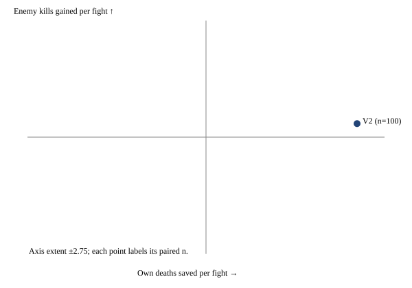

Prepared development observations; no acceptance claim

All atoms are script; V2 is script/search. Selected common timing, its independent script/RRG label and selection hash are reported below. Each shape reports both axes over all fights with won/lost/timeout splits. Exchange is a ratio of totals; a zero-death denominator is null with its raw kills retained. Single-fight wins are descriptive.



Mechanism first at 20 pairs; Claude reads actual activation and metric movement. Rotation primary is E1+R1 versus E1, after E1 activates; R1 versus base is diagnostic. All 20 tactic cells are shown, including empty cells. C3 stops at a clear 50/100/200 look; surviving shapes enter ten paired ten-fight series, streak primary. Shots lost are the paired shots_fired delta; triggered survival is observational and predicted deaths are counterfactual, not proven deaths prevented. Heavy diagnostics off.

```json
{
  "status": "PREPARED_DEVELOPMENT_ONLY",
  "labels": {
    "base": "script",
    "V2": "script/search",
    "E1": "script",
    "R1": "script",
    "E1+R1": "script"
  },
  "common_timing": {
    "mode": "base",
    "k": 1,
    "radius": 400
  },
  "timing_label": "script",
  "timing_selection_sha256": "64595489612e73fdac7a65c5ae355c37e1aa4b4885ef8e9f225f7cc9254872e1",
  "reading": [
    "Mechanism must activate and move declared metric at 20 pairs; else park.",
    "Own deaths over ALL paired fights and kills per own death are decision axes; single-fight wins descriptive.",
    "C3: stop clearly better/worse or invisible at <=200 pairs; no extra sampling.",
    "Rotation primary against E1; require active in-range ranged evidence.",
    "Series: paired streak primary; survival first among competing slots."
  ],
  "arms": {
    "V2": {
      "mechanism": {
        "arms": {
          "base": {
            "n": 20,
            "wins": 20,
            "losses": 0,
            "timeouts": 0,
            "own_deaths_per_fight": {
              "n": 20,
              "mean": 0.6
            },
            "own_losses_on_wins": {
              "n": 20,
              "mean": 0.6
            },
            "own_losses_on_losses": {
              "n": 0,
              "mean": null
            },
            "own_losses_on_timeouts": {
              "n": 0,
              "mean": null
            },
            "own_losses_on_nonwins": {
              "n": 0,
              "mean": null
            },
            "exchange_rate": 41.666666666666664,
            "zero_own_deaths": false,
            "kills_per_minute": 50.80440304826351,
            "damage_per_shell": 18.31831831831832,
            "damage_per_shot": null,
            "false_extractions": {
              "status": "not_evaluated",
              "reason": "No untreated continuation; no causal false-extraction estimate."
            },
            "mechanism": {
              "targets_per_shell": {
                "n": 20,
                "mean": 1.6828318898696808
              },
              "shells_per_kill": {
                "n": 20,
                "mean": 6.642500000000001
              },
              "fire_rate_shells_per_gun_minute": {
                "n": 20,
                "mean": 30.993390042891768
              },
              "firepower_utilization": {
                "n": 0,
                "mean": null
              },
              "in_range_seconds": {
                "n": 20,
                "mean": 0.0
              },
              "ready_to_fire_seconds": {
                "n": 20,
                "mean": 0.0
              },
              "shots_fired": {
                "n": 20,
                "mean": 0.0
              },
              "reaction_override_seconds": {
                "n": 20,
                "mean": 0.0
              },
              "ranged_deaths": {
                "n": 20,
                "mean": 0.0
              },
              "rotation_activations": {
                "n": 20,
                "mean": 0.0
              },
              "counterfactual_predicted_deaths": {
                "n": 20,
                "mean": 0.0
              },
              "triggered_unit_survival": {
                "n": 0,
                "mean": null
              },
              "rotation_trigger_contract_violations": {
                "n": 20,
                "mean": 0.0
              },
              "rotation_seconds": {
                "n": 20,
                "mean": 0.0
              }
            },
            "totals": {
              "own_lost": 12,
              "enemy_kills": 500,
              "enemy_damage": 54900,
              "own_shells": 2997,
              "shots_fired": 0,
              "shell_damage": 54900,
              "shot_damage": 0,
              "t_end": 590.5000000000078,
              "rotation_activations": 0,
              "triggered_units": 0,
              "triggered_unit_survivors": 0,
              "rotation_trigger_contract_violations": 0,
              "counterfactual_predicted_deaths": 0,
              "planner_assignments": 0,
              "ranged_seconds": 0.0,
              "eligible_seconds": 0,
              "ready_to_fire_seconds": 0,
              "in_range_seconds": 0,
              "reaction_override_seconds": 0,
              "ranged_deaths": 0,
              "engagement_floor_ticks": 0,
              "rotation_seconds": 0
            },
            "survivors_by_role": {
              "melee": {
                "n": 20,
                "mean": 0.0
              },
              "ranged": {
                "n": 20,
                "mean": 0.0
              },
              "artillery": {
                "n": 20,
                "mean": 9.4
              }
            }
          },
          "V2": {
            "n": 20,
            "wins": 20,
            "losses": 0,
            "timeouts": 0,
            "own_deaths_per_fight": {
              "n": 20,
              "mean": 0.85
            },
            "own_losses_on_wins": {
              "n": 20,
              "mean": 0.85
            },
            "own_losses_on_losses": {
              "n": 0,
              "mean": null
            },
            "own_losses_on_timeouts": {
              "n": 0,
              "mean": null
            },
            "own_losses_on_nonwins": {
              "n": 0,
              "mean": null
            },
            "exchange_rate": 29.41176470588235,
            "zero_own_deaths": false,
            "kills_per_minute": 54.50911513536338,
            "damage_per_shell": 21.546310832025117,
            "damage_per_shot": null,
            "false_extractions": {
              "status": "not_evaluated",
              "reason": "No untreated continuation; no causal false-extraction estimate."
            },
            "mechanism": {
              "targets_per_shell": {
                "n": 20,
                "mean": 1.899555751290298
              },
              "shells_per_kill": {
                "n": 20,
                "mean": 5.597499999999999
              },
              "fire_rate_shells_per_gun_minute": {
                "n": 20,
                "mean": 28.72827718604803
              },
              "firepower_utilization": {
                "n": 0,
                "mean": null
              },
              "in_range_seconds": {
                "n": 20,
                "mean": 0.0
              },
              "ready_to_fire_seconds": {
                "n": 20,
                "mean": 0.0
              },
              "shots_fired": {
                "n": 20,
                "mean": 0.0
              },
              "reaction_override_seconds": {
                "n": 20,
                "mean": 0.0
              },
              "ranged_deaths": {
                "n": 20,
                "mean": 0.0
              },
              "rotation_activations": {
                "n": 20,
                "mean": 0.0
              },
              "counterfactual_predicted_deaths": {
                "n": 20,
                "mean": 0.0
              },
              "triggered_unit_survival": {
                "n": 0,
                "mean": null
              },
              "rotation_trigger_contract_violations": {
                "n": 20,
                "mean": 0.0
              },
              "rotation_seconds": {
                "n": 20,
                "mean": 0.0
              }
            },
            "totals": {
              "own_lost": 17,
              "enemy_kills": 500,
              "enemy_damage": 54900,
              "own_shells": 2548,
              "shots_fired": 0,
              "shell_damage": 54900,
              "shot_damage": 0,
              "t_end": 550.366666666676,
              "rotation_activations": 0,
              "triggered_units": 0,
              "triggered_unit_survivors": 0,
              "rotation_trigger_contract_violations": 0,
              "counterfactual_predicted_deaths": 0,
              "planner_assignments": 2537,
              "ranged_seconds": 0.0,
              "eligible_seconds": 0,
              "ready_to_fire_seconds": 0,
              "in_range_seconds": 0,
              "reaction_override_seconds": 0,
              "ranged_deaths": 0,
              "engagement_floor_ticks": 0,
              "rotation_seconds": 0
            },
            "survivors_by_role": {
              "melee": {
                "n": 20,
                "mean": 0.0
              },
              "ranged": {
                "n": 20,
                "mean": 0.0
              },
              "artillery": {
                "n": 20,
                "mean": 9.15
              }
            }
          }
        },
        "paired": {
          "base minus V2": {
            "n": 20,
            "unmatched_pairs": 0,
            "differences": {
              "win": {
                "n": 20,
                "mean": 0.0
              },
              "own_lost": {
                "n": 20,
                "mean": -0.25
              },
              "enemy_kills": {
                "n": 20,
                "mean": 0.0
              },
              "kills_per_own_death": {
                "n": 10,
                "mean": 5.5
              },
              "damage_per_shell": {
                "n": 20,
                "mean": -2.8997699267096366
              },
              "damage_per_shot": {
                "n": 0,
                "mean": null
              },
              "kills_per_minute": {
                "n": 20,
                "mean": -2.7073952594771113
              },
              "shots_fired": {
                "n": 20,
                "mean": 0.0
              },
              "firepower_utilization": {
                "n": 0,
                "mean": null
              },
              "in_range_seconds": {
                "n": 20,
                "mean": 0.0
              },
              "rotation_activations": {
                "n": 20,
                "mean": 0.0
              }
            },
            "axis_plot": {
              "own_deaths_saved": {
                "n": 20,
                "mean": 0.25
              },
              "enemy_kills_gained": {
                "n": 20,
                "mean": 0.0
              },
              "enemy_damage_gained": {
                "n": 20,
                "mean": 0.0
              }
            }
          }
        },
        "complete": true,
        "mechanism_gate_observations": {
          "activated": true,
          "active_ranged": false,
          "metric_movement": "Claude must read paired metric movement, guards and tradeoffs; activation alone is insufficient."
        },
        "drills": {
          "D1": {
            "arms": {
              "base": {
                "n": 10,
                "wins": 10,
                "losses": 0,
                "timeouts": 0,
                "own_deaths_per_fight": {
                  "n": 10,
                  "mean": 1.2
                },
                "own_losses_on_wins": {
                  "n": 10,
                  "mean": 1.2
                },
                "own_losses_on_losses": {
                  "n": 0,
                  "mean": null
                },
                "own_losses_on_timeouts": {
                  "n": 0,
                  "mean": null
                },
                "own_losses_on_nonwins": {
                  "n": 0,
                  "mean": null
                },
                "exchange_rate": 25.0,
                "zero_own_deaths": false,
                "kills_per_minute": 79.00512070226674,
                "damage_per_shell": 35.78431372549019,
                "damage_per_shot": null,
                "false_extractions": {
                  "status": "not_evaluated",
                  "reason": "No untreated continuation; no causal false-extraction estimate."
                },
                "mechanism": {
                  "targets_per_shell": {
                    "n": 10,
                    "mean": 2.657258817093606
                  },
                  "shells_per_kill": {
                    "n": 10,
                    "mean": 3.4
                  },
                  "fire_rate_shells_per_gun_minute": {
                    "n": 10,
                    "mean": 29.267670546073532
                  },
                  "firepower_utilization": {
                    "n": 0,
                    "mean": null
                  },
                  "in_range_seconds": {
                    "n": 10,
                    "mean": 0.0
                  },
                  "ready_to_fire_seconds": {
                    "n": 10,
                    "mean": 0.0
                  },
                  "shots_fired": {
                    "n": 10,
                    "mean": 0.0
                  },
                  "reaction_override_seconds": {
                    "n": 10,
                    "mean": 0.0
                  },
                  "ranged_deaths": {
                    "n": 10,
                    "mean": 0.0
                  },
                  "rotation_activations": {
                    "n": 10,
                    "mean": 0.0
                  },
                  "counterfactual_predicted_deaths": {
                    "n": 10,
                    "mean": 0.0
                  },
                  "triggered_unit_survival": {
                    "n": 0,
                    "mean": null
                  },
                  "rotation_trigger_contract_violations": {
                    "n": 10,
                    "mean": 0.0
                  },
                  "rotation_seconds": {
                    "n": 10,
                    "mean": 0.0
                  }
                },
                "totals": {
                  "own_lost": 12,
                  "enemy_kills": 300,
                  "enemy_damage": 36500,
                  "own_shells": 1020,
                  "shots_fired": 0,
                  "shell_damage": 36500,
                  "shot_damage": 0,
                  "t_end": 227.83333333333624,
                  "rotation_activations": 0,
                  "triggered_units": 0,
                  "triggered_unit_survivors": 0,
                  "rotation_trigger_contract_violations": 0,
                  "counterfactual_predicted_deaths": 0,
                  "planner_assignments": 0,
                  "ranged_seconds": 0.0,
                  "eligible_seconds": 0,
                  "ready_to_fire_seconds": 0,
                  "in_range_seconds": 0,
                  "reaction_override_seconds": 0,
                  "ranged_deaths": 0,
                  "engagement_floor_ticks": 0,
                  "rotation_seconds": 0
                },
                "survivors_by_role": {
                  "melee": {
                    "n": 10,
                    "mean": 0.0
                  },
                  "ranged": {
                    "n": 10,
                    "mean": 0.0
                  },
                  "artillery": {
                    "n": 10,
                    "mean": 8.8
                  }
                }
              },
              "V2": {
                "n": 10,
                "wins": 10,
                "losses": 0,
                "timeouts": 0,
                "own_deaths_per_fight": {
                  "n": 10,
                  "mean": 1.7
                },
                "own_losses_on_wins": {
                  "n": 10,
                  "mean": 1.7
                },
                "own_losses_on_losses": {
                  "n": 0,
                  "mean": null
                },
                "own_losses_on_timeouts": {
                  "n": 0,
                  "mean": null
                },
                "own_losses_on_nonwins": {
                  "n": 0,
                  "mean": null
                },
                "exchange_rate": 17.647058823529413,
                "zero_own_deaths": false,
                "kills_per_minute": 80.65720687079813,
                "damage_per_shell": 39.374325782092775,
                "damage_per_shot": null,
                "false_extractions": {
                  "status": "not_evaluated",
                  "reason": "No untreated continuation; no causal false-extraction estimate."
                },
                "mechanism": {
                  "targets_per_shell": {
                    "n": 10,
                    "mean": 2.9309051376374793
                  },
                  "shells_per_kill": {
                    "n": 10,
                    "mean": 3.09
                  },
                  "fire_rate_shells_per_gun_minute": {
                    "n": 10,
                    "mean": 27.767862614085374
                  },
                  "firepower_utilization": {
                    "n": 0,
                    "mean": null
                  },
                  "in_range_seconds": {
                    "n": 10,
                    "mean": 0.0
                  },
                  "ready_to_fire_seconds": {
                    "n": 10,
                    "mean": 0.0
                  },
                  "shots_fired": {
                    "n": 10,
                    "mean": 0.0
                  },
                  "reaction_override_seconds": {
                    "n": 10,
                    "mean": 0.0
                  },
                  "ranged_deaths": {
                    "n": 10,
                    "mean": 0.0
                  },
                  "rotation_activations": {
                    "n": 10,
                    "mean": 0.0
                  },
                  "counterfactual_predicted_deaths": {
                    "n": 10,
                    "mean": 0.0
                  },
                  "triggered_unit_survival": {
                    "n": 0,
                    "mean": null
                  },
                  "rotation_trigger_contract_violations": {
                    "n": 10,
                    "mean": 0.0
                  },
                  "rotation_seconds": {
                    "n": 10,
                    "mean": 0.0
                  }
                },
                "totals": {
                  "own_lost": 17,
                  "enemy_kills": 300,
                  "enemy_damage": 36500,
                  "own_shells": 927,
                  "shots_fired": 0,
                  "shell_damage": 36500,
                  "shot_damage": 0,
                  "t_end": 223.16666666666936,
                  "rotation_activations": 0,
                  "triggered_units": 0,
                  "triggered_unit_survivors": 0,
                  "rotation_trigger_contract_violations": 0,
                  "counterfactual_predicted_deaths": 0,
                  "planner_assignments": 925,
                  "ranged_seconds": 0.0,
                  "eligible_seconds": 0,
                  "ready_to_fire_seconds": 0,
                  "in_range_seconds": 0,
                  "reaction_override_seconds": 0,
                  "ranged_deaths": 0,
                  "engagement_floor_ticks": 0,
                  "rotation_seconds": 0
                },
                "survivors_by_role": {
                  "melee": {
                    "n": 10,
                    "mean": 0.0
                  },
                  "ranged": {
                    "n": 10,
                    "mean": 0.0
                  },
                  "artillery": {
                    "n": 10,
                    "mean": 8.3
                  }
                }
              }
            },
            "paired": {
              "base minus V2": {
                "n": 10,
                "unmatched_pairs": 0,
                "differences": {
                  "win": {
                    "n": 10,
                    "mean": 0.0
                  },
                  "own_lost": {
                    "n": 10,
                    "mean": -0.5
                  },
                  "enemy_kills": {
                    "n": 10,
                    "mean": 0.0
                  },
                  "kills_per_own_death": {
                    "n": 10,
                    "mean": 5.5
                  },
                  "damage_per_shell": {
                    "n": 10,
                    "mean": -3.6992928517968138
                  },
                  "damage_per_shot": {
                    "n": 0,
                    "mean": null
                  },
                  "kills_per_minute": {
                    "n": 10,
                    "mean": -1.7793648917822011
                  },
                  "shots_fired": {
                    "n": 10,
                    "mean": 0.0
                  },
                  "firepower_utilization": {
                    "n": 0,
                    "mean": null
                  },
                  "in_range_seconds": {
                    "n": 10,
                    "mean": 0.0
                  },
                  "rotation_activations": {
                    "n": 10,
                    "mean": 0.0
                  }
                },
                "axis_plot": {
                  "own_deaths_saved": {
                    "n": 10,
                    "mean": 0.5
                  },
                  "enemy_kills_gained": {
                    "n": 10,
                    "mean": 0.0
                  },
                  "enemy_damage_gained": {
                    "n": 10,
                    "mean": 0.0
                  }
                }
              }
            }
          },
          "V2D2": {
            "arms": {
              "base": {
                "n": 10,
                "wins": 10,
                "losses": 0,
                "timeouts": 0,
                "own_deaths_per_fight": {
                  "n": 10,
                  "mean": 0.0
                },
                "own_losses_on_wins": {
                  "n": 10,
                  "mean": 0.0
                },
                "own_losses_on_losses": {
                  "n": 0,
                  "mean": null
                },
                "own_losses_on_timeouts": {
                  "n": 0,
                  "mean": null
                },
                "own_losses_on_nonwins": {
                  "n": 0,
                  "mean": null
                },
                "exchange_rate": null,
                "zero_own_deaths": true,
                "kills_per_minute": 33.08823529411719,
                "damage_per_shell": 9.30703085483055,
                "damage_per_shot": null,
                "false_extractions": {
                  "status": "not_evaluated",
                  "reason": "No untreated continuation; no causal false-extraction estimate."
                },
                "mechanism": {
                  "targets_per_shell": {
                    "n": 10,
                    "mean": 0.7084049626457557
                  },
                  "shells_per_kill": {
                    "n": 10,
                    "mean": 9.885000000000002
                  },
                  "fire_rate_shells_per_gun_minute": {
                    "n": 10,
                    "mean": 32.719109539710004
                  },
                  "firepower_utilization": {
                    "n": 0,
                    "mean": null
                  },
                  "in_range_seconds": {
                    "n": 10,
                    "mean": 0.0
                  },
                  "ready_to_fire_seconds": {
                    "n": 10,
                    "mean": 0.0
                  },
                  "shots_fired": {
                    "n": 10,
                    "mean": 0.0
                  },
                  "reaction_override_seconds": {
                    "n": 10,
                    "mean": 0.0
                  },
                  "ranged_deaths": {
                    "n": 10,
                    "mean": 0.0
                  },
                  "rotation_activations": {
                    "n": 10,
                    "mean": 0.0
                  },
                  "counterfactual_predicted_deaths": {
                    "n": 10,
                    "mean": 0.0
                  },
                  "triggered_unit_survival": {
                    "n": 0,
                    "mean": null
                  },
                  "rotation_trigger_contract_violations": {
                    "n": 10,
                    "mean": 0.0
                  },
                  "rotation_seconds": {
                    "n": 10,
                    "mean": 0.0
                  }
                },
                "totals": {
                  "own_lost": 0,
                  "enemy_kills": 200,
                  "enemy_damage": 18400,
                  "own_shells": 1977,
                  "shots_fired": 0,
                  "shell_damage": 18400,
                  "shot_damage": 0,
                  "t_end": 362.6666666666717,
                  "rotation_activations": 0,
                  "triggered_units": 0,
                  "triggered_unit_survivors": 0,
                  "rotation_trigger_contract_violations": 0,
                  "counterfactual_predicted_deaths": 0,
                  "planner_assignments": 0,
                  "ranged_seconds": 0.0,
                  "eligible_seconds": 0,
                  "ready_to_fire_seconds": 0,
                  "in_range_seconds": 0,
                  "reaction_override_seconds": 0,
                  "ranged_deaths": 0,
                  "engagement_floor_ticks": 0,
                  "rotation_seconds": 0
                },
                "survivors_by_role": {
                  "melee": {
                    "n": 10,
                    "mean": 0.0
                  },
                  "ranged": {
                    "n": 10,
                    "mean": 0.0
                  },
                  "artillery": {
                    "n": 10,
                    "mean": 10.0
                  }
                }
              },
              "V2": {
                "n": 10,
                "wins": 10,
                "losses": 0,
                "timeouts": 0,
                "own_deaths_per_fight": {
                  "n": 10,
                  "mean": 0.0
                },
                "own_losses_on_wins": {
                  "n": 10,
                  "mean": 0.0
                },
                "own_losses_on_losses": {
                  "n": 0,
                  "mean": null
                },
                "own_losses_on_timeouts": {
                  "n": 0,
                  "mean": null
                },
                "own_losses_on_nonwins": {
                  "n": 0,
                  "mean": null
                },
                "exchange_rate": null,
                "zero_own_deaths": true,
                "kills_per_minute": 36.67481662591613,
                "damage_per_shell": 11.35101789019124,
                "damage_per_shot": null,
                "false_extractions": {
                  "status": "not_evaluated",
                  "reason": "No untreated continuation; no causal false-extraction estimate."
                },
                "mechanism": {
                  "targets_per_shell": {
                    "n": 10,
                    "mean": 0.8682063649431168
                  },
                  "shells_per_kill": {
                    "n": 10,
                    "mean": 8.105
                  },
                  "fire_rate_shells_per_gun_minute": {
                    "n": 10,
                    "mean": 29.688691758010684
                  },
                  "firepower_utilization": {
                    "n": 0,
                    "mean": null
                  },
                  "in_range_seconds": {
                    "n": 10,
                    "mean": 0.0
                  },
                  "ready_to_fire_seconds": {
                    "n": 10,
                    "mean": 0.0
                  },
                  "shots_fired": {
                    "n": 10,
                    "mean": 0.0
                  },
                  "reaction_override_seconds": {
                    "n": 10,
                    "mean": 0.0
                  },
                  "ranged_deaths": {
                    "n": 10,
                    "mean": 0.0
                  },
                  "rotation_activations": {
                    "n": 10,
                    "mean": 0.0
                  },
                  "counterfactual_predicted_deaths": {
                    "n": 10,
                    "mean": 0.0
                  },
                  "triggered_unit_survival": {
                    "n": 0,
                    "mean": null
                  },
                  "rotation_trigger_contract_violations": {
                    "n": 10,
                    "mean": 0.0
                  },
                  "rotation_seconds": {
                    "n": 10,
                    "mean": 0.0
                  }
                },
                "totals": {
                  "own_lost": 0,
                  "enemy_kills": 200,
                  "enemy_damage": 18400,
                  "own_shells": 1621,
                  "shots_fired": 0,
                  "shell_damage": 18400,
                  "shot_damage": 0,
                  "t_end": 327.20000000000664,
                  "rotation_activations": 0,
                  "triggered_units": 0,
                  "triggered_unit_survivors": 0,
                  "rotation_trigger_contract_violations": 0,
                  "counterfactual_predicted_deaths": 0,
                  "planner_assignments": 1612,
                  "ranged_seconds": 0.0,
                  "eligible_seconds": 0,
                  "ready_to_fire_seconds": 0,
                  "in_range_seconds": 0,
                  "reaction_override_seconds": 0,
                  "ranged_deaths": 0,
                  "engagement_floor_ticks": 0,
                  "rotation_seconds": 0
                },
                "survivors_by_role": {
                  "melee": {
                    "n": 10,
                    "mean": 0.0
                  },
                  "ranged": {
                    "n": 10,
                    "mean": 0.0
                  },
                  "artillery": {
                    "n": 10,
                    "mean": 10.0
                  }
                }
              }
            },
            "paired": {
              "base minus V2": {
                "n": 10,
                "unmatched_pairs": 0,
                "differences": {
                  "win": {
                    "n": 10,
                    "mean": 0.0
                  },
                  "own_lost": {
                    "n": 10,
                    "mean": 0.0
                  },
                  "enemy_kills": {
                    "n": 10,
                    "mean": 0.0
                  },
                  "kills_per_own_death": {
                    "n": 0,
                    "mean": null
                  },
                  "damage_per_shell": {
                    "n": 10,
                    "mean": -2.1002470016224586
                  },
                  "damage_per_shot": {
                    "n": 0,
                    "mean": null
                  },
                  "kills_per_minute": {
                    "n": 10,
                    "mean": -3.6354256271720216
                  },
                  "shots_fired": {
                    "n": 10,
                    "mean": 0.0
                  },
                  "firepower_utilization": {
                    "n": 0,
                    "mean": null
                  },
                  "in_range_seconds": {
                    "n": 10,
                    "mean": 0.0
                  },
                  "rotation_activations": {
                    "n": 10,
                    "mean": 0.0
                  }
                },
                "axis_plot": {
                  "own_deaths_saved": {
                    "n": 10,
                    "mean": 0.0
                  },
                  "enemy_kills_gained": {
                    "n": 10,
                    "mean": 0.0
                  },
                  "enemy_damage_gained": {
                    "n": 10,
                    "mean": 0.0
                  }
                }
              }
            }
          }
        },
        "stage": "mechanism",
        "arm": "V2",
        "declaration_sha256": "90a75db931015123d39f7a816553c8c5866e5b6042a02d94f72698d3d1ee7e30"
      },
      "outcomes": {
        "50": {
          "arms": {
            "base": {
              "n": 50,
              "wins": 48,
              "losses": 2,
              "timeouts": 0,
              "own_deaths_per_fight": {
                "n": 50,
                "mean": 34.86
              },
              "own_losses_on_wins": {
                "n": 48,
                "mean": 34.229166666666664
              },
              "own_losses_on_losses": {
                "n": 2,
                "mean": 50.0
              },
              "own_losses_on_timeouts": {
                "n": 0,
                "mean": null
              },
              "own_losses_on_nonwins": {
                "n": 2,
                "mean": 50.0
              },
              "exchange_rate": 1.4193918531267928,
              "zero_own_deaths": false,
              "kills_per_minute": 67.3187102235793,
              "damage_per_shell": 23.366663834848357,
              "damage_per_shot": 5.165639344262295,
              "false_extractions": {
                "status": "not_evaluated",
                "reason": "No untreated continuation; no causal false-extraction estimate."
              },
              "mechanism": {
                "targets_per_shell": {
                  "n": 50,
                  "mean": 1.7555231104480888
                },
                "shells_per_kill": {
                  "n": 50,
                  "mean": 6.1509218980167715
                },
                "fire_rate_shells_per_gun_minute": {
                  "n": 50,
                  "mean": 34.30244709962913
                },
                "firepower_utilization": {
                  "n": 50,
                  "mean": 0.2556338910273138
                },
                "in_range_seconds": {
                  "n": 50,
                  "mean": 504.92466666678416
                },
                "ready_to_fire_seconds": {
                  "n": 50,
                  "mean": 509.31466666681337
                },
                "shots_fired": {
                  "n": 50,
                  "mean": 152.5
                },
                "reaction_override_seconds": {
                  "n": 50,
                  "mean": 245.143999999988
                },
                "ranged_deaths": {
                  "n": 50,
                  "mean": 24.2
                },
                "rotation_activations": {
                  "n": 50,
                  "mean": 0.0
                },
                "counterfactual_predicted_deaths": {
                  "n": 50,
                  "mean": 0.0
                },
                "triggered_unit_survival": {
                  "n": 0,
                  "mean": null
                },
                "rotation_trigger_contract_violations": {
                  "n": 50,
                  "mean": 0.0
                },
                "rotation_seconds": {
                  "n": 50,
                  "mean": 0.0
                }
              },
              "totals": {
                "own_lost": 1743,
                "enemy_kills": 2474,
                "enemy_damage": 325674,
                "own_shells": 11771,
                "shots_fired": 7625,
                "shell_damage": 275049,
                "shot_damage": 39388,
                "t_end": 2205.033333333336,
                "rotation_activations": 0,
                "triggered_units": 0,
                "triggered_unit_survivors": 0,
                "rotation_trigger_contract_violations": 0,
                "counterfactual_predicted_deaths": 0,
                "planner_assignments": 0,
                "ranged_seconds": 40090.60000000027,
                "eligible_seconds": 6479.53333333301,
                "ready_to_fire_seconds": 25465.733333340668,
                "in_range_seconds": 25246.23333333921,
                "reaction_override_seconds": 12257.1999999994,
                "ranged_deaths": 1210,
                "engagement_floor_ticks": 0,
                "rotation_seconds": 0.0
              },
              "survivors_by_role": {
                "melee": {
                  "n": 50,
                  "mean": 0.48
                },
                "ranged": {
                  "n": 50,
                  "mean": 5.8
                },
                "artillery": {
                  "n": 50,
                  "mean": 8.86
                }
              }
            },
            "V2": {
              "n": 50,
              "wins": 49,
              "losses": 1,
              "timeouts": 0,
              "own_deaths_per_fight": {
                "n": 50,
                "mean": 33.7
              },
              "own_losses_on_wins": {
                "n": 49,
                "mean": 33.36734693877551
              },
              "own_losses_on_losses": {
                "n": 1,
                "mean": 50.0
              },
              "own_losses_on_timeouts": {
                "n": 0,
                "mean": null
              },
              "own_losses_on_nonwins": {
                "n": 1,
                "mean": 50.0
              },
              "exchange_rate": 1.4789317507418398,
              "zero_own_deaths": false,
              "kills_per_minute": 70.10721765496525,
              "damage_per_shell": 24.544143982808023,
              "damage_per_shot": 4.6147186147186146,
              "false_extractions": {
                "status": "not_evaluated",
                "reason": "No untreated continuation; no causal false-extraction estimate."
              },
              "mechanism": {
                "targets_per_shell": {
                  "n": 50,
                  "mean": 1.8147802189129405
                },
                "shells_per_kill": {
                  "n": 50,
                  "mean": 5.887578586048839
                },
                "fire_rate_shells_per_gun_minute": {
                  "n": 50,
                  "mean": 32.976529757460284
                },
                "firepower_utilization": {
                  "n": 50,
                  "mean": 0.25890538711266897
                },
                "in_range_seconds": {
                  "n": 50,
                  "mean": 525.9786666667791
                },
                "ready_to_fire_seconds": {
                  "n": 50,
                  "mean": 536.077333333475
                },
                "shots_fired": {
                  "n": 50,
                  "mean": 161.7
                },
                "reaction_override_seconds": {
                  "n": 50,
                  "mean": 259.87799999997674
                },
                "ranged_deaths": {
                  "n": 50,
                  "mean": 23.6
                },
                "rotation_activations": {
                  "n": 50,
                  "mean": 0.0
                },
                "counterfactual_predicted_deaths": {
                  "n": 50,
                  "mean": 0.0
                },
                "triggered_unit_survival": {
                  "n": 0,
                  "mean": null
                },
                "rotation_trigger_contract_violations": {
                  "n": 50,
                  "mean": 0.0
                },
                "rotation_seconds": {
                  "n": 50,
                  "mean": 0.0
                }
              },
              "totals": {
                "own_lost": 1685,
                "enemy_kills": 2492,
                "enemy_damage": 324753,
                "own_shells": 11168,
                "shots_fired": 8085,
                "shell_damage": 274109,
                "shot_damage": 37310,
                "t_end": 2132.7333333333395,
                "rotation_activations": 0,
                "triggered_units": 0,
                "triggered_unit_survivors": 0,
                "rotation_trigger_contract_violations": 0,
                "counterfactual_predicted_deaths": 0,
                "planner_assignments": 11285,
                "ranged_seconds": 42727.833333333685,
                "eligible_seconds": 6960.199999999648,
                "ready_to_fire_seconds": 26803.86666667375,
                "in_range_seconds": 26298.93333333895,
                "reaction_override_seconds": 12993.899999998837,
                "ranged_deaths": 1180,
                "engagement_floor_ticks": 0,
                "rotation_seconds": 0.0
              },
              "survivors_by_role": {
                "melee": {
                  "n": 50,
                  "mean": 0.56
                },
                "ranged": {
                  "n": 50,
                  "mean": 6.4
                },
                "artillery": {
                  "n": 50,
                  "mean": 9.34
                }
              }
            }
          },
          "paired": {
            "base minus V2": {
              "n": 50,
              "unmatched_pairs": 0,
              "differences": {
                "win": {
                  "n": 50,
                  "mean": -0.02
                },
                "own_lost": {
                  "n": 50,
                  "mean": 1.16
                },
                "enemy_kills": {
                  "n": 50,
                  "mean": -0.36
                },
                "kills_per_own_death": {
                  "n": 50,
                  "mean": -0.01973917240805785
                },
                "damage_per_shell": {
                  "n": 50,
                  "mean": -0.7861303852020493
                },
                "damage_per_shot": {
                  "n": 50,
                  "mean": 0.5494300053759454
                },
                "kills_per_minute": {
                  "n": 50,
                  "mean": -1.483631538441975
                },
                "shots_fired": {
                  "n": 50,
                  "mean": -9.2
                },
                "firepower_utilization": {
                  "n": 50,
                  "mean": -0.0032714960853551804
                },
                "in_range_seconds": {
                  "n": 50,
                  "mean": -21.053999999994826
                },
                "rotation_activations": {
                  "n": 50,
                  "mean": 0.0
                }
              },
              "axis_plot": {
                "own_deaths_saved": {
                  "n": 50,
                  "mean": -1.16
                },
                "enemy_kills_gained": {
                  "n": 50,
                  "mean": -0.36
                },
                "enemy_damage_gained": {
                  "n": 50,
                  "mean": 18.42
                }
              }
            }
          },
          "look": 50,
          "complete": true,
          "per_tactic": {
            "regular": {
              "arms": {
                "base": {
                  "n": 3,
                  "wins": 3,
                  "losses": 0,
                  "timeouts": 0,
                  "own_deaths_per_fight": {
                    "n": 3,
                    "mean": 33.666666666666664
                  },
                  "own_losses_on_wins": {
                    "n": 3,
                    "mean": 33.666666666666664
                  },
                  "own_losses_on_losses": {
                    "n": 0,
                    "mean": null
                  },
                  "own_losses_on_timeouts": {
                    "n": 0,
                    "mean": null
                  },
                  "own_losses_on_nonwins": {
                    "n": 0,
                    "mean": null
                  },
                  "exchange_rate": 1.4851485148514851,
                  "zero_own_deaths": false,
                  "kills_per_minute": 77.56391841424804,
                  "damage_per_shell": 24.48502994011976,
                  "damage_per_shot": 4.933944954128441,
                  "false_extractions": {
                    "status": "not_evaluated",
                    "reason": "No untreated continuation; no causal false-extraction estimate."
                  },
                  "mechanism": {
                    "targets_per_shell": {
                      "n": 3,
                      "mean": 1.7734374000383852
                    },
                    "shells_per_kill": {
                      "n": 3,
                      "mean": 5.969890943575154
                    },
                    "fire_rate_shells_per_gun_minute": {
                      "n": 3,
                      "mean": 34.5176319246897
                    },
                    "firepower_utilization": {
                      "n": 3,
                      "mean": 0.21573719558258964
                    },
                    "in_range_seconds": {
                      "n": 3,
                      "mean": 518.7444444445863
                    },
                    "ready_to_fire_seconds": {
                      "n": 3,
                      "mean": 473.86666666682
                    },
                    "shots_fired": {
                      "n": 3,
                      "mean": 181.66666666666666
                    },
                    "reaction_override_seconds": {
                      "n": 3,
                      "mean": 260.65555555553965
                    },
                    "ranged_deaths": {
                      "n": 3,
                      "mean": 24.0
                    },
                    "rotation_activations": {
                      "n": 3,
                      "mean": 0.0
                    },
                    "counterfactual_predicted_deaths": {
                      "n": 3,
                      "mean": 0.0
                    },
                    "triggered_unit_survival": {
                      "n": 0,
                      "mean": null
                    },
                    "rotation_trigger_contract_violations": {
                      "n": 3,
                      "mean": 0.0
                    },
                    "rotation_seconds": {
                      "n": 3,
                      "mean": 0.0
                    }
                  },
                  "totals": {
                    "own_lost": 101,
                    "enemy_kills": 150,
                    "enemy_damage": 19710,
                    "own_shells": 668,
                    "shots_fired": 545,
                    "shell_damage": 16356,
                    "shot_damage": 2689,
                    "t_end": 116.03333333333444,
                    "rotation_activations": 0,
                    "triggered_units": 0,
                    "triggered_unit_survivors": 0,
                    "rotation_trigger_contract_violations": 0,
                    "counterfactual_predicted_deaths": 0,
                    "planner_assignments": 0,
                    "ranged_seconds": 2449.8666666666904,
                    "eligible_seconds": 307.1666666666518,
                    "ready_to_fire_seconds": 1421.6000000004599,
                    "in_range_seconds": 1556.2333333337588,
                    "reaction_override_seconds": 781.966666666619,
                    "ranged_deaths": 72,
                    "engagement_floor_ticks": 0,
                    "rotation_seconds": 0.0
                  },
                  "survivors_by_role": {
                    "melee": {
                      "n": 3,
                      "mean": 0.3333333333333333
                    },
                    "ranged": {
                      "n": 3,
                      "mean": 6.0
                    },
                    "artillery": {
                      "n": 3,
                      "mean": 10.0
                    }
                  }
                },
                "V2": {
                  "n": 3,
                  "wins": 3,
                  "losses": 0,
                  "timeouts": 0,
                  "own_deaths_per_fight": {
                    "n": 3,
                    "mean": 33.333333333333336
                  },
                  "own_losses_on_wins": {
                    "n": 3,
                    "mean": 33.333333333333336
                  },
                  "own_losses_on_losses": {
                    "n": 0,
                    "mean": null
                  },
                  "own_losses_on_timeouts": {
                    "n": 0,
                    "mean": null
                  },
                  "own_losses_on_nonwins": {
                    "n": 0,
                    "mean": null
                  },
                  "exchange_rate": 1.5,
                  "zero_own_deaths": false,
                  "kills_per_minute": 71.44747287642203,
                  "damage_per_shell": 23.425470332850942,
                  "damage_per_shot": 4.604914933837429,
                  "false_extractions": {
                    "status": "not_evaluated",
                    "reason": "No untreated continuation; no causal false-extraction estimate."
                  },
                  "mechanism": {
                    "targets_per_shell": {
                      "n": 3,
                      "mean": 1.7012764350204026
                    },
                    "shells_per_kill": {
                      "n": 3,
                      "mean": 6.375686832343178
                    },
                    "fire_rate_shells_per_gun_minute": {
                      "n": 3,
                      "mean": 32.987486830499286
                    },
                    "firepower_utilization": {
                      "n": 3,
                      "mean": 0.2267942665747932
                    },
                    "in_range_seconds": {
                      "n": 3,
                      "mean": 526.1000000001194
                    },
                    "ready_to_fire_seconds": {
                      "n": 3,
                      "mean": 523.8666666668192
                    },
                    "shots_fired": {
                      "n": 3,
                      "mean": 176.33333333333334
                    },
                    "reaction_override_seconds": {
                      "n": 3,
                      "mean": 277.46666666665243
                    },
                    "ranged_deaths": {
                      "n": 3,
                      "mean": 24.0
                    },
                    "rotation_activations": {
                      "n": 3,
                      "mean": 0.0
                    },
                    "counterfactual_predicted_deaths": {
                      "n": 3,
                      "mean": 0.0
                    },
                    "triggered_unit_survival": {
                      "n": 0,
                      "mean": null
                    },
                    "rotation_trigger_contract_violations": {
                      "n": 3,
                      "mean": 0.0
                    },
                    "rotation_seconds": {
                      "n": 3,
                      "mean": 0.0
                    }
                  },
                  "totals": {
                    "own_lost": 100,
                    "enemy_kills": 150,
                    "enemy_damage": 19405,
                    "own_shells": 691,
                    "shots_fired": 529,
                    "shell_damage": 16187,
                    "shot_damage": 2436,
                    "t_end": 125.96666666666721,
                    "rotation_activations": 0,
                    "triggered_units": 0,
                    "triggered_unit_survivors": 0,
                    "rotation_trigger_contract_violations": 0,
                    "counterfactual_predicted_deaths": 0,
                    "planner_assignments": 696,
                    "ranged_seconds": 2566.93333333337,
                    "eligible_seconds": 357.166666666649,
                    "ready_to_fire_seconds": 1571.6000000004576,
                    "in_range_seconds": 1578.3000000003583,
                    "reaction_override_seconds": 832.3999999999572,
                    "ranged_deaths": 72,
                    "engagement_floor_ticks": 0,
                    "rotation_seconds": 0.0
                  },
                  "survivors_by_role": {
                    "melee": {
                      "n": 3,
                      "mean": 0.6666666666666666
                    },
                    "ranged": {
                      "n": 3,
                      "mean": 6.0
                    },
                    "artillery": {
                      "n": 3,
                      "mean": 10.0
                    }
                  }
                }
              },
              "paired": {
                "base minus V2": {
                  "n": 3,
                  "unmatched_pairs": 0,
                  "differences": {
                    "win": {
                      "n": 3,
                      "mean": 0.0
                    },
                    "own_lost": {
                      "n": 3,
                      "mean": 0.3333333333333333
                    },
                    "enemy_kills": {
                      "n": 3,
                      "mean": 0.0
                    },
                    "kills_per_own_death": {
                      "n": 3,
                      "mean": -0.01191324107990773
                    },
                    "damage_per_shell": {
                      "n": 3,
                      "mean": 1.088128599731918
                    },
                    "damage_per_shot": {
                      "n": 3,
                      "mean": 0.3477968104291718
                    },
                    "kills_per_minute": {
                      "n": 3,
                      "mean": 6.205218611075385
                    },
                    "shots_fired": {
                      "n": 3,
                      "mean": 5.333333333333333
                    },
                    "firepower_utilization": {
                      "n": 3,
                      "mean": -0.011057070992203552
                    },
                    "in_range_seconds": {
                      "n": 3,
                      "mean": -7.355555555533215
                    },
                    "rotation_activations": {
                      "n": 3,
                      "mean": 0.0
                    }
                  },
                  "axis_plot": {
                    "own_deaths_saved": {
                      "n": 3,
                      "mean": -0.3333333333333333
                    },
                    "enemy_kills_gained": {
                      "n": 3,
                      "mean": 0.0
                    },
                    "enemy_damage_gained": {
                      "n": 3,
                      "mean": 101.66666666666667
                    }
                  }
                }
              }
            },
            "line": {
              "arms": {
                "base": {
                  "n": 3,
                  "wins": 3,
                  "losses": 0,
                  "timeouts": 0,
                  "own_deaths_per_fight": {
                    "n": 3,
                    "mean": 35.0
                  },
                  "own_losses_on_wins": {
                    "n": 3,
                    "mean": 35.0
                  },
                  "own_losses_on_losses": {
                    "n": 0,
                    "mean": null
                  },
                  "own_losses_on_timeouts": {
                    "n": 0,
                    "mean": null
                  },
                  "own_losses_on_nonwins": {
                    "n": 0,
                    "mean": null
                  },
                  "exchange_rate": 1.4285714285714286,
                  "zero_own_deaths": false,
                  "kills_per_minute": 72.1346513491848,
                  "damage_per_shell": 26.04160246533128,
                  "damage_per_shot": 4.611005692599621,
                  "false_extractions": {
                    "status": "not_evaluated",
                    "reason": "No untreated continuation; no causal false-extraction estimate."
                  },
                  "mechanism": {
                    "targets_per_shell": {
                      "n": 3,
                      "mean": 1.8891331388922186
                    },
                    "shells_per_kill": {
                      "n": 3,
                      "mean": 5.594322344322344
                    },
                    "fire_rate_shells_per_gun_minute": {
                      "n": 3,
                      "mean": 31.516770642161003
                    },
                    "firepower_utilization": {
                      "n": 3,
                      "mean": 0.21483223889697248
                    },
                    "in_range_seconds": {
                      "n": 3,
                      "mean": 503.70000000013187
                    },
                    "ready_to_fire_seconds": {
                      "n": 3,
                      "mean": 507.2000000001499
                    },
                    "shots_fired": {
                      "n": 3,
                      "mean": 175.66666666666666
                    },
                    "reaction_override_seconds": {
                      "n": 3,
                      "mean": 276.0777777777552
                    },
                    "ranged_deaths": {
                      "n": 3,
                      "mean": 25.666666666666668
                    },
                    "rotation_activations": {
                      "n": 3,
                      "mean": 0.0
                    },
                    "counterfactual_predicted_deaths": {
                      "n": 3,
                      "mean": 0.0
                    },
                    "triggered_unit_survival": {
                      "n": 0,
                      "mean": null
                    },
                    "rotation_trigger_contract_violations": {
                      "n": 3,
                      "mean": 0.0
                    },
                    "rotation_seconds": {
                      "n": 3,
                      "mean": 0.0
                    }
                  },
                  "totals": {
                    "own_lost": 105,
                    "enemy_kills": 150,
                    "enemy_damage": 19966,
                    "own_shells": 649,
                    "shots_fired": 527,
                    "shell_damage": 16901,
                    "shot_damage": 2430,
                    "t_end": 124.76666666666728,
                    "rotation_activations": 0,
                    "triggered_units": 0,
                    "triggered_unit_survivors": 0,
                    "rotation_trigger_contract_violations": 0,
                    "counterfactual_predicted_deaths": 0,
                    "planner_assignments": 0,
                    "ranged_seconds": 2569.2333333333563,
                    "eligible_seconds": 326.0999999999841,
                    "ready_to_fire_seconds": 1521.6000000004497,
                    "in_range_seconds": 1511.1000000003955,
                    "reaction_override_seconds": 828.2333333332657,
                    "ranged_deaths": 77,
                    "engagement_floor_ticks": 0,
                    "rotation_seconds": 0.0
                  },
                  "survivors_by_role": {
                    "melee": {
                      "n": 3,
                      "mean": 1.0
                    },
                    "ranged": {
                      "n": 3,
                      "mean": 4.333333333333333
                    },
                    "artillery": {
                      "n": 3,
                      "mean": 9.666666666666666
                    }
                  }
                },
                "V2": {
                  "n": 3,
                  "wins": 3,
                  "losses": 0,
                  "timeouts": 0,
                  "own_deaths_per_fight": {
                    "n": 3,
                    "mean": 31.666666666666668
                  },
                  "own_losses_on_wins": {
                    "n": 3,
                    "mean": 31.666666666666668
                  },
                  "own_losses_on_losses": {
                    "n": 0,
                    "mean": null
                  },
                  "own_losses_on_timeouts": {
                    "n": 0,
                    "mean": null
                  },
                  "own_losses_on_nonwins": {
                    "n": 0,
                    "mean": null
                  },
                  "exchange_rate": 1.5789473684210527,
                  "zero_own_deaths": false,
                  "kills_per_minute": 67.61833208114193,
                  "damage_per_shell": 24.733436055469955,
                  "damage_per_shot": 4.698292220113852,
                  "false_extractions": {
                    "status": "not_evaluated",
                    "reason": "No untreated continuation; no causal false-extraction estimate."
                  },
                  "mechanism": {
                    "targets_per_shell": {
                      "n": 3,
                      "mean": 1.7961869499696939
                    },
                    "shells_per_kill": {
                      "n": 3,
                      "mean": 5.704949784791965
                    },
                    "fire_rate_shells_per_gun_minute": {
                      "n": 3,
                      "mean": 29.342905681599337
                    },
                    "firepower_utilization": {
                      "n": 3,
                      "mean": 0.21648563852713273
                    },
                    "in_range_seconds": {
                      "n": 3,
                      "mean": 536.155555555671
                    },
                    "ready_to_fire_seconds": {
                      "n": 3,
                      "mean": 545.8555555556867
                    },
                    "shots_fired": {
                      "n": 3,
                      "mean": 175.66666666666666
                    },
                    "reaction_override_seconds": {
                      "n": 3,
                      "mean": 295.21111111107086
                    },
                    "ranged_deaths": {
                      "n": 3,
                      "mean": 23.0
                    },
                    "rotation_activations": {
                      "n": 3,
                      "mean": 0.0
                    },
                    "counterfactual_predicted_deaths": {
                      "n": 3,
                      "mean": 0.0
                    },
                    "triggered_unit_survival": {
                      "n": 0,
                      "mean": null
                    },
                    "rotation_trigger_contract_violations": {
                      "n": 3,
                      "mean": 0.0
                    },
                    "rotation_seconds": {
                      "n": 3,
                      "mean": 0.0
                    }
                  },
                  "totals": {
                    "own_lost": 95,
                    "enemy_kills": 150,
                    "enemy_damage": 19362,
                    "own_shells": 649,
                    "shots_fired": 527,
                    "shell_damage": 16052,
                    "shot_damage": 2476,
                    "t_end": 133.10000000000014,
                    "rotation_activations": 0,
                    "triggered_units": 0,
                    "triggered_unit_survivors": 0,
                    "rotation_trigger_contract_violations": 0,
                    "counterfactual_predicted_deaths": 0,
                    "planner_assignments": 657,
                    "ranged_seconds": 2721.7000000000216,
                    "eligible_seconds": 353.6666666666492,
                    "ready_to_fire_seconds": 1637.5666666670602,
                    "in_range_seconds": 1608.466666667013,
                    "reaction_override_seconds": 885.6333333332126,
                    "ranged_deaths": 69,
                    "engagement_floor_ticks": 0,
                    "rotation_seconds": 0.0
                  },
                  "survivors_by_role": {
                    "melee": {
                      "n": 3,
                      "mean": 1.3333333333333333
                    },
                    "ranged": {
                      "n": 3,
                      "mean": 7.0
                    },
                    "artillery": {
                      "n": 3,
                      "mean": 10.0
                    }
                  }
                }
              },
              "paired": {
                "base minus V2": {
                  "n": 3,
                  "unmatched_pairs": 0,
                  "differences": {
                    "win": {
                      "n": 3,
                      "mean": 0.0
                    },
                    "own_lost": {
                      "n": 3,
                      "mean": 3.3333333333333335
                    },
                    "enemy_kills": {
                      "n": 3,
                      "mean": 0.0
                    },
                    "kills_per_own_death": {
                      "n": 3,
                      "mean": -0.13822897969239434
                    },
                    "damage_per_shell": {
                      "n": 3,
                      "mean": 1.4382216466030826
                    },
                    "damage_per_shot": {
                      "n": 3,
                      "mean": -0.14426191527585797
                    },
                    "kills_per_minute": {
                      "n": 3,
                      "mean": 5.293737758947349
                    },
                    "shots_fired": {
                      "n": 3,
                      "mean": 0.0
                    },
                    "firepower_utilization": {
                      "n": 3,
                      "mean": -0.001653399630160211
                    },
                    "in_range_seconds": {
                      "n": 3,
                      "mean": -32.45555555553915
                    },
                    "rotation_activations": {
                      "n": 3,
                      "mean": 0.0
                    }
                  },
                  "axis_plot": {
                    "own_deaths_saved": {
                      "n": 3,
                      "mean": -3.3333333333333335
                    },
                    "enemy_kills_gained": {
                      "n": 3,
                      "mean": 0.0
                    },
                    "enemy_damage_gained": {
                      "n": 3,
                      "mean": 201.33333333333334
                    }
                  }
                }
              }
            },
            "wide line": {
              "arms": {
                "base": {
                  "n": 3,
                  "wins": 3,
                  "losses": 0,
                  "timeouts": 0,
                  "own_deaths_per_fight": {
                    "n": 3,
                    "mean": 37.333333333333336
                  },
                  "own_losses_on_wins": {
                    "n": 3,
                    "mean": 37.333333333333336
                  },
                  "own_losses_on_losses": {
                    "n": 0,
                    "mean": null
                  },
                  "own_losses_on_timeouts": {
                    "n": 0,
                    "mean": null
                  },
                  "own_losses_on_nonwins": {
                    "n": 0,
                    "mean": null
                  },
                  "exchange_rate": 1.3392857142857142,
                  "zero_own_deaths": false,
                  "kills_per_minute": 58.644656820156776,
                  "damage_per_shell": 22.541984732824428,
                  "damage_per_shot": 4.906873614190688,
                  "false_extractions": {
                    "status": "not_evaluated",
                    "reason": "No untreated continuation; no causal false-extraction estimate."
                  },
                  "mechanism": {
                    "targets_per_shell": {
                      "n": 3,
                      "mean": 1.6355556515265925
                    },
                    "shells_per_kill": {
                      "n": 3,
                      "mean": 6.097939528172087
                    },
                    "fire_rate_shells_per_gun_minute": {
                      "n": 3,
                      "mean": 31.963906327987655
                    },
                    "firepower_utilization": {
                      "n": 3,
                      "mean": 0.17934857728668377
                    },
                    "in_range_seconds": {
                      "n": 3,
                      "mean": 479.26666666674754
                    },
                    "ready_to_fire_seconds": {
                      "n": 3,
                      "mean": 524.9777777779044
                    },
                    "shots_fired": {
                      "n": 3,
                      "mean": 150.33333333333334
                    },
                    "reaction_override_seconds": {
                      "n": 3,
                      "mean": 259.97777777775997
                    },
                    "ranged_deaths": {
                      "n": 3,
                      "mean": 27.0
                    },
                    "rotation_activations": {
                      "n": 3,
                      "mean": 0.0
                    },
                    "counterfactual_predicted_deaths": {
                      "n": 3,
                      "mean": 0.0
                    },
                    "triggered_unit_survival": {
                      "n": 0,
                      "mean": null
                    },
                    "rotation_trigger_contract_violations": {
                      "n": 3,
                      "mean": 0.0
                    },
                    "rotation_seconds": {
                      "n": 3,
                      "mean": 0.0
                    }
                  },
                  "totals": {
                    "own_lost": 112,
                    "enemy_kills": 150,
                    "enemy_damage": 20271,
                    "own_shells": 786,
                    "shots_fired": 451,
                    "shell_damage": 17718,
                    "shot_damage": 2213,
                    "t_end": 153.46666666666565,
                    "rotation_activations": 0,
                    "triggered_units": 0,
                    "triggered_unit_survivors": 0,
                    "rotation_trigger_contract_violations": 0,
                    "counterfactual_predicted_deaths": 0,
                    "planner_assignments": 0,
                    "ranged_seconds": 2415.099999999987,
                    "eligible_seconds": 282.2333333333199,
                    "ready_to_fire_seconds": 1574.933333333713,
                    "in_range_seconds": 1437.8000000002426,
                    "reaction_override_seconds": 779.93333333328,
                    "ranged_deaths": 81,
                    "engagement_floor_ticks": 0,
                    "rotation_seconds": 0.0
                  },
                  "survivors_by_role": {
                    "melee": {
                      "n": 3,
                      "mean": 0.0
                    },
                    "ranged": {
                      "n": 3,
                      "mean": 3.0
                    },
                    "artillery": {
                      "n": 3,
                      "mean": 9.666666666666666
                    }
                  }
                },
                "V2": {
                  "n": 3,
                  "wins": 3,
                  "losses": 0,
                  "timeouts": 0,
                  "own_deaths_per_fight": {
                    "n": 3,
                    "mean": 40.333333333333336
                  },
                  "own_losses_on_wins": {
                    "n": 3,
                    "mean": 40.333333333333336
                  },
                  "own_losses_on_losses": {
                    "n": 0,
                    "mean": null
                  },
                  "own_losses_on_timeouts": {
                    "n": 0,
                    "mean": null
                  },
                  "own_losses_on_nonwins": {
                    "n": 0,
                    "mean": null
                  },
                  "exchange_rate": 1.2396694214876034,
                  "zero_own_deaths": false,
                  "kills_per_minute": 67.77108433734932,
                  "damage_per_shell": 21.95608531994981,
                  "damage_per_shot": 4.704960835509138,
                  "false_extractions": {
                    "status": "not_evaluated",
                    "reason": "No untreated continuation; no causal false-extraction estimate."
                  },
                  "mechanism": {
                    "targets_per_shell": {
                      "n": 3,
                      "mean": 1.5989361867371865
                    },
                    "shells_per_kill": {
                      "n": 3,
                      "mean": 6.5722067582532695
                    },
                    "fire_rate_shells_per_gun_minute": {
                      "n": 3,
                      "mean": 36.6895940596718
                    },
                    "firepower_utilization": {
                      "n": 3,
                      "mean": 0.20273360906195673
                    },
                    "in_range_seconds": {
                      "n": 3,
                      "mean": 468.8222222223267
                    },
                    "ready_to_fire_seconds": {
                      "n": 3,
                      "mean": 502.9000000001688
                    },
                    "shots_fired": {
                      "n": 3,
                      "mean": 127.66666666666667
                    },
                    "reaction_override_seconds": {
                      "n": 3,
                      "mean": 256.91111111109234
                    },
                    "ranged_deaths": {
                      "n": 3,
                      "mean": 29.666666666666668
                    },
                    "rotation_activations": {
                      "n": 3,
                      "mean": 0.0
                    },
                    "counterfactual_predicted_deaths": {
                      "n": 3,
                      "mean": 0.0
                    },
                    "triggered_unit_survival": {
                      "n": 0,
                      "mean": null
                    },
                    "rotation_trigger_contract_violations": {
                      "n": 3,
                      "mean": 0.0
                    },
                    "rotation_seconds": {
                      "n": 3,
                      "mean": 0.0
                    }
                  },
                  "totals": {
                    "own_lost": 121,
                    "enemy_kills": 150,
                    "enemy_damage": 19812,
                    "own_shells": 797,
                    "shots_fired": 383,
                    "shell_damage": 17499,
                    "shot_damage": 1802,
                    "t_end": 132.80000000000015,
                    "rotation_activations": 0,
                    "triggered_units": 0,
                    "triggered_unit_survivors": 0,
                    "rotation_trigger_contract_violations": 0,
                    "counterfactual_predicted_deaths": 0,
                    "planner_assignments": 799,
                    "ranged_seconds": 2238.933333333353,
                    "eligible_seconds": 306.16666666665185,
                    "ready_to_fire_seconds": 1508.7000000005064,
                    "in_range_seconds": 1406.46666666698,
                    "reaction_override_seconds": 770.7333333332771,
                    "ranged_deaths": 89,
                    "engagement_floor_ticks": 0,
                    "rotation_seconds": 0.0
                  },
                  "survivors_by_role": {
                    "melee": {
                      "n": 3,
                      "mean": 0.0
                    },
                    "ranged": {
                      "n": 3,
                      "mean": 0.3333333333333333
                    },
                    "artillery": {
                      "n": 3,
                      "mean": 9.333333333333334
                    }
                  }
                }
              },
              "paired": {
                "base minus V2": {
                  "n": 3,
                  "unmatched_pairs": 0,
                  "differences": {
                    "win": {
                      "n": 3,
                      "mean": 0.0
                    },
                    "own_lost": {
                      "n": 3,
                      "mean": -3.0
                    },
                    "enemy_kills": {
                      "n": 3,
                      "mean": 0.0
                    },
                    "kills_per_own_death": {
                      "n": 3,
                      "mean": 0.10481501335159867
                    },
                    "damage_per_shell": {
                      "n": 3,
                      "mean": 0.4996692587386775
                    },
                    "damage_per_shot": {
                      "n": 3,
                      "mean": 0.2189399346804771
                    },
                    "kills_per_minute": {
                      "n": 3,
                      "mean": -7.135996127349746
                    },
                    "shots_fired": {
                      "n": 3,
                      "mean": 22.666666666666668
                    },
                    "firepower_utilization": {
                      "n": 3,
                      "mean": -0.023385031775272958
                    },
                    "in_range_seconds": {
                      "n": 3,
                      "mean": 10.444444444420924
                    },
                    "rotation_activations": {
                      "n": 3,
                      "mean": 0.0
                    }
                  },
                  "axis_plot": {
                    "own_deaths_saved": {
                      "n": 3,
                      "mean": 3.0
                    },
                    "enemy_kills_gained": {
                      "n": 3,
                      "mean": 0.0
                    },
                    "enemy_damage_gained": {
                      "n": 3,
                      "mean": 153.0
                    }
                  }
                }
              }
            },
            "wedge": {
              "arms": {
                "base": {
                  "n": 3,
                  "wins": 3,
                  "losses": 0,
                  "timeouts": 0,
                  "own_deaths_per_fight": {
                    "n": 3,
                    "mean": 33.666666666666664
                  },
                  "own_losses_on_wins": {
                    "n": 3,
                    "mean": 33.666666666666664
                  },
                  "own_losses_on_losses": {
                    "n": 0,
                    "mean": null
                  },
                  "own_losses_on_timeouts": {
                    "n": 0,
                    "mean": null
                  },
                  "own_losses_on_nonwins": {
                    "n": 0,
                    "mean": null
                  },
                  "exchange_rate": 1.4851485148514851,
                  "zero_own_deaths": false,
                  "kills_per_minute": 79.41176470588147,
                  "damage_per_shell": 26.17924528301887,
                  "damage_per_shot": 5.154811715481172,
                  "false_extractions": {
                    "status": "not_evaluated",
                    "reason": "No untreated continuation; no causal false-extraction estimate."
                  },
                  "mechanism": {
                    "targets_per_shell": {
                      "n": 3,
                      "mean": 1.8947925712631595
                    },
                    "shells_per_kill": {
                      "n": 3,
                      "mean": 5.579415706244975
                    },
                    "fire_rate_shells_per_gun_minute": {
                      "n": 3,
                      "mean": 33.63297192134069
                    },
                    "firepower_utilization": {
                      "n": 3,
                      "mean": 0.23604489442490872
                    },
                    "in_range_seconds": {
                      "n": 3,
                      "mean": 511.1777777779159
                    },
                    "ready_to_fire_seconds": {
                      "n": 3,
                      "mean": 519.9888888890683
                    },
                    "shots_fired": {
                      "n": 3,
                      "mean": 159.33333333333334
                    },
                    "reaction_override_seconds": {
                      "n": 3,
                      "mean": 251.4555555555421
                    },
                    "ranged_deaths": {
                      "n": 3,
                      "mean": 24.0
                    },
                    "rotation_activations": {
                      "n": 3,
                      "mean": 0.0
                    },
                    "counterfactual_predicted_deaths": {
                      "n": 3,
                      "mean": 0.0
                    },
                    "triggered_unit_survival": {
                      "n": 0,
                      "mean": null
                    },
                    "rotation_trigger_contract_violations": {
                      "n": 3,
                      "mean": 0.0
                    },
                    "rotation_seconds": {
                      "n": 3,
                      "mean": 0.0
                    }
                  },
                  "totals": {
                    "own_lost": 101,
                    "enemy_kills": 150,
                    "enemy_damage": 19753,
                    "own_shells": 636,
                    "shots_fired": 478,
                    "shell_damage": 16650,
                    "shot_damage": 2464,
                    "t_end": 113.3333333333346,
                    "rotation_activations": 0,
                    "triggered_units": 0,
                    "triggered_unit_survivors": 0,
                    "rotation_trigger_contract_violations": 0,
                    "counterfactual_predicted_deaths": 0,
                    "planner_assignments": 0,
                    "ranged_seconds": 2416.900000000031,
                    "eligible_seconds": 368.133333333315,
                    "ready_to_fire_seconds": 1559.9666666672051,
                    "in_range_seconds": 1533.5333333337476,
                    "reaction_override_seconds": 754.3666666666263,
                    "ranged_deaths": 72,
                    "engagement_floor_ticks": 0,
                    "rotation_seconds": 0.0
                  },
                  "survivors_by_role": {
                    "melee": {
                      "n": 3,
                      "mean": 0.3333333333333333
                    },
                    "ranged": {
                      "n": 3,
                      "mean": 6.0
                    },
                    "artillery": {
                      "n": 3,
                      "mean": 10.0
                    }
                  }
                },
                "V2": {
                  "n": 3,
                  "wins": 3,
                  "losses": 0,
                  "timeouts": 0,
                  "own_deaths_per_fight": {
                    "n": 3,
                    "mean": 32.0
                  },
                  "own_losses_on_wins": {
                    "n": 3,
                    "mean": 32.0
                  },
                  "own_losses_on_losses": {
                    "n": 0,
                    "mean": null
                  },
                  "own_losses_on_timeouts": {
                    "n": 0,
                    "mean": null
                  },
                  "own_losses_on_nonwins": {
                    "n": 0,
                    "mean": null
                  },
                  "exchange_rate": 1.5625,
                  "zero_own_deaths": false,
                  "kills_per_minute": 76.07776838546006,
                  "damage_per_shell": 28.873949579831933,
                  "damage_per_shot": 4.496894409937888,
                  "false_extractions": {
                    "status": "not_evaluated",
                    "reason": "No untreated continuation; no causal false-extraction estimate."
                  },
                  "mechanism": {
                    "targets_per_shell": {
                      "n": 3,
                      "mean": 2.10501497800076
                    },
                    "shells_per_kill": {
                      "n": 3,
                      "mean": 4.919918699186992
                    },
                    "fire_rate_shells_per_gun_minute": {
                      "n": 3,
                      "mean": 30.289011694807254
                    },
                    "firepower_utilization": {
                      "n": 3,
                      "mean": 0.2449035108780954
                    },
                    "in_range_seconds": {
                      "n": 3,
                      "mean": 531.7000000001273
                    },
                    "ready_to_fire_seconds": {
                      "n": 3,
                      "mean": 569.8777777779168
                    },
                    "shots_fired": {
                      "n": 3,
                      "mean": 161.0
                    },
                    "reaction_override_seconds": {
                      "n": 3,
                      "mean": 254.5333333333094
                    },
                    "ranged_deaths": {
                      "n": 3,
                      "mean": 22.666666666666668
                    },
                    "rotation_activations": {
                      "n": 3,
                      "mean": 0.0
                    },
                    "counterfactual_predicted_deaths": {
                      "n": 3,
                      "mean": 0.0
                    },
                    "triggered_unit_survival": {
                      "n": 0,
                      "mean": null
                    },
                    "rotation_trigger_contract_violations": {
                      "n": 3,
                      "mean": 0.0
                    },
                    "rotation_seconds": {
                      "n": 3,
                      "mean": 0.0
                    }
                  },
                  "totals": {
                    "own_lost": 96,
                    "enemy_kills": 150,
                    "enemy_damage": 20098,
                    "own_shells": 595,
                    "shots_fired": 483,
                    "shell_damage": 17180,
                    "shot_damage": 2172,
                    "t_end": 118.30000000000098,
                    "rotation_activations": 0,
                    "triggered_units": 0,
                    "triggered_unit_survivors": 0,
                    "rotation_trigger_contract_violations": 0,
                    "counterfactual_predicted_deaths": 0,
                    "planner_assignments": 604,
                    "ranged_seconds": 2577.9333333333598,
                    "eligible_seconds": 418.33333333331217,
                    "ready_to_fire_seconds": 1709.6333333337504,
                    "in_range_seconds": 1595.100000000382,
                    "reaction_override_seconds": 763.5999999999282,
                    "ranged_deaths": 68,
                    "engagement_floor_ticks": 0,
                    "rotation_seconds": 0.0
                  },
                  "survivors_by_role": {
                    "melee": {
                      "n": 3,
                      "mean": 0.6666666666666666
                    },
                    "ranged": {
                      "n": 3,
                      "mean": 7.333333333333333
                    },
                    "artillery": {
                      "n": 3,
                      "mean": 10.0
                    }
                  }
                }
              },
              "paired": {
                "base minus V2": {
                  "n": 3,
                  "unmatched_pairs": 0,
                  "differences": {
                    "win": {
                      "n": 3,
                      "mean": 0.0
                    },
                    "own_lost": {
                      "n": 3,
                      "mean": 1.6666666666666667
                    },
                    "enemy_kills": {
                      "n": 3,
                      "mean": 0.0
                    },
                    "kills_per_own_death": {
                      "n": 3,
                      "mean": -0.0703828828828829
                    },
                    "damage_per_shell": {
                      "n": 3,
                      "mean": -2.654907731875486
                    },
                    "damage_per_shot": {
                      "n": 3,
                      "mean": 0.634044578429306
                    },
                    "kills_per_minute": {
                      "n": 3,
                      "mean": 3.1342298250079828
                    },
                    "shots_fired": {
                      "n": 3,
                      "mean": -1.6666666666666667
                    },
                    "firepower_utilization": {
                      "n": 3,
                      "mean": -0.00885861645318666
                    },
                    "in_range_seconds": {
                      "n": 3,
                      "mean": -20.5222222222114
                    },
                    "rotation_activations": {
                      "n": 3,
                      "mean": 0.0
                    }
                  },
                  "axis_plot": {
                    "own_deaths_saved": {
                      "n": 3,
                      "mean": -1.6666666666666667
                    },
                    "enemy_kills_gained": {
                      "n": 3,
                      "mean": 0.0
                    },
                    "enemy_damage_gained": {
                      "n": 3,
                      "mean": -115.0
                    }
                  }
                }
              }
            },
            "box": {
              "arms": {
                "base": {
                  "n": 3,
                  "wins": 3,
                  "losses": 0,
                  "timeouts": 0,
                  "own_deaths_per_fight": {
                    "n": 3,
                    "mean": 26.0
                  },
                  "own_losses_on_wins": {
                    "n": 3,
                    "mean": 26.0
                  },
                  "own_losses_on_losses": {
                    "n": 0,
                    "mean": null
                  },
                  "own_losses_on_timeouts": {
                    "n": 0,
                    "mean": null
                  },
                  "own_losses_on_nonwins": {
                    "n": 0,
                    "mean": null
                  },
                  "exchange_rate": 1.9230769230769231,
                  "zero_own_deaths": false,
                  "kills_per_minute": 88.3507853403127,
                  "damage_per_shell": 31.251908396946565,
                  "damage_per_shot": 5.740899357601713,
                  "false_extractions": {
                    "status": "not_evaluated",
                    "reason": "No untreated continuation; no causal false-extraction estimate."
                  },
                  "mechanism": {
                    "targets_per_shell": {
                      "n": 3,
                      "mean": 2.282018260681718
                    },
                    "shells_per_kill": {
                      "n": 3,
                      "mean": 4.38727259412694
                    },
                    "fire_rate_shells_per_gun_minute": {
                      "n": 3,
                      "mean": 31.022188182394434
                    },
                    "firepower_utilization": {
                      "n": 3,
                      "mean": 0.25042994265576163
                    },
                    "in_range_seconds": {
                      "n": 3,
                      "mean": 506.6111111112743
                    },
                    "ready_to_fire_seconds": {
                      "n": 3,
                      "mean": 516.2666666668373
                    },
                    "shots_fired": {
                      "n": 3,
                      "mean": 155.66666666666666
                    },
                    "reaction_override_seconds": {
                      "n": 3,
                      "mean": 235.37777777776526
                    },
                    "ranged_deaths": {
                      "n": 3,
                      "mean": 17.0
                    },
                    "rotation_activations": {
                      "n": 3,
                      "mean": 0.0
                    },
                    "counterfactual_predicted_deaths": {
                      "n": 3,
                      "mean": 0.0
                    },
                    "triggered_unit_survival": {
                      "n": 0,
                      "mean": null
                    },
                    "rotation_trigger_contract_violations": {
                      "n": 3,
                      "mean": 0.0
                    },
                    "rotation_seconds": {
                      "n": 3,
                      "mean": 0.0
                    }
                  },
                  "totals": {
                    "own_lost": 78,
                    "enemy_kills": 150,
                    "enemy_damage": 19777,
                    "own_shells": 524,
                    "shots_fired": 467,
                    "shell_damage": 16376,
                    "shot_damage": 2681,
                    "t_end": 101.86666666666832,
                    "rotation_activations": 0,
                    "triggered_units": 0,
                    "triggered_unit_survivors": 0,
                    "rotation_trigger_contract_violations": 0,
                    "counterfactual_predicted_deaths": 0,
                    "planner_assignments": 0,
                    "ranged_seconds": 2411.3666666667023,
                    "eligible_seconds": 387.7333333333139,
                    "ready_to_fire_seconds": 1548.8000000005118,
                    "in_range_seconds": 1519.8333333338228,
                    "reaction_override_seconds": 706.1333333332958,
                    "ranged_deaths": 51,
                    "engagement_floor_ticks": 0,
                    "rotation_seconds": 0.0
                  },
                  "survivors_by_role": {
                    "melee": {
                      "n": 3,
                      "mean": 1.0
                    },
                    "ranged": {
                      "n": 3,
                      "mean": 13.0
                    },
                    "artillery": {
                      "n": 3,
                      "mean": 10.0
                    }
                  }
                },
                "V2": {
                  "n": 3,
                  "wins": 3,
                  "losses": 0,
                  "timeouts": 0,
                  "own_deaths_per_fight": {
                    "n": 3,
                    "mean": 36.333333333333336
                  },
                  "own_losses_on_wins": {
                    "n": 3,
                    "mean": 36.333333333333336
                  },
                  "own_losses_on_losses": {
                    "n": 0,
                    "mean": null
                  },
                  "own_losses_on_timeouts": {
                    "n": 0,
                    "mean": null
                  },
                  "own_losses_on_nonwins": {
                    "n": 0,
                    "mean": null
                  },
                  "exchange_rate": 1.3761467889908257,
                  "zero_own_deaths": false,
                  "kills_per_minute": 77.83222830786895,
                  "damage_per_shell": 25.85867895545315,
                  "damage_per_shot": 4.801295896328294,
                  "false_extractions": {
                    "status": "not_evaluated",
                    "reason": "No untreated continuation; no causal false-extraction estimate."
                  },
                  "mechanism": {
                    "targets_per_shell": {
                      "n": 3,
                      "mean": 1.8786489473422323
                    },
                    "shells_per_kill": {
                      "n": 3,
                      "mean": 5.250096786682152
                    },
                    "fire_rate_shells_per_gun_minute": {
                      "n": 3,
                      "mean": 33.8434262532831
                    },
                    "firepower_utilization": {
                      "n": 3,
                      "mean": 0.24601203122909596
                    },
                    "in_range_seconds": {
                      "n": 3,
                      "mean": 507.6888888890271
                    },
                    "ready_to_fire_seconds": {
                      "n": 3,
                      "mean": 510.97777777794744
                    },
                    "shots_fired": {
                      "n": 3,
                      "mean": 154.33333333333334
                    },
                    "reaction_override_seconds": {
                      "n": 3,
                      "mean": 235.97777777776483
                    },
                    "ranged_deaths": {
                      "n": 3,
                      "mean": 26.333333333333332
                    },
                    "rotation_activations": {
                      "n": 3,
                      "mean": 0.0
                    },
                    "counterfactual_predicted_deaths": {
                      "n": 3,
                      "mean": 0.0
                    },
                    "triggered_unit_survival": {
                      "n": 0,
                      "mean": null
                    },
                    "rotation_trigger_contract_violations": {
                      "n": 3,
                      "mean": 0.0
                    },
                    "rotation_seconds": {
                      "n": 3,
                      "mean": 0.0
                    }
                  },
                  "totals": {
                    "own_lost": 109,
                    "enemy_kills": 150,
                    "enemy_damage": 19844,
                    "own_shells": 651,
                    "shots_fired": 463,
                    "shell_damage": 16834,
                    "shot_damage": 2223,
                    "t_end": 115.63333333333446,
                    "rotation_activations": 0,
                    "triggered_units": 0,
                    "triggered_unit_survivors": 0,
                    "rotation_trigger_contract_violations": 0,
                    "counterfactual_predicted_deaths": 0,
                    "planner_assignments": 656,
                    "ranged_seconds": 2388.8000000000234,
                    "eligible_seconds": 378.2333333333144,
                    "ready_to_fire_seconds": 1532.9333333338423,
                    "in_range_seconds": 1523.0666666670813,
                    "reaction_override_seconds": 707.9333333332945,
                    "ranged_deaths": 79,
                    "engagement_floor_ticks": 0,
                    "rotation_seconds": 0.0
                  },
                  "survivors_by_role": {
                    "melee": {
                      "n": 3,
                      "mean": 0.0
                    },
                    "ranged": {
                      "n": 3,
                      "mean": 3.6666666666666665
                    },
                    "artillery": {
                      "n": 3,
                      "mean": 10.0
                    }
                  }
                }
              },
              "paired": {
                "base minus V2": {
                  "n": 3,
                  "unmatched_pairs": 0,
                  "differences": {
                    "win": {
                      "n": 3,
                      "mean": 0.0
                    },
                    "own_lost": {
                      "n": 3,
                      "mean": -10.333333333333334
                    },
                    "enemy_kills": {
                      "n": 3,
                      "mean": 0.0
                    },
                    "kills_per_own_death": {
                      "n": 3,
                      "mean": 0.5945609128970758
                    },
                    "damage_per_shell": {
                      "n": 3,
                      "mean": 5.456716373369769
                    },
                    "damage_per_shot": {
                      "n": 3,
                      "mean": 0.8171210275127202
                    },
                    "kills_per_minute": {
                      "n": 3,
                      "mean": 10.84506212991881
                    },
                    "shots_fired": {
                      "n": 3,
                      "mean": 1.3333333333333333
                    },
                    "firepower_utilization": {
                      "n": 3,
                      "mean": 0.00441791142666569
                    },
                    "in_range_seconds": {
                      "n": 3,
                      "mean": -1.0777777777528097
                    },
                    "rotation_activations": {
                      "n": 3,
                      "mean": 0.0
                    }
                  },
                  "axis_plot": {
                    "own_deaths_saved": {
                      "n": 3,
                      "mean": 10.333333333333334
                    },
                    "enemy_kills_gained": {
                      "n": 3,
                      "mean": 0.0
                    },
                    "enemy_damage_gained": {
                      "n": 3,
                      "mean": -22.333333333333332
                    }
                  }
                }
              }
            },
            "column": {
              "arms": {
                "base": {
                  "n": 3,
                  "wins": 3,
                  "losses": 0,
                  "timeouts": 0,
                  "own_deaths_per_fight": {
                    "n": 3,
                    "mean": 21.333333333333332
                  },
                  "own_losses_on_wins": {
                    "n": 3,
                    "mean": 21.333333333333332
                  },
                  "own_losses_on_losses": {
                    "n": 0,
                    "mean": null
                  },
                  "own_losses_on_timeouts": {
                    "n": 0,
                    "mean": null
                  },
                  "own_losses_on_nonwins": {
                    "n": 0,
                    "mean": null
                  },
                  "exchange_rate": 2.34375,
                  "zero_own_deaths": false,
                  "kills_per_minute": 84.74576271186308,
                  "damage_per_shell": 33.173228346456696,
                  "damage_per_shot": 4.296391752577319,
                  "false_extractions": {
                    "status": "not_evaluated",
                    "reason": "No untreated continuation; no causal false-extraction estimate."
                  },
                  "mechanism": {
                    "targets_per_shell": {
                      "n": 3,
                      "mean": 2.430599170802076
                    },
                    "shells_per_kill": {
                      "n": 3,
                      "mean": 4.0920637171487995
                    },
                    "fire_rate_shells_per_gun_minute": {
                      "n": 3,
                      "mean": 28.675209708314252
                    },
                    "firepower_utilization": {
                      "n": 3,
                      "mean": 0.30694964897252336
                    },
                    "in_range_seconds": {
                      "n": 3,
                      "mean": 494.7777777779159
                    },
                    "ready_to_fire_seconds": {
                      "n": 3,
                      "mean": 586.7888888890126
                    },
                    "shots_fired": {
                      "n": 3,
                      "mean": 129.33333333333334
                    },
                    "reaction_override_seconds": {
                      "n": 3,
                      "mean": 225.57777777776582
                    },
                    "ranged_deaths": {
                      "n": 3,
                      "mean": 13.666666666666666
                    },
                    "rotation_activations": {
                      "n": 3,
                      "mean": 0.0
                    },
                    "counterfactual_predicted_deaths": {
                      "n": 3,
                      "mean": 0.0
                    },
                    "triggered_unit_survival": {
                      "n": 0,
                      "mean": null
                    },
                    "rotation_trigger_contract_violations": {
                      "n": 3,
                      "mean": 0.0
                    },
                    "rotation_seconds": {
                      "n": 3,
                      "mean": 0.0
                    }
                  },
                  "totals": {
                    "own_lost": 64,
                    "enemy_kills": 150,
                    "enemy_damage": 19244,
                    "own_shells": 508,
                    "shots_fired": 388,
                    "shell_damage": 16852,
                    "shot_damage": 1667,
                    "t_end": 106.20000000000167,
                    "rotation_activations": 0,
                    "triggered_units": 0,
                    "triggered_unit_survivors": 0,
                    "rotation_trigger_contract_violations": 0,
                    "counterfactual_predicted_deaths": 0,
                    "planner_assignments": 0,
                    "ranged_seconds": 2619.833333333369,
                    "eligible_seconds": 540.8666666666386,
                    "ready_to_fire_seconds": 1760.3666666670376,
                    "in_range_seconds": 1484.3333333337478,
                    "reaction_override_seconds": 676.7333333332974,
                    "ranged_deaths": 41,
                    "engagement_floor_ticks": 0,
                    "rotation_seconds": 0.0
                  },
                  "survivors_by_role": {
                    "melee": {
                      "n": 3,
                      "mean": 2.3333333333333335
                    },
                    "ranged": {
                      "n": 3,
                      "mean": 16.333333333333332
                    },
                    "artillery": {
                      "n": 3,
                      "mean": 10.0
                    }
                  }
                },
                "V2": {
                  "n": 3,
                  "wins": 3,
                  "losses": 0,
                  "timeouts": 0,
                  "own_deaths_per_fight": {
                    "n": 3,
                    "mean": 18.666666666666668
                  },
                  "own_losses_on_wins": {
                    "n": 3,
                    "mean": 18.666666666666668
                  },
                  "own_losses_on_losses": {
                    "n": 0,
                    "mean": null
                  },
                  "own_losses_on_timeouts": {
                    "n": 0,
                    "mean": null
                  },
                  "own_losses_on_nonwins": {
                    "n": 0,
                    "mean": null
                  },
                  "exchange_rate": 2.6785714285714284,
                  "zero_own_deaths": false,
                  "kills_per_minute": 80.6451612903219,
                  "damage_per_shell": 34.38703339882122,
                  "damage_per_shot": 3.70935960591133,
                  "false_extractions": {
                    "status": "not_evaluated",
                    "reason": "No untreated continuation; no causal false-extraction estimate."
                  },
                  "mechanism": {
                    "targets_per_shell": {
                      "n": 3,
                      "mean": 2.528330353120269
                    },
                    "shells_per_kill": {
                      "n": 3,
                      "mean": 4.470465379134111
                    },
                    "fire_rate_shells_per_gun_minute": {
                      "n": 3,
                      "mean": 27.688724689274085
                    },
                    "firepower_utilization": {
                      "n": 3,
                      "mean": 0.2930892077847275
                    },
                    "in_range_seconds": {
                      "n": 3,
                      "mean": 498.4444444445412
                    },
                    "ready_to_fire_seconds": {
                      "n": 3,
                      "mean": 630.511111111195
                    },
                    "shots_fired": {
                      "n": 3,
                      "mean": 135.33333333333334
                    },
                    "reaction_override_seconds": {
                      "n": 3,
                      "mean": 269.9444444444017
                    },
                    "ranged_deaths": {
                      "n": 3,
                      "mean": 10.666666666666666
                    },
                    "rotation_activations": {
                      "n": 3,
                      "mean": 0.0
                    },
                    "counterfactual_predicted_deaths": {
                      "n": 3,
                      "mean": 0.0
                    },
                    "triggered_unit_survival": {
                      "n": 0,
                      "mean": null
                    },
                    "rotation_trigger_contract_violations": {
                      "n": 3,
                      "mean": 0.0
                    },
                    "rotation_seconds": {
                      "n": 3,
                      "mean": 0.0
                    }
                  },
                  "totals": {
                    "own_lost": 56,
                    "enemy_kills": 150,
                    "enemy_damage": 19708,
                    "own_shells": 509,
                    "shots_fired": 406,
                    "shell_damage": 17503,
                    "shot_damage": 1506,
                    "t_end": 111.60000000000095,
                    "rotation_activations": 0,
                    "triggered_units": 0,
                    "triggered_unit_survivors": 0,
                    "rotation_trigger_contract_violations": 0,
                    "counterfactual_predicted_deaths": 0,
                    "planner_assignments": 523,
                    "ranged_seconds": 2989.73333333338,
                    "eligible_seconds": 549.4333333333047,
                    "ready_to_fire_seconds": 1891.533333333585,
                    "in_range_seconds": 1495.3333333336236,
                    "reaction_override_seconds": 809.8333333332051,
                    "ranged_deaths": 32,
                    "engagement_floor_ticks": 0,
                    "rotation_seconds": 0.0
                  },
                  "survivors_by_role": {
                    "melee": {
                      "n": 3,
                      "mean": 2.0
                    },
                    "ranged": {
                      "n": 3,
                      "mean": 19.333333333333332
                    },
                    "artillery": {
                      "n": 3,
                      "mean": 10.0
                    }
                  }
                }
              },
              "paired": {
                "base minus V2": {
                  "n": 3,
                  "unmatched_pairs": 0,
                  "differences": {
                    "win": {
                      "n": 3,
                      "mean": 0.0
                    },
                    "own_lost": {
                      "n": 3,
                      "mean": 2.6666666666666665
                    },
                    "enemy_kills": {
                      "n": 3,
                      "mean": 0.0
                    },
                    "kills_per_own_death": {
                      "n": 3,
                      "mean": -0.3392966645086717
                    },
                    "damage_per_shell": {
                      "n": 3,
                      "mean": -1.563937667353321
                    },
                    "damage_per_shot": {
                      "n": 3,
                      "mean": 0.5685023348171426
                    },
                    "kills_per_minute": {
                      "n": 3,
                      "mean": 1.3615749264736745
                    },
                    "shots_fired": {
                      "n": 3,
                      "mean": -6.0
                    },
                    "firepower_utilization": {
                      "n": 3,
                      "mean": 0.013860441187795855
                    },
                    "in_range_seconds": {
                      "n": 3,
                      "mean": -3.6666666666253036
                    },
                    "rotation_activations": {
                      "n": 3,
                      "mean": 0.0
                    }
                  },
                  "axis_plot": {
                    "own_deaths_saved": {
                      "n": 3,
                      "mean": -2.6666666666666665
                    },
                    "enemy_kills_gained": {
                      "n": 3,
                      "mean": 0.0
                    },
                    "enemy_damage_gained": {
                      "n": 3,
                      "mean": -154.66666666666666
                    }
                  }
                }
              }
            },
            "loose": {
              "arms": {
                "base": {
                  "n": 3,
                  "wins": 3,
                  "losses": 0,
                  "timeouts": 0,
                  "own_deaths_per_fight": {
                    "n": 3,
                    "mean": 40.666666666666664
                  },
                  "own_losses_on_wins": {
                    "n": 3,
                    "mean": 40.666666666666664
                  },
                  "own_losses_on_losses": {
                    "n": 0,
                    "mean": null
                  },
                  "own_losses_on_timeouts": {
                    "n": 0,
                    "mean": null
                  },
                  "own_losses_on_nonwins": {
                    "n": 0,
                    "mean": null
                  },
                  "exchange_rate": 1.2295081967213115,
                  "zero_own_deaths": false,
                  "kills_per_minute": 61.349693251534006,
                  "damage_per_shell": 17.38968166849616,
                  "damage_per_shot": 5.27536231884058,
                  "false_extractions": {
                    "status": "not_evaluated",
                    "reason": "No untreated continuation; no causal false-extraction estimate."
                  },
                  "mechanism": {
                    "targets_per_shell": {
                      "n": 3,
                      "mean": 1.2648313042203718
                    },
                    "shells_per_kill": {
                      "n": 3,
                      "mean": 7.073909830007391
                    },
                    "fire_rate_shells_per_gun_minute": {
                      "n": 3,
                      "mean": 37.74799840097929
                    },
                    "firepower_utilization": {
                      "n": 3,
                      "mean": 0.23979654869241648
                    },
                    "in_range_seconds": {
                      "n": 3,
                      "mean": 500.2444444445841
                    },
                    "ready_to_fire_seconds": {
                      "n": 3,
                      "mean": 502.0444444446145
                    },
                    "shots_fired": {
                      "n": 3,
                      "mean": 138.0
                    },
                    "reaction_override_seconds": {
                      "n": 3,
                      "mean": 257.9222222222195
                    },
                    "ranged_deaths": {
                      "n": 3,
                      "mean": 30.0
                    },
                    "rotation_activations": {
                      "n": 3,
                      "mean": 0.0
                    },
                    "counterfactual_predicted_deaths": {
                      "n": 3,
                      "mean": 0.0
                    },
                    "triggered_unit_survival": {
                      "n": 0,
                      "mean": null
                    },
                    "rotation_trigger_contract_violations": {
                      "n": 3,
                      "mean": 0.0
                    },
                    "rotation_seconds": {
                      "n": 3,
                      "mean": 0.0
                    }
                  },
                  "totals": {
                    "own_lost": 122,
                    "enemy_kills": 150,
                    "enemy_damage": 18769,
                    "own_shells": 911,
                    "shots_fired": 414,
                    "shell_damage": 15842,
                    "shot_damage": 2184,
                    "t_end": 146.69999999999936,
                    "rotation_activations": 0,
                    "triggered_units": 0,
                    "triggered_unit_survivors": 0,
                    "rotation_trigger_contract_violations": 0,
                    "counterfactual_predicted_deaths": 0,
                    "planner_assignments": 0,
                    "ranged_seconds": 2281.933333333365,
                    "eligible_seconds": 361.8666666666487,
                    "ready_to_fire_seconds": 1506.1333333338434,
                    "in_range_seconds": 1500.7333333337522,
                    "reaction_override_seconds": 773.7666666666585,
                    "ranged_deaths": 90,
                    "engagement_floor_ticks": 0,
                    "rotation_seconds": 0.0
                  },
                  "survivors_by_role": {
                    "melee": {
                      "n": 3,
                      "mean": 0.0
                    },
                    "ranged": {
                      "n": 3,
                      "mean": 0.0
                    },
                    "artillery": {
                      "n": 3,
                      "mean": 9.333333333333334
                    }
                  }
                },
                "V2": {
                  "n": 3,
                  "wins": 3,
                  "losses": 0,
                  "timeouts": 0,
                  "own_deaths_per_fight": {
                    "n": 3,
                    "mean": 37.0
                  },
                  "own_losses_on_wins": {
                    "n": 3,
                    "mean": 37.0
                  },
                  "own_losses_on_losses": {
                    "n": 0,
                    "mean": null
                  },
                  "own_losses_on_timeouts": {
                    "n": 0,
                    "mean": null
                  },
                  "own_losses_on_nonwins": {
                    "n": 0,
                    "mean": null
                  },
                  "exchange_rate": 1.3513513513513513,
                  "zero_own_deaths": false,
                  "kills_per_minute": 64.17874970287629,
                  "damage_per_shell": 20.175603217158177,
                  "damage_per_shot": 4.454054054054054,
                  "false_extractions": {
                    "status": "not_evaluated",
                    "reason": "No untreated continuation; no causal false-extraction estimate."
                  },
                  "mechanism": {
                    "targets_per_shell": {
                      "n": 3,
                      "mean": 1.4744065177693495
                    },
                    "shells_per_kill": {
                      "n": 3,
                      "mean": 6.597439544807966
                    },
                    "fire_rate_shells_per_gun_minute": {
                      "n": 3,
                      "mean": 31.91341731995824
                    },
                    "firepower_utilization": {
                      "n": 3,
                      "mean": 0.24664775054496454
                    },
                    "in_range_seconds": {
                      "n": 3,
                      "mean": 577.0111111112377
                    },
                    "ready_to_fire_seconds": {
                      "n": 3,
                      "mean": 561.2666666668135
                    },
                    "shots_fired": {
                      "n": 3,
                      "mean": 185.0
                    },
                    "reaction_override_seconds": {
                      "n": 3,
                      "mean": 290.85555555552827
                    },
                    "ranged_deaths": {
                      "n": 3,
                      "mean": 28.0
                    },
                    "rotation_activations": {
                      "n": 3,
                      "mean": 0.0
                    },
                    "counterfactual_predicted_deaths": {
                      "n": 3,
                      "mean": 0.0
                    },
                    "triggered_unit_survival": {
                      "n": 0,
                      "mean": null
                    },
                    "rotation_trigger_contract_violations": {
                      "n": 3,
                      "mean": 0.0
                    },
                    "rotation_seconds": {
                      "n": 3,
                      "mean": 0.0
                    }
                  },
                  "totals": {
                    "own_lost": 111,
                    "enemy_kills": 150,
                    "enemy_damage": 18429,
                    "own_shells": 746,
                    "shots_fired": 555,
                    "shell_damage": 15051,
                    "shot_damage": 2472,
                    "t_end": 140.23333333333306,
                    "rotation_activations": 0,
                    "triggered_units": 0,
                    "triggered_unit_survivors": 0,
                    "rotation_trigger_contract_violations": 0,
                    "counterfactual_predicted_deaths": 0,
                    "planner_assignments": 753,
                    "ranged_seconds": 2718.8666666666913,
                    "eligible_seconds": 415.29999999997904,
                    "ready_to_fire_seconds": 1683.8000000004406,
                    "in_range_seconds": 1731.033333333713,
                    "reaction_override_seconds": 872.5666666665848,
                    "ranged_deaths": 84,
                    "engagement_floor_ticks": 0,
                    "rotation_seconds": 0.0
                  },
                  "survivors_by_role": {
                    "melee": {
                      "n": 3,
                      "mean": 1.0
                    },
                    "ranged": {
                      "n": 3,
                      "mean": 2.0
                    },
                    "artillery": {
                      "n": 3,
                      "mean": 10.0
                    }
                  }
                }
              },
              "paired": {
                "base minus V2": {
                  "n": 3,
                  "unmatched_pairs": 0,
                  "differences": {
                    "win": {
                      "n": 3,
                      "mean": 0.0
                    },
                    "own_lost": {
                      "n": 3,
                      "mean": 3.6666666666666665
                    },
                    "enemy_kills": {
                      "n": 3,
                      "mean": 0.0
                    },
                    "kills_per_own_death": {
                      "n": 3,
                      "mean": -0.12614530907213836
                    },
                    "damage_per_shell": {
                      "n": 3,
                      "mean": -2.8975920227364327
                    },
                    "damage_per_shot": {
                      "n": 3,
                      "mean": 0.877171703788477
                    },
                    "kills_per_minute": {
                      "n": 3,
                      "mean": -2.7542441985718136
                    },
                    "shots_fired": {
                      "n": 3,
                      "mean": -47.0
                    },
                    "firepower_utilization": {
                      "n": 3,
                      "mean": -0.006851201852548079
                    },
                    "in_range_seconds": {
                      "n": 3,
                      "mean": -76.76666666665358
                    },
                    "rotation_activations": {
                      "n": 3,
                      "mean": 0.0
                    }
                  },
                  "axis_plot": {
                    "own_deaths_saved": {
                      "n": 3,
                      "mean": -3.6666666666666665
                    },
                    "enemy_kills_gained": {
                      "n": 3,
                      "mean": 0.0
                    },
                    "enemy_damage_gained": {
                      "n": 3,
                      "mean": 113.33333333333333
                    }
                  }
                }
              }
            },
            "screen": {
              "arms": {
                "base": {
                  "n": 3,
                  "wins": 3,
                  "losses": 0,
                  "timeouts": 0,
                  "own_deaths_per_fight": {
                    "n": 3,
                    "mean": 37.666666666666664
                  },
                  "own_losses_on_wins": {
                    "n": 3,
                    "mean": 37.666666666666664
                  },
                  "own_losses_on_losses": {
                    "n": 0,
                    "mean": null
                  },
                  "own_losses_on_timeouts": {
                    "n": 0,
                    "mean": null
                  },
                  "own_losses_on_nonwins": {
                    "n": 0,
                    "mean": null
                  },
                  "exchange_rate": 1.3274336283185841,
                  "zero_own_deaths": false,
                  "kills_per_minute": 73.15090761311255,
                  "damage_per_shell": 24.80367231638418,
                  "damage_per_shot": 5.375903614457831,
                  "false_extractions": {
                    "status": "not_evaluated",
                    "reason": "No untreated continuation; no causal false-extraction estimate."
                  },
                  "mechanism": {
                    "targets_per_shell": {
                      "n": 3,
                      "mean": 1.7995580808080807
                    },
                    "shells_per_kill": {
                      "n": 3,
                      "mean": 6.078378378378378
                    },
                    "fire_rate_shells_per_gun_minute": {
                      "n": 3,
                      "mean": 34.478292754763736
                    },
                    "firepower_utilization": {
                      "n": 3,
                      "mean": 0.2076141391512142
                    },
                    "in_range_seconds": {
                      "n": 3,
                      "mean": 446.64444444454756
                    },
                    "ready_to_fire_seconds": {
                      "n": 3,
                      "mean": 479.86666666682396
                    },
                    "shots_fired": {
                      "n": 3,
                      "mean": 138.33333333333334
                    },
                    "reaction_override_seconds": {
                      "n": 3,
                      "mean": 235.3333333333213
                    },
                    "ranged_deaths": {
                      "n": 3,
                      "mean": 27.666666666666668
                    },
                    "rotation_activations": {
                      "n": 3,
                      "mean": 0.0
                    },
                    "counterfactual_predicted_deaths": {
                      "n": 3,
                      "mean": 0.0
                    },
                    "triggered_unit_survival": {
                      "n": 0,
                      "mean": null
                    },
                    "rotation_trigger_contract_violations": {
                      "n": 3,
                      "mean": 0.0
                    },
                    "rotation_seconds": {
                      "n": 3,
                      "mean": 0.0
                    }
                  },
                  "totals": {
                    "own_lost": 113,
                    "enemy_kills": 150,
                    "enemy_damage": 20179,
                    "own_shells": 708,
                    "shots_fired": 415,
                    "shell_damage": 17561,
                    "shot_damage": 2231,
                    "t_end": 123.03333333333404,
                    "rotation_activations": 0,
                    "triggered_units": 0,
                    "triggered_unit_survivors": 0,
                    "rotation_trigger_contract_violations": 0,
                    "counterfactual_predicted_deaths": 0,
                    "planner_assignments": 0,
                    "ranged_seconds": 2172.5000000000273,
                    "eligible_seconds": 298.9999999999856,
                    "ready_to_fire_seconds": 1439.600000000472,
                    "in_range_seconds": 1339.9333333336426,
                    "reaction_override_seconds": 705.9999999999638,
                    "ranged_deaths": 83,
                    "engagement_floor_ticks": 0,
                    "rotation_seconds": 0.0
                  },
                  "survivors_by_role": {
                    "melee": {
                      "n": 3,
                      "mean": 0.0
                    },
                    "ranged": {
                      "n": 3,
                      "mean": 2.3333333333333335
                    },
                    "artillery": {
                      "n": 3,
                      "mean": 10.0
                    }
                  }
                },
                "V2": {
                  "n": 3,
                  "wins": 3,
                  "losses": 0,
                  "timeouts": 0,
                  "own_deaths_per_fight": {
                    "n": 3,
                    "mean": 38.0
                  },
                  "own_losses_on_wins": {
                    "n": 3,
                    "mean": 38.0
                  },
                  "own_losses_on_losses": {
                    "n": 0,
                    "mean": null
                  },
                  "own_losses_on_timeouts": {
                    "n": 0,
                    "mean": null
                  },
                  "own_losses_on_nonwins": {
                    "n": 0,
                    "mean": null
                  },
                  "exchange_rate": 1.3157894736842106,
                  "zero_own_deaths": false,
                  "kills_per_minute": 75.06255212677175,
                  "damage_per_shell": 28.467637540453076,
                  "damage_per_shot": 5.231770833333333,
                  "false_extractions": {
                    "status": "not_evaluated",
                    "reason": "No untreated continuation; no causal false-extraction estimate."
                  },
                  "mechanism": {
                    "targets_per_shell": {
                      "n": 3,
                      "mean": 2.0645167451116913
                    },
                    "shells_per_kill": {
                      "n": 3,
                      "mean": 4.926491180214584
                    },
                    "fire_rate_shells_per_gun_minute": {
                      "n": 3,
                      "mean": 31.385699410306014
                    },
                    "firepower_utilization": {
                      "n": 3,
                      "mean": 0.21816526761484908
                    },
                    "in_range_seconds": {
                      "n": 3,
                      "mean": 446.2555555556537
                    },
                    "ready_to_fire_seconds": {
                      "n": 3,
                      "mean": 495.93333333350193
                    },
                    "shots_fired": {
                      "n": 3,
                      "mean": 128.0
                    },
                    "reaction_override_seconds": {
                      "n": 3,
                      "mean": 233.44444444443204
                    },
                    "ranged_deaths": {
                      "n": 3,
                      "mean": 28.333333333333332
                    },
                    "rotation_activations": {
                      "n": 3,
                      "mean": 0.0
                    },
                    "counterfactual_predicted_deaths": {
                      "n": 3,
                      "mean": 0.0
                    },
                    "triggered_unit_survival": {
                      "n": 0,
                      "mean": null
                    },
                    "rotation_trigger_contract_violations": {
                      "n": 3,
                      "mean": 0.0
                    },
                    "rotation_seconds": {
                      "n": 3,
                      "mean": 0.0
                    }
                  },
                  "totals": {
                    "own_lost": 114,
                    "enemy_kills": 150,
                    "enemy_damage": 20094,
                    "own_shells": 618,
                    "shots_fired": 384,
                    "shell_damage": 17593,
                    "shot_damage": 2009,
                    "t_end": 119.90000000000089,
                    "rotation_activations": 0,
                    "triggered_units": 0,
                    "triggered_unit_survivors": 0,
                    "rotation_trigger_contract_violations": 0,
                    "counterfactual_predicted_deaths": 0,
                    "planner_assignments": 628,
                    "ranged_seconds": 2210.800000000025,
                    "eligible_seconds": 325.4333333333174,
                    "ready_to_fire_seconds": 1487.8000000005059,
                    "in_range_seconds": 1338.766666666961,
                    "reaction_override_seconds": 700.3333333332961,
                    "ranged_deaths": 85,
                    "engagement_floor_ticks": 0,
                    "rotation_seconds": 0.0
                  },
                  "survivors_by_role": {
                    "melee": {
                      "n": 3,
                      "mean": 0.6666666666666666
                    },
                    "ranged": {
                      "n": 3,
                      "mean": 1.6666666666666667
                    },
                    "artillery": {
                      "n": 3,
                      "mean": 9.666666666666666
                    }
                  }
                }
              },
              "paired": {
                "base minus V2": {
                  "n": 3,
                  "unmatched_pairs": 0,
                  "differences": {
                    "win": {
                      "n": 3,
                      "mean": 0.0
                    },
                    "own_lost": {
                      "n": 3,
                      "mean": -0.3333333333333333
                    },
                    "enemy_kills": {
                      "n": 3,
                      "mean": 0.0
                    },
                    "kills_per_own_death": {
                      "n": 3,
                      "mean": 0.010162601626016269
                    },
                    "damage_per_shell": {
                      "n": 3,
                      "mean": -3.5009392215809796
                    },
                    "damage_per_shot": {
                      "n": 3,
                      "mean": 0.124300347843465
                    },
                    "kills_per_minute": {
                      "n": 3,
                      "mean": -1.9801855746964208
                    },
                    "shots_fired": {
                      "n": 3,
                      "mean": 10.333333333333334
                    },
                    "firepower_utilization": {
                      "n": 3,
                      "mean": -0.010551128463634865
                    },
                    "in_range_seconds": {
                      "n": 3,
                      "mean": 0.3888888888937648
                    },
                    "rotation_activations": {
                      "n": 3,
                      "mean": 0.0
                    }
                  },
                  "axis_plot": {
                    "own_deaths_saved": {
                      "n": 3,
                      "mean": 0.3333333333333333
                    },
                    "enemy_kills_gained": {
                      "n": 3,
                      "mean": 0.0
                    },
                    "enemy_damage_gained": {
                      "n": 3,
                      "mean": 28.333333333333332
                    }
                  }
                }
              }
            },
            "crescent": {
              "arms": {
                "base": {
                  "n": 3,
                  "wins": 3,
                  "losses": 0,
                  "timeouts": 0,
                  "own_deaths_per_fight": {
                    "n": 3,
                    "mean": 37.0
                  },
                  "own_losses_on_wins": {
                    "n": 3,
                    "mean": 37.0
                  },
                  "own_losses_on_losses": {
                    "n": 0,
                    "mean": null
                  },
                  "own_losses_on_timeouts": {
                    "n": 0,
                    "mean": null
                  },
                  "own_losses_on_nonwins": {
                    "n": 0,
                    "mean": null
                  },
                  "exchange_rate": 1.3513513513513513,
                  "zero_own_deaths": false,
                  "kills_per_minute": 73.85120350109362,
                  "damage_per_shell": 26.20715350223547,
                  "damage_per_shot": 5.170616113744076,
                  "false_extractions": {
                    "status": "not_evaluated",
                    "reason": "No untreated continuation; no causal false-extraction estimate."
                  },
                  "mechanism": {
                    "targets_per_shell": {
                      "n": 3,
                      "mean": 1.888835725677831
                    },
                    "shells_per_kill": {
                      "n": 3,
                      "mean": 5.931136602189234
                    },
                    "fire_rate_shells_per_gun_minute": {
                      "n": 3,
                      "mean": 33.00527831371471
                    },
                    "firepower_utilization": {
                      "n": 3,
                      "mean": 0.26314195583033
                    },
                    "in_range_seconds": {
                      "n": 3,
                      "mean": 472.96666666678993
                    },
                    "ready_to_fire_seconds": {
                      "n": 3,
                      "mean": 494.40000000016244
                    },
                    "shots_fired": {
                      "n": 3,
                      "mean": 140.66666666666666
                    },
                    "reaction_override_seconds": {
                      "n": 3,
                      "mean": 241.78888888887602
                    },
                    "ranged_deaths": {
                      "n": 3,
                      "mean": 28.0
                    },
                    "rotation_activations": {
                      "n": 3,
                      "mean": 0.0
                    },
                    "counterfactual_predicted_deaths": {
                      "n": 3,
                      "mean": 0.0
                    },
                    "triggered_unit_survival": {
                      "n": 0,
                      "mean": null
                    },
                    "rotation_trigger_contract_violations": {
                      "n": 3,
                      "mean": 0.0
                    },
                    "rotation_seconds": {
                      "n": 3,
                      "mean": 0.0
                    }
                  },
                  "totals": {
                    "own_lost": 111,
                    "enemy_kills": 150,
                    "enemy_damage": 20382,
                    "own_shells": 671,
                    "shots_fired": 422,
                    "shell_damage": 17585,
                    "shot_damage": 2182,
                    "t_end": 121.86666666666744,
                    "rotation_activations": 0,
                    "triggered_units": 0,
                    "triggered_unit_survivors": 0,
                    "rotation_trigger_contract_violations": 0,
                    "counterfactual_predicted_deaths": 0,
                    "planner_assignments": 0,
                    "ranged_seconds": 2336.8333333333585,
                    "eligible_seconds": 390.6666666666473,
                    "ready_to_fire_seconds": 1483.2000000004873,
                    "in_range_seconds": 1418.9000000003698,
                    "reaction_override_seconds": 725.366666666628,
                    "ranged_deaths": 84,
                    "engagement_floor_ticks": 0,
                    "rotation_seconds": 0.0
                  },
                  "survivors_by_role": {
                    "melee": {
                      "n": 3,
                      "mean": 1.0
                    },
                    "ranged": {
                      "n": 3,
                      "mean": 2.0
                    },
                    "artillery": {
                      "n": 3,
                      "mean": 10.0
                    }
                  }
                },
                "V2": {
                  "n": 3,
                  "wins": 3,
                  "losses": 0,
                  "timeouts": 0,
                  "own_deaths_per_fight": {
                    "n": 3,
                    "mean": 34.0
                  },
                  "own_losses_on_wins": {
                    "n": 3,
                    "mean": 34.0
                  },
                  "own_losses_on_losses": {
                    "n": 0,
                    "mean": null
                  },
                  "own_losses_on_timeouts": {
                    "n": 0,
                    "mean": null
                  },
                  "own_losses_on_nonwins": {
                    "n": 0,
                    "mean": null
                  },
                  "exchange_rate": 1.4705882352941178,
                  "zero_own_deaths": false,
                  "kills_per_minute": 72.5026852846398,
                  "damage_per_shell": 23.57492795389049,
                  "damage_per_shot": 4.318014705882353,
                  "false_extractions": {
                    "status": "not_evaluated",
                    "reason": "No untreated continuation; no causal false-extraction estimate."
                  },
                  "mechanism": {
                    "targets_per_shell": {
                      "n": 3,
                      "mean": 1.7161912365105938
                    },
                    "shells_per_kill": {
                      "n": 3,
                      "mean": 5.78118298130538
                    },
                    "fire_rate_shells_per_gun_minute": {
                      "n": 3,
                      "mean": 33.57238843212389
                    },
                    "firepower_utilization": {
                      "n": 3,
                      "mean": 0.27616853115786033
                    },
                    "in_range_seconds": {
                      "n": 3,
                      "mean": 525.5333333334274
                    },
                    "ready_to_fire_seconds": {
                      "n": 3,
                      "mean": 485.3333333334884
                    },
                    "shots_fired": {
                      "n": 3,
                      "mean": 181.33333333333334
                    },
                    "reaction_override_seconds": {
                      "n": 3,
                      "mean": 259.6888888888645
                    },
                    "ranged_deaths": {
                      "n": 3,
                      "mean": 24.0
                    },
                    "rotation_activations": {
                      "n": 3,
                      "mean": 0.0
                    },
                    "counterfactual_predicted_deaths": {
                      "n": 3,
                      "mean": 0.0
                    },
                    "triggered_unit_survival": {
                      "n": 0,
                      "mean": null
                    },
                    "rotation_trigger_contract_violations": {
                      "n": 3,
                      "mean": 0.0
                    },
                    "rotation_seconds": {
                      "n": 3,
                      "mean": 0.0
                    }
                  },
                  "totals": {
                    "own_lost": 102,
                    "enemy_kills": 150,
                    "enemy_damage": 19482,
                    "own_shells": 694,
                    "shots_fired": 544,
                    "shell_damage": 16361,
                    "shot_damage": 2349,
                    "t_end": 124.13333333333398,
                    "rotation_activations": 0,
                    "triggered_units": 0,
                    "triggered_unit_survivors": 0,
                    "rotation_trigger_contract_violations": 0,
                    "counterfactual_predicted_deaths": 0,
                    "planner_assignments": 704,
                    "ranged_seconds": 2471.5333333333683,
                    "eligible_seconds": 402.06666666664665,
                    "ready_to_fire_seconds": 1456.0000000004652,
                    "in_range_seconds": 1576.6000000002823,
                    "reaction_override_seconds": 779.0666666665935,
                    "ranged_deaths": 72,
                    "engagement_floor_ticks": 0,
                    "rotation_seconds": 0.0
                  },
                  "survivors_by_role": {
                    "melee": {
                      "n": 3,
                      "mean": 0.0
                    },
                    "ranged": {
                      "n": 3,
                      "mean": 6.0
                    },
                    "artillery": {
                      "n": 3,
                      "mean": 10.0
                    }
                  }
                }
              },
              "paired": {
                "base minus V2": {
                  "n": 3,
                  "unmatched_pairs": 0,
                  "differences": {
                    "win": {
                      "n": 3,
                      "mean": 0.0
                    },
                    "own_lost": {
                      "n": 3,
                      "mean": 3.0
                    },
                    "enemy_kills": {
                      "n": 3,
                      "mean": 0.0
                    },
                    "kills_per_own_death": {
                      "n": 3,
                      "mean": -0.14628073451602872
                    },
                    "damage_per_shell": {
                      "n": 3,
                      "mean": 2.7114481323880484
                    },
                    "damage_per_shot": {
                      "n": 3,
                      "mean": 0.8484969606720112
                    },
                    "kills_per_minute": {
                      "n": 3,
                      "mean": 0.8911242351195909
                    },
                    "shots_fired": {
                      "n": 3,
                      "mean": -40.666666666666664
                    },
                    "firepower_utilization": {
                      "n": 3,
                      "mean": -0.013026575327530302
                    },
                    "in_range_seconds": {
                      "n": 3,
                      "mean": -52.5666666666375
                    },
                    "rotation_activations": {
                      "n": 3,
                      "mean": 0.0
                    }
                  },
                  "axis_plot": {
                    "own_deaths_saved": {
                      "n": 3,
                      "mean": -3.0
                    },
                    "enemy_kills_gained": {
                      "n": 3,
                      "mean": 0.0
                    },
                    "enemy_damage_gained": {
                      "n": 3,
                      "mean": 300.0
                    }
                  }
                }
              }
            },
            "ring": {
              "arms": {
                "base": {
                  "n": 3,
                  "wins": 3,
                  "losses": 0,
                  "timeouts": 0,
                  "own_deaths_per_fight": {
                    "n": 3,
                    "mean": 17.333333333333332
                  },
                  "own_losses_on_wins": {
                    "n": 3,
                    "mean": 17.333333333333332
                  },
                  "own_losses_on_losses": {
                    "n": 0,
                    "mean": null
                  },
                  "own_losses_on_timeouts": {
                    "n": 0,
                    "mean": null
                  },
                  "own_losses_on_nonwins": {
                    "n": 0,
                    "mean": null
                  },
                  "exchange_rate": 2.8846153846153846,
                  "zero_own_deaths": false,
                  "kills_per_minute": 78.94736842105182,
                  "damage_per_shell": 30.849090909090908,
                  "damage_per_shot": 4.258741258741258,
                  "false_extractions": {
                    "status": "not_evaluated",
                    "reason": "No untreated continuation; no causal false-extraction estimate."
                  },
                  "mechanism": {
                    "targets_per_shell": {
                      "n": 3,
                      "mean": 2.2417429193899783
                    },
                    "shells_per_kill": {
                      "n": 3,
                      "mean": 4.8719772403982935
                    },
                    "fire_rate_shells_per_gun_minute": {
                      "n": 3,
                      "mean": 29.778533902717086
                    },
                    "firepower_utilization": {
                      "n": 3,
                      "mean": 0.21951572245268627
                    },
                    "in_range_seconds": {
                      "n": 3,
                      "mean": 612.5555555556454
                    },
                    "ready_to_fire_seconds": {
                      "n": 3,
                      "mean": 607.5111111112159
                    },
                    "shots_fired": {
                      "n": 3,
                      "mean": 190.66666666666666
                    },
                    "reaction_override_seconds": {
                      "n": 3,
                      "mean": 295.54444444445454
                    },
                    "ranged_deaths": {
                      "n": 3,
                      "mean": 8.333333333333334
                    },
                    "rotation_activations": {
                      "n": 3,
                      "mean": 0.0
                    },
                    "counterfactual_predicted_deaths": {
                      "n": 3,
                      "mean": 0.0
                    },
                    "triggered_unit_survival": {
                      "n": 0,
                      "mean": null
                    },
                    "rotation_trigger_contract_violations": {
                      "n": 3,
                      "mean": 0.0
                    },
                    "rotation_seconds": {
                      "n": 3,
                      "mean": 0.0
                    }
                  },
                  "totals": {
                    "own_lost": 52,
                    "enemy_kills": 150,
                    "enemy_damage": 20104,
                    "own_shells": 550,
                    "shots_fired": 572,
                    "shell_damage": 16967,
                    "shot_damage": 2436,
                    "t_end": 114.00000000000117,
                    "rotation_activations": 0,
                    "triggered_units": 0,
                    "triggered_unit_survivors": 0,
                    "rotation_trigger_contract_violations": 0,
                    "counterfactual_predicted_deaths": 0,
                    "planner_assignments": 0,
                    "ranged_seconds": 3034.566666666681,
                    "eligible_seconds": 397.3999999999801,
                    "ready_to_fire_seconds": 1822.5333333336478,
                    "in_range_seconds": 1837.6666666669362,
                    "reaction_override_seconds": 886.6333333333637,
                    "ranged_deaths": 25,
                    "engagement_floor_ticks": 0,
                    "rotation_seconds": 0.0
                  },
                  "survivors_by_role": {
                    "melee": {
                      "n": 3,
                      "mean": 1.0
                    },
                    "ranged": {
                      "n": 3,
                      "mean": 21.666666666666668
                    },
                    "artillery": {
                      "n": 3,
                      "mean": 10.0
                    }
                  }
                },
                "V2": {
                  "n": 3,
                  "wins": 3,
                  "losses": 0,
                  "timeouts": 0,
                  "own_deaths_per_fight": {
                    "n": 3,
                    "mean": 24.666666666666668
                  },
                  "own_losses_on_wins": {
                    "n": 3,
                    "mean": 24.666666666666668
                  },
                  "own_losses_on_losses": {
                    "n": 0,
                    "mean": null
                  },
                  "own_losses_on_timeouts": {
                    "n": 0,
                    "mean": null
                  },
                  "own_losses_on_nonwins": {
                    "n": 0,
                    "mean": null
                  },
                  "exchange_rate": 2.027027027027027,
                  "zero_own_deaths": false,
                  "kills_per_minute": 79.15567282321817,
                  "damage_per_shell": 28.657762938230384,
                  "damage_per_shot": 4.949033391915641,
                  "false_extractions": {
                    "status": "not_evaluated",
                    "reason": "No untreated continuation; no causal false-extraction estimate."
                  },
                  "mechanism": {
                    "targets_per_shell": {
                      "n": 3,
                      "mean": 2.1205087883106457
                    },
                    "shells_per_kill": {
                      "n": 3,
                      "mean": 5.007142857142857
                    },
                    "fire_rate_shells_per_gun_minute": {
                      "n": 3,
                      "mean": 31.745557924661867
                    },
                    "firepower_utilization": {
                      "n": 3,
                      "mean": 0.2018957268948873
                    },
                    "in_range_seconds": {
                      "n": 3,
                      "mean": 555.6777777779121
                    },
                    "ready_to_fire_seconds": {
                      "n": 3,
                      "mean": 549.8111111112684
                    },
                    "shots_fired": {
                      "n": 3,
                      "mean": 189.66666666666666
                    },
                    "reaction_override_seconds": {
                      "n": 3,
                      "mean": 297.0222222222007
                    },
                    "ranged_deaths": {
                      "n": 3,
                      "mean": 15.0
                    },
                    "rotation_activations": {
                      "n": 3,
                      "mean": 0.0
                    },
                    "counterfactual_predicted_deaths": {
                      "n": 3,
                      "mean": 0.0
                    },
                    "triggered_unit_survival": {
                      "n": 0,
                      "mean": null
                    },
                    "rotation_trigger_contract_violations": {
                      "n": 3,
                      "mean": 0.0
                    },
                    "rotation_seconds": {
                      "n": 3,
                      "mean": 0.0
                    }
                  },
                  "totals": {
                    "own_lost": 74,
                    "enemy_kills": 150,
                    "enemy_damage": 20543,
                    "own_shells": 599,
                    "shots_fired": 569,
                    "shell_damage": 17166,
                    "shot_damage": 2816,
                    "t_end": 113.70000000000118,
                    "rotation_activations": 0,
                    "triggered_units": 0,
                    "triggered_unit_survivors": 0,
                    "rotation_trigger_contract_violations": 0,
                    "counterfactual_predicted_deaths": 0,
                    "planner_assignments": 610,
                    "ranged_seconds": 2836.30000000004,
                    "eligible_seconds": 332.4666666666504,
                    "ready_to_fire_seconds": 1649.4333333338052,
                    "in_range_seconds": 1667.0333333337362,
                    "reaction_override_seconds": 891.0666666666021,
                    "ranged_deaths": 45,
                    "engagement_floor_ticks": 0,
                    "rotation_seconds": 0.0
                  },
                  "survivors_by_role": {
                    "melee": {
                      "n": 3,
                      "mean": 0.3333333333333333
                    },
                    "ranged": {
                      "n": 3,
                      "mean": 15.0
                    },
                    "artillery": {
                      "n": 3,
                      "mean": 10.0
                    }
                  }
                }
              },
              "paired": {
                "base minus V2": {
                  "n": 3,
                  "unmatched_pairs": 0,
                  "differences": {
                    "win": {
                      "n": 3,
                      "mean": 0.0
                    },
                    "own_lost": {
                      "n": 3,
                      "mean": -7.333333333333333
                    },
                    "enemy_kills": {
                      "n": 3,
                      "mean": 0.0
                    },
                    "kills_per_own_death": {
                      "n": 3,
                      "mean": 0.8155647658044543
                    },
                    "damage_per_shell": {
                      "n": 3,
                      "mean": 1.706663963831146
                    },
                    "damage_per_shot": {
                      "n": 3,
                      "mean": -0.6476145423901855
                    },
                    "kills_per_minute": {
                      "n": 3,
                      "mean": 0.8832176499395246
                    },
                    "shots_fired": {
                      "n": 3,
                      "mean": 1.0
                    },
                    "firepower_utilization": {
                      "n": 3,
                      "mean": 0.017619995557799
                    },
                    "in_range_seconds": {
                      "n": 3,
                      "mean": 56.8777777777334
                    },
                    "rotation_activations": {
                      "n": 3,
                      "mean": 0.0
                    }
                  },
                  "axis_plot": {
                    "own_deaths_saved": {
                      "n": 3,
                      "mean": 7.333333333333333
                    },
                    "enemy_kills_gained": {
                      "n": 3,
                      "mean": 0.0
                    },
                    "enemy_damage_gained": {
                      "n": 3,
                      "mean": -146.33333333333334
                    }
                  }
                }
              }
            },
            "wedge hold": {
              "arms": {
                "base": {
                  "n": 2,
                  "wins": 2,
                  "losses": 0,
                  "timeouts": 0,
                  "own_deaths_per_fight": {
                    "n": 2,
                    "mean": 30.0
                  },
                  "own_losses_on_wins": {
                    "n": 2,
                    "mean": 30.0
                  },
                  "own_losses_on_losses": {
                    "n": 0,
                    "mean": null
                  },
                  "own_losses_on_timeouts": {
                    "n": 0,
                    "mean": null
                  },
                  "own_losses_on_nonwins": {
                    "n": 0,
                    "mean": null
                  },
                  "exchange_rate": 1.6666666666666667,
                  "zero_own_deaths": false,
                  "kills_per_minute": 76.5306122448973,
                  "damage_per_shell": 28.387951807228916,
                  "damage_per_shot": 4.552380952380952,
                  "false_extractions": {
                    "status": "not_evaluated",
                    "reason": "No untreated continuation; no causal false-extraction estimate."
                  },
                  "mechanism": {
                    "targets_per_shell": {
                      "n": 2,
                      "mean": 2.0472233859330635
                    },
                    "shells_per_kill": {
                      "n": 2,
                      "mean": 5.128518971848225
                    },
                    "fire_rate_shells_per_gun_minute": {
                      "n": 2,
                      "mean": 32.27832812132216
                    },
                    "firepower_utilization": {
                      "n": 2,
                      "mean": 0.2615608128215296
                    },
                    "in_range_seconds": {
                      "n": 2,
                      "mean": 540.7666666667953
                    },
                    "ready_to_fire_seconds": {
                      "n": 2,
                      "mean": 579.4333333334637
                    },
                    "shots_fired": {
                      "n": 2,
                      "mean": 157.5
                    },
                    "reaction_override_seconds": {
                      "n": 2,
                      "mean": 284.5666666666448
                    },
                    "ranged_deaths": {
                      "n": 2,
                      "mean": 20.0
                    },
                    "rotation_activations": {
                      "n": 2,
                      "mean": 0.0
                    },
                    "counterfactual_predicted_deaths": {
                      "n": 2,
                      "mean": 0.0
                    },
                    "triggered_unit_survival": {
                      "n": 0,
                      "mean": null
                    },
                    "rotation_trigger_contract_violations": {
                      "n": 2,
                      "mean": 0.0
                    },
                    "rotation_seconds": {
                      "n": 2,
                      "mean": 0.0
                    }
                  },
                  "totals": {
                    "own_lost": 60,
                    "enemy_kills": 100,
                    "enemy_damage": 13532,
                    "own_shells": 415,
                    "shots_fired": 315,
                    "shell_damage": 11781,
                    "shot_damage": 1434,
                    "t_end": 78.40000000000067,
                    "rotation_activations": 0,
                    "triggered_units": 0,
                    "triggered_unit_survivors": 0,
                    "rotation_trigger_contract_violations": 0,
                    "counterfactual_predicted_deaths": 0,
                    "planner_assignments": 0,
                    "ranged_seconds": 1811.2666666666782,
                    "eligible_seconds": 303.49999999998454,
                    "ready_to_fire_seconds": 1158.8666666669274,
                    "in_range_seconds": 1081.5333333335907,
                    "reaction_override_seconds": 569.1333333332896,
                    "ranged_deaths": 40,
                    "engagement_floor_ticks": 0,
                    "rotation_seconds": 0.0
                  },
                  "survivors_by_role": {
                    "melee": {
                      "n": 2,
                      "mean": 0.5
                    },
                    "ranged": {
                      "n": 2,
                      "mean": 10.0
                    },
                    "artillery": {
                      "n": 2,
                      "mean": 9.5
                    }
                  }
                },
                "V2": {
                  "n": 2,
                  "wins": 2,
                  "losses": 0,
                  "timeouts": 0,
                  "own_deaths_per_fight": {
                    "n": 2,
                    "mean": 29.5
                  },
                  "own_losses_on_wins": {
                    "n": 2,
                    "mean": 29.5
                  },
                  "own_losses_on_losses": {
                    "n": 0,
                    "mean": null
                  },
                  "own_losses_on_timeouts": {
                    "n": 0,
                    "mean": null
                  },
                  "own_losses_on_nonwins": {
                    "n": 0,
                    "mean": null
                  },
                  "exchange_rate": 1.694915254237288,
                  "zero_own_deaths": false,
                  "kills_per_minute": 75.69386038687914,
                  "damage_per_shell": 28.54901960784314,
                  "damage_per_shot": 4.194528875379939,
                  "false_extractions": {
                    "status": "not_evaluated",
                    "reason": "No untreated continuation; no causal false-extraction estimate."
                  },
                  "mechanism": {
                    "targets_per_shell": {
                      "n": 2,
                      "mean": 2.0741422896352475
                    },
                    "shells_per_kill": {
                      "n": 2,
                      "mean": 4.918989547038327
                    },
                    "fire_rate_shells_per_gun_minute": {
                      "n": 2,
                      "mean": 30.939650046716658
                    },
                    "firepower_utilization": {
                      "n": 2,
                      "mean": 0.2459760712214854
                    },
                    "in_range_seconds": {
                      "n": 2,
                      "mean": 544.4166666667693
                    },
                    "ready_to_fire_seconds": {
                      "n": 2,
                      "mean": 581.9000000001281
                    },
                    "shots_fired": {
                      "n": 2,
                      "mean": 164.5
                    },
                    "reaction_override_seconds": {
                      "n": 2,
                      "mean": 275.2999999999733
                    },
                    "ranged_deaths": {
                      "n": 2,
                      "mean": 20.0
                    },
                    "rotation_activations": {
                      "n": 2,
                      "mean": 0.0
                    },
                    "counterfactual_predicted_deaths": {
                      "n": 2,
                      "mean": 0.0
                    },
                    "triggered_unit_survival": {
                      "n": 0,
                      "mean": null
                    },
                    "rotation_trigger_contract_violations": {
                      "n": 2,
                      "mean": 0.0
                    },
                    "rotation_seconds": {
                      "n": 2,
                      "mean": 0.0
                    }
                  },
                  "totals": {
                    "own_lost": 59,
                    "enemy_kills": 100,
                    "enemy_damage": 13395,
                    "own_shells": 408,
                    "shots_fired": 329,
                    "shell_damage": 11648,
                    "shot_damage": 1380,
                    "t_end": 79.26666666666729,
                    "rotation_activations": 0,
                    "triggered_units": 0,
                    "triggered_unit_survivors": 0,
                    "rotation_trigger_contract_violations": 0,
                    "counterfactual_predicted_deaths": 0,
                    "planner_assignments": 415,
                    "ranged_seconds": 1823.4333333333545,
                    "eligible_seconds": 286.09999999998547,
                    "ready_to_fire_seconds": 1163.8000000002562,
                    "in_range_seconds": 1088.8333333335386,
                    "reaction_override_seconds": 550.5999999999466,
                    "ranged_deaths": 40,
                    "engagement_floor_ticks": 0,
                    "rotation_seconds": 0.0
                  },
                  "survivors_by_role": {
                    "melee": {
                      "n": 2,
                      "mean": 0.5
                    },
                    "ranged": {
                      "n": 2,
                      "mean": 10.0
                    },
                    "artillery": {
                      "n": 2,
                      "mean": 10.0
                    }
                  }
                }
              },
              "paired": {
                "base minus V2": {
                  "n": 2,
                  "unmatched_pairs": 0,
                  "differences": {
                    "win": {
                      "n": 2,
                      "mean": 0.0
                    },
                    "own_lost": {
                      "n": 2,
                      "mean": 0.5
                    },
                    "enemy_kills": {
                      "n": 2,
                      "mean": 0.0
                    },
                    "kills_per_own_death": {
                      "n": 2,
                      "mean": -0.035612535612535634
                    },
                    "damage_per_shell": {
                      "n": 2,
                      "mean": -0.14705382204246575
                    },
                    "damage_per_shot": {
                      "n": 2,
                      "mean": 0.3456838186688933
                    },
                    "kills_per_minute": {
                      "n": 2,
                      "mean": 0.822689247370711
                    },
                    "shots_fired": {
                      "n": 2,
                      "mean": -7.0
                    },
                    "firepower_utilization": {
                      "n": 2,
                      "mean": 0.015584741600044222
                    },
                    "in_range_seconds": {
                      "n": 2,
                      "mean": -3.6499999999740567
                    },
                    "rotation_activations": {
                      "n": 2,
                      "mean": 0.0
                    }
                  },
                  "axis_plot": {
                    "own_deaths_saved": {
                      "n": 2,
                      "mean": -0.5
                    },
                    "enemy_kills_gained": {
                      "n": 2,
                      "mean": 0.0
                    },
                    "enemy_damage_gained": {
                      "n": 2,
                      "mean": 68.5
                    }
                  }
                }
              }
            },
            "line anvil": {
              "arms": {
                "base": {
                  "n": 2,
                  "wins": 2,
                  "losses": 0,
                  "timeouts": 0,
                  "own_deaths_per_fight": {
                    "n": 2,
                    "mean": 39.5
                  },
                  "own_losses_on_wins": {
                    "n": 2,
                    "mean": 39.5
                  },
                  "own_losses_on_losses": {
                    "n": 0,
                    "mean": null
                  },
                  "own_losses_on_timeouts": {
                    "n": 0,
                    "mean": null
                  },
                  "own_losses_on_nonwins": {
                    "n": 0,
                    "mean": null
                  },
                  "exchange_rate": 1.2658227848101267,
                  "zero_own_deaths": false,
                  "kills_per_minute": 69.49806949806931,
                  "damage_per_shell": 23.259920634920636,
                  "damage_per_shot": 4.916129032258064,
                  "false_extractions": {
                    "status": "not_evaluated",
                    "reason": "No untreated continuation; no causal false-extraction estimate."
                  },
                  "mechanism": {
                    "targets_per_shell": {
                      "n": 2,
                      "mean": 1.70085402121535
                    },
                    "shells_per_kill": {
                      "n": 2,
                      "mean": 6.413029525032092
                    },
                    "fire_rate_shells_per_gun_minute": {
                      "n": 2,
                      "mean": 36.13554498282322
                    },
                    "firepower_utilization": {
                      "n": 2,
                      "mean": 0.22091870199244423
                    },
                    "in_range_seconds": {
                      "n": 2,
                      "mean": 522.5333333334679
                    },
                    "ready_to_fire_seconds": {
                      "n": 2,
                      "mean": 495.8833333335067
                    },
                    "shots_fired": {
                      "n": 2,
                      "mean": 155.0
                    },
                    "reaction_override_seconds": {
                      "n": 2,
                      "mean": 270.29999999997887
                    },
                    "ranged_deaths": {
                      "n": 2,
                      "mean": 29.0
                    },
                    "rotation_activations": {
                      "n": 2,
                      "mean": 0.0
                    },
                    "counterfactual_predicted_deaths": {
                      "n": 2,
                      "mean": 0.0
                    },
                    "triggered_unit_survival": {
                      "n": 0,
                      "mean": null
                    },
                    "rotation_trigger_contract_violations": {
                      "n": 2,
                      "mean": 0.0
                    },
                    "rotation_seconds": {
                      "n": 2,
                      "mean": 0.0
                    }
                  },
                  "totals": {
                    "own_lost": 79,
                    "enemy_kills": 100,
                    "enemy_damage": 13562,
                    "own_shells": 504,
                    "shots_fired": 310,
                    "shell_damage": 11723,
                    "shot_damage": 1524,
                    "t_end": 86.33333333333356,
                    "rotation_activations": 0,
                    "triggered_units": 0,
                    "triggered_unit_survivors": 0,
                    "rotation_trigger_contract_violations": 0,
                    "counterfactual_predicted_deaths": 0,
                    "planner_assignments": 0,
                    "ranged_seconds": 1611.033333333338,
                    "eligible_seconds": 219.16666666665594,
                    "ready_to_fire_seconds": 991.7666666670134,
                    "in_range_seconds": 1045.0666666669358,
                    "reaction_override_seconds": 540.5999999999577,
                    "ranged_deaths": 58,
                    "engagement_floor_ticks": 0,
                    "rotation_seconds": 0.0
                  },
                  "survivors_by_role": {
                    "melee": {
                      "n": 2,
                      "mean": 0.5
                    },
                    "ranged": {
                      "n": 2,
                      "mean": 1.0
                    },
                    "artillery": {
                      "n": 2,
                      "mean": 9.0
                    }
                  }
                },
                "V2": {
                  "n": 2,
                  "wins": 2,
                  "losses": 0,
                  "timeouts": 0,
                  "own_deaths_per_fight": {
                    "n": 2,
                    "mean": 41.0
                  },
                  "own_losses_on_wins": {
                    "n": 2,
                    "mean": 41.0
                  },
                  "own_losses_on_losses": {
                    "n": 0,
                    "mean": null
                  },
                  "own_losses_on_timeouts": {
                    "n": 0,
                    "mean": null
                  },
                  "own_losses_on_nonwins": {
                    "n": 0,
                    "mean": null
                  },
                  "exchange_rate": 1.2195121951219512,
                  "zero_own_deaths": false,
                  "kills_per_minute": 66.61732050333086,
                  "damage_per_shell": 22.875486381322958,
                  "damage_per_shot": 4.987341772151899,
                  "false_extractions": {
                    "status": "not_evaluated",
                    "reason": "No untreated continuation; no causal false-extraction estimate."
                  },
                  "mechanism": {
                    "targets_per_shell": {
                      "n": 2,
                      "mean": 1.6655308709281722
                    },
                    "shells_per_kill": {
                      "n": 2,
                      "mean": 6.120249574588769
                    },
                    "fire_rate_shells_per_gun_minute": {
                      "n": 2,
                      "mean": 36.26430345216902
                    },
                    "firepower_utilization": {
                      "n": 2,
                      "mean": 0.22861325439281022
                    },
                    "in_range_seconds": {
                      "n": 2,
                      "mean": 494.1333333334762
                    },
                    "ready_to_fire_seconds": {
                      "n": 2,
                      "mean": 536.6000000001693
                    },
                    "shots_fired": {
                      "n": 2,
                      "mean": 118.5
                    },
                    "reaction_override_seconds": {
                      "n": 2,
                      "mean": 270.01666666665005
                    },
                    "ranged_deaths": {
                      "n": 2,
                      "mean": 29.5
                    },
                    "rotation_activations": {
                      "n": 2,
                      "mean": 0.0
                    },
                    "counterfactual_predicted_deaths": {
                      "n": 2,
                      "mean": 0.0
                    },
                    "triggered_unit_survival": {
                      "n": 0,
                      "mean": null
                    },
                    "rotation_trigger_contract_violations": {
                      "n": 2,
                      "mean": 0.0
                    },
                    "rotation_seconds": {
                      "n": 2,
                      "mean": 0.0
                    }
                  },
                  "totals": {
                    "own_lost": 82,
                    "enemy_kills": 100,
                    "enemy_damage": 13359,
                    "own_shells": 514,
                    "shots_fired": 237,
                    "shell_damage": 11758,
                    "shot_damage": 1182,
                    "t_end": 90.06666666666668,
                    "rotation_activations": 0,
                    "triggered_units": 0,
                    "triggered_unit_survivors": 0,
                    "rotation_trigger_contract_violations": 0,
                    "counterfactual_predicted_deaths": 0,
                    "planner_assignments": 513,
                    "ranged_seconds": 1551.3333333333426,
                    "eligible_seconds": 245.89999999998776,
                    "ready_to_fire_seconds": 1073.2000000003386,
                    "in_range_seconds": 988.2666666669523,
                    "reaction_override_seconds": 540.0333333333001,
                    "ranged_deaths": 59,
                    "engagement_floor_ticks": 0,
                    "rotation_seconds": 0.0
                  },
                  "survivors_by_role": {
                    "melee": {
                      "n": 2,
                      "mean": 0.0
                    },
                    "ranged": {
                      "n": 2,
                      "mean": 0.5
                    },
                    "artillery": {
                      "n": 2,
                      "mean": 8.5
                    }
                  }
                }
              },
              "paired": {
                "base minus V2": {
                  "n": 2,
                  "unmatched_pairs": 0,
                  "differences": {
                    "win": {
                      "n": 2,
                      "mean": 0.0
                    },
                    "own_lost": {
                      "n": 2,
                      "mean": -1.5
                    },
                    "enemy_kills": {
                      "n": 2,
                      "mean": 0.0
                    },
                    "kills_per_own_death": {
                      "n": 2,
                      "mean": 0.04578754578754585
                    },
                    "damage_per_shell": {
                      "n": 2,
                      "mean": 0.6314654570457758
                    },
                    "damage_per_shot": {
                      "n": 2,
                      "mean": -0.07016650579150596
                    },
                    "kills_per_minute": {
                      "n": 2,
                      "mean": 2.849799717575671
                    },
                    "shots_fired": {
                      "n": 2,
                      "mean": 36.5
                    },
                    "firepower_utilization": {
                      "n": 2,
                      "mean": -0.007694552400365998
                    },
                    "in_range_seconds": {
                      "n": 2,
                      "mean": 28.399999999991735
                    },
                    "rotation_activations": {
                      "n": 2,
                      "mean": 0.0
                    }
                  },
                  "axis_plot": {
                    "own_deaths_saved": {
                      "n": 2,
                      "mean": 1.5
                    },
                    "enemy_kills_gained": {
                      "n": 2,
                      "mean": 0.0
                    },
                    "enemy_damage_gained": {
                      "n": 2,
                      "mean": 101.5
                    }
                  }
                }
              }
            },
            "wedge flank": {
              "arms": {
                "base": {
                  "n": 2,
                  "wins": 2,
                  "losses": 0,
                  "timeouts": 0,
                  "own_deaths_per_fight": {
                    "n": 2,
                    "mean": 40.0
                  },
                  "own_losses_on_wins": {
                    "n": 2,
                    "mean": 40.0
                  },
                  "own_losses_on_losses": {
                    "n": 0,
                    "mean": null
                  },
                  "own_losses_on_timeouts": {
                    "n": 0,
                    "mean": null
                  },
                  "own_losses_on_nonwins": {
                    "n": 0,
                    "mean": null
                  },
                  "exchange_rate": 1.25,
                  "zero_own_deaths": false,
                  "kills_per_minute": 65.28835690968451,
                  "damage_per_shell": 23.282442748091604,
                  "damage_per_shot": 5.36322869955157,
                  "false_extractions": {
                    "status": "not_evaluated",
                    "reason": "No untreated continuation; no causal false-extraction estimate."
                  },
                  "mechanism": {
                    "targets_per_shell": {
                      "n": 2,
                      "mean": 1.7042963483969287
                    },
                    "shells_per_kill": {
                      "n": 2,
                      "mean": 5.947286821705426
                    },
                    "fire_rate_shells_per_gun_minute": {
                      "n": 2,
                      "mean": 35.93847215648241
                    },
                    "firepower_utilization": {
                      "n": 2,
                      "mean": 0.17314120616710038
                    },
                    "in_range_seconds": {
                      "n": 2,
                      "mean": 431.0833333333955
                    },
                    "ready_to_fire_seconds": {
                      "n": 2,
                      "mean": 500.38333333350636
                    },
                    "shots_fired": {
                      "n": 2,
                      "mean": 111.5
                    },
                    "reaction_override_seconds": {
                      "n": 2,
                      "mean": 226.449999999988
                    },
                    "ranged_deaths": {
                      "n": 2,
                      "mean": 29.0
                    },
                    "rotation_activations": {
                      "n": 2,
                      "mean": 0.0
                    },
                    "counterfactual_predicted_deaths": {
                      "n": 2,
                      "mean": 0.0
                    },
                    "triggered_unit_survival": {
                      "n": 0,
                      "mean": null
                    },
                    "rotation_trigger_contract_violations": {
                      "n": 2,
                      "mean": 0.0
                    },
                    "rotation_seconds": {
                      "n": 2,
                      "mean": 0.0
                    }
                  },
                  "totals": {
                    "own_lost": 80,
                    "enemy_kills": 100,
                    "enemy_damage": 13696,
                    "own_shells": 524,
                    "shots_fired": 223,
                    "shell_damage": 12200,
                    "shot_damage": 1196,
                    "t_end": 91.8999999999999,
                    "rotation_activations": 0,
                    "triggered_units": 0,
                    "triggered_unit_survivors": 0,
                    "rotation_trigger_contract_violations": 0,
                    "counterfactual_predicted_deaths": 0,
                    "planner_assignments": 0,
                    "ranged_seconds": 1474.3666666666734,
                    "eligible_seconds": 173.96666666665848,
                    "ready_to_fire_seconds": 1000.7666666670127,
                    "in_range_seconds": 862.166666666791,
                    "reaction_override_seconds": 452.899999999976,
                    "ranged_deaths": 58,
                    "engagement_floor_ticks": 0,
                    "rotation_seconds": 0.0
                  },
                  "survivors_by_role": {
                    "melee": {
                      "n": 2,
                      "mean": 0.0
                    },
                    "ranged": {
                      "n": 2,
                      "mean": 1.0
                    },
                    "artillery": {
                      "n": 2,
                      "mean": 9.0
                    }
                  }
                },
                "V2": {
                  "n": 2,
                  "wins": 2,
                  "losses": 0,
                  "timeouts": 0,
                  "own_deaths_per_fight": {
                    "n": 2,
                    "mean": 35.5
                  },
                  "own_losses_on_wins": {
                    "n": 2,
                    "mean": 35.5
                  },
                  "own_losses_on_losses": {
                    "n": 0,
                    "mean": null
                  },
                  "own_losses_on_timeouts": {
                    "n": 0,
                    "mean": null
                  },
                  "own_losses_on_nonwins": {
                    "n": 0,
                    "mean": null
                  },
                  "exchange_rate": 1.408450704225352,
                  "zero_own_deaths": false,
                  "kills_per_minute": 72.9927007299266,
                  "damage_per_shell": 25.90871369294606,
                  "damage_per_shot": 4.850364963503649,
                  "false_extractions": {
                    "status": "not_evaluated",
                    "reason": "No untreated continuation; no causal false-extraction estimate."
                  },
                  "mechanism": {
                    "targets_per_shell": {
                      "n": 2,
                      "mean": 1.8853176243626844
                    },
                    "shells_per_kill": {
                      "n": 2,
                      "mean": 5.296135265700483
                    },
                    "fire_rate_shells_per_gun_minute": {
                      "n": 2,
                      "mean": 35.18048403148608
                    },
                    "firepower_utilization": {
                      "n": 2,
                      "mean": 0.18273564313530405
                    },
                    "in_range_seconds": {
                      "n": 2,
                      "mean": 451.4000000000555
                    },
                    "ready_to_fire_seconds": {
                      "n": 2,
                      "mean": 546.0500000001607
                    },
                    "shots_fired": {
                      "n": 2,
                      "mean": 137.0
                    },
                    "reaction_override_seconds": {
                      "n": 2,
                      "mean": 231.8499999999877
                    },
                    "ranged_deaths": {
                      "n": 2,
                      "mean": 25.5
                    },
                    "rotation_activations": {
                      "n": 2,
                      "mean": 0.0
                    },
                    "counterfactual_predicted_deaths": {
                      "n": 2,
                      "mean": 0.0
                    },
                    "triggered_unit_survival": {
                      "n": 0,
                      "mean": null
                    },
                    "rotation_trigger_contract_violations": {
                      "n": 2,
                      "mean": 0.0
                    },
                    "rotation_seconds": {
                      "n": 2,
                      "mean": 0.0
                    }
                  },
                  "totals": {
                    "own_lost": 71,
                    "enemy_kills": 100,
                    "enemy_damage": 14012,
                    "own_shells": 482,
                    "shots_fired": 274,
                    "shell_damage": 12488,
                    "shot_damage": 1329,
                    "t_end": 82.20000000000046,
                    "rotation_activations": 0,
                    "triggered_units": 0,
                    "triggered_unit_survivors": 0,
                    "rotation_trigger_contract_violations": 0,
                    "counterfactual_predicted_deaths": 0,
                    "planner_assignments": 485,
                    "ranged_seconds": 1547.4333333333511,
                    "eligible_seconds": 199.49999999999037,
                    "ready_to_fire_seconds": 1092.1000000003214,
                    "in_range_seconds": 902.800000000111,
                    "reaction_override_seconds": 463.6999999999754,
                    "ranged_deaths": 51,
                    "engagement_floor_ticks": 0,
                    "rotation_seconds": 0.0
                  },
                  "survivors_by_role": {
                    "melee": {
                      "n": 2,
                      "mean": 0.0
                    },
                    "ranged": {
                      "n": 2,
                      "mean": 4.5
                    },
                    "artillery": {
                      "n": 2,
                      "mean": 10.0
                    }
                  }
                }
              },
              "paired": {
                "base minus V2": {
                  "n": 2,
                  "unmatched_pairs": 0,
                  "differences": {
                    "win": {
                      "n": 2,
                      "mean": 0.0
                    },
                    "own_lost": {
                      "n": 2,
                      "mean": 4.5
                    },
                    "enemy_kills": {
                      "n": 2,
                      "mean": 0.0
                    },
                    "kills_per_own_death": {
                      "n": 2,
                      "mean": -0.157836961242534
                    },
                    "damage_per_shell": {
                      "n": 2,
                      "mean": -2.5147453266867554
                    },
                    "damage_per_shot": {
                      "n": 2,
                      "mean": 0.414416674124805
                    },
                    "kills_per_minute": {
                      "n": 2,
                      "mean": -7.298125037076922
                    },
                    "shots_fired": {
                      "n": 2,
                      "mean": -25.5
                    },
                    "firepower_utilization": {
                      "n": 2,
                      "mean": -0.009594436968203654
                    },
                    "in_range_seconds": {
                      "n": 2,
                      "mean": -20.316666666660012
                    },
                    "rotation_activations": {
                      "n": 2,
                      "mean": 0.0
                    }
                  },
                  "axis_plot": {
                    "own_deaths_saved": {
                      "n": 2,
                      "mean": -4.5
                    },
                    "enemy_kills_gained": {
                      "n": 2,
                      "mean": 0.0
                    },
                    "enemy_damage_gained": {
                      "n": 2,
                      "mean": -158.0
                    }
                  }
                }
              }
            },
            "loose free": {
              "arms": {
                "base": {
                  "n": 2,
                  "wins": 2,
                  "losses": 0,
                  "timeouts": 0,
                  "own_deaths_per_fight": {
                    "n": 2,
                    "mean": 41.0
                  },
                  "own_losses_on_wins": {
                    "n": 2,
                    "mean": 41.0
                  },
                  "own_losses_on_losses": {
                    "n": 0,
                    "mean": null
                  },
                  "own_losses_on_timeouts": {
                    "n": 0,
                    "mean": null
                  },
                  "own_losses_on_nonwins": {
                    "n": 0,
                    "mean": null
                  },
                  "exchange_rate": 1.2195121951219512,
                  "zero_own_deaths": false,
                  "kills_per_minute": 60.85192697768792,
                  "damage_per_shell": 17.581272084805654,
                  "damage_per_shot": 6.289902280130293,
                  "false_extractions": {
                    "status": "not_evaluated",
                    "reason": "No untreated continuation; no causal false-extraction estimate."
                  },
                  "mechanism": {
                    "targets_per_shell": {
                      "n": 2,
                      "mean": 1.275200501253133
                    },
                    "shells_per_kill": {
                      "n": 2,
                      "mean": 7.861111111111112
                    },
                    "fire_rate_shells_per_gun_minute": {
                      "n": 2,
                      "mean": 38.122187041283134
                    },
                    "firepower_utilization": {
                      "n": 2,
                      "mean": 0.4158243663278569
                    },
                    "in_range_seconds": {
                      "n": 2,
                      "mean": 530.3833333334288
                    },
                    "ready_to_fire_seconds": {
                      "n": 2,
                      "mean": 480.4166666668228
                    },
                    "shots_fired": {
                      "n": 2,
                      "mean": 153.5
                    },
                    "reaction_override_seconds": {
                      "n": 2,
                      "mean": 185.69999999999033
                    },
                    "ranged_deaths": {
                      "n": 2,
                      "mean": 28.0
                    },
                    "rotation_activations": {
                      "n": 2,
                      "mean": 0.0
                    },
                    "counterfactual_predicted_deaths": {
                      "n": 2,
                      "mean": 0.0
                    },
                    "triggered_unit_survival": {
                      "n": 0,
                      "mean": null
                    },
                    "rotation_trigger_contract_violations": {
                      "n": 2,
                      "mean": 0.0
                    },
                    "rotation_seconds": {
                      "n": 2,
                      "mean": 0.0
                    }
                  },
                  "totals": {
                    "own_lost": 82,
                    "enemy_kills": 100,
                    "enemy_damage": 12711,
                    "own_shells": 566,
                    "shots_fired": 307,
                    "shell_damage": 9951,
                    "shot_damage": 1931,
                    "t_end": 98.59999999999953,
                    "rotation_activations": 0,
                    "triggered_units": 0,
                    "triggered_unit_survivors": 0,
                    "rotation_trigger_contract_violations": 0,
                    "counterfactual_predicted_deaths": 0,
                    "planner_assignments": 0,
                    "ranged_seconds": 1489.8666666666602,
                    "eligible_seconds": 399.5666666666457,
                    "ready_to_fire_seconds": 960.8333333336456,
                    "in_range_seconds": 1060.7666666668576,
                    "reaction_override_seconds": 371.39999999998065,
                    "ranged_deaths": 56,
                    "engagement_floor_ticks": 0,
                    "rotation_seconds": 0.0
                  },
                  "survivors_by_role": {
                    "melee": {
                      "n": 2,
                      "mean": 0.0
                    },
                    "ranged": {
                      "n": 2,
                      "mean": 2.0
                    },
                    "artillery": {
                      "n": 2,
                      "mean": 7.0
                    }
                  }
                },
                "V2": {
                  "n": 2,
                  "wins": 2,
                  "losses": 0,
                  "timeouts": 0,
                  "own_deaths_per_fight": {
                    "n": 2,
                    "mean": 30.5
                  },
                  "own_losses_on_wins": {
                    "n": 2,
                    "mean": 30.5
                  },
                  "own_losses_on_losses": {
                    "n": 0,
                    "mean": null
                  },
                  "own_losses_on_timeouts": {
                    "n": 0,
                    "mean": null
                  },
                  "own_losses_on_nonwins": {
                    "n": 0,
                    "mean": null
                  },
                  "exchange_rate": 1.639344262295082,
                  "zero_own_deaths": false,
                  "kills_per_minute": 76.07776838546008,
                  "damage_per_shell": 22.648230088495577,
                  "damage_per_shot": 4.571428571428571,
                  "false_extractions": {
                    "status": "not_evaluated",
                    "reason": "No untreated continuation; no causal false-extraction estimate."
                  },
                  "mechanism": {
                    "targets_per_shell": {
                      "n": 2,
                      "mean": 1.6381269592476488
                    },
                    "shells_per_kill": {
                      "n": 2,
                      "mean": 6.468468468468469
                    },
                    "fire_rate_shells_per_gun_minute": {
                      "n": 2,
                      "mean": 35.28785404887222
                    },
                    "firepower_utilization": {
                      "n": 2,
                      "mean": 0.397571677956413
                    },
                    "in_range_seconds": {
                      "n": 2,
                      "mean": 597.7333333334363
                    },
                    "ready_to_fire_seconds": {
                      "n": 2,
                      "mean": 575.0500000001343
                    },
                    "shots_fired": {
                      "n": 2,
                      "mean": 150.5
                    },
                    "reaction_override_seconds": {
                      "n": 2,
                      "mean": 242.4999999999871
                    },
                    "ranged_deaths": {
                      "n": 2,
                      "mean": 20.5
                    },
                    "rotation_activations": {
                      "n": 2,
                      "mean": 0.0
                    },
                    "counterfactual_predicted_deaths": {
                      "n": 2,
                      "mean": 0.0
                    },
                    "triggered_unit_survival": {
                      "n": 0,
                      "mean": null
                    },
                    "rotation_trigger_contract_violations": {
                      "n": 2,
                      "mean": 0.0
                    },
                    "rotation_seconds": {
                      "n": 2,
                      "mean": 0.0
                    }
                  },
                  "totals": {
                    "own_lost": 61,
                    "enemy_kills": 100,
                    "enemy_damage": 12565,
                    "own_shells": 452,
                    "shots_fired": 301,
                    "shell_damage": 10237,
                    "shot_damage": 1376,
                    "t_end": 78.86666666666731,
                    "rotation_activations": 0,
                    "triggered_units": 0,
                    "triggered_unit_survivors": 0,
                    "rotation_trigger_contract_violations": 0,
                    "counterfactual_predicted_deaths": 0,
                    "planner_assignments": 458,
                    "ranged_seconds": 1751.7333333333354,
                    "eligible_seconds": 455.83333333330916,
                    "ready_to_fire_seconds": 1150.1000000002687,
                    "in_range_seconds": 1195.4666666668727,
                    "reaction_override_seconds": 484.9999999999742,
                    "ranged_deaths": 41,
                    "engagement_floor_ticks": 0,
                    "rotation_seconds": 0.0
                  },
                  "survivors_by_role": {
                    "melee": {
                      "n": 2,
                      "mean": 0.5
                    },
                    "ranged": {
                      "n": 2,
                      "mean": 9.5
                    },
                    "artillery": {
                      "n": 2,
                      "mean": 9.5
                    }
                  }
                }
              },
              "paired": {
                "base minus V2": {
                  "n": 2,
                  "unmatched_pairs": 0,
                  "differences": {
                    "win": {
                      "n": 2,
                      "mean": 0.0
                    },
                    "own_lost": {
                      "n": 2,
                      "mean": 10.5
                    },
                    "enemy_kills": {
                      "n": 2,
                      "mean": 0.0
                    },
                    "kills_per_own_death": {
                      "n": 2,
                      "mean": -0.4173639563737087
                    },
                    "damage_per_shell": {
                      "n": 2,
                      "mean": -5.002553975063051
                    },
                    "damage_per_shot": {
                      "n": 2,
                      "mean": 1.737734950712444
                    },
                    "kills_per_minute": {
                      "n": 2,
                      "mean": -15.31895974474445
                    },
                    "shots_fired": {
                      "n": 2,
                      "mean": 3.0
                    },
                    "firepower_utilization": {
                      "n": 2,
                      "mean": 0.018252688371443893
                    },
                    "in_range_seconds": {
                      "n": 2,
                      "mean": -67.35000000000753
                    },
                    "rotation_activations": {
                      "n": 2,
                      "mean": 0.0
                    }
                  },
                  "axis_plot": {
                    "own_deaths_saved": {
                      "n": 2,
                      "mean": -10.5
                    },
                    "enemy_kills_gained": {
                      "n": 2,
                      "mean": 0.0
                    },
                    "enemy_damage_gained": {
                      "n": 2,
                      "mean": 73.0
                    }
                  }
                }
              }
            },
            "swarm": {
              "arms": {
                "base": {
                  "n": 2,
                  "wins": 1,
                  "losses": 1,
                  "timeouts": 0,
                  "own_deaths_per_fight": {
                    "n": 2,
                    "mean": 49.5
                  },
                  "own_losses_on_wins": {
                    "n": 1,
                    "mean": 49.0
                  },
                  "own_losses_on_losses": {
                    "n": 1,
                    "mean": 50.0
                  },
                  "own_losses_on_timeouts": {
                    "n": 0,
                    "mean": null
                  },
                  "own_losses_on_nonwins": {
                    "n": 1,
                    "mean": 50.0
                  },
                  "exchange_rate": 0.8787878787878788,
                  "zero_own_deaths": false,
                  "kills_per_minute": 33.2484076433129,
                  "damage_per_shell": 19.852941176470587,
                  "damage_per_shot": 6.51912568306011,
                  "false_extractions": {
                    "status": "not_evaluated",
                    "reason": "No untreated continuation; no causal false-extraction estimate."
                  },
                  "mechanism": {
                    "targets_per_shell": {
                      "n": 2,
                      "mean": 1.4655567753859837
                    },
                    "shells_per_kill": {
                      "n": 2,
                      "mean": 7.359445277361319
                    },
                    "fire_rate_shells_per_gun_minute": {
                      "n": 2,
                      "mean": 39.87025093053266
                    },
                    "firepower_utilization": {
                      "n": 2,
                      "mean": 0.4086380172074159
                    },
                    "in_range_seconds": {
                      "n": 2,
                      "mean": 400.7000000000748
                    },
                    "ready_to_fire_seconds": {
                      "n": 2,
                      "mean": 455.3833333334642
                    },
                    "shots_fired": {
                      "n": 2,
                      "mean": 91.5
                    },
                    "reaction_override_seconds": {
                      "n": 2,
                      "mean": 133.84999999999326
                    },
                    "ranged_deaths": {
                      "n": 2,
                      "mean": 30.0
                    },
                    "rotation_activations": {
                      "n": 2,
                      "mean": 0.0
                    },
                    "counterfactual_predicted_deaths": {
                      "n": 2,
                      "mean": 0.0
                    },
                    "triggered_unit_survival": {
                      "n": 0,
                      "mean": null
                    },
                    "rotation_trigger_contract_violations": {
                      "n": 2,
                      "mean": 0.0
                    },
                    "rotation_seconds": {
                      "n": 2,
                      "mean": 0.0
                    }
                  },
                  "totals": {
                    "own_lost": 99,
                    "enemy_kills": 87,
                    "enemy_damage": 12916,
                    "own_shells": 544,
                    "shots_fired": 183,
                    "shell_damage": 10800,
                    "shot_damage": 1193,
                    "t_end": 156.99999999999622,
                    "rotation_activations": 0,
                    "triggered_units": 0,
                    "triggered_unit_survivors": 0,
                    "rotation_trigger_contract_violations": 0,
                    "counterfactual_predicted_deaths": 0,
                    "planner_assignments": 0,
                    "ranged_seconds": 1262.566666666667,
                    "eligible_seconds": 372.2333333333139,
                    "ready_to_fire_seconds": 910.7666666669284,
                    "in_range_seconds": 801.4000000001496,
                    "reaction_override_seconds": 267.6999999999865,
                    "ranged_deaths": 60,
                    "engagement_floor_ticks": 0,
                    "rotation_seconds": 0.0
                  },
                  "survivors_by_role": {
                    "melee": {
                      "n": 2,
                      "mean": 0.0
                    },
                    "ranged": {
                      "n": 2,
                      "mean": 0.0
                    },
                    "artillery": {
                      "n": 2,
                      "mean": 0.5
                    }
                  }
                },
                "V2": {
                  "n": 2,
                  "wins": 2,
                  "losses": 0,
                  "timeouts": 0,
                  "own_deaths_per_fight": {
                    "n": 2,
                    "mean": 37.5
                  },
                  "own_losses_on_wins": {
                    "n": 2,
                    "mean": 37.5
                  },
                  "own_losses_on_losses": {
                    "n": 0,
                    "mean": null
                  },
                  "own_losses_on_timeouts": {
                    "n": 0,
                    "mean": null
                  },
                  "own_losses_on_nonwins": {
                    "n": 0,
                    "mean": null
                  },
                  "exchange_rate": 1.3333333333333333,
                  "zero_own_deaths": false,
                  "kills_per_minute": 50.84745762711932,
                  "damage_per_shell": 21.573929961089494,
                  "damage_per_shot": 5.3247863247863245,
                  "false_extractions": {
                    "status": "not_evaluated",
                    "reason": "No untreated continuation; no causal false-extraction estimate."
                  },
                  "mechanism": {
                    "targets_per_shell": {
                      "n": 2,
                      "mean": 1.6154646270314235
                    },
                    "shells_per_kill": {
                      "n": 2,
                      "mean": 7.098347757671125
                    },
                    "fire_rate_shells_per_gun_minute": {
                      "n": 2,
                      "mean": 33.16191956737995
                    },
                    "firepower_utilization": {
                      "n": 2,
                      "mean": 0.4205781690366555
                    },
                    "in_range_seconds": {
                      "n": 2,
                      "mean": 541.6333333334726
                    },
                    "ready_to_fire_seconds": {
                      "n": 2,
                      "mean": 631.0500000000834
                    },
                    "shots_fired": {
                      "n": 2,
                      "mean": 117.0
                    },
                    "reaction_override_seconds": {
                      "n": 2,
                      "mean": 169.08333333332482
                    },
                    "ranged_deaths": {
                      "n": 2,
                      "mean": 25.0
                    },
                    "rotation_activations": {
                      "n": 2,
                      "mean": 0.0
                    },
                    "counterfactual_predicted_deaths": {
                      "n": 2,
                      "mean": 0.0
                    },
                    "triggered_unit_survival": {
                      "n": 0,
                      "mean": null
                    },
                    "rotation_trigger_contract_violations": {
                      "n": 2,
                      "mean": 0.0
                    },
                    "rotation_seconds": {
                      "n": 2,
                      "mean": 0.0
                    }
                  },
                  "totals": {
                    "own_lost": 75,
                    "enemy_kills": 100,
                    "enemy_damage": 13752,
                    "own_shells": 514,
                    "shots_fired": 234,
                    "shell_damage": 11089,
                    "shot_damage": 1246,
                    "t_end": 117.99999999999844,
                    "rotation_activations": 0,
                    "triggered_units": 0,
                    "triggered_unit_survivors": 0,
                    "rotation_trigger_contract_violations": 0,
                    "counterfactual_predicted_deaths": 0,
                    "planner_assignments": 520,
                    "ranged_seconds": 1844.5333333333083,
                    "eligible_seconds": 524.1999999999699,
                    "ready_to_fire_seconds": 1262.1000000001668,
                    "in_range_seconds": 1083.2666666669452,
                    "reaction_override_seconds": 338.16666666664963,
                    "ranged_deaths": 50,
                    "engagement_floor_ticks": 0,
                    "rotation_seconds": 0.0
                  },
                  "survivors_by_role": {
                    "melee": {
                      "n": 2,
                      "mean": 1.5
                    },
                    "ranged": {
                      "n": 2,
                      "mean": 5.0
                    },
                    "artillery": {
                      "n": 2,
                      "mean": 6.0
                    }
                  }
                }
              },
              "paired": {
                "base minus V2": {
                  "n": 2,
                  "unmatched_pairs": 0,
                  "differences": {
                    "win": {
                      "n": 2,
                      "mean": -0.5
                    },
                    "own_lost": {
                      "n": 2,
                      "mean": 12.0
                    },
                    "enemy_kills": {
                      "n": 2,
                      "mean": -6.5
                    },
                    "kills_per_own_death": {
                      "n": 2,
                      "mean": -0.45908163265306123
                    },
                    "damage_per_shell": {
                      "n": 2,
                      "mean": -2.226840938297828
                    },
                    "damage_per_shot": {
                      "n": 2,
                      "mean": 0.8237874262974341
                    },
                    "kills_per_minute": {
                      "n": 2,
                      "mean": -16.485363470578115
                    },
                    "shots_fired": {
                      "n": 2,
                      "mean": -25.5
                    },
                    "firepower_utilization": {
                      "n": 2,
                      "mean": -0.011940151829239631
                    },
                    "in_range_seconds": {
                      "n": 2,
                      "mean": -140.9333333333978
                    },
                    "rotation_activations": {
                      "n": 2,
                      "mean": 0.0
                    }
                  },
                  "axis_plot": {
                    "own_deaths_saved": {
                      "n": 2,
                      "mean": -12.0
                    },
                    "enemy_kills_gained": {
                      "n": 2,
                      "mean": -6.5
                    },
                    "enemy_damage_gained": {
                      "n": 2,
                      "mean": -418.0
                    }
                  }
                }
              }
            },
            "loose skirmish": {
              "arms": {
                "base": {
                  "n": 2,
                  "wins": 2,
                  "losses": 0,
                  "timeouts": 0,
                  "own_deaths_per_fight": {
                    "n": 2,
                    "mean": 41.0
                  },
                  "own_losses_on_wins": {
                    "n": 2,
                    "mean": 41.0
                  },
                  "own_losses_on_losses": {
                    "n": 0,
                    "mean": null
                  },
                  "own_losses_on_timeouts": {
                    "n": 0,
                    "mean": null
                  },
                  "own_losses_on_nonwins": {
                    "n": 0,
                    "mean": null
                  },
                  "exchange_rate": 1.2195121951219512,
                  "zero_own_deaths": false,
                  "kills_per_minute": 56.69291338582725,
                  "damage_per_shell": 15.738794435857805,
                  "damage_per_shot": 5.567114093959732,
                  "false_extractions": {
                    "status": "not_evaluated",
                    "reason": "No untreated continuation; no causal false-extraction estimate."
                  },
                  "mechanism": {
                    "targets_per_shell": {
                      "n": 2,
                      "mean": 1.1348892861261677
                    },
                    "shells_per_kill": {
                      "n": 2,
                      "mean": 8.718386627906977
                    },
                    "fire_rate_shells_per_gun_minute": {
                      "n": 2,
                      "mean": 38.659873690502906
                    },
                    "firepower_utilization": {
                      "n": 2,
                      "mean": 0.257924927732713
                    },
                    "in_range_seconds": {
                      "n": 2,
                      "mean": 541.5333333334859
                    },
                    "ready_to_fire_seconds": {
                      "n": 2,
                      "mean": 529.0166666668348
                    },
                    "shots_fired": {
                      "n": 2,
                      "mean": 149.0
                    },
                    "reaction_override_seconds": {
                      "n": 2,
                      "mean": 275.94999999998964
                    },
                    "ranged_deaths": {
                      "n": 2,
                      "mean": 29.5
                    },
                    "rotation_activations": {
                      "n": 2,
                      "mean": 0.0
                    },
                    "counterfactual_predicted_deaths": {
                      "n": 2,
                      "mean": 0.0
                    },
                    "triggered_unit_survival": {
                      "n": 0,
                      "mean": null
                    },
                    "rotation_trigger_contract_violations": {
                      "n": 2,
                      "mean": 0.0
                    },
                    "rotation_seconds": {
                      "n": 2,
                      "mean": 0.0
                    }
                  },
                  "totals": {
                    "own_lost": 82,
                    "enemy_kills": 100,
                    "enemy_damage": 12405,
                    "own_shells": 647,
                    "shots_fired": 298,
                    "shell_damage": 10183,
                    "shot_damage": 1659,
                    "t_end": 105.83333333333245,
                    "rotation_activations": 0,
                    "triggered_units": 0,
                    "triggered_unit_survivors": 0,
                    "rotation_trigger_contract_violations": 0,
                    "counterfactual_predicted_deaths": 0,
                    "planner_assignments": 0,
                    "ranged_seconds": 1608.7000000000182,
                    "eligible_seconds": 272.4999999999863,
                    "ready_to_fire_seconds": 1058.0333333336696,
                    "in_range_seconds": 1083.0666666669717,
                    "reaction_override_seconds": 551.8999999999793,
                    "ranged_deaths": 59,
                    "engagement_floor_ticks": 0,
                    "rotation_seconds": 0.0
                  },
                  "survivors_by_role": {
                    "melee": {
                      "n": 2,
                      "mean": 0.0
                    },
                    "ranged": {
                      "n": 2,
                      "mean": 0.5
                    },
                    "artillery": {
                      "n": 2,
                      "mean": 8.5
                    }
                  }
                },
                "V2": {
                  "n": 2,
                  "wins": 2,
                  "losses": 0,
                  "timeouts": 0,
                  "own_deaths_per_fight": {
                    "n": 2,
                    "mean": 34.5
                  },
                  "own_losses_on_wins": {
                    "n": 2,
                    "mean": 34.5
                  },
                  "own_losses_on_losses": {
                    "n": 0,
                    "mean": null
                  },
                  "own_losses_on_timeouts": {
                    "n": 0,
                    "mean": null
                  },
                  "own_losses_on_nonwins": {
                    "n": 0,
                    "mean": null
                  },
                  "exchange_rate": 1.4492753623188406,
                  "zero_own_deaths": false,
                  "kills_per_minute": 63.53688669255222,
                  "damage_per_shell": 20.80801687763713,
                  "damage_per_shot": 4.4068627450980395,
                  "false_extractions": {
                    "status": "not_evaluated",
                    "reason": "No untreated continuation; no causal false-extraction estimate."
                  },
                  "mechanism": {
                    "targets_per_shell": {
                      "n": 2,
                      "mean": 1.4976020042949176
                    },
                    "shells_per_kill": {
                      "n": 2,
                      "mean": 7.285984848484849
                    },
                    "fire_rate_shells_per_gun_minute": {
                      "n": 2,
                      "mean": 30.270732650009972
                    },
                    "firepower_utilization": {
                      "n": 2,
                      "mean": 0.28066198773846307
                    },
                    "in_range_seconds": {
                      "n": 2,
                      "mean": 591.8666666667632
                    },
                    "ready_to_fire_seconds": {
                      "n": 2,
                      "mean": 551.6166666668059
                    },
                    "shots_fired": {
                      "n": 2,
                      "mean": 204.0
                    },
                    "reaction_override_seconds": {
                      "n": 2,
                      "mean": 270.98333333330606
                    },
                    "ranged_deaths": {
                      "n": 2,
                      "mean": 24.5
                    },
                    "rotation_activations": {
                      "n": 2,
                      "mean": 0.0
                    },
                    "counterfactual_predicted_deaths": {
                      "n": 2,
                      "mean": 0.0
                    },
                    "triggered_unit_survival": {
                      "n": 0,
                      "mean": null
                    },
                    "rotation_trigger_contract_violations": {
                      "n": 2,
                      "mean": 0.0
                    },
                    "rotation_seconds": {
                      "n": 2,
                      "mean": 0.0
                    }
                  },
                  "totals": {
                    "own_lost": 69,
                    "enemy_kills": 100,
                    "enemy_damage": 12371,
                    "own_shells": 474,
                    "shots_fired": 408,
                    "shell_damage": 9863,
                    "shot_damage": 1798,
                    "t_end": 94.4333333333331,
                    "rotation_activations": 0,
                    "triggered_units": 0,
                    "triggered_unit_survivors": 0,
                    "rotation_trigger_contract_violations": 0,
                    "counterfactual_predicted_deaths": 0,
                    "planner_assignments": 477,
                    "ranged_seconds": 1871.400000000027,
                    "eligible_seconds": 310.7666666666508,
                    "ready_to_fire_seconds": 1103.2333333336119,
                    "in_range_seconds": 1183.7333333335264,
                    "reaction_override_seconds": 541.9666666666121,
                    "ranged_deaths": 49,
                    "engagement_floor_ticks": 0,
                    "rotation_seconds": 0.0
                  },
                  "survivors_by_role": {
                    "melee": {
                      "n": 2,
                      "mean": 0.0
                    },
                    "ranged": {
                      "n": 2,
                      "mean": 5.5
                    },
                    "artillery": {
                      "n": 2,
                      "mean": 10.0
                    }
                  }
                }
              },
              "paired": {
                "base minus V2": {
                  "n": 2,
                  "unmatched_pairs": 0,
                  "differences": {
                    "win": {
                      "n": 2,
                      "mean": 0.0
                    },
                    "own_lost": {
                      "n": 2,
                      "mean": 6.5
                    },
                    "enemy_kills": {
                      "n": 2,
                      "mean": 0.0
                    },
                    "kills_per_own_death": {
                      "n": 2,
                      "mean": -0.22959921215735157
                    },
                    "damage_per_shell": {
                      "n": 2,
                      "mean": -5.124862415992047
                    },
                    "damage_per_shot": {
                      "n": 2,
                      "mean": 1.308285196655212
                    },
                    "kills_per_minute": {
                      "n": 2,
                      "mean": -6.520331341719661
                    },
                    "shots_fired": {
                      "n": 2,
                      "mean": -55.0
                    },
                    "firepower_utilization": {
                      "n": 2,
                      "mean": -0.022737060005750043
                    },
                    "in_range_seconds": {
                      "n": 2,
                      "mean": -50.33333333327744
                    },
                    "rotation_activations": {
                      "n": 2,
                      "mean": 0.0
                    }
                  },
                  "axis_plot": {
                    "own_deaths_saved": {
                      "n": 2,
                      "mean": -6.5
                    },
                    "enemy_kills_gained": {
                      "n": 2,
                      "mean": 0.0
                    },
                    "enemy_damage_gained": {
                      "n": 2,
                      "mean": 17.0
                    }
                  }
                }
              }
            },
            "loose berserk": {
              "arms": {
                "base": {
                  "n": 2,
                  "wins": 2,
                  "losses": 0,
                  "timeouts": 0,
                  "own_deaths_per_fight": {
                    "n": 2,
                    "mean": 40.5
                  },
                  "own_losses_on_wins": {
                    "n": 2,
                    "mean": 40.5
                  },
                  "own_losses_on_losses": {
                    "n": 0,
                    "mean": null
                  },
                  "own_losses_on_timeouts": {
                    "n": 0,
                    "mean": null
                  },
                  "own_losses_on_nonwins": {
                    "n": 0,
                    "mean": null
                  },
                  "exchange_rate": 1.2345679012345678,
                  "zero_own_deaths": false,
                  "kills_per_minute": 64.70165348670031,
                  "damage_per_shell": 17.67,
                  "damage_per_shot": 5.972727272727273,
                  "false_extractions": {
                    "status": "not_evaluated",
                    "reason": "No untreated continuation; no causal false-extraction estimate."
                  },
                  "mechanism": {
                    "targets_per_shell": {
                      "n": 2,
                      "mean": 1.2803081677802357
                    },
                    "shells_per_kill": {
                      "n": 2,
                      "mean": 7.500312695434647
                    },
                    "fire_rate_shells_per_gun_minute": {
                      "n": 2,
                      "mean": 39.49513456612872
                    },
                    "firepower_utilization": {
                      "n": 2,
                      "mean": 0.3144755156051232
                    },
                    "in_range_seconds": {
                      "n": 2,
                      "mean": 422.3333333334273
                    },
                    "ready_to_fire_seconds": {
                      "n": 2,
                      "mean": 444.8000000001355
                    },
                    "shots_fired": {
                      "n": 2,
                      "mean": 110.0
                    },
                    "reaction_override_seconds": {
                      "n": 2,
                      "mean": 188.43333333332347
                    },
                    "ranged_deaths": {
                      "n": 2,
                      "mean": 29.5
                    },
                    "rotation_activations": {
                      "n": 2,
                      "mean": 0.0
                    },
                    "counterfactual_predicted_deaths": {
                      "n": 2,
                      "mean": 0.0
                    },
                    "triggered_unit_survival": {
                      "n": 0,
                      "mean": null
                    },
                    "rotation_trigger_contract_violations": {
                      "n": 2,
                      "mean": 0.0
                    },
                    "rotation_seconds": {
                      "n": 2,
                      "mean": 0.0
                    }
                  },
                  "totals": {
                    "own_lost": 81,
                    "enemy_kills": 100,
                    "enemy_damage": 12432,
                    "own_shells": 600,
                    "shots_fired": 220,
                    "shell_damage": 10602,
                    "shot_damage": 1314,
                    "t_end": 92.73333333333319,
                    "rotation_activations": 0,
                    "triggered_units": 0,
                    "triggered_unit_survivors": 0,
                    "rotation_trigger_contract_violations": 0,
                    "counterfactual_predicted_deaths": 0,
                    "planner_assignments": 0,
                    "ranged_seconds": 1269.3666666666527,
                    "eligible_seconds": 281.5999999999859,
                    "ready_to_fire_seconds": 889.600000000271,
                    "in_range_seconds": 844.6666666668546,
                    "reaction_override_seconds": 376.86666666664695,
                    "ranged_deaths": 59,
                    "engagement_floor_ticks": 0,
                    "rotation_seconds": 0.0
                  },
                  "survivors_by_role": {
                    "melee": {
                      "n": 2,
                      "mean": 0.0
                    },
                    "ranged": {
                      "n": 2,
                      "mean": 0.5
                    },
                    "artillery": {
                      "n": 2,
                      "mean": 9.0
                    }
                  }
                },
                "V2": {
                  "n": 2,
                  "wins": 2,
                  "losses": 0,
                  "timeouts": 0,
                  "own_deaths_per_fight": {
                    "n": 2,
                    "mean": 38.5
                  },
                  "own_losses_on_wins": {
                    "n": 2,
                    "mean": 38.5
                  },
                  "own_losses_on_losses": {
                    "n": 0,
                    "mean": null
                  },
                  "own_losses_on_timeouts": {
                    "n": 0,
                    "mean": null
                  },
                  "own_losses_on_nonwins": {
                    "n": 0,
                    "mean": null
                  },
                  "exchange_rate": 1.2987012987012987,
                  "zero_own_deaths": false,
                  "kills_per_minute": 68.59756097560964,
                  "damage_per_shell": 19.622180451127818,
                  "damage_per_shot": 3.993485342019544,
                  "false_extractions": {
                    "status": "not_evaluated",
                    "reason": "No untreated continuation; no causal false-extraction estimate."
                  },
                  "mechanism": {
                    "targets_per_shell": {
                      "n": 2,
                      "mean": 1.4292748178506376
                    },
                    "shells_per_kill": {
                      "n": 2,
                      "mean": 6.902834008097166
                    },
                    "fire_rate_shells_per_gun_minute": {
                      "n": 2,
                      "mean": 36.433794046888764
                    },
                    "firepower_utilization": {
                      "n": 2,
                      "mean": 0.30499922544555996
                    },
                    "in_range_seconds": {
                      "n": 2,
                      "mean": 490.3500000001187
                    },
                    "ready_to_fire_seconds": {
                      "n": 2,
                      "mean": 483.98333333348194
                    },
                    "shots_fired": {
                      "n": 2,
                      "mean": 153.5
                    },
                    "reaction_override_seconds": {
                      "n": 2,
                      "mean": 245.86666666664723
                    },
                    "ranged_deaths": {
                      "n": 2,
                      "mean": 29.0
                    },
                    "rotation_activations": {
                      "n": 2,
                      "mean": 0.0
                    },
                    "counterfactual_predicted_deaths": {
                      "n": 2,
                      "mean": 0.0
                    },
                    "triggered_unit_survival": {
                      "n": 0,
                      "mean": null
                    },
                    "rotation_trigger_contract_violations": {
                      "n": 2,
                      "mean": 0.0
                    },
                    "rotation_seconds": {
                      "n": 2,
                      "mean": 0.0
                    }
                  },
                  "totals": {
                    "own_lost": 77,
                    "enemy_kills": 100,
                    "enemy_damage": 12339,
                    "own_shells": 532,
                    "shots_fired": 307,
                    "shell_damage": 10439,
                    "shot_damage": 1226,
                    "t_end": 87.46666666666682,
                    "rotation_activations": 0,
                    "triggered_units": 0,
                    "triggered_unit_survivors": 0,
                    "rotation_trigger_contract_violations": 0,
                    "counterfactual_predicted_deaths": 0,
                    "planner_assignments": 537,
                    "ranged_seconds": 1558.1000000000058,
                    "eligible_seconds": 295.1666666666518,
                    "ready_to_fire_seconds": 967.9666666669639,
                    "in_range_seconds": 980.7000000002374,
                    "reaction_override_seconds": 491.73333333329447,
                    "ranged_deaths": 58,
                    "engagement_floor_ticks": 0,
                    "rotation_seconds": 0.0
                  },
                  "survivors_by_role": {
                    "melee": {
                      "n": 2,
                      "mean": 0.5
                    },
                    "ranged": {
                      "n": 2,
                      "mean": 1.0
                    },
                    "artillery": {
                      "n": 2,
                      "mean": 10.0
                    }
                  }
                }
              },
              "paired": {
                "base minus V2": {
                  "n": 2,
                  "unmatched_pairs": 0,
                  "differences": {
                    "win": {
                      "n": 2,
                      "mean": 0.0
                    },
                    "own_lost": {
                      "n": 2,
                      "mean": 2.0
                    },
                    "enemy_kills": {
                      "n": 2,
                      "mean": 0.0
                    },
                    "kills_per_own_death": {
                      "n": 2,
                      "mean": -0.06591957811470006
                    },
                    "damage_per_shell": {
                      "n": 2,
                      "mean": -2.058889426420972
                    },
                    "damage_per_shot": {
                      "n": 2,
                      "mean": 1.9812120525751789
                    },
                    "kills_per_minute": {
                      "n": 2,
                      "mean": -4.059877272949471
                    },
                    "shots_fired": {
                      "n": 2,
                      "mean": -43.5
                    },
                    "firepower_utilization": {
                      "n": 2,
                      "mean": 0.00947629015956325
                    },
                    "in_range_seconds": {
                      "n": 2,
                      "mean": -68.01666666669144
                    },
                    "rotation_activations": {
                      "n": 2,
                      "mean": 0.0
                    }
                  },
                  "axis_plot": {
                    "own_deaths_saved": {
                      "n": 2,
                      "mean": -2.0
                    },
                    "enemy_kills_gained": {
                      "n": 2,
                      "mean": 0.0
                    },
                    "enemy_damage_gained": {
                      "n": 2,
                      "mean": 46.5
                    }
                  }
                }
              }
            },
            "storm": {
              "arms": {
                "base": {
                  "n": 2,
                  "wins": 2,
                  "losses": 0,
                  "timeouts": 0,
                  "own_deaths_per_fight": {
                    "n": 2,
                    "mean": 36.5
                  },
                  "own_losses_on_wins": {
                    "n": 2,
                    "mean": 36.5
                  },
                  "own_losses_on_losses": {
                    "n": 0,
                    "mean": null
                  },
                  "own_losses_on_timeouts": {
                    "n": 0,
                    "mean": null
                  },
                  "own_losses_on_nonwins": {
                    "n": 0,
                    "mean": null
                  },
                  "exchange_rate": 1.36986301369863,
                  "zero_own_deaths": false,
                  "kills_per_minute": 77.05479452054725,
                  "damage_per_shell": 24.713333333333335,
                  "damage_per_shot": 5.178913738019169,
                  "false_extractions": {
                    "status": "not_evaluated",
                    "reason": "No untreated continuation; no causal false-extraction estimate."
                  },
                  "mechanism": {
                    "targets_per_shell": {
                      "n": 2,
                      "mean": 1.795261815809761
                    },
                    "shells_per_kill": {
                      "n": 2,
                      "mean": 5.646616541353383
                    },
                    "fire_rate_shells_per_gun_minute": {
                      "n": 2,
                      "mean": 34.70438646662804
                    },
                    "firepower_utilization": {
                      "n": 2,
                      "mean": 0.2143032906413763
                    },
                    "in_range_seconds": {
                      "n": 2,
                      "mean": 490.50000000013705
                    },
                    "ready_to_fire_seconds": {
                      "n": 2,
                      "mean": 459.1500000001371
                    },
                    "shots_fired": {
                      "n": 2,
                      "mean": 156.5
                    },
                    "reaction_override_seconds": {
                      "n": 2,
                      "mean": 280.1833333333282
                    },
                    "ranged_deaths": {
                      "n": 2,
                      "mean": 27.0
                    },
                    "rotation_activations": {
                      "n": 2,
                      "mean": 0.0
                    },
                    "counterfactual_predicted_deaths": {
                      "n": 2,
                      "mean": 0.0
                    },
                    "triggered_unit_survival": {
                      "n": 0,
                      "mean": null
                    },
                    "rotation_trigger_contract_violations": {
                      "n": 2,
                      "mean": 0.0
                    },
                    "rotation_seconds": {
                      "n": 2,
                      "mean": 0.0
                    }
                  },
                  "totals": {
                    "own_lost": 73,
                    "enemy_kills": 100,
                    "enemy_damage": 13141,
                    "own_shells": 450,
                    "shots_fired": 313,
                    "shell_damage": 11121,
                    "shot_damage": 1621,
                    "t_end": 77.86666666666737,
                    "rotation_activations": 0,
                    "triggered_units": 0,
                    "triggered_unit_survivors": 0,
                    "rotation_trigger_contract_violations": 0,
                    "counterfactual_predicted_deaths": 0,
                    "planner_assignments": 0,
                    "ranged_seconds": 1545.9666666666824,
                    "eligible_seconds": 197.49999999999062,
                    "ready_to_fire_seconds": 918.3000000002742,
                    "in_range_seconds": 981.0000000002741,
                    "reaction_override_seconds": 560.3666666666564,
                    "ranged_deaths": 54,
                    "engagement_floor_ticks": 0,
                    "rotation_seconds": 0.0
                  },
                  "survivors_by_role": {
                    "melee": {
                      "n": 2,
                      "mean": 0.5
                    },
                    "ranged": {
                      "n": 2,
                      "mean": 3.0
                    },
                    "artillery": {
                      "n": 2,
                      "mean": 10.0
                    }
                  }
                },
                "V2": {
                  "n": 2,
                  "wins": 2,
                  "losses": 0,
                  "timeouts": 0,
                  "own_deaths_per_fight": {
                    "n": 2,
                    "mean": 30.5
                  },
                  "own_losses_on_wins": {
                    "n": 2,
                    "mean": 30.5
                  },
                  "own_losses_on_losses": {
                    "n": 0,
                    "mean": null
                  },
                  "own_losses_on_timeouts": {
                    "n": 0,
                    "mean": null
                  },
                  "own_losses_on_nonwins": {
                    "n": 0,
                    "mean": null
                  },
                  "exchange_rate": 1.639344262295082,
                  "zero_own_deaths": false,
                  "kills_per_minute": 78.15892314372479,
                  "damage_per_shell": 24.549653579676676,
                  "damage_per_shot": 4.152912621359223,
                  "false_extractions": {
                    "status": "not_evaluated",
                    "reason": "No untreated continuation; no causal false-extraction estimate."
                  },
                  "mechanism": {
                    "targets_per_shell": {
                      "n": 2,
                      "mean": 1.7890220207253886
                    },
                    "shells_per_kill": {
                      "n": 2,
                      "mean": 6.13751987281399
                    },
                    "fire_rate_shells_per_gun_minute": {
                      "n": 2,
                      "mean": 33.744983334466525
                    },
                    "firepower_utilization": {
                      "n": 2,
                      "mean": 0.24076506377737306
                    },
                    "in_range_seconds": {
                      "n": 2,
                      "mean": 570.4833333334393
                    },
                    "ready_to_fire_seconds": {
                      "n": 2,
                      "mean": 461.0333333334648
                    },
                    "shots_fired": {
                      "n": 2,
                      "mean": 206.0
                    },
                    "reaction_override_seconds": {
                      "n": 2,
                      "mean": 285.5999999999737
                    },
                    "ranged_deaths": {
                      "n": 2,
                      "mean": 21.5
                    },
                    "rotation_activations": {
                      "n": 2,
                      "mean": 0.0
                    },
                    "counterfactual_predicted_deaths": {
                      "n": 2,
                      "mean": 0.0
                    },
                    "triggered_unit_survival": {
                      "n": 0,
                      "mean": null
                    },
                    "rotation_trigger_contract_violations": {
                      "n": 2,
                      "mean": 0.0
                    },
                    "rotation_seconds": {
                      "n": 2,
                      "mean": 0.0
                    }
                  },
                  "totals": {
                    "own_lost": 61,
                    "enemy_kills": 100,
                    "enemy_damage": 12890,
                    "own_shells": 433,
                    "shots_fired": 412,
                    "shell_damage": 10630,
                    "shot_damage": 1711,
                    "t_end": 76.76666666666743,
                    "rotation_activations": 0,
                    "triggered_units": 0,
                    "triggered_unit_survivors": 0,
                    "rotation_trigger_contract_violations": 0,
                    "counterfactual_predicted_deaths": 0,
                    "planner_assignments": 438,
                    "ranged_seconds": 1677.6000000000104,
                    "eligible_seconds": 221.99999999998926,
                    "ready_to_fire_seconds": 922.0666666669296,
                    "in_range_seconds": 1140.9666666668786,
                    "reaction_override_seconds": 571.1999999999474,
                    "ranged_deaths": 43,
                    "engagement_floor_ticks": 0,
                    "rotation_seconds": 0.0
                  },
                  "survivors_by_role": {
                    "melee": {
                      "n": 2,
                      "mean": 1.0
                    },
                    "ranged": {
                      "n": 2,
                      "mean": 8.5
                    },
                    "artillery": {
                      "n": 2,
                      "mean": 10.0
                    }
                  }
                }
              },
              "paired": {
                "base minus V2": {
                  "n": 2,
                  "unmatched_pairs": 0,
                  "differences": {
                    "win": {
                      "n": 2,
                      "mean": 0.0
                    },
                    "own_lost": {
                      "n": 2,
                      "mean": 6.0
                    },
                    "enemy_kills": {
                      "n": 2,
                      "mean": 0.0
                    },
                    "kills_per_own_death": {
                      "n": 2,
                      "mean": -0.27319884539712125
                    },
                    "damage_per_shell": {
                      "n": 2,
                      "mean": -0.13323573178424475
                    },
                    "damage_per_shot": {
                      "n": 2,
                      "mean": 0.9565652292426781
                    },
                    "kills_per_minute": {
                      "n": 2,
                      "mean": -1.2458631403994573
                    },
                    "shots_fired": {
                      "n": 2,
                      "mean": -49.5
                    },
                    "firepower_utilization": {
                      "n": 2,
                      "mean": -0.026461773135996763
                    },
                    "in_range_seconds": {
                      "n": 2,
                      "mean": -79.98333333330231
                    },
                    "rotation_activations": {
                      "n": 2,
                      "mean": 0.0
                    }
                  },
                  "axis_plot": {
                    "own_deaths_saved": {
                      "n": 2,
                      "mean": -6.0
                    },
                    "enemy_kills_gained": {
                      "n": 2,
                      "mean": 0.0
                    },
                    "enemy_damage_gained": {
                      "n": 2,
                      "mean": 125.5
                    }
                  }
                }
              }
            },
            "wolfpack": {
              "arms": {
                "base": {
                  "n": 2,
                  "wins": 1,
                  "losses": 1,
                  "timeouts": 0,
                  "own_deaths_per_fight": {
                    "n": 2,
                    "mean": 47.5
                  },
                  "own_losses_on_wins": {
                    "n": 1,
                    "mean": 45.0
                  },
                  "own_losses_on_losses": {
                    "n": 1,
                    "mean": 50.0
                  },
                  "own_losses_on_timeouts": {
                    "n": 0,
                    "mean": null
                  },
                  "own_losses_on_nonwins": {
                    "n": 1,
                    "mean": 50.0
                  },
                  "exchange_rate": 0.9157894736842105,
                  "zero_own_deaths": false,
                  "kills_per_minute": 43.05746494363549,
                  "damage_per_shell": 18.44676409185804,
                  "damage_per_shot": 5.5310880829015545,
                  "false_extractions": {
                    "status": "not_evaluated",
                    "reason": "No untreated continuation; no causal false-extraction estimate."
                  },
                  "mechanism": {
                    "targets_per_shell": {
                      "n": 2,
                      "mean": 1.3245437537505738
                    },
                    "shells_per_kill": {
                      "n": 2,
                      "mean": 8.693333333333333
                    },
                    "fire_rate_shells_per_gun_minute": {
                      "n": 2,
                      "mean": 37.769473808009565
                    },
                    "firepower_utilization": {
                      "n": 2,
                      "mean": 0.2652714906316008
                    },
                    "in_range_seconds": {
                      "n": 2,
                      "mean": 630.1833333333545
                    },
                    "ready_to_fire_seconds": {
                      "n": 2,
                      "mean": 525.2166666667918
                    },
                    "shots_fired": {
                      "n": 2,
                      "mean": 193.0
                    },
                    "reaction_override_seconds": {
                      "n": 2,
                      "mean": 315.34999999997257
                    },
                    "ranged_deaths": {
                      "n": 2,
                      "mean": 28.5
                    },
                    "rotation_activations": {
                      "n": 2,
                      "mean": 0.0
                    },
                    "counterfactual_predicted_deaths": {
                      "n": 2,
                      "mean": 0.0
                    },
                    "triggered_unit_survival": {
                      "n": 0,
                      "mean": null
                    },
                    "rotation_trigger_contract_violations": {
                      "n": 2,
                      "mean": 0.0
                    },
                    "rotation_seconds": {
                      "n": 2,
                      "mean": 0.0
                    }
                  },
                  "totals": {
                    "own_lost": 95,
                    "enemy_kills": 87,
                    "enemy_damage": 11391,
                    "own_shells": 479,
                    "shots_fired": 386,
                    "shell_damage": 8836,
                    "shot_damage": 2135,
                    "t_end": 121.23333333333159,
                    "rotation_activations": 0,
                    "triggered_units": 0,
                    "triggered_unit_survivors": 0,
                    "rotation_trigger_contract_violations": 0,
                    "counterfactual_predicted_deaths": 0,
                    "planner_assignments": 0,
                    "ranged_seconds": 1742.4333333333411,
                    "eligible_seconds": 280.19999999998583,
                    "ready_to_fire_seconds": 1050.4333333335835,
                    "in_range_seconds": 1260.366666666709,
                    "reaction_override_seconds": 630.6999999999451,
                    "ranged_deaths": 57,
                    "engagement_floor_ticks": 0,
                    "rotation_seconds": 0.0
                  },
                  "survivors_by_role": {
                    "melee": {
                      "n": 2,
                      "mean": 0.0
                    },
                    "ranged": {
                      "n": 2,
                      "mean": 1.5
                    },
                    "artillery": {
                      "n": 2,
                      "mean": 1.0
                    }
                  }
                },
                "V2": {
                  "n": 2,
                  "wins": 1,
                  "losses": 1,
                  "timeouts": 0,
                  "own_deaths_per_fight": {
                    "n": 2,
                    "mean": 48.0
                  },
                  "own_losses_on_wins": {
                    "n": 1,
                    "mean": 46.0
                  },
                  "own_losses_on_losses": {
                    "n": 1,
                    "mean": 50.0
                  },
                  "own_losses_on_timeouts": {
                    "n": 0,
                    "mean": null
                  },
                  "own_losses_on_nonwins": {
                    "n": 1,
                    "mean": 50.0
                  },
                  "exchange_rate": 0.9583333333333334,
                  "zero_own_deaths": false,
                  "kills_per_minute": 43.260188087775006,
                  "damage_per_shell": 22.276699029126213,
                  "damage_per_shot": 4.686746987951807,
                  "false_extractions": {
                    "status": "not_evaluated",
                    "reason": "No untreated continuation; no causal false-extraction estimate."
                  },
                  "mechanism": {
                    "targets_per_shell": {
                      "n": 2,
                      "mean": 1.617598269022719
                    },
                    "shells_per_kill": {
                      "n": 2,
                      "mean": 6.416666666666666
                    },
                    "fire_rate_shells_per_gun_minute": {
                      "n": 2,
                      "mean": 35.857337028190344
                    },
                    "firepower_utilization": {
                      "n": 2,
                      "mean": 0.25625711178099503
                    },
                    "in_range_seconds": {
                      "n": 2,
                      "mean": 631.216666666716
                    },
                    "ready_to_fire_seconds": {
                      "n": 2,
                      "mean": 550.866666666785
                    },
                    "shots_fired": {
                      "n": 2,
                      "mean": 207.5
                    },
                    "reaction_override_seconds": {
                      "n": 2,
                      "mean": 329.1666666666017
                    },
                    "ranged_deaths": {
                      "n": 2,
                      "mean": 29.0
                    },
                    "rotation_activations": {
                      "n": 2,
                      "mean": 0.0
                    },
                    "counterfactual_predicted_deaths": {
                      "n": 2,
                      "mean": 0.0
                    },
                    "triggered_unit_survival": {
                      "n": 0,
                      "mean": null
                    },
                    "rotation_trigger_contract_violations": {
                      "n": 2,
                      "mean": 0.0
                    },
                    "rotation_seconds": {
                      "n": 2,
                      "mean": 0.0
                    }
                  },
                  "totals": {
                    "own_lost": 96,
                    "enemy_kills": 92,
                    "enemy_damage": 11642,
                    "own_shells": 412,
                    "shots_fired": 415,
                    "shell_damage": 9178,
                    "shot_damage": 1945,
                    "t_end": 127.59999999999789,
                    "rotation_activations": 0,
                    "triggered_units": 0,
                    "triggered_unit_survivors": 0,
                    "rotation_trigger_contract_violations": 0,
                    "counterfactual_predicted_deaths": 0,
                    "planner_assignments": 413,
                    "ranged_seconds": 1922.1333333332962,
                    "eligible_seconds": 284.6333333333189,
                    "ready_to_fire_seconds": 1101.73333333357,
                    "in_range_seconds": 1262.433333333432,
                    "reaction_override_seconds": 658.3333333332034,
                    "ranged_deaths": 58,
                    "engagement_floor_ticks": 0,
                    "rotation_seconds": 0.0
                  },
                  "survivors_by_role": {
                    "melee": {
                      "n": 2,
                      "mean": 0.0
                    },
                    "ranged": {
                      "n": 2,
                      "mean": 1.0
                    },
                    "artillery": {
                      "n": 2,
                      "mean": 1.0
                    }
                  }
                }
              },
              "paired": {
                "base minus V2": {
                  "n": 2,
                  "unmatched_pairs": 0,
                  "differences": {
                    "win": {
                      "n": 2,
                      "mean": 0.0
                    },
                    "own_lost": {
                      "n": 2,
                      "mean": -0.5
                    },
                    "enemy_kills": {
                      "n": 2,
                      "mean": -2.5
                    },
                    "kills_per_own_death": {
                      "n": 2,
                      "mean": -0.0379227053140096
                    },
                    "damage_per_shell": {
                      "n": 2,
                      "mean": -3.999441265811889
                    },
                    "damage_per_shot": {
                      "n": 2,
                      "mean": 0.8484728207560543
                    },
                    "kills_per_minute": {
                      "n": 2,
                      "mean": -0.8673181280018163
                    },
                    "shots_fired": {
                      "n": 2,
                      "mean": -14.5
                    },
                    "firepower_utilization": {
                      "n": 2,
                      "mean": 0.00901437885060577
                    },
                    "in_range_seconds": {
                      "n": 2,
                      "mean": -1.0333333333613837
                    },
                    "rotation_activations": {
                      "n": 2,
                      "mean": 0.0
                    }
                  },
                  "axis_plot": {
                    "own_deaths_saved": {
                      "n": 2,
                      "mean": 0.5
                    },
                    "enemy_kills_gained": {
                      "n": 2,
                      "mean": -2.5
                    },
                    "enemy_damage_gained": {
                      "n": 2,
                      "mean": -125.5
                    }
                  }
                }
              }
            },
            "alone": {
              "arms": {
                "base": {
                  "n": 2,
                  "wins": 2,
                  "losses": 0,
                  "timeouts": 0,
                  "own_deaths_per_fight": {
                    "n": 2,
                    "mean": 26.5
                  },
                  "own_losses_on_wins": {
                    "n": 2,
                    "mean": 26.5
                  },
                  "own_losses_on_losses": {
                    "n": 0,
                    "mean": null
                  },
                  "own_losses_on_timeouts": {
                    "n": 0,
                    "mean": null
                  },
                  "own_losses_on_nonwins": {
                    "n": 0,
                    "mean": null
                  },
                  "exchange_rate": 1.8867924528301887,
                  "zero_own_deaths": false,
                  "kills_per_minute": 81.22743682310367,
                  "damage_per_shell": 20.983758700696054,
                  "damage_per_shot": 5.6368286445012785,
                  "false_extractions": {
                    "status": "not_evaluated",
                    "reason": "No untreated continuation; no causal false-extraction estimate."
                  },
                  "mechanism": {
                    "targets_per_shell": {
                      "n": 2,
                      "mean": 1.5091873706004142
                    },
                    "shells_per_kill": {
                      "n": 2,
                      "mean": 6.990546218487395
                    },
                    "fire_rate_shells_per_gun_minute": {
                      "n": 2,
                      "mean": 35.07935260842172
                    },
                    "firepower_utilization": {
                      "n": 2,
                      "mean": 0.35867265063655485
                    },
                    "in_range_seconds": {
                      "n": 2,
                      "mean": 543.0666666668284
                    },
                    "ready_to_fire_seconds": {
                      "n": 2,
                      "mean": 443.8166666667562
                    },
                    "shots_fired": {
                      "n": 2,
                      "mean": 195.5
                    },
                    "reaction_override_seconds": {
                      "n": 2,
                      "mean": 158.24999999999187
                    },
                    "ranged_deaths": {
                      "n": 2,
                      "mean": 16.5
                    },
                    "rotation_activations": {
                      "n": 2,
                      "mean": 0.0
                    },
                    "counterfactual_predicted_deaths": {
                      "n": 2,
                      "mean": 0.0
                    },
                    "triggered_unit_survival": {
                      "n": 0,
                      "mean": null
                    },
                    "rotation_trigger_contract_violations": {
                      "n": 2,
                      "mean": 0.0
                    },
                    "rotation_seconds": {
                      "n": 2,
                      "mean": 0.0
                    }
                  },
                  "totals": {
                    "own_lost": 53,
                    "enemy_kills": 100,
                    "enemy_damage": 11733,
                    "own_shells": 431,
                    "shots_fired": 391,
                    "shell_damage": 9044,
                    "shot_damage": 2204,
                    "t_end": 73.8666666666676,
                    "rotation_activations": 0,
                    "triggered_units": 0,
                    "triggered_unit_survivors": 0,
                    "rotation_trigger_contract_violations": 0,
                    "counterfactual_predicted_deaths": 0,
                    "planner_assignments": 0,
                    "ranged_seconds": 1566.8999999999996,
                    "eligible_seconds": 318.13333333331695,
                    "ready_to_fire_seconds": 887.6333333335124,
                    "in_range_seconds": 1086.1333333336568,
                    "reaction_override_seconds": 316.49999999998374,
                    "ranged_deaths": 33,
                    "engagement_floor_ticks": 0,
                    "rotation_seconds": 0.0
                  },
                  "survivors_by_role": {
                    "melee": {
                      "n": 2,
                      "mean": 0.0
                    },
                    "ranged": {
                      "n": 2,
                      "mean": 13.5
                    },
                    "artillery": {
                      "n": 2,
                      "mean": 10.0
                    }
                  }
                },
                "V2": {
                  "n": 2,
                  "wins": 2,
                  "losses": 0,
                  "timeouts": 0,
                  "own_deaths_per_fight": {
                    "n": 2,
                    "mean": 28.0
                  },
                  "own_losses_on_wins": {
                    "n": 2,
                    "mean": 28.0
                  },
                  "own_losses_on_losses": {
                    "n": 0,
                    "mean": null
                  },
                  "own_losses_on_timeouts": {
                    "n": 0,
                    "mean": null
                  },
                  "own_losses_on_nonwins": {
                    "n": 0,
                    "mean": null
                  },
                  "exchange_rate": 1.7857142857142858,
                  "zero_own_deaths": false,
                  "kills_per_minute": 95.69377990430402,
                  "damage_per_shell": 23.5,
                  "damage_per_shot": 5.71076923076923,
                  "false_extractions": {
                    "status": "not_evaluated",
                    "reason": "No untreated continuation; no causal false-extraction estimate."
                  },
                  "mechanism": {
                    "targets_per_shell": {
                      "n": 2,
                      "mean": 1.6814002828854313
                    },
                    "shells_per_kill": {
                      "n": 2,
                      "mean": 7.135897435897435
                    },
                    "fire_rate_shells_per_gun_minute": {
                      "n": 2,
                      "mean": 38.08486728605011
                    },
                    "firepower_utilization": {
                      "n": 2,
                      "mean": 0.35513316292912134
                    },
                    "in_range_seconds": {
                      "n": 2,
                      "mean": 476.1500000001615
                    },
                    "ready_to_fire_seconds": {
                      "n": 2,
                      "mean": 419.2833333334513
                    },
                    "shots_fired": {
                      "n": 2,
                      "mean": 162.5
                    },
                    "reaction_override_seconds": {
                      "n": 2,
                      "mean": 169.99999999999122
                    },
                    "ranged_deaths": {
                      "n": 2,
                      "mean": 18.0
                    },
                    "rotation_activations": {
                      "n": 2,
                      "mean": 0.0
                    },
                    "counterfactual_predicted_deaths": {
                      "n": 2,
                      "mean": 0.0
                    },
                    "triggered_unit_survival": {
                      "n": 0,
                      "mean": null
                    },
                    "rotation_trigger_contract_violations": {
                      "n": 2,
                      "mean": 0.0
                    },
                    "rotation_seconds": {
                      "n": 2,
                      "mean": 0.0
                    }
                  },
                  "totals": {
                    "own_lost": 56,
                    "enemy_kills": 100,
                    "enemy_damage": 11651,
                    "own_shells": 398,
                    "shots_fired": 325,
                    "shell_damage": 9353,
                    "shot_damage": 1856,
                    "t_end": 62.70000000000144,
                    "rotation_activations": 0,
                    "triggered_units": 0,
                    "triggered_unit_survivors": 0,
                    "rotation_trigger_contract_violations": 0,
                    "counterfactual_predicted_deaths": 0,
                    "planner_assignments": 399,
                    "ranged_seconds": 1458.6000000000217,
                    "eligible_seconds": 297.83333333331814,
                    "ready_to_fire_seconds": 838.5666666669026,
                    "in_range_seconds": 952.300000000323,
                    "reaction_override_seconds": 339.99999999998244,
                    "ranged_deaths": 36,
                    "engagement_floor_ticks": 0,
                    "rotation_seconds": 0.0
                  },
                  "survivors_by_role": {
                    "melee": {
                      "n": 2,
                      "mean": 0.0
                    },
                    "ranged": {
                      "n": 2,
                      "mean": 12.0
                    },
                    "artillery": {
                      "n": 2,
                      "mean": 10.0
                    }
                  }
                }
              },
              "paired": {
                "base minus V2": {
                  "n": 2,
                  "unmatched_pairs": 0,
                  "differences": {
                    "win": {
                      "n": 2,
                      "mean": 0.0
                    },
                    "own_lost": {
                      "n": 2,
                      "mean": -1.5
                    },
                    "enemy_kills": {
                      "n": 2,
                      "mean": 0.0
                    },
                    "kills_per_own_death": {
                      "n": 2,
                      "mean": 0.09798534798534797
                    },
                    "damage_per_shell": {
                      "n": 2,
                      "mean": -2.5023091816723824
                    },
                    "damage_per_shot": {
                      "n": 2,
                      "mean": -0.07698738960265228
                    },
                    "kills_per_minute": {
                      "n": 2,
                      "mean": -14.083048144322362
                    },
                    "shots_fired": {
                      "n": 2,
                      "mean": 33.0
                    },
                    "firepower_utilization": {
                      "n": 2,
                      "mean": 0.003539487707433564
                    },
                    "in_range_seconds": {
                      "n": 2,
                      "mean": 66.91666666666688
                    },
                    "rotation_activations": {
                      "n": 2,
                      "mean": 0.0
                    }
                  },
                  "axis_plot": {
                    "own_deaths_saved": {
                      "n": 2,
                      "mean": 1.5
                    },
                    "enemy_kills_gained": {
                      "n": 2,
                      "mean": 0.0
                    },
                    "enemy_damage_gained": {
                      "n": 2,
                      "mean": 41.0
                    }
                  }
                }
              }
            }
          },
          "stage": "outcome",
          "arm": "V2",
          "declaration_sha256": "90a75db931015123d39f7a816553c8c5866e5b6042a02d94f72698d3d1ee7e30"
        },
        "100": {
          "arms": {
            "base": {
              "n": 100,
              "wins": 96,
              "losses": 4,
              "timeouts": 0,
              "own_deaths_per_fight": {
                "n": 100,
                "mean": 36.22
              },
              "own_losses_on_wins": {
                "n": 96,
                "mean": 35.645833333333336
              },
              "own_losses_on_losses": {
                "n": 4,
                "mean": 50.0
              },
              "own_losses_on_timeouts": {
                "n": 0,
                "mean": null
              },
              "own_losses_on_nonwins": {
                "n": 4,
                "mean": 50.0
              },
              "exchange_rate": 1.367752622860298,
              "zero_own_deaths": false,
              "kills_per_minute": 65.83680340214401,
              "damage_per_shell": 22.802905167047104,
              "damage_per_shot": 5.21745057941377,
              "false_extractions": {
                "status": "not_evaluated",
                "reason": "No untreated continuation; no causal false-extraction estimate."
              },
              "mechanism": {
                "targets_per_shell": {
                  "n": 100,
                  "mean": 1.711854417259128
                },
                "shells_per_kill": {
                  "n": 100,
                  "mean": 6.292931681660536
                },
                "fire_rate_shells_per_gun_minute": {
                  "n": 100,
                  "mean": 34.79924230009032
                },
                "firepower_utilization": {
                  "n": 100,
                  "mean": 0.2630250960328381
                },
                "in_range_seconds": {
                  "n": 100,
                  "mean": 497.11033333344216
                },
                "ready_to_fire_seconds": {
                  "n": 100,
                  "mean": 508.98666666681197
                },
                "shots_fired": {
                  "n": 100,
                  "mean": 146.7
                },
                "reaction_override_seconds": {
                  "n": 100,
                  "mean": 237.80466666665313
                },
                "ranged_deaths": {
                  "n": 100,
                  "mean": 25.03
                },
                "rotation_activations": {
                  "n": 100,
                  "mean": 0.0
                },
                "counterfactual_predicted_deaths": {
                  "n": 100,
                  "mean": 0.0
                },
                "triggered_unit_survival": {
                  "n": 0,
                  "mean": null
                },
                "rotation_trigger_contract_violations": {
                  "n": 100,
                  "mean": 0.0
                },
                "rotation_seconds": {
                  "n": 100,
                  "mean": 0.0
                }
              },
              "totals": {
                "own_lost": 3622,
                "enemy_kills": 4954,
                "enemy_damage": 648938,
                "own_shells": 24095,
                "shots_fired": 14670,
                "shell_damage": 549436,
                "shot_damage": 76540,
                "t_end": 4514.800000000003,
                "rotation_activations": 0,
                "triggered_units": 0,
                "triggered_unit_survivors": 0,
                "rotation_trigger_contract_violations": 0,
                "counterfactual_predicted_deaths": 0,
                "planner_assignments": 0,
                "ranged_seconds": 78942.33333333403,
                "eligible_seconds": 13317.066666666013,
                "ready_to_fire_seconds": 50898.666666681194,
                "in_range_seconds": 49711.03333334422,
                "reaction_override_seconds": 23780.466666665314,
                "ranged_deaths": 2503,
                "engagement_floor_ticks": 0,
                "rotation_seconds": 0.0
              },
              "survivors_by_role": {
                "melee": {
                  "n": 100,
                  "mean": 0.34
                },
                "ranged": {
                  "n": 100,
                  "mean": 4.97
                },
                "artillery": {
                  "n": 100,
                  "mean": 8.47
                }
              }
            },
            "V2": {
              "n": 100,
              "wins": 98,
              "losses": 2,
              "timeouts": 0,
              "own_deaths_per_fight": {
                "n": 100,
                "mean": 33.47
              },
              "own_losses_on_wins": {
                "n": 98,
                "mean": 33.13265306122449
              },
              "own_losses_on_losses": {
                "n": 2,
                "mean": 50.0
              },
              "own_losses_on_timeouts": {
                "n": 0,
                "mean": null
              },
              "own_losses_on_nonwins": {
                "n": 2,
                "mean": 50.0
              },
              "exchange_rate": 1.490588586794144,
              "zero_own_deaths": false,
              "kills_per_minute": 69.12472192929097,
              "damage_per_shell": 24.22186224036925,
              "damage_per_shot": 4.61829495955196,
              "false_extractions": {
                "status": "not_evaluated",
                "reason": "No untreated continuation; no causal false-extraction estimate."
              },
              "mechanism": {
                "targets_per_shell": {
                  "n": 100,
                  "mean": 1.7913842254854908
                },
                "shells_per_kill": {
                  "n": 100,
                  "mean": 5.914102341799625
                },
                "fire_rate_shells_per_gun_minute": {
                  "n": 100,
                  "mean": 33.31682644739505
                },
                "firepower_utilization": {
                  "n": 100,
                  "mean": 0.26726875991058224
                },
                "in_range_seconds": {
                  "n": 100,
                  "mean": 529.2883333334431
                },
                "ready_to_fire_seconds": {
                  "n": 100,
                  "mean": 541.8153333334703
                },
                "shots_fired": {
                  "n": 100,
                  "mean": 160.7
                },
                "reaction_override_seconds": {
                  "n": 100,
                  "mean": 258.97933333331014
                },
                "ranged_deaths": {
                  "n": 100,
                  "mean": 23.28
                },
                "rotation_activations": {
                  "n": 100,
                  "mean": 0.0
                },
                "counterfactual_predicted_deaths": {
                  "n": 100,
                  "mean": 0.0
                },
                "triggered_unit_survival": {
                  "n": 0,
                  "mean": null
                },
                "rotation_trigger_contract_violations": {
                  "n": 100,
                  "mean": 0.0
                },
                "rotation_seconds": {
                  "n": 100,
                  "mean": 0.0
                }
              },
              "totals": {
                "own_lost": 3347,
                "enemy_kills": 4989,
                "enemy_damage": 648721,
                "own_shells": 22532,
                "shots_fired": 16070,
                "shell_damage": 545767,
                "shot_damage": 74216,
                "t_end": 4330.433333333344,
                "rotation_activations": 0,
                "triggered_units": 0,
                "triggered_unit_survivors": 0,
                "rotation_trigger_contract_violations": 0,
                "counterfactual_predicted_deaths": 0,
                "planner_assignments": 22737,
                "ranged_seconds": 85873.73333333399,
                "eligible_seconds": 14497.666666665962,
                "ready_to_fire_seconds": 54181.53333334703,
                "in_range_seconds": 52928.83333334431,
                "reaction_override_seconds": 25897.933333331013,
                "ranged_deaths": 2328,
                "engagement_floor_ticks": 0,
                "rotation_seconds": 0.0
              },
              "survivors_by_role": {
                "melee": {
                  "n": 100,
                  "mean": 0.55
                },
                "ranged": {
                  "n": 100,
                  "mean": 6.72
                },
                "artillery": {
                  "n": 100,
                  "mean": 9.26
                }
              }
            }
          },
          "paired": {
            "base minus V2": {
              "n": 100,
              "unmatched_pairs": 0,
              "differences": {
                "win": {
                  "n": 100,
                  "mean": -0.02
                },
                "own_lost": {
                  "n": 100,
                  "mean": 2.75
                },
                "enemy_kills": {
                  "n": 100,
                  "mean": -0.35
                },
                "kills_per_own_death": {
                  "n": 100,
                  "mean": -0.10308311342863224
                },
                "damage_per_shell": {
                  "n": 100,
                  "mean": -1.0694775969528694
                },
                "damage_per_shot": {
                  "n": 100,
                  "mean": 0.6257772626433118
                },
                "kills_per_minute": {
                  "n": 100,
                  "mean": -3.325069702724525
                },
                "shots_fired": {
                  "n": 100,
                  "mean": -14.0
                },
                "firepower_utilization": {
                  "n": 100,
                  "mean": -0.004243663877744233
                },
                "in_range_seconds": {
                  "n": 100,
                  "mean": -32.17800000000085
                },
                "rotation_activations": {
                  "n": 100,
                  "mean": 0.0
                }
              },
              "axis_plot": {
                "own_deaths_saved": {
                  "n": 100,
                  "mean": -2.75
                },
                "enemy_kills_gained": {
                  "n": 100,
                  "mean": -0.35
                },
                "enemy_damage_gained": {
                  "n": 100,
                  "mean": 2.17
                }
              }
            }
          },
          "look": 100,
          "complete": true,
          "per_tactic": {
            "regular": {
              "arms": {
                "base": {
                  "n": 5,
                  "wins": 5,
                  "losses": 0,
                  "timeouts": 0,
                  "own_deaths_per_fight": {
                    "n": 5,
                    "mean": 36.2
                  },
                  "own_losses_on_wins": {
                    "n": 5,
                    "mean": 36.2
                  },
                  "own_losses_on_losses": {
                    "n": 0,
                    "mean": null
                  },
                  "own_losses_on_timeouts": {
                    "n": 0,
                    "mean": null
                  },
                  "own_losses_on_nonwins": {
                    "n": 0,
                    "mean": null
                  },
                  "exchange_rate": 1.3812154696132597,
                  "zero_own_deaths": false,
                  "kills_per_minute": 75.50335570469741,
                  "damage_per_shell": 23.88372093023256,
                  "damage_per_shot": 5.1079754601227,
                  "false_extractions": {
                    "status": "not_evaluated",
                    "reason": "No untreated continuation; no causal false-extraction estimate."
                  },
                  "mechanism": {
                    "targets_per_shell": {
                      "n": 5,
                      "mean": 1.7262645466721427
                    },
                    "shells_per_kill": {
                      "n": 5,
                      "mean": 6.22407742328795
                    },
                    "fire_rate_shells_per_gun_minute": {
                      "n": 5,
                      "mean": 35.03063373502001
                    },
                    "firepower_utilization": {
                      "n": 5,
                      "mean": 0.21650339862821816
                    },
                    "in_range_seconds": {
                      "n": 5,
                      "mean": 498.95333333347554
                    },
                    "ready_to_fire_seconds": {
                      "n": 5,
                      "mean": 487.52000000016534
                    },
                    "shots_fired": {
                      "n": 5,
                      "mean": 163.0
                    },
                    "reaction_override_seconds": {
                      "n": 5,
                      "mean": 255.75333333331793
                    },
                    "ranged_deaths": {
                      "n": 5,
                      "mean": 26.4
                    },
                    "rotation_activations": {
                      "n": 5,
                      "mean": 0.0
                    },
                    "counterfactual_predicted_deaths": {
                      "n": 5,
                      "mean": 0.0
                    },
                    "triggered_unit_survival": {
                      "n": 0,
                      "mean": null
                    },
                    "rotation_trigger_contract_violations": {
                      "n": 5,
                      "mean": 0.0
                    },
                    "rotation_seconds": {
                      "n": 5,
                      "mean": 0.0
                    }
                  },
                  "totals": {
                    "own_lost": 181,
                    "enemy_kills": 250,
                    "enemy_damage": 33043,
                    "own_shells": 1161,
                    "shots_fired": 815,
                    "shell_damage": 27729,
                    "shot_damage": 4163,
                    "t_end": 198.6666666666682,
                    "rotation_activations": 0,
                    "triggered_units": 0,
                    "triggered_unit_survivors": 0,
                    "rotation_trigger_contract_violations": 0,
                    "counterfactual_predicted_deaths": 0,
                    "planner_assignments": 0,
                    "ranged_seconds": 3948.1333333333723,
                    "eligible_seconds": 528.2999999999743,
                    "ready_to_fire_seconds": 2437.6000000008266,
                    "in_range_seconds": 2494.7666666673776,
                    "reaction_override_seconds": 1278.7666666665896,
                    "ranged_deaths": 132,
                    "engagement_floor_ticks": 0,
                    "rotation_seconds": 0.0
                  },
                  "survivors_by_role": {
                    "melee": {
                      "n": 5,
                      "mean": 0.2
                    },
                    "ranged": {
                      "n": 5,
                      "mean": 3.6
                    },
                    "artillery": {
                      "n": 5,
                      "mean": 10.0
                    }
                  }
                },
                "V2": {
                  "n": 5,
                  "wins": 5,
                  "losses": 0,
                  "timeouts": 0,
                  "own_deaths_per_fight": {
                    "n": 5,
                    "mean": 32.4
                  },
                  "own_losses_on_wins": {
                    "n": 5,
                    "mean": 32.4
                  },
                  "own_losses_on_losses": {
                    "n": 0,
                    "mean": null
                  },
                  "own_losses_on_timeouts": {
                    "n": 0,
                    "mean": null
                  },
                  "own_losses_on_nonwins": {
                    "n": 0,
                    "mean": null
                  },
                  "exchange_rate": 1.5432098765432098,
                  "zero_own_deaths": false,
                  "kills_per_minute": 74.825407382773,
                  "damage_per_shell": 23.90689346463742,
                  "damage_per_shot": 4.431638418079096,
                  "false_extractions": {
                    "status": "not_evaluated",
                    "reason": "No untreated continuation; no causal false-extraction estimate."
                  },
                  "mechanism": {
                    "targets_per_shell": {
                      "n": 5,
                      "mean": 1.7390805872217048
                    },
                    "shells_per_kill": {
                      "n": 5,
                      "mean": 6.047844531838339
                    },
                    "fire_rate_shells_per_gun_minute": {
                      "n": 5,
                      "mean": 33.52667563854284
                    },
                    "firepower_utilization": {
                      "n": 5,
                      "mean": 0.23221888162973348
                    },
                    "in_range_seconds": {
                      "n": 5,
                      "mean": 530.0666666667943
                    },
                    "ready_to_fire_seconds": {
                      "n": 5,
                      "mean": 519.8333333334919
                    },
                    "shots_fired": {
                      "n": 5,
                      "mean": 177.0
                    },
                    "reaction_override_seconds": {
                      "n": 5,
                      "mean": 268.48666666665264
                    },
                    "ranged_deaths": {
                      "n": 5,
                      "mean": 22.8
                    },
                    "rotation_activations": {
                      "n": 5,
                      "mean": 0.0
                    },
                    "counterfactual_predicted_deaths": {
                      "n": 5,
                      "mean": 0.0
                    },
                    "triggered_unit_survival": {
                      "n": 0,
                      "mean": null
                    },
                    "rotation_trigger_contract_violations": {
                      "n": 5,
                      "mean": 0.0
                    },
                    "rotation_seconds": {
                      "n": 5,
                      "mean": 0.0
                    }
                  },
                  "totals": {
                    "own_lost": 162,
                    "enemy_kills": 250,
                    "enemy_damage": 31990,
                    "own_shells": 1117,
                    "shots_fired": 885,
                    "shell_damage": 26704,
                    "shot_damage": 3922,
                    "t_end": 200.4666666666681,
                    "rotation_activations": 0,
                    "triggered_units": 0,
                    "triggered_unit_survivors": 0,
                    "rotation_trigger_contract_violations": 0,
                    "counterfactual_predicted_deaths": 0,
                    "planner_assignments": 1125,
                    "ranged_seconds": 4240.166666666701,
                    "eligible_seconds": 604.4666666666367,
                    "ready_to_fire_seconds": 2599.166666667459,
                    "in_range_seconds": 2650.3333333339715,
                    "reaction_override_seconds": 1342.4333333332631,
                    "ranged_deaths": 114,
                    "engagement_floor_ticks": 0,
                    "rotation_seconds": 0.0
                  },
                  "survivors_by_role": {
                    "melee": {
                      "n": 5,
                      "mean": 0.4
                    },
                    "ranged": {
                      "n": 5,
                      "mean": 7.2
                    },
                    "artillery": {
                      "n": 5,
                      "mean": 10.0
                    }
                  }
                }
              },
              "paired": {
                "base minus V2": {
                  "n": 5,
                  "unmatched_pairs": 0,
                  "differences": {
                    "win": {
                      "n": 5,
                      "mean": 0.0
                    },
                    "own_lost": {
                      "n": 5,
                      "mean": 3.8
                    },
                    "enemy_kills": {
                      "n": 5,
                      "mean": 0.0
                    },
                    "kills_per_own_death": {
                      "n": 5,
                      "mean": -0.15298127798127797
                    },
                    "damage_per_shell": {
                      "n": 5,
                      "mean": -0.0398018547620083
                    },
                    "damage_per_shot": {
                      "n": 5,
                      "mean": 0.701706590470218
                    },
                    "kills_per_minute": {
                      "n": 5,
                      "mean": 0.3495130613557791
                    },
                    "shots_fired": {
                      "n": 5,
                      "mean": -14.0
                    },
                    "firepower_utilization": {
                      "n": 5,
                      "mean": -0.015715483001515335
                    },
                    "in_range_seconds": {
                      "n": 5,
                      "mean": -31.113333333318792
                    },
                    "rotation_activations": {
                      "n": 5,
                      "mean": 0.0
                    }
                  },
                  "axis_plot": {
                    "own_deaths_saved": {
                      "n": 5,
                      "mean": -3.8
                    },
                    "enemy_kills_gained": {
                      "n": 5,
                      "mean": 0.0
                    },
                    "enemy_damage_gained": {
                      "n": 5,
                      "mean": 210.6
                    }
                  }
                }
              }
            },
            "line": {
              "arms": {
                "base": {
                  "n": 5,
                  "wins": 5,
                  "losses": 0,
                  "timeouts": 0,
                  "own_deaths_per_fight": {
                    "n": 5,
                    "mean": 36.8
                  },
                  "own_losses_on_wins": {
                    "n": 5,
                    "mean": 36.8
                  },
                  "own_losses_on_losses": {
                    "n": 0,
                    "mean": null
                  },
                  "own_losses_on_timeouts": {
                    "n": 0,
                    "mean": null
                  },
                  "own_losses_on_nonwins": {
                    "n": 0,
                    "mean": null
                  },
                  "exchange_rate": 1.358695652173913,
                  "zero_own_deaths": false,
                  "kills_per_minute": 69.93006993006972,
                  "damage_per_shell": 23.53637901861252,
                  "damage_per_shot": 4.859410430839002,
                  "false_extractions": {
                    "status": "not_evaluated",
                    "reason": "No untreated continuation; no causal false-extraction estimate."
                  },
                  "mechanism": {
                    "targets_per_shell": {
                      "n": 5,
                      "mean": 1.7239194437748915
                    },
                    "shells_per_kill": {
                      "n": 5,
                      "mean": 5.98992673992674
                    },
                    "fire_rate_shells_per_gun_minute": {
                      "n": 5,
                      "mean": 33.16361505087228
                    },
                    "firepower_utilization": {
                      "n": 5,
                      "mean": 0.21304882119856133
                    },
                    "in_range_seconds": {
                      "n": 5,
                      "mean": 499.3466666667863
                    },
                    "ready_to_fire_seconds": {
                      "n": 5,
                      "mean": 494.6133333334839
                    },
                    "shots_fired": {
                      "n": 5,
                      "mean": 176.4
                    },
                    "reaction_override_seconds": {
                      "n": 5,
                      "mean": 272.85333333331727
                    },
                    "ranged_deaths": {
                      "n": 5,
                      "mean": 27.2
                    },
                    "rotation_activations": {
                      "n": 5,
                      "mean": 0.0
                    },
                    "counterfactual_predicted_deaths": {
                      "n": 5,
                      "mean": 0.0
                    },
                    "triggered_unit_survival": {
                      "n": 0,
                      "mean": null
                    },
                    "rotation_trigger_contract_violations": {
                      "n": 5,
                      "mean": 0.0
                    },
                    "rotation_seconds": {
                      "n": 5,
                      "mean": 0.0
                    }
                  },
                  "totals": {
                    "own_lost": 184,
                    "enemy_kills": 250,
                    "enemy_damage": 33071,
                    "own_shells": 1182,
                    "shots_fired": 882,
                    "shell_damage": 27820,
                    "shot_damage": 4286,
                    "t_end": 214.50000000000063,
                    "rotation_activations": 0,
                    "triggered_units": 0,
                    "triggered_unit_survivors": 0,
                    "rotation_trigger_contract_violations": 0,
                    "counterfactual_predicted_deaths": 0,
                    "planner_assignments": 0,
                    "ranged_seconds": 4205.700000000033,
                    "eligible_seconds": 526.8333333333078,
                    "ready_to_fire_seconds": 2473.0666666674197,
                    "in_range_seconds": 2496.7333333339316,
                    "reaction_override_seconds": 1364.2666666665864,
                    "ranged_deaths": 136,
                    "engagement_floor_ticks": 0,
                    "rotation_seconds": 0.0
                  },
                  "survivors_by_role": {
                    "melee": {
                      "n": 5,
                      "mean": 0.6
                    },
                    "ranged": {
                      "n": 5,
                      "mean": 2.8
                    },
                    "artillery": {
                      "n": 5,
                      "mean": 9.8
                    }
                  }
                },
                "V2": {
                  "n": 5,
                  "wins": 5,
                  "losses": 0,
                  "timeouts": 0,
                  "own_deaths_per_fight": {
                    "n": 5,
                    "mean": 34.2
                  },
                  "own_losses_on_wins": {
                    "n": 5,
                    "mean": 34.2
                  },
                  "own_losses_on_losses": {
                    "n": 0,
                    "mean": null
                  },
                  "own_losses_on_timeouts": {
                    "n": 0,
                    "mean": null
                  },
                  "own_losses_on_nonwins": {
                    "n": 0,
                    "mean": null
                  },
                  "exchange_rate": 1.4619883040935673,
                  "zero_own_deaths": false,
                  "kills_per_minute": 69.10319410319396,
                  "damage_per_shell": 24.022502250225024,
                  "damage_per_shot": 4.837342497136311,
                  "false_extractions": {
                    "status": "not_evaluated",
                    "reason": "No untreated continuation; no causal false-extraction estimate."
                  },
                  "mechanism": {
                    "targets_per_shell": {
                      "n": 5,
                      "mean": 1.7432055373383282
                    },
                    "shells_per_kill": {
                      "n": 5,
                      "mean": 5.734749319496733
                    },
                    "fire_rate_shells_per_gun_minute": {
                      "n": 5,
                      "mean": 31.3754114186645
                    },
                    "firepower_utilization": {
                      "n": 5,
                      "mean": 0.22062281246766235
                    },
                    "in_range_seconds": {
                      "n": 5,
                      "mean": 535.5133333334467
                    },
                    "ready_to_fire_seconds": {
                      "n": 5,
                      "mean": 532.7666666668144
                    },
                    "shots_fired": {
                      "n": 5,
                      "mean": 174.6
                    },
                    "reaction_override_seconds": {
                      "n": 5,
                      "mean": 293.4333333333085
                    },
                    "ranged_deaths": {
                      "n": 5,
                      "mean": 24.6
                    },
                    "rotation_activations": {
                      "n": 5,
                      "mean": 0.0
                    },
                    "counterfactual_predicted_deaths": {
                      "n": 5,
                      "mean": 0.0
                    },
                    "triggered_unit_survival": {
                      "n": 0,
                      "mean": null
                    },
                    "rotation_trigger_contract_violations": {
                      "n": 5,
                      "mean": 0.0
                    },
                    "rotation_seconds": {
                      "n": 5,
                      "mean": 0.0
                    }
                  },
                  "totals": {
                    "own_lost": 171,
                    "enemy_kills": 250,
                    "enemy_damage": 32308,
                    "own_shells": 1111,
                    "shots_fired": 873,
                    "shell_damage": 26689,
                    "shot_damage": 4223,
                    "t_end": 217.06666666666715,
                    "rotation_activations": 0,
                    "triggered_units": 0,
                    "triggered_unit_survivors": 0,
                    "rotation_trigger_contract_violations": 0,
                    "counterfactual_predicted_deaths": 0,
                    "planner_assignments": 1121,
                    "ranged_seconds": 4412.100000000047,
                    "eligible_seconds": 586.5666666666376,
                    "ready_to_fire_seconds": 2663.8333333340724,
                    "in_range_seconds": 2677.566666667233,
                    "reaction_override_seconds": 1467.1666666665424,
                    "ranged_deaths": 123,
                    "engagement_floor_ticks": 0,
                    "rotation_seconds": 0.0
                  },
                  "survivors_by_role": {
                    "melee": {
                      "n": 5,
                      "mean": 1.0
                    },
                    "ranged": {
                      "n": 5,
                      "mean": 5.4
                    },
                    "artillery": {
                      "n": 5,
                      "mean": 9.4
                    }
                  }
                }
              },
              "paired": {
                "base minus V2": {
                  "n": 5,
                  "unmatched_pairs": 0,
                  "differences": {
                    "win": {
                      "n": 5,
                      "mean": 0.0
                    },
                    "own_lost": {
                      "n": 5,
                      "mean": 2.6
                    },
                    "enemy_kills": {
                      "n": 5,
                      "mean": 0.0
                    },
                    "kills_per_own_death": {
                      "n": 5,
                      "mean": -0.11211557397036694
                    },
                    "damage_per_shell": {
                      "n": 5,
                      "mean": -0.1508203045455943
                    },
                    "damage_per_shot": {
                      "n": 5,
                      "mean": -0.05579240424859595
                    },
                    "kills_per_minute": {
                      "n": 5,
                      "mean": 1.1394548933626851
                    },
                    "shots_fired": {
                      "n": 5,
                      "mean": 1.8
                    },
                    "firepower_utilization": {
                      "n": 5,
                      "mean": -0.007573991269101066
                    },
                    "in_range_seconds": {
                      "n": 5,
                      "mean": -36.166666666660376
                    },
                    "rotation_activations": {
                      "n": 5,
                      "mean": 0.0
                    }
                  },
                  "axis_plot": {
                    "own_deaths_saved": {
                      "n": 5,
                      "mean": -2.6
                    },
                    "enemy_kills_gained": {
                      "n": 5,
                      "mean": 0.0
                    },
                    "enemy_damage_gained": {
                      "n": 5,
                      "mean": 152.6
                    }
                  }
                }
              }
            },
            "wide line": {
              "arms": {
                "base": {
                  "n": 5,
                  "wins": 5,
                  "losses": 0,
                  "timeouts": 0,
                  "own_deaths_per_fight": {
                    "n": 5,
                    "mean": 38.6
                  },
                  "own_losses_on_wins": {
                    "n": 5,
                    "mean": 38.6
                  },
                  "own_losses_on_losses": {
                    "n": 0,
                    "mean": null
                  },
                  "own_losses_on_timeouts": {
                    "n": 0,
                    "mean": null
                  },
                  "own_losses_on_nonwins": {
                    "n": 0,
                    "mean": null
                  },
                  "exchange_rate": 1.2953367875647668,
                  "zero_own_deaths": false,
                  "kills_per_minute": 61.332969878697284,
                  "damage_per_shell": 22.420532319391636,
                  "damage_per_shot": 5.043847241867044,
                  "false_extractions": {
                    "status": "not_evaluated",
                    "reason": "No untreated continuation; no causal false-extraction estimate."
                  },
                  "mechanism": {
                    "targets_per_shell": {
                      "n": 5,
                      "mean": 1.6243423875350604
                    },
                    "shells_per_kill": {
                      "n": 5,
                      "mean": 6.147135809926508
                    },
                    "fire_rate_shells_per_gun_minute": {
                      "n": 5,
                      "mean": 33.88152190798742
                    },
                    "firepower_utilization": {
                      "n": 5,
                      "mean": 0.19062761572394935
                    },
                    "in_range_seconds": {
                      "n": 5,
                      "mean": 478.1866666667631
                    },
                    "ready_to_fire_seconds": {
                      "n": 5,
                      "mean": 512.3533333334781
                    },
                    "shots_fired": {
                      "n": 5,
                      "mean": 141.4
                    },
                    "reaction_override_seconds": {
                      "n": 5,
                      "mean": 253.92666666665073
                    },
                    "ranged_deaths": {
                      "n": 5,
                      "mean": 27.6
                    },
                    "rotation_activations": {
                      "n": 5,
                      "mean": 0.0
                    },
                    "counterfactual_predicted_deaths": {
                      "n": 5,
                      "mean": 0.0
                    },
                    "triggered_unit_survival": {
                      "n": 0,
                      "mean": null
                    },
                    "rotation_trigger_contract_violations": {
                      "n": 5,
                      "mean": 0.0
                    },
                    "rotation_seconds": {
                      "n": 5,
                      "mean": 0.0
                    }
                  },
                  "totals": {
                    "own_lost": 193,
                    "enemy_kills": 250,
                    "enemy_damage": 33707,
                    "own_shells": 1315,
                    "shots_fired": 707,
                    "shell_damage": 29483,
                    "shot_damage": 3566,
                    "t_end": 244.56666666666558,
                    "rotation_activations": 0,
                    "triggered_units": 0,
                    "triggered_unit_survivors": 0,
                    "rotation_trigger_contract_violations": 0,
                    "counterfactual_predicted_deaths": 0,
                    "planner_assignments": 0,
                    "ranged_seconds": 3903.200000000011,
                    "eligible_seconds": 487.23333333331,
                    "ready_to_fire_seconds": 2561.7666666673904,
                    "in_range_seconds": 2390.9333333338154,
                    "reaction_override_seconds": 1269.6333333332536,
                    "ranged_deaths": 138,
                    "engagement_floor_ticks": 0,
                    "rotation_seconds": 0.0
                  },
                  "survivors_by_role": {
                    "melee": {
                      "n": 5,
                      "mean": 0.0
                    },
                    "ranged": {
                      "n": 5,
                      "mean": 2.4
                    },
                    "artillery": {
                      "n": 5,
                      "mean": 9.0
                    }
                  }
                },
                "V2": {
                  "n": 5,
                  "wins": 5,
                  "losses": 0,
                  "timeouts": 0,
                  "own_deaths_per_fight": {
                    "n": 5,
                    "mean": 38.6
                  },
                  "own_losses_on_wins": {
                    "n": 5,
                    "mean": 38.6
                  },
                  "own_losses_on_losses": {
                    "n": 0,
                    "mean": null
                  },
                  "own_losses_on_timeouts": {
                    "n": 0,
                    "mean": null
                  },
                  "own_losses_on_nonwins": {
                    "n": 0,
                    "mean": null
                  },
                  "exchange_rate": 1.2953367875647668,
                  "zero_own_deaths": false,
                  "kills_per_minute": 68.52444038373675,
                  "damage_per_shell": 21.921851289833082,
                  "damage_per_shot": 4.527443105756359,
                  "false_extractions": {
                    "status": "not_evaluated",
                    "reason": "No untreated continuation; no causal false-extraction estimate."
                  },
                  "mechanism": {
                    "targets_per_shell": {
                      "n": 5,
                      "mean": 1.5945838228322358
                    },
                    "shells_per_kill": {
                      "n": 5,
                      "mean": 6.4880859597138665
                    },
                    "fire_rate_shells_per_gun_minute": {
                      "n": 5,
                      "mean": 36.53396494226214
                    },
                    "firepower_utilization": {
                      "n": 5,
                      "mean": 0.209863484977343
                    },
                    "in_range_seconds": {
                      "n": 5,
                      "mean": 509.4266666667696
                    },
                    "ready_to_fire_seconds": {
                      "n": 5,
                      "mean": 511.94666666683105
                    },
                    "shots_fired": {
                      "n": 5,
                      "mean": 149.4
                    },
                    "reaction_override_seconds": {
                      "n": 5,
                      "mean": 271.3533333333151
                    },
                    "ranged_deaths": {
                      "n": 5,
                      "mean": 28.2
                    },
                    "rotation_activations": {
                      "n": 5,
                      "mean": 0.0
                    },
                    "counterfactual_predicted_deaths": {
                      "n": 5,
                      "mean": 0.0
                    },
                    "triggered_unit_survival": {
                      "n": 0,
                      "mean": null
                    },
                    "rotation_trigger_contract_violations": {
                      "n": 5,
                      "mean": 0.0
                    },
                    "rotation_seconds": {
                      "n": 5,
                      "mean": 0.0
                    }
                  },
                  "totals": {
                    "own_lost": 193,
                    "enemy_kills": 250,
                    "enemy_damage": 33235,
                    "own_shells": 1318,
                    "shots_fired": 747,
                    "shell_damage": 28893,
                    "shot_damage": 3382,
                    "t_end": 218.90000000000038,
                    "rotation_activations": 0,
                    "triggered_units": 0,
                    "triggered_unit_survivors": 0,
                    "rotation_trigger_contract_violations": 0,
                    "counterfactual_predicted_deaths": 0,
                    "planner_assignments": 1323,
                    "ranged_seconds": 3952.1333333333696,
                    "eligible_seconds": 538.7999999999737,
                    "ready_to_fire_seconds": 2559.7333333341553,
                    "in_range_seconds": 2547.133333333848,
                    "reaction_override_seconds": 1356.7666666665755,
                    "ranged_deaths": 141,
                    "engagement_floor_ticks": 0,
                    "rotation_seconds": 0.0
                  },
                  "survivors_by_role": {
                    "melee": {
                      "n": 5,
                      "mean": 0.0
                    },
                    "ranged": {
                      "n": 5,
                      "mean": 1.8
                    },
                    "artillery": {
                      "n": 5,
                      "mean": 9.6
                    }
                  }
                }
              },
              "paired": {
                "base minus V2": {
                  "n": 5,
                  "unmatched_pairs": 0,
                  "differences": {
                    "win": {
                      "n": 5,
                      "mean": 0.0
                    },
                    "own_lost": {
                      "n": 5,
                      "mean": 0.0
                    },
                    "enemy_kills": {
                      "n": 5,
                      "mean": 0.0
                    },
                    "kills_per_own_death": {
                      "n": 5,
                      "mean": -0.002067994446043242
                    },
                    "damage_per_shell": {
                      "n": 5,
                      "mean": 0.4498636529814576
                    },
                    "damage_per_shot": {
                      "n": 5,
                      "mean": 0.5290574712198028
                    },
                    "kills_per_minute": {
                      "n": 5,
                      "mean": -5.63031980970689
                    },
                    "shots_fired": {
                      "n": 5,
                      "mean": -8.0
                    },
                    "firepower_utilization": {
                      "n": 5,
                      "mean": -0.01923586925339365
                    },
                    "in_range_seconds": {
                      "n": 5,
                      "mean": -31.24000000000651
                    },
                    "rotation_activations": {
                      "n": 5,
                      "mean": 0.0
                    }
                  },
                  "axis_plot": {
                    "own_deaths_saved": {
                      "n": 5,
                      "mean": 0.0
                    },
                    "enemy_kills_gained": {
                      "n": 5,
                      "mean": 0.0
                    },
                    "enemy_damage_gained": {
                      "n": 5,
                      "mean": 94.4
                    }
                  }
                }
              }
            },
            "wedge": {
              "arms": {
                "base": {
                  "n": 5,
                  "wins": 5,
                  "losses": 0,
                  "timeouts": 0,
                  "own_deaths_per_fight": {
                    "n": 5,
                    "mean": 32.0
                  },
                  "own_losses_on_wins": {
                    "n": 5,
                    "mean": 32.0
                  },
                  "own_losses_on_losses": {
                    "n": 0,
                    "mean": null
                  },
                  "own_losses_on_timeouts": {
                    "n": 0,
                    "mean": null
                  },
                  "own_losses_on_nonwins": {
                    "n": 0,
                    "mean": null
                  },
                  "exchange_rate": 1.5625,
                  "zero_own_deaths": false,
                  "kills_per_minute": 77.46600103287929,
                  "damage_per_shell": 25.939138576779026,
                  "damage_per_shot": 4.83451536643026,
                  "false_extractions": {
                    "status": "not_evaluated",
                    "reason": "No untreated continuation; no causal false-extraction estimate."
                  },
                  "mechanism": {
                    "targets_per_shell": {
                      "n": 5,
                      "mean": 1.8750479202977501
                    },
                    "shells_per_kill": {
                      "n": 5,
                      "mean": 5.6213336342733005
                    },
                    "fire_rate_shells_per_gun_minute": {
                      "n": 5,
                      "mean": 33.11693154518904
                    },
                    "firepower_utilization": {
                      "n": 5,
                      "mean": 0.23432327681990245
                    },
                    "in_range_seconds": {
                      "n": 5,
                      "mean": 521.7533333334537
                    },
                    "ready_to_fire_seconds": {
                      "n": 5,
                      "mean": 531.6533333335032
                    },
                    "shots_fired": {
                      "n": 5,
                      "mean": 169.2
                    },
                    "reaction_override_seconds": {
                      "n": 5,
                      "mean": 263.22666666664384
                    },
                    "ranged_deaths": {
                      "n": 5,
                      "mean": 22.2
                    },
                    "rotation_activations": {
                      "n": 5,
                      "mean": 0.0
                    },
                    "counterfactual_predicted_deaths": {
                      "n": 5,
                      "mean": 0.0
                    },
                    "triggered_unit_survival": {
                      "n": 0,
                      "mean": null
                    },
                    "rotation_trigger_contract_violations": {
                      "n": 5,
                      "mean": 0.0
                    },
                    "rotation_seconds": {
                      "n": 5,
                      "mean": 0.0
                    }
                  },
                  "totals": {
                    "own_lost": 160,
                    "enemy_kills": 250,
                    "enemy_damage": 32768,
                    "own_shells": 1068,
                    "shots_fired": 846,
                    "shell_damage": 27703,
                    "shot_damage": 4090,
                    "t_end": 193.63333333333514,
                    "rotation_activations": 0,
                    "triggered_units": 0,
                    "triggered_unit_survivors": 0,
                    "rotation_trigger_contract_violations": 0,
                    "counterfactual_predicted_deaths": 0,
                    "planner_assignments": 0,
                    "ranged_seconds": 4173.30000000005,
                    "eligible_seconds": 622.199999999969,
                    "ready_to_fire_seconds": 2658.266666667516,
                    "in_range_seconds": 2608.7666666672685,
                    "reaction_override_seconds": 1316.133333333219,
                    "ranged_deaths": 111,
                    "engagement_floor_ticks": 0,
                    "rotation_seconds": 0.0
                  },
                  "survivors_by_role": {
                    "melee": {
                      "n": 5,
                      "mean": 0.2
                    },
                    "ranged": {
                      "n": 5,
                      "mean": 7.8
                    },
                    "artillery": {
                      "n": 5,
                      "mean": 10.0
                    }
                  }
                },
                "V2": {
                  "n": 5,
                  "wins": 5,
                  "losses": 0,
                  "timeouts": 0,
                  "own_deaths_per_fight": {
                    "n": 5,
                    "mean": 32.8
                  },
                  "own_losses_on_wins": {
                    "n": 5,
                    "mean": 32.8
                  },
                  "own_losses_on_losses": {
                    "n": 0,
                    "mean": null
                  },
                  "own_losses_on_timeouts": {
                    "n": 0,
                    "mean": null
                  },
                  "own_losses_on_nonwins": {
                    "n": 0,
                    "mean": null
                  },
                  "exchange_rate": 1.524390243902439,
                  "zero_own_deaths": false,
                  "kills_per_minute": 74.6887966804974,
                  "damage_per_shell": 26.74765478424015,
                  "damage_per_shot": 4.541912632821724,
                  "false_extractions": {
                    "status": "not_evaluated",
                    "reason": "No untreated continuation; no causal false-extraction estimate."
                  },
                  "mechanism": {
                    "targets_per_shell": {
                      "n": 5,
                      "mean": 1.9630850049000035
                    },
                    "shells_per_kill": {
                      "n": 5,
                      "mean": 5.275760743321719
                    },
                    "fire_rate_shells_per_gun_minute": {
                      "n": 5,
                      "mean": 31.86364341211861
                    },
                    "firepower_utilization": {
                      "n": 5,
                      "mean": 0.23934444720969522
                    },
                    "in_range_seconds": {
                      "n": 5,
                      "mean": 524.6400000001106
                    },
                    "ready_to_fire_seconds": {
                      "n": 5,
                      "mean": 542.2133333334775
                    },
                    "shots_fired": {
                      "n": 5,
                      "mean": 169.4
                    },
                    "reaction_override_seconds": {
                      "n": 5,
                      "mean": 261.1466666666429
                    },
                    "ranged_deaths": {
                      "n": 5,
                      "mean": 23.2
                    },
                    "rotation_activations": {
                      "n": 5,
                      "mean": 0.0
                    },
                    "counterfactual_predicted_deaths": {
                      "n": 5,
                      "mean": 0.0
                    },
                    "triggered_unit_survival": {
                      "n": 0,
                      "mean": null
                    },
                    "rotation_trigger_contract_violations": {
                      "n": 5,
                      "mean": 0.0
                    },
                    "rotation_seconds": {
                      "n": 5,
                      "mean": 0.0
                    }
                  },
                  "totals": {
                    "own_lost": 164,
                    "enemy_kills": 250,
                    "enemy_damage": 33526,
                    "own_shells": 1066,
                    "shots_fired": 847,
                    "shell_damage": 28513,
                    "shot_damage": 3847,
                    "t_end": 200.83333333333474,
                    "rotation_activations": 0,
                    "triggered_units": 0,
                    "triggered_unit_survivors": 0,
                    "rotation_trigger_contract_violations": 0,
                    "counterfactual_predicted_deaths": 0,
                    "planner_assignments": 1078,
                    "ranged_seconds": 4308.7000000000435,
                    "eligible_seconds": 650.0666666666341,
                    "ready_to_fire_seconds": 2711.066666667388,
                    "in_range_seconds": 2623.200000000553,
                    "reaction_override_seconds": 1305.7333333332144,
                    "ranged_deaths": 116,
                    "engagement_floor_ticks": 0,
                    "rotation_seconds": 0.0
                  },
                  "survivors_by_role": {
                    "melee": {
                      "n": 5,
                      "mean": 0.4
                    },
                    "ranged": {
                      "n": 5,
                      "mean": 6.8
                    },
                    "artillery": {
                      "n": 5,
                      "mean": 10.0
                    }
                  }
                }
              },
              "paired": {
                "base minus V2": {
                  "n": 5,
                  "unmatched_pairs": 0,
                  "differences": {
                    "win": {
                      "n": 5,
                      "mean": 0.0
                    },
                    "own_lost": {
                      "n": 5,
                      "mean": -0.8
                    },
                    "enemy_kills": {
                      "n": 5,
                      "mean": 0.0
                    },
                    "kills_per_own_death": {
                      "n": 5,
                      "mean": 0.03349778349778347
                    },
                    "damage_per_shell": {
                      "n": 5,
                      "mean": -0.9853656251947143
                    },
                    "damage_per_shot": {
                      "n": 5,
                      "mean": 0.2743410783403359
                    },
                    "kills_per_minute": {
                      "n": 5,
                      "mean": 2.6354132862756217
                    },
                    "shots_fired": {
                      "n": 5,
                      "mean": -0.2
                    },
                    "firepower_utilization": {
                      "n": 5,
                      "mean": -0.005021170389792845
                    },
                    "in_range_seconds": {
                      "n": 5,
                      "mean": -2.8866666666569016
                    },
                    "rotation_activations": {
                      "n": 5,
                      "mean": 0.0
                    }
                  },
                  "axis_plot": {
                    "own_deaths_saved": {
                      "n": 5,
                      "mean": 0.8
                    },
                    "enemy_kills_gained": {
                      "n": 5,
                      "mean": 0.0
                    },
                    "enemy_damage_gained": {
                      "n": 5,
                      "mean": -151.6
                    }
                  }
                }
              }
            },
            "box": {
              "arms": {
                "base": {
                  "n": 5,
                  "wins": 5,
                  "losses": 0,
                  "timeouts": 0,
                  "own_deaths_per_fight": {
                    "n": 5,
                    "mean": 31.6
                  },
                  "own_losses_on_wins": {
                    "n": 5,
                    "mean": 31.6
                  },
                  "own_losses_on_losses": {
                    "n": 0,
                    "mean": null
                  },
                  "own_losses_on_timeouts": {
                    "n": 0,
                    "mean": null
                  },
                  "own_losses_on_nonwins": {
                    "n": 0,
                    "mean": null
                  },
                  "exchange_rate": 1.5822784810126582,
                  "zero_own_deaths": false,
                  "kills_per_minute": 85.00188893086391,
                  "damage_per_shell": 28.24282786885246,
                  "damage_per_shot": 5.903649635036496,
                  "false_extractions": {
                    "status": "not_evaluated",
                    "reason": "No untreated continuation; no causal false-extraction estimate."
                  },
                  "mechanism": {
                    "targets_per_shell": {
                      "n": 5,
                      "mean": 2.088240250369606
                    },
                    "shells_per_kill": {
                      "n": 5,
                      "mean": 4.950095922989018
                    },
                    "fire_rate_shells_per_gun_minute": {
                      "n": 5,
                      "mean": 33.14697844963917
                    },
                    "firepower_utilization": {
                      "n": 5,
                      "mean": 0.24130452441986563
                    },
                    "in_range_seconds": {
                      "n": 5,
                      "mean": 466.1800000001391
                    },
                    "ready_to_fire_seconds": {
                      "n": 5,
                      "mean": 496.3533333334979
                    },
                    "shots_fired": {
                      "n": 5,
                      "mean": 137.0
                    },
                    "reaction_override_seconds": {
                      "n": 5,
                      "mean": 219.39333333332175
                    },
                    "ranged_deaths": {
                      "n": 5,
                      "mean": 22.2
                    },
                    "rotation_activations": {
                      "n": 5,
                      "mean": 0.0
                    },
                    "counterfactual_predicted_deaths": {
                      "n": 5,
                      "mean": 0.0
                    },
                    "triggered_unit_survival": {
                      "n": 0,
                      "mean": null
                    },
                    "rotation_trigger_contract_violations": {
                      "n": 5,
                      "mean": 0.0
                    },
                    "rotation_seconds": {
                      "n": 5,
                      "mean": 0.0
                    }
                  },
                  "totals": {
                    "own_lost": 158,
                    "enemy_kills": 250,
                    "enemy_damage": 32775,
                    "own_shells": 976,
                    "shots_fired": 685,
                    "shell_damage": 27565,
                    "shot_damage": 4044,
                    "t_end": 176.4666666666692,
                    "rotation_activations": 0,
                    "triggered_units": 0,
                    "triggered_unit_survivors": 0,
                    "rotation_trigger_contract_violations": 0,
                    "counterfactual_predicted_deaths": 0,
                    "planner_assignments": 0,
                    "ranged_seconds": 3747.2000000000585,
                    "eligible_seconds": 600.1999999999703,
                    "ready_to_fire_seconds": 2481.7666666674895,
                    "in_range_seconds": 2330.9000000006954,
                    "reaction_override_seconds": 1096.9666666666087,
                    "ranged_deaths": 111,
                    "engagement_floor_ticks": 0,
                    "rotation_seconds": 0.0
                  },
                  "survivors_by_role": {
                    "melee": {
                      "n": 5,
                      "mean": 0.6
                    },
                    "ranged": {
                      "n": 5,
                      "mean": 7.8
                    },
                    "artillery": {
                      "n": 5,
                      "mean": 10.0
                    }
                  }
                },
                "V2": {
                  "n": 5,
                  "wins": 5,
                  "losses": 0,
                  "timeouts": 0,
                  "own_deaths_per_fight": {
                    "n": 5,
                    "mean": 33.8
                  },
                  "own_losses_on_wins": {
                    "n": 5,
                    "mean": 33.8
                  },
                  "own_losses_on_losses": {
                    "n": 0,
                    "mean": null
                  },
                  "own_losses_on_timeouts": {
                    "n": 0,
                    "mean": null
                  },
                  "own_losses_on_nonwins": {
                    "n": 0,
                    "mean": null
                  },
                  "exchange_rate": 1.4792899408284024,
                  "zero_own_deaths": false,
                  "kills_per_minute": 79.60375022112063,
                  "damage_per_shell": 26.378429517502365,
                  "damage_per_shot": 4.788177339901478,
                  "false_extractions": {
                    "status": "not_evaluated",
                    "reason": "No untreated continuation; no causal false-extraction estimate."
                  },
                  "mechanism": {
                    "targets_per_shell": {
                      "n": 5,
                      "mean": 1.921075042226549
                    },
                    "shells_per_kill": {
                      "n": 5,
                      "mean": 5.318052382108865
                    },
                    "fire_rate_shells_per_gun_minute": {
                      "n": 5,
                      "mean": 33.671776770731505
                    },
                    "firepower_utilization": {
                      "n": 5,
                      "mean": 0.24619469010633246
                    },
                    "in_range_seconds": {
                      "n": 5,
                      "mean": 517.1200000001438
                    },
                    "ready_to_fire_seconds": {
                      "n": 5,
                      "mean": 518.7066666668385
                    },
                    "shots_fired": {
                      "n": 5,
                      "mean": 162.4
                    },
                    "reaction_override_seconds": {
                      "n": 5,
                      "mean": 238.19999999998709
                    },
                    "ranged_deaths": {
                      "n": 5,
                      "mean": 24.0
                    },
                    "rotation_activations": {
                      "n": 5,
                      "mean": 0.0
                    },
                    "counterfactual_predicted_deaths": {
                      "n": 5,
                      "mean": 0.0
                    },
                    "triggered_unit_survival": {
                      "n": 0,
                      "mean": null
                    },
                    "rotation_trigger_contract_violations": {
                      "n": 5,
                      "mean": 0.0
                    },
                    "rotation_seconds": {
                      "n": 5,
                      "mean": 0.0
                    }
                  },
                  "totals": {
                    "own_lost": 169,
                    "enemy_kills": 250,
                    "enemy_damage": 33097,
                    "own_shells": 1057,
                    "shots_fired": 812,
                    "shell_damage": 27882,
                    "shot_damage": 3888,
                    "t_end": 188.43333333333544,
                    "rotation_activations": 0,
                    "triggered_units": 0,
                    "triggered_unit_survivors": 0,
                    "rotation_trigger_contract_violations": 0,
                    "counterfactual_predicted_deaths": 0,
                    "planner_assignments": 1067,
                    "ranged_seconds": 4049.2333333333745,
                    "eligible_seconds": 639.6333333333014,
                    "ready_to_fire_seconds": 2593.5333333341923,
                    "in_range_seconds": 2585.600000000719,
                    "reaction_override_seconds": 1190.9999999999354,
                    "ranged_deaths": 120,
                    "engagement_floor_ticks": 0,
                    "rotation_seconds": 0.0
                  },
                  "survivors_by_role": {
                    "melee": {
                      "n": 5,
                      "mean": 0.2
                    },
                    "ranged": {
                      "n": 5,
                      "mean": 6.0
                    },
                    "artillery": {
                      "n": 5,
                      "mean": 10.0
                    }
                  }
                }
              },
              "paired": {
                "base minus V2": {
                  "n": 5,
                  "unmatched_pairs": 0,
                  "differences": {
                    "win": {
                      "n": 5,
                      "mean": 0.0
                    },
                    "own_lost": {
                      "n": 5,
                      "mean": -2.2
                    },
                    "enemy_kills": {
                      "n": 5,
                      "mean": 0.0
                    },
                    "kills_per_own_death": {
                      "n": 5,
                      "mean": 0.18709369059538833
                    },
                    "damage_per_shell": {
                      "n": 5,
                      "mean": 2.2433988101959565
                    },
                    "damage_per_shot": {
                      "n": 5,
                      "mean": 1.0841156142512398
                    },
                    "kills_per_minute": {
                      "n": 5,
                      "mean": 5.736504134888733
                    },
                    "shots_fired": {
                      "n": 5,
                      "mean": -25.4
                    },
                    "firepower_utilization": {
                      "n": 5,
                      "mean": -0.0048901656864668245
                    },
                    "in_range_seconds": {
                      "n": 5,
                      "mean": -50.94000000000467
                    },
                    "rotation_activations": {
                      "n": 5,
                      "mean": 0.0
                    }
                  },
                  "axis_plot": {
                    "own_deaths_saved": {
                      "n": 5,
                      "mean": 2.2
                    },
                    "enemy_kills_gained": {
                      "n": 5,
                      "mean": 0.0
                    },
                    "enemy_damage_gained": {
                      "n": 5,
                      "mean": -64.4
                    }
                  }
                }
              }
            },
            "column": {
              "arms": {
                "base": {
                  "n": 5,
                  "wins": 5,
                  "losses": 0,
                  "timeouts": 0,
                  "own_deaths_per_fight": {
                    "n": 5,
                    "mean": 22.6
                  },
                  "own_losses_on_wins": {
                    "n": 5,
                    "mean": 22.6
                  },
                  "own_losses_on_losses": {
                    "n": 0,
                    "mean": null
                  },
                  "own_losses_on_timeouts": {
                    "n": 0,
                    "mean": null
                  },
                  "own_losses_on_nonwins": {
                    "n": 0,
                    "mean": null
                  },
                  "exchange_rate": 2.2123893805309733,
                  "zero_own_deaths": false,
                  "kills_per_minute": 82.34217749313704,
                  "damage_per_shell": 34.38333333333333,
                  "damage_per_shot": 4.446102819237147,
                  "false_extractions": {
                    "status": "not_evaluated",
                    "reason": "No untreated continuation; no causal false-extraction estimate."
                  },
                  "mechanism": {
                    "targets_per_shell": {
                      "n": 5,
                      "mean": 2.5067499942250313
                    },
                    "shells_per_kill": {
                      "n": 5,
                      "mean": 4.11602622278459
                    },
                    "fire_rate_shells_per_gun_minute": {
                      "n": 5,
                      "mean": 27.71483263039864
                    },
                    "firepower_utilization": {
                      "n": 5,
                      "mean": 0.3056295933543393
                    },
                    "in_range_seconds": {
                      "n": 5,
                      "mean": 476.3933333334533
                    },
                    "ready_to_fire_seconds": {
                      "n": 5,
                      "mean": 587.893333333456
                    },
                    "shots_fired": {
                      "n": 5,
                      "mean": 120.6
                    },
                    "reaction_override_seconds": {
                      "n": 5,
                      "mean": 229.4799999999878
                    },
                    "ranged_deaths": {
                      "n": 5,
                      "mean": 14.8
                    },
                    "rotation_activations": {
                      "n": 5,
                      "mean": 0.0
                    },
                    "counterfactual_predicted_deaths": {
                      "n": 5,
                      "mean": 0.0
                    },
                    "triggered_unit_survival": {
                      "n": 0,
                      "mean": null
                    },
                    "rotation_trigger_contract_violations": {
                      "n": 5,
                      "mean": 0.0
                    },
                    "rotation_seconds": {
                      "n": 5,
                      "mean": 0.0
                    }
                  },
                  "totals": {
                    "own_lost": 113,
                    "enemy_kills": 250,
                    "enemy_damage": 32624,
                    "own_shells": 840,
                    "shots_fired": 603,
                    "shell_damage": 28882,
                    "shot_damage": 2681,
                    "t_end": 182.16666666666913,
                    "rotation_activations": 0,
                    "triggered_units": 0,
                    "triggered_unit_survivors": 0,
                    "rotation_trigger_contract_violations": 0,
                    "counterfactual_predicted_deaths": 0,
                    "planner_assignments": 0,
                    "ranged_seconds": 4405.900000000041,
                    "eligible_seconds": 898.2333333332866,
                    "ready_to_fire_seconds": 2939.46666666728,
                    "in_range_seconds": 2381.9666666672665,
                    "reaction_override_seconds": 1147.399999999939,
                    "ranged_deaths": 74,
                    "engagement_floor_ticks": 0,
                    "rotation_seconds": 0.0
                  },
                  "survivors_by_role": {
                    "melee": {
                      "n": 5,
                      "mean": 2.2
                    },
                    "ranged": {
                      "n": 5,
                      "mean": 15.2
                    },
                    "artillery": {
                      "n": 5,
                      "mean": 10.0
                    }
                  }
                },
                "V2": {
                  "n": 5,
                  "wins": 5,
                  "losses": 0,
                  "timeouts": 0,
                  "own_deaths_per_fight": {
                    "n": 5,
                    "mean": 19.4
                  },
                  "own_losses_on_wins": {
                    "n": 5,
                    "mean": 19.4
                  },
                  "own_losses_on_losses": {
                    "n": 0,
                    "mean": null
                  },
                  "own_losses_on_timeouts": {
                    "n": 0,
                    "mean": null
                  },
                  "own_losses_on_nonwins": {
                    "n": 0,
                    "mean": null
                  },
                  "exchange_rate": 2.577319587628866,
                  "zero_own_deaths": false,
                  "kills_per_minute": 76.98887938408843,
                  "damage_per_shell": 33.86146682188591,
                  "damage_per_shot": 3.7709580838323356,
                  "false_extractions": {
                    "status": "not_evaluated",
                    "reason": "No untreated continuation; no causal false-extraction estimate."
                  },
                  "mechanism": {
                    "targets_per_shell": {
                      "n": 5,
                      "mean": 2.4842402170865108
                    },
                    "shells_per_kill": {
                      "n": 5,
                      "mean": 4.419641864843103
                    },
                    "fire_rate_shells_per_gun_minute": {
                      "n": 5,
                      "mean": 26.822476435207363
                    },
                    "firepower_utilization": {
                      "n": 5,
                      "mean": 0.28669773339129245
                    },
                    "in_range_seconds": {
                      "n": 5,
                      "mean": 498.34666666675366
                    },
                    "ready_to_fire_seconds": {
                      "n": 5,
                      "mean": 643.913333333405
                    },
                    "shots_fired": {
                      "n": 5,
                      "mean": 133.6
                    },
                    "reaction_override_seconds": {
                      "n": 5,
                      "mean": 279.8999999999513
                    },
                    "ranged_deaths": {
                      "n": 5,
                      "mean": 11.6
                    },
                    "rotation_activations": {
                      "n": 5,
                      "mean": 0.0
                    },
                    "counterfactual_predicted_deaths": {
                      "n": 5,
                      "mean": 0.0
                    },
                    "triggered_unit_survival": {
                      "n": 0,
                      "mean": null
                    },
                    "rotation_trigger_contract_violations": {
                      "n": 5,
                      "mean": 0.0
                    },
                    "rotation_seconds": {
                      "n": 5,
                      "mean": 0.0
                    }
                  },
                  "totals": {
                    "own_lost": 97,
                    "enemy_kills": 250,
                    "enemy_damage": 32859,
                    "own_shells": 859,
                    "shots_fired": 668,
                    "shell_damage": 29087,
                    "shot_damage": 2519,
                    "t_end": 194.83333333333468,
                    "rotation_activations": 0,
                    "triggered_units": 0,
                    "triggered_unit_survivors": 0,
                    "rotation_trigger_contract_violations": 0,
                    "counterfactual_predicted_deaths": 0,
                    "planner_assignments": 888,
                    "ranged_seconds": 5045.300000000064,
                    "eligible_seconds": 916.8999999999522,
                    "ready_to_fire_seconds": 3219.566666667025,
                    "in_range_seconds": 2491.7333333337683,
                    "reaction_override_seconds": 1399.4999999997565,
                    "ranged_deaths": 58,
                    "engagement_floor_ticks": 0,
                    "rotation_seconds": 0.0
                  },
                  "survivors_by_role": {
                    "melee": {
                      "n": 5,
                      "mean": 2.2
                    },
                    "ranged": {
                      "n": 5,
                      "mean": 18.4
                    },
                    "artillery": {
                      "n": 5,
                      "mean": 10.0
                    }
                  }
                }
              },
              "paired": {
                "base minus V2": {
                  "n": 5,
                  "unmatched_pairs": 0,
                  "differences": {
                    "win": {
                      "n": 5,
                      "mean": 0.0
                    },
                    "own_lost": {
                      "n": 5,
                      "mean": 3.2
                    },
                    "enemy_kills": {
                      "n": 5,
                      "mean": 0.0
                    },
                    "kills_per_own_death": {
                      "n": 5,
                      "mean": -0.403662173789378
                    },
                    "damage_per_shell": {
                      "n": 5,
                      "mean": 0.19163310115630025
                    },
                    "damage_per_shot": {
                      "n": 5,
                      "mean": 0.6823596341803572
                    },
                    "kills_per_minute": {
                      "n": 5,
                      "mean": 2.778211235585286
                    },
                    "shots_fired": {
                      "n": 5,
                      "mean": -13.0
                    },
                    "firepower_utilization": {
                      "n": 5,
                      "mean": 0.01893185996304695
                    },
                    "in_range_seconds": {
                      "n": 5,
                      "mean": -21.95333333330035
                    },
                    "rotation_activations": {
                      "n": 5,
                      "mean": 0.0
                    }
                  },
                  "axis_plot": {
                    "own_deaths_saved": {
                      "n": 5,
                      "mean": -3.2
                    },
                    "enemy_kills_gained": {
                      "n": 5,
                      "mean": 0.0
                    },
                    "enemy_damage_gained": {
                      "n": 5,
                      "mean": -47.0
                    }
                  }
                }
              }
            },
            "loose": {
              "arms": {
                "base": {
                  "n": 5,
                  "wins": 5,
                  "losses": 0,
                  "timeouts": 0,
                  "own_deaths_per_fight": {
                    "n": 5,
                    "mean": 41.2
                  },
                  "own_losses_on_wins": {
                    "n": 5,
                    "mean": 41.2
                  },
                  "own_losses_on_losses": {
                    "n": 0,
                    "mean": null
                  },
                  "own_losses_on_timeouts": {
                    "n": 0,
                    "mean": null
                  },
                  "own_losses_on_nonwins": {
                    "n": 0,
                    "mean": null
                  },
                  "exchange_rate": 1.2135922330097086,
                  "zero_own_deaths": false,
                  "kills_per_minute": 58.02707930367547,
                  "damage_per_shell": 16.830729166666668,
                  "damage_per_shot": 5.59967585089141,
                  "false_extractions": {
                    "status": "not_evaluated",
                    "reason": "No untreated continuation; no causal false-extraction estimate."
                  },
                  "mechanism": {
                    "targets_per_shell": {
                      "n": 5,
                      "mean": 1.2261498474127712
                    },
                    "shells_per_kill": {
                      "n": 5,
                      "mean": 7.0555247597930535
                    },
                    "fire_rate_shells_per_gun_minute": {
                      "n": 5,
                      "mean": 37.923248075481546
                    },
                    "firepower_utilization": {
                      "n": 5,
                      "mean": 0.25784172562829016
                    },
                    "in_range_seconds": {
                      "n": 5,
                      "mean": 496.78666666680226
                    },
                    "ready_to_fire_seconds": {
                      "n": 5,
                      "mean": 527.7133333334923
                    },
                    "shots_fired": {
                      "n": 5,
                      "mean": 123.4
                    },
                    "reaction_override_seconds": {
                      "n": 5,
                      "mean": 249.42666666666
                    },
                    "ranged_deaths": {
                      "n": 5,
                      "mean": 29.8
                    },
                    "rotation_activations": {
                      "n": 5,
                      "mean": 0.0
                    },
                    "counterfactual_predicted_deaths": {
                      "n": 5,
                      "mean": 0.0
                    },
                    "triggered_unit_survival": {
                      "n": 0,
                      "mean": null
                    },
                    "rotation_trigger_contract_violations": {
                      "n": 5,
                      "mean": 0.0
                    },
                    "rotation_seconds": {
                      "n": 5,
                      "mean": 0.0
                    }
                  },
                  "totals": {
                    "own_lost": 206,
                    "enemy_kills": 250,
                    "enemy_damage": 30510,
                    "own_shells": 1536,
                    "shots_fired": 617,
                    "shell_damage": 25852,
                    "shot_damage": 3455,
                    "t_end": 258.4999999999981,
                    "rotation_activations": 0,
                    "triggered_units": 0,
                    "triggered_unit_survivors": 0,
                    "rotation_trigger_contract_violations": 0,
                    "counterfactual_predicted_deaths": 0,
                    "planner_assignments": 0,
                    "ranged_seconds": 3802.0333333333874,
                    "eligible_seconds": 685.0333333332987,
                    "ready_to_fire_seconds": 2638.5666666674615,
                    "in_range_seconds": 2483.9333333340114,
                    "reaction_override_seconds": 1247.1333333333,
                    "ranged_deaths": 149,
                    "engagement_floor_ticks": 0,
                    "rotation_seconds": 0.0
                  },
                  "survivors_by_role": {
                    "melee": {
                      "n": 5,
                      "mean": 0.0
                    },
                    "ranged": {
                      "n": 5,
                      "mean": 0.2
                    },
                    "artillery": {
                      "n": 5,
                      "mean": 8.6
                    }
                  }
                },
                "V2": {
                  "n": 5,
                  "wins": 5,
                  "losses": 0,
                  "timeouts": 0,
                  "own_deaths_per_fight": {
                    "n": 5,
                    "mean": 36.0
                  },
                  "own_losses_on_wins": {
                    "n": 5,
                    "mean": 36.0
                  },
                  "own_losses_on_losses": {
                    "n": 0,
                    "mean": null
                  },
                  "own_losses_on_timeouts": {
                    "n": 0,
                    "mean": null
                  },
                  "own_losses_on_nonwins": {
                    "n": 0,
                    "mean": null
                  },
                  "exchange_rate": 1.3888888888888888,
                  "zero_own_deaths": false,
                  "kills_per_minute": 64.88824801730362,
                  "damage_per_shell": 19.674344718030184,
                  "damage_per_shot": 4.563529411764706,
                  "false_extractions": {
                    "status": "not_evaluated",
                    "reason": "No untreated continuation; no causal false-extraction estimate."
                  },
                  "mechanism": {
                    "targets_per_shell": {
                      "n": 5,
                      "mean": 1.4431090614277986
                    },
                    "shells_per_kill": {
                      "n": 5,
                      "mean": 6.582411095305832
                    },
                    "fire_rate_shells_per_gun_minute": {
                      "n": 5,
                      "mean": 32.7502649158336
                    },
                    "firepower_utilization": {
                      "n": 5,
                      "mean": 0.26431186566656817
                    },
                    "in_range_seconds": {
                      "n": 5,
                      "mean": 589.87333333345
                    },
                    "ready_to_fire_seconds": {
                      "n": 5,
                      "mean": 593.5600000001175
                    },
                    "shots_fired": {
                      "n": 5,
                      "mean": 170.0
                    },
                    "reaction_override_seconds": {
                      "n": 5,
                      "mean": 301.59999999996353
                    },
                    "ranged_deaths": {
                      "n": 5,
                      "mean": 26.8
                    },
                    "rotation_activations": {
                      "n": 5,
                      "mean": 0.0
                    },
                    "counterfactual_predicted_deaths": {
                      "n": 5,
                      "mean": 0.0
                    },
                    "triggered_unit_survival": {
                      "n": 0,
                      "mean": null
                    },
                    "rotation_trigger_contract_violations": {
                      "n": 5,
                      "mean": 0.0
                    },
                    "rotation_seconds": {
                      "n": 5,
                      "mean": 0.0
                    }
                  },
                  "totals": {
                    "own_lost": 180,
                    "enemy_kills": 250,
                    "enemy_damage": 30170,
                    "own_shells": 1259,
                    "shots_fired": 850,
                    "shell_damage": 24770,
                    "shot_damage": 3879,
                    "t_end": 231.16666666666634,
                    "rotation_activations": 0,
                    "triggered_units": 0,
                    "triggered_unit_survivors": 0,
                    "rotation_trigger_contract_violations": 0,
                    "counterfactual_predicted_deaths": 0,
                    "planner_assignments": 1274,
                    "ranged_seconds": 4628.066666666693,
                    "eligible_seconds": 788.6999999999596,
                    "ready_to_fire_seconds": 2967.8000000005877,
                    "in_range_seconds": 2949.36666666725,
                    "reaction_override_seconds": 1507.9999999998176,
                    "ranged_deaths": 134,
                    "engagement_floor_ticks": 0,
                    "rotation_seconds": 0.0
                  },
                  "survivors_by_role": {
                    "melee": {
                      "n": 5,
                      "mean": 1.0
                    },
                    "ranged": {
                      "n": 5,
                      "mean": 3.2
                    },
                    "artillery": {
                      "n": 5,
                      "mean": 9.8
                    }
                  }
                }
              },
              "paired": {
                "base minus V2": {
                  "n": 5,
                  "unmatched_pairs": 0,
                  "differences": {
                    "win": {
                      "n": 5,
                      "mean": 0.0
                    },
                    "own_lost": {
                      "n": 5,
                      "mean": 5.2
                    },
                    "enemy_kills": {
                      "n": 5,
                      "mean": 0.0
                    },
                    "kills_per_own_death": {
                      "n": 5,
                      "mean": -0.1819968771542793
                    },
                    "damage_per_shell": {
                      "n": 5,
                      "mean": -2.998808090152599
                    },
                    "damage_per_shot": {
                      "n": 5,
                      "mean": 1.138443026102657
                    },
                    "kills_per_minute": {
                      "n": 5,
                      "mean": -6.344286994802921
                    },
                    "shots_fired": {
                      "n": 5,
                      "mean": -46.6
                    },
                    "firepower_utilization": {
                      "n": 5,
                      "mean": -0.006470140038278016
                    },
                    "in_range_seconds": {
                      "n": 5,
                      "mean": -93.08666666664764
                    },
                    "rotation_activations": {
                      "n": 5,
                      "mean": 0.0
                    }
                  },
                  "axis_plot": {
                    "own_deaths_saved": {
                      "n": 5,
                      "mean": -5.2
                    },
                    "enemy_kills_gained": {
                      "n": 5,
                      "mean": 0.0
                    },
                    "enemy_damage_gained": {
                      "n": 5,
                      "mean": 68.0
                    }
                  }
                }
              }
            },
            "screen": {
              "arms": {
                "base": {
                  "n": 5,
                  "wins": 5,
                  "losses": 0,
                  "timeouts": 0,
                  "own_deaths_per_fight": {
                    "n": 5,
                    "mean": 38.0
                  },
                  "own_losses_on_wins": {
                    "n": 5,
                    "mean": 38.0
                  },
                  "own_losses_on_losses": {
                    "n": 0,
                    "mean": null
                  },
                  "own_losses_on_timeouts": {
                    "n": 0,
                    "mean": null
                  },
                  "own_losses_on_nonwins": {
                    "n": 0,
                    "mean": null
                  },
                  "exchange_rate": 1.3157894736842106,
                  "zero_own_deaths": false,
                  "kills_per_minute": 74.15952537903709,
                  "damage_per_shell": 24.494057724957557,
                  "damage_per_shot": 5.356643356643357,
                  "false_extractions": {
                    "status": "not_evaluated",
                    "reason": "No untreated continuation; no causal false-extraction estimate."
                  },
                  "mechanism": {
                    "targets_per_shell": {
                      "n": 5,
                      "mean": 1.7716079471376083
                    },
                    "shells_per_kill": {
                      "n": 5,
                      "mean": 6.0891322901849225
                    },
                    "fire_rate_shells_per_gun_minute": {
                      "n": 5,
                      "mean": 35.015322694462384
                    },
                    "firepower_utilization": {
                      "n": 5,
                      "mean": 0.2151341803464894
                    },
                    "in_range_seconds": {
                      "n": 5,
                      "mean": 461.27333333344995
                    },
                    "ready_to_fire_seconds": {
                      "n": 5,
                      "mean": 487.3666666668323
                    },
                    "shots_fired": {
                      "n": 5,
                      "mean": 143.0
                    },
                    "reaction_override_seconds": {
                      "n": 5,
                      "mean": 241.01999999998748
                    },
                    "ranged_deaths": {
                      "n": 5,
                      "mean": 27.8
                    },
                    "rotation_activations": {
                      "n": 5,
                      "mean": 0.0
                    },
                    "counterfactual_predicted_deaths": {
                      "n": 5,
                      "mean": 0.0
                    },
                    "triggered_unit_survival": {
                      "n": 0,
                      "mean": null
                    },
                    "rotation_trigger_contract_violations": {
                      "n": 5,
                      "mean": 0.0
                    },
                    "rotation_seconds": {
                      "n": 5,
                      "mean": 0.0
                    }
                  },
                  "totals": {
                    "own_lost": 190,
                    "enemy_kills": 250,
                    "enemy_damage": 33409,
                    "own_shells": 1178,
                    "shots_fired": 715,
                    "shell_damage": 28854,
                    "shot_damage": 3830,
                    "t_end": 202.266666666668,
                    "rotation_activations": 0,
                    "triggered_units": 0,
                    "triggered_unit_survivors": 0,
                    "rotation_trigger_contract_violations": 0,
                    "counterfactual_predicted_deaths": 0,
                    "planner_assignments": 0,
                    "ranged_seconds": 3679.6333333333746,
                    "eligible_seconds": 525.0333333333078,
                    "ready_to_fire_seconds": 2436.8333333341616,
                    "in_range_seconds": 2306.36666666725,
                    "reaction_override_seconds": 1205.0999999999374,
                    "ranged_deaths": 139,
                    "engagement_floor_ticks": 0,
                    "rotation_seconds": 0.0
                  },
                  "survivors_by_role": {
                    "melee": {
                      "n": 5,
                      "mean": 0.0
                    },
                    "ranged": {
                      "n": 5,
                      "mean": 2.2
                    },
                    "artillery": {
                      "n": 5,
                      "mean": 9.8
                    }
                  }
                },
                "V2": {
                  "n": 5,
                  "wins": 5,
                  "losses": 0,
                  "timeouts": 0,
                  "own_deaths_per_fight": {
                    "n": 5,
                    "mean": 34.2
                  },
                  "own_losses_on_wins": {
                    "n": 5,
                    "mean": 34.2
                  },
                  "own_losses_on_losses": {
                    "n": 0,
                    "mean": null
                  },
                  "own_losses_on_timeouts": {
                    "n": 0,
                    "mean": null
                  },
                  "own_losses_on_nonwins": {
                    "n": 0,
                    "mean": null
                  },
                  "exchange_rate": 1.4619883040935673,
                  "zero_own_deaths": false,
                  "kills_per_minute": 73.06380905991192,
                  "damage_per_shell": 29.367735470941884,
                  "damage_per_shot": 5.267584097859327,
                  "false_extractions": {
                    "status": "not_evaluated",
                    "reason": "No untreated continuation; no causal false-extraction estimate."
                  },
                  "mechanism": {
                    "targets_per_shell": {
                      "n": 5,
                      "mean": 2.133710047067015
                    },
                    "shells_per_kill": {
                      "n": 5,
                      "mean": 4.786324440997508
                    },
                    "fire_rate_shells_per_gun_minute": {
                      "n": 5,
                      "mean": 29.56795671452449
                    },
                    "firepower_utilization": {
                      "n": 5,
                      "mean": 0.20987535562031767
                    },
                    "in_range_seconds": {
                      "n": 5,
                      "mean": 456.5400000000983
                    },
                    "ready_to_fire_seconds": {
                      "n": 5,
                      "mean": 559.2466666667846
                    },
                    "shots_fired": {
                      "n": 5,
                      "mean": 130.8
                    },
                    "reaction_override_seconds": {
                      "n": 5,
                      "mean": 259.73999999997363
                    },
                    "ranged_deaths": {
                      "n": 5,
                      "mean": 24.8
                    },
                    "rotation_activations": {
                      "n": 5,
                      "mean": 0.0
                    },
                    "counterfactual_predicted_deaths": {
                      "n": 5,
                      "mean": 0.0
                    },
                    "triggered_unit_survival": {
                      "n": 0,
                      "mean": null
                    },
                    "rotation_trigger_contract_violations": {
                      "n": 5,
                      "mean": 0.0
                    },
                    "rotation_seconds": {
                      "n": 5,
                      "mean": 0.0
                    }
                  },
                  "totals": {
                    "own_lost": 171,
                    "enemy_kills": 250,
                    "enemy_damage": 33599,
                    "own_shells": 998,
                    "shots_fired": 654,
                    "shell_damage": 29309,
                    "shot_damage": 3445,
                    "t_end": 205.30000000000115,
                    "rotation_activations": 0,
                    "triggered_units": 0,
                    "triggered_unit_survivors": 0,
                    "rotation_trigger_contract_violations": 0,
                    "counterfactual_predicted_deaths": 0,
                    "planner_assignments": 1013,
                    "ranged_seconds": 4031.600000000058,
                    "eligible_seconds": 581.266666666638,
                    "ready_to_fire_seconds": 2796.233333333923,
                    "in_range_seconds": 2282.7000000004914,
                    "reaction_override_seconds": 1298.6999999998682,
                    "ranged_deaths": 124,
                    "engagement_floor_ticks": 0,
                    "rotation_seconds": 0.0
                  },
                  "survivors_by_role": {
                    "melee": {
                      "n": 5,
                      "mean": 0.8
                    },
                    "ranged": {
                      "n": 5,
                      "mean": 5.2
                    },
                    "artillery": {
                      "n": 5,
                      "mean": 9.8
                    }
                  }
                }
              },
              "paired": {
                "base minus V2": {
                  "n": 5,
                  "unmatched_pairs": 0,
                  "differences": {
                    "win": {
                      "n": 5,
                      "mean": 0.0
                    },
                    "own_lost": {
                      "n": 5,
                      "mean": 3.8
                    },
                    "enemy_kills": {
                      "n": 5,
                      "mean": 0.0
                    },
                    "kills_per_own_death": {
                      "n": 5,
                      "mean": -0.17941825199889716
                    },
                    "damage_per_shell": {
                      "n": 5,
                      "mean": -4.857425621895422
                    },
                    "damage_per_shot": {
                      "n": 5,
                      "mean": 0.0915671776426544
                    },
                    "kills_per_minute": {
                      "n": 5,
                      "mean": 0.7298605422279294
                    },
                    "shots_fired": {
                      "n": 5,
                      "mean": 12.2
                    },
                    "firepower_utilization": {
                      "n": 5,
                      "mean": 0.005258824726171707
                    },
                    "in_range_seconds": {
                      "n": 5,
                      "mean": 4.733333333351629
                    },
                    "rotation_activations": {
                      "n": 5,
                      "mean": 0.0
                    }
                  },
                  "axis_plot": {
                    "own_deaths_saved": {
                      "n": 5,
                      "mean": -3.8
                    },
                    "enemy_kills_gained": {
                      "n": 5,
                      "mean": 0.0
                    },
                    "enemy_damage_gained": {
                      "n": 5,
                      "mean": -38.0
                    }
                  }
                }
              }
            },
            "crescent": {
              "arms": {
                "base": {
                  "n": 5,
                  "wins": 5,
                  "losses": 0,
                  "timeouts": 0,
                  "own_deaths_per_fight": {
                    "n": 5,
                    "mean": 37.2
                  },
                  "own_losses_on_wins": {
                    "n": 5,
                    "mean": 37.2
                  },
                  "own_losses_on_losses": {
                    "n": 0,
                    "mean": null
                  },
                  "own_losses_on_timeouts": {
                    "n": 0,
                    "mean": null
                  },
                  "own_losses_on_nonwins": {
                    "n": 0,
                    "mean": null
                  },
                  "exchange_rate": 1.3440860215053763,
                  "zero_own_deaths": false,
                  "kills_per_minute": 75.42742205832997,
                  "damage_per_shell": 25.80918091809181,
                  "damage_per_shot": 5.191489361702128,
                  "false_extractions": {
                    "status": "not_evaluated",
                    "reason": "No untreated continuation; no causal false-extraction estimate."
                  },
                  "mechanism": {
                    "targets_per_shell": {
                      "n": 5,
                      "mean": 1.8629101887223485
                    },
                    "shells_per_kill": {
                      "n": 5,
                      "mean": 5.762076053079725
                    },
                    "fire_rate_shells_per_gun_minute": {
                      "n": 5,
                      "mean": 33.53452325404547
                    },
                    "firepower_utilization": {
                      "n": 5,
                      "mean": 0.2704511510735209
                    },
                    "in_range_seconds": {
                      "n": 5,
                      "mean": 487.3866666667853
                    },
                    "ready_to_fire_seconds": {
                      "n": 5,
                      "mean": 501.10000000015555
                    },
                    "shots_fired": {
                      "n": 5,
                      "mean": 141.0
                    },
                    "reaction_override_seconds": {
                      "n": 5,
                      "mean": 244.37999999998837
                    },
                    "ranged_deaths": {
                      "n": 5,
                      "mean": 28.0
                    },
                    "rotation_activations": {
                      "n": 5,
                      "mean": 0.0
                    },
                    "counterfactual_predicted_deaths": {
                      "n": 5,
                      "mean": 0.0
                    },
                    "triggered_unit_survival": {
                      "n": 0,
                      "mean": null
                    },
                    "rotation_trigger_contract_violations": {
                      "n": 5,
                      "mean": 0.0
                    },
                    "rotation_seconds": {
                      "n": 5,
                      "mean": 0.0
                    }
                  },
                  "totals": {
                    "own_lost": 186,
                    "enemy_kills": 250,
                    "enemy_damage": 33446,
                    "own_shells": 1111,
                    "shots_fired": 705,
                    "shell_damage": 28674,
                    "shot_damage": 3660,
                    "t_end": 198.86666666666818,
                    "rotation_activations": 0,
                    "triggered_units": 0,
                    "triggered_unit_survivors": 0,
                    "rotation_trigger_contract_violations": 0,
                    "counterfactual_predicted_deaths": 0,
                    "planner_assignments": 0,
                    "ranged_seconds": 3857.0000000000487,
                    "eligible_seconds": 679.1999999999659,
                    "ready_to_fire_seconds": 2505.5000000007776,
                    "in_range_seconds": 2436.9333333339264,
                    "reaction_override_seconds": 1221.8999999999419,
                    "ranged_deaths": 140,
                    "engagement_floor_ticks": 0,
                    "rotation_seconds": 0.0
                  },
                  "survivors_by_role": {
                    "melee": {
                      "n": 5,
                      "mean": 0.8
                    },
                    "ranged": {
                      "n": 5,
                      "mean": 2.0
                    },
                    "artillery": {
                      "n": 5,
                      "mean": 10.0
                    }
                  }
                },
                "V2": {
                  "n": 5,
                  "wins": 5,
                  "losses": 0,
                  "timeouts": 0,
                  "own_deaths_per_fight": {
                    "n": 5,
                    "mean": 33.4
                  },
                  "own_losses_on_wins": {
                    "n": 5,
                    "mean": 33.4
                  },
                  "own_losses_on_losses": {
                    "n": 0,
                    "mean": null
                  },
                  "own_losses_on_timeouts": {
                    "n": 0,
                    "mean": null
                  },
                  "own_losses_on_nonwins": {
                    "n": 0,
                    "mean": null
                  },
                  "exchange_rate": 1.4970059880239521,
                  "zero_own_deaths": false,
                  "kills_per_minute": 72.68615732514903,
                  "damage_per_shell": 24.473589973142346,
                  "damage_per_shot": 4.4262485481997675,
                  "false_extractions": {
                    "status": "not_evaluated",
                    "reason": "No untreated continuation; no causal false-extraction estimate."
                  },
                  "mechanism": {
                    "targets_per_shell": {
                      "n": 5,
                      "mean": 1.7928673706129232
                    },
                    "shells_per_kill": {
                      "n": 5,
                      "mean": 5.721199120219929
                    },
                    "fire_rate_shells_per_gun_minute": {
                      "n": 5,
                      "mean": 32.436523243813056
                    },
                    "firepower_utilization": {
                      "n": 5,
                      "mean": 0.27522646207519474
                    },
                    "in_range_seconds": {
                      "n": 5,
                      "mean": 527.9000000001056
                    },
                    "ready_to_fire_seconds": {
                      "n": 5,
                      "mean": 503.04000000015776
                    },
                    "shots_fired": {
                      "n": 5,
                      "mean": 172.2
                    },
                    "reaction_override_seconds": {
                      "n": 5,
                      "mean": 263.9866666666431
                    },
                    "ranged_deaths": {
                      "n": 5,
                      "mean": 23.6
                    },
                    "rotation_activations": {
                      "n": 5,
                      "mean": 0.0
                    },
                    "counterfactual_predicted_deaths": {
                      "n": 5,
                      "mean": 0.0
                    },
                    "triggered_unit_survival": {
                      "n": 0,
                      "mean": null
                    },
                    "rotation_trigger_contract_violations": {
                      "n": 5,
                      "mean": 0.0
                    },
                    "rotation_seconds": {
                      "n": 5,
                      "mean": 0.0
                    }
                  },
                  "totals": {
                    "own_lost": 167,
                    "enemy_kills": 250,
                    "enemy_damage": 32444,
                    "own_shells": 1117,
                    "shots_fired": 861,
                    "shell_damage": 27337,
                    "shot_damage": 3811,
                    "t_end": 206.36666666666775,
                    "rotation_activations": 0,
                    "triggered_units": 0,
                    "triggered_unit_survivors": 0,
                    "rotation_trigger_contract_violations": 0,
                    "counterfactual_predicted_deaths": 0,
                    "planner_assignments": 1135,
                    "ranged_seconds": 4178.233333333389,
                    "eligible_seconds": 691.8333333332986,
                    "ready_to_fire_seconds": 2515.200000000789,
                    "in_range_seconds": 2639.500000000528,
                    "reaction_override_seconds": 1319.9333333332154,
                    "ranged_deaths": 118,
                    "engagement_floor_ticks": 0,
                    "rotation_seconds": 0.0
                  },
                  "survivors_by_role": {
                    "melee": {
                      "n": 5,
                      "mean": 0.2
                    },
                    "ranged": {
                      "n": 5,
                      "mean": 6.4
                    },
                    "artillery": {
                      "n": 5,
                      "mean": 10.0
                    }
                  }
                }
              },
              "paired": {
                "base minus V2": {
                  "n": 5,
                  "unmatched_pairs": 0,
                  "differences": {
                    "win": {
                      "n": 5,
                      "mean": 0.0
                    },
                    "own_lost": {
                      "n": 5,
                      "mean": 3.8
                    },
                    "enemy_kills": {
                      "n": 5,
                      "mean": 0.0
                    },
                    "kills_per_own_death": {
                      "n": 5,
                      "mean": -0.185582420102544
                    },
                    "damage_per_shell": {
                      "n": 5,
                      "mean": 1.1645575403325055
                    },
                    "damage_per_shot": {
                      "n": 5,
                      "mean": 0.8661349602820957
                    },
                    "kills_per_minute": {
                      "n": 5,
                      "mean": 2.414920067345534
                    },
                    "shots_fired": {
                      "n": 5,
                      "mean": -31.2
                    },
                    "firepower_utilization": {
                      "n": 5,
                      "mean": -0.004775311001673843
                    },
                    "in_range_seconds": {
                      "n": 5,
                      "mean": -40.513333333320325
                    },
                    "rotation_activations": {
                      "n": 5,
                      "mean": 0.0
                    }
                  },
                  "axis_plot": {
                    "own_deaths_saved": {
                      "n": 5,
                      "mean": -3.8
                    },
                    "enemy_kills_gained": {
                      "n": 5,
                      "mean": 0.0
                    },
                    "enemy_damage_gained": {
                      "n": 5,
                      "mean": 200.4
                    }
                  }
                }
              }
            },
            "ring": {
              "arms": {
                "base": {
                  "n": 5,
                  "wins": 5,
                  "losses": 0,
                  "timeouts": 0,
                  "own_deaths_per_fight": {
                    "n": 5,
                    "mean": 19.8
                  },
                  "own_losses_on_wins": {
                    "n": 5,
                    "mean": 19.8
                  },
                  "own_losses_on_losses": {
                    "n": 0,
                    "mean": null
                  },
                  "own_losses_on_timeouts": {
                    "n": 0,
                    "mean": null
                  },
                  "own_losses_on_nonwins": {
                    "n": 0,
                    "mean": null
                  },
                  "exchange_rate": 2.525252525252525,
                  "zero_own_deaths": false,
                  "kills_per_minute": 82.53851797505392,
                  "damage_per_shell": 32.75170842824601,
                  "damage_per_shot": 4.478823529411764,
                  "false_extractions": {
                    "status": "not_evaluated",
                    "reason": "No untreated continuation; no causal false-extraction estimate."
                  },
                  "mechanism": {
                    "targets_per_shell": {
                      "n": 5,
                      "mean": 2.3925192597209923
                    },
                    "shells_per_kill": {
                      "n": 5,
                      "mean": 4.5843401903928225
                    },
                    "fire_rate_shells_per_gun_minute": {
                      "n": 5,
                      "mean": 29.493521511706927
                    },
                    "firepower_utilization": {
                      "n": 5,
                      "mean": 0.21130928556588002
                    },
                    "in_range_seconds": {
                      "n": 5,
                      "mean": 563.3466666667834
                    },
                    "ready_to_fire_seconds": {
                      "n": 5,
                      "mean": 596.5666666667814
                    },
                    "shots_fired": {
                      "n": 5,
                      "mean": 170.0
                    },
                    "reaction_override_seconds": {
                      "n": 5,
                      "mean": 275.8133333333341
                    },
                    "ranged_deaths": {
                      "n": 5,
                      "mean": 10.8
                    },
                    "rotation_activations": {
                      "n": 5,
                      "mean": 0.0
                    },
                    "counterfactual_predicted_deaths": {
                      "n": 5,
                      "mean": 0.0
                    },
                    "triggered_unit_survival": {
                      "n": 0,
                      "mean": null
                    },
                    "rotation_trigger_contract_violations": {
                      "n": 5,
                      "mean": 0.0
                    },
                    "rotation_seconds": {
                      "n": 5,
                      "mean": 0.0
                    }
                  },
                  "totals": {
                    "own_lost": 99,
                    "enemy_kills": 250,
                    "enemy_damage": 33729,
                    "own_shells": 878,
                    "shots_fired": 850,
                    "shell_damage": 28756,
                    "shot_damage": 3807,
                    "t_end": 181.73333333333576,
                    "rotation_activations": 0,
                    "triggered_units": 0,
                    "triggered_unit_survivors": 0,
                    "rotation_trigger_contract_violations": 0,
                    "counterfactual_predicted_deaths": 0,
                    "planner_assignments": 0,
                    "ranged_seconds": 4747.633333333384,
                    "eligible_seconds": 628.1666666666354,
                    "ready_to_fire_seconds": 2982.833333333907,
                    "in_range_seconds": 2816.7333333339175,
                    "reaction_override_seconds": 1379.0666666666707,
                    "ranged_deaths": 54,
                    "engagement_floor_ticks": 0,
                    "rotation_seconds": 0.0
                  },
                  "survivors_by_role": {
                    "melee": {
                      "n": 5,
                      "mean": 1.0
                    },
                    "ranged": {
                      "n": 5,
                      "mean": 19.2
                    },
                    "artillery": {
                      "n": 5,
                      "mean": 10.0
                    }
                  }
                },
                "V2": {
                  "n": 5,
                  "wins": 5,
                  "losses": 0,
                  "timeouts": 0,
                  "own_deaths_per_fight": {
                    "n": 5,
                    "mean": 23.6
                  },
                  "own_losses_on_wins": {
                    "n": 5,
                    "mean": 23.6
                  },
                  "own_losses_on_losses": {
                    "n": 0,
                    "mean": null
                  },
                  "own_losses_on_timeouts": {
                    "n": 0,
                    "mean": null
                  },
                  "own_losses_on_nonwins": {
                    "n": 0,
                    "mean": null
                  },
                  "exchange_rate": 2.1186440677966103,
                  "zero_own_deaths": false,
                  "kills_per_minute": 83.87698042870335,
                  "damage_per_shell": 30.495258166491045,
                  "damage_per_shot": 4.7591564927857934,
                  "false_extractions": {
                    "status": "not_evaluated",
                    "reason": "No untreated continuation; no causal false-extraction estimate."
                  },
                  "mechanism": {
                    "targets_per_shell": {
                      "n": 5,
                      "mean": 2.244993044556841
                    },
                    "shells_per_kill": {
                      "n": 5,
                      "mean": 4.89937728937729
                    },
                    "fire_rate_shells_per_gun_minute": {
                      "n": 5,
                      "mean": 31.944272298797564
                    },
                    "firepower_utilization": {
                      "n": 5,
                      "mean": 0.20601669238204914
                    },
                    "in_range_seconds": {
                      "n": 5,
                      "mean": 555.4800000001317
                    },
                    "ready_to_fire_seconds": {
                      "n": 5,
                      "mean": 567.1400000001415
                    },
                    "shots_fired": {
                      "n": 5,
                      "mean": 180.2
                    },
                    "reaction_override_seconds": {
                      "n": 5,
                      "mean": 289.533333333321
                    },
                    "ranged_deaths": {
                      "n": 5,
                      "mean": 13.8
                    },
                    "rotation_activations": {
                      "n": 5,
                      "mean": 0.0
                    },
                    "counterfactual_predicted_deaths": {
                      "n": 5,
                      "mean": 0.0
                    },
                    "triggered_unit_survival": {
                      "n": 0,
                      "mean": null
                    },
                    "rotation_trigger_contract_violations": {
                      "n": 5,
                      "mean": 0.0
                    },
                    "rotation_seconds": {
                      "n": 5,
                      "mean": 0.0
                    }
                  },
                  "totals": {
                    "own_lost": 118,
                    "enemy_kills": 250,
                    "enemy_damage": 34217,
                    "own_shells": 949,
                    "shots_fired": 901,
                    "shell_damage": 28940,
                    "shot_damage": 4288,
                    "t_end": 178.83333333333593,
                    "rotation_activations": 0,
                    "triggered_units": 0,
                    "triggered_unit_survivors": 0,
                    "rotation_trigger_contract_violations": 0,
                    "counterfactual_predicted_deaths": 0,
                    "planner_assignments": 960,
                    "ranged_seconds": 4605.566666666735,
                    "eligible_seconds": 583.7666666666378,
                    "ready_to_fire_seconds": 2835.7000000007074,
                    "in_range_seconds": 2777.400000000658,
                    "reaction_override_seconds": 1447.6666666666051,
                    "ranged_deaths": 69,
                    "engagement_floor_ticks": 0,
                    "rotation_seconds": 0.0
                  },
                  "survivors_by_role": {
                    "melee": {
                      "n": 5,
                      "mean": 0.2
                    },
                    "ranged": {
                      "n": 5,
                      "mean": 16.2
                    },
                    "artillery": {
                      "n": 5,
                      "mean": 10.0
                    }
                  }
                }
              },
              "paired": {
                "base minus V2": {
                  "n": 5,
                  "unmatched_pairs": 0,
                  "differences": {
                    "win": {
                      "n": 5,
                      "mean": 0.0
                    },
                    "own_lost": {
                      "n": 5,
                      "mean": -3.8
                    },
                    "enemy_kills": {
                      "n": 5,
                      "mean": 0.0
                    },
                    "kills_per_own_death": {
                      "n": 5,
                      "mean": 0.46370659700830485
                    },
                    "damage_per_shell": {
                      "n": 5,
                      "mean": 1.941302466162788
                    },
                    "damage_per_shot": {
                      "n": 5,
                      "mean": -0.20174923496385783
                    },
                    "kills_per_minute": {
                      "n": 5,
                      "mean": -0.8663617819309224
                    },
                    "shots_fired": {
                      "n": 5,
                      "mean": -10.2
                    },
                    "firepower_utilization": {
                      "n": 5,
                      "mean": 0.005292593183830907
                    },
                    "in_range_seconds": {
                      "n": 5,
                      "mean": 7.866666666651918
                    },
                    "rotation_activations": {
                      "n": 5,
                      "mean": 0.0
                    }
                  },
                  "axis_plot": {
                    "own_deaths_saved": {
                      "n": 5,
                      "mean": 3.8
                    },
                    "enemy_kills_gained": {
                      "n": 5,
                      "mean": 0.0
                    },
                    "enemy_damage_gained": {
                      "n": 5,
                      "mean": -97.6
                    }
                  }
                }
              }
            },
            "wedge hold": {
              "arms": {
                "base": {
                  "n": 5,
                  "wins": 5,
                  "losses": 0,
                  "timeouts": 0,
                  "own_deaths_per_fight": {
                    "n": 5,
                    "mean": 28.6
                  },
                  "own_losses_on_wins": {
                    "n": 5,
                    "mean": 28.6
                  },
                  "own_losses_on_losses": {
                    "n": 0,
                    "mean": null
                  },
                  "own_losses_on_timeouts": {
                    "n": 0,
                    "mean": null
                  },
                  "own_losses_on_nonwins": {
                    "n": 0,
                    "mean": null
                  },
                  "exchange_rate": 1.7482517482517483,
                  "zero_own_deaths": false,
                  "kills_per_minute": 72.33563735733769,
                  "damage_per_shell": 28.825875486381324,
                  "damage_per_shot": 4.1791767554479415,
                  "false_extractions": {
                    "status": "not_evaluated",
                    "reason": "No untreated continuation; no causal false-extraction estimate."
                  },
                  "mechanism": {
                    "targets_per_shell": {
                      "n": 5,
                      "mean": 2.0992980591910504
                    },
                    "shells_per_kill": {
                      "n": 5,
                      "mean": 5.110660246650484
                    },
                    "fire_rate_shells_per_gun_minute": {
                      "n": 5,
                      "mean": 30.056715378640167
                    },
                    "firepower_utilization": {
                      "n": 5,
                      "mean": 0.24955290783485196
                    },
                    "in_range_seconds": {
                      "n": 5,
                      "mean": 535.580000000114
                    },
                    "ready_to_fire_seconds": {
                      "n": 5,
                      "mean": 589.5933333334544
                    },
                    "shots_fired": {
                      "n": 5,
                      "mean": 165.2
                    },
                    "reaction_override_seconds": {
                      "n": 5,
                      "mean": 275.5599999999757
                    },
                    "ranged_deaths": {
                      "n": 5,
                      "mean": 19.0
                    },
                    "rotation_activations": {
                      "n": 5,
                      "mean": 0.0
                    },
                    "counterfactual_predicted_deaths": {
                      "n": 5,
                      "mean": 0.0
                    },
                    "triggered_unit_survival": {
                      "n": 0,
                      "mean": null
                    },
                    "rotation_trigger_contract_violations": {
                      "n": 5,
                      "mean": 0.0
                    },
                    "rotation_seconds": {
                      "n": 5,
                      "mean": 0.0
                    }
                  },
                  "totals": {
                    "own_lost": 143,
                    "enemy_kills": 250,
                    "enemy_damage": 33914,
                    "own_shells": 1028,
                    "shots_fired": 826,
                    "shell_damage": 29633,
                    "shot_damage": 3452,
                    "t_end": 207.3666666666677,
                    "rotation_activations": 0,
                    "triggered_units": 0,
                    "triggered_unit_survivors": 0,
                    "rotation_trigger_contract_violations": 0,
                    "counterfactual_predicted_deaths": 0,
                    "planner_assignments": 0,
                    "ranged_seconds": 4710.6666666666915,
                    "eligible_seconds": 735.4666666666293,
                    "ready_to_fire_seconds": 2947.966666667272,
                    "in_range_seconds": 2677.90000000057,
                    "reaction_override_seconds": 1377.7999999998783,
                    "ranged_deaths": 95,
                    "engagement_floor_ticks": 0,
                    "rotation_seconds": 0.0
                  },
                  "survivors_by_role": {
                    "melee": {
                      "n": 5,
                      "mean": 0.6
                    },
                    "ranged": {
                      "n": 5,
                      "mean": 11.0
                    },
                    "artillery": {
                      "n": 5,
                      "mean": 9.8
                    }
                  }
                },
                "V2": {
                  "n": 5,
                  "wins": 5,
                  "losses": 0,
                  "timeouts": 0,
                  "own_deaths_per_fight": {
                    "n": 5,
                    "mean": 30.2
                  },
                  "own_losses_on_wins": {
                    "n": 5,
                    "mean": 30.2
                  },
                  "own_losses_on_losses": {
                    "n": 0,
                    "mean": null
                  },
                  "own_losses_on_timeouts": {
                    "n": 0,
                    "mean": null
                  },
                  "own_losses_on_nonwins": {
                    "n": 0,
                    "mean": null
                  },
                  "exchange_rate": 1.6556291390728477,
                  "zero_own_deaths": false,
                  "kills_per_minute": 73.62565445026134,
                  "damage_per_shell": 27.36406396989652,
                  "damage_per_shot": 4.2938331318016925,
                  "false_extractions": {
                    "status": "not_evaluated",
                    "reason": "No untreated continuation; no causal false-extraction estimate."
                  },
                  "mechanism": {
                    "targets_per_shell": {
                      "n": 5,
                      "mean": 1.9979793008478919
                    },
                    "shells_per_kill": {
                      "n": 5,
                      "mean": 5.3119722382880274
                    },
                    "fire_rate_shells_per_gun_minute": {
                      "n": 5,
                      "mean": 31.32669157240492
                    },
                    "firepower_utilization": {
                      "n": 5,
                      "mean": 0.2594116381053842
                    },
                    "in_range_seconds": {
                      "n": 5,
                      "mean": 552.8400000001192
                    },
                    "ready_to_fire_seconds": {
                      "n": 5,
                      "mean": 586.1066666667909
                    },
                    "shots_fired": {
                      "n": 5,
                      "mean": 165.4
                    },
                    "reaction_override_seconds": {
                      "n": 5,
                      "mean": 283.14666666664334
                    },
                    "ranged_deaths": {
                      "n": 5,
                      "mean": 20.6
                    },
                    "rotation_activations": {
                      "n": 5,
                      "mean": 0.0
                    },
                    "counterfactual_predicted_deaths": {
                      "n": 5,
                      "mean": 0.0
                    },
                    "triggered_unit_survival": {
                      "n": 0,
                      "mean": null
                    },
                    "rotation_trigger_contract_violations": {
                      "n": 5,
                      "mean": 0.0
                    },
                    "rotation_seconds": {
                      "n": 5,
                      "mean": 0.0
                    }
                  },
                  "totals": {
                    "own_lost": 151,
                    "enemy_kills": 250,
                    "enemy_damage": 33609,
                    "own_shells": 1063,
                    "shots_fired": 827,
                    "shell_damage": 29088,
                    "shot_damage": 3551,
                    "t_end": 203.73333333333457,
                    "rotation_activations": 0,
                    "triggered_units": 0,
                    "triggered_unit_survivors": 0,
                    "rotation_trigger_contract_violations": 0,
                    "counterfactual_predicted_deaths": 0,
                    "planner_assignments": 1078,
                    "ranged_seconds": 4635.433333333375,
                    "eligible_seconds": 759.9666666666279,
                    "ready_to_fire_seconds": 2930.533333333955,
                    "in_range_seconds": 2764.200000000596,
                    "reaction_override_seconds": 1415.7333333332167,
                    "ranged_deaths": 103,
                    "engagement_floor_ticks": 0,
                    "rotation_seconds": 0.0
                  },
                  "survivors_by_role": {
                    "melee": {
                      "n": 5,
                      "mean": 0.4
                    },
                    "ranged": {
                      "n": 5,
                      "mean": 9.4
                    },
                    "artillery": {
                      "n": 5,
                      "mean": 10.0
                    }
                  }
                }
              },
              "paired": {
                "base minus V2": {
                  "n": 5,
                  "unmatched_pairs": 0,
                  "differences": {
                    "win": {
                      "n": 5,
                      "mean": 0.0
                    },
                    "own_lost": {
                      "n": 5,
                      "mean": -1.6
                    },
                    "enemy_kills": {
                      "n": 5,
                      "mean": 0.0
                    },
                    "kills_per_own_death": {
                      "n": 5,
                      "mean": 0.09163056299279208
                    },
                    "damage_per_shell": {
                      "n": 5,
                      "mean": 1.4357502081963218
                    },
                    "damage_per_shot": {
                      "n": 5,
                      "mean": -0.08254473765537433
                    },
                    "kills_per_minute": {
                      "n": 5,
                      "mean": -1.2440027071235704
                    },
                    "shots_fired": {
                      "n": 5,
                      "mean": -0.2
                    },
                    "firepower_utilization": {
                      "n": 5,
                      "mean": -0.009858730270532268
                    },
                    "in_range_seconds": {
                      "n": 5,
                      "mean": -17.260000000005128
                    },
                    "rotation_activations": {
                      "n": 5,
                      "mean": 0.0
                    }
                  },
                  "axis_plot": {
                    "own_deaths_saved": {
                      "n": 5,
                      "mean": 1.6
                    },
                    "enemy_kills_gained": {
                      "n": 5,
                      "mean": 0.0
                    },
                    "enemy_damage_gained": {
                      "n": 5,
                      "mean": 61.0
                    }
                  }
                }
              }
            },
            "line anvil": {
              "arms": {
                "base": {
                  "n": 5,
                  "wins": 5,
                  "losses": 0,
                  "timeouts": 0,
                  "own_deaths_per_fight": {
                    "n": 5,
                    "mean": 41.4
                  },
                  "own_losses_on_wins": {
                    "n": 5,
                    "mean": 41.4
                  },
                  "own_losses_on_losses": {
                    "n": 0,
                    "mean": null
                  },
                  "own_losses_on_timeouts": {
                    "n": 0,
                    "mean": null
                  },
                  "own_losses_on_nonwins": {
                    "n": 0,
                    "mean": null
                  },
                  "exchange_rate": 1.2077294685990339,
                  "zero_own_deaths": false,
                  "kills_per_minute": 65.17960602549255,
                  "damage_per_shell": 22.168582375478927,
                  "damage_per_shot": 5.48125,
                  "false_extractions": {
                    "status": "not_evaluated",
                    "reason": "No untreated continuation; no causal false-extraction estimate."
                  },
                  "mechanism": {
                    "targets_per_shell": {
                      "n": 5,
                      "mean": 1.62077506820266
                    },
                    "shells_per_kill": {
                      "n": 5,
                      "mean": 6.531630029474535
                    },
                    "fire_rate_shells_per_gun_minute": {
                      "n": 5,
                      "mean": 36.43624661405157
                    },
                    "firepower_utilization": {
                      "n": 5,
                      "mean": 0.2178176895875293
                    },
                    "in_range_seconds": {
                      "n": 5,
                      "mean": 476.40000000012844
                    },
                    "ready_to_fire_seconds": {
                      "n": 5,
                      "mean": 503.60666666683994
                    },
                    "shots_fired": {
                      "n": 5,
                      "mean": 128.0
                    },
                    "reaction_override_seconds": {
                      "n": 5,
                      "mean": 250.81333333331727
                    },
                    "ranged_deaths": {
                      "n": 5,
                      "mean": 29.6
                    },
                    "rotation_activations": {
                      "n": 5,
                      "mean": 0.0
                    },
                    "counterfactual_predicted_deaths": {
                      "n": 5,
                      "mean": 0.0
                    },
                    "triggered_unit_survival": {
                      "n": 0,
                      "mean": null
                    },
                    "rotation_trigger_contract_violations": {
                      "n": 5,
                      "mean": 0.0
                    },
                    "rotation_seconds": {
                      "n": 5,
                      "mean": 0.0
                    }
                  },
                  "totals": {
                    "own_lost": 207,
                    "enemy_kills": 250,
                    "enemy_damage": 33235,
                    "own_shells": 1305,
                    "shots_fired": 640,
                    "shell_damage": 28930,
                    "shot_damage": 3508,
                    "t_end": 230.13333333333307,
                    "rotation_activations": 0,
                    "triggered_units": 0,
                    "triggered_unit_survivors": 0,
                    "rotation_trigger_contract_violations": 0,
                    "counterfactual_predicted_deaths": 0,
                    "planner_assignments": 0,
                    "ranged_seconds": 3754.466666666697,
                    "eligible_seconds": 548.9666666666398,
                    "ready_to_fire_seconds": 2518.0333333341996,
                    "in_range_seconds": 2382.000000000642,
                    "reaction_override_seconds": 1254.0666666665863,
                    "ranged_deaths": 148,
                    "engagement_floor_ticks": 0,
                    "rotation_seconds": 0.0
                  },
                  "survivors_by_role": {
                    "melee": {
                      "n": 5,
                      "mean": 0.2
                    },
                    "ranged": {
                      "n": 5,
                      "mean": 0.4
                    },
                    "artillery": {
                      "n": 5,
                      "mean": 8.0
                    }
                  }
                },
                "V2": {
                  "n": 5,
                  "wins": 5,
                  "losses": 0,
                  "timeouts": 0,
                  "own_deaths_per_fight": {
                    "n": 5,
                    "mean": 40.0
                  },
                  "own_losses_on_wins": {
                    "n": 5,
                    "mean": 40.0
                  },
                  "own_losses_on_losses": {
                    "n": 0,
                    "mean": null
                  },
                  "own_losses_on_timeouts": {
                    "n": 0,
                    "mean": null
                  },
                  "own_losses_on_nonwins": {
                    "n": 0,
                    "mean": null
                  },
                  "exchange_rate": 1.25,
                  "zero_own_deaths": false,
                  "kills_per_minute": 69.55177743431203,
                  "damage_per_shell": 23.50206782464847,
                  "damage_per_shot": 4.894009216589862,
                  "false_extractions": {
                    "status": "not_evaluated",
                    "reason": "No untreated continuation; no causal false-extraction estimate."
                  },
                  "mechanism": {
                    "targets_per_shell": {
                      "n": 5,
                      "mean": 1.7095191653659723
                    },
                    "shells_per_kill": {
                      "n": 5,
                      "mean": 5.897809469789051
                    },
                    "fire_rate_shells_per_gun_minute": {
                      "n": 5,
                      "mean": 35.38346076009092
                    },
                    "firepower_utilization": {
                      "n": 5,
                      "mean": 0.2279525793646991
                    },
                    "in_range_seconds": {
                      "n": 5,
                      "mean": 496.94000000013284
                    },
                    "ready_to_fire_seconds": {
                      "n": 5,
                      "mean": 528.1800000001733
                    },
                    "shots_fired": {
                      "n": 5,
                      "mean": 130.2
                    },
                    "reaction_override_seconds": {
                      "n": 5,
                      "mean": 263.1333333333182
                    },
                    "ranged_deaths": {
                      "n": 5,
                      "mean": 28.8
                    },
                    "rotation_activations": {
                      "n": 5,
                      "mean": 0.0
                    },
                    "counterfactual_predicted_deaths": {
                      "n": 5,
                      "mean": 0.0
                    },
                    "triggered_unit_survival": {
                      "n": 0,
                      "mean": null
                    },
                    "rotation_trigger_contract_violations": {
                      "n": 5,
                      "mean": 0.0
                    },
                    "rotation_seconds": {
                      "n": 5,
                      "mean": 0.0
                    }
                  },
                  "totals": {
                    "own_lost": 200,
                    "enemy_kills": 250,
                    "enemy_damage": 32833,
                    "own_shells": 1209,
                    "shots_fired": 651,
                    "shell_damage": 28414,
                    "shot_damage": 3186,
                    "t_end": 215.66666666666723,
                    "rotation_activations": 0,
                    "triggered_units": 0,
                    "triggered_unit_survivors": 0,
                    "rotation_trigger_contract_violations": 0,
                    "counterfactual_predicted_deaths": 0,
                    "planner_assignments": 1210,
                    "ranged_seconds": 3930.133333333361,
                    "eligible_seconds": 602.2999999999702,
                    "ready_to_fire_seconds": 2640.9000000008664,
                    "in_range_seconds": 2484.700000000664,
                    "reaction_override_seconds": 1315.666666666591,
                    "ranged_deaths": 144,
                    "engagement_floor_ticks": 0,
                    "rotation_seconds": 0.0
                  },
                  "survivors_by_role": {
                    "melee": {
                      "n": 5,
                      "mean": 0.0
                    },
                    "ranged": {
                      "n": 5,
                      "mean": 1.2
                    },
                    "artillery": {
                      "n": 5,
                      "mean": 8.8
                    }
                  }
                }
              },
              "paired": {
                "base minus V2": {
                  "n": 5,
                  "unmatched_pairs": 0,
                  "differences": {
                    "win": {
                      "n": 5,
                      "mean": 0.0
                    },
                    "own_lost": {
                      "n": 5,
                      "mean": 1.4
                    },
                    "enemy_kills": {
                      "n": 5,
                      "mean": 0.0
                    },
                    "kills_per_own_death": {
                      "n": 5,
                      "mean": -0.040935672514619895
                    },
                    "damage_per_shell": {
                      "n": 5,
                      "mean": -1.2238588006916309
                    },
                    "damage_per_shot": {
                      "n": 5,
                      "mean": 0.6121297085146953
                    },
                    "kills_per_minute": {
                      "n": 5,
                      "mean": -4.202449753091214
                    },
                    "shots_fired": {
                      "n": 5,
                      "mean": -2.2
                    },
                    "firepower_utilization": {
                      "n": 5,
                      "mean": -0.010134889777169748
                    },
                    "in_range_seconds": {
                      "n": 5,
                      "mean": -20.54000000000449
                    },
                    "rotation_activations": {
                      "n": 5,
                      "mean": 0.0
                    }
                  },
                  "axis_plot": {
                    "own_deaths_saved": {
                      "n": 5,
                      "mean": -1.4
                    },
                    "enemy_kills_gained": {
                      "n": 5,
                      "mean": 0.0
                    },
                    "enemy_damage_gained": {
                      "n": 5,
                      "mean": 80.4
                    }
                  }
                }
              }
            },
            "wedge flank": {
              "arms": {
                "base": {
                  "n": 5,
                  "wins": 5,
                  "losses": 0,
                  "timeouts": 0,
                  "own_deaths_per_fight": {
                    "n": 5,
                    "mean": 42.0
                  },
                  "own_losses_on_wins": {
                    "n": 5,
                    "mean": 42.0
                  },
                  "own_losses_on_losses": {
                    "n": 0,
                    "mean": null
                  },
                  "own_losses_on_timeouts": {
                    "n": 0,
                    "mean": null
                  },
                  "own_losses_on_nonwins": {
                    "n": 0,
                    "mean": null
                  },
                  "exchange_rate": 1.1904761904761905,
                  "zero_own_deaths": false,
                  "kills_per_minute": 61.66917911470493,
                  "damage_per_shell": 24.671811535337124,
                  "damage_per_shot": 5.561188811188811,
                  "false_extractions": {
                    "status": "not_evaluated",
                    "reason": "No untreated continuation; no causal false-extraction estimate."
                  },
                  "mechanism": {
                    "targets_per_shell": {
                      "n": 5,
                      "mean": 1.8182800211847034
                    },
                    "shells_per_kill": {
                      "n": 5,
                      "mean": 5.617415235267783
                    },
                    "fire_rate_shells_per_gun_minute": {
                      "n": 5,
                      "mean": 35.478850356249644
                    },
                    "firepower_utilization": {
                      "n": 5,
                      "mean": 0.17596401048727792
                    },
                    "in_range_seconds": {
                      "n": 5,
                      "mean": 439.27333333341494
                    },
                    "ready_to_fire_seconds": {
                      "n": 5,
                      "mean": 516.1666666668407
                    },
                    "shots_fired": {
                      "n": 5,
                      "mean": 114.4
                    },
                    "reaction_override_seconds": {
                      "n": 5,
                      "mean": 232.14666666665434
                    },
                    "ranged_deaths": {
                      "n": 5,
                      "mean": 28.8
                    },
                    "rotation_activations": {
                      "n": 5,
                      "mean": 0.0
                    },
                    "counterfactual_predicted_deaths": {
                      "n": 5,
                      "mean": 0.0
                    },
                    "triggered_unit_survival": {
                      "n": 0,
                      "mean": null
                    },
                    "rotation_trigger_contract_violations": {
                      "n": 5,
                      "mean": 0.0
                    },
                    "rotation_seconds": {
                      "n": 5,
                      "mean": 0.0
                    }
                  },
                  "totals": {
                    "own_lost": 210,
                    "enemy_kills": 250,
                    "enemy_damage": 34204,
                    "own_shells": 1231,
                    "shots_fired": 572,
                    "shell_damage": 30371,
                    "shot_damage": 3181,
                    "t_end": 243.23333333333233,
                    "rotation_activations": 0,
                    "triggered_units": 0,
                    "triggered_unit_survivors": 0,
                    "rotation_trigger_contract_violations": 0,
                    "counterfactual_predicted_deaths": 0,
                    "planner_assignments": 0,
                    "ranged_seconds": 3707.1000000000263,
                    "eligible_seconds": 455.99999999997834,
                    "ready_to_fire_seconds": 2580.8333333342034,
                    "in_range_seconds": 2196.3666666670747,
                    "reaction_override_seconds": 1160.7333333332717,
                    "ranged_deaths": 144,
                    "engagement_floor_ticks": 0,
                    "rotation_seconds": 0.0
                  },
                  "survivors_by_role": {
                    "melee": {
                      "n": 5,
                      "mean": 0.0
                    },
                    "ranged": {
                      "n": 5,
                      "mean": 1.2
                    },
                    "artillery": {
                      "n": 5,
                      "mean": 6.8
                    }
                  }
                },
                "V2": {
                  "n": 5,
                  "wins": 5,
                  "losses": 0,
                  "timeouts": 0,
                  "own_deaths_per_fight": {
                    "n": 5,
                    "mean": 39.4
                  },
                  "own_losses_on_wins": {
                    "n": 5,
                    "mean": 39.4
                  },
                  "own_losses_on_losses": {
                    "n": 0,
                    "mean": null
                  },
                  "own_losses_on_timeouts": {
                    "n": 0,
                    "mean": null
                  },
                  "own_losses_on_nonwins": {
                    "n": 0,
                    "mean": null
                  },
                  "exchange_rate": 1.2690355329949239,
                  "zero_own_deaths": false,
                  "kills_per_minute": 70.30151538822037,
                  "damage_per_shell": 25.990074441687344,
                  "damage_per_shot": 5.083333333333333,
                  "false_extractions": {
                    "status": "not_evaluated",
                    "reason": "No untreated continuation; no causal false-extraction estimate."
                  },
                  "mechanism": {
                    "targets_per_shell": {
                      "n": 5,
                      "mean": 1.8945032211682764
                    },
                    "shells_per_kill": {
                      "n": 5,
                      "mean": 5.259919827320383
                    },
                    "fire_rate_shells_per_gun_minute": {
                      "n": 5,
                      "mean": 35.540806295435495
                    },
                    "firepower_utilization": {
                      "n": 5,
                      "mean": 0.17482969768145845
                    },
                    "in_range_seconds": {
                      "n": 5,
                      "mean": 417.32666666672577
                    },
                    "ready_to_fire_seconds": {
                      "n": 5,
                      "mean": 524.9266666668418
                    },
                    "shots_fired": {
                      "n": 5,
                      "mean": 117.6
                    },
                    "reaction_override_seconds": {
                      "n": 5,
                      "mean": 216.26666666665523
                    },
                    "ranged_deaths": {
                      "n": 5,
                      "mean": 28.0
                    },
                    "rotation_activations": {
                      "n": 5,
                      "mean": 0.0
                    },
                    "counterfactual_predicted_deaths": {
                      "n": 5,
                      "mean": 0.0
                    },
                    "triggered_unit_survival": {
                      "n": 0,
                      "mean": null
                    },
                    "rotation_trigger_contract_violations": {
                      "n": 5,
                      "mean": 0.0
                    },
                    "rotation_seconds": {
                      "n": 5,
                      "mean": 0.0
                    }
                  },
                  "totals": {
                    "own_lost": 197,
                    "enemy_kills": 250,
                    "enemy_damage": 34818,
                    "own_shells": 1209,
                    "shots_fired": 588,
                    "shell_damage": 31422,
                    "shot_damage": 2989,
                    "t_end": 213.36666666666736,
                    "rotation_activations": 0,
                    "triggered_units": 0,
                    "triggered_unit_survivors": 0,
                    "rotation_trigger_contract_violations": 0,
                    "counterfactual_predicted_deaths": 0,
                    "planner_assignments": 1214,
                    "ranged_seconds": 3635.8000000000425,
                    "eligible_seconds": 459.43333333331157,
                    "ready_to_fire_seconds": 2624.633333334209,
                    "in_range_seconds": 2086.633333333629,
                    "reaction_override_seconds": 1081.3333333332762,
                    "ranged_deaths": 140,
                    "engagement_floor_ticks": 0,
                    "rotation_seconds": 0.0
                  },
                  "survivors_by_role": {
                    "melee": {
                      "n": 5,
                      "mean": 0.0
                    },
                    "ranged": {
                      "n": 5,
                      "mean": 2.0
                    },
                    "artillery": {
                      "n": 5,
                      "mean": 8.6
                    }
                  }
                }
              },
              "paired": {
                "base minus V2": {
                  "n": 5,
                  "unmatched_pairs": 0,
                  "differences": {
                    "win": {
                      "n": 5,
                      "mean": 0.0
                    },
                    "own_lost": {
                      "n": 5,
                      "mean": 2.6
                    },
                    "enemy_kills": {
                      "n": 5,
                      "mean": 0.0
                    },
                    "kills_per_own_death": {
                      "n": 5,
                      "mean": -0.08247896688467424
                    },
                    "damage_per_shell": {
                      "n": 5,
                      "mean": -1.0713071627433393
                    },
                    "damage_per_shot": {
                      "n": 5,
                      "mean": 0.3760954062586709
                    },
                    "kills_per_minute": {
                      "n": 5,
                      "mean": -7.833964053490829
                    },
                    "shots_fired": {
                      "n": 5,
                      "mean": -3.2
                    },
                    "firepower_utilization": {
                      "n": 5,
                      "mean": 0.0011343128058194818
                    },
                    "in_range_seconds": {
                      "n": 5,
                      "mean": 21.946666666689204
                    },
                    "rotation_activations": {
                      "n": 5,
                      "mean": 0.0
                    }
                  },
                  "axis_plot": {
                    "own_deaths_saved": {
                      "n": 5,
                      "mean": -2.6
                    },
                    "enemy_kills_gained": {
                      "n": 5,
                      "mean": 0.0
                    },
                    "enemy_damage_gained": {
                      "n": 5,
                      "mean": -122.8
                    }
                  }
                }
              }
            },
            "loose free": {
              "arms": {
                "base": {
                  "n": 5,
                  "wins": 5,
                  "losses": 0,
                  "timeouts": 0,
                  "own_deaths_per_fight": {
                    "n": 5,
                    "mean": 41.4
                  },
                  "own_losses_on_wins": {
                    "n": 5,
                    "mean": 41.4
                  },
                  "own_losses_on_losses": {
                    "n": 0,
                    "mean": null
                  },
                  "own_losses_on_timeouts": {
                    "n": 0,
                    "mean": null
                  },
                  "own_losses_on_nonwins": {
                    "n": 0,
                    "mean": null
                  },
                  "exchange_rate": 1.2077294685990339,
                  "zero_own_deaths": false,
                  "kills_per_minute": 61.05006105006134,
                  "damage_per_shell": 18.761245674740483,
                  "damage_per_shot": 5.665517241379311,
                  "false_extractions": {
                    "status": "not_evaluated",
                    "reason": "No untreated continuation; no causal false-extraction estimate."
                  },
                  "mechanism": {
                    "targets_per_shell": {
                      "n": 5,
                      "mean": 1.361791905069923
                    },
                    "shells_per_kill": {
                      "n": 5,
                      "mean": 7.444677585436459
                    },
                    "fire_rate_shells_per_gun_minute": {
                      "n": 5,
                      "mean": 38.4649103045481
                    },
                    "firepower_utilization": {
                      "n": 5,
                      "mean": 0.3865636151471731
                    },
                    "in_range_seconds": {
                      "n": 5,
                      "mean": 441.80666666675324
                    },
                    "ready_to_fire_seconds": {
                      "n": 5,
                      "mean": 457.40666666681074
                    },
                    "shots_fired": {
                      "n": 5,
                      "mean": 116.0
                    },
                    "reaction_override_seconds": {
                      "n": 5,
                      "mean": 162.55333333332496
                    },
                    "ranged_deaths": {
                      "n": 5,
                      "mean": 29.2
                    },
                    "rotation_activations": {
                      "n": 5,
                      "mean": 0.0
                    },
                    "counterfactual_predicted_deaths": {
                      "n": 5,
                      "mean": 0.0
                    },
                    "triggered_unit_survival": {
                      "n": 0,
                      "mean": null
                    },
                    "rotation_trigger_contract_violations": {
                      "n": 5,
                      "mean": 0.0
                    },
                    "rotation_seconds": {
                      "n": 5,
                      "mean": 0.0
                    }
                  },
                  "totals": {
                    "own_lost": 207,
                    "enemy_kills": 250,
                    "enemy_damage": 32262,
                    "own_shells": 1445,
                    "shots_fired": 580,
                    "shell_damage": 27110,
                    "shot_damage": 3286,
                    "t_end": 245.69999999999885,
                    "rotation_activations": 0,
                    "triggered_units": 0,
                    "triggered_unit_survivors": 0,
                    "rotation_trigger_contract_violations": 0,
                    "counterfactual_predicted_deaths": 0,
                    "planner_assignments": 0,
                    "ranged_seconds": 3280.7333333333445,
                    "eligible_seconds": 887.3666666666205,
                    "ready_to_fire_seconds": 2287.0333333340536,
                    "in_range_seconds": 2209.033333333766,
                    "reaction_override_seconds": 812.7666666666248,
                    "ranged_deaths": 146,
                    "engagement_floor_ticks": 0,
                    "rotation_seconds": 0.0
                  },
                  "survivors_by_role": {
                    "melee": {
                      "n": 5,
                      "mean": 0.0
                    },
                    "ranged": {
                      "n": 5,
                      "mean": 0.8
                    },
                    "artillery": {
                      "n": 5,
                      "mean": 7.8
                    }
                  }
                },
                "V2": {
                  "n": 5,
                  "wins": 5,
                  "losses": 0,
                  "timeouts": 0,
                  "own_deaths_per_fight": {
                    "n": 5,
                    "mean": 35.0
                  },
                  "own_losses_on_wins": {
                    "n": 5,
                    "mean": 35.0
                  },
                  "own_losses_on_losses": {
                    "n": 0,
                    "mean": null
                  },
                  "own_losses_on_timeouts": {
                    "n": 0,
                    "mean": null
                  },
                  "own_losses_on_nonwins": {
                    "n": 0,
                    "mean": null
                  },
                  "exchange_rate": 1.4285714285714286,
                  "zero_own_deaths": false,
                  "kills_per_minute": 71.42857142857113,
                  "damage_per_shell": 21.627004219409283,
                  "damage_per_shot": 4.170439414114514,
                  "false_extractions": {
                    "status": "not_evaluated",
                    "reason": "No untreated continuation; no causal false-extraction estimate."
                  },
                  "mechanism": {
                    "targets_per_shell": {
                      "n": 5,
                      "mean": 1.5761491023140373
                    },
                    "shells_per_kill": {
                      "n": 5,
                      "mean": 6.382383015993787
                    },
                    "fire_rate_shells_per_gun_minute": {
                      "n": 5,
                      "mean": 34.692360426186006
                    },
                    "firepower_utilization": {
                      "n": 5,
                      "mean": 0.38893265625299256
                    },
                    "in_range_seconds": {
                      "n": 5,
                      "mean": 540.3200000001219
                    },
                    "ready_to_fire_seconds": {
                      "n": 5,
                      "mean": 522.0066666668079
                    },
                    "shots_fired": {
                      "n": 5,
                      "mean": 150.2
                    },
                    "reaction_override_seconds": {
                      "n": 5,
                      "mean": 204.8466666666559
                    },
                    "ranged_deaths": {
                      "n": 5,
                      "mean": 25.0
                    },
                    "rotation_activations": {
                      "n": 5,
                      "mean": 0.0
                    },
                    "counterfactual_predicted_deaths": {
                      "n": 5,
                      "mean": 0.0
                    },
                    "triggered_unit_survival": {
                      "n": 0,
                      "mean": null
                    },
                    "rotation_trigger_contract_violations": {
                      "n": 5,
                      "mean": 0.0
                    },
                    "rotation_seconds": {
                      "n": 5,
                      "mean": 0.0
                    }
                  },
                  "totals": {
                    "own_lost": 175,
                    "enemy_kills": 250,
                    "enemy_damage": 31391,
                    "own_shells": 1185,
                    "shots_fired": 751,
                    "shell_damage": 25628,
                    "shot_damage": 3132,
                    "t_end": 210.00000000000088,
                    "rotation_activations": 0,
                    "triggered_units": 0,
                    "triggered_unit_survivors": 0,
                    "rotation_trigger_contract_violations": 0,
                    "counterfactual_predicted_deaths": 0,
                    "planner_assignments": 1194,
                    "ranged_seconds": 4018.966666666682,
                    "eligible_seconds": 1015.1666666666133,
                    "ready_to_fire_seconds": 2610.0333333340395,
                    "in_range_seconds": 2701.6000000006097,
                    "reaction_override_seconds": 1024.2333333332795,
                    "ranged_deaths": 125,
                    "engagement_floor_ticks": 0,
                    "rotation_seconds": 0.0
                  },
                  "survivors_by_role": {
                    "melee": {
                      "n": 5,
                      "mean": 0.4
                    },
                    "ranged": {
                      "n": 5,
                      "mean": 5.0
                    },
                    "artillery": {
                      "n": 5,
                      "mean": 9.6
                    }
                  }
                }
              },
              "paired": {
                "base minus V2": {
                  "n": 5,
                  "unmatched_pairs": 0,
                  "differences": {
                    "win": {
                      "n": 5,
                      "mean": 0.0
                    },
                    "own_lost": {
                      "n": 5,
                      "mean": 6.4
                    },
                    "enemy_kills": {
                      "n": 5,
                      "mean": 0.0
                    },
                    "kills_per_own_death": {
                      "n": 5,
                      "mean": -0.24322494697405492
                    },
                    "damage_per_shell": {
                      "n": 5,
                      "mean": -2.913436528148774
                    },
                    "damage_per_shot": {
                      "n": 5,
                      "mean": 1.364864511648586
                    },
                    "kills_per_minute": {
                      "n": 5,
                      "mean": -10.684313630308909
                    },
                    "shots_fired": {
                      "n": 5,
                      "mean": -34.2
                    },
                    "firepower_utilization": {
                      "n": 5,
                      "mean": -0.0023690411058194583
                    },
                    "in_range_seconds": {
                      "n": 5,
                      "mean": -98.51333333336869
                    },
                    "rotation_activations": {
                      "n": 5,
                      "mean": 0.0
                    }
                  },
                  "axis_plot": {
                    "own_deaths_saved": {
                      "n": 5,
                      "mean": -6.4
                    },
                    "enemy_kills_gained": {
                      "n": 5,
                      "mean": 0.0
                    },
                    "enemy_damage_gained": {
                      "n": 5,
                      "mean": 174.2
                    }
                  }
                }
              }
            },
            "swarm": {
              "arms": {
                "base": {
                  "n": 5,
                  "wins": 3,
                  "losses": 2,
                  "timeouts": 0,
                  "own_deaths_per_fight": {
                    "n": 5,
                    "mean": 46.4
                  },
                  "own_losses_on_wins": {
                    "n": 3,
                    "mean": 44.0
                  },
                  "own_losses_on_losses": {
                    "n": 2,
                    "mean": 50.0
                  },
                  "own_losses_on_timeouts": {
                    "n": 0,
                    "mean": null
                  },
                  "own_losses_on_nonwins": {
                    "n": 2,
                    "mean": 50.0
                  },
                  "exchange_rate": 1.0,
                  "zero_own_deaths": false,
                  "kills_per_minute": 40.324449594438796,
                  "damage_per_shell": 18.745668745668745,
                  "damage_per_shot": 6.478095238095238,
                  "false_extractions": {
                    "status": "not_evaluated",
                    "reason": "No untreated continuation; no causal false-extraction estimate."
                  },
                  "mechanism": {
                    "targets_per_shell": {
                      "n": 5,
                      "mean": 1.3852363357685202
                    },
                    "shells_per_kill": {
                      "n": 5,
                      "mean": 7.637111444277861
                    },
                    "fire_rate_shells_per_gun_minute": {
                      "n": 5,
                      "mean": 39.97510465746954
                    },
                    "firepower_utilization": {
                      "n": 5,
                      "mean": 0.43660201694294304
                    },
                    "in_range_seconds": {
                      "n": 5,
                      "mean": 457.24000000004344
                    },
                    "ready_to_fire_seconds": {
                      "n": 5,
                      "mean": 489.19333333345867
                    },
                    "shots_fired": {
                      "n": 5,
                      "mean": 105.0
                    },
                    "reaction_override_seconds": {
                      "n": 5,
                      "mean": 138.03333333332634
                    },
                    "ranged_deaths": {
                      "n": 5,
                      "mean": 29.0
                    },
                    "rotation_activations": {
                      "n": 5,
                      "mean": 0.0
                    },
                    "counterfactual_predicted_deaths": {
                      "n": 5,
                      "mean": 0.0
                    },
                    "triggered_unit_survival": {
                      "n": 0,
                      "mean": null
                    },
                    "rotation_trigger_contract_violations": {
                      "n": 5,
                      "mean": 0.0
                    },
                    "rotation_seconds": {
                      "n": 5,
                      "mean": 0.0
                    }
                  },
                  "totals": {
                    "own_lost": 232,
                    "enemy_kills": 232,
                    "enemy_damage": 32857,
                    "own_shells": 1443,
                    "shots_fired": 525,
                    "shell_damage": 27050,
                    "shot_damage": 3401,
                    "t_end": 345.1999999999932,
                    "rotation_activations": 0,
                    "triggered_units": 0,
                    "triggered_unit_survivors": 0,
                    "rotation_trigger_contract_violations": 0,
                    "counterfactual_predicted_deaths": 0,
                    "planner_assignments": 0,
                    "ranged_seconds": 3417.1000000000304,
                    "eligible_seconds": 1075.3333333332866,
                    "ready_to_fire_seconds": 2445.9666666672933,
                    "in_range_seconds": 2286.200000000217,
                    "reaction_override_seconds": 690.1666666666317,
                    "ranged_deaths": 145,
                    "engagement_floor_ticks": 0,
                    "rotation_seconds": 0.0
                  },
                  "survivors_by_role": {
                    "melee": {
                      "n": 5,
                      "mean": 0.0
                    },
                    "ranged": {
                      "n": 5,
                      "mean": 1.0
                    },
                    "artillery": {
                      "n": 5,
                      "mean": 2.6
                    }
                  }
                },
                "V2": {
                  "n": 5,
                  "wins": 5,
                  "losses": 0,
                  "timeouts": 0,
                  "own_deaths_per_fight": {
                    "n": 5,
                    "mean": 35.8
                  },
                  "own_losses_on_wins": {
                    "n": 5,
                    "mean": 35.8
                  },
                  "own_losses_on_losses": {
                    "n": 0,
                    "mean": null
                  },
                  "own_losses_on_timeouts": {
                    "n": 0,
                    "mean": null
                  },
                  "own_losses_on_nonwins": {
                    "n": 0,
                    "mean": null
                  },
                  "exchange_rate": 1.3966480446927374,
                  "zero_own_deaths": false,
                  "kills_per_minute": 56.48299234341708,
                  "damage_per_shell": 21.308584686774942,
                  "damage_per_shot": 5.406438631790745,
                  "false_extractions": {
                    "status": "not_evaluated",
                    "reason": "No untreated continuation; no causal false-extraction estimate."
                  },
                  "mechanism": {
                    "targets_per_shell": {
                      "n": 5,
                      "mean": 1.5679539377980478
                    },
                    "shells_per_kill": {
                      "n": 5,
                      "mean": 6.968685508297209
                    },
                    "fire_rate_shells_per_gun_minute": {
                      "n": 5,
                      "mean": 33.99901820934444
                    },
                    "firepower_utilization": {
                      "n": 5,
                      "mean": 0.43852682775450125
                    },
                    "in_range_seconds": {
                      "n": 5,
                      "mean": 532.6066666667914
                    },
                    "ready_to_fire_seconds": {
                      "n": 5,
                      "mean": 620.3333333334265
                    },
                    "shots_fired": {
                      "n": 5,
                      "mean": 99.4
                    },
                    "reaction_override_seconds": {
                      "n": 5,
                      "mean": 174.2066666666577
                    },
                    "ranged_deaths": {
                      "n": 5,
                      "mean": 25.2
                    },
                    "rotation_activations": {
                      "n": 5,
                      "mean": 0.0
                    },
                    "counterfactual_predicted_deaths": {
                      "n": 5,
                      "mean": 0.0
                    },
                    "triggered_unit_survival": {
                      "n": 0,
                      "mean": null
                    },
                    "rotation_trigger_contract_violations": {
                      "n": 5,
                      "mean": 0.0
                    },
                    "rotation_seconds": {
                      "n": 5,
                      "mean": 0.0
                    }
                  },
                  "totals": {
                    "own_lost": 179,
                    "enemy_kills": 250,
                    "enemy_damage": 34144,
                    "own_shells": 1293,
                    "shots_fired": 497,
                    "shell_damage": 27552,
                    "shot_damage": 2687,
                    "t_end": 265.5666666666644,
                    "rotation_activations": 0,
                    "triggered_units": 0,
                    "triggered_unit_survivors": 0,
                    "rotation_trigger_contract_violations": 0,
                    "counterfactual_predicted_deaths": 0,
                    "planner_assignments": 1300,
                    "ranged_seconds": 4496.299999999981,
                    "eligible_seconds": 1352.2666666666314,
                    "ready_to_fire_seconds": 3101.6666666671326,
                    "in_range_seconds": 2663.033333333957,
                    "reaction_override_seconds": 871.0333333332885,
                    "ranged_deaths": 126,
                    "engagement_floor_ticks": 0,
                    "rotation_seconds": 0.0
                  },
                  "survivors_by_role": {
                    "melee": {
                      "n": 5,
                      "mean": 2.4
                    },
                    "ranged": {
                      "n": 5,
                      "mean": 4.8
                    },
                    "artillery": {
                      "n": 5,
                      "mean": 7.0
                    }
                  }
                }
              },
              "paired": {
                "base minus V2": {
                  "n": 5,
                  "unmatched_pairs": 0,
                  "differences": {
                    "win": {
                      "n": 5,
                      "mean": -0.4
                    },
                    "own_lost": {
                      "n": 5,
                      "mean": 10.6
                    },
                    "enemy_kills": {
                      "n": 5,
                      "mean": -3.6
                    },
                    "kills_per_own_death": {
                      "n": 5,
                      "mean": -0.4019242057755658
                    },
                    "damage_per_shell": {
                      "n": 5,
                      "mean": -2.6518454871715287
                    },
                    "damage_per_shot": {
                      "n": 5,
                      "mean": 0.841190042980706
                    },
                    "kills_per_minute": {
                      "n": 5,
                      "mean": -14.592158772541584
                    },
                    "shots_fired": {
                      "n": 5,
                      "mean": 5.6
                    },
                    "firepower_utilization": {
                      "n": 5,
                      "mean": -0.001924810811558242
                    },
                    "in_range_seconds": {
                      "n": 5,
                      "mean": -75.36666666674812
                    },
                    "rotation_activations": {
                      "n": 5,
                      "mean": 0.0
                    }
                  },
                  "axis_plot": {
                    "own_deaths_saved": {
                      "n": 5,
                      "mean": -10.6
                    },
                    "enemy_kills_gained": {
                      "n": 5,
                      "mean": -3.6
                    },
                    "enemy_damage_gained": {
                      "n": 5,
                      "mean": -257.4
                    }
                  }
                }
              }
            },
            "loose skirmish": {
              "arms": {
                "base": {
                  "n": 5,
                  "wins": 5,
                  "losses": 0,
                  "timeouts": 0,
                  "own_deaths_per_fight": {
                    "n": 5,
                    "mean": 39.6
                  },
                  "own_losses_on_wins": {
                    "n": 5,
                    "mean": 39.6
                  },
                  "own_losses_on_losses": {
                    "n": 0,
                    "mean": null
                  },
                  "own_losses_on_timeouts": {
                    "n": 0,
                    "mean": null
                  },
                  "own_losses_on_nonwins": {
                    "n": 0,
                    "mean": null
                  },
                  "exchange_rate": 1.2626262626262625,
                  "zero_own_deaths": false,
                  "kills_per_minute": 60.080106809079105,
                  "damage_per_shell": 17.450808625336926,
                  "damage_per_shot": 5.349295774647888,
                  "false_extractions": {
                    "status": "not_evaluated",
                    "reason": "No untreated continuation; no causal false-extraction estimate."
                  },
                  "mechanism": {
                    "targets_per_shell": {
                      "n": 5,
                      "mean": 1.2761735746941723
                    },
                    "shells_per_kill": {
                      "n": 5,
                      "mean": 7.557556671364812
                    },
                    "fire_rate_shells_per_gun_minute": {
                      "n": 5,
                      "mean": 37.5828279055969
                    },
                    "firepower_utilization": {
                      "n": 5,
                      "mean": 0.2775375562173864
                    },
                    "in_range_seconds": {
                      "n": 5,
                      "mean": 519.2266666668102
                    },
                    "ready_to_fire_seconds": {
                      "n": 5,
                      "mean": 516.9333333335003
                    },
                    "shots_fired": {
                      "n": 5,
                      "mean": 142.0
                    },
                    "reaction_override_seconds": {
                      "n": 5,
                      "mean": 256.23333333331846
                    },
                    "ranged_deaths": {
                      "n": 5,
                      "mean": 28.0
                    },
                    "rotation_activations": {
                      "n": 5,
                      "mean": 0.0
                    },
                    "counterfactual_predicted_deaths": {
                      "n": 5,
                      "mean": 0.0
                    },
                    "triggered_unit_survival": {
                      "n": 0,
                      "mean": null
                    },
                    "rotation_trigger_contract_violations": {
                      "n": 5,
                      "mean": 0.0
                    },
                    "rotation_seconds": {
                      "n": 5,
                      "mean": 0.0
                    }
                  },
                  "totals": {
                    "own_lost": 198,
                    "enemy_kills": 250,
                    "enemy_damage": 31169,
                    "own_shells": 1484,
                    "shots_fired": 710,
                    "shell_damage": 25897,
                    "shot_damage": 3798,
                    "t_end": 249.6666666666653,
                    "rotation_activations": 0,
                    "triggered_units": 0,
                    "triggered_unit_survivors": 0,
                    "rotation_trigger_contract_violations": 0,
                    "counterfactual_predicted_deaths": 0,
                    "planner_assignments": 0,
                    "ranged_seconds": 3961.800000000032,
                    "eligible_seconds": 717.433333333297,
                    "ready_to_fire_seconds": 2584.6666666675014,
                    "in_range_seconds": 2596.133333334051,
                    "reaction_override_seconds": 1281.1666666665924,
                    "ranged_deaths": 140,
                    "engagement_floor_ticks": 0,
                    "rotation_seconds": 0.0
                  },
                  "survivors_by_role": {
                    "melee": {
                      "n": 5,
                      "mean": 0.0
                    },
                    "ranged": {
                      "n": 5,
                      "mean": 2.0
                    },
                    "artillery": {
                      "n": 5,
                      "mean": 8.4
                    }
                  }
                },
                "V2": {
                  "n": 5,
                  "wins": 5,
                  "losses": 0,
                  "timeouts": 0,
                  "own_deaths_per_fight": {
                    "n": 5,
                    "mean": 31.0
                  },
                  "own_losses_on_wins": {
                    "n": 5,
                    "mean": 31.0
                  },
                  "own_losses_on_losses": {
                    "n": 0,
                    "mean": null
                  },
                  "own_losses_on_timeouts": {
                    "n": 0,
                    "mean": null
                  },
                  "own_losses_on_nonwins": {
                    "n": 0,
                    "mean": null
                  },
                  "exchange_rate": 1.6129032258064515,
                  "zero_own_deaths": false,
                  "kills_per_minute": 62.62176454216553,
                  "damage_per_shell": 19.63868904876099,
                  "damage_per_shot": 4.222941720629048,
                  "false_extractions": {
                    "status": "not_evaluated",
                    "reason": "No untreated continuation; no causal false-extraction estimate."
                  },
                  "mechanism": {
                    "targets_per_shell": {
                      "n": 5,
                      "mean": 1.4273616928188084
                    },
                    "shells_per_kill": {
                      "n": 5,
                      "mean": 7.1074355462805965
                    },
                    "fire_rate_shells_per_gun_minute": {
                      "n": 5,
                      "mean": 31.388068516492694
                    },
                    "firepower_utilization": {
                      "n": 5,
                      "mean": 0.27529015773545806
                    },
                    "in_range_seconds": {
                      "n": 5,
                      "mean": 622.3466666667459
                    },
                    "ready_to_fire_seconds": {
                      "n": 5,
                      "mean": 582.5866666667877
                    },
                    "shots_fired": {
                      "n": 5,
                      "mean": 216.2
                    },
                    "reaction_override_seconds": {
                      "n": 5,
                      "mean": 313.46666666662793
                    },
                    "ranged_deaths": {
                      "n": 5,
                      "mean": 21.2
                    },
                    "rotation_activations": {
                      "n": 5,
                      "mean": 0.0
                    },
                    "counterfactual_predicted_deaths": {
                      "n": 5,
                      "mean": 0.0
                    },
                    "triggered_unit_survival": {
                      "n": 0,
                      "mean": null
                    },
                    "rotation_trigger_contract_violations": {
                      "n": 5,
                      "mean": 0.0
                    },
                    "rotation_seconds": {
                      "n": 5,
                      "mean": 0.0
                    }
                  },
                  "totals": {
                    "own_lost": 155,
                    "enemy_kills": 250,
                    "enemy_damage": 30855,
                    "own_shells": 1251,
                    "shots_fired": 1081,
                    "shell_damage": 24568,
                    "shot_damage": 4565,
                    "t_end": 239.53333333333254,
                    "rotation_activations": 0,
                    "triggered_units": 0,
                    "triggered_unit_survivors": 0,
                    "rotation_trigger_contract_violations": 0,
                    "counterfactual_predicted_deaths": 0,
                    "planner_assignments": 1261,
                    "ranged_seconds": 5083.900000000037,
                    "eligible_seconds": 803.1666666666255,
                    "ready_to_fire_seconds": 2912.933333333938,
                    "in_range_seconds": 3111.7333333337297,
                    "reaction_override_seconds": 1567.3333333331395,
                    "ranged_deaths": 106,
                    "engagement_floor_ticks": 0,
                    "rotation_seconds": 0.0
                  },
                  "survivors_by_role": {
                    "melee": {
                      "n": 5,
                      "mean": 0.2
                    },
                    "ranged": {
                      "n": 5,
                      "mean": 8.8
                    },
                    "artillery": {
                      "n": 5,
                      "mean": 10.0
                    }
                  }
                }
              },
              "paired": {
                "base minus V2": {
                  "n": 5,
                  "unmatched_pairs": 0,
                  "differences": {
                    "win": {
                      "n": 5,
                      "mean": 0.0
                    },
                    "own_lost": {
                      "n": 5,
                      "mean": 8.6
                    },
                    "enemy_kills": {
                      "n": 5,
                      "mean": 0.0
                    },
                    "kills_per_own_death": {
                      "n": 5,
                      "mean": -0.3551728246560359
                    },
                    "damage_per_shell": {
                      "n": 5,
                      "mean": -2.162334699889298
                    },
                    "damage_per_shot": {
                      "n": 5,
                      "mean": 1.3287805930527452
                    },
                    "kills_per_minute": {
                      "n": 5,
                      "mean": -2.352327988849153
                    },
                    "shots_fired": {
                      "n": 5,
                      "mean": -74.2
                    },
                    "firepower_utilization": {
                      "n": 5,
                      "mean": 0.00224739848192832
                    },
                    "in_range_seconds": {
                      "n": 5,
                      "mean": -103.11999999993586
                    },
                    "rotation_activations": {
                      "n": 5,
                      "mean": 0.0
                    }
                  },
                  "axis_plot": {
                    "own_deaths_saved": {
                      "n": 5,
                      "mean": -8.6
                    },
                    "enemy_kills_gained": {
                      "n": 5,
                      "mean": 0.0
                    },
                    "enemy_damage_gained": {
                      "n": 5,
                      "mean": 62.8
                    }
                  }
                }
              }
            },
            "loose berserk": {
              "arms": {
                "base": {
                  "n": 5,
                  "wins": 5,
                  "losses": 0,
                  "timeouts": 0,
                  "own_deaths_per_fight": {
                    "n": 5,
                    "mean": 42.8
                  },
                  "own_losses_on_wins": {
                    "n": 5,
                    "mean": 42.8
                  },
                  "own_losses_on_losses": {
                    "n": 0,
                    "mean": null
                  },
                  "own_losses_on_timeouts": {
                    "n": 0,
                    "mean": null
                  },
                  "own_losses_on_nonwins": {
                    "n": 0,
                    "mean": null
                  },
                  "exchange_rate": 1.1682242990654206,
                  "zero_own_deaths": false,
                  "kills_per_minute": 56.998100063331684,
                  "damage_per_shell": 18.422946367956552,
                  "damage_per_shot": 6.028199566160521,
                  "false_extractions": {
                    "status": "not_evaluated",
                    "reason": "No untreated continuation; no causal false-extraction estimate."
                  },
                  "mechanism": {
                    "targets_per_shell": {
                      "n": 5,
                      "mean": 1.3441402475476794
                    },
                    "shells_per_kill": {
                      "n": 5,
                      "mean": 7.075322658056635
                    },
                    "fire_rate_shells_per_gun_minute": {
                      "n": 5,
                      "mean": 39.35707337164274
                    },
                    "firepower_utilization": {
                      "n": 5,
                      "mean": 0.32278850240189455
                    },
                    "in_range_seconds": {
                      "n": 5,
                      "mean": 384.0333333334112
                    },
                    "ready_to_fire_seconds": {
                      "n": 5,
                      "mean": 432.2400000001271
                    },
                    "shots_fired": {
                      "n": 5,
                      "mean": 92.2
                    },
                    "reaction_override_seconds": {
                      "n": 5,
                      "mean": 167.83333333332462
                    },
                    "ranged_deaths": {
                      "n": 5,
                      "mean": 29.8
                    },
                    "rotation_activations": {
                      "n": 5,
                      "mean": 0.0
                    },
                    "counterfactual_predicted_deaths": {
                      "n": 5,
                      "mean": 0.0
                    },
                    "triggered_unit_survival": {
                      "n": 0,
                      "mean": null
                    },
                    "rotation_trigger_contract_violations": {
                      "n": 5,
                      "mean": 0.0
                    },
                    "rotation_seconds": {
                      "n": 5,
                      "mean": 0.0
                    }
                  },
                  "totals": {
                    "own_lost": 214,
                    "enemy_kills": 250,
                    "enemy_damage": 31197,
                    "own_shells": 1473,
                    "shots_fired": 461,
                    "shell_damage": 27137,
                    "shot_damage": 2779,
                    "t_end": 263.1666666666645,
                    "rotation_activations": 0,
                    "triggered_units": 0,
                    "triggered_unit_survivors": 0,
                    "rotation_trigger_contract_violations": 0,
                    "counterfactual_predicted_deaths": 0,
                    "planner_assignments": 0,
                    "ranged_seconds": 2971.033333333342,
                    "eligible_seconds": 698.9666666666316,
                    "ready_to_fire_seconds": 2161.2000000006356,
                    "in_range_seconds": 1920.1666666670558,
                    "reaction_override_seconds": 839.1666666666231,
                    "ranged_deaths": 149,
                    "engagement_floor_ticks": 0,
                    "rotation_seconds": 0.0
                  },
                  "survivors_by_role": {
                    "melee": {
                      "n": 5,
                      "mean": 0.0
                    },
                    "ranged": {
                      "n": 5,
                      "mean": 0.2
                    },
                    "artillery": {
                      "n": 5,
                      "mean": 7.0
                    }
                  }
                },
                "V2": {
                  "n": 5,
                  "wins": 5,
                  "losses": 0,
                  "timeouts": 0,
                  "own_deaths_per_fight": {
                    "n": 5,
                    "mean": 38.6
                  },
                  "own_losses_on_wins": {
                    "n": 5,
                    "mean": 38.6
                  },
                  "own_losses_on_losses": {
                    "n": 0,
                    "mean": null
                  },
                  "own_losses_on_timeouts": {
                    "n": 0,
                    "mean": null
                  },
                  "own_losses_on_nonwins": {
                    "n": 0,
                    "mean": null
                  },
                  "exchange_rate": 1.2953367875647668,
                  "zero_own_deaths": false,
                  "kills_per_minute": 68.93382352941163,
                  "damage_per_shell": 19.947877885331348,
                  "damage_per_shot": 4.406626506024097,
                  "false_extractions": {
                    "status": "not_evaluated",
                    "reason": "No untreated continuation; no causal false-extraction estimate."
                  },
                  "mechanism": {
                    "targets_per_shell": {
                      "n": 5,
                      "mean": 1.4477719185475681
                    },
                    "shells_per_kill": {
                      "n": 5,
                      "mean": 6.922109212994964
                    },
                    "fire_rate_shells_per_gun_minute": {
                      "n": 5,
                      "mean": 37.12974304717951
                    },
                    "firepower_utilization": {
                      "n": 5,
                      "mean": 0.31769635871468704
                    },
                    "in_range_seconds": {
                      "n": 5,
                      "mean": 472.60666666678253
                    },
                    "ready_to_fire_seconds": {
                      "n": 5,
                      "mean": 498.0333333334755
                    },
                    "shots_fired": {
                      "n": 5,
                      "mean": 132.8
                    },
                    "reaction_override_seconds": {
                      "n": 5,
                      "mean": 227.8799999999854
                    },
                    "ranged_deaths": {
                      "n": 5,
                      "mean": 28.6
                    },
                    "rotation_activations": {
                      "n": 5,
                      "mean": 0.0
                    },
                    "counterfactual_predicted_deaths": {
                      "n": 5,
                      "mean": 0.0
                    },
                    "triggered_unit_survival": {
                      "n": 0,
                      "mean": null
                    },
                    "rotation_trigger_contract_violations": {
                      "n": 5,
                      "mean": 0.0
                    },
                    "rotation_seconds": {
                      "n": 5,
                      "mean": 0.0
                    }
                  },
                  "totals": {
                    "own_lost": 193,
                    "enemy_kills": 250,
                    "enemy_damage": 31295,
                    "own_shells": 1343,
                    "shots_fired": 664,
                    "shell_damage": 26790,
                    "shot_damage": 2926,
                    "t_end": 217.60000000000045,
                    "rotation_activations": 0,
                    "triggered_units": 0,
                    "triggered_unit_survivors": 0,
                    "rotation_trigger_contract_violations": 0,
                    "counterfactual_predicted_deaths": 0,
                    "planner_assignments": 1351,
                    "ranged_seconds": 3727.8000000000275,
                    "eligible_seconds": 791.8666666666262,
                    "ready_to_fire_seconds": 2490.1666666673777,
                    "in_range_seconds": 2363.0333333339127,
                    "reaction_override_seconds": 1139.3999999999269,
                    "ranged_deaths": 143,
                    "engagement_floor_ticks": 0,
                    "rotation_seconds": 0.0
                  },
                  "survivors_by_role": {
                    "melee": {
                      "n": 5,
                      "mean": 0.2
                    },
                    "ranged": {
                      "n": 5,
                      "mean": 1.4
                    },
                    "artillery": {
                      "n": 5,
                      "mean": 9.8
                    }
                  }
                }
              },
              "paired": {
                "base minus V2": {
                  "n": 5,
                  "unmatched_pairs": 0,
                  "differences": {
                    "win": {
                      "n": 5,
                      "mean": 0.0
                    },
                    "own_lost": {
                      "n": 5,
                      "mean": 4.2
                    },
                    "enemy_kills": {
                      "n": 5,
                      "mean": 0.0
                    },
                    "kills_per_own_death": {
                      "n": 5,
                      "mean": -0.12454969790479038
                    },
                    "damage_per_shell": {
                      "n": 5,
                      "mean": -1.4710740097759498
                    },
                    "damage_per_shot": {
                      "n": 5,
                      "mean": 1.653272787875243
                    },
                    "kills_per_minute": {
                      "n": 5,
                      "mean": -9.76918248941736
                    },
                    "shots_fired": {
                      "n": 5,
                      "mean": -40.6
                    },
                    "firepower_utilization": {
                      "n": 5,
                      "mean": 0.005092143687207495
                    },
                    "in_range_seconds": {
                      "n": 5,
                      "mean": -88.57333333337144
                    },
                    "rotation_activations": {
                      "n": 5,
                      "mean": 0.0
                    }
                  },
                  "axis_plot": {
                    "own_deaths_saved": {
                      "n": 5,
                      "mean": -4.2
                    },
                    "enemy_kills_gained": {
                      "n": 5,
                      "mean": 0.0
                    },
                    "enemy_damage_gained": {
                      "n": 5,
                      "mean": -19.6
                    }
                  }
                }
              }
            },
            "storm": {
              "arms": {
                "base": {
                  "n": 5,
                  "wins": 5,
                  "losses": 0,
                  "timeouts": 0,
                  "own_deaths_per_fight": {
                    "n": 5,
                    "mean": 36.8
                  },
                  "own_losses_on_wins": {
                    "n": 5,
                    "mean": 36.8
                  },
                  "own_losses_on_losses": {
                    "n": 0,
                    "mean": null
                  },
                  "own_losses_on_timeouts": {
                    "n": 0,
                    "mean": null
                  },
                  "own_losses_on_nonwins": {
                    "n": 0,
                    "mean": null
                  },
                  "exchange_rate": 1.358695652173913,
                  "zero_own_deaths": false,
                  "kills_per_minute": 75.55406312961661,
                  "damage_per_shell": 23.59948096885813,
                  "damage_per_shot": 5.139759036144579,
                  "false_extractions": {
                    "status": "not_evaluated",
                    "reason": "No untreated continuation; no causal false-extraction estimate."
                  },
                  "mechanism": {
                    "targets_per_shell": {
                      "n": 5,
                      "mean": 1.709897147351488
                    },
                    "shells_per_kill": {
                      "n": 5,
                      "mean": 6.069624060150376
                    },
                    "fire_rate_shells_per_gun_minute": {
                      "n": 5,
                      "mean": 35.01412248000495
                    },
                    "firepower_utilization": {
                      "n": 5,
                      "mean": 0.22186039925229858
                    },
                    "in_range_seconds": {
                      "n": 5,
                      "mean": 500.74000000013694
                    },
                    "ready_to_fire_seconds": {
                      "n": 5,
                      "mean": 464.52000000014414
                    },
                    "shots_fired": {
                      "n": 5,
                      "mean": 166.0
                    },
                    "reaction_override_seconds": {
                      "n": 5,
                      "mean": 273.5999999999929
                    },
                    "ranged_deaths": {
                      "n": 5,
                      "mean": 27.2
                    },
                    "rotation_activations": {
                      "n": 5,
                      "mean": 0.0
                    },
                    "counterfactual_predicted_deaths": {
                      "n": 5,
                      "mean": 0.0
                    },
                    "triggered_unit_survival": {
                      "n": 0,
                      "mean": null
                    },
                    "rotation_trigger_contract_violations": {
                      "n": 5,
                      "mean": 0.0
                    },
                    "rotation_seconds": {
                      "n": 5,
                      "mean": 0.0
                    }
                  },
                  "totals": {
                    "own_lost": 184,
                    "enemy_kills": 250,
                    "enemy_damage": 32679,
                    "own_shells": 1156,
                    "shots_fired": 830,
                    "shell_damage": 27281,
                    "shot_damage": 4266,
                    "t_end": 198.53333333333487,
                    "rotation_activations": 0,
                    "triggered_units": 0,
                    "triggered_unit_survivors": 0,
                    "rotation_trigger_contract_violations": 0,
                    "counterfactual_predicted_deaths": 0,
                    "planner_assignments": 0,
                    "ranged_seconds": 3875.166666666716,
                    "eligible_seconds": 516.7333333333087,
                    "ready_to_fire_seconds": 2322.6000000007207,
                    "in_range_seconds": 2503.7000000006847,
                    "reaction_override_seconds": 1367.9999999999645,
                    "ranged_deaths": 136,
                    "engagement_floor_ticks": 0,
                    "rotation_seconds": 0.0
                  },
                  "survivors_by_role": {
                    "melee": {
                      "n": 5,
                      "mean": 0.4
                    },
                    "ranged": {
                      "n": 5,
                      "mean": 2.8
                    },
                    "artillery": {
                      "n": 5,
                      "mean": 10.0
                    }
                  }
                },
                "V2": {
                  "n": 5,
                  "wins": 5,
                  "losses": 0,
                  "timeouts": 0,
                  "own_deaths_per_fight": {
                    "n": 5,
                    "mean": 31.2
                  },
                  "own_losses_on_wins": {
                    "n": 5,
                    "mean": 31.2
                  },
                  "own_losses_on_losses": {
                    "n": 0,
                    "mean": null
                  },
                  "own_losses_on_timeouts": {
                    "n": 0,
                    "mean": null
                  },
                  "own_losses_on_nonwins": {
                    "n": 0,
                    "mean": null
                  },
                  "exchange_rate": 1.6025641025641026,
                  "zero_own_deaths": false,
                  "kills_per_minute": 80.61626657112049,
                  "damage_per_shell": 25.69238095238095,
                  "damage_per_shot": 4.357305936073059,
                  "false_extractions": {
                    "status": "not_evaluated",
                    "reason": "No untreated continuation; no causal false-extraction estimate."
                  },
                  "mechanism": {
                    "targets_per_shell": {
                      "n": 5,
                      "mean": 1.8685862112936136
                    },
                    "shells_per_kill": {
                      "n": 5,
                      "mean": 5.6825293166469635
                    },
                    "fire_rate_shells_per_gun_minute": {
                      "n": 5,
                      "mean": 33.844581339840566
                    },
                    "firepower_utilization": {
                      "n": 5,
                      "mean": 0.2508020415978962
                    },
                    "in_range_seconds": {
                      "n": 5,
                      "mean": 538.3933333334667
                    },
                    "ready_to_fire_seconds": {
                      "n": 5,
                      "mean": 478.2733333334815
                    },
                    "shots_fired": {
                      "n": 5,
                      "mean": 175.2
                    },
                    "reaction_override_seconds": {
                      "n": 5,
                      "mean": 272.64666666664664
                    },
                    "ranged_deaths": {
                      "n": 5,
                      "mean": 22.0
                    },
                    "rotation_activations": {
                      "n": 5,
                      "mean": 0.0
                    },
                    "counterfactual_predicted_deaths": {
                      "n": 5,
                      "mean": 0.0
                    },
                    "triggered_unit_survival": {
                      "n": 0,
                      "mean": null
                    },
                    "rotation_trigger_contract_violations": {
                      "n": 5,
                      "mean": 0.0
                    },
                    "rotation_seconds": {
                      "n": 5,
                      "mean": 0.0
                    }
                  },
                  "totals": {
                    "own_lost": 156,
                    "enemy_kills": 250,
                    "enemy_damage": 32278,
                    "own_shells": 1050,
                    "shots_fired": 876,
                    "shell_damage": 26977,
                    "shot_damage": 3817,
                    "t_end": 186.0666666666689,
                    "rotation_activations": 0,
                    "triggered_units": 0,
                    "triggered_unit_survivors": 0,
                    "rotation_trigger_contract_violations": 0,
                    "counterfactual_predicted_deaths": 0,
                    "planner_assignments": 1059,
                    "ranged_seconds": 4040.4000000000397,
                    "eligible_seconds": 600.8666666666372,
                    "ready_to_fire_seconds": 2391.3666666674076,
                    "in_range_seconds": 2691.9666666673334,
                    "reaction_override_seconds": 1363.233333333233,
                    "ranged_deaths": 110,
                    "engagement_floor_ticks": 0,
                    "rotation_seconds": 0.0
                  },
                  "survivors_by_role": {
                    "melee": {
                      "n": 5,
                      "mean": 0.8
                    },
                    "ranged": {
                      "n": 5,
                      "mean": 8.0
                    },
                    "artillery": {
                      "n": 5,
                      "mean": 10.0
                    }
                  }
                }
              },
              "paired": {
                "base minus V2": {
                  "n": 5,
                  "unmatched_pairs": 0,
                  "differences": {
                    "win": {
                      "n": 5,
                      "mean": 0.0
                    },
                    "own_lost": {
                      "n": 5,
                      "mean": 5.6
                    },
                    "enemy_kills": {
                      "n": 5,
                      "mean": 0.0
                    },
                    "kills_per_own_death": {
                      "n": 5,
                      "mean": -0.2443169145755352
                    },
                    "damage_per_shell": {
                      "n": 5,
                      "mean": -2.141186880153973
                    },
                    "damage_per_shot": {
                      "n": 5,
                      "mean": 0.7206123639392843
                    },
                    "kills_per_minute": {
                      "n": 5,
                      "mean": -4.745021871427573
                    },
                    "shots_fired": {
                      "n": 5,
                      "mean": -9.2
                    },
                    "firepower_utilization": {
                      "n": 5,
                      "mean": -0.028941642345597596
                    },
                    "in_range_seconds": {
                      "n": 5,
                      "mean": -37.653333333329826
                    },
                    "rotation_activations": {
                      "n": 5,
                      "mean": 0.0
                    }
                  },
                  "axis_plot": {
                    "own_deaths_saved": {
                      "n": 5,
                      "mean": -5.6
                    },
                    "enemy_kills_gained": {
                      "n": 5,
                      "mean": 0.0
                    },
                    "enemy_damage_gained": {
                      "n": 5,
                      "mean": 80.2
                    }
                  }
                }
              }
            },
            "wolfpack": {
              "arms": {
                "base": {
                  "n": 5,
                  "wins": 3,
                  "losses": 2,
                  "timeouts": 0,
                  "own_deaths_per_fight": {
                    "n": 5,
                    "mean": 43.8
                  },
                  "own_losses_on_wins": {
                    "n": 3,
                    "mean": 39.666666666666664
                  },
                  "own_losses_on_losses": {
                    "n": 2,
                    "mean": 50.0
                  },
                  "own_losses_on_timeouts": {
                    "n": 0,
                    "mean": null
                  },
                  "own_losses_on_nonwins": {
                    "n": 2,
                    "mean": 50.0
                  },
                  "exchange_rate": 1.0136986301369864,
                  "zero_own_deaths": false,
                  "kills_per_minute": 47.44716219425367,
                  "damage_per_shell": 19.74306177260519,
                  "damage_per_shot": 5.2492917847025495,
                  "false_extractions": {
                    "status": "not_evaluated",
                    "reason": "No untreated continuation; no causal false-extraction estimate."
                  },
                  "mechanism": {
                    "targets_per_shell": {
                      "n": 5,
                      "mean": 1.4250845303375144
                    },
                    "shells_per_kill": {
                      "n": 5,
                      "mean": 7.953107142857144
                    },
                    "fire_rate_shells_per_gun_minute": {
                      "n": 5,
                      "mean": 36.47237919101925
                    },
                    "firepower_utilization": {
                      "n": 5,
                      "mean": 0.2691345276413885
                    },
                    "in_range_seconds": {
                      "n": 5,
                      "mean": 679.3400000000133
                    },
                    "ready_to_fire_seconds": {
                      "n": 5,
                      "mean": 544.8266666668004
                    },
                    "shots_fired": {
                      "n": 5,
                      "mean": 211.8
                    },
                    "reaction_override_seconds": {
                      "n": 5,
                      "mean": 320.7733333332928
                    },
                    "ranged_deaths": {
                      "n": 5,
                      "mean": 25.6
                    },
                    "rotation_activations": {
                      "n": 5,
                      "mean": 0.0
                    },
                    "counterfactual_predicted_deaths": {
                      "n": 5,
                      "mean": 0.0
                    },
                    "triggered_unit_survival": {
                      "n": 0,
                      "mean": null
                    },
                    "rotation_trigger_contract_violations": {
                      "n": 5,
                      "mean": 0.0
                    },
                    "rotation_seconds": {
                      "n": 5,
                      "mean": 0.0
                    }
                  },
                  "totals": {
                    "own_lost": 219,
                    "enemy_kills": 222,
                    "enemy_damage": 28849,
                    "own_shells": 1117,
                    "shots_fired": 1059,
                    "shell_damage": 22053,
                    "shot_damage": 5559,
                    "t_end": 280.7333333333302,
                    "rotation_activations": 0,
                    "triggered_units": 0,
                    "triggered_unit_survivors": 0,
                    "rotation_trigger_contract_violations": 0,
                    "counterfactual_predicted_deaths": 0,
                    "planner_assignments": 0,
                    "ranged_seconds": 4770.166666666711,
                    "eligible_seconds": 734.5999999999627,
                    "ready_to_fire_seconds": 2724.133333334002,
                    "in_range_seconds": 3396.7000000000667,
                    "reaction_override_seconds": 1603.866666666464,
                    "ranged_deaths": 128,
                    "engagement_floor_ticks": 0,
                    "rotation_seconds": 0.0
                  },
                  "survivors_by_role": {
                    "melee": {
                      "n": 5,
                      "mean": 0.0
                    },
                    "ranged": {
                      "n": 5,
                      "mean": 4.4
                    },
                    "artillery": {
                      "n": 5,
                      "mean": 1.8
                    }
                  }
                },
                "V2": {
                  "n": 5,
                  "wins": 3,
                  "losses": 2,
                  "timeouts": 0,
                  "own_deaths_per_fight": {
                    "n": 5,
                    "mean": 41.6
                  },
                  "own_losses_on_wins": {
                    "n": 3,
                    "mean": 36.0
                  },
                  "own_losses_on_losses": {
                    "n": 2,
                    "mean": 50.0
                  },
                  "own_losses_on_timeouts": {
                    "n": 0,
                    "mean": null
                  },
                  "own_losses_on_nonwins": {
                    "n": 2,
                    "mean": 50.0
                  },
                  "exchange_rate": 1.1490384615384615,
                  "zero_own_deaths": false,
                  "kills_per_minute": 38.151826888968586,
                  "damage_per_shell": 22.517602283539485,
                  "damage_per_shot": 4.582426778242678,
                  "false_extractions": {
                    "status": "not_evaluated",
                    "reason": "No untreated continuation; no causal false-extraction estimate."
                  },
                  "mechanism": {
                    "targets_per_shell": {
                      "n": 5,
                      "mean": 1.6363656737127052
                    },
                    "shells_per_kill": {
                      "n": 5,
                      "mean": 6.173630229419703
                    },
                    "fire_rate_shells_per_gun_minute": {
                      "n": 5,
                      "mean": 34.234192998530006
                    },
                    "firepower_utilization": {
                      "n": 5,
                      "mean": 0.2681492503910696
                    },
                    "in_range_seconds": {
                      "n": 5,
                      "mean": 684.0666666666779
                    },
                    "ready_to_fire_seconds": {
                      "n": 5,
                      "mean": 578.6666666667782
                    },
                    "shots_fired": {
                      "n": 5,
                      "mean": 239.0
                    },
                    "reaction_override_seconds": {
                      "n": 5,
                      "mean": 328.15999999992954
                    },
                    "ranged_deaths": {
                      "n": 5,
                      "mean": 24.6
                    },
                    "rotation_activations": {
                      "n": 5,
                      "mean": 0.0
                    },
                    "counterfactual_predicted_deaths": {
                      "n": 5,
                      "mean": 0.0
                    },
                    "triggered_unit_survival": {
                      "n": 0,
                      "mean": null
                    },
                    "rotation_trigger_contract_violations": {
                      "n": 5,
                      "mean": 0.0
                    },
                    "rotation_seconds": {
                      "n": 5,
                      "mean": 0.0
                    }
                  },
                  "totals": {
                    "own_lost": 208,
                    "enemy_kills": 239,
                    "enemy_damage": 30638,
                    "own_shells": 1051,
                    "shots_fired": 1195,
                    "shell_damage": 23666,
                    "shot_damage": 5476,
                    "t_end": 375.86666666665815,
                    "rotation_activations": 0,
                    "triggered_units": 0,
                    "triggered_unit_survivors": 0,
                    "rotation_trigger_contract_violations": 0,
                    "counterfactual_predicted_deaths": 0,
                    "planner_assignments": 1059,
                    "ranged_seconds": 5179.999999999898,
                    "eligible_seconds": 779.2999999999602,
                    "ready_to_fire_seconds": 2893.3333333338906,
                    "in_range_seconds": 3420.3333333333894,
                    "reaction_override_seconds": 1640.7999999996478,
                    "ranged_deaths": 123,
                    "engagement_floor_ticks": 0,
                    "rotation_seconds": 0.0
                  },
                  "survivors_by_role": {
                    "melee": {
                      "n": 5,
                      "mean": 0.2
                    },
                    "ranged": {
                      "n": 5,
                      "mean": 5.4
                    },
                    "artillery": {
                      "n": 5,
                      "mean": 2.8
                    }
                  }
                }
              },
              "paired": {
                "base minus V2": {
                  "n": 5,
                  "unmatched_pairs": 0,
                  "differences": {
                    "win": {
                      "n": 5,
                      "mean": 0.0
                    },
                    "own_lost": {
                      "n": 5,
                      "mean": 2.2
                    },
                    "enemy_kills": {
                      "n": 5,
                      "mean": -3.4
                    },
                    "kills_per_own_death": {
                      "n": 5,
                      "mean": -0.1674968442725913
                    },
                    "damage_per_shell": {
                      "n": 5,
                      "mean": -2.7287768876883867
                    },
                    "damage_per_shot": {
                      "n": 5,
                      "mean": 0.664582352511943
                    },
                    "kills_per_minute": {
                      "n": 5,
                      "mean": 3.590307662092422
                    },
                    "shots_fired": {
                      "n": 5,
                      "mean": -27.2
                    },
                    "firepower_utilization": {
                      "n": 5,
                      "mean": 0.0009852772503188834
                    },
                    "in_range_seconds": {
                      "n": 5,
                      "mean": -4.726666666664596
                    },
                    "rotation_activations": {
                      "n": 5,
                      "mean": 0.0
                    }
                  },
                  "axis_plot": {
                    "own_deaths_saved": {
                      "n": 5,
                      "mean": -2.2
                    },
                    "enemy_kills_gained": {
                      "n": 5,
                      "mean": -3.4
                    },
                    "enemy_damage_gained": {
                      "n": 5,
                      "mean": -357.8
                    }
                  }
                }
              }
            },
            "alone": {
              "arms": {
                "base": {
                  "n": 5,
                  "wins": 5,
                  "losses": 0,
                  "timeouts": 0,
                  "own_deaths_per_fight": {
                    "n": 5,
                    "mean": 27.6
                  },
                  "own_losses_on_wins": {
                    "n": 5,
                    "mean": 27.6
                  },
                  "own_losses_on_losses": {
                    "n": 0,
                    "mean": null
                  },
                  "own_losses_on_timeouts": {
                    "n": 0,
                    "mean": null
                  },
                  "own_losses_on_nonwins": {
                    "n": 0,
                    "mean": null
                  },
                  "exchange_rate": 1.8115942028985508,
                  "zero_own_deaths": false,
                  "kills_per_minute": 75.1126690035047,
                  "damage_per_shell": 19.397260273972602,
                  "damage_per_shot": 5.497120921305182,
                  "false_extractions": {
                    "status": "not_evaluated",
                    "reason": "No untreated continuation; no causal false-extraction estimate."
                  },
                  "mechanism": {
                    "targets_per_shell": {
                      "n": 5,
                      "mean": 1.3986596699666543
                    },
                    "shells_per_kill": {
                      "n": 5,
                      "mean": 8.321859513035983
                    },
                    "fire_rate_shells_per_gun_minute": {
                      "n": 5,
                      "mean": 35.125486887780866
                    },
                    "firepower_utilization": {
                      "n": 5,
                      "mean": 0.34650712238500014
                    },
                    "in_range_seconds": {
                      "n": 5,
                      "mean": 558.9600000001263
                    },
                    "ready_to_fire_seconds": {
                      "n": 5,
                      "mean": 442.11333333341406
                    },
                    "shots_fired": {
                      "n": 5,
                      "mean": 208.4
                    },
                    "reaction_override_seconds": {
                      "n": 5,
                      "mean": 173.27333333332436
                    },
                    "ranged_deaths": {
                      "n": 5,
                      "mean": 17.6
                    },
                    "rotation_activations": {
                      "n": 5,
                      "mean": 0.0
                    },
                    "counterfactual_predicted_deaths": {
                      "n": 5,
                      "mean": 0.0
                    },
                    "triggered_unit_survival": {
                      "n": 0,
                      "mean": null
                    },
                    "rotation_trigger_contract_violations": {
                      "n": 5,
                      "mean": 0.0
                    },
                    "rotation_seconds": {
                      "n": 5,
                      "mean": 0.0
                    }
                  },
                  "totals": {
                    "own_lost": 138,
                    "enemy_kills": 250,
                    "enemy_damage": 29490,
                    "own_shells": 1168,
                    "shots_fired": 1042,
                    "shell_damage": 22656,
                    "shot_damage": 5728,
                    "t_end": 199.70000000000147,
                    "rotation_activations": 0,
                    "triggered_units": 0,
                    "triggered_unit_survivors": 0,
                    "rotation_trigger_contract_violations": 0,
                    "counterfactual_predicted_deaths": 0,
                    "planner_assignments": 0,
                    "ranged_seconds": 4024.3666666667054,
                    "eligible_seconds": 765.7666666666274,
                    "ready_to_fire_seconds": 2210.5666666670704,
                    "in_range_seconds": 2794.800000000632,
                    "reaction_override_seconds": 866.3666666666218,
                    "ranged_deaths": 88,
                    "engagement_floor_ticks": 0,
                    "rotation_seconds": 0.0
                  },
                  "survivors_by_role": {
                    "melee": {
                      "n": 5,
                      "mean": 0.0
                    },
                    "ranged": {
                      "n": 5,
                      "mean": 12.4
                    },
                    "artillery": {
                      "n": 5,
                      "mean": 10.0
                    }
                  }
                },
                "V2": {
                  "n": 5,
                  "wins": 5,
                  "losses": 0,
                  "timeouts": 0,
                  "own_deaths_per_fight": {
                    "n": 5,
                    "mean": 28.2
                  },
                  "own_losses_on_wins": {
                    "n": 5,
                    "mean": 28.2
                  },
                  "own_losses_on_losses": {
                    "n": 0,
                    "mean": null
                  },
                  "own_losses_on_timeouts": {
                    "n": 0,
                    "mean": null
                  },
                  "own_losses_on_nonwins": {
                    "n": 0,
                    "mean": null
                  },
                  "exchange_rate": 1.7730496453900708,
                  "zero_own_deaths": false,
                  "kills_per_minute": 93.2642487046612,
                  "damage_per_shell": 22.919182083739045,
                  "damage_per_shot": 5.561757719714964,
                  "false_extractions": {
                    "status": "not_evaluated",
                    "reason": "No untreated continuation; no causal false-extraction estimate."
                  },
                  "mechanism": {
                    "targets_per_shell": {
                      "n": 5,
                      "mean": 1.6415445505729895
                    },
                    "shells_per_kill": {
                      "n": 5,
                      "mean": 7.302125723738627
                    },
                    "fire_rate_shells_per_gun_minute": {
                      "n": 5,
                      "mean": 38.30463999190086
                    },
                    "firepower_utilization": {
                      "n": 5,
                      "mean": 0.35341156508730964
                    },
                    "in_range_seconds": {
                      "n": 5,
                      "mean": 483.41333333349246
                    },
                    "ready_to_fire_seconds": {
                      "n": 5,
                      "mean": 424.8266666667881
                    },
                    "shots_fired": {
                      "n": 5,
                      "mean": 168.4
                    },
                    "reaction_override_seconds": {
                      "n": 5,
                      "mean": 168.45333333332465
                    },
                    "ranged_deaths": {
                      "n": 5,
                      "mean": 18.2
                    },
                    "rotation_activations": {
                      "n": 5,
                      "mean": 0.0
                    },
                    "counterfactual_predicted_deaths": {
                      "n": 5,
                      "mean": 0.0
                    },
                    "triggered_unit_survival": {
                      "n": 0,
                      "mean": null
                    },
                    "rotation_trigger_contract_violations": {
                      "n": 5,
                      "mean": 0.0
                    },
                    "rotation_seconds": {
                      "n": 5,
                      "mean": 0.0
                    }
                  },
                  "totals": {
                    "own_lost": 141,
                    "enemy_kills": 250,
                    "enemy_damage": 29415,
                    "own_shells": 1027,
                    "shots_fired": 842,
                    "shell_damage": 23538,
                    "shot_damage": 4683,
                    "t_end": 160.8333333333368,
                    "rotation_activations": 0,
                    "triggered_units": 0,
                    "triggered_unit_survivors": 0,
                    "rotation_trigger_contract_violations": 0,
                    "counterfactual_predicted_deaths": 0,
                    "planner_assignments": 1027,
                    "ranged_seconds": 3673.900000000049,
                    "eligible_seconds": 751.3333333332951,
                    "ready_to_fire_seconds": 2124.1333333339408,
                    "in_range_seconds": 2417.0666666674624,
                    "reaction_override_seconds": 842.2666666666232,
                    "ranged_deaths": 91,
                    "engagement_floor_ticks": 0,
                    "rotation_seconds": 0.0
                  },
                  "survivors_by_role": {
                    "melee": {
                      "n": 5,
                      "mean": 0.0
                    },
                    "ranged": {
                      "n": 5,
                      "mean": 11.8
                    },
                    "artillery": {
                      "n": 5,
                      "mean": 10.0
                    }
                  }
                }
              },
              "paired": {
                "base minus V2": {
                  "n": 5,
                  "unmatched_pairs": 0,
                  "differences": {
                    "win": {
                      "n": 5,
                      "mean": 0.0
                    },
                    "own_lost": {
                      "n": 5,
                      "mean": -0.6
                    },
                    "enemy_kills": {
                      "n": 5,
                      "mean": 0.0
                    },
                    "kills_per_own_death": {
                      "n": 5,
                      "mean": 0.040333740333740306
                    },
                    "damage_per_shell": {
                      "n": 5,
                      "mean": -3.4200157652695027
                    },
                    "damage_per_shot": {
                      "n": 5,
                      "mean": -0.07362168953717134
                    },
                    "kills_per_minute": {
                      "n": 5,
                      "mean": -17.611189084933535
                    },
                    "shots_fired": {
                      "n": 5,
                      "mean": 40.0
                    },
                    "firepower_utilization": {
                      "n": 5,
                      "mean": -0.00690444270230951
                    },
                    "in_range_seconds": {
                      "n": 5,
                      "mean": 75.54666666663384
                    },
                    "rotation_activations": {
                      "n": 5,
                      "mean": 0.0
                    }
                  },
                  "axis_plot": {
                    "own_deaths_saved": {
                      "n": 5,
                      "mean": 0.6
                    },
                    "enemy_kills_gained": {
                      "n": 5,
                      "mean": 0.0
                    },
                    "enemy_damage_gained": {
                      "n": 5,
                      "mean": 15.0
                    }
                  }
                }
              }
            }
          },
          "stage": "outcome",
          "arm": "V2",
          "declaration_sha256": "90a75db931015123d39f7a816553c8c5866e5b6042a02d94f72698d3d1ee7e30"
        },
        "200": {
          "arms": {
            "base": {
              "n": 100,
              "wins": 96,
              "losses": 4,
              "timeouts": 0,
              "own_deaths_per_fight": {
                "n": 100,
                "mean": 36.22
              },
              "own_losses_on_wins": {
                "n": 96,
                "mean": 35.645833333333336
              },
              "own_losses_on_losses": {
                "n": 4,
                "mean": 50.0
              },
              "own_losses_on_timeouts": {
                "n": 0,
                "mean": null
              },
              "own_losses_on_nonwins": {
                "n": 4,
                "mean": 50.0
              },
              "exchange_rate": 1.367752622860298,
              "zero_own_deaths": false,
              "kills_per_minute": 65.83680340214401,
              "damage_per_shell": 22.802905167047104,
              "damage_per_shot": 5.21745057941377,
              "false_extractions": {
                "status": "not_evaluated",
                "reason": "No untreated continuation; no causal false-extraction estimate."
              },
              "mechanism": {
                "targets_per_shell": {
                  "n": 100,
                  "mean": 1.711854417259128
                },
                "shells_per_kill": {
                  "n": 100,
                  "mean": 6.292931681660536
                },
                "fire_rate_shells_per_gun_minute": {
                  "n": 100,
                  "mean": 34.79924230009032
                },
                "firepower_utilization": {
                  "n": 100,
                  "mean": 0.2630250960328381
                },
                "in_range_seconds": {
                  "n": 100,
                  "mean": 497.11033333344216
                },
                "ready_to_fire_seconds": {
                  "n": 100,
                  "mean": 508.98666666681197
                },
                "shots_fired": {
                  "n": 100,
                  "mean": 146.7
                },
                "reaction_override_seconds": {
                  "n": 100,
                  "mean": 237.80466666665313
                },
                "ranged_deaths": {
                  "n": 100,
                  "mean": 25.03
                },
                "rotation_activations": {
                  "n": 100,
                  "mean": 0.0
                },
                "counterfactual_predicted_deaths": {
                  "n": 100,
                  "mean": 0.0
                },
                "triggered_unit_survival": {
                  "n": 0,
                  "mean": null
                },
                "rotation_trigger_contract_violations": {
                  "n": 100,
                  "mean": 0.0
                },
                "rotation_seconds": {
                  "n": 100,
                  "mean": 0.0
                }
              },
              "totals": {
                "own_lost": 3622,
                "enemy_kills": 4954,
                "enemy_damage": 648938,
                "own_shells": 24095,
                "shots_fired": 14670,
                "shell_damage": 549436,
                "shot_damage": 76540,
                "t_end": 4514.800000000003,
                "rotation_activations": 0,
                "triggered_units": 0,
                "triggered_unit_survivors": 0,
                "rotation_trigger_contract_violations": 0,
                "counterfactual_predicted_deaths": 0,
                "planner_assignments": 0,
                "ranged_seconds": 78942.33333333403,
                "eligible_seconds": 13317.066666666013,
                "ready_to_fire_seconds": 50898.666666681194,
                "in_range_seconds": 49711.03333334422,
                "reaction_override_seconds": 23780.466666665314,
                "ranged_deaths": 2503,
                "engagement_floor_ticks": 0,
                "rotation_seconds": 0.0
              },
              "survivors_by_role": {
                "melee": {
                  "n": 100,
                  "mean": 0.34
                },
                "ranged": {
                  "n": 100,
                  "mean": 4.97
                },
                "artillery": {
                  "n": 100,
                  "mean": 8.47
                }
              }
            },
            "V2": {
              "n": 100,
              "wins": 98,
              "losses": 2,
              "timeouts": 0,
              "own_deaths_per_fight": {
                "n": 100,
                "mean": 33.47
              },
              "own_losses_on_wins": {
                "n": 98,
                "mean": 33.13265306122449
              },
              "own_losses_on_losses": {
                "n": 2,
                "mean": 50.0
              },
              "own_losses_on_timeouts": {
                "n": 0,
                "mean": null
              },
              "own_losses_on_nonwins": {
                "n": 2,
                "mean": 50.0
              },
              "exchange_rate": 1.490588586794144,
              "zero_own_deaths": false,
              "kills_per_minute": 69.12472192929097,
              "damage_per_shell": 24.22186224036925,
              "damage_per_shot": 4.61829495955196,
              "false_extractions": {
                "status": "not_evaluated",
                "reason": "No untreated continuation; no causal false-extraction estimate."
              },
              "mechanism": {
                "targets_per_shell": {
                  "n": 100,
                  "mean": 1.7913842254854908
                },
                "shells_per_kill": {
                  "n": 100,
                  "mean": 5.914102341799625
                },
                "fire_rate_shells_per_gun_minute": {
                  "n": 100,
                  "mean": 33.31682644739505
                },
                "firepower_utilization": {
                  "n": 100,
                  "mean": 0.26726875991058224
                },
                "in_range_seconds": {
                  "n": 100,
                  "mean": 529.2883333334431
                },
                "ready_to_fire_seconds": {
                  "n": 100,
                  "mean": 541.8153333334703
                },
                "shots_fired": {
                  "n": 100,
                  "mean": 160.7
                },
                "reaction_override_seconds": {
                  "n": 100,
                  "mean": 258.97933333331014
                },
                "ranged_deaths": {
                  "n": 100,
                  "mean": 23.28
                },
                "rotation_activations": {
                  "n": 100,
                  "mean": 0.0
                },
                "counterfactual_predicted_deaths": {
                  "n": 100,
                  "mean": 0.0
                },
                "triggered_unit_survival": {
                  "n": 0,
                  "mean": null
                },
                "rotation_trigger_contract_violations": {
                  "n": 100,
                  "mean": 0.0
                },
                "rotation_seconds": {
                  "n": 100,
                  "mean": 0.0
                }
              },
              "totals": {
                "own_lost": 3347,
                "enemy_kills": 4989,
                "enemy_damage": 648721,
                "own_shells": 22532,
                "shots_fired": 16070,
                "shell_damage": 545767,
                "shot_damage": 74216,
                "t_end": 4330.433333333344,
                "rotation_activations": 0,
                "triggered_units": 0,
                "triggered_unit_survivors": 0,
                "rotation_trigger_contract_violations": 0,
                "counterfactual_predicted_deaths": 0,
                "planner_assignments": 22737,
                "ranged_seconds": 85873.73333333399,
                "eligible_seconds": 14497.666666665962,
                "ready_to_fire_seconds": 54181.53333334703,
                "in_range_seconds": 52928.83333334431,
                "reaction_override_seconds": 25897.933333331013,
                "ranged_deaths": 2328,
                "engagement_floor_ticks": 0,
                "rotation_seconds": 0.0
              },
              "survivors_by_role": {
                "melee": {
                  "n": 100,
                  "mean": 0.55
                },
                "ranged": {
                  "n": 100,
                  "mean": 6.72
                },
                "artillery": {
                  "n": 100,
                  "mean": 9.26
                }
              }
            }
          },
          "paired": {
            "base minus V2": {
              "n": 100,
              "unmatched_pairs": 0,
              "differences": {
                "win": {
                  "n": 100,
                  "mean": -0.02
                },
                "own_lost": {
                  "n": 100,
                  "mean": 2.75
                },
                "enemy_kills": {
                  "n": 100,
                  "mean": -0.35
                },
                "kills_per_own_death": {
                  "n": 100,
                  "mean": -0.10308311342863224
                },
                "damage_per_shell": {
                  "n": 100,
                  "mean": -1.0694775969528694
                },
                "damage_per_shot": {
                  "n": 100,
                  "mean": 0.6257772626433118
                },
                "kills_per_minute": {
                  "n": 100,
                  "mean": -3.325069702724525
                },
                "shots_fired": {
                  "n": 100,
                  "mean": -14.0
                },
                "firepower_utilization": {
                  "n": 100,
                  "mean": -0.004243663877744233
                },
                "in_range_seconds": {
                  "n": 100,
                  "mean": -32.17800000000085
                },
                "rotation_activations": {
                  "n": 100,
                  "mean": 0.0
                }
              },
              "axis_plot": {
                "own_deaths_saved": {
                  "n": 100,
                  "mean": -2.75
                },
                "enemy_kills_gained": {
                  "n": 100,
                  "mean": -0.35
                },
                "enemy_damage_gained": {
                  "n": 100,
                  "mean": 2.17
                }
              }
            }
          },
          "look": 200,
          "complete": false,
          "per_tactic": {
            "regular": {
              "arms": {
                "base": {
                  "n": 5,
                  "wins": 5,
                  "losses": 0,
                  "timeouts": 0,
                  "own_deaths_per_fight": {
                    "n": 5,
                    "mean": 36.2
                  },
                  "own_losses_on_wins": {
                    "n": 5,
                    "mean": 36.2
                  },
                  "own_losses_on_losses": {
                    "n": 0,
                    "mean": null
                  },
                  "own_losses_on_timeouts": {
                    "n": 0,
                    "mean": null
                  },
                  "own_losses_on_nonwins": {
                    "n": 0,
                    "mean": null
                  },
                  "exchange_rate": 1.3812154696132597,
                  "zero_own_deaths": false,
                  "kills_per_minute": 75.50335570469741,
                  "damage_per_shell": 23.88372093023256,
                  "damage_per_shot": 5.1079754601227,
                  "false_extractions": {
                    "status": "not_evaluated",
                    "reason": "No untreated continuation; no causal false-extraction estimate."
                  },
                  "mechanism": {
                    "targets_per_shell": {
                      "n": 5,
                      "mean": 1.7262645466721427
                    },
                    "shells_per_kill": {
                      "n": 5,
                      "mean": 6.22407742328795
                    },
                    "fire_rate_shells_per_gun_minute": {
                      "n": 5,
                      "mean": 35.03063373502001
                    },
                    "firepower_utilization": {
                      "n": 5,
                      "mean": 0.21650339862821816
                    },
                    "in_range_seconds": {
                      "n": 5,
                      "mean": 498.95333333347554
                    },
                    "ready_to_fire_seconds": {
                      "n": 5,
                      "mean": 487.52000000016534
                    },
                    "shots_fired": {
                      "n": 5,
                      "mean": 163.0
                    },
                    "reaction_override_seconds": {
                      "n": 5,
                      "mean": 255.75333333331793
                    },
                    "ranged_deaths": {
                      "n": 5,
                      "mean": 26.4
                    },
                    "rotation_activations": {
                      "n": 5,
                      "mean": 0.0
                    },
                    "counterfactual_predicted_deaths": {
                      "n": 5,
                      "mean": 0.0
                    },
                    "triggered_unit_survival": {
                      "n": 0,
                      "mean": null
                    },
                    "rotation_trigger_contract_violations": {
                      "n": 5,
                      "mean": 0.0
                    },
                    "rotation_seconds": {
                      "n": 5,
                      "mean": 0.0
                    }
                  },
                  "totals": {
                    "own_lost": 181,
                    "enemy_kills": 250,
                    "enemy_damage": 33043,
                    "own_shells": 1161,
                    "shots_fired": 815,
                    "shell_damage": 27729,
                    "shot_damage": 4163,
                    "t_end": 198.6666666666682,
                    "rotation_activations": 0,
                    "triggered_units": 0,
                    "triggered_unit_survivors": 0,
                    "rotation_trigger_contract_violations": 0,
                    "counterfactual_predicted_deaths": 0,
                    "planner_assignments": 0,
                    "ranged_seconds": 3948.1333333333723,
                    "eligible_seconds": 528.2999999999743,
                    "ready_to_fire_seconds": 2437.6000000008266,
                    "in_range_seconds": 2494.7666666673776,
                    "reaction_override_seconds": 1278.7666666665896,
                    "ranged_deaths": 132,
                    "engagement_floor_ticks": 0,
                    "rotation_seconds": 0.0
                  },
                  "survivors_by_role": {
                    "melee": {
                      "n": 5,
                      "mean": 0.2
                    },
                    "ranged": {
                      "n": 5,
                      "mean": 3.6
                    },
                    "artillery": {
                      "n": 5,
                      "mean": 10.0
                    }
                  }
                },
                "V2": {
                  "n": 5,
                  "wins": 5,
                  "losses": 0,
                  "timeouts": 0,
                  "own_deaths_per_fight": {
                    "n": 5,
                    "mean": 32.4
                  },
                  "own_losses_on_wins": {
                    "n": 5,
                    "mean": 32.4
                  },
                  "own_losses_on_losses": {
                    "n": 0,
                    "mean": null
                  },
                  "own_losses_on_timeouts": {
                    "n": 0,
                    "mean": null
                  },
                  "own_losses_on_nonwins": {
                    "n": 0,
                    "mean": null
                  },
                  "exchange_rate": 1.5432098765432098,
                  "zero_own_deaths": false,
                  "kills_per_minute": 74.825407382773,
                  "damage_per_shell": 23.90689346463742,
                  "damage_per_shot": 4.431638418079096,
                  "false_extractions": {
                    "status": "not_evaluated",
                    "reason": "No untreated continuation; no causal false-extraction estimate."
                  },
                  "mechanism": {
                    "targets_per_shell": {
                      "n": 5,
                      "mean": 1.7390805872217048
                    },
                    "shells_per_kill": {
                      "n": 5,
                      "mean": 6.047844531838339
                    },
                    "fire_rate_shells_per_gun_minute": {
                      "n": 5,
                      "mean": 33.52667563854284
                    },
                    "firepower_utilization": {
                      "n": 5,
                      "mean": 0.23221888162973348
                    },
                    "in_range_seconds": {
                      "n": 5,
                      "mean": 530.0666666667943
                    },
                    "ready_to_fire_seconds": {
                      "n": 5,
                      "mean": 519.8333333334919
                    },
                    "shots_fired": {
                      "n": 5,
                      "mean": 177.0
                    },
                    "reaction_override_seconds": {
                      "n": 5,
                      "mean": 268.48666666665264
                    },
                    "ranged_deaths": {
                      "n": 5,
                      "mean": 22.8
                    },
                    "rotation_activations": {
                      "n": 5,
                      "mean": 0.0
                    },
                    "counterfactual_predicted_deaths": {
                      "n": 5,
                      "mean": 0.0
                    },
                    "triggered_unit_survival": {
                      "n": 0,
                      "mean": null
                    },
                    "rotation_trigger_contract_violations": {
                      "n": 5,
                      "mean": 0.0
                    },
                    "rotation_seconds": {
                      "n": 5,
                      "mean": 0.0
                    }
                  },
                  "totals": {
                    "own_lost": 162,
                    "enemy_kills": 250,
                    "enemy_damage": 31990,
                    "own_shells": 1117,
                    "shots_fired": 885,
                    "shell_damage": 26704,
                    "shot_damage": 3922,
                    "t_end": 200.4666666666681,
                    "rotation_activations": 0,
                    "triggered_units": 0,
                    "triggered_unit_survivors": 0,
                    "rotation_trigger_contract_violations": 0,
                    "counterfactual_predicted_deaths": 0,
                    "planner_assignments": 1125,
                    "ranged_seconds": 4240.166666666701,
                    "eligible_seconds": 604.4666666666367,
                    "ready_to_fire_seconds": 2599.166666667459,
                    "in_range_seconds": 2650.3333333339715,
                    "reaction_override_seconds": 1342.4333333332631,
                    "ranged_deaths": 114,
                    "engagement_floor_ticks": 0,
                    "rotation_seconds": 0.0
                  },
                  "survivors_by_role": {
                    "melee": {
                      "n": 5,
                      "mean": 0.4
                    },
                    "ranged": {
                      "n": 5,
                      "mean": 7.2
                    },
                    "artillery": {
                      "n": 5,
                      "mean": 10.0
                    }
                  }
                }
              },
              "paired": {
                "base minus V2": {
                  "n": 5,
                  "unmatched_pairs": 0,
                  "differences": {
                    "win": {
                      "n": 5,
                      "mean": 0.0
                    },
                    "own_lost": {
                      "n": 5,
                      "mean": 3.8
                    },
                    "enemy_kills": {
                      "n": 5,
                      "mean": 0.0
                    },
                    "kills_per_own_death": {
                      "n": 5,
                      "mean": -0.15298127798127797
                    },
                    "damage_per_shell": {
                      "n": 5,
                      "mean": -0.0398018547620083
                    },
                    "damage_per_shot": {
                      "n": 5,
                      "mean": 0.701706590470218
                    },
                    "kills_per_minute": {
                      "n": 5,
                      "mean": 0.3495130613557791
                    },
                    "shots_fired": {
                      "n": 5,
                      "mean": -14.0
                    },
                    "firepower_utilization": {
                      "n": 5,
                      "mean": -0.015715483001515335
                    },
                    "in_range_seconds": {
                      "n": 5,
                      "mean": -31.113333333318792
                    },
                    "rotation_activations": {
                      "n": 5,
                      "mean": 0.0
                    }
                  },
                  "axis_plot": {
                    "own_deaths_saved": {
                      "n": 5,
                      "mean": -3.8
                    },
                    "enemy_kills_gained": {
                      "n": 5,
                      "mean": 0.0
                    },
                    "enemy_damage_gained": {
                      "n": 5,
                      "mean": 210.6
                    }
                  }
                }
              }
            },
            "line": {
              "arms": {
                "base": {
                  "n": 5,
                  "wins": 5,
                  "losses": 0,
                  "timeouts": 0,
                  "own_deaths_per_fight": {
                    "n": 5,
                    "mean": 36.8
                  },
                  "own_losses_on_wins": {
                    "n": 5,
                    "mean": 36.8
                  },
                  "own_losses_on_losses": {
                    "n": 0,
                    "mean": null
                  },
                  "own_losses_on_timeouts": {
                    "n": 0,
                    "mean": null
                  },
                  "own_losses_on_nonwins": {
                    "n": 0,
                    "mean": null
                  },
                  "exchange_rate": 1.358695652173913,
                  "zero_own_deaths": false,
                  "kills_per_minute": 69.93006993006972,
                  "damage_per_shell": 23.53637901861252,
                  "damage_per_shot": 4.859410430839002,
                  "false_extractions": {
                    "status": "not_evaluated",
                    "reason": "No untreated continuation; no causal false-extraction estimate."
                  },
                  "mechanism": {
                    "targets_per_shell": {
                      "n": 5,
                      "mean": 1.7239194437748915
                    },
                    "shells_per_kill": {
                      "n": 5,
                      "mean": 5.98992673992674
                    },
                    "fire_rate_shells_per_gun_minute": {
                      "n": 5,
                      "mean": 33.16361505087228
                    },
                    "firepower_utilization": {
                      "n": 5,
                      "mean": 0.21304882119856133
                    },
                    "in_range_seconds": {
                      "n": 5,
                      "mean": 499.3466666667863
                    },
                    "ready_to_fire_seconds": {
                      "n": 5,
                      "mean": 494.6133333334839
                    },
                    "shots_fired": {
                      "n": 5,
                      "mean": 176.4
                    },
                    "reaction_override_seconds": {
                      "n": 5,
                      "mean": 272.85333333331727
                    },
                    "ranged_deaths": {
                      "n": 5,
                      "mean": 27.2
                    },
                    "rotation_activations": {
                      "n": 5,
                      "mean": 0.0
                    },
                    "counterfactual_predicted_deaths": {
                      "n": 5,
                      "mean": 0.0
                    },
                    "triggered_unit_survival": {
                      "n": 0,
                      "mean": null
                    },
                    "rotation_trigger_contract_violations": {
                      "n": 5,
                      "mean": 0.0
                    },
                    "rotation_seconds": {
                      "n": 5,
                      "mean": 0.0
                    }
                  },
                  "totals": {
                    "own_lost": 184,
                    "enemy_kills": 250,
                    "enemy_damage": 33071,
                    "own_shells": 1182,
                    "shots_fired": 882,
                    "shell_damage": 27820,
                    "shot_damage": 4286,
                    "t_end": 214.50000000000063,
                    "rotation_activations": 0,
                    "triggered_units": 0,
                    "triggered_unit_survivors": 0,
                    "rotation_trigger_contract_violations": 0,
                    "counterfactual_predicted_deaths": 0,
                    "planner_assignments": 0,
                    "ranged_seconds": 4205.700000000033,
                    "eligible_seconds": 526.8333333333078,
                    "ready_to_fire_seconds": 2473.0666666674197,
                    "in_range_seconds": 2496.7333333339316,
                    "reaction_override_seconds": 1364.2666666665864,
                    "ranged_deaths": 136,
                    "engagement_floor_ticks": 0,
                    "rotation_seconds": 0.0
                  },
                  "survivors_by_role": {
                    "melee": {
                      "n": 5,
                      "mean": 0.6
                    },
                    "ranged": {
                      "n": 5,
                      "mean": 2.8
                    },
                    "artillery": {
                      "n": 5,
                      "mean": 9.8
                    }
                  }
                },
                "V2": {
                  "n": 5,
                  "wins": 5,
                  "losses": 0,
                  "timeouts": 0,
                  "own_deaths_per_fight": {
                    "n": 5,
                    "mean": 34.2
                  },
                  "own_losses_on_wins": {
                    "n": 5,
                    "mean": 34.2
                  },
                  "own_losses_on_losses": {
                    "n": 0,
                    "mean": null
                  },
                  "own_losses_on_timeouts": {
                    "n": 0,
                    "mean": null
                  },
                  "own_losses_on_nonwins": {
                    "n": 0,
                    "mean": null
                  },
                  "exchange_rate": 1.4619883040935673,
                  "zero_own_deaths": false,
                  "kills_per_minute": 69.10319410319396,
                  "damage_per_shell": 24.022502250225024,
                  "damage_per_shot": 4.837342497136311,
                  "false_extractions": {
                    "status": "not_evaluated",
                    "reason": "No untreated continuation; no causal false-extraction estimate."
                  },
                  "mechanism": {
                    "targets_per_shell": {
                      "n": 5,
                      "mean": 1.7432055373383282
                    },
                    "shells_per_kill": {
                      "n": 5,
                      "mean": 5.734749319496733
                    },
                    "fire_rate_shells_per_gun_minute": {
                      "n": 5,
                      "mean": 31.3754114186645
                    },
                    "firepower_utilization": {
                      "n": 5,
                      "mean": 0.22062281246766235
                    },
                    "in_range_seconds": {
                      "n": 5,
                      "mean": 535.5133333334467
                    },
                    "ready_to_fire_seconds": {
                      "n": 5,
                      "mean": 532.7666666668144
                    },
                    "shots_fired": {
                      "n": 5,
                      "mean": 174.6
                    },
                    "reaction_override_seconds": {
                      "n": 5,
                      "mean": 293.4333333333085
                    },
                    "ranged_deaths": {
                      "n": 5,
                      "mean": 24.6
                    },
                    "rotation_activations": {
                      "n": 5,
                      "mean": 0.0
                    },
                    "counterfactual_predicted_deaths": {
                      "n": 5,
                      "mean": 0.0
                    },
                    "triggered_unit_survival": {
                      "n": 0,
                      "mean": null
                    },
                    "rotation_trigger_contract_violations": {
                      "n": 5,
                      "mean": 0.0
                    },
                    "rotation_seconds": {
                      "n": 5,
                      "mean": 0.0
                    }
                  },
                  "totals": {
                    "own_lost": 171,
                    "enemy_kills": 250,
                    "enemy_damage": 32308,
                    "own_shells": 1111,
                    "shots_fired": 873,
                    "shell_damage": 26689,
                    "shot_damage": 4223,
                    "t_end": 217.06666666666715,
                    "rotation_activations": 0,
                    "triggered_units": 0,
                    "triggered_unit_survivors": 0,
                    "rotation_trigger_contract_violations": 0,
                    "counterfactual_predicted_deaths": 0,
                    "planner_assignments": 1121,
                    "ranged_seconds": 4412.100000000047,
                    "eligible_seconds": 586.5666666666376,
                    "ready_to_fire_seconds": 2663.8333333340724,
                    "in_range_seconds": 2677.566666667233,
                    "reaction_override_seconds": 1467.1666666665424,
                    "ranged_deaths": 123,
                    "engagement_floor_ticks": 0,
                    "rotation_seconds": 0.0
                  },
                  "survivors_by_role": {
                    "melee": {
                      "n": 5,
                      "mean": 1.0
                    },
                    "ranged": {
                      "n": 5,
                      "mean": 5.4
                    },
                    "artillery": {
                      "n": 5,
                      "mean": 9.4
                    }
                  }
                }
              },
              "paired": {
                "base minus V2": {
                  "n": 5,
                  "unmatched_pairs": 0,
                  "differences": {
                    "win": {
                      "n": 5,
                      "mean": 0.0
                    },
                    "own_lost": {
                      "n": 5,
                      "mean": 2.6
                    },
                    "enemy_kills": {
                      "n": 5,
                      "mean": 0.0
                    },
                    "kills_per_own_death": {
                      "n": 5,
                      "mean": -0.11211557397036694
                    },
                    "damage_per_shell": {
                      "n": 5,
                      "mean": -0.1508203045455943
                    },
                    "damage_per_shot": {
                      "n": 5,
                      "mean": -0.05579240424859595
                    },
                    "kills_per_minute": {
                      "n": 5,
                      "mean": 1.1394548933626851
                    },
                    "shots_fired": {
                      "n": 5,
                      "mean": 1.8
                    },
                    "firepower_utilization": {
                      "n": 5,
                      "mean": -0.007573991269101066
                    },
                    "in_range_seconds": {
                      "n": 5,
                      "mean": -36.166666666660376
                    },
                    "rotation_activations": {
                      "n": 5,
                      "mean": 0.0
                    }
                  },
                  "axis_plot": {
                    "own_deaths_saved": {
                      "n": 5,
                      "mean": -2.6
                    },
                    "enemy_kills_gained": {
                      "n": 5,
                      "mean": 0.0
                    },
                    "enemy_damage_gained": {
                      "n": 5,
                      "mean": 152.6
                    }
                  }
                }
              }
            },
            "wide line": {
              "arms": {
                "base": {
                  "n": 5,
                  "wins": 5,
                  "losses": 0,
                  "timeouts": 0,
                  "own_deaths_per_fight": {
                    "n": 5,
                    "mean": 38.6
                  },
                  "own_losses_on_wins": {
                    "n": 5,
                    "mean": 38.6
                  },
                  "own_losses_on_losses": {
                    "n": 0,
                    "mean": null
                  },
                  "own_losses_on_timeouts": {
                    "n": 0,
                    "mean": null
                  },
                  "own_losses_on_nonwins": {
                    "n": 0,
                    "mean": null
                  },
                  "exchange_rate": 1.2953367875647668,
                  "zero_own_deaths": false,
                  "kills_per_minute": 61.332969878697284,
                  "damage_per_shell": 22.420532319391636,
                  "damage_per_shot": 5.043847241867044,
                  "false_extractions": {
                    "status": "not_evaluated",
                    "reason": "No untreated continuation; no causal false-extraction estimate."
                  },
                  "mechanism": {
                    "targets_per_shell": {
                      "n": 5,
                      "mean": 1.6243423875350604
                    },
                    "shells_per_kill": {
                      "n": 5,
                      "mean": 6.147135809926508
                    },
                    "fire_rate_shells_per_gun_minute": {
                      "n": 5,
                      "mean": 33.88152190798742
                    },
                    "firepower_utilization": {
                      "n": 5,
                      "mean": 0.19062761572394935
                    },
                    "in_range_seconds": {
                      "n": 5,
                      "mean": 478.1866666667631
                    },
                    "ready_to_fire_seconds": {
                      "n": 5,
                      "mean": 512.3533333334781
                    },
                    "shots_fired": {
                      "n": 5,
                      "mean": 141.4
                    },
                    "reaction_override_seconds": {
                      "n": 5,
                      "mean": 253.92666666665073
                    },
                    "ranged_deaths": {
                      "n": 5,
                      "mean": 27.6
                    },
                    "rotation_activations": {
                      "n": 5,
                      "mean": 0.0
                    },
                    "counterfactual_predicted_deaths": {
                      "n": 5,
                      "mean": 0.0
                    },
                    "triggered_unit_survival": {
                      "n": 0,
                      "mean": null
                    },
                    "rotation_trigger_contract_violations": {
                      "n": 5,
                      "mean": 0.0
                    },
                    "rotation_seconds": {
                      "n": 5,
                      "mean": 0.0
                    }
                  },
                  "totals": {
                    "own_lost": 193,
                    "enemy_kills": 250,
                    "enemy_damage": 33707,
                    "own_shells": 1315,
                    "shots_fired": 707,
                    "shell_damage": 29483,
                    "shot_damage": 3566,
                    "t_end": 244.56666666666558,
                    "rotation_activations": 0,
                    "triggered_units": 0,
                    "triggered_unit_survivors": 0,
                    "rotation_trigger_contract_violations": 0,
                    "counterfactual_predicted_deaths": 0,
                    "planner_assignments": 0,
                    "ranged_seconds": 3903.200000000011,
                    "eligible_seconds": 487.23333333331,
                    "ready_to_fire_seconds": 2561.7666666673904,
                    "in_range_seconds": 2390.9333333338154,
                    "reaction_override_seconds": 1269.6333333332536,
                    "ranged_deaths": 138,
                    "engagement_floor_ticks": 0,
                    "rotation_seconds": 0.0
                  },
                  "survivors_by_role": {
                    "melee": {
                      "n": 5,
                      "mean": 0.0
                    },
                    "ranged": {
                      "n": 5,
                      "mean": 2.4
                    },
                    "artillery": {
                      "n": 5,
                      "mean": 9.0
                    }
                  }
                },
                "V2": {
                  "n": 5,
                  "wins": 5,
                  "losses": 0,
                  "timeouts": 0,
                  "own_deaths_per_fight": {
                    "n": 5,
                    "mean": 38.6
                  },
                  "own_losses_on_wins": {
                    "n": 5,
                    "mean": 38.6
                  },
                  "own_losses_on_losses": {
                    "n": 0,
                    "mean": null
                  },
                  "own_losses_on_timeouts": {
                    "n": 0,
                    "mean": null
                  },
                  "own_losses_on_nonwins": {
                    "n": 0,
                    "mean": null
                  },
                  "exchange_rate": 1.2953367875647668,
                  "zero_own_deaths": false,
                  "kills_per_minute": 68.52444038373675,
                  "damage_per_shell": 21.921851289833082,
                  "damage_per_shot": 4.527443105756359,
                  "false_extractions": {
                    "status": "not_evaluated",
                    "reason": "No untreated continuation; no causal false-extraction estimate."
                  },
                  "mechanism": {
                    "targets_per_shell": {
                      "n": 5,
                      "mean": 1.5945838228322358
                    },
                    "shells_per_kill": {
                      "n": 5,
                      "mean": 6.4880859597138665
                    },
                    "fire_rate_shells_per_gun_minute": {
                      "n": 5,
                      "mean": 36.53396494226214
                    },
                    "firepower_utilization": {
                      "n": 5,
                      "mean": 0.209863484977343
                    },
                    "in_range_seconds": {
                      "n": 5,
                      "mean": 509.4266666667696
                    },
                    "ready_to_fire_seconds": {
                      "n": 5,
                      "mean": 511.94666666683105
                    },
                    "shots_fired": {
                      "n": 5,
                      "mean": 149.4
                    },
                    "reaction_override_seconds": {
                      "n": 5,
                      "mean": 271.3533333333151
                    },
                    "ranged_deaths": {
                      "n": 5,
                      "mean": 28.2
                    },
                    "rotation_activations": {
                      "n": 5,
                      "mean": 0.0
                    },
                    "counterfactual_predicted_deaths": {
                      "n": 5,
                      "mean": 0.0
                    },
                    "triggered_unit_survival": {
                      "n": 0,
                      "mean": null
                    },
                    "rotation_trigger_contract_violations": {
                      "n": 5,
                      "mean": 0.0
                    },
                    "rotation_seconds": {
                      "n": 5,
                      "mean": 0.0
                    }
                  },
                  "totals": {
                    "own_lost": 193,
                    "enemy_kills": 250,
                    "enemy_damage": 33235,
                    "own_shells": 1318,
                    "shots_fired": 747,
                    "shell_damage": 28893,
                    "shot_damage": 3382,
                    "t_end": 218.90000000000038,
                    "rotation_activations": 0,
                    "triggered_units": 0,
                    "triggered_unit_survivors": 0,
                    "rotation_trigger_contract_violations": 0,
                    "counterfactual_predicted_deaths": 0,
                    "planner_assignments": 1323,
                    "ranged_seconds": 3952.1333333333696,
                    "eligible_seconds": 538.7999999999737,
                    "ready_to_fire_seconds": 2559.7333333341553,
                    "in_range_seconds": 2547.133333333848,
                    "reaction_override_seconds": 1356.7666666665755,
                    "ranged_deaths": 141,
                    "engagement_floor_ticks": 0,
                    "rotation_seconds": 0.0
                  },
                  "survivors_by_role": {
                    "melee": {
                      "n": 5,
                      "mean": 0.0
                    },
                    "ranged": {
                      "n": 5,
                      "mean": 1.8
                    },
                    "artillery": {
                      "n": 5,
                      "mean": 9.6
                    }
                  }
                }
              },
              "paired": {
                "base minus V2": {
                  "n": 5,
                  "unmatched_pairs": 0,
                  "differences": {
                    "win": {
                      "n": 5,
                      "mean": 0.0
                    },
                    "own_lost": {
                      "n": 5,
                      "mean": 0.0
                    },
                    "enemy_kills": {
                      "n": 5,
                      "mean": 0.0
                    },
                    "kills_per_own_death": {
                      "n": 5,
                      "mean": -0.002067994446043242
                    },
                    "damage_per_shell": {
                      "n": 5,
                      "mean": 0.4498636529814576
                    },
                    "damage_per_shot": {
                      "n": 5,
                      "mean": 0.5290574712198028
                    },
                    "kills_per_minute": {
                      "n": 5,
                      "mean": -5.63031980970689
                    },
                    "shots_fired": {
                      "n": 5,
                      "mean": -8.0
                    },
                    "firepower_utilization": {
                      "n": 5,
                      "mean": -0.01923586925339365
                    },
                    "in_range_seconds": {
                      "n": 5,
                      "mean": -31.24000000000651
                    },
                    "rotation_activations": {
                      "n": 5,
                      "mean": 0.0
                    }
                  },
                  "axis_plot": {
                    "own_deaths_saved": {
                      "n": 5,
                      "mean": 0.0
                    },
                    "enemy_kills_gained": {
                      "n": 5,
                      "mean": 0.0
                    },
                    "enemy_damage_gained": {
                      "n": 5,
                      "mean": 94.4
                    }
                  }
                }
              }
            },
            "wedge": {
              "arms": {
                "base": {
                  "n": 5,
                  "wins": 5,
                  "losses": 0,
                  "timeouts": 0,
                  "own_deaths_per_fight": {
                    "n": 5,
                    "mean": 32.0
                  },
                  "own_losses_on_wins": {
                    "n": 5,
                    "mean": 32.0
                  },
                  "own_losses_on_losses": {
                    "n": 0,
                    "mean": null
                  },
                  "own_losses_on_timeouts": {
                    "n": 0,
                    "mean": null
                  },
                  "own_losses_on_nonwins": {
                    "n": 0,
                    "mean": null
                  },
                  "exchange_rate": 1.5625,
                  "zero_own_deaths": false,
                  "kills_per_minute": 77.46600103287929,
                  "damage_per_shell": 25.939138576779026,
                  "damage_per_shot": 4.83451536643026,
                  "false_extractions": {
                    "status": "not_evaluated",
                    "reason": "No untreated continuation; no causal false-extraction estimate."
                  },
                  "mechanism": {
                    "targets_per_shell": {
                      "n": 5,
                      "mean": 1.8750479202977501
                    },
                    "shells_per_kill": {
                      "n": 5,
                      "mean": 5.6213336342733005
                    },
                    "fire_rate_shells_per_gun_minute": {
                      "n": 5,
                      "mean": 33.11693154518904
                    },
                    "firepower_utilization": {
                      "n": 5,
                      "mean": 0.23432327681990245
                    },
                    "in_range_seconds": {
                      "n": 5,
                      "mean": 521.7533333334537
                    },
                    "ready_to_fire_seconds": {
                      "n": 5,
                      "mean": 531.6533333335032
                    },
                    "shots_fired": {
                      "n": 5,
                      "mean": 169.2
                    },
                    "reaction_override_seconds": {
                      "n": 5,
                      "mean": 263.22666666664384
                    },
                    "ranged_deaths": {
                      "n": 5,
                      "mean": 22.2
                    },
                    "rotation_activations": {
                      "n": 5,
                      "mean": 0.0
                    },
                    "counterfactual_predicted_deaths": {
                      "n": 5,
                      "mean": 0.0
                    },
                    "triggered_unit_survival": {
                      "n": 0,
                      "mean": null
                    },
                    "rotation_trigger_contract_violations": {
                      "n": 5,
                      "mean": 0.0
                    },
                    "rotation_seconds": {
                      "n": 5,
                      "mean": 0.0
                    }
                  },
                  "totals": {
                    "own_lost": 160,
                    "enemy_kills": 250,
                    "enemy_damage": 32768,
                    "own_shells": 1068,
                    "shots_fired": 846,
                    "shell_damage": 27703,
                    "shot_damage": 4090,
                    "t_end": 193.63333333333514,
                    "rotation_activations": 0,
                    "triggered_units": 0,
                    "triggered_unit_survivors": 0,
                    "rotation_trigger_contract_violations": 0,
                    "counterfactual_predicted_deaths": 0,
                    "planner_assignments": 0,
                    "ranged_seconds": 4173.30000000005,
                    "eligible_seconds": 622.199999999969,
                    "ready_to_fire_seconds": 2658.266666667516,
                    "in_range_seconds": 2608.7666666672685,
                    "reaction_override_seconds": 1316.133333333219,
                    "ranged_deaths": 111,
                    "engagement_floor_ticks": 0,
                    "rotation_seconds": 0.0
                  },
                  "survivors_by_role": {
                    "melee": {
                      "n": 5,
                      "mean": 0.2
                    },
                    "ranged": {
                      "n": 5,
                      "mean": 7.8
                    },
                    "artillery": {
                      "n": 5,
                      "mean": 10.0
                    }
                  }
                },
                "V2": {
                  "n": 5,
                  "wins": 5,
                  "losses": 0,
                  "timeouts": 0,
                  "own_deaths_per_fight": {
                    "n": 5,
                    "mean": 32.8
                  },
                  "own_losses_on_wins": {
                    "n": 5,
                    "mean": 32.8
                  },
                  "own_losses_on_losses": {
                    "n": 0,
                    "mean": null
                  },
                  "own_losses_on_timeouts": {
                    "n": 0,
                    "mean": null
                  },
                  "own_losses_on_nonwins": {
                    "n": 0,
                    "mean": null
                  },
                  "exchange_rate": 1.524390243902439,
                  "zero_own_deaths": false,
                  "kills_per_minute": 74.6887966804974,
                  "damage_per_shell": 26.74765478424015,
                  "damage_per_shot": 4.541912632821724,
                  "false_extractions": {
                    "status": "not_evaluated",
                    "reason": "No untreated continuation; no causal false-extraction estimate."
                  },
                  "mechanism": {
                    "targets_per_shell": {
                      "n": 5,
                      "mean": 1.9630850049000035
                    },
                    "shells_per_kill": {
                      "n": 5,
                      "mean": 5.275760743321719
                    },
                    "fire_rate_shells_per_gun_minute": {
                      "n": 5,
                      "mean": 31.86364341211861
                    },
                    "firepower_utilization": {
                      "n": 5,
                      "mean": 0.23934444720969522
                    },
                    "in_range_seconds": {
                      "n": 5,
                      "mean": 524.6400000001106
                    },
                    "ready_to_fire_seconds": {
                      "n": 5,
                      "mean": 542.2133333334775
                    },
                    "shots_fired": {
                      "n": 5,
                      "mean": 169.4
                    },
                    "reaction_override_seconds": {
                      "n": 5,
                      "mean": 261.1466666666429
                    },
                    "ranged_deaths": {
                      "n": 5,
                      "mean": 23.2
                    },
                    "rotation_activations": {
                      "n": 5,
                      "mean": 0.0
                    },
                    "counterfactual_predicted_deaths": {
                      "n": 5,
                      "mean": 0.0
                    },
                    "triggered_unit_survival": {
                      "n": 0,
                      "mean": null
                    },
                    "rotation_trigger_contract_violations": {
                      "n": 5,
                      "mean": 0.0
                    },
                    "rotation_seconds": {
                      "n": 5,
                      "mean": 0.0
                    }
                  },
                  "totals": {
                    "own_lost": 164,
                    "enemy_kills": 250,
                    "enemy_damage": 33526,
                    "own_shells": 1066,
                    "shots_fired": 847,
                    "shell_damage": 28513,
                    "shot_damage": 3847,
                    "t_end": 200.83333333333474,
                    "rotation_activations": 0,
                    "triggered_units": 0,
                    "triggered_unit_survivors": 0,
                    "rotation_trigger_contract_violations": 0,
                    "counterfactual_predicted_deaths": 0,
                    "planner_assignments": 1078,
                    "ranged_seconds": 4308.7000000000435,
                    "eligible_seconds": 650.0666666666341,
                    "ready_to_fire_seconds": 2711.066666667388,
                    "in_range_seconds": 2623.200000000553,
                    "reaction_override_seconds": 1305.7333333332144,
                    "ranged_deaths": 116,
                    "engagement_floor_ticks": 0,
                    "rotation_seconds": 0.0
                  },
                  "survivors_by_role": {
                    "melee": {
                      "n": 5,
                      "mean": 0.4
                    },
                    "ranged": {
                      "n": 5,
                      "mean": 6.8
                    },
                    "artillery": {
                      "n": 5,
                      "mean": 10.0
                    }
                  }
                }
              },
              "paired": {
                "base minus V2": {
                  "n": 5,
                  "unmatched_pairs": 0,
                  "differences": {
                    "win": {
                      "n": 5,
                      "mean": 0.0
                    },
                    "own_lost": {
                      "n": 5,
                      "mean": -0.8
                    },
                    "enemy_kills": {
                      "n": 5,
                      "mean": 0.0
                    },
                    "kills_per_own_death": {
                      "n": 5,
                      "mean": 0.03349778349778347
                    },
                    "damage_per_shell": {
                      "n": 5,
                      "mean": -0.9853656251947143
                    },
                    "damage_per_shot": {
                      "n": 5,
                      "mean": 0.2743410783403359
                    },
                    "kills_per_minute": {
                      "n": 5,
                      "mean": 2.6354132862756217
                    },
                    "shots_fired": {
                      "n": 5,
                      "mean": -0.2
                    },
                    "firepower_utilization": {
                      "n": 5,
                      "mean": -0.005021170389792845
                    },
                    "in_range_seconds": {
                      "n": 5,
                      "mean": -2.8866666666569016
                    },
                    "rotation_activations": {
                      "n": 5,
                      "mean": 0.0
                    }
                  },
                  "axis_plot": {
                    "own_deaths_saved": {
                      "n": 5,
                      "mean": 0.8
                    },
                    "enemy_kills_gained": {
                      "n": 5,
                      "mean": 0.0
                    },
                    "enemy_damage_gained": {
                      "n": 5,
                      "mean": -151.6
                    }
                  }
                }
              }
            },
            "box": {
              "arms": {
                "base": {
                  "n": 5,
                  "wins": 5,
                  "losses": 0,
                  "timeouts": 0,
                  "own_deaths_per_fight": {
                    "n": 5,
                    "mean": 31.6
                  },
                  "own_losses_on_wins": {
                    "n": 5,
                    "mean": 31.6
                  },
                  "own_losses_on_losses": {
                    "n": 0,
                    "mean": null
                  },
                  "own_losses_on_timeouts": {
                    "n": 0,
                    "mean": null
                  },
                  "own_losses_on_nonwins": {
                    "n": 0,
                    "mean": null
                  },
                  "exchange_rate": 1.5822784810126582,
                  "zero_own_deaths": false,
                  "kills_per_minute": 85.00188893086391,
                  "damage_per_shell": 28.24282786885246,
                  "damage_per_shot": 5.903649635036496,
                  "false_extractions": {
                    "status": "not_evaluated",
                    "reason": "No untreated continuation; no causal false-extraction estimate."
                  },
                  "mechanism": {
                    "targets_per_shell": {
                      "n": 5,
                      "mean": 2.088240250369606
                    },
                    "shells_per_kill": {
                      "n": 5,
                      "mean": 4.950095922989018
                    },
                    "fire_rate_shells_per_gun_minute": {
                      "n": 5,
                      "mean": 33.14697844963917
                    },
                    "firepower_utilization": {
                      "n": 5,
                      "mean": 0.24130452441986563
                    },
                    "in_range_seconds": {
                      "n": 5,
                      "mean": 466.1800000001391
                    },
                    "ready_to_fire_seconds": {
                      "n": 5,
                      "mean": 496.3533333334979
                    },
                    "shots_fired": {
                      "n": 5,
                      "mean": 137.0
                    },
                    "reaction_override_seconds": {
                      "n": 5,
                      "mean": 219.39333333332175
                    },
                    "ranged_deaths": {
                      "n": 5,
                      "mean": 22.2
                    },
                    "rotation_activations": {
                      "n": 5,
                      "mean": 0.0
                    },
                    "counterfactual_predicted_deaths": {
                      "n": 5,
                      "mean": 0.0
                    },
                    "triggered_unit_survival": {
                      "n": 0,
                      "mean": null
                    },
                    "rotation_trigger_contract_violations": {
                      "n": 5,
                      "mean": 0.0
                    },
                    "rotation_seconds": {
                      "n": 5,
                      "mean": 0.0
                    }
                  },
                  "totals": {
                    "own_lost": 158,
                    "enemy_kills": 250,
                    "enemy_damage": 32775,
                    "own_shells": 976,
                    "shots_fired": 685,
                    "shell_damage": 27565,
                    "shot_damage": 4044,
                    "t_end": 176.4666666666692,
                    "rotation_activations": 0,
                    "triggered_units": 0,
                    "triggered_unit_survivors": 0,
                    "rotation_trigger_contract_violations": 0,
                    "counterfactual_predicted_deaths": 0,
                    "planner_assignments": 0,
                    "ranged_seconds": 3747.2000000000585,
                    "eligible_seconds": 600.1999999999703,
                    "ready_to_fire_seconds": 2481.7666666674895,
                    "in_range_seconds": 2330.9000000006954,
                    "reaction_override_seconds": 1096.9666666666087,
                    "ranged_deaths": 111,
                    "engagement_floor_ticks": 0,
                    "rotation_seconds": 0.0
                  },
                  "survivors_by_role": {
                    "melee": {
                      "n": 5,
                      "mean": 0.6
                    },
                    "ranged": {
                      "n": 5,
                      "mean": 7.8
                    },
                    "artillery": {
                      "n": 5,
                      "mean": 10.0
                    }
                  }
                },
                "V2": {
                  "n": 5,
                  "wins": 5,
                  "losses": 0,
                  "timeouts": 0,
                  "own_deaths_per_fight": {
                    "n": 5,
                    "mean": 33.8
                  },
                  "own_losses_on_wins": {
                    "n": 5,
                    "mean": 33.8
                  },
                  "own_losses_on_losses": {
                    "n": 0,
                    "mean": null
                  },
                  "own_losses_on_timeouts": {
                    "n": 0,
                    "mean": null
                  },
                  "own_losses_on_nonwins": {
                    "n": 0,
                    "mean": null
                  },
                  "exchange_rate": 1.4792899408284024,
                  "zero_own_deaths": false,
                  "kills_per_minute": 79.60375022112063,
                  "damage_per_shell": 26.378429517502365,
                  "damage_per_shot": 4.788177339901478,
                  "false_extractions": {
                    "status": "not_evaluated",
                    "reason": "No untreated continuation; no causal false-extraction estimate."
                  },
                  "mechanism": {
                    "targets_per_shell": {
                      "n": 5,
                      "mean": 1.921075042226549
                    },
                    "shells_per_kill": {
                      "n": 5,
                      "mean": 5.318052382108865
                    },
                    "fire_rate_shells_per_gun_minute": {
                      "n": 5,
                      "mean": 33.671776770731505
                    },
                    "firepower_utilization": {
                      "n": 5,
                      "mean": 0.24619469010633246
                    },
                    "in_range_seconds": {
                      "n": 5,
                      "mean": 517.1200000001438
                    },
                    "ready_to_fire_seconds": {
                      "n": 5,
                      "mean": 518.7066666668385
                    },
                    "shots_fired": {
                      "n": 5,
                      "mean": 162.4
                    },
                    "reaction_override_seconds": {
                      "n": 5,
                      "mean": 238.19999999998709
                    },
                    "ranged_deaths": {
                      "n": 5,
                      "mean": 24.0
                    },
                    "rotation_activations": {
                      "n": 5,
                      "mean": 0.0
                    },
                    "counterfactual_predicted_deaths": {
                      "n": 5,
                      "mean": 0.0
                    },
                    "triggered_unit_survival": {
                      "n": 0,
                      "mean": null
                    },
                    "rotation_trigger_contract_violations": {
                      "n": 5,
                      "mean": 0.0
                    },
                    "rotation_seconds": {
                      "n": 5,
                      "mean": 0.0
                    }
                  },
                  "totals": {
                    "own_lost": 169,
                    "enemy_kills": 250,
                    "enemy_damage": 33097,
                    "own_shells": 1057,
                    "shots_fired": 812,
                    "shell_damage": 27882,
                    "shot_damage": 3888,
                    "t_end": 188.43333333333544,
                    "rotation_activations": 0,
                    "triggered_units": 0,
                    "triggered_unit_survivors": 0,
                    "rotation_trigger_contract_violations": 0,
                    "counterfactual_predicted_deaths": 0,
                    "planner_assignments": 1067,
                    "ranged_seconds": 4049.2333333333745,
                    "eligible_seconds": 639.6333333333014,
                    "ready_to_fire_seconds": 2593.5333333341923,
                    "in_range_seconds": 2585.600000000719,
                    "reaction_override_seconds": 1190.9999999999354,
                    "ranged_deaths": 120,
                    "engagement_floor_ticks": 0,
                    "rotation_seconds": 0.0
                  },
                  "survivors_by_role": {
                    "melee": {
                      "n": 5,
                      "mean": 0.2
                    },
                    "ranged": {
                      "n": 5,
                      "mean": 6.0
                    },
                    "artillery": {
                      "n": 5,
                      "mean": 10.0
                    }
                  }
                }
              },
              "paired": {
                "base minus V2": {
                  "n": 5,
                  "unmatched_pairs": 0,
                  "differences": {
                    "win": {
                      "n": 5,
                      "mean": 0.0
                    },
                    "own_lost": {
                      "n": 5,
                      "mean": -2.2
                    },
                    "enemy_kills": {
                      "n": 5,
                      "mean": 0.0
                    },
                    "kills_per_own_death": {
                      "n": 5,
                      "mean": 0.18709369059538833
                    },
                    "damage_per_shell": {
                      "n": 5,
                      "mean": 2.2433988101959565
                    },
                    "damage_per_shot": {
                      "n": 5,
                      "mean": 1.0841156142512398
                    },
                    "kills_per_minute": {
                      "n": 5,
                      "mean": 5.736504134888733
                    },
                    "shots_fired": {
                      "n": 5,
                      "mean": -25.4
                    },
                    "firepower_utilization": {
                      "n": 5,
                      "mean": -0.0048901656864668245
                    },
                    "in_range_seconds": {
                      "n": 5,
                      "mean": -50.94000000000467
                    },
                    "rotation_activations": {
                      "n": 5,
                      "mean": 0.0
                    }
                  },
                  "axis_plot": {
                    "own_deaths_saved": {
                      "n": 5,
                      "mean": 2.2
                    },
                    "enemy_kills_gained": {
                      "n": 5,
                      "mean": 0.0
                    },
                    "enemy_damage_gained": {
                      "n": 5,
                      "mean": -64.4
                    }
                  }
                }
              }
            },
            "column": {
              "arms": {
                "base": {
                  "n": 5,
                  "wins": 5,
                  "losses": 0,
                  "timeouts": 0,
                  "own_deaths_per_fight": {
                    "n": 5,
                    "mean": 22.6
                  },
                  "own_losses_on_wins": {
                    "n": 5,
                    "mean": 22.6
                  },
                  "own_losses_on_losses": {
                    "n": 0,
                    "mean": null
                  },
                  "own_losses_on_timeouts": {
                    "n": 0,
                    "mean": null
                  },
                  "own_losses_on_nonwins": {
                    "n": 0,
                    "mean": null
                  },
                  "exchange_rate": 2.2123893805309733,
                  "zero_own_deaths": false,
                  "kills_per_minute": 82.34217749313704,
                  "damage_per_shell": 34.38333333333333,
                  "damage_per_shot": 4.446102819237147,
                  "false_extractions": {
                    "status": "not_evaluated",
                    "reason": "No untreated continuation; no causal false-extraction estimate."
                  },
                  "mechanism": {
                    "targets_per_shell": {
                      "n": 5,
                      "mean": 2.5067499942250313
                    },
                    "shells_per_kill": {
                      "n": 5,
                      "mean": 4.11602622278459
                    },
                    "fire_rate_shells_per_gun_minute": {
                      "n": 5,
                      "mean": 27.71483263039864
                    },
                    "firepower_utilization": {
                      "n": 5,
                      "mean": 0.3056295933543393
                    },
                    "in_range_seconds": {
                      "n": 5,
                      "mean": 476.3933333334533
                    },
                    "ready_to_fire_seconds": {
                      "n": 5,
                      "mean": 587.893333333456
                    },
                    "shots_fired": {
                      "n": 5,
                      "mean": 120.6
                    },
                    "reaction_override_seconds": {
                      "n": 5,
                      "mean": 229.4799999999878
                    },
                    "ranged_deaths": {
                      "n": 5,
                      "mean": 14.8
                    },
                    "rotation_activations": {
                      "n": 5,
                      "mean": 0.0
                    },
                    "counterfactual_predicted_deaths": {
                      "n": 5,
                      "mean": 0.0
                    },
                    "triggered_unit_survival": {
                      "n": 0,
                      "mean": null
                    },
                    "rotation_trigger_contract_violations": {
                      "n": 5,
                      "mean": 0.0
                    },
                    "rotation_seconds": {
                      "n": 5,
                      "mean": 0.0
                    }
                  },
                  "totals": {
                    "own_lost": 113,
                    "enemy_kills": 250,
                    "enemy_damage": 32624,
                    "own_shells": 840,
                    "shots_fired": 603,
                    "shell_damage": 28882,
                    "shot_damage": 2681,
                    "t_end": 182.16666666666913,
                    "rotation_activations": 0,
                    "triggered_units": 0,
                    "triggered_unit_survivors": 0,
                    "rotation_trigger_contract_violations": 0,
                    "counterfactual_predicted_deaths": 0,
                    "planner_assignments": 0,
                    "ranged_seconds": 4405.900000000041,
                    "eligible_seconds": 898.2333333332866,
                    "ready_to_fire_seconds": 2939.46666666728,
                    "in_range_seconds": 2381.9666666672665,
                    "reaction_override_seconds": 1147.399999999939,
                    "ranged_deaths": 74,
                    "engagement_floor_ticks": 0,
                    "rotation_seconds": 0.0
                  },
                  "survivors_by_role": {
                    "melee": {
                      "n": 5,
                      "mean": 2.2
                    },
                    "ranged": {
                      "n": 5,
                      "mean": 15.2
                    },
                    "artillery": {
                      "n": 5,
                      "mean": 10.0
                    }
                  }
                },
                "V2": {
                  "n": 5,
                  "wins": 5,
                  "losses": 0,
                  "timeouts": 0,
                  "own_deaths_per_fight": {
                    "n": 5,
                    "mean": 19.4
                  },
                  "own_losses_on_wins": {
                    "n": 5,
                    "mean": 19.4
                  },
                  "own_losses_on_losses": {
                    "n": 0,
                    "mean": null
                  },
                  "own_losses_on_timeouts": {
                    "n": 0,
                    "mean": null
                  },
                  "own_losses_on_nonwins": {
                    "n": 0,
                    "mean": null
                  },
                  "exchange_rate": 2.577319587628866,
                  "zero_own_deaths": false,
                  "kills_per_minute": 76.98887938408843,
                  "damage_per_shell": 33.86146682188591,
                  "damage_per_shot": 3.7709580838323356,
                  "false_extractions": {
                    "status": "not_evaluated",
                    "reason": "No untreated continuation; no causal false-extraction estimate."
                  },
                  "mechanism": {
                    "targets_per_shell": {
                      "n": 5,
                      "mean": 2.4842402170865108
                    },
                    "shells_per_kill": {
                      "n": 5,
                      "mean": 4.419641864843103
                    },
                    "fire_rate_shells_per_gun_minute": {
                      "n": 5,
                      "mean": 26.822476435207363
                    },
                    "firepower_utilization": {
                      "n": 5,
                      "mean": 0.28669773339129245
                    },
                    "in_range_seconds": {
                      "n": 5,
                      "mean": 498.34666666675366
                    },
                    "ready_to_fire_seconds": {
                      "n": 5,
                      "mean": 643.913333333405
                    },
                    "shots_fired": {
                      "n": 5,
                      "mean": 133.6
                    },
                    "reaction_override_seconds": {
                      "n": 5,
                      "mean": 279.8999999999513
                    },
                    "ranged_deaths": {
                      "n": 5,
                      "mean": 11.6
                    },
                    "rotation_activations": {
                      "n": 5,
                      "mean": 0.0
                    },
                    "counterfactual_predicted_deaths": {
                      "n": 5,
                      "mean": 0.0
                    },
                    "triggered_unit_survival": {
                      "n": 0,
                      "mean": null
                    },
                    "rotation_trigger_contract_violations": {
                      "n": 5,
                      "mean": 0.0
                    },
                    "rotation_seconds": {
                      "n": 5,
                      "mean": 0.0
                    }
                  },
                  "totals": {
                    "own_lost": 97,
                    "enemy_kills": 250,
                    "enemy_damage": 32859,
                    "own_shells": 859,
                    "shots_fired": 668,
                    "shell_damage": 29087,
                    "shot_damage": 2519,
                    "t_end": 194.83333333333468,
                    "rotation_activations": 0,
                    "triggered_units": 0,
                    "triggered_unit_survivors": 0,
                    "rotation_trigger_contract_violations": 0,
                    "counterfactual_predicted_deaths": 0,
                    "planner_assignments": 888,
                    "ranged_seconds": 5045.300000000064,
                    "eligible_seconds": 916.8999999999522,
                    "ready_to_fire_seconds": 3219.566666667025,
                    "in_range_seconds": 2491.7333333337683,
                    "reaction_override_seconds": 1399.4999999997565,
                    "ranged_deaths": 58,
                    "engagement_floor_ticks": 0,
                    "rotation_seconds": 0.0
                  },
                  "survivors_by_role": {
                    "melee": {
                      "n": 5,
                      "mean": 2.2
                    },
                    "ranged": {
                      "n": 5,
                      "mean": 18.4
                    },
                    "artillery": {
                      "n": 5,
                      "mean": 10.0
                    }
                  }
                }
              },
              "paired": {
                "base minus V2": {
                  "n": 5,
                  "unmatched_pairs": 0,
                  "differences": {
                    "win": {
                      "n": 5,
                      "mean": 0.0
                    },
                    "own_lost": {
                      "n": 5,
                      "mean": 3.2
                    },
                    "enemy_kills": {
                      "n": 5,
                      "mean": 0.0
                    },
                    "kills_per_own_death": {
                      "n": 5,
                      "mean": -0.403662173789378
                    },
                    "damage_per_shell": {
                      "n": 5,
                      "mean": 0.19163310115630025
                    },
                    "damage_per_shot": {
                      "n": 5,
                      "mean": 0.6823596341803572
                    },
                    "kills_per_minute": {
                      "n": 5,
                      "mean": 2.778211235585286
                    },
                    "shots_fired": {
                      "n": 5,
                      "mean": -13.0
                    },
                    "firepower_utilization": {
                      "n": 5,
                      "mean": 0.01893185996304695
                    },
                    "in_range_seconds": {
                      "n": 5,
                      "mean": -21.95333333330035
                    },
                    "rotation_activations": {
                      "n": 5,
                      "mean": 0.0
                    }
                  },
                  "axis_plot": {
                    "own_deaths_saved": {
                      "n": 5,
                      "mean": -3.2
                    },
                    "enemy_kills_gained": {
                      "n": 5,
                      "mean": 0.0
                    },
                    "enemy_damage_gained": {
                      "n": 5,
                      "mean": -47.0
                    }
                  }
                }
              }
            },
            "loose": {
              "arms": {
                "base": {
                  "n": 5,
                  "wins": 5,
                  "losses": 0,
                  "timeouts": 0,
                  "own_deaths_per_fight": {
                    "n": 5,
                    "mean": 41.2
                  },
                  "own_losses_on_wins": {
                    "n": 5,
                    "mean": 41.2
                  },
                  "own_losses_on_losses": {
                    "n": 0,
                    "mean": null
                  },
                  "own_losses_on_timeouts": {
                    "n": 0,
                    "mean": null
                  },
                  "own_losses_on_nonwins": {
                    "n": 0,
                    "mean": null
                  },
                  "exchange_rate": 1.2135922330097086,
                  "zero_own_deaths": false,
                  "kills_per_minute": 58.02707930367547,
                  "damage_per_shell": 16.830729166666668,
                  "damage_per_shot": 5.59967585089141,
                  "false_extractions": {
                    "status": "not_evaluated",
                    "reason": "No untreated continuation; no causal false-extraction estimate."
                  },
                  "mechanism": {
                    "targets_per_shell": {
                      "n": 5,
                      "mean": 1.2261498474127712
                    },
                    "shells_per_kill": {
                      "n": 5,
                      "mean": 7.0555247597930535
                    },
                    "fire_rate_shells_per_gun_minute": {
                      "n": 5,
                      "mean": 37.923248075481546
                    },
                    "firepower_utilization": {
                      "n": 5,
                      "mean": 0.25784172562829016
                    },
                    "in_range_seconds": {
                      "n": 5,
                      "mean": 496.78666666680226
                    },
                    "ready_to_fire_seconds": {
                      "n": 5,
                      "mean": 527.7133333334923
                    },
                    "shots_fired": {
                      "n": 5,
                      "mean": 123.4
                    },
                    "reaction_override_seconds": {
                      "n": 5,
                      "mean": 249.42666666666
                    },
                    "ranged_deaths": {
                      "n": 5,
                      "mean": 29.8
                    },
                    "rotation_activations": {
                      "n": 5,
                      "mean": 0.0
                    },
                    "counterfactual_predicted_deaths": {
                      "n": 5,
                      "mean": 0.0
                    },
                    "triggered_unit_survival": {
                      "n": 0,
                      "mean": null
                    },
                    "rotation_trigger_contract_violations": {
                      "n": 5,
                      "mean": 0.0
                    },
                    "rotation_seconds": {
                      "n": 5,
                      "mean": 0.0
                    }
                  },
                  "totals": {
                    "own_lost": 206,
                    "enemy_kills": 250,
                    "enemy_damage": 30510,
                    "own_shells": 1536,
                    "shots_fired": 617,
                    "shell_damage": 25852,
                    "shot_damage": 3455,
                    "t_end": 258.4999999999981,
                    "rotation_activations": 0,
                    "triggered_units": 0,
                    "triggered_unit_survivors": 0,
                    "rotation_trigger_contract_violations": 0,
                    "counterfactual_predicted_deaths": 0,
                    "planner_assignments": 0,
                    "ranged_seconds": 3802.0333333333874,
                    "eligible_seconds": 685.0333333332987,
                    "ready_to_fire_seconds": 2638.5666666674615,
                    "in_range_seconds": 2483.9333333340114,
                    "reaction_override_seconds": 1247.1333333333,
                    "ranged_deaths": 149,
                    "engagement_floor_ticks": 0,
                    "rotation_seconds": 0.0
                  },
                  "survivors_by_role": {
                    "melee": {
                      "n": 5,
                      "mean": 0.0
                    },
                    "ranged": {
                      "n": 5,
                      "mean": 0.2
                    },
                    "artillery": {
                      "n": 5,
                      "mean": 8.6
                    }
                  }
                },
                "V2": {
                  "n": 5,
                  "wins": 5,
                  "losses": 0,
                  "timeouts": 0,
                  "own_deaths_per_fight": {
                    "n": 5,
                    "mean": 36.0
                  },
                  "own_losses_on_wins": {
                    "n": 5,
                    "mean": 36.0
                  },
                  "own_losses_on_losses": {
                    "n": 0,
                    "mean": null
                  },
                  "own_losses_on_timeouts": {
                    "n": 0,
                    "mean": null
                  },
                  "own_losses_on_nonwins": {
                    "n": 0,
                    "mean": null
                  },
                  "exchange_rate": 1.3888888888888888,
                  "zero_own_deaths": false,
                  "kills_per_minute": 64.88824801730362,
                  "damage_per_shell": 19.674344718030184,
                  "damage_per_shot": 4.563529411764706,
                  "false_extractions": {
                    "status": "not_evaluated",
                    "reason": "No untreated continuation; no causal false-extraction estimate."
                  },
                  "mechanism": {
                    "targets_per_shell": {
                      "n": 5,
                      "mean": 1.4431090614277986
                    },
                    "shells_per_kill": {
                      "n": 5,
                      "mean": 6.582411095305832
                    },
                    "fire_rate_shells_per_gun_minute": {
                      "n": 5,
                      "mean": 32.7502649158336
                    },
                    "firepower_utilization": {
                      "n": 5,
                      "mean": 0.26431186566656817
                    },
                    "in_range_seconds": {
                      "n": 5,
                      "mean": 589.87333333345
                    },
                    "ready_to_fire_seconds": {
                      "n": 5,
                      "mean": 593.5600000001175
                    },
                    "shots_fired": {
                      "n": 5,
                      "mean": 170.0
                    },
                    "reaction_override_seconds": {
                      "n": 5,
                      "mean": 301.59999999996353
                    },
                    "ranged_deaths": {
                      "n": 5,
                      "mean": 26.8
                    },
                    "rotation_activations": {
                      "n": 5,
                      "mean": 0.0
                    },
                    "counterfactual_predicted_deaths": {
                      "n": 5,
                      "mean": 0.0
                    },
                    "triggered_unit_survival": {
                      "n": 0,
                      "mean": null
                    },
                    "rotation_trigger_contract_violations": {
                      "n": 5,
                      "mean": 0.0
                    },
                    "rotation_seconds": {
                      "n": 5,
                      "mean": 0.0
                    }
                  },
                  "totals": {
                    "own_lost": 180,
                    "enemy_kills": 250,
                    "enemy_damage": 30170,
                    "own_shells": 1259,
                    "shots_fired": 850,
                    "shell_damage": 24770,
                    "shot_damage": 3879,
                    "t_end": 231.16666666666634,
                    "rotation_activations": 0,
                    "triggered_units": 0,
                    "triggered_unit_survivors": 0,
                    "rotation_trigger_contract_violations": 0,
                    "counterfactual_predicted_deaths": 0,
                    "planner_assignments": 1274,
                    "ranged_seconds": 4628.066666666693,
                    "eligible_seconds": 788.6999999999596,
                    "ready_to_fire_seconds": 2967.8000000005877,
                    "in_range_seconds": 2949.36666666725,
                    "reaction_override_seconds": 1507.9999999998176,
                    "ranged_deaths": 134,
                    "engagement_floor_ticks": 0,
                    "rotation_seconds": 0.0
                  },
                  "survivors_by_role": {
                    "melee": {
                      "n": 5,
                      "mean": 1.0
                    },
                    "ranged": {
                      "n": 5,
                      "mean": 3.2
                    },
                    "artillery": {
                      "n": 5,
                      "mean": 9.8
                    }
                  }
                }
              },
              "paired": {
                "base minus V2": {
                  "n": 5,
                  "unmatched_pairs": 0,
                  "differences": {
                    "win": {
                      "n": 5,
                      "mean": 0.0
                    },
                    "own_lost": {
                      "n": 5,
                      "mean": 5.2
                    },
                    "enemy_kills": {
                      "n": 5,
                      "mean": 0.0
                    },
                    "kills_per_own_death": {
                      "n": 5,
                      "mean": -0.1819968771542793
                    },
                    "damage_per_shell": {
                      "n": 5,
                      "mean": -2.998808090152599
                    },
                    "damage_per_shot": {
                      "n": 5,
                      "mean": 1.138443026102657
                    },
                    "kills_per_minute": {
                      "n": 5,
                      "mean": -6.344286994802921
                    },
                    "shots_fired": {
                      "n": 5,
                      "mean": -46.6
                    },
                    "firepower_utilization": {
                      "n": 5,
                      "mean": -0.006470140038278016
                    },
                    "in_range_seconds": {
                      "n": 5,
                      "mean": -93.08666666664764
                    },
                    "rotation_activations": {
                      "n": 5,
                      "mean": 0.0
                    }
                  },
                  "axis_plot": {
                    "own_deaths_saved": {
                      "n": 5,
                      "mean": -5.2
                    },
                    "enemy_kills_gained": {
                      "n": 5,
                      "mean": 0.0
                    },
                    "enemy_damage_gained": {
                      "n": 5,
                      "mean": 68.0
                    }
                  }
                }
              }
            },
            "screen": {
              "arms": {
                "base": {
                  "n": 5,
                  "wins": 5,
                  "losses": 0,
                  "timeouts": 0,
                  "own_deaths_per_fight": {
                    "n": 5,
                    "mean": 38.0
                  },
                  "own_losses_on_wins": {
                    "n": 5,
                    "mean": 38.0
                  },
                  "own_losses_on_losses": {
                    "n": 0,
                    "mean": null
                  },
                  "own_losses_on_timeouts": {
                    "n": 0,
                    "mean": null
                  },
                  "own_losses_on_nonwins": {
                    "n": 0,
                    "mean": null
                  },
                  "exchange_rate": 1.3157894736842106,
                  "zero_own_deaths": false,
                  "kills_per_minute": 74.15952537903709,
                  "damage_per_shell": 24.494057724957557,
                  "damage_per_shot": 5.356643356643357,
                  "false_extractions": {
                    "status": "not_evaluated",
                    "reason": "No untreated continuation; no causal false-extraction estimate."
                  },
                  "mechanism": {
                    "targets_per_shell": {
                      "n": 5,
                      "mean": 1.7716079471376083
                    },
                    "shells_per_kill": {
                      "n": 5,
                      "mean": 6.0891322901849225
                    },
                    "fire_rate_shells_per_gun_minute": {
                      "n": 5,
                      "mean": 35.015322694462384
                    },
                    "firepower_utilization": {
                      "n": 5,
                      "mean": 0.2151341803464894
                    },
                    "in_range_seconds": {
                      "n": 5,
                      "mean": 461.27333333344995
                    },
                    "ready_to_fire_seconds": {
                      "n": 5,
                      "mean": 487.3666666668323
                    },
                    "shots_fired": {
                      "n": 5,
                      "mean": 143.0
                    },
                    "reaction_override_seconds": {
                      "n": 5,
                      "mean": 241.01999999998748
                    },
                    "ranged_deaths": {
                      "n": 5,
                      "mean": 27.8
                    },
                    "rotation_activations": {
                      "n": 5,
                      "mean": 0.0
                    },
                    "counterfactual_predicted_deaths": {
                      "n": 5,
                      "mean": 0.0
                    },
                    "triggered_unit_survival": {
                      "n": 0,
                      "mean": null
                    },
                    "rotation_trigger_contract_violations": {
                      "n": 5,
                      "mean": 0.0
                    },
                    "rotation_seconds": {
                      "n": 5,
                      "mean": 0.0
                    }
                  },
                  "totals": {
                    "own_lost": 190,
                    "enemy_kills": 250,
                    "enemy_damage": 33409,
                    "own_shells": 1178,
                    "shots_fired": 715,
                    "shell_damage": 28854,
                    "shot_damage": 3830,
                    "t_end": 202.266666666668,
                    "rotation_activations": 0,
                    "triggered_units": 0,
                    "triggered_unit_survivors": 0,
                    "rotation_trigger_contract_violations": 0,
                    "counterfactual_predicted_deaths": 0,
                    "planner_assignments": 0,
                    "ranged_seconds": 3679.6333333333746,
                    "eligible_seconds": 525.0333333333078,
                    "ready_to_fire_seconds": 2436.8333333341616,
                    "in_range_seconds": 2306.36666666725,
                    "reaction_override_seconds": 1205.0999999999374,
                    "ranged_deaths": 139,
                    "engagement_floor_ticks": 0,
                    "rotation_seconds": 0.0
                  },
                  "survivors_by_role": {
                    "melee": {
                      "n": 5,
                      "mean": 0.0
                    },
                    "ranged": {
                      "n": 5,
                      "mean": 2.2
                    },
                    "artillery": {
                      "n": 5,
                      "mean": 9.8
                    }
                  }
                },
                "V2": {
                  "n": 5,
                  "wins": 5,
                  "losses": 0,
                  "timeouts": 0,
                  "own_deaths_per_fight": {
                    "n": 5,
                    "mean": 34.2
                  },
                  "own_losses_on_wins": {
                    "n": 5,
                    "mean": 34.2
                  },
                  "own_losses_on_losses": {
                    "n": 0,
                    "mean": null
                  },
                  "own_losses_on_timeouts": {
                    "n": 0,
                    "mean": null
                  },
                  "own_losses_on_nonwins": {
                    "n": 0,
                    "mean": null
                  },
                  "exchange_rate": 1.4619883040935673,
                  "zero_own_deaths": false,
                  "kills_per_minute": 73.06380905991192,
                  "damage_per_shell": 29.367735470941884,
                  "damage_per_shot": 5.267584097859327,
                  "false_extractions": {
                    "status": "not_evaluated",
                    "reason": "No untreated continuation; no causal false-extraction estimate."
                  },
                  "mechanism": {
                    "targets_per_shell": {
                      "n": 5,
                      "mean": 2.133710047067015
                    },
                    "shells_per_kill": {
                      "n": 5,
                      "mean": 4.786324440997508
                    },
                    "fire_rate_shells_per_gun_minute": {
                      "n": 5,
                      "mean": 29.56795671452449
                    },
                    "firepower_utilization": {
                      "n": 5,
                      "mean": 0.20987535562031767
                    },
                    "in_range_seconds": {
                      "n": 5,
                      "mean": 456.5400000000983
                    },
                    "ready_to_fire_seconds": {
                      "n": 5,
                      "mean": 559.2466666667846
                    },
                    "shots_fired": {
                      "n": 5,
                      "mean": 130.8
                    },
                    "reaction_override_seconds": {
                      "n": 5,
                      "mean": 259.73999999997363
                    },
                    "ranged_deaths": {
                      "n": 5,
                      "mean": 24.8
                    },
                    "rotation_activations": {
                      "n": 5,
                      "mean": 0.0
                    },
                    "counterfactual_predicted_deaths": {
                      "n": 5,
                      "mean": 0.0
                    },
                    "triggered_unit_survival": {
                      "n": 0,
                      "mean": null
                    },
                    "rotation_trigger_contract_violations": {
                      "n": 5,
                      "mean": 0.0
                    },
                    "rotation_seconds": {
                      "n": 5,
                      "mean": 0.0
                    }
                  },
                  "totals": {
                    "own_lost": 171,
                    "enemy_kills": 250,
                    "enemy_damage": 33599,
                    "own_shells": 998,
                    "shots_fired": 654,
                    "shell_damage": 29309,
                    "shot_damage": 3445,
                    "t_end": 205.30000000000115,
                    "rotation_activations": 0,
                    "triggered_units": 0,
                    "triggered_unit_survivors": 0,
                    "rotation_trigger_contract_violations": 0,
                    "counterfactual_predicted_deaths": 0,
                    "planner_assignments": 1013,
                    "ranged_seconds": 4031.600000000058,
                    "eligible_seconds": 581.266666666638,
                    "ready_to_fire_seconds": 2796.233333333923,
                    "in_range_seconds": 2282.7000000004914,
                    "reaction_override_seconds": 1298.6999999998682,
                    "ranged_deaths": 124,
                    "engagement_floor_ticks": 0,
                    "rotation_seconds": 0.0
                  },
                  "survivors_by_role": {
                    "melee": {
                      "n": 5,
                      "mean": 0.8
                    },
                    "ranged": {
                      "n": 5,
                      "mean": 5.2
                    },
                    "artillery": {
                      "n": 5,
                      "mean": 9.8
                    }
                  }
                }
              },
              "paired": {
                "base minus V2": {
                  "n": 5,
                  "unmatched_pairs": 0,
                  "differences": {
                    "win": {
                      "n": 5,
                      "mean": 0.0
                    },
                    "own_lost": {
                      "n": 5,
                      "mean": 3.8
                    },
                    "enemy_kills": {
                      "n": 5,
                      "mean": 0.0
                    },
                    "kills_per_own_death": {
                      "n": 5,
                      "mean": -0.17941825199889716
                    },
                    "damage_per_shell": {
                      "n": 5,
                      "mean": -4.857425621895422
                    },
                    "damage_per_shot": {
                      "n": 5,
                      "mean": 0.0915671776426544
                    },
                    "kills_per_minute": {
                      "n": 5,
                      "mean": 0.7298605422279294
                    },
                    "shots_fired": {
                      "n": 5,
                      "mean": 12.2
                    },
                    "firepower_utilization": {
                      "n": 5,
                      "mean": 0.005258824726171707
                    },
                    "in_range_seconds": {
                      "n": 5,
                      "mean": 4.733333333351629
                    },
                    "rotation_activations": {
                      "n": 5,
                      "mean": 0.0
                    }
                  },
                  "axis_plot": {
                    "own_deaths_saved": {
                      "n": 5,
                      "mean": -3.8
                    },
                    "enemy_kills_gained": {
                      "n": 5,
                      "mean": 0.0
                    },
                    "enemy_damage_gained": {
                      "n": 5,
                      "mean": -38.0
                    }
                  }
                }
              }
            },
            "crescent": {
              "arms": {
                "base": {
                  "n": 5,
                  "wins": 5,
                  "losses": 0,
                  "timeouts": 0,
                  "own_deaths_per_fight": {
                    "n": 5,
                    "mean": 37.2
                  },
                  "own_losses_on_wins": {
                    "n": 5,
                    "mean": 37.2
                  },
                  "own_losses_on_losses": {
                    "n": 0,
                    "mean": null
                  },
                  "own_losses_on_timeouts": {
                    "n": 0,
                    "mean": null
                  },
                  "own_losses_on_nonwins": {
                    "n": 0,
                    "mean": null
                  },
                  "exchange_rate": 1.3440860215053763,
                  "zero_own_deaths": false,
                  "kills_per_minute": 75.42742205832997,
                  "damage_per_shell": 25.80918091809181,
                  "damage_per_shot": 5.191489361702128,
                  "false_extractions": {
                    "status": "not_evaluated",
                    "reason": "No untreated continuation; no causal false-extraction estimate."
                  },
                  "mechanism": {
                    "targets_per_shell": {
                      "n": 5,
                      "mean": 1.8629101887223485
                    },
                    "shells_per_kill": {
                      "n": 5,
                      "mean": 5.762076053079725
                    },
                    "fire_rate_shells_per_gun_minute": {
                      "n": 5,
                      "mean": 33.53452325404547
                    },
                    "firepower_utilization": {
                      "n": 5,
                      "mean": 0.2704511510735209
                    },
                    "in_range_seconds": {
                      "n": 5,
                      "mean": 487.3866666667853
                    },
                    "ready_to_fire_seconds": {
                      "n": 5,
                      "mean": 501.10000000015555
                    },
                    "shots_fired": {
                      "n": 5,
                      "mean": 141.0
                    },
                    "reaction_override_seconds": {
                      "n": 5,
                      "mean": 244.37999999998837
                    },
                    "ranged_deaths": {
                      "n": 5,
                      "mean": 28.0
                    },
                    "rotation_activations": {
                      "n": 5,
                      "mean": 0.0
                    },
                    "counterfactual_predicted_deaths": {
                      "n": 5,
                      "mean": 0.0
                    },
                    "triggered_unit_survival": {
                      "n": 0,
                      "mean": null
                    },
                    "rotation_trigger_contract_violations": {
                      "n": 5,
                      "mean": 0.0
                    },
                    "rotation_seconds": {
                      "n": 5,
                      "mean": 0.0
                    }
                  },
                  "totals": {
                    "own_lost": 186,
                    "enemy_kills": 250,
                    "enemy_damage": 33446,
                    "own_shells": 1111,
                    "shots_fired": 705,
                    "shell_damage": 28674,
                    "shot_damage": 3660,
                    "t_end": 198.86666666666818,
                    "rotation_activations": 0,
                    "triggered_units": 0,
                    "triggered_unit_survivors": 0,
                    "rotation_trigger_contract_violations": 0,
                    "counterfactual_predicted_deaths": 0,
                    "planner_assignments": 0,
                    "ranged_seconds": 3857.0000000000487,
                    "eligible_seconds": 679.1999999999659,
                    "ready_to_fire_seconds": 2505.5000000007776,
                    "in_range_seconds": 2436.9333333339264,
                    "reaction_override_seconds": 1221.8999999999419,
                    "ranged_deaths": 140,
                    "engagement_floor_ticks": 0,
                    "rotation_seconds": 0.0
                  },
                  "survivors_by_role": {
                    "melee": {
                      "n": 5,
                      "mean": 0.8
                    },
                    "ranged": {
                      "n": 5,
                      "mean": 2.0
                    },
                    "artillery": {
                      "n": 5,
                      "mean": 10.0
                    }
                  }
                },
                "V2": {
                  "n": 5,
                  "wins": 5,
                  "losses": 0,
                  "timeouts": 0,
                  "own_deaths_per_fight": {
                    "n": 5,
                    "mean": 33.4
                  },
                  "own_losses_on_wins": {
                    "n": 5,
                    "mean": 33.4
                  },
                  "own_losses_on_losses": {
                    "n": 0,
                    "mean": null
                  },
                  "own_losses_on_timeouts": {
                    "n": 0,
                    "mean": null
                  },
                  "own_losses_on_nonwins": {
                    "n": 0,
                    "mean": null
                  },
                  "exchange_rate": 1.4970059880239521,
                  "zero_own_deaths": false,
                  "kills_per_minute": 72.68615732514903,
                  "damage_per_shell": 24.473589973142346,
                  "damage_per_shot": 4.4262485481997675,
                  "false_extractions": {
                    "status": "not_evaluated",
                    "reason": "No untreated continuation; no causal false-extraction estimate."
                  },
                  "mechanism": {
                    "targets_per_shell": {
                      "n": 5,
                      "mean": 1.7928673706129232
                    },
                    "shells_per_kill": {
                      "n": 5,
                      "mean": 5.721199120219929
                    },
                    "fire_rate_shells_per_gun_minute": {
                      "n": 5,
                      "mean": 32.436523243813056
                    },
                    "firepower_utilization": {
                      "n": 5,
                      "mean": 0.27522646207519474
                    },
                    "in_range_seconds": {
                      "n": 5,
                      "mean": 527.9000000001056
                    },
                    "ready_to_fire_seconds": {
                      "n": 5,
                      "mean": 503.04000000015776
                    },
                    "shots_fired": {
                      "n": 5,
                      "mean": 172.2
                    },
                    "reaction_override_seconds": {
                      "n": 5,
                      "mean": 263.9866666666431
                    },
                    "ranged_deaths": {
                      "n": 5,
                      "mean": 23.6
                    },
                    "rotation_activations": {
                      "n": 5,
                      "mean": 0.0
                    },
                    "counterfactual_predicted_deaths": {
                      "n": 5,
                      "mean": 0.0
                    },
                    "triggered_unit_survival": {
                      "n": 0,
                      "mean": null
                    },
                    "rotation_trigger_contract_violations": {
                      "n": 5,
                      "mean": 0.0
                    },
                    "rotation_seconds": {
                      "n": 5,
                      "mean": 0.0
                    }
                  },
                  "totals": {
                    "own_lost": 167,
                    "enemy_kills": 250,
                    "enemy_damage": 32444,
                    "own_shells": 1117,
                    "shots_fired": 861,
                    "shell_damage": 27337,
                    "shot_damage": 3811,
                    "t_end": 206.36666666666775,
                    "rotation_activations": 0,
                    "triggered_units": 0,
                    "triggered_unit_survivors": 0,
                    "rotation_trigger_contract_violations": 0,
                    "counterfactual_predicted_deaths": 0,
                    "planner_assignments": 1135,
                    "ranged_seconds": 4178.233333333389,
                    "eligible_seconds": 691.8333333332986,
                    "ready_to_fire_seconds": 2515.200000000789,
                    "in_range_seconds": 2639.500000000528,
                    "reaction_override_seconds": 1319.9333333332154,
                    "ranged_deaths": 118,
                    "engagement_floor_ticks": 0,
                    "rotation_seconds": 0.0
                  },
                  "survivors_by_role": {
                    "melee": {
                      "n": 5,
                      "mean": 0.2
                    },
                    "ranged": {
                      "n": 5,
                      "mean": 6.4
                    },
                    "artillery": {
                      "n": 5,
                      "mean": 10.0
                    }
                  }
                }
              },
              "paired": {
                "base minus V2": {
                  "n": 5,
                  "unmatched_pairs": 0,
                  "differences": {
                    "win": {
                      "n": 5,
                      "mean": 0.0
                    },
                    "own_lost": {
                      "n": 5,
                      "mean": 3.8
                    },
                    "enemy_kills": {
                      "n": 5,
                      "mean": 0.0
                    },
                    "kills_per_own_death": {
                      "n": 5,
                      "mean": -0.185582420102544
                    },
                    "damage_per_shell": {
                      "n": 5,
                      "mean": 1.1645575403325055
                    },
                    "damage_per_shot": {
                      "n": 5,
                      "mean": 0.8661349602820957
                    },
                    "kills_per_minute": {
                      "n": 5,
                      "mean": 2.414920067345534
                    },
                    "shots_fired": {
                      "n": 5,
                      "mean": -31.2
                    },
                    "firepower_utilization": {
                      "n": 5,
                      "mean": -0.004775311001673843
                    },
                    "in_range_seconds": {
                      "n": 5,
                      "mean": -40.513333333320325
                    },
                    "rotation_activations": {
                      "n": 5,
                      "mean": 0.0
                    }
                  },
                  "axis_plot": {
                    "own_deaths_saved": {
                      "n": 5,
                      "mean": -3.8
                    },
                    "enemy_kills_gained": {
                      "n": 5,
                      "mean": 0.0
                    },
                    "enemy_damage_gained": {
                      "n": 5,
                      "mean": 200.4
                    }
                  }
                }
              }
            },
            "ring": {
              "arms": {
                "base": {
                  "n": 5,
                  "wins": 5,
                  "losses": 0,
                  "timeouts": 0,
                  "own_deaths_per_fight": {
                    "n": 5,
                    "mean": 19.8
                  },
                  "own_losses_on_wins": {
                    "n": 5,
                    "mean": 19.8
                  },
                  "own_losses_on_losses": {
                    "n": 0,
                    "mean": null
                  },
                  "own_losses_on_timeouts": {
                    "n": 0,
                    "mean": null
                  },
                  "own_losses_on_nonwins": {
                    "n": 0,
                    "mean": null
                  },
                  "exchange_rate": 2.525252525252525,
                  "zero_own_deaths": false,
                  "kills_per_minute": 82.53851797505392,
                  "damage_per_shell": 32.75170842824601,
                  "damage_per_shot": 4.478823529411764,
                  "false_extractions": {
                    "status": "not_evaluated",
                    "reason": "No untreated continuation; no causal false-extraction estimate."
                  },
                  "mechanism": {
                    "targets_per_shell": {
                      "n": 5,
                      "mean": 2.3925192597209923
                    },
                    "shells_per_kill": {
                      "n": 5,
                      "mean": 4.5843401903928225
                    },
                    "fire_rate_shells_per_gun_minute": {
                      "n": 5,
                      "mean": 29.493521511706927
                    },
                    "firepower_utilization": {
                      "n": 5,
                      "mean": 0.21130928556588002
                    },
                    "in_range_seconds": {
                      "n": 5,
                      "mean": 563.3466666667834
                    },
                    "ready_to_fire_seconds": {
                      "n": 5,
                      "mean": 596.5666666667814
                    },
                    "shots_fired": {
                      "n": 5,
                      "mean": 170.0
                    },
                    "reaction_override_seconds": {
                      "n": 5,
                      "mean": 275.8133333333341
                    },
                    "ranged_deaths": {
                      "n": 5,
                      "mean": 10.8
                    },
                    "rotation_activations": {
                      "n": 5,
                      "mean": 0.0
                    },
                    "counterfactual_predicted_deaths": {
                      "n": 5,
                      "mean": 0.0
                    },
                    "triggered_unit_survival": {
                      "n": 0,
                      "mean": null
                    },
                    "rotation_trigger_contract_violations": {
                      "n": 5,
                      "mean": 0.0
                    },
                    "rotation_seconds": {
                      "n": 5,
                      "mean": 0.0
                    }
                  },
                  "totals": {
                    "own_lost": 99,
                    "enemy_kills": 250,
                    "enemy_damage": 33729,
                    "own_shells": 878,
                    "shots_fired": 850,
                    "shell_damage": 28756,
                    "shot_damage": 3807,
                    "t_end": 181.73333333333576,
                    "rotation_activations": 0,
                    "triggered_units": 0,
                    "triggered_unit_survivors": 0,
                    "rotation_trigger_contract_violations": 0,
                    "counterfactual_predicted_deaths": 0,
                    "planner_assignments": 0,
                    "ranged_seconds": 4747.633333333384,
                    "eligible_seconds": 628.1666666666354,
                    "ready_to_fire_seconds": 2982.833333333907,
                    "in_range_seconds": 2816.7333333339175,
                    "reaction_override_seconds": 1379.0666666666707,
                    "ranged_deaths": 54,
                    "engagement_floor_ticks": 0,
                    "rotation_seconds": 0.0
                  },
                  "survivors_by_role": {
                    "melee": {
                      "n": 5,
                      "mean": 1.0
                    },
                    "ranged": {
                      "n": 5,
                      "mean": 19.2
                    },
                    "artillery": {
                      "n": 5,
                      "mean": 10.0
                    }
                  }
                },
                "V2": {
                  "n": 5,
                  "wins": 5,
                  "losses": 0,
                  "timeouts": 0,
                  "own_deaths_per_fight": {
                    "n": 5,
                    "mean": 23.6
                  },
                  "own_losses_on_wins": {
                    "n": 5,
                    "mean": 23.6
                  },
                  "own_losses_on_losses": {
                    "n": 0,
                    "mean": null
                  },
                  "own_losses_on_timeouts": {
                    "n": 0,
                    "mean": null
                  },
                  "own_losses_on_nonwins": {
                    "n": 0,
                    "mean": null
                  },
                  "exchange_rate": 2.1186440677966103,
                  "zero_own_deaths": false,
                  "kills_per_minute": 83.87698042870335,
                  "damage_per_shell": 30.495258166491045,
                  "damage_per_shot": 4.7591564927857934,
                  "false_extractions": {
                    "status": "not_evaluated",
                    "reason": "No untreated continuation; no causal false-extraction estimate."
                  },
                  "mechanism": {
                    "targets_per_shell": {
                      "n": 5,
                      "mean": 2.244993044556841
                    },
                    "shells_per_kill": {
                      "n": 5,
                      "mean": 4.89937728937729
                    },
                    "fire_rate_shells_per_gun_minute": {
                      "n": 5,
                      "mean": 31.944272298797564
                    },
                    "firepower_utilization": {
                      "n": 5,
                      "mean": 0.20601669238204914
                    },
                    "in_range_seconds": {
                      "n": 5,
                      "mean": 555.4800000001317
                    },
                    "ready_to_fire_seconds": {
                      "n": 5,
                      "mean": 567.1400000001415
                    },
                    "shots_fired": {
                      "n": 5,
                      "mean": 180.2
                    },
                    "reaction_override_seconds": {
                      "n": 5,
                      "mean": 289.533333333321
                    },
                    "ranged_deaths": {
                      "n": 5,
                      "mean": 13.8
                    },
                    "rotation_activations": {
                      "n": 5,
                      "mean": 0.0
                    },
                    "counterfactual_predicted_deaths": {
                      "n": 5,
                      "mean": 0.0
                    },
                    "triggered_unit_survival": {
                      "n": 0,
                      "mean": null
                    },
                    "rotation_trigger_contract_violations": {
                      "n": 5,
                      "mean": 0.0
                    },
                    "rotation_seconds": {
                      "n": 5,
                      "mean": 0.0
                    }
                  },
                  "totals": {
                    "own_lost": 118,
                    "enemy_kills": 250,
                    "enemy_damage": 34217,
                    "own_shells": 949,
                    "shots_fired": 901,
                    "shell_damage": 28940,
                    "shot_damage": 4288,
                    "t_end": 178.83333333333593,
                    "rotation_activations": 0,
                    "triggered_units": 0,
                    "triggered_unit_survivors": 0,
                    "rotation_trigger_contract_violations": 0,
                    "counterfactual_predicted_deaths": 0,
                    "planner_assignments": 960,
                    "ranged_seconds": 4605.566666666735,
                    "eligible_seconds": 583.7666666666378,
                    "ready_to_fire_seconds": 2835.7000000007074,
                    "in_range_seconds": 2777.400000000658,
                    "reaction_override_seconds": 1447.6666666666051,
                    "ranged_deaths": 69,
                    "engagement_floor_ticks": 0,
                    "rotation_seconds": 0.0
                  },
                  "survivors_by_role": {
                    "melee": {
                      "n": 5,
                      "mean": 0.2
                    },
                    "ranged": {
                      "n": 5,
                      "mean": 16.2
                    },
                    "artillery": {
                      "n": 5,
                      "mean": 10.0
                    }
                  }
                }
              },
              "paired": {
                "base minus V2": {
                  "n": 5,
                  "unmatched_pairs": 0,
                  "differences": {
                    "win": {
                      "n": 5,
                      "mean": 0.0
                    },
                    "own_lost": {
                      "n": 5,
                      "mean": -3.8
                    },
                    "enemy_kills": {
                      "n": 5,
                      "mean": 0.0
                    },
                    "kills_per_own_death": {
                      "n": 5,
                      "mean": 0.46370659700830485
                    },
                    "damage_per_shell": {
                      "n": 5,
                      "mean": 1.941302466162788
                    },
                    "damage_per_shot": {
                      "n": 5,
                      "mean": -0.20174923496385783
                    },
                    "kills_per_minute": {
                      "n": 5,
                      "mean": -0.8663617819309224
                    },
                    "shots_fired": {
                      "n": 5,
                      "mean": -10.2
                    },
                    "firepower_utilization": {
                      "n": 5,
                      "mean": 0.005292593183830907
                    },
                    "in_range_seconds": {
                      "n": 5,
                      "mean": 7.866666666651918
                    },
                    "rotation_activations": {
                      "n": 5,
                      "mean": 0.0
                    }
                  },
                  "axis_plot": {
                    "own_deaths_saved": {
                      "n": 5,
                      "mean": 3.8
                    },
                    "enemy_kills_gained": {
                      "n": 5,
                      "mean": 0.0
                    },
                    "enemy_damage_gained": {
                      "n": 5,
                      "mean": -97.6
                    }
                  }
                }
              }
            },
            "wedge hold": {
              "arms": {
                "base": {
                  "n": 5,
                  "wins": 5,
                  "losses": 0,
                  "timeouts": 0,
                  "own_deaths_per_fight": {
                    "n": 5,
                    "mean": 28.6
                  },
                  "own_losses_on_wins": {
                    "n": 5,
                    "mean": 28.6
                  },
                  "own_losses_on_losses": {
                    "n": 0,
                    "mean": null
                  },
                  "own_losses_on_timeouts": {
                    "n": 0,
                    "mean": null
                  },
                  "own_losses_on_nonwins": {
                    "n": 0,
                    "mean": null
                  },
                  "exchange_rate": 1.7482517482517483,
                  "zero_own_deaths": false,
                  "kills_per_minute": 72.33563735733769,
                  "damage_per_shell": 28.825875486381324,
                  "damage_per_shot": 4.1791767554479415,
                  "false_extractions": {
                    "status": "not_evaluated",
                    "reason": "No untreated continuation; no causal false-extraction estimate."
                  },
                  "mechanism": {
                    "targets_per_shell": {
                      "n": 5,
                      "mean": 2.0992980591910504
                    },
                    "shells_per_kill": {
                      "n": 5,
                      "mean": 5.110660246650484
                    },
                    "fire_rate_shells_per_gun_minute": {
                      "n": 5,
                      "mean": 30.056715378640167
                    },
                    "firepower_utilization": {
                      "n": 5,
                      "mean": 0.24955290783485196
                    },
                    "in_range_seconds": {
                      "n": 5,
                      "mean": 535.580000000114
                    },
                    "ready_to_fire_seconds": {
                      "n": 5,
                      "mean": 589.5933333334544
                    },
                    "shots_fired": {
                      "n": 5,
                      "mean": 165.2
                    },
                    "reaction_override_seconds": {
                      "n": 5,
                      "mean": 275.5599999999757
                    },
                    "ranged_deaths": {
                      "n": 5,
                      "mean": 19.0
                    },
                    "rotation_activations": {
                      "n": 5,
                      "mean": 0.0
                    },
                    "counterfactual_predicted_deaths": {
                      "n": 5,
                      "mean": 0.0
                    },
                    "triggered_unit_survival": {
                      "n": 0,
                      "mean": null
                    },
                    "rotation_trigger_contract_violations": {
                      "n": 5,
                      "mean": 0.0
                    },
                    "rotation_seconds": {
                      "n": 5,
                      "mean": 0.0
                    }
                  },
                  "totals": {
                    "own_lost": 143,
                    "enemy_kills": 250,
                    "enemy_damage": 33914,
                    "own_shells": 1028,
                    "shots_fired": 826,
                    "shell_damage": 29633,
                    "shot_damage": 3452,
                    "t_end": 207.3666666666677,
                    "rotation_activations": 0,
                    "triggered_units": 0,
                    "triggered_unit_survivors": 0,
                    "rotation_trigger_contract_violations": 0,
                    "counterfactual_predicted_deaths": 0,
                    "planner_assignments": 0,
                    "ranged_seconds": 4710.6666666666915,
                    "eligible_seconds": 735.4666666666293,
                    "ready_to_fire_seconds": 2947.966666667272,
                    "in_range_seconds": 2677.90000000057,
                    "reaction_override_seconds": 1377.7999999998783,
                    "ranged_deaths": 95,
                    "engagement_floor_ticks": 0,
                    "rotation_seconds": 0.0
                  },
                  "survivors_by_role": {
                    "melee": {
                      "n": 5,
                      "mean": 0.6
                    },
                    "ranged": {
                      "n": 5,
                      "mean": 11.0
                    },
                    "artillery": {
                      "n": 5,
                      "mean": 9.8
                    }
                  }
                },
                "V2": {
                  "n": 5,
                  "wins": 5,
                  "losses": 0,
                  "timeouts": 0,
                  "own_deaths_per_fight": {
                    "n": 5,
                    "mean": 30.2
                  },
                  "own_losses_on_wins": {
                    "n": 5,
                    "mean": 30.2
                  },
                  "own_losses_on_losses": {
                    "n": 0,
                    "mean": null
                  },
                  "own_losses_on_timeouts": {
                    "n": 0,
                    "mean": null
                  },
                  "own_losses_on_nonwins": {
                    "n": 0,
                    "mean": null
                  },
                  "exchange_rate": 1.6556291390728477,
                  "zero_own_deaths": false,
                  "kills_per_minute": 73.62565445026134,
                  "damage_per_shell": 27.36406396989652,
                  "damage_per_shot": 4.2938331318016925,
                  "false_extractions": {
                    "status": "not_evaluated",
                    "reason": "No untreated continuation; no causal false-extraction estimate."
                  },
                  "mechanism": {
                    "targets_per_shell": {
                      "n": 5,
                      "mean": 1.9979793008478919
                    },
                    "shells_per_kill": {
                      "n": 5,
                      "mean": 5.3119722382880274
                    },
                    "fire_rate_shells_per_gun_minute": {
                      "n": 5,
                      "mean": 31.32669157240492
                    },
                    "firepower_utilization": {
                      "n": 5,
                      "mean": 0.2594116381053842
                    },
                    "in_range_seconds": {
                      "n": 5,
                      "mean": 552.8400000001192
                    },
                    "ready_to_fire_seconds": {
                      "n": 5,
                      "mean": 586.1066666667909
                    },
                    "shots_fired": {
                      "n": 5,
                      "mean": 165.4
                    },
                    "reaction_override_seconds": {
                      "n": 5,
                      "mean": 283.14666666664334
                    },
                    "ranged_deaths": {
                      "n": 5,
                      "mean": 20.6
                    },
                    "rotation_activations": {
                      "n": 5,
                      "mean": 0.0
                    },
                    "counterfactual_predicted_deaths": {
                      "n": 5,
                      "mean": 0.0
                    },
                    "triggered_unit_survival": {
                      "n": 0,
                      "mean": null
                    },
                    "rotation_trigger_contract_violations": {
                      "n": 5,
                      "mean": 0.0
                    },
                    "rotation_seconds": {
                      "n": 5,
                      "mean": 0.0
                    }
                  },
                  "totals": {
                    "own_lost": 151,
                    "enemy_kills": 250,
                    "enemy_damage": 33609,
                    "own_shells": 1063,
                    "shots_fired": 827,
                    "shell_damage": 29088,
                    "shot_damage": 3551,
                    "t_end": 203.73333333333457,
                    "rotation_activations": 0,
                    "triggered_units": 0,
                    "triggered_unit_survivors": 0,
                    "rotation_trigger_contract_violations": 0,
                    "counterfactual_predicted_deaths": 0,
                    "planner_assignments": 1078,
                    "ranged_seconds": 4635.433333333375,
                    "eligible_seconds": 759.9666666666279,
                    "ready_to_fire_seconds": 2930.533333333955,
                    "in_range_seconds": 2764.200000000596,
                    "reaction_override_seconds": 1415.7333333332167,
                    "ranged_deaths": 103,
                    "engagement_floor_ticks": 0,
                    "rotation_seconds": 0.0
                  },
                  "survivors_by_role": {
                    "melee": {
                      "n": 5,
                      "mean": 0.4
                    },
                    "ranged": {
                      "n": 5,
                      "mean": 9.4
                    },
                    "artillery": {
                      "n": 5,
                      "mean": 10.0
                    }
                  }
                }
              },
              "paired": {
                "base minus V2": {
                  "n": 5,
                  "unmatched_pairs": 0,
                  "differences": {
                    "win": {
                      "n": 5,
                      "mean": 0.0
                    },
                    "own_lost": {
                      "n": 5,
                      "mean": -1.6
                    },
                    "enemy_kills": {
                      "n": 5,
                      "mean": 0.0
                    },
                    "kills_per_own_death": {
                      "n": 5,
                      "mean": 0.09163056299279208
                    },
                    "damage_per_shell": {
                      "n": 5,
                      "mean": 1.4357502081963218
                    },
                    "damage_per_shot": {
                      "n": 5,
                      "mean": -0.08254473765537433
                    },
                    "kills_per_minute": {
                      "n": 5,
                      "mean": -1.2440027071235704
                    },
                    "shots_fired": {
                      "n": 5,
                      "mean": -0.2
                    },
                    "firepower_utilization": {
                      "n": 5,
                      "mean": -0.009858730270532268
                    },
                    "in_range_seconds": {
                      "n": 5,
                      "mean": -17.260000000005128
                    },
                    "rotation_activations": {
                      "n": 5,
                      "mean": 0.0
                    }
                  },
                  "axis_plot": {
                    "own_deaths_saved": {
                      "n": 5,
                      "mean": 1.6
                    },
                    "enemy_kills_gained": {
                      "n": 5,
                      "mean": 0.0
                    },
                    "enemy_damage_gained": {
                      "n": 5,
                      "mean": 61.0
                    }
                  }
                }
              }
            },
            "line anvil": {
              "arms": {
                "base": {
                  "n": 5,
                  "wins": 5,
                  "losses": 0,
                  "timeouts": 0,
                  "own_deaths_per_fight": {
                    "n": 5,
                    "mean": 41.4
                  },
                  "own_losses_on_wins": {
                    "n": 5,
                    "mean": 41.4
                  },
                  "own_losses_on_losses": {
                    "n": 0,
                    "mean": null
                  },
                  "own_losses_on_timeouts": {
                    "n": 0,
                    "mean": null
                  },
                  "own_losses_on_nonwins": {
                    "n": 0,
                    "mean": null
                  },
                  "exchange_rate": 1.2077294685990339,
                  "zero_own_deaths": false,
                  "kills_per_minute": 65.17960602549255,
                  "damage_per_shell": 22.168582375478927,
                  "damage_per_shot": 5.48125,
                  "false_extractions": {
                    "status": "not_evaluated",
                    "reason": "No untreated continuation; no causal false-extraction estimate."
                  },
                  "mechanism": {
                    "targets_per_shell": {
                      "n": 5,
                      "mean": 1.62077506820266
                    },
                    "shells_per_kill": {
                      "n": 5,
                      "mean": 6.531630029474535
                    },
                    "fire_rate_shells_per_gun_minute": {
                      "n": 5,
                      "mean": 36.43624661405157
                    },
                    "firepower_utilization": {
                      "n": 5,
                      "mean": 0.2178176895875293
                    },
                    "in_range_seconds": {
                      "n": 5,
                      "mean": 476.40000000012844
                    },
                    "ready_to_fire_seconds": {
                      "n": 5,
                      "mean": 503.60666666683994
                    },
                    "shots_fired": {
                      "n": 5,
                      "mean": 128.0
                    },
                    "reaction_override_seconds": {
                      "n": 5,
                      "mean": 250.81333333331727
                    },
                    "ranged_deaths": {
                      "n": 5,
                      "mean": 29.6
                    },
                    "rotation_activations": {
                      "n": 5,
                      "mean": 0.0
                    },
                    "counterfactual_predicted_deaths": {
                      "n": 5,
                      "mean": 0.0
                    },
                    "triggered_unit_survival": {
                      "n": 0,
                      "mean": null
                    },
                    "rotation_trigger_contract_violations": {
                      "n": 5,
                      "mean": 0.0
                    },
                    "rotation_seconds": {
                      "n": 5,
                      "mean": 0.0
                    }
                  },
                  "totals": {
                    "own_lost": 207,
                    "enemy_kills": 250,
                    "enemy_damage": 33235,
                    "own_shells": 1305,
                    "shots_fired": 640,
                    "shell_damage": 28930,
                    "shot_damage": 3508,
                    "t_end": 230.13333333333307,
                    "rotation_activations": 0,
                    "triggered_units": 0,
                    "triggered_unit_survivors": 0,
                    "rotation_trigger_contract_violations": 0,
                    "counterfactual_predicted_deaths": 0,
                    "planner_assignments": 0,
                    "ranged_seconds": 3754.466666666697,
                    "eligible_seconds": 548.9666666666398,
                    "ready_to_fire_seconds": 2518.0333333341996,
                    "in_range_seconds": 2382.000000000642,
                    "reaction_override_seconds": 1254.0666666665863,
                    "ranged_deaths": 148,
                    "engagement_floor_ticks": 0,
                    "rotation_seconds": 0.0
                  },
                  "survivors_by_role": {
                    "melee": {
                      "n": 5,
                      "mean": 0.2
                    },
                    "ranged": {
                      "n": 5,
                      "mean": 0.4
                    },
                    "artillery": {
                      "n": 5,
                      "mean": 8.0
                    }
                  }
                },
                "V2": {
                  "n": 5,
                  "wins": 5,
                  "losses": 0,
                  "timeouts": 0,
                  "own_deaths_per_fight": {
                    "n": 5,
                    "mean": 40.0
                  },
                  "own_losses_on_wins": {
                    "n": 5,
                    "mean": 40.0
                  },
                  "own_losses_on_losses": {
                    "n": 0,
                    "mean": null
                  },
                  "own_losses_on_timeouts": {
                    "n": 0,
                    "mean": null
                  },
                  "own_losses_on_nonwins": {
                    "n": 0,
                    "mean": null
                  },
                  "exchange_rate": 1.25,
                  "zero_own_deaths": false,
                  "kills_per_minute": 69.55177743431203,
                  "damage_per_shell": 23.50206782464847,
                  "damage_per_shot": 4.894009216589862,
                  "false_extractions": {
                    "status": "not_evaluated",
                    "reason": "No untreated continuation; no causal false-extraction estimate."
                  },
                  "mechanism": {
                    "targets_per_shell": {
                      "n": 5,
                      "mean": 1.7095191653659723
                    },
                    "shells_per_kill": {
                      "n": 5,
                      "mean": 5.897809469789051
                    },
                    "fire_rate_shells_per_gun_minute": {
                      "n": 5,
                      "mean": 35.38346076009092
                    },
                    "firepower_utilization": {
                      "n": 5,
                      "mean": 0.2279525793646991
                    },
                    "in_range_seconds": {
                      "n": 5,
                      "mean": 496.94000000013284
                    },
                    "ready_to_fire_seconds": {
                      "n": 5,
                      "mean": 528.1800000001733
                    },
                    "shots_fired": {
                      "n": 5,
                      "mean": 130.2
                    },
                    "reaction_override_seconds": {
                      "n": 5,
                      "mean": 263.1333333333182
                    },
                    "ranged_deaths": {
                      "n": 5,
                      "mean": 28.8
                    },
                    "rotation_activations": {
                      "n": 5,
                      "mean": 0.0
                    },
                    "counterfactual_predicted_deaths": {
                      "n": 5,
                      "mean": 0.0
                    },
                    "triggered_unit_survival": {
                      "n": 0,
                      "mean": null
                    },
                    "rotation_trigger_contract_violations": {
                      "n": 5,
                      "mean": 0.0
                    },
                    "rotation_seconds": {
                      "n": 5,
                      "mean": 0.0
                    }
                  },
                  "totals": {
                    "own_lost": 200,
                    "enemy_kills": 250,
                    "enemy_damage": 32833,
                    "own_shells": 1209,
                    "shots_fired": 651,
                    "shell_damage": 28414,
                    "shot_damage": 3186,
                    "t_end": 215.66666666666723,
                    "rotation_activations": 0,
                    "triggered_units": 0,
                    "triggered_unit_survivors": 0,
                    "rotation_trigger_contract_violations": 0,
                    "counterfactual_predicted_deaths": 0,
                    "planner_assignments": 1210,
                    "ranged_seconds": 3930.133333333361,
                    "eligible_seconds": 602.2999999999702,
                    "ready_to_fire_seconds": 2640.9000000008664,
                    "in_range_seconds": 2484.700000000664,
                    "reaction_override_seconds": 1315.666666666591,
                    "ranged_deaths": 144,
                    "engagement_floor_ticks": 0,
                    "rotation_seconds": 0.0
                  },
                  "survivors_by_role": {
                    "melee": {
                      "n": 5,
                      "mean": 0.0
                    },
                    "ranged": {
                      "n": 5,
                      "mean": 1.2
                    },
                    "artillery": {
                      "n": 5,
                      "mean": 8.8
                    }
                  }
                }
              },
              "paired": {
                "base minus V2": {
                  "n": 5,
                  "unmatched_pairs": 0,
                  "differences": {
                    "win": {
                      "n": 5,
                      "mean": 0.0
                    },
                    "own_lost": {
                      "n": 5,
                      "mean": 1.4
                    },
                    "enemy_kills": {
                      "n": 5,
                      "mean": 0.0
                    },
                    "kills_per_own_death": {
                      "n": 5,
                      "mean": -0.040935672514619895
                    },
                    "damage_per_shell": {
                      "n": 5,
                      "mean": -1.2238588006916309
                    },
                    "damage_per_shot": {
                      "n": 5,
                      "mean": 0.6121297085146953
                    },
                    "kills_per_minute": {
                      "n": 5,
                      "mean": -4.202449753091214
                    },
                    "shots_fired": {
                      "n": 5,
                      "mean": -2.2
                    },
                    "firepower_utilization": {
                      "n": 5,
                      "mean": -0.010134889777169748
                    },
                    "in_range_seconds": {
                      "n": 5,
                      "mean": -20.54000000000449
                    },
                    "rotation_activations": {
                      "n": 5,
                      "mean": 0.0
                    }
                  },
                  "axis_plot": {
                    "own_deaths_saved": {
                      "n": 5,
                      "mean": -1.4
                    },
                    "enemy_kills_gained": {
                      "n": 5,
                      "mean": 0.0
                    },
                    "enemy_damage_gained": {
                      "n": 5,
                      "mean": 80.4
                    }
                  }
                }
              }
            },
            "wedge flank": {
              "arms": {
                "base": {
                  "n": 5,
                  "wins": 5,
                  "losses": 0,
                  "timeouts": 0,
                  "own_deaths_per_fight": {
                    "n": 5,
                    "mean": 42.0
                  },
                  "own_losses_on_wins": {
                    "n": 5,
                    "mean": 42.0
                  },
                  "own_losses_on_losses": {
                    "n": 0,
                    "mean": null
                  },
                  "own_losses_on_timeouts": {
                    "n": 0,
                    "mean": null
                  },
                  "own_losses_on_nonwins": {
                    "n": 0,
                    "mean": null
                  },
                  "exchange_rate": 1.1904761904761905,
                  "zero_own_deaths": false,
                  "kills_per_minute": 61.66917911470493,
                  "damage_per_shell": 24.671811535337124,
                  "damage_per_shot": 5.561188811188811,
                  "false_extractions": {
                    "status": "not_evaluated",
                    "reason": "No untreated continuation; no causal false-extraction estimate."
                  },
                  "mechanism": {
                    "targets_per_shell": {
                      "n": 5,
                      "mean": 1.8182800211847034
                    },
                    "shells_per_kill": {
                      "n": 5,
                      "mean": 5.617415235267783
                    },
                    "fire_rate_shells_per_gun_minute": {
                      "n": 5,
                      "mean": 35.478850356249644
                    },
                    "firepower_utilization": {
                      "n": 5,
                      "mean": 0.17596401048727792
                    },
                    "in_range_seconds": {
                      "n": 5,
                      "mean": 439.27333333341494
                    },
                    "ready_to_fire_seconds": {
                      "n": 5,
                      "mean": 516.1666666668407
                    },
                    "shots_fired": {
                      "n": 5,
                      "mean": 114.4
                    },
                    "reaction_override_seconds": {
                      "n": 5,
                      "mean": 232.14666666665434
                    },
                    "ranged_deaths": {
                      "n": 5,
                      "mean": 28.8
                    },
                    "rotation_activations": {
                      "n": 5,
                      "mean": 0.0
                    },
                    "counterfactual_predicted_deaths": {
                      "n": 5,
                      "mean": 0.0
                    },
                    "triggered_unit_survival": {
                      "n": 0,
                      "mean": null
                    },
                    "rotation_trigger_contract_violations": {
                      "n": 5,
                      "mean": 0.0
                    },
                    "rotation_seconds": {
                      "n": 5,
                      "mean": 0.0
                    }
                  },
                  "totals": {
                    "own_lost": 210,
                    "enemy_kills": 250,
                    "enemy_damage": 34204,
                    "own_shells": 1231,
                    "shots_fired": 572,
                    "shell_damage": 30371,
                    "shot_damage": 3181,
                    "t_end": 243.23333333333233,
                    "rotation_activations": 0,
                    "triggered_units": 0,
                    "triggered_unit_survivors": 0,
                    "rotation_trigger_contract_violations": 0,
                    "counterfactual_predicted_deaths": 0,
                    "planner_assignments": 0,
                    "ranged_seconds": 3707.1000000000263,
                    "eligible_seconds": 455.99999999997834,
                    "ready_to_fire_seconds": 2580.8333333342034,
                    "in_range_seconds": 2196.3666666670747,
                    "reaction_override_seconds": 1160.7333333332717,
                    "ranged_deaths": 144,
                    "engagement_floor_ticks": 0,
                    "rotation_seconds": 0.0
                  },
                  "survivors_by_role": {
                    "melee": {
                      "n": 5,
                      "mean": 0.0
                    },
                    "ranged": {
                      "n": 5,
                      "mean": 1.2
                    },
                    "artillery": {
                      "n": 5,
                      "mean": 6.8
                    }
                  }
                },
                "V2": {
                  "n": 5,
                  "wins": 5,
                  "losses": 0,
                  "timeouts": 0,
                  "own_deaths_per_fight": {
                    "n": 5,
                    "mean": 39.4
                  },
                  "own_losses_on_wins": {
                    "n": 5,
                    "mean": 39.4
                  },
                  "own_losses_on_losses": {
                    "n": 0,
                    "mean": null
                  },
                  "own_losses_on_timeouts": {
                    "n": 0,
                    "mean": null
                  },
                  "own_losses_on_nonwins": {
                    "n": 0,
                    "mean": null
                  },
                  "exchange_rate": 1.2690355329949239,
                  "zero_own_deaths": false,
                  "kills_per_minute": 70.30151538822037,
                  "damage_per_shell": 25.990074441687344,
                  "damage_per_shot": 5.083333333333333,
                  "false_extractions": {
                    "status": "not_evaluated",
                    "reason": "No untreated continuation; no causal false-extraction estimate."
                  },
                  "mechanism": {
                    "targets_per_shell": {
                      "n": 5,
                      "mean": 1.8945032211682764
                    },
                    "shells_per_kill": {
                      "n": 5,
                      "mean": 5.259919827320383
                    },
                    "fire_rate_shells_per_gun_minute": {
                      "n": 5,
                      "mean": 35.540806295435495
                    },
                    "firepower_utilization": {
                      "n": 5,
                      "mean": 0.17482969768145845
                    },
                    "in_range_seconds": {
                      "n": 5,
                      "mean": 417.32666666672577
                    },
                    "ready_to_fire_seconds": {
                      "n": 5,
                      "mean": 524.9266666668418
                    },
                    "shots_fired": {
                      "n": 5,
                      "mean": 117.6
                    },
                    "reaction_override_seconds": {
                      "n": 5,
                      "mean": 216.26666666665523
                    },
                    "ranged_deaths": {
                      "n": 5,
                      "mean": 28.0
                    },
                    "rotation_activations": {
                      "n": 5,
                      "mean": 0.0
                    },
                    "counterfactual_predicted_deaths": {
                      "n": 5,
                      "mean": 0.0
                    },
                    "triggered_unit_survival": {
                      "n": 0,
                      "mean": null
                    },
                    "rotation_trigger_contract_violations": {
                      "n": 5,
                      "mean": 0.0
                    },
                    "rotation_seconds": {
                      "n": 5,
                      "mean": 0.0
                    }
                  },
                  "totals": {
                    "own_lost": 197,
                    "enemy_kills": 250,
                    "enemy_damage": 34818,
                    "own_shells": 1209,
                    "shots_fired": 588,
                    "shell_damage": 31422,
                    "shot_damage": 2989,
                    "t_end": 213.36666666666736,
                    "rotation_activations": 0,
                    "triggered_units": 0,
                    "triggered_unit_survivors": 0,
                    "rotation_trigger_contract_violations": 0,
                    "counterfactual_predicted_deaths": 0,
                    "planner_assignments": 1214,
                    "ranged_seconds": 3635.8000000000425,
                    "eligible_seconds": 459.43333333331157,
                    "ready_to_fire_seconds": 2624.633333334209,
                    "in_range_seconds": 2086.633333333629,
                    "reaction_override_seconds": 1081.3333333332762,
                    "ranged_deaths": 140,
                    "engagement_floor_ticks": 0,
                    "rotation_seconds": 0.0
                  },
                  "survivors_by_role": {
                    "melee": {
                      "n": 5,
                      "mean": 0.0
                    },
                    "ranged": {
                      "n": 5,
                      "mean": 2.0
                    },
                    "artillery": {
                      "n": 5,
                      "mean": 8.6
                    }
                  }
                }
              },
              "paired": {
                "base minus V2": {
                  "n": 5,
                  "unmatched_pairs": 0,
                  "differences": {
                    "win": {
                      "n": 5,
                      "mean": 0.0
                    },
                    "own_lost": {
                      "n": 5,
                      "mean": 2.6
                    },
                    "enemy_kills": {
                      "n": 5,
                      "mean": 0.0
                    },
                    "kills_per_own_death": {
                      "n": 5,
                      "mean": -0.08247896688467424
                    },
                    "damage_per_shell": {
                      "n": 5,
                      "mean": -1.0713071627433393
                    },
                    "damage_per_shot": {
                      "n": 5,
                      "mean": 0.3760954062586709
                    },
                    "kills_per_minute": {
                      "n": 5,
                      "mean": -7.833964053490829
                    },
                    "shots_fired": {
                      "n": 5,
                      "mean": -3.2
                    },
                    "firepower_utilization": {
                      "n": 5,
                      "mean": 0.0011343128058194818
                    },
                    "in_range_seconds": {
                      "n": 5,
                      "mean": 21.946666666689204
                    },
                    "rotation_activations": {
                      "n": 5,
                      "mean": 0.0
                    }
                  },
                  "axis_plot": {
                    "own_deaths_saved": {
                      "n": 5,
                      "mean": -2.6
                    },
                    "enemy_kills_gained": {
                      "n": 5,
                      "mean": 0.0
                    },
                    "enemy_damage_gained": {
                      "n": 5,
                      "mean": -122.8
                    }
                  }
                }
              }
            },
            "loose free": {
              "arms": {
                "base": {
                  "n": 5,
                  "wins": 5,
                  "losses": 0,
                  "timeouts": 0,
                  "own_deaths_per_fight": {
                    "n": 5,
                    "mean": 41.4
                  },
                  "own_losses_on_wins": {
                    "n": 5,
                    "mean": 41.4
                  },
                  "own_losses_on_losses": {
                    "n": 0,
                    "mean": null
                  },
                  "own_losses_on_timeouts": {
                    "n": 0,
                    "mean": null
                  },
                  "own_losses_on_nonwins": {
                    "n": 0,
                    "mean": null
                  },
                  "exchange_rate": 1.2077294685990339,
                  "zero_own_deaths": false,
                  "kills_per_minute": 61.05006105006134,
                  "damage_per_shell": 18.761245674740483,
                  "damage_per_shot": 5.665517241379311,
                  "false_extractions": {
                    "status": "not_evaluated",
                    "reason": "No untreated continuation; no causal false-extraction estimate."
                  },
                  "mechanism": {
                    "targets_per_shell": {
                      "n": 5,
                      "mean": 1.361791905069923
                    },
                    "shells_per_kill": {
                      "n": 5,
                      "mean": 7.444677585436459
                    },
                    "fire_rate_shells_per_gun_minute": {
                      "n": 5,
                      "mean": 38.4649103045481
                    },
                    "firepower_utilization": {
                      "n": 5,
                      "mean": 0.3865636151471731
                    },
                    "in_range_seconds": {
                      "n": 5,
                      "mean": 441.80666666675324
                    },
                    "ready_to_fire_seconds": {
                      "n": 5,
                      "mean": 457.40666666681074
                    },
                    "shots_fired": {
                      "n": 5,
                      "mean": 116.0
                    },
                    "reaction_override_seconds": {
                      "n": 5,
                      "mean": 162.55333333332496
                    },
                    "ranged_deaths": {
                      "n": 5,
                      "mean": 29.2
                    },
                    "rotation_activations": {
                      "n": 5,
                      "mean": 0.0
                    },
                    "counterfactual_predicted_deaths": {
                      "n": 5,
                      "mean": 0.0
                    },
                    "triggered_unit_survival": {
                      "n": 0,
                      "mean": null
                    },
                    "rotation_trigger_contract_violations": {
                      "n": 5,
                      "mean": 0.0
                    },
                    "rotation_seconds": {
                      "n": 5,
                      "mean": 0.0
                    }
                  },
                  "totals": {
                    "own_lost": 207,
                    "enemy_kills": 250,
                    "enemy_damage": 32262,
                    "own_shells": 1445,
                    "shots_fired": 580,
                    "shell_damage": 27110,
                    "shot_damage": 3286,
                    "t_end": 245.69999999999885,
                    "rotation_activations": 0,
                    "triggered_units": 0,
                    "triggered_unit_survivors": 0,
                    "rotation_trigger_contract_violations": 0,
                    "counterfactual_predicted_deaths": 0,
                    "planner_assignments": 0,
                    "ranged_seconds": 3280.7333333333445,
                    "eligible_seconds": 887.3666666666205,
                    "ready_to_fire_seconds": 2287.0333333340536,
                    "in_range_seconds": 2209.033333333766,
                    "reaction_override_seconds": 812.7666666666248,
                    "ranged_deaths": 146,
                    "engagement_floor_ticks": 0,
                    "rotation_seconds": 0.0
                  },
                  "survivors_by_role": {
                    "melee": {
                      "n": 5,
                      "mean": 0.0
                    },
                    "ranged": {
                      "n": 5,
                      "mean": 0.8
                    },
                    "artillery": {
                      "n": 5,
                      "mean": 7.8
                    }
                  }
                },
                "V2": {
                  "n": 5,
                  "wins": 5,
                  "losses": 0,
                  "timeouts": 0,
                  "own_deaths_per_fight": {
                    "n": 5,
                    "mean": 35.0
                  },
                  "own_losses_on_wins": {
                    "n": 5,
                    "mean": 35.0
                  },
                  "own_losses_on_losses": {
                    "n": 0,
                    "mean": null
                  },
                  "own_losses_on_timeouts": {
                    "n": 0,
                    "mean": null
                  },
                  "own_losses_on_nonwins": {
                    "n": 0,
                    "mean": null
                  },
                  "exchange_rate": 1.4285714285714286,
                  "zero_own_deaths": false,
                  "kills_per_minute": 71.42857142857113,
                  "damage_per_shell": 21.627004219409283,
                  "damage_per_shot": 4.170439414114514,
                  "false_extractions": {
                    "status": "not_evaluated",
                    "reason": "No untreated continuation; no causal false-extraction estimate."
                  },
                  "mechanism": {
                    "targets_per_shell": {
                      "n": 5,
                      "mean": 1.5761491023140373
                    },
                    "shells_per_kill": {
                      "n": 5,
                      "mean": 6.382383015993787
                    },
                    "fire_rate_shells_per_gun_minute": {
                      "n": 5,
                      "mean": 34.692360426186006
                    },
                    "firepower_utilization": {
                      "n": 5,
                      "mean": 0.38893265625299256
                    },
                    "in_range_seconds": {
                      "n": 5,
                      "mean": 540.3200000001219
                    },
                    "ready_to_fire_seconds": {
                      "n": 5,
                      "mean": 522.0066666668079
                    },
                    "shots_fired": {
                      "n": 5,
                      "mean": 150.2
                    },
                    "reaction_override_seconds": {
                      "n": 5,
                      "mean": 204.8466666666559
                    },
                    "ranged_deaths": {
                      "n": 5,
                      "mean": 25.0
                    },
                    "rotation_activations": {
                      "n": 5,
                      "mean": 0.0
                    },
                    "counterfactual_predicted_deaths": {
                      "n": 5,
                      "mean": 0.0
                    },
                    "triggered_unit_survival": {
                      "n": 0,
                      "mean": null
                    },
                    "rotation_trigger_contract_violations": {
                      "n": 5,
                      "mean": 0.0
                    },
                    "rotation_seconds": {
                      "n": 5,
                      "mean": 0.0
                    }
                  },
                  "totals": {
                    "own_lost": 175,
                    "enemy_kills": 250,
                    "enemy_damage": 31391,
                    "own_shells": 1185,
                    "shots_fired": 751,
                    "shell_damage": 25628,
                    "shot_damage": 3132,
                    "t_end": 210.00000000000088,
                    "rotation_activations": 0,
                    "triggered_units": 0,
                    "triggered_unit_survivors": 0,
                    "rotation_trigger_contract_violations": 0,
                    "counterfactual_predicted_deaths": 0,
                    "planner_assignments": 1194,
                    "ranged_seconds": 4018.966666666682,
                    "eligible_seconds": 1015.1666666666133,
                    "ready_to_fire_seconds": 2610.0333333340395,
                    "in_range_seconds": 2701.6000000006097,
                    "reaction_override_seconds": 1024.2333333332795,
                    "ranged_deaths": 125,
                    "engagement_floor_ticks": 0,
                    "rotation_seconds": 0.0
                  },
                  "survivors_by_role": {
                    "melee": {
                      "n": 5,
                      "mean": 0.4
                    },
                    "ranged": {
                      "n": 5,
                      "mean": 5.0
                    },
                    "artillery": {
                      "n": 5,
                      "mean": 9.6
                    }
                  }
                }
              },
              "paired": {
                "base minus V2": {
                  "n": 5,
                  "unmatched_pairs": 0,
                  "differences": {
                    "win": {
                      "n": 5,
                      "mean": 0.0
                    },
                    "own_lost": {
                      "n": 5,
                      "mean": 6.4
                    },
                    "enemy_kills": {
                      "n": 5,
                      "mean": 0.0
                    },
                    "kills_per_own_death": {
                      "n": 5,
                      "mean": -0.24322494697405492
                    },
                    "damage_per_shell": {
                      "n": 5,
                      "mean": -2.913436528148774
                    },
                    "damage_per_shot": {
                      "n": 5,
                      "mean": 1.364864511648586
                    },
                    "kills_per_minute": {
                      "n": 5,
                      "mean": -10.684313630308909
                    },
                    "shots_fired": {
                      "n": 5,
                      "mean": -34.2
                    },
                    "firepower_utilization": {
                      "n": 5,
                      "mean": -0.0023690411058194583
                    },
                    "in_range_seconds": {
                      "n": 5,
                      "mean": -98.51333333336869
                    },
                    "rotation_activations": {
                      "n": 5,
                      "mean": 0.0
                    }
                  },
                  "axis_plot": {
                    "own_deaths_saved": {
                      "n": 5,
                      "mean": -6.4
                    },
                    "enemy_kills_gained": {
                      "n": 5,
                      "mean": 0.0
                    },
                    "enemy_damage_gained": {
                      "n": 5,
                      "mean": 174.2
                    }
                  }
                }
              }
            },
            "swarm": {
              "arms": {
                "base": {
                  "n": 5,
                  "wins": 3,
                  "losses": 2,
                  "timeouts": 0,
                  "own_deaths_per_fight": {
                    "n": 5,
                    "mean": 46.4
                  },
                  "own_losses_on_wins": {
                    "n": 3,
                    "mean": 44.0
                  },
                  "own_losses_on_losses": {
                    "n": 2,
                    "mean": 50.0
                  },
                  "own_losses_on_timeouts": {
                    "n": 0,
                    "mean": null
                  },
                  "own_losses_on_nonwins": {
                    "n": 2,
                    "mean": 50.0
                  },
                  "exchange_rate": 1.0,
                  "zero_own_deaths": false,
                  "kills_per_minute": 40.324449594438796,
                  "damage_per_shell": 18.745668745668745,
                  "damage_per_shot": 6.478095238095238,
                  "false_extractions": {
                    "status": "not_evaluated",
                    "reason": "No untreated continuation; no causal false-extraction estimate."
                  },
                  "mechanism": {
                    "targets_per_shell": {
                      "n": 5,
                      "mean": 1.3852363357685202
                    },
                    "shells_per_kill": {
                      "n": 5,
                      "mean": 7.637111444277861
                    },
                    "fire_rate_shells_per_gun_minute": {
                      "n": 5,
                      "mean": 39.97510465746954
                    },
                    "firepower_utilization": {
                      "n": 5,
                      "mean": 0.43660201694294304
                    },
                    "in_range_seconds": {
                      "n": 5,
                      "mean": 457.24000000004344
                    },
                    "ready_to_fire_seconds": {
                      "n": 5,
                      "mean": 489.19333333345867
                    },
                    "shots_fired": {
                      "n": 5,
                      "mean": 105.0
                    },
                    "reaction_override_seconds": {
                      "n": 5,
                      "mean": 138.03333333332634
                    },
                    "ranged_deaths": {
                      "n": 5,
                      "mean": 29.0
                    },
                    "rotation_activations": {
                      "n": 5,
                      "mean": 0.0
                    },
                    "counterfactual_predicted_deaths": {
                      "n": 5,
                      "mean": 0.0
                    },
                    "triggered_unit_survival": {
                      "n": 0,
                      "mean": null
                    },
                    "rotation_trigger_contract_violations": {
                      "n": 5,
                      "mean": 0.0
                    },
                    "rotation_seconds": {
                      "n": 5,
                      "mean": 0.0
                    }
                  },
                  "totals": {
                    "own_lost": 232,
                    "enemy_kills": 232,
                    "enemy_damage": 32857,
                    "own_shells": 1443,
                    "shots_fired": 525,
                    "shell_damage": 27050,
                    "shot_damage": 3401,
                    "t_end": 345.1999999999932,
                    "rotation_activations": 0,
                    "triggered_units": 0,
                    "triggered_unit_survivors": 0,
                    "rotation_trigger_contract_violations": 0,
                    "counterfactual_predicted_deaths": 0,
                    "planner_assignments": 0,
                    "ranged_seconds": 3417.1000000000304,
                    "eligible_seconds": 1075.3333333332866,
                    "ready_to_fire_seconds": 2445.9666666672933,
                    "in_range_seconds": 2286.200000000217,
                    "reaction_override_seconds": 690.1666666666317,
                    "ranged_deaths": 145,
                    "engagement_floor_ticks": 0,
                    "rotation_seconds": 0.0
                  },
                  "survivors_by_role": {
                    "melee": {
                      "n": 5,
                      "mean": 0.0
                    },
                    "ranged": {
                      "n": 5,
                      "mean": 1.0
                    },
                    "artillery": {
                      "n": 5,
                      "mean": 2.6
                    }
                  }
                },
                "V2": {
                  "n": 5,
                  "wins": 5,
                  "losses": 0,
                  "timeouts": 0,
                  "own_deaths_per_fight": {
                    "n": 5,
                    "mean": 35.8
                  },
                  "own_losses_on_wins": {
                    "n": 5,
                    "mean": 35.8
                  },
                  "own_losses_on_losses": {
                    "n": 0,
                    "mean": null
                  },
                  "own_losses_on_timeouts": {
                    "n": 0,
                    "mean": null
                  },
                  "own_losses_on_nonwins": {
                    "n": 0,
                    "mean": null
                  },
                  "exchange_rate": 1.3966480446927374,
                  "zero_own_deaths": false,
                  "kills_per_minute": 56.48299234341708,
                  "damage_per_shell": 21.308584686774942,
                  "damage_per_shot": 5.406438631790745,
                  "false_extractions": {
                    "status": "not_evaluated",
                    "reason": "No untreated continuation; no causal false-extraction estimate."
                  },
                  "mechanism": {
                    "targets_per_shell": {
                      "n": 5,
                      "mean": 1.5679539377980478
                    },
                    "shells_per_kill": {
                      "n": 5,
                      "mean": 6.968685508297209
                    },
                    "fire_rate_shells_per_gun_minute": {
                      "n": 5,
                      "mean": 33.99901820934444
                    },
                    "firepower_utilization": {
                      "n": 5,
                      "mean": 0.43852682775450125
                    },
                    "in_range_seconds": {
                      "n": 5,
                      "mean": 532.6066666667914
                    },
                    "ready_to_fire_seconds": {
                      "n": 5,
                      "mean": 620.3333333334265
                    },
                    "shots_fired": {
                      "n": 5,
                      "mean": 99.4
                    },
                    "reaction_override_seconds": {
                      "n": 5,
                      "mean": 174.2066666666577
                    },
                    "ranged_deaths": {
                      "n": 5,
                      "mean": 25.2
                    },
                    "rotation_activations": {
                      "n": 5,
                      "mean": 0.0
                    },
                    "counterfactual_predicted_deaths": {
                      "n": 5,
                      "mean": 0.0
                    },
                    "triggered_unit_survival": {
                      "n": 0,
                      "mean": null
                    },
                    "rotation_trigger_contract_violations": {
                      "n": 5,
                      "mean": 0.0
                    },
                    "rotation_seconds": {
                      "n": 5,
                      "mean": 0.0
                    }
                  },
                  "totals": {
                    "own_lost": 179,
                    "enemy_kills": 250,
                    "enemy_damage": 34144,
                    "own_shells": 1293,
                    "shots_fired": 497,
                    "shell_damage": 27552,
                    "shot_damage": 2687,
                    "t_end": 265.5666666666644,
                    "rotation_activations": 0,
                    "triggered_units": 0,
                    "triggered_unit_survivors": 0,
                    "rotation_trigger_contract_violations": 0,
                    "counterfactual_predicted_deaths": 0,
                    "planner_assignments": 1300,
                    "ranged_seconds": 4496.299999999981,
                    "eligible_seconds": 1352.2666666666314,
                    "ready_to_fire_seconds": 3101.6666666671326,
                    "in_range_seconds": 2663.033333333957,
                    "reaction_override_seconds": 871.0333333332885,
                    "ranged_deaths": 126,
                    "engagement_floor_ticks": 0,
                    "rotation_seconds": 0.0
                  },
                  "survivors_by_role": {
                    "melee": {
                      "n": 5,
                      "mean": 2.4
                    },
                    "ranged": {
                      "n": 5,
                      "mean": 4.8
                    },
                    "artillery": {
                      "n": 5,
                      "mean": 7.0
                    }
                  }
                }
              },
              "paired": {
                "base minus V2": {
                  "n": 5,
                  "unmatched_pairs": 0,
                  "differences": {
                    "win": {
                      "n": 5,
                      "mean": -0.4
                    },
                    "own_lost": {
                      "n": 5,
                      "mean": 10.6
                    },
                    "enemy_kills": {
                      "n": 5,
                      "mean": -3.6
                    },
                    "kills_per_own_death": {
                      "n": 5,
                      "mean": -0.4019242057755658
                    },
                    "damage_per_shell": {
                      "n": 5,
                      "mean": -2.6518454871715287
                    },
                    "damage_per_shot": {
                      "n": 5,
                      "mean": 0.841190042980706
                    },
                    "kills_per_minute": {
                      "n": 5,
                      "mean": -14.592158772541584
                    },
                    "shots_fired": {
                      "n": 5,
                      "mean": 5.6
                    },
                    "firepower_utilization": {
                      "n": 5,
                      "mean": -0.001924810811558242
                    },
                    "in_range_seconds": {
                      "n": 5,
                      "mean": -75.36666666674812
                    },
                    "rotation_activations": {
                      "n": 5,
                      "mean": 0.0
                    }
                  },
                  "axis_plot": {
                    "own_deaths_saved": {
                      "n": 5,
                      "mean": -10.6
                    },
                    "enemy_kills_gained": {
                      "n": 5,
                      "mean": -3.6
                    },
                    "enemy_damage_gained": {
                      "n": 5,
                      "mean": -257.4
                    }
                  }
                }
              }
            },
            "loose skirmish": {
              "arms": {
                "base": {
                  "n": 5,
                  "wins": 5,
                  "losses": 0,
                  "timeouts": 0,
                  "own_deaths_per_fight": {
                    "n": 5,
                    "mean": 39.6
                  },
                  "own_losses_on_wins": {
                    "n": 5,
                    "mean": 39.6
                  },
                  "own_losses_on_losses": {
                    "n": 0,
                    "mean": null
                  },
                  "own_losses_on_timeouts": {
                    "n": 0,
                    "mean": null
                  },
                  "own_losses_on_nonwins": {
                    "n": 0,
                    "mean": null
                  },
                  "exchange_rate": 1.2626262626262625,
                  "zero_own_deaths": false,
                  "kills_per_minute": 60.080106809079105,
                  "damage_per_shell": 17.450808625336926,
                  "damage_per_shot": 5.349295774647888,
                  "false_extractions": {
                    "status": "not_evaluated",
                    "reason": "No untreated continuation; no causal false-extraction estimate."
                  },
                  "mechanism": {
                    "targets_per_shell": {
                      "n": 5,
                      "mean": 1.2761735746941723
                    },
                    "shells_per_kill": {
                      "n": 5,
                      "mean": 7.557556671364812
                    },
                    "fire_rate_shells_per_gun_minute": {
                      "n": 5,
                      "mean": 37.5828279055969
                    },
                    "firepower_utilization": {
                      "n": 5,
                      "mean": 0.2775375562173864
                    },
                    "in_range_seconds": {
                      "n": 5,
                      "mean": 519.2266666668102
                    },
                    "ready_to_fire_seconds": {
                      "n": 5,
                      "mean": 516.9333333335003
                    },
                    "shots_fired": {
                      "n": 5,
                      "mean": 142.0
                    },
                    "reaction_override_seconds": {
                      "n": 5,
                      "mean": 256.23333333331846
                    },
                    "ranged_deaths": {
                      "n": 5,
                      "mean": 28.0
                    },
                    "rotation_activations": {
                      "n": 5,
                      "mean": 0.0
                    },
                    "counterfactual_predicted_deaths": {
                      "n": 5,
                      "mean": 0.0
                    },
                    "triggered_unit_survival": {
                      "n": 0,
                      "mean": null
                    },
                    "rotation_trigger_contract_violations": {
                      "n": 5,
                      "mean": 0.0
                    },
                    "rotation_seconds": {
                      "n": 5,
                      "mean": 0.0
                    }
                  },
                  "totals": {
                    "own_lost": 198,
                    "enemy_kills": 250,
                    "enemy_damage": 31169,
                    "own_shells": 1484,
                    "shots_fired": 710,
                    "shell_damage": 25897,
                    "shot_damage": 3798,
                    "t_end": 249.6666666666653,
                    "rotation_activations": 0,
                    "triggered_units": 0,
                    "triggered_unit_survivors": 0,
                    "rotation_trigger_contract_violations": 0,
                    "counterfactual_predicted_deaths": 0,
                    "planner_assignments": 0,
                    "ranged_seconds": 3961.800000000032,
                    "eligible_seconds": 717.433333333297,
                    "ready_to_fire_seconds": 2584.6666666675014,
                    "in_range_seconds": 2596.133333334051,
                    "reaction_override_seconds": 1281.1666666665924,
                    "ranged_deaths": 140,
                    "engagement_floor_ticks": 0,
                    "rotation_seconds": 0.0
                  },
                  "survivors_by_role": {
                    "melee": {
                      "n": 5,
                      "mean": 0.0
                    },
                    "ranged": {
                      "n": 5,
                      "mean": 2.0
                    },
                    "artillery": {
                      "n": 5,
                      "mean": 8.4
                    }
                  }
                },
                "V2": {
                  "n": 5,
                  "wins": 5,
                  "losses": 0,
                  "timeouts": 0,
                  "own_deaths_per_fight": {
                    "n": 5,
                    "mean": 31.0
                  },
                  "own_losses_on_wins": {
                    "n": 5,
                    "mean": 31.0
                  },
                  "own_losses_on_losses": {
                    "n": 0,
                    "mean": null
                  },
                  "own_losses_on_timeouts": {
                    "n": 0,
                    "mean": null
                  },
                  "own_losses_on_nonwins": {
                    "n": 0,
                    "mean": null
                  },
                  "exchange_rate": 1.6129032258064515,
                  "zero_own_deaths": false,
                  "kills_per_minute": 62.62176454216553,
                  "damage_per_shell": 19.63868904876099,
                  "damage_per_shot": 4.222941720629048,
                  "false_extractions": {
                    "status": "not_evaluated",
                    "reason": "No untreated continuation; no causal false-extraction estimate."
                  },
                  "mechanism": {
                    "targets_per_shell": {
                      "n": 5,
                      "mean": 1.4273616928188084
                    },
                    "shells_per_kill": {
                      "n": 5,
                      "mean": 7.1074355462805965
                    },
                    "fire_rate_shells_per_gun_minute": {
                      "n": 5,
                      "mean": 31.388068516492694
                    },
                    "firepower_utilization": {
                      "n": 5,
                      "mean": 0.27529015773545806
                    },
                    "in_range_seconds": {
                      "n": 5,
                      "mean": 622.3466666667459
                    },
                    "ready_to_fire_seconds": {
                      "n": 5,
                      "mean": 582.5866666667877
                    },
                    "shots_fired": {
                      "n": 5,
                      "mean": 216.2
                    },
                    "reaction_override_seconds": {
                      "n": 5,
                      "mean": 313.46666666662793
                    },
                    "ranged_deaths": {
                      "n": 5,
                      "mean": 21.2
                    },
                    "rotation_activations": {
                      "n": 5,
                      "mean": 0.0
                    },
                    "counterfactual_predicted_deaths": {
                      "n": 5,
                      "mean": 0.0
                    },
                    "triggered_unit_survival": {
                      "n": 0,
                      "mean": null
                    },
                    "rotation_trigger_contract_violations": {
                      "n": 5,
                      "mean": 0.0
                    },
                    "rotation_seconds": {
                      "n": 5,
                      "mean": 0.0
                    }
                  },
                  "totals": {
                    "own_lost": 155,
                    "enemy_kills": 250,
                    "enemy_damage": 30855,
                    "own_shells": 1251,
                    "shots_fired": 1081,
                    "shell_damage": 24568,
                    "shot_damage": 4565,
                    "t_end": 239.53333333333254,
                    "rotation_activations": 0,
                    "triggered_units": 0,
                    "triggered_unit_survivors": 0,
                    "rotation_trigger_contract_violations": 0,
                    "counterfactual_predicted_deaths": 0,
                    "planner_assignments": 1261,
                    "ranged_seconds": 5083.900000000037,
                    "eligible_seconds": 803.1666666666255,
                    "ready_to_fire_seconds": 2912.933333333938,
                    "in_range_seconds": 3111.7333333337297,
                    "reaction_override_seconds": 1567.3333333331395,
                    "ranged_deaths": 106,
                    "engagement_floor_ticks": 0,
                    "rotation_seconds": 0.0
                  },
                  "survivors_by_role": {
                    "melee": {
                      "n": 5,
                      "mean": 0.2
                    },
                    "ranged": {
                      "n": 5,
                      "mean": 8.8
                    },
                    "artillery": {
                      "n": 5,
                      "mean": 10.0
                    }
                  }
                }
              },
              "paired": {
                "base minus V2": {
                  "n": 5,
                  "unmatched_pairs": 0,
                  "differences": {
                    "win": {
                      "n": 5,
                      "mean": 0.0
                    },
                    "own_lost": {
                      "n": 5,
                      "mean": 8.6
                    },
                    "enemy_kills": {
                      "n": 5,
                      "mean": 0.0
                    },
                    "kills_per_own_death": {
                      "n": 5,
                      "mean": -0.3551728246560359
                    },
                    "damage_per_shell": {
                      "n": 5,
                      "mean": -2.162334699889298
                    },
                    "damage_per_shot": {
                      "n": 5,
                      "mean": 1.3287805930527452
                    },
                    "kills_per_minute": {
                      "n": 5,
                      "mean": -2.352327988849153
                    },
                    "shots_fired": {
                      "n": 5,
                      "mean": -74.2
                    },
                    "firepower_utilization": {
                      "n": 5,
                      "mean": 0.00224739848192832
                    },
                    "in_range_seconds": {
                      "n": 5,
                      "mean": -103.11999999993586
                    },
                    "rotation_activations": {
                      "n": 5,
                      "mean": 0.0
                    }
                  },
                  "axis_plot": {
                    "own_deaths_saved": {
                      "n": 5,
                      "mean": -8.6
                    },
                    "enemy_kills_gained": {
                      "n": 5,
                      "mean": 0.0
                    },
                    "enemy_damage_gained": {
                      "n": 5,
                      "mean": 62.8
                    }
                  }
                }
              }
            },
            "loose berserk": {
              "arms": {
                "base": {
                  "n": 5,
                  "wins": 5,
                  "losses": 0,
                  "timeouts": 0,
                  "own_deaths_per_fight": {
                    "n": 5,
                    "mean": 42.8
                  },
                  "own_losses_on_wins": {
                    "n": 5,
                    "mean": 42.8
                  },
                  "own_losses_on_losses": {
                    "n": 0,
                    "mean": null
                  },
                  "own_losses_on_timeouts": {
                    "n": 0,
                    "mean": null
                  },
                  "own_losses_on_nonwins": {
                    "n": 0,
                    "mean": null
                  },
                  "exchange_rate": 1.1682242990654206,
                  "zero_own_deaths": false,
                  "kills_per_minute": 56.998100063331684,
                  "damage_per_shell": 18.422946367956552,
                  "damage_per_shot": 6.028199566160521,
                  "false_extractions": {
                    "status": "not_evaluated",
                    "reason": "No untreated continuation; no causal false-extraction estimate."
                  },
                  "mechanism": {
                    "targets_per_shell": {
                      "n": 5,
                      "mean": 1.3441402475476794
                    },
                    "shells_per_kill": {
                      "n": 5,
                      "mean": 7.075322658056635
                    },
                    "fire_rate_shells_per_gun_minute": {
                      "n": 5,
                      "mean": 39.35707337164274
                    },
                    "firepower_utilization": {
                      "n": 5,
                      "mean": 0.32278850240189455
                    },
                    "in_range_seconds": {
                      "n": 5,
                      "mean": 384.0333333334112
                    },
                    "ready_to_fire_seconds": {
                      "n": 5,
                      "mean": 432.2400000001271
                    },
                    "shots_fired": {
                      "n": 5,
                      "mean": 92.2
                    },
                    "reaction_override_seconds": {
                      "n": 5,
                      "mean": 167.83333333332462
                    },
                    "ranged_deaths": {
                      "n": 5,
                      "mean": 29.8
                    },
                    "rotation_activations": {
                      "n": 5,
                      "mean": 0.0
                    },
                    "counterfactual_predicted_deaths": {
                      "n": 5,
                      "mean": 0.0
                    },
                    "triggered_unit_survival": {
                      "n": 0,
                      "mean": null
                    },
                    "rotation_trigger_contract_violations": {
                      "n": 5,
                      "mean": 0.0
                    },
                    "rotation_seconds": {
                      "n": 5,
                      "mean": 0.0
                    }
                  },
                  "totals": {
                    "own_lost": 214,
                    "enemy_kills": 250,
                    "enemy_damage": 31197,
                    "own_shells": 1473,
                    "shots_fired": 461,
                    "shell_damage": 27137,
                    "shot_damage": 2779,
                    "t_end": 263.1666666666645,
                    "rotation_activations": 0,
                    "triggered_units": 0,
                    "triggered_unit_survivors": 0,
                    "rotation_trigger_contract_violations": 0,
                    "counterfactual_predicted_deaths": 0,
                    "planner_assignments": 0,
                    "ranged_seconds": 2971.033333333342,
                    "eligible_seconds": 698.9666666666316,
                    "ready_to_fire_seconds": 2161.2000000006356,
                    "in_range_seconds": 1920.1666666670558,
                    "reaction_override_seconds": 839.1666666666231,
                    "ranged_deaths": 149,
                    "engagement_floor_ticks": 0,
                    "rotation_seconds": 0.0
                  },
                  "survivors_by_role": {
                    "melee": {
                      "n": 5,
                      "mean": 0.0
                    },
                    "ranged": {
                      "n": 5,
                      "mean": 0.2
                    },
                    "artillery": {
                      "n": 5,
                      "mean": 7.0
                    }
                  }
                },
                "V2": {
                  "n": 5,
                  "wins": 5,
                  "losses": 0,
                  "timeouts": 0,
                  "own_deaths_per_fight": {
                    "n": 5,
                    "mean": 38.6
                  },
                  "own_losses_on_wins": {
                    "n": 5,
                    "mean": 38.6
                  },
                  "own_losses_on_losses": {
                    "n": 0,
                    "mean": null
                  },
                  "own_losses_on_timeouts": {
                    "n": 0,
                    "mean": null
                  },
                  "own_losses_on_nonwins": {
                    "n": 0,
                    "mean": null
                  },
                  "exchange_rate": 1.2953367875647668,
                  "zero_own_deaths": false,
                  "kills_per_minute": 68.93382352941163,
                  "damage_per_shell": 19.947877885331348,
                  "damage_per_shot": 4.406626506024097,
                  "false_extractions": {
                    "status": "not_evaluated",
                    "reason": "No untreated continuation; no causal false-extraction estimate."
                  },
                  "mechanism": {
                    "targets_per_shell": {
                      "n": 5,
                      "mean": 1.4477719185475681
                    },
                    "shells_per_kill": {
                      "n": 5,
                      "mean": 6.922109212994964
                    },
                    "fire_rate_shells_per_gun_minute": {
                      "n": 5,
                      "mean": 37.12974304717951
                    },
                    "firepower_utilization": {
                      "n": 5,
                      "mean": 0.31769635871468704
                    },
                    "in_range_seconds": {
                      "n": 5,
                      "mean": 472.60666666678253
                    },
                    "ready_to_fire_seconds": {
                      "n": 5,
                      "mean": 498.0333333334755
                    },
                    "shots_fired": {
                      "n": 5,
                      "mean": 132.8
                    },
                    "reaction_override_seconds": {
                      "n": 5,
                      "mean": 227.8799999999854
                    },
                    "ranged_deaths": {
                      "n": 5,
                      "mean": 28.6
                    },
                    "rotation_activations": {
                      "n": 5,
                      "mean": 0.0
                    },
                    "counterfactual_predicted_deaths": {
                      "n": 5,
                      "mean": 0.0
                    },
                    "triggered_unit_survival": {
                      "n": 0,
                      "mean": null
                    },
                    "rotation_trigger_contract_violations": {
                      "n": 5,
                      "mean": 0.0
                    },
                    "rotation_seconds": {
                      "n": 5,
                      "mean": 0.0
                    }
                  },
                  "totals": {
                    "own_lost": 193,
                    "enemy_kills": 250,
                    "enemy_damage": 31295,
                    "own_shells": 1343,
                    "shots_fired": 664,
                    "shell_damage": 26790,
                    "shot_damage": 2926,
                    "t_end": 217.60000000000045,
                    "rotation_activations": 0,
                    "triggered_units": 0,
                    "triggered_unit_survivors": 0,
                    "rotation_trigger_contract_violations": 0,
                    "counterfactual_predicted_deaths": 0,
                    "planner_assignments": 1351,
                    "ranged_seconds": 3727.8000000000275,
                    "eligible_seconds": 791.8666666666262,
                    "ready_to_fire_seconds": 2490.1666666673777,
                    "in_range_seconds": 2363.0333333339127,
                    "reaction_override_seconds": 1139.3999999999269,
                    "ranged_deaths": 143,
                    "engagement_floor_ticks": 0,
                    "rotation_seconds": 0.0
                  },
                  "survivors_by_role": {
                    "melee": {
                      "n": 5,
                      "mean": 0.2
                    },
                    "ranged": {
                      "n": 5,
                      "mean": 1.4
                    },
                    "artillery": {
                      "n": 5,
                      "mean": 9.8
                    }
                  }
                }
              },
              "paired": {
                "base minus V2": {
                  "n": 5,
                  "unmatched_pairs": 0,
                  "differences": {
                    "win": {
                      "n": 5,
                      "mean": 0.0
                    },
                    "own_lost": {
                      "n": 5,
                      "mean": 4.2
                    },
                    "enemy_kills": {
                      "n": 5,
                      "mean": 0.0
                    },
                    "kills_per_own_death": {
                      "n": 5,
                      "mean": -0.12454969790479038
                    },
                    "damage_per_shell": {
                      "n": 5,
                      "mean": -1.4710740097759498
                    },
                    "damage_per_shot": {
                      "n": 5,
                      "mean": 1.653272787875243
                    },
                    "kills_per_minute": {
                      "n": 5,
                      "mean": -9.76918248941736
                    },
                    "shots_fired": {
                      "n": 5,
                      "mean": -40.6
                    },
                    "firepower_utilization": {
                      "n": 5,
                      "mean": 0.005092143687207495
                    },
                    "in_range_seconds": {
                      "n": 5,
                      "mean": -88.57333333337144
                    },
                    "rotation_activations": {
                      "n": 5,
                      "mean": 0.0
                    }
                  },
                  "axis_plot": {
                    "own_deaths_saved": {
                      "n": 5,
                      "mean": -4.2
                    },
                    "enemy_kills_gained": {
                      "n": 5,
                      "mean": 0.0
                    },
                    "enemy_damage_gained": {
                      "n": 5,
                      "mean": -19.6
                    }
                  }
                }
              }
            },
            "storm": {
              "arms": {
                "base": {
                  "n": 5,
                  "wins": 5,
                  "losses": 0,
                  "timeouts": 0,
                  "own_deaths_per_fight": {
                    "n": 5,
                    "mean": 36.8
                  },
                  "own_losses_on_wins": {
                    "n": 5,
                    "mean": 36.8
                  },
                  "own_losses_on_losses": {
                    "n": 0,
                    "mean": null
                  },
                  "own_losses_on_timeouts": {
                    "n": 0,
                    "mean": null
                  },
                  "own_losses_on_nonwins": {
                    "n": 0,
                    "mean": null
                  },
                  "exchange_rate": 1.358695652173913,
                  "zero_own_deaths": false,
                  "kills_per_minute": 75.55406312961661,
                  "damage_per_shell": 23.59948096885813,
                  "damage_per_shot": 5.139759036144579,
                  "false_extractions": {
                    "status": "not_evaluated",
                    "reason": "No untreated continuation; no causal false-extraction estimate."
                  },
                  "mechanism": {
                    "targets_per_shell": {
                      "n": 5,
                      "mean": 1.709897147351488
                    },
                    "shells_per_kill": {
                      "n": 5,
                      "mean": 6.069624060150376
                    },
                    "fire_rate_shells_per_gun_minute": {
                      "n": 5,
                      "mean": 35.01412248000495
                    },
                    "firepower_utilization": {
                      "n": 5,
                      "mean": 0.22186039925229858
                    },
                    "in_range_seconds": {
                      "n": 5,
                      "mean": 500.74000000013694
                    },
                    "ready_to_fire_seconds": {
                      "n": 5,
                      "mean": 464.52000000014414
                    },
                    "shots_fired": {
                      "n": 5,
                      "mean": 166.0
                    },
                    "reaction_override_seconds": {
                      "n": 5,
                      "mean": 273.5999999999929
                    },
                    "ranged_deaths": {
                      "n": 5,
                      "mean": 27.2
                    },
                    "rotation_activations": {
                      "n": 5,
                      "mean": 0.0
                    },
                    "counterfactual_predicted_deaths": {
                      "n": 5,
                      "mean": 0.0
                    },
                    "triggered_unit_survival": {
                      "n": 0,
                      "mean": null
                    },
                    "rotation_trigger_contract_violations": {
                      "n": 5,
                      "mean": 0.0
                    },
                    "rotation_seconds": {
                      "n": 5,
                      "mean": 0.0
                    }
                  },
                  "totals": {
                    "own_lost": 184,
                    "enemy_kills": 250,
                    "enemy_damage": 32679,
                    "own_shells": 1156,
                    "shots_fired": 830,
                    "shell_damage": 27281,
                    "shot_damage": 4266,
                    "t_end": 198.53333333333487,
                    "rotation_activations": 0,
                    "triggered_units": 0,
                    "triggered_unit_survivors": 0,
                    "rotation_trigger_contract_violations": 0,
                    "counterfactual_predicted_deaths": 0,
                    "planner_assignments": 0,
                    "ranged_seconds": 3875.166666666716,
                    "eligible_seconds": 516.7333333333087,
                    "ready_to_fire_seconds": 2322.6000000007207,
                    "in_range_seconds": 2503.7000000006847,
                    "reaction_override_seconds": 1367.9999999999645,
                    "ranged_deaths": 136,
                    "engagement_floor_ticks": 0,
                    "rotation_seconds": 0.0
                  },
                  "survivors_by_role": {
                    "melee": {
                      "n": 5,
                      "mean": 0.4
                    },
                    "ranged": {
                      "n": 5,
                      "mean": 2.8
                    },
                    "artillery": {
                      "n": 5,
                      "mean": 10.0
                    }
                  }
                },
                "V2": {
                  "n": 5,
                  "wins": 5,
                  "losses": 0,
                  "timeouts": 0,
                  "own_deaths_per_fight": {
                    "n": 5,
                    "mean": 31.2
                  },
                  "own_losses_on_wins": {
                    "n": 5,
                    "mean": 31.2
                  },
                  "own_losses_on_losses": {
                    "n": 0,
                    "mean": null
                  },
                  "own_losses_on_timeouts": {
                    "n": 0,
                    "mean": null
                  },
                  "own_losses_on_nonwins": {
                    "n": 0,
                    "mean": null
                  },
                  "exchange_rate": 1.6025641025641026,
                  "zero_own_deaths": false,
                  "kills_per_minute": 80.61626657112049,
                  "damage_per_shell": 25.69238095238095,
                  "damage_per_shot": 4.357305936073059,
                  "false_extractions": {
                    "status": "not_evaluated",
                    "reason": "No untreated continuation; no causal false-extraction estimate."
                  },
                  "mechanism": {
                    "targets_per_shell": {
                      "n": 5,
                      "mean": 1.8685862112936136
                    },
                    "shells_per_kill": {
                      "n": 5,
                      "mean": 5.6825293166469635
                    },
                    "fire_rate_shells_per_gun_minute": {
                      "n": 5,
                      "mean": 33.844581339840566
                    },
                    "firepower_utilization": {
                      "n": 5,
                      "mean": 0.2508020415978962
                    },
                    "in_range_seconds": {
                      "n": 5,
                      "mean": 538.3933333334667
                    },
                    "ready_to_fire_seconds": {
                      "n": 5,
                      "mean": 478.2733333334815
                    },
                    "shots_fired": {
                      "n": 5,
                      "mean": 175.2
                    },
                    "reaction_override_seconds": {
                      "n": 5,
                      "mean": 272.64666666664664
                    },
                    "ranged_deaths": {
                      "n": 5,
                      "mean": 22.0
                    },
                    "rotation_activations": {
                      "n": 5,
                      "mean": 0.0
                    },
                    "counterfactual_predicted_deaths": {
                      "n": 5,
                      "mean": 0.0
                    },
                    "triggered_unit_survival": {
                      "n": 0,
                      "mean": null
                    },
                    "rotation_trigger_contract_violations": {
                      "n": 5,
                      "mean": 0.0
                    },
                    "rotation_seconds": {
                      "n": 5,
                      "mean": 0.0
                    }
                  },
                  "totals": {
                    "own_lost": 156,
                    "enemy_kills": 250,
                    "enemy_damage": 32278,
                    "own_shells": 1050,
                    "shots_fired": 876,
                    "shell_damage": 26977,
                    "shot_damage": 3817,
                    "t_end": 186.0666666666689,
                    "rotation_activations": 0,
                    "triggered_units": 0,
                    "triggered_unit_survivors": 0,
                    "rotation_trigger_contract_violations": 0,
                    "counterfactual_predicted_deaths": 0,
                    "planner_assignments": 1059,
                    "ranged_seconds": 4040.4000000000397,
                    "eligible_seconds": 600.8666666666372,
                    "ready_to_fire_seconds": 2391.3666666674076,
                    "in_range_seconds": 2691.9666666673334,
                    "reaction_override_seconds": 1363.233333333233,
                    "ranged_deaths": 110,
                    "engagement_floor_ticks": 0,
                    "rotation_seconds": 0.0
                  },
                  "survivors_by_role": {
                    "melee": {
                      "n": 5,
                      "mean": 0.8
                    },
                    "ranged": {
                      "n": 5,
                      "mean": 8.0
                    },
                    "artillery": {
                      "n": 5,
                      "mean": 10.0
                    }
                  }
                }
              },
              "paired": {
                "base minus V2": {
                  "n": 5,
                  "unmatched_pairs": 0,
                  "differences": {
                    "win": {
                      "n": 5,
                      "mean": 0.0
                    },
                    "own_lost": {
                      "n": 5,
                      "mean": 5.6
                    },
                    "enemy_kills": {
                      "n": 5,
                      "mean": 0.0
                    },
                    "kills_per_own_death": {
                      "n": 5,
                      "mean": -0.2443169145755352
                    },
                    "damage_per_shell": {
                      "n": 5,
                      "mean": -2.141186880153973
                    },
                    "damage_per_shot": {
                      "n": 5,
                      "mean": 0.7206123639392843
                    },
                    "kills_per_minute": {
                      "n": 5,
                      "mean": -4.745021871427573
                    },
                    "shots_fired": {
                      "n": 5,
                      "mean": -9.2
                    },
                    "firepower_utilization": {
                      "n": 5,
                      "mean": -0.028941642345597596
                    },
                    "in_range_seconds": {
                      "n": 5,
                      "mean": -37.653333333329826
                    },
                    "rotation_activations": {
                      "n": 5,
                      "mean": 0.0
                    }
                  },
                  "axis_plot": {
                    "own_deaths_saved": {
                      "n": 5,
                      "mean": -5.6
                    },
                    "enemy_kills_gained": {
                      "n": 5,
                      "mean": 0.0
                    },
                    "enemy_damage_gained": {
                      "n": 5,
                      "mean": 80.2
                    }
                  }
                }
              }
            },
            "wolfpack": {
              "arms": {
                "base": {
                  "n": 5,
                  "wins": 3,
                  "losses": 2,
                  "timeouts": 0,
                  "own_deaths_per_fight": {
                    "n": 5,
                    "mean": 43.8
                  },
                  "own_losses_on_wins": {
                    "n": 3,
                    "mean": 39.666666666666664
                  },
                  "own_losses_on_losses": {
                    "n": 2,
                    "mean": 50.0
                  },
                  "own_losses_on_timeouts": {
                    "n": 0,
                    "mean": null
                  },
                  "own_losses_on_nonwins": {
                    "n": 2,
                    "mean": 50.0
                  },
                  "exchange_rate": 1.0136986301369864,
                  "zero_own_deaths": false,
                  "kills_per_minute": 47.44716219425367,
                  "damage_per_shell": 19.74306177260519,
                  "damage_per_shot": 5.2492917847025495,
                  "false_extractions": {
                    "status": "not_evaluated",
                    "reason": "No untreated continuation; no causal false-extraction estimate."
                  },
                  "mechanism": {
                    "targets_per_shell": {
                      "n": 5,
                      "mean": 1.4250845303375144
                    },
                    "shells_per_kill": {
                      "n": 5,
                      "mean": 7.953107142857144
                    },
                    "fire_rate_shells_per_gun_minute": {
                      "n": 5,
                      "mean": 36.47237919101925
                    },
                    "firepower_utilization": {
                      "n": 5,
                      "mean": 0.2691345276413885
                    },
                    "in_range_seconds": {
                      "n": 5,
                      "mean": 679.3400000000133
                    },
                    "ready_to_fire_seconds": {
                      "n": 5,
                      "mean": 544.8266666668004
                    },
                    "shots_fired": {
                      "n": 5,
                      "mean": 211.8
                    },
                    "reaction_override_seconds": {
                      "n": 5,
                      "mean": 320.7733333332928
                    },
                    "ranged_deaths": {
                      "n": 5,
                      "mean": 25.6
                    },
                    "rotation_activations": {
                      "n": 5,
                      "mean": 0.0
                    },
                    "counterfactual_predicted_deaths": {
                      "n": 5,
                      "mean": 0.0
                    },
                    "triggered_unit_survival": {
                      "n": 0,
                      "mean": null
                    },
                    "rotation_trigger_contract_violations": {
                      "n": 5,
                      "mean": 0.0
                    },
                    "rotation_seconds": {
                      "n": 5,
                      "mean": 0.0
                    }
                  },
                  "totals": {
                    "own_lost": 219,
                    "enemy_kills": 222,
                    "enemy_damage": 28849,
                    "own_shells": 1117,
                    "shots_fired": 1059,
                    "shell_damage": 22053,
                    "shot_damage": 5559,
                    "t_end": 280.7333333333302,
                    "rotation_activations": 0,
                    "triggered_units": 0,
                    "triggered_unit_survivors": 0,
                    "rotation_trigger_contract_violations": 0,
                    "counterfactual_predicted_deaths": 0,
                    "planner_assignments": 0,
                    "ranged_seconds": 4770.166666666711,
                    "eligible_seconds": 734.5999999999627,
                    "ready_to_fire_seconds": 2724.133333334002,
                    "in_range_seconds": 3396.7000000000667,
                    "reaction_override_seconds": 1603.866666666464,
                    "ranged_deaths": 128,
                    "engagement_floor_ticks": 0,
                    "rotation_seconds": 0.0
                  },
                  "survivors_by_role": {
                    "melee": {
                      "n": 5,
                      "mean": 0.0
                    },
                    "ranged": {
                      "n": 5,
                      "mean": 4.4
                    },
                    "artillery": {
                      "n": 5,
                      "mean": 1.8
                    }
                  }
                },
                "V2": {
                  "n": 5,
                  "wins": 3,
                  "losses": 2,
                  "timeouts": 0,
                  "own_deaths_per_fight": {
                    "n": 5,
                    "mean": 41.6
                  },
                  "own_losses_on_wins": {
                    "n": 3,
                    "mean": 36.0
                  },
                  "own_losses_on_losses": {
                    "n": 2,
                    "mean": 50.0
                  },
                  "own_losses_on_timeouts": {
                    "n": 0,
                    "mean": null
                  },
                  "own_losses_on_nonwins": {
                    "n": 2,
                    "mean": 50.0
                  },
                  "exchange_rate": 1.1490384615384615,
                  "zero_own_deaths": false,
                  "kills_per_minute": 38.151826888968586,
                  "damage_per_shell": 22.517602283539485,
                  "damage_per_shot": 4.582426778242678,
                  "false_extractions": {
                    "status": "not_evaluated",
                    "reason": "No untreated continuation; no causal false-extraction estimate."
                  },
                  "mechanism": {
                    "targets_per_shell": {
                      "n": 5,
                      "mean": 1.6363656737127052
                    },
                    "shells_per_kill": {
                      "n": 5,
                      "mean": 6.173630229419703
                    },
                    "fire_rate_shells_per_gun_minute": {
                      "n": 5,
                      "mean": 34.234192998530006
                    },
                    "firepower_utilization": {
                      "n": 5,
                      "mean": 0.2681492503910696
                    },
                    "in_range_seconds": {
                      "n": 5,
                      "mean": 684.0666666666779
                    },
                    "ready_to_fire_seconds": {
                      "n": 5,
                      "mean": 578.6666666667782
                    },
                    "shots_fired": {
                      "n": 5,
                      "mean": 239.0
                    },
                    "reaction_override_seconds": {
                      "n": 5,
                      "mean": 328.15999999992954
                    },
                    "ranged_deaths": {
                      "n": 5,
                      "mean": 24.6
                    },
                    "rotation_activations": {
                      "n": 5,
                      "mean": 0.0
                    },
                    "counterfactual_predicted_deaths": {
                      "n": 5,
                      "mean": 0.0
                    },
                    "triggered_unit_survival": {
                      "n": 0,
                      "mean": null
                    },
                    "rotation_trigger_contract_violations": {
                      "n": 5,
                      "mean": 0.0
                    },
                    "rotation_seconds": {
                      "n": 5,
                      "mean": 0.0
                    }
                  },
                  "totals": {
                    "own_lost": 208,
                    "enemy_kills": 239,
                    "enemy_damage": 30638,
                    "own_shells": 1051,
                    "shots_fired": 1195,
                    "shell_damage": 23666,
                    "shot_damage": 5476,
                    "t_end": 375.86666666665815,
                    "rotation_activations": 0,
                    "triggered_units": 0,
                    "triggered_unit_survivors": 0,
                    "rotation_trigger_contract_violations": 0,
                    "counterfactual_predicted_deaths": 0,
                    "planner_assignments": 1059,
                    "ranged_seconds": 5179.999999999898,
                    "eligible_seconds": 779.2999999999602,
                    "ready_to_fire_seconds": 2893.3333333338906,
                    "in_range_seconds": 3420.3333333333894,
                    "reaction_override_seconds": 1640.7999999996478,
                    "ranged_deaths": 123,
                    "engagement_floor_ticks": 0,
                    "rotation_seconds": 0.0
                  },
                  "survivors_by_role": {
                    "melee": {
                      "n": 5,
                      "mean": 0.2
                    },
                    "ranged": {
                      "n": 5,
                      "mean": 5.4
                    },
                    "artillery": {
                      "n": 5,
                      "mean": 2.8
                    }
                  }
                }
              },
              "paired": {
                "base minus V2": {
                  "n": 5,
                  "unmatched_pairs": 0,
                  "differences": {
                    "win": {
                      "n": 5,
                      "mean": 0.0
                    },
                    "own_lost": {
                      "n": 5,
                      "mean": 2.2
                    },
                    "enemy_kills": {
                      "n": 5,
                      "mean": -3.4
                    },
                    "kills_per_own_death": {
                      "n": 5,
                      "mean": -0.1674968442725913
                    },
                    "damage_per_shell": {
                      "n": 5,
                      "mean": -2.7287768876883867
                    },
                    "damage_per_shot": {
                      "n": 5,
                      "mean": 0.664582352511943
                    },
                    "kills_per_minute": {
                      "n": 5,
                      "mean": 3.590307662092422
                    },
                    "shots_fired": {
                      "n": 5,
                      "mean": -27.2
                    },
                    "firepower_utilization": {
                      "n": 5,
                      "mean": 0.0009852772503188834
                    },
                    "in_range_seconds": {
                      "n": 5,
                      "mean": -4.726666666664596
                    },
                    "rotation_activations": {
                      "n": 5,
                      "mean": 0.0
                    }
                  },
                  "axis_plot": {
                    "own_deaths_saved": {
                      "n": 5,
                      "mean": -2.2
                    },
                    "enemy_kills_gained": {
                      "n": 5,
                      "mean": -3.4
                    },
                    "enemy_damage_gained": {
                      "n": 5,
                      "mean": -357.8
                    }
                  }
                }
              }
            },
            "alone": {
              "arms": {
                "base": {
                  "n": 5,
                  "wins": 5,
                  "losses": 0,
                  "timeouts": 0,
                  "own_deaths_per_fight": {
                    "n": 5,
                    "mean": 27.6
                  },
                  "own_losses_on_wins": {
                    "n": 5,
                    "mean": 27.6
                  },
                  "own_losses_on_losses": {
                    "n": 0,
                    "mean": null
                  },
                  "own_losses_on_timeouts": {
                    "n": 0,
                    "mean": null
                  },
                  "own_losses_on_nonwins": {
                    "n": 0,
                    "mean": null
                  },
                  "exchange_rate": 1.8115942028985508,
                  "zero_own_deaths": false,
                  "kills_per_minute": 75.1126690035047,
                  "damage_per_shell": 19.397260273972602,
                  "damage_per_shot": 5.497120921305182,
                  "false_extractions": {
                    "status": "not_evaluated",
                    "reason": "No untreated continuation; no causal false-extraction estimate."
                  },
                  "mechanism": {
                    "targets_per_shell": {
                      "n": 5,
                      "mean": 1.3986596699666543
                    },
                    "shells_per_kill": {
                      "n": 5,
                      "mean": 8.321859513035983
                    },
                    "fire_rate_shells_per_gun_minute": {
                      "n": 5,
                      "mean": 35.125486887780866
                    },
                    "firepower_utilization": {
                      "n": 5,
                      "mean": 0.34650712238500014
                    },
                    "in_range_seconds": {
                      "n": 5,
                      "mean": 558.9600000001263
                    },
                    "ready_to_fire_seconds": {
                      "n": 5,
                      "mean": 442.11333333341406
                    },
                    "shots_fired": {
                      "n": 5,
                      "mean": 208.4
                    },
                    "reaction_override_seconds": {
                      "n": 5,
                      "mean": 173.27333333332436
                    },
                    "ranged_deaths": {
                      "n": 5,
                      "mean": 17.6
                    },
                    "rotation_activations": {
                      "n": 5,
                      "mean": 0.0
                    },
                    "counterfactual_predicted_deaths": {
                      "n": 5,
                      "mean": 0.0
                    },
                    "triggered_unit_survival": {
                      "n": 0,
                      "mean": null
                    },
                    "rotation_trigger_contract_violations": {
                      "n": 5,
                      "mean": 0.0
                    },
                    "rotation_seconds": {
                      "n": 5,
                      "mean": 0.0
                    }
                  },
                  "totals": {
                    "own_lost": 138,
                    "enemy_kills": 250,
                    "enemy_damage": 29490,
                    "own_shells": 1168,
                    "shots_fired": 1042,
                    "shell_damage": 22656,
                    "shot_damage": 5728,
                    "t_end": 199.70000000000147,
                    "rotation_activations": 0,
                    "triggered_units": 0,
                    "triggered_unit_survivors": 0,
                    "rotation_trigger_contract_violations": 0,
                    "counterfactual_predicted_deaths": 0,
                    "planner_assignments": 0,
                    "ranged_seconds": 4024.3666666667054,
                    "eligible_seconds": 765.7666666666274,
                    "ready_to_fire_seconds": 2210.5666666670704,
                    "in_range_seconds": 2794.800000000632,
                    "reaction_override_seconds": 866.3666666666218,
                    "ranged_deaths": 88,
                    "engagement_floor_ticks": 0,
                    "rotation_seconds": 0.0
                  },
                  "survivors_by_role": {
                    "melee": {
                      "n": 5,
                      "mean": 0.0
                    },
                    "ranged": {
                      "n": 5,
                      "mean": 12.4
                    },
                    "artillery": {
                      "n": 5,
                      "mean": 10.0
                    }
                  }
                },
                "V2": {
                  "n": 5,
                  "wins": 5,
                  "losses": 0,
                  "timeouts": 0,
                  "own_deaths_per_fight": {
                    "n": 5,
                    "mean": 28.2
                  },
                  "own_losses_on_wins": {
                    "n": 5,
                    "mean": 28.2
                  },
                  "own_losses_on_losses": {
                    "n": 0,
                    "mean": null
                  },
                  "own_losses_on_timeouts": {
                    "n": 0,
                    "mean": null
                  },
                  "own_losses_on_nonwins": {
                    "n": 0,
                    "mean": null
                  },
                  "exchange_rate": 1.7730496453900708,
                  "zero_own_deaths": false,
                  "kills_per_minute": 93.2642487046612,
                  "damage_per_shell": 22.919182083739045,
                  "damage_per_shot": 5.561757719714964,
                  "false_extractions": {
                    "status": "not_evaluated",
                    "reason": "No untreated continuation; no causal false-extraction estimate."
                  },
                  "mechanism": {
                    "targets_per_shell": {
                      "n": 5,
                      "mean": 1.6415445505729895
                    },
                    "shells_per_kill": {
                      "n": 5,
                      "mean": 7.302125723738627
                    },
                    "fire_rate_shells_per_gun_minute": {
                      "n": 5,
                      "mean": 38.30463999190086
                    },
                    "firepower_utilization": {
                      "n": 5,
                      "mean": 0.35341156508730964
                    },
                    "in_range_seconds": {
                      "n": 5,
                      "mean": 483.41333333349246
                    },
                    "ready_to_fire_seconds": {
                      "n": 5,
                      "mean": 424.8266666667881
                    },
                    "shots_fired": {
                      "n": 5,
                      "mean": 168.4
                    },
                    "reaction_override_seconds": {
                      "n": 5,
                      "mean": 168.45333333332465
                    },
                    "ranged_deaths": {
                      "n": 5,
                      "mean": 18.2
                    },
                    "rotation_activations": {
                      "n": 5,
                      "mean": 0.0
                    },
                    "counterfactual_predicted_deaths": {
                      "n": 5,
                      "mean": 0.0
                    },
                    "triggered_unit_survival": {
                      "n": 0,
                      "mean": null
                    },
                    "rotation_trigger_contract_violations": {
                      "n": 5,
                      "mean": 0.0
                    },
                    "rotation_seconds": {
                      "n": 5,
                      "mean": 0.0
                    }
                  },
                  "totals": {
                    "own_lost": 141,
                    "enemy_kills": 250,
                    "enemy_damage": 29415,
                    "own_shells": 1027,
                    "shots_fired": 842,
                    "shell_damage": 23538,
                    "shot_damage": 4683,
                    "t_end": 160.8333333333368,
                    "rotation_activations": 0,
                    "triggered_units": 0,
                    "triggered_unit_survivors": 0,
                    "rotation_trigger_contract_violations": 0,
                    "counterfactual_predicted_deaths": 0,
                    "planner_assignments": 1027,
                    "ranged_seconds": 3673.900000000049,
                    "eligible_seconds": 751.3333333332951,
                    "ready_to_fire_seconds": 2124.1333333339408,
                    "in_range_seconds": 2417.0666666674624,
                    "reaction_override_seconds": 842.2666666666232,
                    "ranged_deaths": 91,
                    "engagement_floor_ticks": 0,
                    "rotation_seconds": 0.0
                  },
                  "survivors_by_role": {
                    "melee": {
                      "n": 5,
                      "mean": 0.0
                    },
                    "ranged": {
                      "n": 5,
                      "mean": 11.8
                    },
                    "artillery": {
                      "n": 5,
                      "mean": 10.0
                    }
                  }
                }
              },
              "paired": {
                "base minus V2": {
                  "n": 5,
                  "unmatched_pairs": 0,
                  "differences": {
                    "win": {
                      "n": 5,
                      "mean": 0.0
                    },
                    "own_lost": {
                      "n": 5,
                      "mean": -0.6
                    },
                    "enemy_kills": {
                      "n": 5,
                      "mean": 0.0
                    },
                    "kills_per_own_death": {
                      "n": 5,
                      "mean": 0.040333740333740306
                    },
                    "damage_per_shell": {
                      "n": 5,
                      "mean": -3.4200157652695027
                    },
                    "damage_per_shot": {
                      "n": 5,
                      "mean": -0.07362168953717134
                    },
                    "kills_per_minute": {
                      "n": 5,
                      "mean": -17.611189084933535
                    },
                    "shots_fired": {
                      "n": 5,
                      "mean": 40.0
                    },
                    "firepower_utilization": {
                      "n": 5,
                      "mean": -0.00690444270230951
                    },
                    "in_range_seconds": {
                      "n": 5,
                      "mean": 75.54666666663384
                    },
                    "rotation_activations": {
                      "n": 5,
                      "mean": 0.0
                    }
                  },
                  "axis_plot": {
                    "own_deaths_saved": {
                      "n": 5,
                      "mean": 0.6
                    },
                    "enemy_kills_gained": {
                      "n": 5,
                      "mean": 0.0
                    },
                    "enemy_damage_gained": {
                      "n": 5,
                      "mean": 15.0
                    }
                  }
                }
              }
            }
          },
          "stage": "outcome",
          "arm": "V2",
          "declaration_sha256": "90a75db931015123d39f7a816553c8c5866e5b6042a02d94f72698d3d1ee7e30"
        }
      },
      "series": {
        "complete": true,
        "primary": "streak",
        "series": [
          {
            "arm": "V2",
            "series": 0,
            "complete": true,
            "streak": 1,
            "fights_reached": 2,
            "failure_tactic": "loose skirmish"
          },
          {
            "arm": "V2",
            "series": 1,
            "complete": true,
            "streak": 1,
            "fights_reached": 2,
            "failure_tactic": "loose skirmish"
          },
          {
            "arm": "V2",
            "series": 2,
            "complete": true,
            "streak": 1,
            "fights_reached": 2,
            "failure_tactic": "swarm"
          },
          {
            "arm": "V2",
            "series": 3,
            "complete": true,
            "streak": 1,
            "fights_reached": 2,
            "failure_tactic": "loose free"
          },
          {
            "arm": "V2",
            "series": 4,
            "complete": true,
            "streak": 1,
            "fights_reached": 2,
            "failure_tactic": "crescent"
          },
          {
            "arm": "V2",
            "series": 5,
            "complete": true,
            "streak": 2,
            "fights_reached": 3,
            "failure_tactic": "wedge hold"
          },
          {
            "arm": "V2",
            "series": 6,
            "complete": true,
            "streak": 1,
            "fights_reached": 2,
            "failure_tactic": "swarm"
          },
          {
            "arm": "V2",
            "series": 7,
            "complete": true,
            "streak": 1,
            "fights_reached": 2,
            "failure_tactic": "wedge hold"
          },
          {
            "arm": "V2",
            "series": 8,
            "complete": true,
            "streak": 2,
            "fights_reached": 3,
            "failure_tactic": "wolfpack"
          },
          {
            "arm": "V2",
            "series": 9,
            "complete": true,
            "streak": 1,
            "fights_reached": 2,
            "failure_tactic": "loose skirmish"
          },
          {
            "arm": "base",
            "series": 0,
            "complete": true,
            "streak": 1,
            "fights_reached": 2,
            "failure_tactic": "loose skirmish"
          },
          {
            "arm": "base",
            "series": 1,
            "complete": true,
            "streak": 1,
            "fights_reached": 2,
            "failure_tactic": "loose skirmish"
          },
          {
            "arm": "base",
            "series": 2,
            "complete": true,
            "streak": 1,
            "fights_reached": 2,
            "failure_tactic": "swarm"
          },
          {
            "arm": "base",
            "series": 3,
            "complete": true,
            "streak": 1,
            "fights_reached": 2,
            "failure_tactic": "loose free"
          },
          {
            "arm": "base",
            "series": 4,
            "complete": true,
            "streak": 2,
            "fights_reached": 3,
            "failure_tactic": "wedge flank"
          },
          {
            "arm": "base",
            "series": 5,
            "complete": true,
            "streak": 2,
            "fights_reached": 3,
            "failure_tactic": "wedge hold"
          },
          {
            "arm": "base",
            "series": 6,
            "complete": true,
            "streak": 1,
            "fights_reached": 2,
            "failure_tactic": "swarm"
          },
          {
            "arm": "base",
            "series": 7,
            "complete": true,
            "streak": 0,
            "fights_reached": 1,
            "failure_tactic": "wolfpack"
          },
          {
            "arm": "base",
            "series": 8,
            "complete": true,
            "streak": 2,
            "fights_reached": 3,
            "failure_tactic": "wolfpack"
          },
          {
            "arm": "base",
            "series": 9,
            "complete": true,
            "streak": 1,
            "fights_reached": 2,
            "failure_tactic": "loose skirmish"
          }
        ],
        "arms": {
          "base": {
            "n_series": 10,
            "mean_streak": {
              "n": 10,
              "mean": 1.2
            },
            "streak_distribution": {
              "1": 6,
              "2": 3,
              "0": 1
            },
            "streak_reach": [
              {
                "k": 1,
                "n": 9,
                "denominator": 10
              },
              {
                "k": 2,
                "n": 3,
                "denominator": 10
              },
              {
                "k": 3,
                "n": 0,
                "denominator": 10
              },
              {
                "k": 4,
                "n": 0,
                "denominator": 10
              },
              {
                "k": 5,
                "n": 0,
                "denominator": 10
              },
              {
                "k": 6,
                "n": 0,
                "denominator": 10
              },
              {
                "k": 7,
                "n": 0,
                "denominator": 10
              },
              {
                "k": 8,
                "n": 0,
                "denominator": 10
              },
              {
                "k": 9,
                "n": 0,
                "denominator": 10
              },
              {
                "k": 10,
                "n": 0,
                "denominator": 10
              }
            ],
            "roster_before": [
              {
                "fight": 1,
                "roles": {
                  "melee": {
                    "n": 10,
                    "mean": 10.0
                  },
                  "ranged": {
                    "n": 10,
                    "mean": 30.0
                  },
                  "artillery": {
                    "n": 10,
                    "mean": 10.0
                  }
                }
              },
              {
                "fight": 2,
                "roles": {
                  "melee": {
                    "n": 9,
                    "mean": 0.6666666666666666
                  },
                  "ranged": {
                    "n": 9,
                    "mean": 6.555555555555555
                  },
                  "artillery": {
                    "n": 9,
                    "mean": 9.444444444444445
                  }
                }
              },
              {
                "fight": 3,
                "roles": {
                  "melee": {
                    "n": 3,
                    "mean": 0.0
                  },
                  "ranged": {
                    "n": 3,
                    "mean": 0.0
                  },
                  "artillery": {
                    "n": 3,
                    "mean": 6.666666666666667
                  }
                }
              },
              {
                "fight": 4,
                "roles": {
                  "melee": {
                    "n": 0,
                    "mean": null
                  },
                  "ranged": {
                    "n": 0,
                    "mean": null
                  },
                  "artillery": {
                    "n": 0,
                    "mean": null
                  }
                }
              },
              {
                "fight": 5,
                "roles": {
                  "melee": {
                    "n": 0,
                    "mean": null
                  },
                  "ranged": {
                    "n": 0,
                    "mean": null
                  },
                  "artillery": {
                    "n": 0,
                    "mean": null
                  }
                }
              },
              {
                "fight": 6,
                "roles": {
                  "melee": {
                    "n": 0,
                    "mean": null
                  },
                  "ranged": {
                    "n": 0,
                    "mean": null
                  },
                  "artillery": {
                    "n": 0,
                    "mean": null
                  }
                }
              },
              {
                "fight": 7,
                "roles": {
                  "melee": {
                    "n": 0,
                    "mean": null
                  },
                  "ranged": {
                    "n": 0,
                    "mean": null
                  },
                  "artillery": {
                    "n": 0,
                    "mean": null
                  }
                }
              },
              {
                "fight": 8,
                "roles": {
                  "melee": {
                    "n": 0,
                    "mean": null
                  },
                  "ranged": {
                    "n": 0,
                    "mean": null
                  },
                  "artillery": {
                    "n": 0,
                    "mean": null
                  }
                }
              },
              {
                "fight": 9,
                "roles": {
                  "melee": {
                    "n": 0,
                    "mean": null
                  },
                  "ranged": {
                    "n": 0,
                    "mean": null
                  },
                  "artillery": {
                    "n": 0,
                    "mean": null
                  }
                }
              },
              {
                "fight": 10,
                "roles": {
                  "melee": {
                    "n": 0,
                    "mean": null
                  },
                  "ranged": {
                    "n": 0,
                    "mean": null
                  },
                  "artillery": {
                    "n": 0,
                    "mean": null
                  }
                }
              }
            ],
            "fights": {
              "n": 22,
              "wins": 12,
              "losses": 10,
              "timeouts": 0,
              "own_deaths_per_fight": {
                "n": 22,
                "mean": 22.727272727272727
              },
              "own_losses_on_wins": {
                "n": 12,
                "mean": 30.0
              },
              "own_losses_on_losses": {
                "n": 10,
                "mean": 14.0
              },
              "own_losses_on_timeouts": {
                "n": 0,
                "mean": null
              },
              "own_losses_on_nonwins": {
                "n": 10,
                "mean": 14.0
              },
              "exchange_rate": 1.584,
              "zero_own_deaths": false,
              "kills_per_minute": 53.30342120022429,
              "damage_per_shell": 23.292134831460675,
              "damage_per_shot": 5.644581695676586,
              "false_extractions": {
                "status": "not_evaluated",
                "reason": "No untreated continuation; no causal false-extraction estimate."
              },
              "mechanism": {
                "targets_per_shell": {
                  "n": 22,
                  "mean": 1.7805463911614856
                },
                "shells_per_kill": {
                  "n": 22,
                  "mean": 7.357023587550026
                },
                "fire_rate_shells_per_gun_minute": {
                  "n": 22,
                  "mean": 32.729290629022586
                },
                "firepower_utilization": {
                  "n": 16,
                  "mean": 0.22920734437220094
                },
                "in_range_seconds": {
                  "n": 22,
                  "mean": 268.02121212126053
                },
                "ready_to_fire_seconds": {
                  "n": 22,
                  "mean": 275.99545454551395
                },
                "shots_fired": {
                  "n": 22,
                  "mean": 80.95454545454545
                },
                "reaction_override_seconds": {
                  "n": 22,
                  "mean": 125.61666666665664
                },
                "ranged_deaths": {
                  "n": 22,
                  "mean": 13.636363636363637
                },
                "rotation_activations": {
                  "n": 22,
                  "mean": 0.0
                },
                "counterfactual_predicted_deaths": {
                  "n": 22,
                  "mean": 0.0
                },
                "triggered_unit_survival": {
                  "n": 0,
                  "mean": null
                },
                "rotation_trigger_contract_violations": {
                  "n": 22,
                  "mean": 0.0
                },
                "rotation_seconds": {
                  "n": 22,
                  "mean": 0.0
                }
              },
              "totals": {
                "own_lost": 500,
                "enemy_kills": 792,
                "enemy_damage": 103912,
                "own_shells": 3916,
                "shots_fired": 1781,
                "shell_damage": 91212,
                "shot_damage": 10053,
                "t_end": 891.5000000000008,
                "rotation_activations": 0,
                "triggered_units": 0,
                "triggered_unit_survivors": 0,
                "rotation_trigger_contract_violations": 0,
                "counterfactual_predicted_deaths": 0,
                "planner_assignments": 0,
                "ranged_seconds": 9451.666666666684,
                "eligible_seconds": 1595.7333333332554,
                "ready_to_fire_seconds": 6071.900000001307,
                "in_range_seconds": 5896.466666667731,
                "reaction_override_seconds": 2763.566666666446,
                "ranged_deaths": 300,
                "engagement_floor_ticks": 0,
                "rotation_seconds": 0.0
              },
              "survivors_by_role": {
                "melee": {
                  "n": 22,
                  "mean": 0.2727272727272727
                },
                "ranged": {
                  "n": 22,
                  "mean": 2.6818181818181817
                },
                "artillery": {
                  "n": 22,
                  "mean": 4.7727272727272725
                }
              }
            }
          },
          "V2": {
            "n_series": 10,
            "mean_streak": {
              "n": 10,
              "mean": 1.2
            },
            "streak_distribution": {
              "1": 8,
              "2": 2
            },
            "streak_reach": [
              {
                "k": 1,
                "n": 10,
                "denominator": 10
              },
              {
                "k": 2,
                "n": 2,
                "denominator": 10
              },
              {
                "k": 3,
                "n": 0,
                "denominator": 10
              },
              {
                "k": 4,
                "n": 0,
                "denominator": 10
              },
              {
                "k": 5,
                "n": 0,
                "denominator": 10
              },
              {
                "k": 6,
                "n": 0,
                "denominator": 10
              },
              {
                "k": 7,
                "n": 0,
                "denominator": 10
              },
              {
                "k": 8,
                "n": 0,
                "denominator": 10
              },
              {
                "k": 9,
                "n": 0,
                "denominator": 10
              },
              {
                "k": 10,
                "n": 0,
                "denominator": 10
              }
            ],
            "roster_before": [
              {
                "fight": 1,
                "roles": {
                  "melee": {
                    "n": 10,
                    "mean": 10.0
                  },
                  "ranged": {
                    "n": 10,
                    "mean": 30.0
                  },
                  "artillery": {
                    "n": 10,
                    "mean": 10.0
                  }
                }
              },
              {
                "fight": 2,
                "roles": {
                  "melee": {
                    "n": 10,
                    "mean": 0.6
                  },
                  "ranged": {
                    "n": 10,
                    "mean": 7.1
                  },
                  "artillery": {
                    "n": 10,
                    "mean": 8.8
                  }
                }
              },
              {
                "fight": 3,
                "roles": {
                  "melee": {
                    "n": 2,
                    "mean": 0.0
                  },
                  "ranged": {
                    "n": 2,
                    "mean": 0.0
                  },
                  "artillery": {
                    "n": 2,
                    "mean": 6.0
                  }
                }
              },
              {
                "fight": 4,
                "roles": {
                  "melee": {
                    "n": 0,
                    "mean": null
                  },
                  "ranged": {
                    "n": 0,
                    "mean": null
                  },
                  "artillery": {
                    "n": 0,
                    "mean": null
                  }
                }
              },
              {
                "fight": 5,
                "roles": {
                  "melee": {
                    "n": 0,
                    "mean": null
                  },
                  "ranged": {
                    "n": 0,
                    "mean": null
                  },
                  "artillery": {
                    "n": 0,
                    "mean": null
                  }
                }
              },
              {
                "fight": 6,
                "roles": {
                  "melee": {
                    "n": 0,
                    "mean": null
                  },
                  "ranged": {
                    "n": 0,
                    "mean": null
                  },
                  "artillery": {
                    "n": 0,
                    "mean": null
                  }
                }
              },
              {
                "fight": 7,
                "roles": {
                  "melee": {
                    "n": 0,
                    "mean": null
                  },
                  "ranged": {
                    "n": 0,
                    "mean": null
                  },
                  "artillery": {
                    "n": 0,
                    "mean": null
                  }
                }
              },
              {
                "fight": 8,
                "roles": {
                  "melee": {
                    "n": 0,
                    "mean": null
                  },
                  "ranged": {
                    "n": 0,
                    "mean": null
                  },
                  "artillery": {
                    "n": 0,
                    "mean": null
                  }
                }
              },
              {
                "fight": 9,
                "roles": {
                  "melee": {
                    "n": 0,
                    "mean": null
                  },
                  "ranged": {
                    "n": 0,
                    "mean": null
                  },
                  "artillery": {
                    "n": 0,
                    "mean": null
                  }
                }
              },
              {
                "fight": 10,
                "roles": {
                  "melee": {
                    "n": 0,
                    "mean": null
                  },
                  "ranged": {
                    "n": 0,
                    "mean": null
                  },
                  "artillery": {
                    "n": 0,
                    "mean": null
                  }
                }
              }
            ],
            "fights": {
              "n": 22,
              "wins": 12,
              "losses": 10,
              "timeouts": 0,
              "own_deaths_per_fight": {
                "n": 22,
                "mean": 22.727272727272727
              },
              "own_losses_on_wins": {
                "n": 12,
                "mean": 31.416666666666668
              },
              "own_losses_on_losses": {
                "n": 10,
                "mean": 12.3
              },
              "own_losses_on_timeouts": {
                "n": 0,
                "mean": null
              },
              "own_losses_on_nonwins": {
                "n": 10,
                "mean": 12.3
              },
              "exchange_rate": 1.8,
              "zero_own_deaths": false,
              "kills_per_minute": 65.1806550253476,
              "damage_per_shell": 26.072014351614555,
              "damage_per_shot": 4.851745576279292,
              "false_extractions": {
                "status": "not_evaluated",
                "reason": "No untreated continuation; no causal false-extraction estimate."
              },
              "mechanism": {
                "targets_per_shell": {
                  "n": 22,
                  "mean": 2.2200752300805253
                },
                "shells_per_kill": {
                  "n": 22,
                  "mean": 5.327021210941575
                },
                "fire_rate_shells_per_gun_minute": {
                  "n": 22,
                  "mean": 33.66773231327811
                },
                "firepower_utilization": {
                  "n": 17,
                  "mean": 0.21985819471235618
                },
                "in_range_seconds": {
                  "n": 22,
                  "mean": 282.4696969697349
                },
                "ready_to_fire_seconds": {
                  "n": 22,
                  "mean": 271.3333333333925
                },
                "shots_fired": {
                  "n": 22,
                  "mean": 95.04545454545455
                },
                "reaction_override_seconds": {
                  "n": 22,
                  "mean": 122.93636363635528
                },
                "ranged_deaths": {
                  "n": 22,
                  "mean": 13.636363636363637
                },
                "rotation_activations": {
                  "n": 22,
                  "mean": 0.0
                },
                "counterfactual_predicted_deaths": {
                  "n": 22,
                  "mean": 0.0
                },
                "triggered_unit_survival": {
                  "n": 0,
                  "mean": null
                },
                "rotation_trigger_contract_violations": {
                  "n": 22,
                  "mean": 0.0
                },
                "rotation_seconds": {
                  "n": 22,
                  "mean": 0.0
                }
              },
              "totals": {
                "own_lost": 500,
                "enemy_kills": 900,
                "enemy_damage": 115119,
                "own_shells": 3902,
                "shots_fired": 2091,
                "shell_damage": 101733,
                "shot_damage": 10145,
                "t_end": 828.466666666672,
                "rotation_activations": 0,
                "triggered_units": 0,
                "triggered_unit_survivors": 0,
                "rotation_trigger_contract_violations": 0,
                "counterfactual_predicted_deaths": 0,
                "planner_assignments": 3923,
                "ranged_seconds": 9981.399999999978,
                "eligible_seconds": 1583.4333333332563,
                "ready_to_fire_seconds": 5969.3333333346345,
                "in_range_seconds": 6214.333333334168,
                "reaction_override_seconds": 2704.599999999816,
                "ranged_deaths": 300,
                "engagement_floor_ticks": 0,
                "rotation_seconds": 0.0
              },
              "survivors_by_role": {
                "melee": {
                  "n": 22,
                  "mean": 0.2727272727272727
                },
                "ranged": {
                  "n": 22,
                  "mean": 3.227272727272727
                },
                "artillery": {
                  "n": 22,
                  "mean": 4.545454545454546
                }
              }
            }
          }
        },
        "paired_streak_difference": {
          "V2 minus base": {
            "n": 10,
            "mean": 0.0
          }
        },
        "paired_reached_fights": {
          "base minus V2": {
            "n": 21,
            "unmatched_pairs": 2,
            "differences": {
              "win": {
                "n": 21,
                "mean": 0.0
              },
              "own_lost": {
                "n": 21,
                "mean": 0.47619047619047616
              },
              "enemy_kills": {
                "n": 21,
                "mean": -4.619047619047619
              },
              "kills_per_own_death": {
                "n": 21,
                "mean": -0.49442715104523494
              },
              "damage_per_shell": {
                "n": 21,
                "mean": -5.539758194461539
              },
              "damage_per_shot": {
                "n": 14,
                "mean": 0.7323988312337154
              },
              "kills_per_minute": {
                "n": 21,
                "mean": -13.766933672412113
              },
              "shots_fired": {
                "n": 21,
                "mean": -11.761904761904763
              },
              "firepower_utilization": {
                "n": 14,
                "mean": -0.0022397478638379043
              },
              "in_range_seconds": {
                "n": 21,
                "mean": -9.396825396814814
              },
              "rotation_activations": {
                "n": 21,
                "mean": 0.0
              }
            },
            "axis_plot": {
              "own_deaths_saved": {
                "n": 21,
                "mean": -0.47619047619047616
              },
              "enemy_kills_gained": {
                "n": 21,
                "mean": -4.619047619047619
              },
              "enemy_damage_gained": {
                "n": 21,
                "mean": -443.76190476190476
              }
            }
          }
        },
        "reached_limit": "Only jointly reached positions; arm-specific survivor composition differs."
      }
    }
  }
}
```
